# AWS:成本优化—购买 RDS 保留实例

> 原文：<https://itnext.io/aws-cost-optimization-purchasing-the-rds-reserved-instances-ba20b9437283?source=collection_archive---------5----------------------->


目前，我正在积极致力于我们的 AWS 基础设施成本优化，并将就此发布一系列帖子。

第一个是关于 [AWS RDS 保留实例](https://aws.amazon.com/rds/reserved-instances/)。这个想法很简单:您承诺在一年或三年内使用某些类型的实例。在这里，您可以选择立即支付整个期限的承诺，折扣会更大，或部分，或像往常一样逐月支付。无论如何，AWS 都会给你一些服务折扣。这一折扣几乎是通常 Deman 定价的两倍，下面将对此进行一些计算。

对于 AWS EC2，有一个类似的解决方案，即[节省计划](https://aws.amazon.com/savingsplans/)(尽管他们也有 [EC2 保留实例](https://aws.amazon.com/ec2/pricing/reserved-instances/)，但 AWS 将使用节省计划作为他们的主要折扣优惠)。我猜(也希望)AWS 会增加 RDS 的储蓄计划。AWS EC2 储蓄计划将在这些服务的以下帖子中进行检查，因为我们已经在使用它们，它们也帮助我们省钱。

请记住，保留的实例适用于特定的 AWS 区域和选定的 EC2 系列类型。

首先，让我们去看看我们目前的费用，以确定我们目前支付多少和支付什么。

*   [AWS RDS 费用分析](https://rtfm.co.ua/en/draften-aws-optimizaciya-rasxodov-pokupka-i-analiz-rds-reserved-instances/#AWS_RDS_expenses_analysis)
*   [AWS 成本浏览器:RDS 无例程类型](https://rtfm.co.ua/en/draften-aws-optimizaciya-rasxodov-pokupka-i-analiz-rds-reserved-instances/#AWS_Cost_Explorer_RDS_No_Instance_type)
*   [大小灵活的保留数据库实例](https://rtfm.co.ua/en/draften-aws-optimizaciya-rasxodov-pokupka-i-analiz-rds-reserved-instances/#Size-flexible_reserved_DB_instances)
*   [采购 RDS 预留实例](https://rtfm.co.ua/en/draften-aws-optimizaciya-rasxodov-pokupka-i-analiz-rds-reserved-instances/#Purchasing_RDS_Reserved_Instances)
*   [RDS 保留实例的节省](https://rtfm.co.ua/en/draften-aws-optimizaciya-rasxodov-pokupka-i-analiz-rds-reserved-instances/#Savings_with_the_RDS_Reserved_Instances)

# AWS RDS 费用分析

转到 AWS 成本浏览器，在过滤器中选择 RDS，并检查每个实例的当前付款类型:

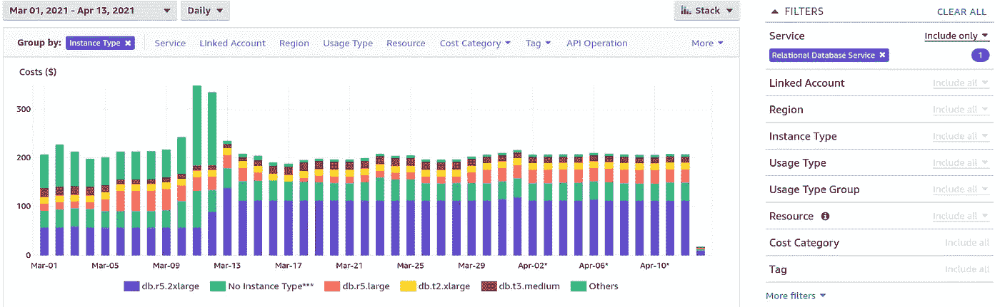

超过一半(111 美元/天)用于*r 5.2 x 大型*实例，这是我们的 Aurora RDS 生产集群，我们不打算在未来改变这种类型，因为它们非常适合我们的需求。因此，购买这种类型的保留实例是值得的，只需要找出我们需要多少实例。

## AWS 成本浏览器:RDS 无例程类型

第二大部分费用标记为“无实例类型”，37 美元/天。

为了便于理解，这里包含了从*实例类型*到*使用类型*中选择*组的依据*:

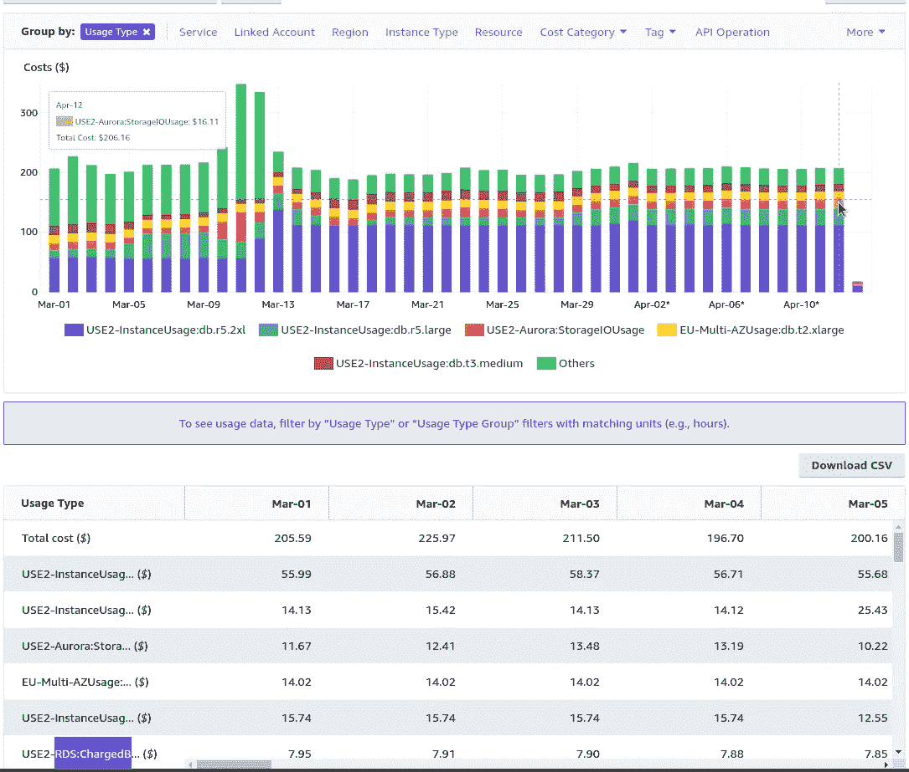

在这里，我们可以看到三种支付类型:`Aurora:StorageIOUsage` - 16 美元、`Multi-AZUsage:db.t2.xlarge` - 14 美元、`RDS:ChargedBackupUsage` - 8 美元，以及所有其他费用(也可查看[在 AWS Cost Explorer 中浏览数据的提示和技巧](https://aws.amazon.com/blogs/aws-cost-management/tips-and-tricks-for-exploring-your-data-in-aws-cost-explorer-part-2/))。

因为我们不能用保留的实例来减少它们，所以跳过这一部分。

回到 te *组:InstanceType* ，检查其他实例— *db.r5.large* 27 美元/天， *db.t2.xlarge* — 14 美元。

现在，转到您的 RDS 仪表板，数一数每种情况有多少:

*   db.r5.2xlarge:
*   美国-2 地区:生产集群，4 个实例+ Aurora ReadReplica 自动扩展
*   db.r5.large:
*   美国-2 区域:开发和阶段集群，4 个实例
*   db.t2.xlarge:
*   EU-3 区:我们的分析产品，1 台服务器

因此，让我们在俄亥俄州地区购买 4 个 **db.r5.2xlarge** 类型的实例，因为我们将计划在未来对它们进行更改。

## 大小灵活的保留数据库实例

查看文档[此处> > >](https://docs.aws.amazon.com/AmazonRDS/latest/AuroraUserGuide/USER_WorkingWithReservedDBInstances.html) 。

有一点值得一提:请记住，当您购买特定实例类型的预订时，在我们的情况下，这将是 *2xlarge* ，其折扣也将适用于整个 **db.r5** 系列，即当前使用的 *r5.large* 和 *r5.4xlarge* ，如果我们将来会使用它们。

在这方面，EC2 节约计划当然更容易和明显，我真的希望看到他们的 AWS RDS。

我们回去吃羊吧。

因此，我们的 Dev 和 Stage 集群可以更改其实例类型，所以让我们跳过它们—我们不会购买 r5.large 保留实例，但稍后我们将看到 r5.2xlarge 的折扣将如何应用于它们。

去比林斯:

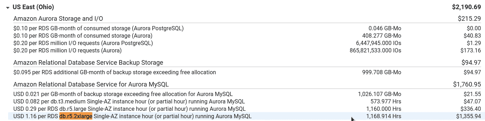

“每 RDS db . r 5.2x large 1.16 美元”，在 4 月的 13 天中，他们工作了 1168 小时，我们为此支付了 1355 美元—让我们计算一下

```
>>> 1355/1168.0
1.16
```

查看 [RDS 定价](https://aws.amazon.com/ru/rds/aurora/pricing/) — db.r5.2xlarge 每小时 1.16 美元，这里一切都是正确的。

一个月这样一个实例将花费我们:

```
>>> 1.16*24*30
835.19
```

每年:

```
>>> 1.16*24*30*364
304012.8
```

请记住这些数字，我们很快就会看到在预订实例购买过程中会出现什么提示。

# 购买 RDS 保留实例

转到 *RDS —保留实例*，点击*购买保留 DB 实例*:

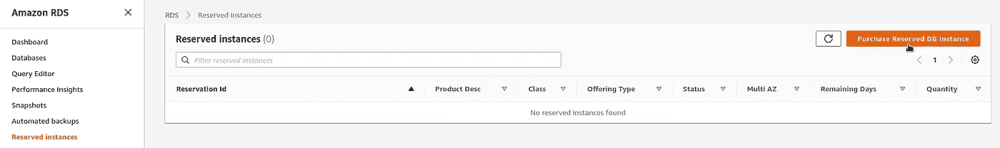

看一下定价— *db.r5.2xlarge* ，产品类型— *无预付款*:

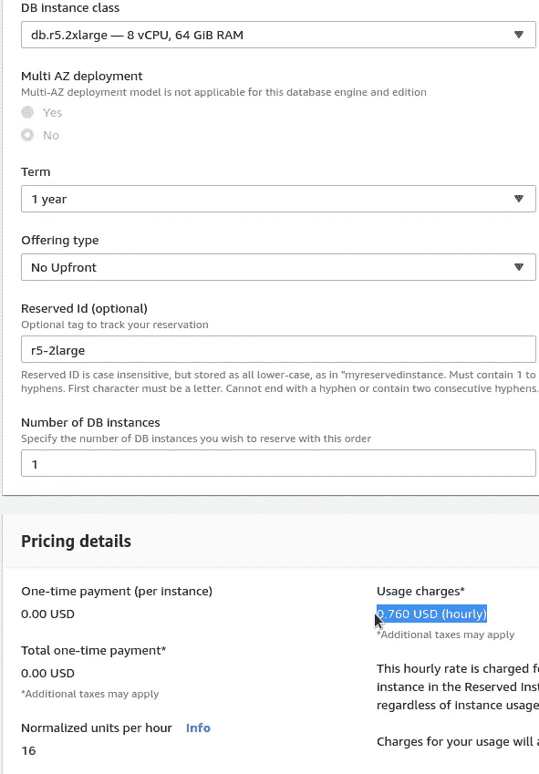

*0.760 美元(每小时)* —大约是每月 547 美元或每年 199180 美元(现在，根据我们上面的计算，我们相应地支付 835 美元和 30000 美元)。

如果选择*全部预付*，即预付下一年的费用，那么价格将是:

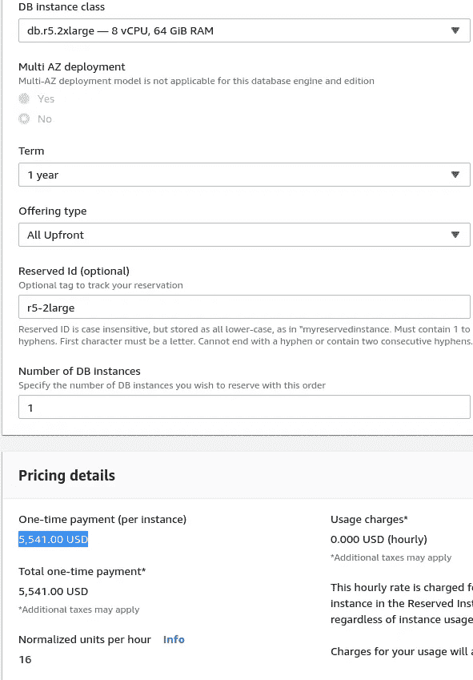

5，541.00 美元，或通过:

```
>>> 5541/364/24
0.63
```

每小时 0.63 美元——几乎是原价的两倍！

或者，您可以自己不去计算，只使用 [AWS 定价计算器](https://calculator.aws/#/createCalculator/AuroraMySQL)来查看使用*按需*时，一个实例将花费 846 美元:

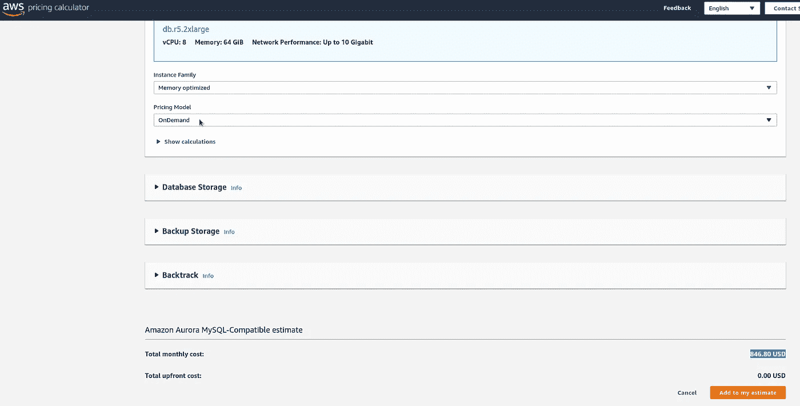

没有预付款的*—554 美元:*

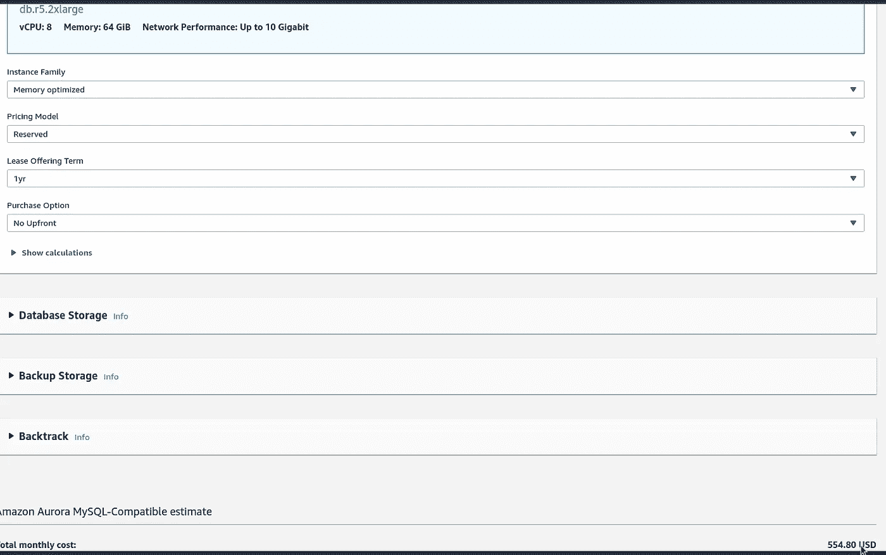

加上全部预付的*—每年 5541 英镑或每月 461 英镑:*

*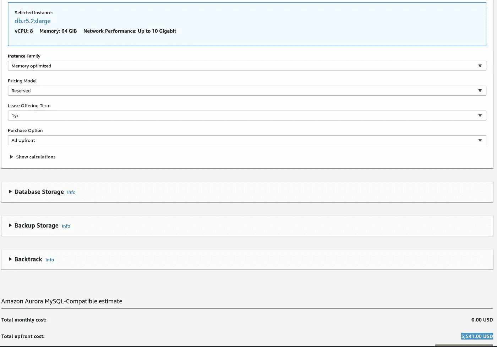*

*事实上，几乎和我们手工计算的数字一样。*

*最后，只需购买 4 个 r5.2xlarge 类型的实例:*

*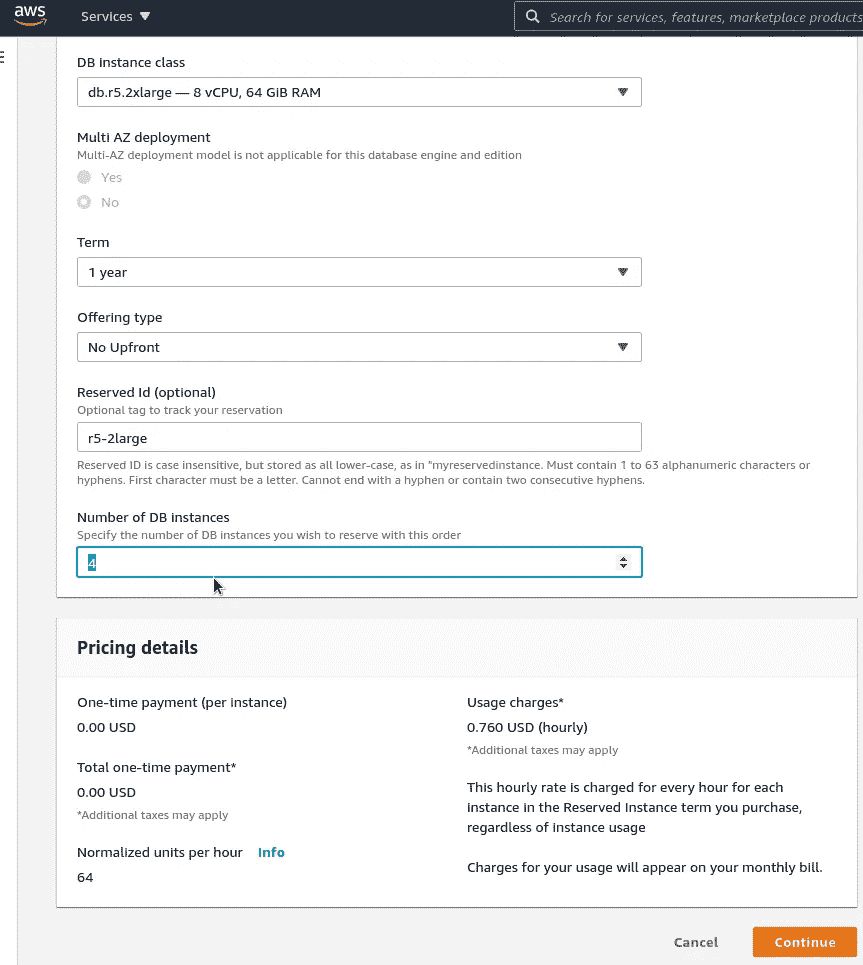**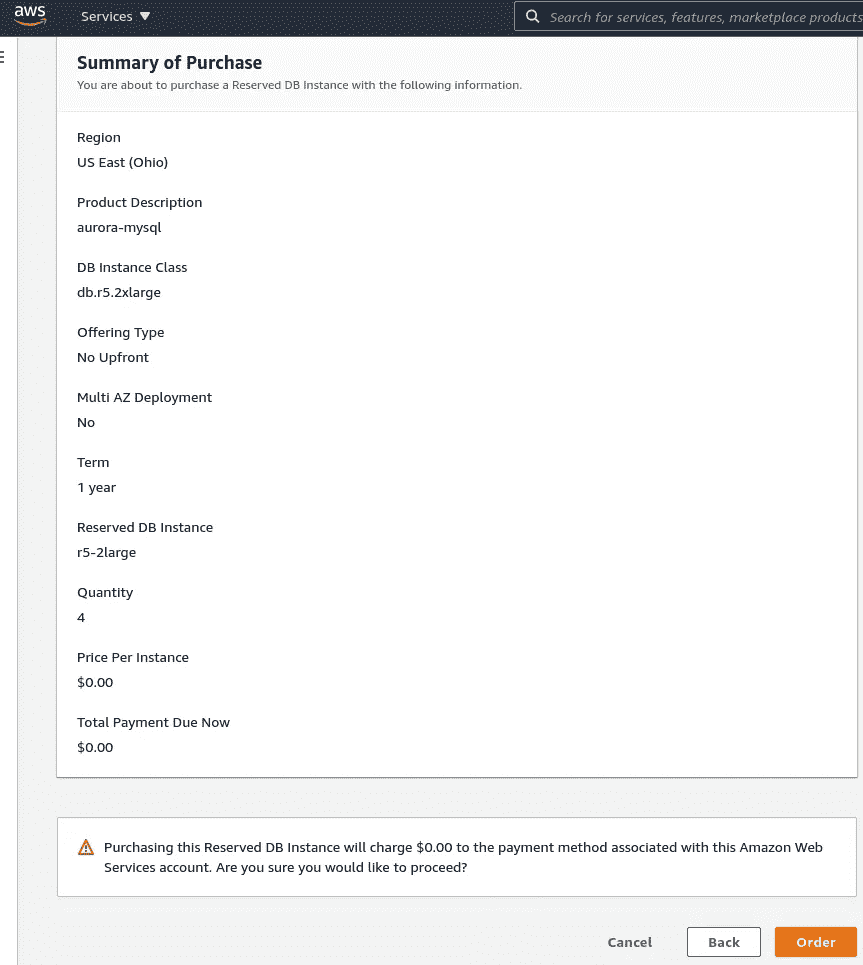*

*现在，让我们等几天，看看这将如何影响我们的账单。*

# *与 RDS 保留实例一起保存*

*第二天的第一个惊喜是，AWS 向我们收取了截至月底的预订费用，尽管在 [RDS 预订实例](https://docs.aws.amazon.com/AmazonRDS/latest/UserGuide/USER_WorkingWithReservedDBInstances.html)文档页面上没有提到这一点(甚至上面的截图也显示“将收取 0.00 美元”)，由于我们选择了“*无预付款*”选项，我预计它将像 EC2 节省计划一样按小时收费:*

*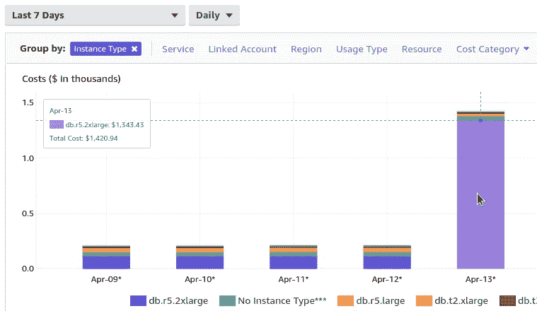*

*尽管如此，EC2 保留实例文档中还是提到了这一点:*

*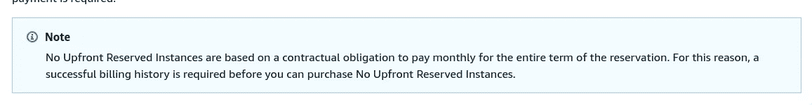*

*现在是 4 月 13 日，离月底还有 17 天，让我们再看看计算器:*

```
*>>> 1343/17/4/24.0
0.82
0.82 dollars.*
```

*如果减去预订未涵盖的所有其他实例类型每天大约 100 美元(参见下面 4 月 14 日的屏幕截图)，我们将从每个预订实例中获得 0.76 美元:*

```
*>>> (1343–100)/17/4/24.0
0.7616421568627452*
```

*因此，预订是有效的，这可以在 4 月 14 日的成本浏览器中看到:*

*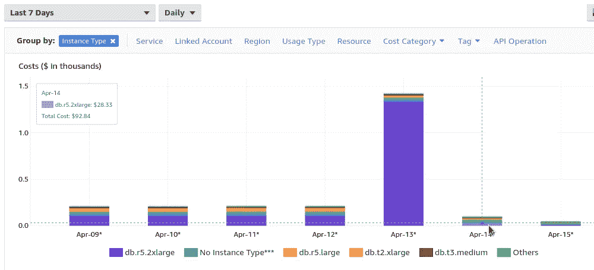*

*或者你可以切换到每小时的速度，甚至在第二天看到这一点。*

*此外，在 *AWS 成本管理>预订>利用率报告*中可以找到有用的图表，在这里您可以看到您的预订实例是如何被利用的:*

*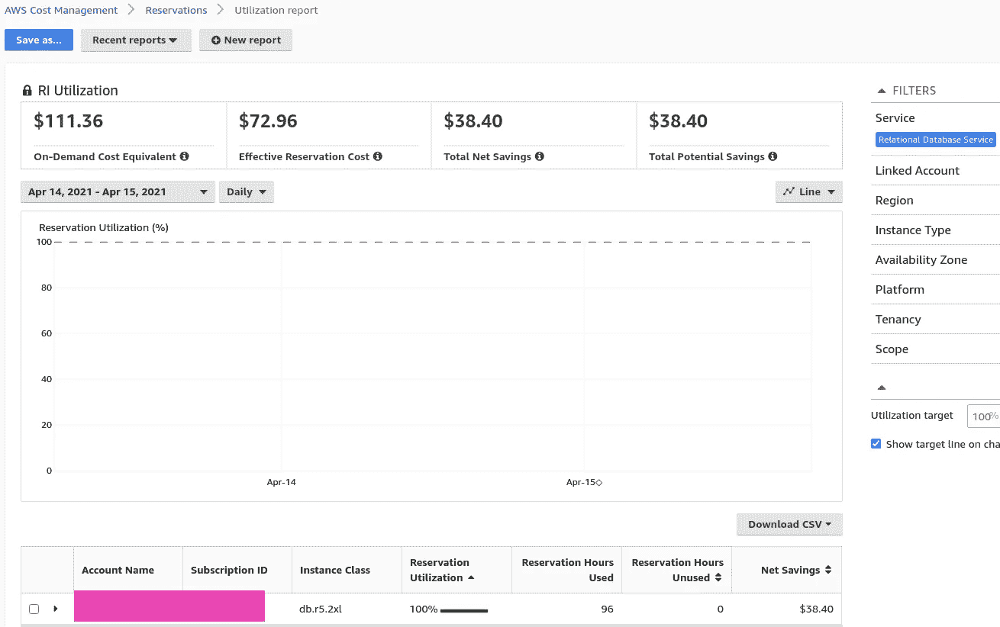*

*我们所有 4 个 r5.2xlarge 类型的实例都被 100%使用，这里我们还可以看到我们节省了多少钱:如果使用按需支付，我们每天将花费 111 美元，我们已经为预订支付了 72 美元，因此我们每天节省了整整 38 美元。*

*但是在*覆盖报告中，*我们可以发现我们覆盖了所有的 r5 实例，因为我们记得*大小灵活的保留数据库实例*应用于该区域的所有 r5，所以我们的部分保留被四个 r5 使用。大型实例:*

*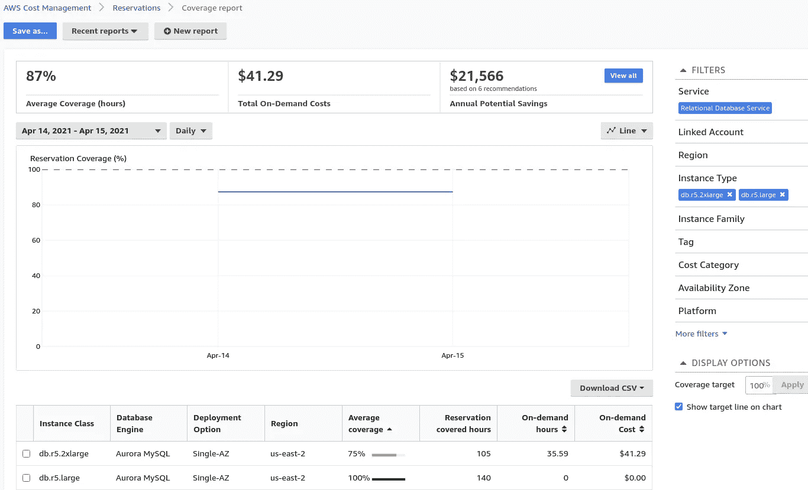*

*这也可以在*成本管理器运行时间成本和使用*中找到:*

*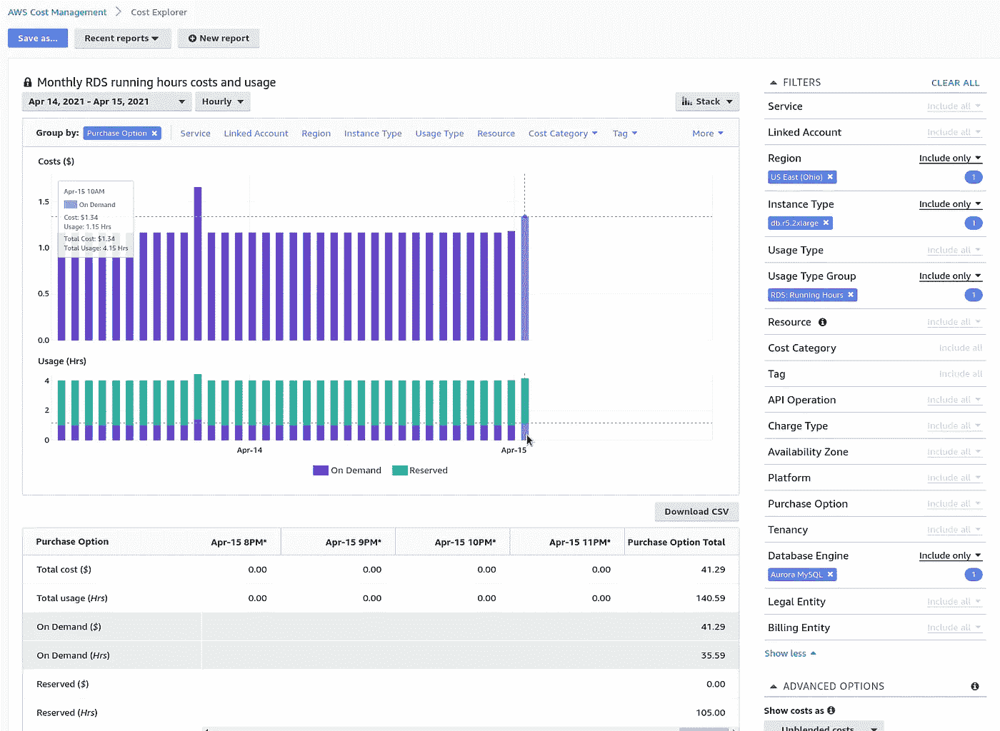*

*加上 Aurora 自动扩展，我们在 10-15 分钟内创建了一些短期实例，但它们是按小时计费的。*

*一般来说，RDS 保留实例对于省钱来说确实是一个有用的选择，尽管在某些地方不太明显和舒服。*

*EC2 储蓄计划要灵活得多，我们将在下面的帖子中谈到这一点。*

**最初发布于* [*RTFM: Linux、DevOps、系统管理*](https://rtfm.co.ua/en/draften-aws-optimizaciya-rasxodov-pokupka-i-analiz-rds-reserved-instances/) *。**