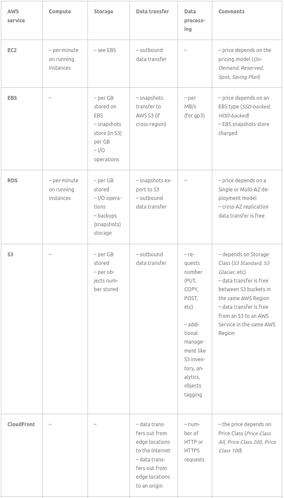
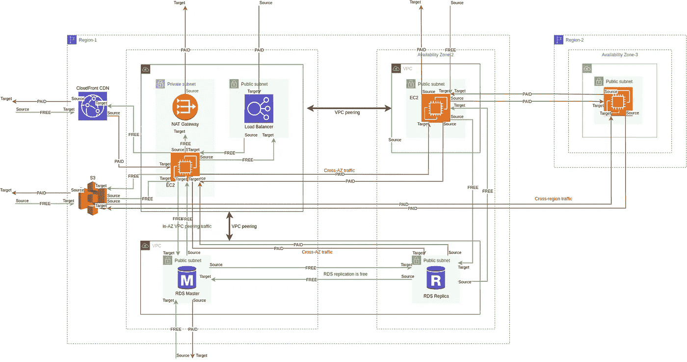

# AWS:成本优化—AWS 中的服务费用概述和流量成本

> 原文：<https://itnext.io/aws-cost-optimization-services-expenses-overview-and-traffic-costs-in-aws-eeab202df7ad?source=collection_archive---------3----------------------->

让我们继续我们的 AWS 成本优化主题之旅。之前的部分—[AWS:Cost Explorer—cloud watch 日志上的成本检查示例](https://rtfm.co.ua/en/aws-cost-explorer-costs-checking-on-the-cloudwatch-logs-example/)和 [AWS:成本优化—购买 RDS 预留实例](https://rtfm.co.ua/en/draften-aws-optimizaciya-rasxodov-pokupka-i-analiz-rds-reserved-instances/)。

基于云的架构的缺点之一是，与使用自己的裸机服务器相比，它的成本要高得多。这样，云提供商可能会有一个令人困惑的计费方案，你将为使用的资源、流量等付费。

因此，在本帖中，我们将尝试了解使用亚马逊网络服务时支付的费用，并在接下来的部分中检查有用的 AWS 服务，以通过 Cost Explorer、Trusted Advisor、Compute Optimizer、AWS Budget 等来控制和优化 AWS 环境。

*   [AWS 上的费用类别](https://rtfm.co.ua/en/aws-cost-optimization-services-expenses-overview-and-traffic-costs-in-aws/#Costs_categories_on_AWS)
*   [AWS 服务支付表](https://rtfm.co.ua/en/aws-cost-optimization-services-expenses-overview-and-traffic-costs-in-aws/#AWS_Services_payment_table)
*   [AWS 数据传输成本](https://rtfm.co.ua/en/aws-cost-optimization-services-expenses-overview-and-traffic-costs-in-aws/#AWS_Data_Transfer_Costs)
*   [通过互联网传输 AWS 数据](https://rtfm.co.ua/en/aws-cost-optimization-services-expenses-overview-and-traffic-costs-in-aws/#AWS_Data_Transfers_over_the_Internet)
*   [从互联网进入 AWS 的入站流量](https://rtfm.co.ua/en/aws-cost-optimization-services-expenses-overview-and-traffic-costs-in-aws/#Inbound_traffic_from_the_Internet_into_AWS)
*   [从 AWS 云到互联网的出站流量](https://rtfm.co.ua/en/aws-cost-optimization-services-expenses-overview-and-traffic-costs-in-aws/#Outbound_traffic_from_the_AWS_Cloud_to_the_Internet)
*   [AWS 云内部的数据传输成本](https://rtfm.co.ua/en/aws-cost-optimization-services-expenses-overview-and-traffic-costs-in-aws/#Data_Transfer_Costs_inside_of_the_AWS_Cloud)
*   [区域间数据传输](https://rtfm.co.ua/en/aws-cost-optimization-services-expenses-overview-and-traffic-costs-in-aws/#Inter-Region_data_transfers)
*   [AWS 区域和直连位置之间的数据传输](https://rtfm.co.ua/en/aws-cost-optimization-services-expenses-overview-and-traffic-costs-in-aws/#Data_transfers_between_AWS_Regions_and_Direct_Connect_locations)
*   [云锋边缘位置和 AWS 区域之间的数据传输](https://rtfm.co.ua/en/aws-cost-optimization-services-expenses-overview-and-traffic-costs-in-aws/#Data_transfers_between_CloudFront_Edge_locations_and_AWS_Regions)
*   [AWS 区域内的 AWS 数据传输](https://rtfm.co.ua/en/aws-cost-optimization-services-expenses-overview-and-traffic-costs-in-aws/#AWS_Data_transfer_inside_on_an_AWS_Region)
*   [AWS 流量计费图](https://rtfm.co.ua/en/aws-cost-optimization-services-expenses-overview-and-traffic-costs-in-aws/#AWS_traffic_billing_map)
*   [AWS 交通建议](https://rtfm.co.ua/en/aws-cost-optimization-services-expenses-overview-and-traffic-costs-in-aws/#AWS_traffic_advice)
*   [有用链接](https://rtfm.co.ua/en/aws-cost-optimization-services-expenses-overview-and-traffic-costs-in-aws/#Useful_links)

# AWS 上的成本类别

所有成本可分为三大类— *计算*、*存储、*和*数据传输*:

*   **计算**:对所使用的 CPU 和 RAM 容量的租金收费，价格取决于所使用的实例类型
*   **存储:**存储数据的费用
*   **数据传输**:在大多数情况下，入站流量或同一 AWS 区域内服务之间的流量是免费的，但有例外情况。实际上，AWS 上的流量成本将在本次更新的 [AWS 数据传输成本](https://rtfm.co.ua/?p=27194#AWS_Data_Transfer_Costs)部分详细描述

我还要为数据处理添加另一个类别:这将包括 AWS 服务的 HTTP(S)请求和数据处理费用。

了解了这些类别，就很容易理解你在 AWS 上支付什么了。

让我们仔细看看服务示例:

*   计算:
*   实例使用时间( *EC2，RDS，红移*)
*   无服务器计算*(λ*)
*   T 系列实例的 CPU 信用使用(“*T2/T3/т4 无限模式*”)(*EC2、RDS、红移*)
*   支付类型—按需、即期、预约等( *EC2、RDS* )
*   部署类型—一个或多个可用性区域( *RDS* )
*   实例类型及其 CPU 和 RAM 容量
*   存储:
*   弹性块存储(EBS):
*   许多读/写操作
*   使用的数据存储
*   数据传送
*   快照商店(按 S3 价格)
*   磁盘类型—固态硬盘、硬盘
*   简单商店服务(S3):
*   存储类型(*标准，不常访问，冰川*)
*   存储的对象数
*   数据传输:
*   发送的数据( *NAT 网关、负载平衡器、EC2/EBS、S3* )
*   数据处理:
*   大量接收和/或处理的数据( *Kinesis、CloudWatch 日志)*
*   许多已处理的 HTTP(S)请求( *CloudFront，API Gateway* )

此外，我们还会为以下项目收取额外费用:

*   对 AWS API 的 API 请求(CloudWatch 指标收集、CloudTrail 事件)
*   AWS 市场许可证
*   以及特定于 AWS 服务的额外费用，如 AWS WAF WebACL 中的许多规则，这些规则会影响 WAF 费用、RDS Insights、EC2 的扩展 CloudWatch 监控等

## AWS 服务付款表

让我们将主要的 AWS 服务收集到一个表格中，看看我们在使用服务时支付了多少费用:

# AWS 数据传输成本

让我们来讨论最有趣的话题:当我们在 AWS 上发送流量时，我们在支付什么？。

一般来说，AWS 上的流量可以分为两部分——亚马逊网络服务和互联网之间的流量，以及 AWS 网络内部的流量。此外，流量价格可能会因其方向而异—进入同一个或另一个可用区域、AWS VPC 或 AWS 区域。

所以，请记住:

*   对于具有弹性网络接口(EC2、ALB)的所有服务，将对所有出站流量收费
*   所有跨可用性区域流量
*   所有跨区域流量

## 网络上的自动气象站数据传输

## 从互联网进入 AWS 的入站流量

几乎所有从互联网进入 AWS 云的流量都是免费的。

反之亦然——几乎所有的出站流量都要花费我们一些钱。

## 从 AWS 云到互联网的出站流量

从 AWS 帐户到互联网的传出流量将按 AWS 地区价格计费，因为它们是不同的。参见[亚马逊 EC2 按需定价>数据传输](https://aws.amazon.com/ec2/pricing/on-demand/) — *数据从互联网传入亚马逊 EC2*和*数据从亚马逊 EC2 传出互联网*。

此外，当 AWS 向您收取出站流量费用时，它将汇总您帐户中以下服务的出站流量:

*   亚马逊 RDS
*   亚马逊红移
*   亚马逊 SES
*   亚马逊 SimpleDB
*   亚马逊 EBS
*   亚马逊 S3
*   亚马逊冰川
*   亚马逊 SQS
*   AWS 存储网关
*   亚马逊社交网络
*   亚马逊 DynamoDB
*   亚马逊云观察日志

## AWS 云内部的数据传输成本

## 区域间数据传输

AWS 地区之间的数据传输将按照源地区的价格收费。在从亚马逊 EC2 到的*数据传输中的[亚马逊 EC2 按需定价>数据传输](https://aws.amazon.com/ec2/pricing/on-demand/)页面上的同一个表格中，您可以看到每个地区的价格。*

例如，我们在 *us-east-2* 、 *Ohio* 中有一个 S3 存储桶，它将 S3 复制配置到 *us-west-1* 、 *N. California* 中的一个存储桶，有关更多详细信息，请参见 [AWS:设置了删除标记的 S3 跨区域复制](https://rtfm.co.ua/en/aws-s3-cross-region-replication-configuration-and-objects-deletemarkers-replication/)。那样的话，我们将按照俄亥俄州 us-east-2*的价格收费。*

## AWS 区域和直接连接位置之间的数据传输

虽然主要规则是传入流量是免费的，但对于直接连接有一个例外，因为它的传入流量将被收费，并取决于源和目标地区的价格。参见[AWS 直连的数据传输输出(DTO)定价](https://aws.amazon.com/directconnect/pricing/)。

例如，从俄亥俄州到加利福尼亚州北部的直接连接的数据传输费用为每 GB 0.0200 美元，从俄亥俄州到爱尔兰，eu-west-1-发送每 GB 0.0282 美元。

## CloudFront Edge 位置和 AWS 区域之间的数据传输

CloudFront 的边缘位置是 AWS 数据中心，用于存储从 origins 获得的信息。

在这里，我们支付:

1.  从边缘位置到互联网的数据传输
2.  从边缘位置到原点的数据传输
3.  处理的 HTTP(S)请求数

同样，价格将取决于来源和目标地区，更多信息请参见[亚马逊 CloudFront 定价](https://aws.amazon.com/cloudfront/pricing/)。

## 自动气象站区域内的自动气象站数据传输

当 AWS 服务在同一个 AWS 区域的边界内通信时，一些流量也可能被收费。

*   Amazon EC2、AWS containers、Amazon RDS、Amazon Redshift、Amazon DynamoDB Accelerator (DAX)、Amazon ElastiCache 实例或不同可用性区域之间的弹性网络接口之间的数据传输，无论是通过公共或私有 IP 发送，还是使用弹性 IPv4 发送，双向费用均为每 GB 0.01 美元

例如，我们将 500 GB 从 VPC-1 中的红移集群发送到同一个 VPC 但相邻的可用性区域中的 EC2 实例，在这种情况下，我们将为 VPC-1 的传出流量收取 5 美元，为 VPC-2 的传入流量收取 5 美元。

*   使用公共 IP 或弹性 IP 在同一可用性区域 VPC 的 EC2 实例、容器或弹性网络接口之间传输数据，每个方向的费用为每 GB 0.01 美元

如果您有两个 EC2，每个 EC2 都有自己的弹性 IP——那么我们将为数据传输付费。

*   使用私有 IP 在相同可用性区域和相同 VPC 中的 EC2 实例、容器或弹性网络接口之间传输数据是免费的

这里很简单:只在 VPC 内部使用私有 IP，不要通过 AZ-borders——你不用支付任何费用。

*   不受可用性区域或 VPC 限制的 AWS 服务(如 AWS S3、DynamoDB、SES、Kinesis 等)与同一 AWS 区域内的 EC2 实例或其他服务之间的数据传输是免费的

此外，对于使用多 AZ 部署的服务，如亚马逊 Aurora、亚马逊 Neptune 和亚马逊 RDS，一些跨 AZ 流量是免费的。

此外，同一 AWS 区域中的传统或应用负载平衡器和 EC2 之间的流量是免费的。

## AWS 流量计费地图

在写这篇文章的时候，我在谷歌上搜索了很多次，没有找到类似地图的东西，上面有 AWS 交通费用的说明性演示。我唯一找到的是 AWS 博客上关于通用架构数据传输成本的概述。

因此，在下面的方案中，我试图展示哪些流量将在 AWS 上计费:

让我们从一个“入口点”开始一步一步地检查它，即 Region-1 和 AZ-1 中的负载平衡器。

**区域 1，可用性区域 1:**

1.  LoadBalencer 传入流量是收费的(因为 [LCU](https://aws.amazon.com/ru/elasticloadbalancing/faqs/) 包括处理的字节)
2.  然后，从 ALB 到 EC2 的流量是免费的
3.  EC2 通过 NAT 网关发送响应，在此期间，EC2 和 NAT GW 之间的数据传输是免费的，但 NAT GW 的传出流量将被计费
4.  EC2 将数据发送到同一个 AWS 区域中的 CloudFront Edge 位置，这是免费的，但是从 CloudFront 向访问者发送数据是收费的
5.  从 CloudFront Edge 位置到 EC2 的数据流量将被计费
6.  EC2 和同一地区的 S3 之间的数据传输是免费的
7.  EC2 通过 VPC 对等连接与同一个 AZ 中的 RDS 主实例对话——这也是免费的
8.  EC2 通过 VPC 对等连接与另一个 AZ 中的 RDS 从属设备对话，这将被计费(跨 AZ)
9.  同一 AWS 区域中 RDS 主设备及其 RDS 从设备之间的复制流量是免费的

**区域 1，可用性区域 2:**

1.  从 AZ-2 中的 EC2 到 AZ-1 中的 EC2 的数据流量被计费，因为它是跨 AZ 流量
2.  AZ-2 中 EC2 和 RDS 从站之间的通信是免费的
3.  但是来自 EC2 和 RDS 主机的流量将被计费，因为它也是跨 AZ 的

**区域 2，可用性区域 3:**

1.  从该区域中的 EC2 到区域-1 中的 EC2 的输出流量将被计费，因为这是跨区域传输
2.  从该区域中的 EC2 到区域-1 中的 S3 桶的输出流量将被计费，因为这是跨区域传输

## AWS 交通建议

*   尽量将所有工作负载放在同一个 AWS 区域，如果需要使用另一个区域，请选择价格最低的区域
*   尝试将所有工作负载保持在同一个可用性区域和 VPC 中，并使用私有 IP 进行连接
*   避免使用 NAT 网关，因为它是按传出流量计费的。尽可能使用互联网网关
*   如果您需要向用户发送数据，请使用 CloudFront 这将比直接从 EC2 实例发送流量更快，费用更低

# 有用的链接

*   [AWS 定价如何运作](https://d1.awsstatic.com/whitepapers/aws_pricing_overview.pdf)
*   [AWS 定价如何优化和节省您的 IT 成本](https://aws.amazon.com/ru/aws-cost-management/aws-cost-optimization/?track=costma)
*   [如何在我的账单上计算 Amazon EBS 卷的费用？](https://aws.amazon.com/premiumsupport/knowledge-center/ebs-volume-charges/)
*   [常见架构的数据传输成本概述](https://aws.amazon.com/ru/blogs/architecture/overview-of-data-transfer-costs-for-common-architectures/)
*   [AWS T3 实例定价终极指南](https://cloudsoft.io/blog/the-ultimate-guide-to-aws-t3-instances-pricing)
*   [全面了解 AWS 数据传输成本的指南](https://mulupuru.medium.com/your-comprehensive-guide-to-understanding-aws-data-transfer-costs-f5c8241d65ed)
*   [AWS 数据转移定价:降低意外成本的 7 种方法](https://www.cloudzero.com/blog/reduce-data-transfer-costs)
*   [AWS 应用负载平衡器成本估算](https://cloudsoft.io/blog/aws-alb-cost-estimation)
*   [AWS 数据转移定价和保存指南](https://www.cloudbolt.io/guide-to-aws-cost-optimization/aws-data-transfer-pricing/)
*   [使用 t3 实例时控制成本](https://advancedweb.hu/keep-costs-under-control-when-using-t3-instances/)

*最初发布于* [*RTFM: Linux、DevOps、系统管理*](https://rtfm.co.ua/en/aws-cost-optimization-services-expenses-overview-and-traffic-costs-in-aws/) *。*