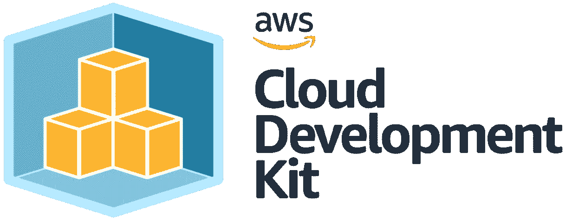

# AWS EKS 101:创建集群和部署应用程序

> 原文：<https://itnext.io/aws-eks-101-creating-a-cluster-and-deploying-an-app-9608a1cac016?source=collection_archive---------6----------------------->



AWS CDK

在本文中，我将向您展示如何使用 AWS CDK 创建 AWS EKS 集群并在其上部署应用程序。我们将为我们的 EKS 集群使用 Fargate 启动类型，这允许我们运行我们的容器，而不必管理底层 EC2 实例。

首先，我们将从 AWS CDK 导入必要的库，包括`aws_eks`和`core`模块。然后，我们将创建一个新的 CDK 堆栈，并为我们的 EKS 集群定义一个新的 VPC。这个 VPC 将为我们的集群提供网络基础设施，并允许我们的容器相互通信以及与外界通信。

接下来，我们将创建 EKS 集群本身，指定 Kubernetes 版本和我们刚刚创建的 VPC。我们还将为集群创建一个新的 Fargate 概要文件，它将指定集群中的哪些名称空间能够运行 Fargate 任务。

一旦我们的集群建立起来，我们将使用`eks_patterns.Deployment`类在集群上创建一个新的部署。这个部署将基于我们将指定的 Docker 映像，并且我们还将为我们的容器设置内存限制。

最后，我们将把部署公开为负载平衡服务，这将允许客户端通过网络访问我们的应用程序。该服务将自动向负载平衡器注册，并可通过 AWS CDK 为我们生成的 DNS 名称进行访问。

该代码将创建一个新的 EKS VPC 集群、Fargate 概要文件以及集群上的部署。然后，它会将部署公开为一个负载平衡的服务，可供客户端访问。

```
# Import the necessary libraries
from aws_cdk import (
    aws_eks as eks,
    core
)

# Create a new CDK stack
class MyStack(core.Stack):
    def __init__(self, scope: core.Construct, id: str, **kwargs):
        super().__init__(scope, id, **kwargs)

        # Create a new VPC for the EKS cluster
        vpc = ec2.Vpc(self, "MyVpc",
            cidr="10.0.0.0/16",
            max_azs=2
        )

        # Create the EKS cluster
        cluster = eks.EksCluster(self, "MyEksCluster",
            vpc=vpc,
            version=eks.KubernetesVersion.V1_18
        )

        # Create a new Fargate profile for the EKS cluster
        fargate_profile = cluster.add_fargate_profile("MyFargateProfile",
            selectors=[{
                "namespace": "default"
            }]
        )

        # Create a new deployment with the specified image
        app = eks_patterns.Deployment(self, "MyApp",
            cluster=cluster,
            image=ecr_assets.DockerImageAsset(self, "MyImage",
                directory="path/to/image/directory"
            ),
            memory_limit_mib=256
        )

        # Expose the deployment as a load-balanced service
        service = app.expose_as_load_balanced_service(
            self, "MyService",
            port=80,
            target_port=8080
        )
```

一旦您创建了一个 EKS 集群，您也可以使用 Kubernetes `kubectl`命令行工具将您的应用程序部署到其上。

首先，您需要将`kubectl`命令行工具认证到您的 EKS 集群。您可以通过运行以下命令来做到这一点，将`CLUSTER_NAME`替换为您的 EKS 集群的名称，将`REGION`替换为您的集群所在的区域:

```
aws eks --region REGION update-kubeconfig --name CLUSTER_NAME
```

一旦`kubectl`通过了 EKS 集群的认证，就可以使用`kubectl apply`命令将应用程序部署到集群。例如，如果您有一个名为`deployment.yaml`的 Kubernetes 部署配置文件，您可以通过运行以下命令将您的应用程序部署到 EKS 集群:

```
kubectl apply -f deployment.yaml
```

运行该命令后，您的应用程序应该已经部署并运行在您的 EKS 集群上。您可以通过使用`kubectl get`命令查看您的部署状态来验证这一点。例如，您可以运行以下命令来查看 EKS 集群中所有部署的状态:

```
kubectl get deployments
```

总之，我们已经看到了使用 AWS CDK 创建 AWS EKS 集群并在其上部署应用程序是多么容易。通过使用 Fargate 启动类型，我们能够运行我们的容器，而不必管理底层 EC2 实例。我们还了解了如何使用 kubectl 命令行工具对 EKS 集群进行身份验证，并在其上部署我们的应用程序。

借助 EKS，您可以在 AWS 上轻松构建和运行可伸缩、安全的容器化应用程序。如果您不熟悉 EKS 和 Kubernetes，我希望这篇文章为您提供了一个使用这些技术的良好起点。感谢您的阅读！

如果你喜欢这篇文章，我想你会想看看我的另一篇也与这个话题相关的文章:

[如何创建多堆栈 AWS CDK (Python)基础设施代码(IaC)项目| mer KARABACAK | it next(medium.com)](https://medium.com/itnext/how-to-create-a-multiple-stacks-aws-cdk-python-infrastructure-as-code-iac-project-e8a8defcd209)

**支持媒体和我:)**https://omerkarabacak.medium.com/membership