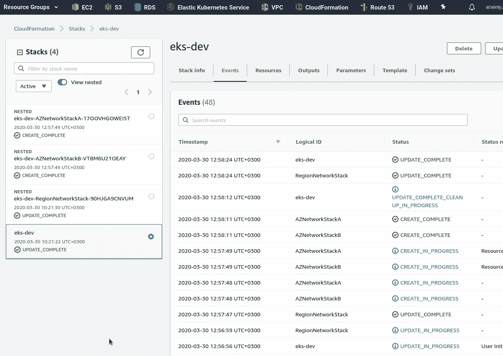
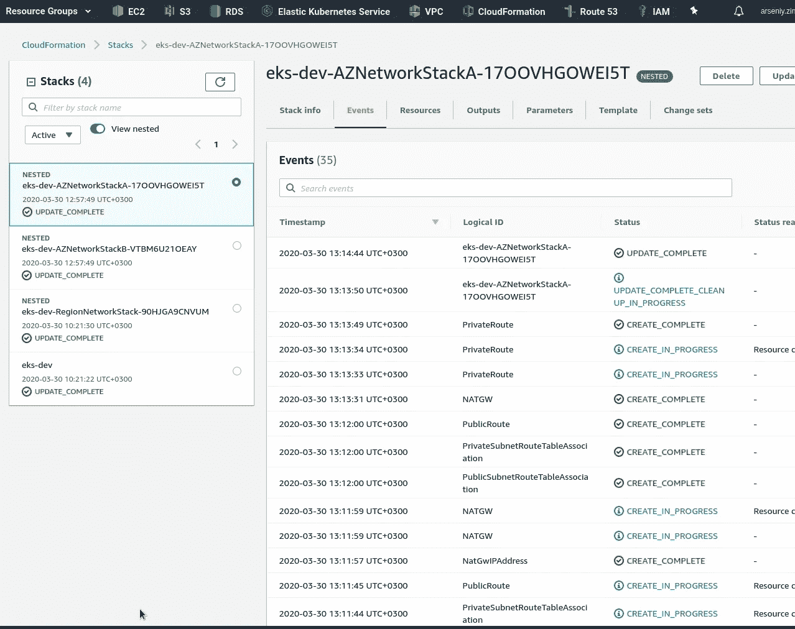
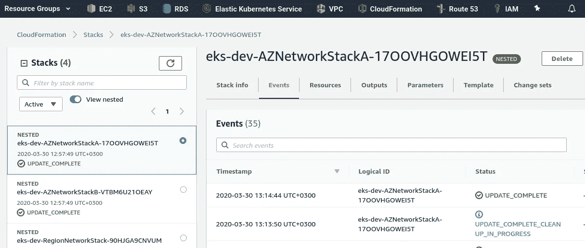
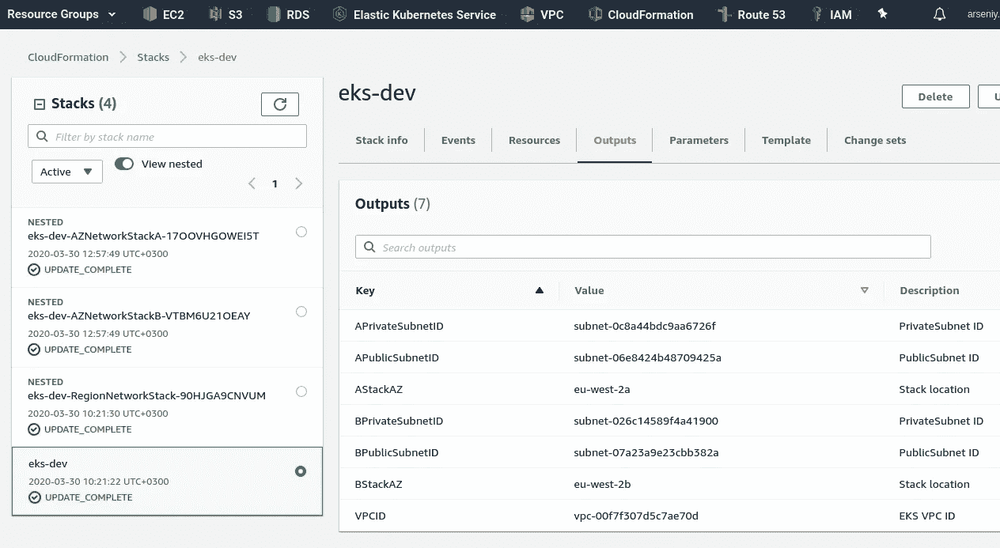
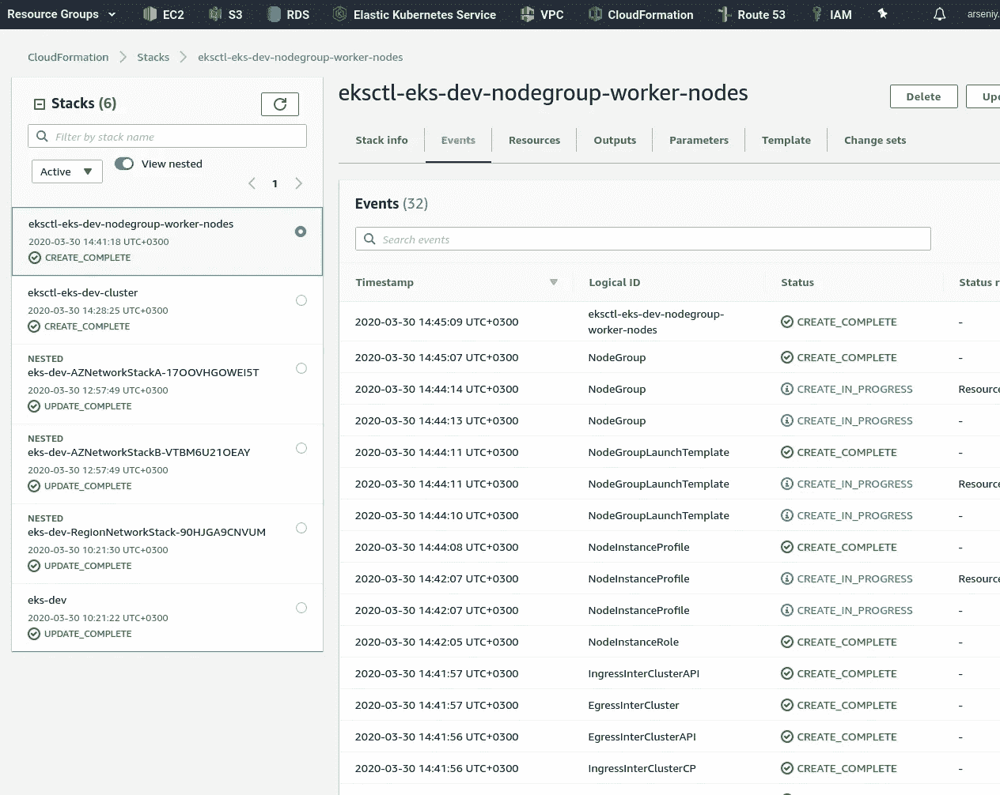

# AWS 弹性 Kubernetes 服务:集群创建自动化，第 1 部分—云形成

> 原文：<https://itnext.io/aws-elastic-kubernetes-service-a-cluster-creation-automation-part-1-cloudformation-55ea2d9e283f?source=collection_archive---------4----------------------->


任务是:创建自动化来从头开始部署 AWS 弹性 Kubernetes 服务集群。

将使用:

*   Ansible:自动创建 CloudFormation 堆栈，并使用必要的参数执行`eksctl`
*   [使用嵌套堆栈形成云](https://rtfm.co.ua/en/aws-cloudformation-nested-stacks-and-stacks-parameters-import-export/):创建基础设施— VPC、子网、安全组、IAM 角色等
*   `eksctl`:使用 CloudFormation 创建的资源创建集群本身

思路是:

1.  Ansible 将使用 [cloudformation 模块](https://rtfm.co.ua/ansible-modul-cloudformation/)创建一个基础设施
2.  通过使用 CloudFormation 创建的堆栈中的`Outputs`, ansi ble 将为`eksctl`生成一个配置文件
3.  Ansible 调用`eksctl`传递配置文件，并将创建一个集群

选择`eksctl`首先是因为时间不够，其次是因为它使用了 CloudFormation，这在我的项目中使用了很长时间，所以我们所有的基础设施都将保持同构状态。

Ansible 将使用带有 AWS CLI、Ansible 和`eksctl`的 Docker 映像运行 ma Jenkins 作业。

实际上，不要认为这篇文章是这种自动化的某种“最佳实践”,相反，它更像是一个概念的证明，更多的是一个例子，说明头脑中的一些模糊想法是如何变成实际工作代码和服务的。到底用什么工具——terra formилиcloud formation，`[kops](https://github.com/kubernetes/kops)`还是`[eksctl](https://github.com/weaveworks/eksctl)`是次要问题。

此外，Ansible 有两个模块可以使与 Kubernetes 的工作更容易——`[k8s](https://docs.ansible.com/ansible/latest/modules/k8s_module.html)`和`[kubectl](https://docs.ansible.com/ansible/latest/plugins/connection/kubectl.html)`,但是它们都有状态*预览*和*社区*,所以我在这里不使用它们。

帖子真的很长，所以分为两部分:

*   在这一个，第一个，我们将开始写一个 CloudFromation 模板
*   在第二部中——将开始编写可行的剧本和角色来运行云编队和`eksctl`

我希望不会有太多的不准确之处，但仍然有可能，因为这是在几天内写的，经过了反复的更正和修改，但它是一步一步描述的，所以总的想法必须足够明显。

写完这篇文章后得到的所有文件都可以在 [eksctl-cf-ansible](https://github.com/setevoy2/eksctl-cf-ansible/tree/rdy) Github 资源库中找到。此处的链接指向一个分支，它与下面的代码完全相同。

第二部分 AWS 弹性 Kubernetes 服务:集群创建自动化，第二部分— Ansible，eksctl 。

**内容**

*   [云形成堆栈](https://rtfm.co.ua/en/aws-elastic-kubernetes-service-a-cluster-creation-automation-part-1-cloudformation/#CloudFormation_stacks)
*   [根栈](https://rtfm.co.ua/en/aws-elastic-kubernetes-service-a-cluster-creation-automation-part-1-cloudformation/#The_Root_stack)
*   [参数](https://rtfm.co.ua/en/aws-elastic-kubernetes-service-a-cluster-creation-automation-part-1-cloudformation/#Parameters)
*   [网络区域堆栈](https://rtfm.co.ua/en/aws-elastic-kubernetes-service-a-cluster-creation-automation-part-1-cloudformation/#The_Network_Region_stack)
*   [VPC](https://rtfm.co.ua/en/aws-elastic-kubernetes-service-a-cluster-creation-automation-part-1-cloudformation/#VPC)
*   [互联网网关](https://rtfm.co.ua/en/aws-elastic-kubernetes-service-a-cluster-creation-automation-part-1-cloudformation/#Internet_Gateway)
*   [网络可用性区域堆栈](https://rtfm.co.ua/en/aws-elastic-kubernetes-service-a-cluster-creation-automation-part-1-cloudformation/#Network_AvailabilityZones_stack)
*   [参数](https://rtfm.co.ua/en/aws-elastic-kubernetes-service-a-cluster-creation-automation-part-1-cloudformation/#Parameters-2)
*   [子网](https://rtfm.co.ua/en/aws-elastic-kubernetes-service-a-cluster-creation-automation-part-1-cloudformation/#Subnets)
*   [NAT 网关](https://rtfm.co.ua/en/aws-elastic-kubernetes-service-a-cluster-creation-automation-part-1-cloudformation/#NAT_Gateway)
*   [公共路由表](https://rtfm.co.ua/en/aws-elastic-kubernetes-service-a-cluster-creation-automation-part-1-cloudformation/#Public_RouteTable)
*   [私有路由表](https://rtfm.co.ua/en/aws-elastic-kubernetes-service-a-cluster-creation-automation-part-1-cloudformation/#Private_RouteTable)
*   [子网的映射和 CIDRs】](https://rtfm.co.ua/en/aws-elastic-kubernetes-service-a-cluster-creation-automation-part-1-cloudformation/#Mappings_and_CIDRs_for_subnets)
*   [eksctl —堆栈创建](https://rtfm.co.ua/en/aws-elastic-kubernetes-service-a-cluster-creation-automation-part-1-cloudformation/#eksctl_%E2%80%93_a_stack_creation)

## 云形成堆栈

所以，让我们从云形成堆栈开始。

我们需要创造:

*   1 VPC
*   应用程序负载平衡器、堡垒主机、互联网网关的两个公共子网
*   Kubernetes 工作节点 EC2、NAT 网关的两个专用子网

EKS AMI 对于 Kubernetes 的工人节点`eksctl`会自动选择，但是你可以在这里找到整个列表[>>>](https://docs.aws.amazon.com/eks/latest/userguide/eks-optimized-ami.html)。

此处将使用 CloudFormation 嵌套堆栈(更多详情参见[AWS:cloud formation-嵌套堆栈和堆栈参数导入/导出](https://rtfm.co.ua/en/aws-cloudformation-nested-stacks-and-stacks-parameters-import-export/)):

1.  “**根栈**”，一个模板文件`eks-root.json`——将描述要创建的栈，确定参数等
2.  **区域-堆栈**，模板文件`eks-region-networking.json`:
3.  一个 VPC
4.  互联网网关
5.  互联网网关协会
6.  “**AvailabilityZones-stack**”，一个模板文件`eks-azs-networking.json` -所有资源将在一个区域的两个不同 availability zones 上复制:
7.  一个公共子网
8.  一个专用子网
9.  公共子网的路由表
10.  通过互联网网关进入 0.0.0.0/0 网络的路由
11.  和 SubnetRouteTableAssociation 将该路由表附加到该可用性区域中的公共子网
12.  专用子网的路由表
13.  通过 NAT 网关进入 0.0.0.0/0 网络的路由
14.  SubnetRouteTableAssociation 将此路由表附加到此可用性区域中的专用子网
15.  NAT 网关
16.  NAT 网关的弹性 IP

继续使用根栈模板。

## 根堆栈

根栈将使用第一个模板来创建所有其他栈。

为未来的角色创建目录:

```
$ mkdir -p roles/cloudformation/{tasks,files,templates}
```

在`roles/cloudformation/files/`目录中创建一个新文件`eks-root.json` -这将是我们的根模板:

```
$ cd roles/cloudformation/files/
$ touch eks-root.json
```

**参数**

这是一个好主意，想想你的未来的 IP 地址块，将在您的项目中使用。至少你需要避免使用重叠的网络块来防止 [VPN 对等](https://rtfm.co.ua/aws-nastrojka-vpc-peering/)问题。

第二件要考虑的事情是为您的集群和网络插件使用一个完整的网络模型。

默认情况下，AWS 弹性 Kubernetes 服务使用 CNI ( *容器网络接口*)插件，该插件允许使用工人节点ес2 网络接口(ENI — *弹性网络接口*)。通过使用这个插件，Kubernetes 将从 VPC 池中分配 IP 地址给创建的 Pod，参见`[amazon-vpc-cni-k8s](https://rtfm.co.ua/goto/https://github.com/aws/amazon-vpc-cni-k8s)`和 [Pod 网络(CNI)](https://rtfm.co.ua/goto/https://docs.aws.amazon.com/eks/latest/userguide/pod-networking.html) 。

这个解决方案有一些优点和缺点，请查看 Weave Net 的概述— [AWS 和 Kubernetes 网络选项和权衡](https://rtfm.co.ua/goto/https://www.weave.works/blog/aws-and-kubernetes-networking-options-and-trade-offs-part-3)，并阅读 Kubernetes 文档中的其他插件— [集群网络](https://rtfm.co.ua/goto/https://kubernetes.io/docs/concepts/cluster-administration/networking/)。

此外，值得查看 [VPC 和子网规模](https://docs.aws.amazon.com/vpc/latest/userguide/VPC_Subnets.html#VPC_Sizing)文档。

现在，我们只为 VPC 添加 *10.0.0.0/16* 地址块，稍后它将被划分为 4 个子网:

```
{
  "AWSTemplateFormatVersion": "2010-09-09",
  "Description": "AWS CloudFormation stack for Kubernetes cluster",

  "Parameters": {

    "VPCCIDRBlock": {
      "Description": "VPC CidrBlock",
      "Type": "String",
      "Default": "10.0.0.0/16"
    }

  },
```

子网将是下一个:

*   可用区域 1-а/20，4094 地址中的一个公共地址
*   可用区域 1-а/20，4094 地址中的一个私有地址
*   可用区域 1-в/20，4094 个地址中的一个公共地址
*   可用区域 1-в/20，4094 地址中的一个私有地址

这里可以使用`[ipcalc](https://linux.die.net/man/1/ipcalc)`:

```
$ ipcalc 10.0.0.0/16 -s 4094 4094 4094 4094 | grep Network | cut -d" " -f 1,4 | tail -4
Network: 10.0.0.0/20
Network: 10.0.16.0/20
Network: 10.0.32.0/20
Network: 10.0.48.0/20
```

4094 地址必须足够所有 eс2 实例和 pod 使用。

在这篇文章中，我在这里找到了最好的子网计算器[。](http://www.subnetmask.info)

另外，添加一个 *EKSClusterName* 参数—我们将从 Ansible 这里传递一个集群名称，以创建必要的 CloudFormation 标签:

```
...
    "EKSClusterName": {
      "Description": "EKS cluster name",
      "Type": "String"
    } 
...
```

## 网络区域堆栈

现在我们可以为第二个堆栈创建一个模板。姑且称之为`eks-region-networking.json`。

**VPC**

在这个模板中，我们将描述我们的 VPC，并且从根模板将传递一个带有 VPC CIDR 的参数，并返回到根模板—通过`Outputs`将传递回所创建的 VPC 的 ID:

```
{
  "AWSTemplateFormatVersion" : "2010-09-09",
  "Description" : "AWS CloudFormation Region Networking stack for Kubernetes cluster",

  "Parameters" : {

    "VPCCIDRBlock": {
      "Description": "VPC CidrBlock",
      "Type": "String"
    },

    "EKSClusterName": {
      "Description": "EKS cluster name",
      "Type": "String"
   }

  },

  "Resources" : {

    "VPC" : {
      "Type" : "AWS::EC2::VPC",
      "Properties" : {
        "CidrBlock" : { "Ref": "VPCCIDRBlock" },
        "EnableDnsHostnames": true,
        "EnableDnsSupport": true,
        "Tags" : [
          {
            "Key" : "Name",
            "Value" : { "Fn::Join" : [ "-", [ {"Ref" : "AWS::StackName"}, "vpc"] ] } },
          {
            "Key" : { "Fn::Join" : [ "", [ "kubernetes.io/cluster/", {"Ref" : "EKSClusterName"}] ] },
            "Value" : "owned"
          }
        ]
      }
    }

  },

  "Outputs" : {

    "VPCID" : {
      "Description" : "EKS VPC ID",
      "Value" : { "Ref" : "VPC" }
    }

  }
}
```

返回到根模板，添加第一个嵌套堆栈创建。

VPC ID 将从网络区域堆栈的`Outputs`中获取，并将通过 root 的`Outputs`公开，以便 Ansible 获取它来创建一个变量，该变量稍后将用于`eksctl`配置文件。

此时，整个根模板必须如下所示:

```
{
  "AWSTemplateFormatVersion": "2010-09-09",
  "Description": "AWS CloudFormation stack for Kubernetes cluster",

  "Parameters": {

    "VPCCIDRBlock": {
      "Description": "VPC CidrBlock",
      "Type": "String",
      "Default": "10.0.0.0/16"
    },
    "EKSClusterName": {
      "Description": "EKS cluster name",
      "Type": "String"
   }

  },

  "Resources": {

    "RegionNetworkStack": {
      "Type": "AWS::CloudFormation::Stack",
      "Properties": {
        "TemplateURL": "eks-region-networking.json",
        "Parameters": {
          "VPCCIDRBlock": { "Ref": "VPCCIDRBlock" },
          "EKSClusterName": { "Ref": "EKSClusterName"},
        }
      }
    }

  },

  "Outputs": {

    "VPCID" : {
      "Description" : "EKS VPC ID",
      "Value" : { "Fn::GetAtt": ["RegionNetworkStack", "Outputs.VPCID"] }
    }

  }
}
```

在计划使用的区域中创建一个 S3 存储区:

```
$ aws --profile arseniy --region eu-west-2 s3api create-bucket --bucket eks-cloudformation-eu-west-2 --region eu-west-2 --create-bucket-configuration LocationConstraint=eu-west-2
```

在生产设置中，启用 [S3 版本](https://rtfm.co.ua/goto/https://docs.aws.amazon.com/AmazonS3/latest/dev/Versioning.html)来备份和记录将会很棒(尽管所有的模板都将存储在 Gitbuh 存储库中)。

启用它:

```
$ aws --region eu-west-2 --profile arseniy s3api put-bucket-versioning — bucket eks-cloudformation-eu-west-2 --versioning-configuration Status=Enabled
```

将`eks-root.json`和`eks-region-networking.json`打包到 AWS S3，并将结果文件保存到`/tmp`作为`packed-eks-stacks.json`:

```
$ cd roles/cloudformation/files/
$ aws --profile arseniy --region eu-west-2 cloudformation package --template-file eks-root.json --output-template /tmp/packed-eks-stacks.json --s3-bucket eks-cloudformation-eu-west-2 --use-json
```

部署堆栈:

```
$ aws --profile arseniy --region eu-west-2 cloudformation deploy --template-file /tmp/packed-eks-stacks.json --stack-name eks-dev
Waiting for changeset to be created..
Waiting for stack create/update to complete
Successfully created/updated stack — eks-dev
```

检查一下:

第一个子堆栈创建完毕，VPC 也创建完毕——目前为止一切顺利。

互联网网关

添加一个互联网网关和`[VPCGatewayAttachment](https://rtfm.co.ua/goto/https://docs.aws.amazon.com/AWSCloudFormation/latest/UserGuide/aws-resource-ec2-internetgateway.html)`，因此区域堆栈的`Resources`块将是:

```
...
  "Resources" : {

    "VPC" : {
      "Type" : "AWS::EC2::VPC",
      "Properties" : {
        "CidrBlock" : { "Ref": "VPCCIDRBlock" },
        "EnableDnsHostnames": true,
        "EnableDnsSupport": true,
        "Tags" : [
          {
            "Key" : "Name",
            "Value" : { "Fn::Join" : [ "-", [ {"Ref" : "AWS::StackName"}, "vpc"] ] } },
          {
            "Key" : { "Fn::Join" : [ "", [ "kubernetes.io/cluster/", {"Ref" : "EKSClusterName"}] ] },
            "Value" : "owned"
          }
        ]
      }
    },

    "InternetGateway" : {
      "Type" : "AWS::EC2::InternetGateway",
      "Properties" : {
        "Tags" : [
          {"Key" : "Name", "Value" : { "Fn::Join" : [ "-", [ {"Ref" : "AWS::StackName"}, "igw"] ] } }
        ]
      }
    },

    "AttachGateway" : {
       "Type" : "AWS::EC2::VPCGatewayAttachment",
       "Properties" : {
         "VpcId" : { "Ref" : "VPC" },
         "InternetGatewayId" : { "Ref" : "InternetGateway" }
       }
    }

  },
...
```

在其`Outputs`中添加将 InternetGateway ID 传递回根堆栈，从根堆栈将它传递到 Network AvailabilityZones 堆栈，以便为公共子网创建未来的路由表:

```
...
  "Outputs" : {

    "VPCID" : {
      "Description" : "EKS VPC ID",
      "Value" : { "Ref" : "VPC" }
    },
    "IGWID" : {
      "Description" : "InternetGateway ID",
      "Value" : { "Ref" : "InternetGateway" }
    }

  }
}
```

是时候开始编写网络可用性区域堆栈模板了。

## 网络可用性区域堆栈

现在，我们需要指定要在两个 AvailabilityZones 上复制的资源。

其中包括:

1.  通过一个公共子网
2.  通过一个私有子网
3.  公共子网的路由表
4.  通过互联网网关路由到 0.0.0.0/0 网络
5.  以及一个 subnetroutetable 关联，用于将 RouteTable 附加到该 AvailabilityZone 中的公共子网
6.  专用子网的路由表
7.  有一条通过 NAT 网关到 0.0.0.0/0 网络的路由
8.  以及一个 subnetroutetable 关联，用于将 RouteTable 附加到该 AvailabilityZone 中的私有子网
9.  NAT 网关
10.  NAT 网关的弹性 IP

这里的主要问题是如何为这些堆栈选择 AvailabilityZone，因为有些资源，如`AWS::EC2::Subnet`需要指定 availability zone。

可能的解决方案是使用`[Fn::GetAZs](https://rtfm.co.ua/goto/https://docs.aws.amazon.com/AWSCloudFormation/latest/UserGuide/intrinsic-function-reference-getavailabilityzones.html)`colu formation 函数，该函数将从根堆栈中调用，以获取用于集群的区域的所有 AvailabilityZones，然后将它们传递给我们的 NetworkAvailabilityZones-stacks。

大多数地区有三个 AvailabilityZones，但在这种情况下，将只使用两个(对于容错来说足够公平)。

让我们从子网开始—在两个可用性区域中，一个是公共的，一个是私有的。

在这个堆栈中，我们需要传递几个新参数:

*   区域堆栈中的 VPC ID
*   公共子网 CIDR 块
*   专用子网 CIDR 块
*   要在其中创建资源的可用性区域
*   用于路由表的区域堆栈中的 Internet 网关 ID

创建一个新的模板文件，命名为`eks-azs-networking.json`。

因素

在此添加参数:

```
{
  "AWSTemplateFormatVersion" : "2010-09-09",
  "Description" : "AWS CloudFormation AvailabilityZones Networking stack for Kubernetes cluster",

  "Parameters" : {
    "VPCID": {
      "Description": "VPC for resources",
      "Type": "String"
    },
    "EKSClusterName": {
      "Description": "EKS cluster name",
      "Type": "String"
    },
    "PublicSubnetCIDR": {
      "Description": "PublicSubnetCIDR",
      "Type": "String"
    },
    "PrivateSubnetCIDR": {
      "Description": "PrivateSubnetCIDR",
      "Type": "String"
    },
    "AZ": {
      "Description": "AvailabilityZone for resources",
      "Type": "String"
    },
    "IGWID": {
      "Description": "InternetGateway for PublicRoutes",
      "Type": "String"
    }
  },
```

子网

添加带有两种资源的`Resources`部分——公共和私有子网:

```
...
"Resources" : {

  "PublicSubnet" : {
    "Type" : "AWS::EC2::Subnet",
    "Properties" : {
      "VpcId" : { "Ref" : "VPCID" },
      "CidrBlock" : {"Ref" : "PublicSubnetCIDR"},
      "AvailabilityZone" : { "Ref": "AZ" },
      "Tags" : [
        {
          "Key" : "Name",
          "Value" : { "Fn::Join" : [ "-", [ {"Ref" : "AWS::StackName"}, "public-net", { "Ref": "AZ" } ] ] }
        },
        {
          "Key" : { "Fn::Join" : [ "", [ "kubernetes.io/cluster/", {"Ref" : "EKSClusterName"}] ] },
          "Value" : "shared"
        },
        {
          "Key" : "kubernetes.io/role/elb",
          "Value" : "1"
        }
      ]
    }
  },

  "PrivateSubnet" : {
    "Type" : "AWS::EC2::Subnet",
    "Properties" : {
      "VpcId" : { "Ref" : "VPCID" },
      "CidrBlock" : {"Ref" : "PrivateSubnetCIDR"},
      "AvailabilityZone" : { "Ref": "AZ" },
      "Tags" : [
        {
          "Key" : "Name",
          "Value" : { "Fn::Join" : [ "-", [ {"Ref" : "AWS::StackName"}, "private-net", { "Ref": "AZ" } ] ] }
        },
        {
          "Key" : { "Fn::Join" : [ "", [ "kubernetes.io/cluster/", {"Ref" : "EKSClusterName"}] ] },
          "Value" : "shared"
        },
        {
          "Key" : "kubernetes.io/role/internal-elb",
          "Value" : "1"
        }
      ]
    }
  }

},
```

注意公共子网的`"kubernetes.io/role/elb"`标签和私有子网的`"kubernetes.io/role/internal-elb"`标签——稍后 [ALB 入口控制器](https://rtfm.co.ua/en/aws-elastic-kubernetes-service-running-alb-ingress-controller/)会用到它们。

在`Outputs`上，添加 subnets-ID 以将它们传递给根栈，使它们可用于 Ansible 为未来的集群创建一个`eksctl`配置文件，并在此处添加一个 AvailabilityZone:

```
...
  "Outputs" : {

    "StackAZ" : {
      "Description" : "Stack location",
      "Value" : { "Ref" : "AZ" }
    },
    "PublicSubnetID" : {
      "Description" : "PublicSubnet ID",
      "Value" : { "Ref" : "PublicSubnet" }
    },
    "PrivateSubnetID" : {
      "Description" : "PrivateSubnet ID",
      "Value" : { "Ref" : "PrivateSubnet" }
    }

  }
}
```

返回到根模板，再添加两个要创建的资源——每个 AvailabilityZone 一个堆栈，因此它的`Resources`必须看起来像下一个:

```
...
  "Resources": {

    "RegionNetworkStack": {
      "Type": "AWS::CloudFormation::Stack",
      "Properties": {
        "TemplateURL": "eks-region-networking.json",
        "Parameters": {
          "VPCCIDRBlock": { "Ref": "VPCCIDRBlock" },
          "EKSClusterName": { "Ref": "EKSClusterName"}
        }
      }
    },

    "AZNetworkStackA": {
      "Type": "AWS::CloudFormation::Stack",
      "Properties": {
        "TemplateURL": "eks-azs-networking.json",
        "Parameters": {
          "VPCID": { "Fn::GetAtt": ["RegionNetworkStack", "Outputs.VPCID"] },
          "AZ": { "Fn::Select": [ "0", { "Fn::GetAZs": "" } ] },
          "IGWID": { "Fn::GetAtt": ["RegionNetworkStack", "Outputs.IGWID"] },
          "EKSClusterName": { "Ref": "EKSClusterName"},
          "PublicSubnetCIDR": "10.0.0.0/20",
          "PrivateSubnetCIDR": "10.0.32.0/20"
        }
      }
    },
    "AZNetworkStackB": {
      "Type": "AWS::CloudFormation::Stack",
      "Properties": {
        "TemplateURL": "eks-azs-networking.json",
        "Parameters": {
          "VPCID": { "Fn::GetAtt": ["RegionNetworkStack", "Outputs.VPCID"] },
          "AZ": { "Fn::Select": [ "1", { "Fn::GetAZs": "" } ] },
          "IGWID": { "Fn::GetAtt": ["RegionNetworkStack", "Outputs.IGWID"] },
          "EKSClusterName": { "Ref": "EKSClusterName"},
          "PublicSubnetCIDR": "10.0.16.0/20",
          "PrivateSubnetCIDR": "10.0.48.0/20"
        }
      }
    }

  },
...
```

互联网网关 ID 将从区域堆栈的`Outputs`中获取，并通过`Parameters`传递给`AZNetworkStackА` и `AZNetworkStackB`用于公共子网路由。

CIDR 现在可以被硬编码——稍后我们将使用`Mappings`。

所以，在上面的代码中:

*   `Fn::GetAZs"VPCID": { "Fn::GetAtt": ["RegionNetworkStack", "Outputs.VPCID"] }` —将 VPD ID 从区域堆栈传递到 AZ 堆栈
*   `"AZ": { "Fn::Select": [ "0", { "Fn::GetAZs": "" } ] }` —从 AvailabilityZones 列表中选择第一个元素(index " *0* ")，并为第二个堆栈选择第二个元素(index " *1* ")
*   `PublicSubnetCIDR`和`PrivateSubnetCIDR`是硬编码的

此外，将 AvailabilityZones-stack 中的 subnets-ID 添加到根堆栈`Outputs`中，以使 Ansible 可用于`eksctl`参数:

```
...
  "Outputs": {

    "VPCID" : {
      "Description" : "EKS VPC ID",
      "Value" : { "Fn::GetAtt": ["RegionNetworkStack", "Outputs.VPCID"] }
    },
    "AStackAZ" : {
      "Description" : "Stack location",
      "Value" : { "Fn::GetAtt": ["AZNetworkStackA", "Outputs.StackAZ"] }
    },
    "APublicSubnetID" : {
      "Description" : "PublicSubnet ID",
      "Value" : { "Fn::GetAtt": ["AZNetworkStackA", "Outputs.PublicSubnetID"] }
    },
    "APrivateSubnetID" : {
      "Description" : "PrivateSubnet ID",
      "Value" : { "Fn::GetAtt": ["AZNetworkStackA", "Outputs.PrivateSubnetID"] }
    },
    "BStackAZ" : {
      "Description" : "Stack location",
      "Value" : { "Fn::GetAtt": ["AZNetworkStackB", "Outputs.StackAZ"] }
    },
    "BPublicSubnetID" : {
      "Description" : "PublicSubnet ID",
      "Value" : { "Fn::GetAtt": ["AZNetworkStackB", "Outputs.PublicSubnetID"] }
    },
    "BPrivateSubnetID" : {
      "Description" : "PrivateSubnet ID",
      "Value" : { "Fn::GetAtt": ["AZNetworkStackB", "Outputs.PrivateSubnetID"] }
    }

  }
}
```

打包它，生成一个新的模板为`/tmp/packed-eks-stacks.json`:

```
$ aws --profile arseniy --region eu-west-2 cloudformation package --template-file eks-root.json --output-template /tmp/packed-eks-stacks.json --s3-bucket eks-cloudformation-eu-west-2 --use-json
```

部署它:

```
$ aws --profile arseniy --region eu-west-2 cloudformation deploy --template-file /tmp/packed-eks-stacks.json --stack-name eks-dev
```

检查:



好吧。

让我们在这里结束—需要添加以下内容:

1.  公共子网的路由表

*   通过 Internet 网关到 0.0.0.0/0 的路由
*   以及一个 subnetroutetable 关联，用于将该 RouteTable 附加到该 AvailabilityZone 中的公共子网

1.  专用子网的路由表

*   通过 NAT 网关到 0.0.0.0/0 的路由
*   以及一个 subnetroutetable 关联，用于将该路由表附加到该可用性区域中的专用子网

1.  NAT 网关

*   NAT 网关的弹性 IP

NAT 网关

到`Resources` -添加 NAT 网关和弹性 IP:

```
...
    "NatGwIPAddress" : {
      "Type" : "AWS::EC2::EIP",
      "Properties" : {
        "Domain" : "vpc"
      }
    },

    "NATGW" : {
      "DependsOn" : "NatGwIPAddress",
      "Type" : "AWS::EC2::NatGateway",
      "Properties" : {
        "AllocationId" : { "Fn::GetAtt" : ["NatGwIPAddress", "AllocationId"]},
        "SubnetId" : { "Ref" : "PublicSubnet"},
        "Tags" : [
          {"Key" : "Name", "Value" : { "Fn::Join" : [ "-", [ {"Ref" : "AWS::StackName"}, "nat-gw", { "Ref": "AZ" } ] ] } }
        ]
      }
    }
...
```

公共路由表

为公共子网添加路由表。

对于公共路由，我们需要一个 Internet 网关 ID，它从区域堆栈传递到根堆栈，然后传递到 AvailabilityZones-stack。

添加一个 RouteTable，一个通过互联网网关到 *0.0.0.0/0* 的路由和一个 subnetroutetable 关联:

```
...
    "PublicRouteTable": {
      "Type": "AWS::EC2::RouteTable",
      "Properties": {
        "VpcId": { "Ref": "VPCID" },
        "Tags" : [
          {"Key" : "Name", "Value" : { "Fn::Join" : [ "-", [ {"Ref" : "AWS::StackName"}, "public-rtb"] ] } }
        ]
      }
    },

    "PublicRoute": {
      "Type": "AWS::EC2::Route",
      "Properties": {
        "RouteTableId": {
          "Ref": "PublicRouteTable"
        },
        "DestinationCidrBlock": "0.0.0.0/0",
        "GatewayId": {
          "Ref": "IGWID"
        }
      }
    },

    "PublicSubnetRouteTableAssociation": {
      "Type": "AWS::EC2::SubnetRouteTableAssociation",
      "DependsOn": "PublicRouteTable",
      "Properties": {
        "SubnetId": {
          "Ref": "PublicSubnet"
        },
        "RouteTableId": {
          "Ref": "PublicRouteTable"
        }
      }
    }
...
```

私有路由表

类似地，在 AvailabilityZones 堆栈中添加一个 RouteTable 及其资源，但是在 Route 中使用 NAT 网关而不是 Internet 网关:

```
...
    "PrivateRouteTable": {
      "Type": "AWS::EC2::RouteTable",
      "Properties": {
        "VpcId": { "Ref": "VPCID" },
        "Tags" : [
          {"Key" : "Name", "Value" : { "Fn::Join" : [ "-", [ {"Ref" : "AWS::StackName"}, "priv-route", { "Ref": "AZ" } ] ] } }
        ]
      }
    },

    "PrivateRoute": {
      "Type": "AWS::EC2::Route",
      "Properties": {
        "RouteTableId": {
          "Ref": "PrivateRouteTable"
        },
        "DestinationCidrBlock": "0.0.0.0/0",
        "NatGatewayId": {
          "Ref": "NATGW"
        }
      }
    },

    "PrivateSubnetRouteTableAssociation": {
      "Type": "AWS::EC2::SubnetRouteTableAssociation",
      "Properties": {
        "SubnetId": {
          "Ref": "PrivateSubnet"
        },
        "RouteTableId": {
          "Ref": "PrivateRouteTable"
        }
      }
    }
...
```

打包、部署、检查:



太好了——所有网络和路由都启动了——现在一切都正常了

此时，我们可以在公共和私有子网中启动 EC2 实例，以检查:

1.  SSH 到公共子网中的ес2，检查其网络连接是否正常
2.  从公共子网中的ес2 到私有子网中的 EC2 的 SSH，用于检查私有子网的路由
3.  `ping`从 EC2 到世界某处的私有子网检查 NAT 是否工作

## 子网的映射和 CIDRs

我想在 AvailabilityZones 堆栈中更改的另一件事是实现一种更好的方法来为子网创建和传递 CIDRs。

因此，目前，我们正在向 `VPCCIDRBlock`参数传递一个完整的 CIDR，如 *10.0.0.0/16:*

```
...
    "VPCCIDRBlock": {
      "Description": "VPC CidrBlock",
      "Type": "String",
      "Default": "10.0.0.0/16"
    }
...
```

然后，我们需要使用/20 掩码创建 4 个专用网络，两个用于公共子网，两个用于私有子网。

此外，此时我们只是将这些值硬编码到模板中:

```
...
        "Parameters": {
          "VPCID": { "Fn::GetAtt": ["RegionNetworkStack", "Outputs.VPCID"] },
          "AZ": { "Fn::Select": [ "0", { "Fn::GetAZs": "" } ] },
          "IGWID": { "Fn::GetAtt": ["RegionNetworkStack", "Outputs.IGWID"] },
          "PublicSubnetCIDR": "10.0.0.0/20",
          "PrivateSubnetCIDR": "10.0.32.0/20"
        }
...
```

这显然不是一个太好的主意，因为我们没有任何灵活性，因为我们希望有一个来自 Jenkins 参数的能力，只需要 VPC 的一个街区，让 CloufFomration 做所有剩下的事情。

让我们看看，对于一个带有 *10.0.0.0/16* 块的 VPC，我们必须组成这样的 4 个网络 */20* :

*   *10.0* —前两个二进制八位数，网络“开始”
*   第三个八位字节块— *0* 、 *16* 、 *32* 、 *48*
*   以及网络 mas — */20*

此外，我们还将为开发、阶段、生产等环境提供 CIDRs 为 *10.0.0.0/16* 、 *10.1.0.0/16* 、 *10.2.0.0/16* 的 VPC。

怎么才能把上面的数据都结合起来呢？

嗯——我们可以使用`[Fn::Split](https://rtfm.co.ua/goto/https://docs.aws.amazon.com/AWSCloudFormation/latest/UserGuide/intrinsic-function-reference-split.html)`函数从 VPC CIDR 中得到前两个八位字节——将得到 *10.0* 。或 *10.1* 等。

但是如果一辆 VPC CIDR 会是 *192.168.0.0/16* 呢？…嗯，那么我们必须获取前两个八位字节作为专用对象。

对于剩余的两个八位字节和子网掩码，我们可以创建一个云形`[Mappings](https://rtfm.co.ua/goto/https://docs.aws.amazon.com/AWSCloudFormation/latest/UserGuide/mappings-section-structure.html)`，然后使用`[Fn::Join](https://rtfm.co.ua/goto/https://docs.aws.amazon.com/AWSCloudFormation/latest/UserGuide/intrinsic-function-reference-join.html)`函数将它们组合在一起。

让我们来试试——向根堆栈模板添加映射:

```
...
  "Mappings": {

    "AZSubNets": {
      "public": {
        "zoneA": "0.0/20",
        "zoneB": "16.0/20"
      },
      "private": {
        "zoneA": "32.0/20",
        "zoneB": "48.0/20"
      }
    }
  },
...
```

而现在这里最有趣的部分:在`AZNetworkStackА`和`AZNetworkStackB`资源的根模板中用它们的`Parameters`代替了:

```
...
"PublicSubnetCIDR": "10.0.0.0/20",
...
```

需要构建类似这样的东西:

*<VPC-CIDR-第一个八位字节>+<VPC-CIDR-第二个八位字节>+<ZONE-FROM-MAPPING>*

即:

```
{ «Fn::Join» : [ «.», [ { «VPC-CIDR-FIRST-TWO-OCTETS» ] }, «AONE-FROM-MAPPING»] ] } }
```

使用`[Fn::Select](https://rtfm.co.ua/goto/https://docs.aws.amazon.com/AWSCloudFormation/latest/UserGuide/intrinsic-function-reference-select.html)`和`[Fn::Split](https://rtfm.co.ua/goto/https://docs.aws.amazon.com/AWSCloudFormation/latest/UserGuide/intrinsic-function-reference-split.html)`函数获得 *VPC-CIDR 第一八位组*:

```
{ «Fn::Select» : [ «0», { «Fn::Split»: [«.», { «Ref»: «VPCCIDRBlock»}]}] }
```

与第二种方法相同，但在`[Fn::Select](https://rtfm.co.ua/goto/https://docs.aws.amazon.com/AWSCloudFormation/latest/UserGuide/intrinsic-function-reference-select.html)`中使用索引 *1* :

```
{ «Fn::Select» : [ «1», { «Fn::Split»: [«.», { «Ref»: «VPCCIDRBlock»}]}] }
```

为了从映射中选择数据，我们可以使用`[Fn::FindInMap](https://rtfm.co.ua/goto/https://docs.aws.amazon.com/AWSCloudFormation/latest/UserGuide/intrinsic-function-reference-findinmap.html)`，这里我们将使用子网的类型 *public* 或 *private* ，并通过 AvailabilityZone 进行选择:

```
{ «Fn::FindInMap» : [ «AZSubNets», «public», «zone-a»» ] }
```

所以，对于`AZNetworkStackА`我们会有如下代码:

```
...
          "PublicSubnetCIDR": {
            "Fn::Join" : [".", [
              { "Fn::Select": [ "0", { "Fn::Split": [".",  { "Ref": "VPCCIDRBlock"} ] } ] },
              { "Fn::Select": [ "1", { "Fn::Split": [".",  { "Ref": "VPCCIDRBlock"} ] } ] },
              { "Fn::FindInMap" : [ "AZSubNets", "public", "zoneA" ] } 
            ]]
          },                  
          "PrivateSubnetCIDR": { 
            "Fn::Join" : [".", [
              { "Fn::Select": [ "0", { "Fn::Split": [".",  { "Ref": "VPCCIDRBlock"} ] } ] },
              { "Fn::Select": [ "1", { "Fn::Split": [".",  { "Ref": "VPCCIDRBlock"} ] } ] },
              { "Fn::FindInMap" : [ "AZSubNets", "private", "zoneA" ] } 
            ]]
          }
..
```

对于`{ "Fn::FindInMap" : [ "AZSubNets", "private", "zoneA" ] }`中的`AZNetworkStackB`将使用*区域 B* 选择器。

总的来说，我们的堆栈资源必须如下所示:

```
...
    "AZNetworkStackA": {
      "Type": "AWS::CloudFormation::Stack",
      "Properties": {
        "TemplateURL": "eks-azs-networking.json",
        "Parameters": {
          "VPCID": { "Fn::GetAtt": ["RegionNetworkStack", "Outputs.VPCID"] },
          "AZ": { "Fn::Select": [ "0", { "Fn::GetAZs": "" } ] },
          "IGWID": { "Fn::GetAtt": ["RegionNetworkStack", "Outputs.IGWID"] },
          "EKSClusterName": { "Ref": "EKSClusterName"},
          "PublicSubnetCIDR": {
            "Fn::Join" : [".", [
              { "Fn::Select": [ "0", { "Fn::Split": [".",  { "Ref": "VPCCIDRBlock"} ] } ] },
              { "Fn::Select": [ "1", { "Fn::Split": [".",  { "Ref": "VPCCIDRBlock"} ] } ] },
              { "Fn::FindInMap" : [ "AZSubNets", "public", "zoneA" ] }
            ]]
          },
          "PrivateSubnetCIDR": {
            "Fn::Join" : [".", [
              { "Fn::Select": [ "0", { "Fn::Split": [".",  { "Ref": "VPCCIDRBlock"} ] } ] },
              { "Fn::Select": [ "1", { "Fn::Split": [".",  { "Ref": "VPCCIDRBlock"} ] } ] },
              { "Fn::FindInMap" : [ "AZSubNets", "private", "zoneA" ] }
            ]]
          }
        }
      }
    },
    "AZNetworkStackB": {
      "Type": "AWS::CloudFormation::Stack",
      "Properties": {
        "TemplateURL": "eks-azs-networking.json",
        "Parameters": {
          "VPCID": { "Fn::GetAtt": ["RegionNetworkStack", "Outputs.VPCID"] },
          "AZ": { "Fn::Select": [ "1", { "Fn::GetAZs": "" } ] },
          "IGWID": { "Fn::GetAtt": ["RegionNetworkStack", "Outputs.IGWID"] },
          "EKSClusterName": { "Ref": "EKSClusterName"},
          "PublicSubnetCIDR": {
            "Fn::Join" : [".", [
              { "Fn::Select": [ "0", { "Fn::Split": [".",  { "Ref": "VPCCIDRBlock"} ] } ] },
              { "Fn::Select": [ "1", { "Fn::Split": [".",  { "Ref": "VPCCIDRBlock"} ] } ] },
              { "Fn::FindInMap" : [ "AZSubNets", "public", "zoneB" ] }
            ]]
          },
          "PrivateSubnetCIDR": {
            "Fn::Join" : [".", [
              { "Fn::Select": [ "0", { "Fn::Split": [".",  { "Ref": "VPCCIDRBlock"} ] } ] },
              { "Fn::Select": [ "1", { "Fn::Split": [".",  { "Ref": "VPCCIDRBlock"} ] } ] },
              { "Fn::FindInMap" : [ "AZSubNets", "private", "zoneB" ] }
            ]]
          }
        }
      }
    }
...
```

部署，检查:



实际上什么都没有改变，因为我们的 CIDRs 和改变前一样。

## `eksctl` -堆栈创建

最后——让我们启动一个测试集群来检查一切是否正常，然后我们可以进入 Ansible 及其角色。

从根堆栈的`Outputs`中获取必要的参数:



我们现在可以为未来的 Ansible `eksctl` rile 创建目录，就像我们在这篇文章开始时为 CloudFormation 所做的一样:

```
$ cd ../../../
$ mkdir -p roles/eksctl/{templates,tasks}
```

现在，创建一个集群的配置文件`eks-cluster-config.yml`:

```
$ touch roles/eksctl/templates/eks-cluster-config.yml
$ cd roles/eksctl/templates/
```

在此设置集群的参数:

```
apiVersion: eksctl.io/v1alpha5
kind: ClusterConfig
metadata:
  name: eks-dev
  region: eu-west-2
  version: "1.15"
nodeGroups:
  - name: worker-nodes
    instanceType: t3.medium
    desiredCapacity: 2
    privateNetworking: true
vpc:
  id: "vpc-00f7f307d5c7ae70d"
  subnets:
    public:
      eu-west-2a:
        id: "subnet-06e8424b48709425a"
      eu-west-2b:
        id: "subnet-07a23a9e23cbb382a"
    private:
      eu-west-2a:
        id: "subnet-0c8a44bdc9aa6726f"
      eu-west-2b:
        id: "subnet-026c14589f4a41900"
  nat:
    gateway: Disable
cloudWatch:
  clusterLogging:
    enableTypes: ["*"]
```

创建集群:

```
$ eksctl --profile arseniy create cluster -f eks-cluster-config.yml
```

在这里注意一下`eksctl`使用的名称——它将附加*eks CTL*+*+<CLUSTER-NAME>*+*CLUSTER*作为集群的名称——当我们开始编写可转换的角色时，请考虑这一点。

启动 AWS Elastic Kubernetes 服务集群的过程大约需要 15-20 分钟，在云形成之后，将为工作节点创建另一个堆栈，因此我们可以在这里喝点茶(或啤酒)。

等待工作节点启动:

```
…
[ℹ] nodegroup “worker-nodes” has 2 node(s)
[ℹ] node “ip-10–0–40–30.eu-west-2.compute.internal” is ready
[ℹ] node “ip-10–0–63–187.eu-west-2.compute.internal” is ready
[ℹ] kubectl command should work with “/home/setevoy/.kube/config”, try ‘kubectl get nodes’
[✔] EKS cluster “eks-dev” in “eu-west-2” region is ready
```

检查:



堆栈和集群准备就绪。

我们的本地`kubectl`已经必须由`eksctl`配置-检查当前上下文:

```
$ kubectl config current-context
arseniy@eks-dev.eu-west-2.eksctl.io
```

检查对群集及其节点的访问:

```
$ kubectl get nodes
NAME STATUS ROLES AGE VERSION
ip-10–0–40–30.eu-west-2.compute.internal Ready <none> 84s v1.15.10-eks-bac369
ip-10–0–63–187.eu-west-2.compute.internal Ready <none> 81s v1.15.10-eks-bac369
```

好了，现在就这些——我们已经完成了云的形成。

第二部分—[AWS:elastic kubernetes service—автоматизациясозданиякластера，часть 2 — Ansible，eksctl](https://rtfm.co.ua/aws-elastic-kubernetes-service-avtomatizaciya-sozdaniya-klastera-chast-2-ansible-eksctl/) (暂为俄文，不久将翻译)。

## 有用的链接

## 库伯内特斯

*   [Kubernetes Pod 网络简介](https://rtfm.co.ua/goto/https://www.weave.works/blog/introduction-to-kubernetes-pod-networking--part-1)
*   [Kubernetes on AWS:部署指南和最佳实践](https://rtfm.co.ua/goto/https://www.weave.works/technologies/kubernetes-on-aws/)
*   [如何用 Kubectl 管理 Kubernetes】](https://rtfm.co.ua/goto/https://rancher.com/learning-paths/how-to-manage-kubernetes-with-kubectl/)
*   [构建大型集群](https://rtfm.co.ua/goto/https://kubernetes.io/docs/setup/best-practices/cluster-large/)
*   [Kubernetes 生产最佳实践](https://rtfm.co.ua/goto/https://learnk8s.io/production-best-practices)

## Ansible

*   [最佳实践](https://rtfm.co.ua/goto/https://docs.ansible.com/ansible/latest/user_guide/playbooks_best_practices.html)
*   [可行&复杂工作流程的云形成](https://rtfm.co.ua/goto/https://www.trek10.com/blog/ansible-cloudformation/)

## 自动警报系统

EKS

*   [EKS 自动气象站上的 kubernetes 集群](https://rtfm.co.ua/goto/https://www.codementor.io/@slavko/kubernetes-cluster-on-aws-eks-lecygk6rl)
*   [EKS vs GKE vs AKS——评估云中的 Kubernetes](https://rtfm.co.ua/goto/https://www.stackrox.com/post/2020/02/eks-vs-gke-vs-aks/)
*   [模块化和可扩展的亚马逊 EKS 架构](https://rtfm.co.ua/goto/https://s3.amazonaws.com/aws-quickstart/quickstart-amazon-eks/doc/amazon-eks-architecture.pdf)
*   [使用 eksctl 构建 kubernetes 集群](https://rtfm.co.ua/goto/https://www.agilepartner.net/en/build-a-kubernetes-cluster-with-eksctl/)
*   [亚马逊 EKS 安全组注意事项](https://rtfm.co.ua/goto/https://docs.aws.amazon.com/en_us/eks/latest/userguide/sec-group-reqs.html)

云的形成

*   [使用 Ansible、CloudFormation 和 CodeBuild 将 AWS 基础设施作为代码进行管理](https://rtfm.co.ua/goto/https://programmaticponderings.com/2019/07/30/managing-aws-infrastructure-as-code-using-ansible-cloudformation-and-codebuild/)
*   [嵌套 CloudFormation 堆栈:开发者和系统管理员指南](https://rtfm.co.ua/goto/https://cloudacademy.com/blog/understanding-nested-cloudformation-stacks/)
*   [嵌套云形成堆栈的演练](https://rtfm.co.ua/goto/https://medium.com/@janethavishka/walkthrough-with-nested-cloudformation-stacks-d7709b568162)
*   [如何将 CommaDelimitedList 参数传递给 AWS CloudFormation 中的嵌套堆栈？](https://rtfm.co.ua/goto/https://aws.amazon.com/ru/premiumsupport/knowledge-center/cloudformation-parameters-nested-stacks/)
*   [如何在 AWS CloudFormation 模板中为单个参数使用多个值？](https://rtfm.co.ua/goto/https://aws.amazon.com/ru/premiumsupport/knowledge-center/multiple-values-list-parameter-cli/)
*   [云形成两年:经验教训](https://rtfm.co.ua/goto/https://sanderknape.com/2018/08/two-years-with-cloudformation-lessons-learned/)
*   [用嵌套栈缩小臃肿的云形成模板](https://rtfm.co.ua/goto/https://www.jamesqmurphy.com/blog/2019/10/nested-stack)
*   [云形成最佳实践](https://rtfm.co.ua/goto/https://sbstjn.com/cloudformation.html#nested-stacks)
*   [7 个可怕的云形成黑客](https://rtfm.co.ua/goto/https://garbe.io/blog/2017/07/17/cloudformation-hacks/)
*   [AWS 云信息最佳实践—认证](https://rtfm.co.ua/goto/https://jayendrapatil.com/aws-cloudformation-best-practices-certification/)
*   [使用 AWS::NoValue on CloudFormation 有条件地定义资源属性](https://rtfm.co.ua/goto/https://blog.shikisoft.com/aws-cloudformation-no-value-pseudo-parameter/)

*最初发布于* [*RTFM: Linux，devo PSисистемноеадмнииитииовваниование*](https://rtfm.co.ua/en/aws-elastic-kubernetes-service-a-cluster-creation-automation-part-1-cloudformation/)*。*