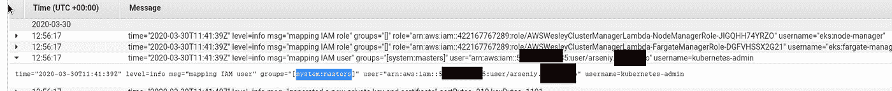
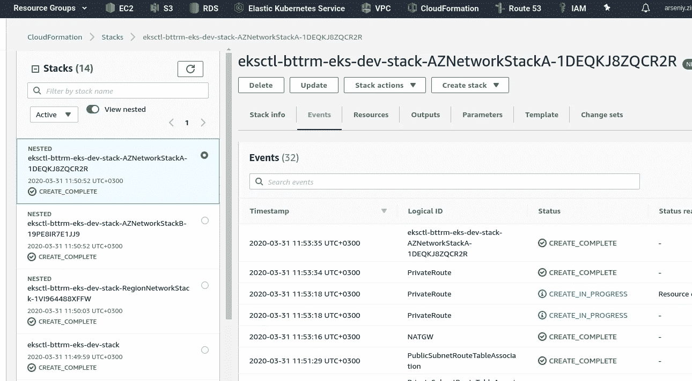
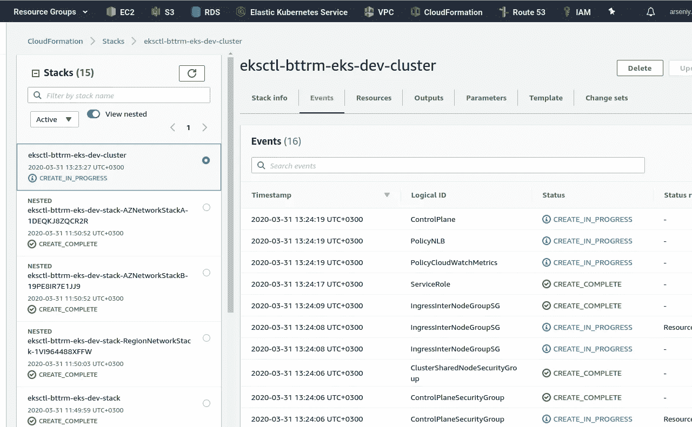
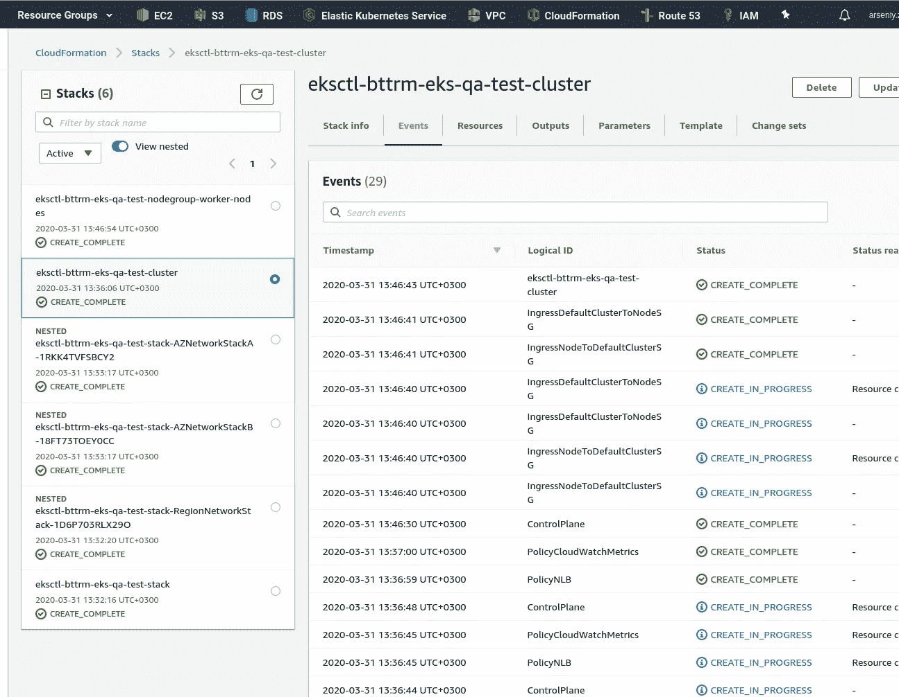

# AWS 弹性 Kubernetes 服务:集群创建自动化，第 2 部分— Ansible，eksctl

> 原文：<https://itnext.io/aws-elastic-kubernetes-service-a-cluster-creation-automation-part-2-ansible-eksctl-9f9c5336fc1d?source=collection_archive---------4----------------------->


第一部分— [AWS Elastic Kubernetes 服务:集群创建自动化，第 1 部分—云形成](https://rtfm.co.ua/en/aws-elastic-kubernetes-service-a-cluster-creation-automation-part-1-cloudformation/)。

要提醒的是，整个想法是创建一个自动化流程来创建 EKS 集群:

1.  Ansible 使用 [cloudformation 模块](https://rtfm.co.ua/ansible-modul-cloudformation/)创建一个基础设施
2.  通过使用 CloudFormation 堆栈的输出，模板中的 Ansible 将为`eksctl`生成一个集群配置文件
3.  Ansible 用这个配置文件调用`eksctl`来创建一个 EKS 集群

所有这一切都将从一个詹金斯工作使用一个 Docker 图像与 AWS 命令行界面，Ansible 和`eksctl`。也许这将是这个系列的第三部分。

写完这篇文章后得到的所有文件都可以在 [eksctl-cf-ansible](https://rtfm.co.ua/goto/https://github.com/setevoy2/eksctl-cf-ansible/tree/rdy) Github 存储库中找到。此处的链接指向一个分支，它与下面的代码完全相同。

**内容**

*   [AWS 认证](https://rtfm.co.ua/en/aws-elastic-kubernetes-service-a-cluster-creation-automation-part-2-ansible-eksctl/#AWS_Authentification)
*   [不稳定的云形成](https://rtfm.co.ua/en/aws-elastic-kubernetes-service-a-cluster-creation-automation-part-2-ansible-eksctl/#Ansible_CloudFormation)
*   [云形成参数和变量](https://rtfm.co.ua/en/aws-elastic-kubernetes-service-a-cluster-creation-automation-part-2-ansible-eksctl/#CloudFormation_Parameters_and_Ansible_variables)
*   [造云作用](https://rtfm.co.ua/en/aws-elastic-kubernetes-service-a-cluster-creation-automation-part-2-ansible-eksctl/#The_CloudFormation_role)
*   [Ansible eksctl](https://rtfm.co.ua/en/aws-elastic-kubernetes-service-a-cluster-creation-automation-part-2-ansible-eksctl/#Ansible_eksctl)
*   [集群配置— eks-cluster-config.yml](https://rtfm.co.ua/en/aws-elastic-kubernetes-service-a-cluster-creation-automation-part-2-ansible-eksctl/#Cluster_config_%E2%80%93_eksclusterconfig_yml)
*   [eksctl 创建与更新](https://rtfm.co.ua/en/aws-elastic-kubernetes-service-a-cluster-creation-automation-part-2-ansible-eksctl/#eksctl_create_vs_update)
*   [测试:CloudFormation & & EKS 自定义参数](https://rtfm.co.ua/en/aws-elastic-kubernetes-service-a-cluster-creation-automation-part-2-ansible-eksctl/#TEST_CloudFormation_EKS_Custom_parameters)
*   [P.S. aws-auth 配置图](https://rtfm.co.ua/en/aws-elastic-kubernetes-service-a-cluster-creation-automation-part-2-ansible-eksctl/#P_S_awsauth_ConfigMap)
*   [有用的链接](https://rtfm.co.ua/en/aws-elastic-kubernetes-service-a-cluster-creation-automation-part-2-ansible-eksctl/#Useful_links)
*   [Kubernetes](https://rtfm.co.ua/en/aws-elastic-kubernetes-service-a-cluster-creation-automation-part-2-ansible-eksctl/#Kubernetes)
*   [可回答的](https://rtfm.co.ua/en/aws-elastic-kubernetes-service-a-cluster-creation-automation-part-2-ansible-eksctl/#Ansible)
*   [AWS](https://rtfm.co.ua/en/aws-elastic-kubernetes-service-a-cluster-creation-automation-part-2-ansible-eksctl/#AWS)
*   [EKS](https://rtfm.co.ua/en/aws-elastic-kubernetes-service-a-cluster-creation-automation-part-2-ansible-eksctl/#EKS)
*   [云形成](https://rtfm.co.ua/en/aws-elastic-kubernetes-service-a-cluster-creation-automation-part-2-ansible-eksctl/#CloudFormation)

## AWS 认证

有必要事先考虑一下认证，不要从头开始改造一切(我就是这么做的)。

此外，强烈推荐阅读 [Kubernetes:第 4 部分— AWS EKS 认证、aws-iam-authenticator 和 AWS IAM](https://rtfm.co.ua/en/kubernetes-part-4-aws-eks-authentification-aws-iam-authenticator-and-aws-iam/) 帖子，因为在当前的帖子中会用到很多在那里描述的东西。

因此，我们需要一些 AWS 身份验证机制，因为我们需要进行身份验证:

*   对其在云形成中的 T21 作用负责
*   负责 eksctl 的角色
*   能够执行 AWS CLI 命令

这里最不明显的问题是，用于创建 EKS 集群的 IAM 用户变成了它的“超级管理员”,您不能更改它。

例如，在上一部分中，我们使用以下命令创建了集群:

```
$ eksctl --profile arseniy create cluster -f eks-cluster-config.yml
```

现在，您可以检查 CloudWatch 中的认证器日志，那里的第一个条目——您将看到来自具有`kubernetes-admin`权限的`system:masters`组的 root-suer:



那么，我们可以用什么来进行 AWS 认证呢？？

1.  访问密钥— AWS_ACCESS_KEY_ID 和 AWS_SECRET_ACCESS_KEY
2.  [AWS CLI 命名配置文件](https://rtfm.co.ua/en/aws-cli-named-profiles/)
3.  [AWS IAM EC2 实例概要](https://rtfm.co.ua/en/aws-iam-users-keys-rotation-ec2-iam-roles-and-jenkins/)(另见 [AWS: IAM AssumeRole — описание，примеры](https://rtfm.co.ua/aws-iam-assumerole-opisanie-primery/) ， *Rus* )

但是由于我们将在这里使用 Jenkins 我们可以使用它的 IAM EC2 实例角色和必要的权限。

现在，我实现了下一个计划:

*   使用 eks 管理策略手动创建名为 *eks-root* 的 IAM 用户
*   Jenkins 将使用其 IAM 实例角色和 EKS 管理策略创建必要的资源，并将成为 AWS 帐户中所有 EKS 集群的“超级管理员”
*   在 Ansible 中，我们将添加`eksctl create iamidentitymapping`(参见[管理 IAM 用户和角色](https://eksctl.io/usage/iam-identity-mappings/))来添加其他用户。

现在查看*AWS-auth*T3:

```
$ eksctl --profile arseniy --region eu-west-2 get iamidentitymapping --cluster eks-dev
ARN USERNAME GROUPS
arn:aws:iam::534***385:role/eksctl-eks-dev-nodegroup-worker-n-NodeInstanceRole-UNGXZXVBL3ZP system:node:{{EC2PrivateDNSName}} system:bootstrappers,system:nodes
```

或者用这个:

```
$ kubectl -n kube-system get cm aws-auth -o yaml
apiVersion: v1
data:
mapRoles: |
- groups:
- system:bootstrappers
- system:nodes
rolearn: arn:aws:iam::534***385:role/eksctl-eks-dev-nodegroup-worker-n-NodeInstanceRole-UNGXZXVBL3ZP
username: system:node:{{EC2PrivateDNSName}}
mapUsers: |
[]
kind: ConfigMap
…
```

现在让我们手动执行所有操作，以避免在自动化创建过程中出现意外:

1.  创建 IAM 用户
2.  创建“EKS 管理”策略
3.  将此策略附加到此用户
4.  使用此用户配置本地 AWS CLI 配置文件
5.  为此 AWS CLI 配置文件配置本地`kubectl`
6.  执行`eksctl create iamidentitymapping`
7.  执行`kubectl get nodes`检查访问

继续—创建用户:

```
$ aws --profile arseniy --region eu-west-2 iam create-user --user-name eks-root
{
“User”: {
“Path”: “/”,
“UserName”: “eks-root”,
“UserId”: “AID***PSA”,
“Arn”: “arn:aws:iam::534***385:user/eks-root”,
“CreateDate”: “2020–03–30T12:24:28Z”
}
}
```

他的访问密钥:

```
$ aws --profile arseniy --region eu-west-2 iam create-access-key --user-name eks-root
{
“AccessKey”: {
“UserName”: “eks-root”,
“AccessKeyId”: “AKI****45Y”,
“Status”: “Active”,
“SecretAccessKey”: “Qrr***xIT”,
“CreateDate”: “2020–03–30T12:27:28Z”
}
}
```

配置本地 AWS CLI 配置文件:

```
$ aws configure --profile eks-root
AWS Access Key ID [None]: AKI***45Y
AWS Secret Access Key [None]: Qrr***xIT
Default region name [None]: eu-west-2
Default output format [None]: json
```

立即尝试访问—必须被拒绝:

```
$ aws --profile eks-roo eks list-clusters
An error occurred (AccessDeniedException) when calling the ListClusters operation […]
```

创建一个策略，下面是一些[的例子> > >](https://docs.aws.amazon.com/eks/latest/userguide/security_iam_id-based-policy-examples.html) (以后可以作为嵌套栈添加到 CloudFormation 栈中，同样的，SecurityGroups 也会被管理)，保存到一个专用文件`../../cloudformation/files/eks-root-policy.json`:

```
{
    "Version": "2012-10-17",
    "Statement": [
        {
            "Effect": "Allow",
            "Action": [
                "eks:*"
            ],
            "Resource": "*"
        }
    ]
}
```

将此策略添加到 AWS IAM:

```
$ aws --profile arseniy --region eu-west-2 iam create-policy --policy-name eks-root-policy --policy-document file://../../cloudformation/files/eks-root-policy.json
{
“Policy”: {
“PolicyName”: “eks-root-policy”,
“PolicyId”: “ANPAXY5JMBMEROIOD22GM”,
“Arn”: “arn:aws:iam::534***385:policy/eks-root-policy”,
“Path”: “/”,
“DefaultVersionId”: “v1”,
“AttachmentCount”: 0,
“PermissionsBoundaryUsageCount”: 0,
“IsAttachable”: true,
“CreateDate”: “2020–03–30T12:44:58Z”,
“UpdateDate”: “2020–03–30T12:44:58Z”
}
}
```

将策略附加到上面创建的用户:

```
$ aws --profile arseniy --region eu-west-2 iam attach-user-policy --user-name eks-root --policy-arn arn:aws:iam::534***385:policy/eks-root-policy
```

检查:

```
$ aws --profile arseniy --region eu-west-2 iam list-attached-user-policies --user-name eks-root --output text
ATTACHEDPOLICIES arn:aws:iam::534***385:policy/eks-root-policy eks-root-policy
```

再次尝试访问:

```
$ aws --profile eks-root --region eu-west-2 eks list-clusters --output text
CLUSTERS eks-dev
```

在另一个地区:

```
$ aws --profile eks-root --region us-east-2 eks list-clusters --output text
CLUSTERS eksctl-bttrm-eks-production-1
CLUSTERS mobilebackend-dev-eks-0-cluster
```

接下来的任务最好在一个完全没有配置访问权限的机器上完成，例如，从 RTFM 博客的服务器上:-)

安装 AWS CLI:

```
root@rtfm-do-production:/home/setevoy# pip install awscli
```

配置默认配置文件:

```
root@rtfm-do-production:/home/setevoy# aws configure
```

检查对 AWS EKS 的一般访问——在我们的 IAM 策略中，我们已经授予了对`[eks:ListClusters](https://docs.aws.amazon.com/eks/latest/APIReference/API_ListClusters.html)` API 调用的权限，因此它必须正常工作:

```
root@rtfm-do-production:/home/setevoy# aws eks list-clusters — output text
CLUSTERS eks-dev
```

好吧。

安装`eksctl`:

```
root@rtfm-do-production:/home/setevoy# curl --silent --location “https://github.com/weaveworks/eksctl/releases/latest/download/eksctl_$(uname -s)_amd64.tar.gz” | tar xz -C /tmp
root@rtfm-do-production:/home/setevoy# mv /tmp/eksctl /usr/local/bin
```

重复`eks:ListClusters` -也必须工作，因为`eksctl`将使用上面配置的*默认* AWS CLI 配置文件:

```
root@rtfm-do-production:/home/setevoy# eksctl get cluster
NAME REGION
eks-dev eu-west-2
```

安装`kubectl`:

```
root@rtfm-do-production:/home/setevoy# curl -LO [https://storage.googleapis.com/kubernetes-release/release/`curl](https://storage.googleapis.com/kubernetes-release/release/`curl) -s [https://storage.googleapis.com/kubernetes-release/release/stable.txt`/bin/linux/amd64/kubectl](https://storage.googleapis.com/kubernetes-release/release/stable.txt`/bin/linux/amd64/kubectl)root@rtfm-do-production:/home/setevoy# chmod +x ./kubectlroot@rtfm-do-production:/home/setevoy# mv ./kubectl /usr/local/bin/kubectl
```

安装`aws-iam-authenticator`让`kubectl`在 AWS 中执行认证:

```
root@rtfm-do-production:/home/setevoy# curl -o aws-iam-authenticator [https://amazon-eks.s3.us-west-2.amazonaws.com/1.15.10/2020-02-22/bin/linux/amd64/aws-iam-authenticator](https://amazon-eks.s3.us-west-2.amazonaws.com/1.15.10/2020-02-22/bin/linux/amd64/aws-iam-authenticator)root@rtfm-do-production:/home/setevoy# chmod +x ./aws-iam-authenticatorroot@rtfm-do-production:/home/setevoy# mv aws-iam-authenticator /usr/local/bin/
```

配置 kubectl:

```
root@rtfm-do-production:/home/setevoy# aws eks update-kubeconfig --name eks-dev
Updated context arn:aws:eks:eu-west-2:534***385:cluster/eks-dev in /root/.kube/config
```

尝试在群集上执行命令—肯定是授权错误:

```
root@rtfm-do-production:/home/setevoy# kubectl get nodes
error: You must be logged in to the server (Unauthorized)root@rtfm-do-production:/home/setevoy# kubectl get pod
error: You must be logged in to the server (Unauthorized)
```

回到工作 PC，将 *eks-root* 用户添加到 *aws-auth* `ConfigMap`:

```
$ eksctl --profile arseniy --region eu-west-2 create iamidentitymapping --cluster eks-dev --arn arn:aws:iam::534***385:user/eks-root --group system:masters --username eks-root
[ℹ] eksctl version 0.16.0
[ℹ] using region eu-west-2
[ℹ] adding identity “arn:aws:iam::534***385:user/eks-root” to auth ConfigMap
```

检查一下:

```
$ eksctl --profile arseniy --region eu-west-2 get iamidentitymapping --cluster eks-dev
ARN USERNAME GROUPS
arn:aws:iam::534***385:role/eksctl-eks-dev-nodegroup-worker-n-NodeInstanceRole-UNGXZXVBL3ZP system:node:{{EC2PrivateDNSName}} system:bootstrappers,system:nodes
arn:aws:iam::534***385:user/eks-root eks-root system:masters
```

回到测试主机并再次尝试访问:

```
root@rtfm-do-production:/home/setevoy# kubectl get node
NAME STATUS ROLES AGE VERSION
ip-10–0–40–30.eu-west-2.compute.internal Ready <none> 133m v1.15.10-eks-bac369
ip-10–0–63–187.eu-west-2.compute.internal Ready <none> 133m v1.15.10-eks-bac369
```

再来看看别的，同样以*AWS-auth*为例:

```
root@rtfm-do-production:/home/setevoy# kubectl -n kube-system get cm aws-auth -o yaml
apiVersion: v1
data:
mapRoles: |
- groups:
- system:bootstrappers
- system:nodes
rolearn: arn:aws:iam::534***385:role/eksctl-eks-dev-nodegroup-worker-n-NodeInstanceRole-UNGXZXVBL3ZP
username: system:node:{{EC2PrivateDNSName}}
mapUsers: |
- groups:- system:masters
userarn: arn:aws:iam::534***385:user/eks-root
username: eks-root
kind: ConfigMap
…
```

添加了我们用户的`mapUsers`——这里一切都好。

稍后我们可以使用这个 *aws-auth* 来添加新用户，或者将任务添加到 Ansible 来执行`eksctl create iamidentitymapping`，或者我们可以生成自己的`ConfigMap`并上传到 EKS。

我将从我们的詹金斯主机继续执行任务，因为我们在任何地方都有`[vim](https://rtfm.co.ua/vim-prevrashhaem-redaktor-v-ide-plaginy-i-vot-eto-vot-vsyo/)`可用。

## 易变云形成

## 云形成参数和可变变量

在开始以下任务之前，让我们考虑一下上一部分中 CloudFormation 堆栈中使用的参数，以及我们需要在 Ansible 中包含什么。

首先想到的是 act，我们将为 QA 团队提供*开发*、*阶段*、*生产*集群+动态(让他们能够从 Jenkins 作业创建专用的定制集群来测试某些东西)，因此参数必须足够灵活，以便在任何地区使用任何 VPC 网络创建堆栈。

因此，我们将拥有:

*   所有的通用参数:
*   地区
*   AWS 访问/机密(或 [IAM EC2 实例配置文件](https://rtfm.co.ua/aws-rotaciya-klyuchej-iam-polzovatelej-ec2-iam-roles-i-jenkins/))
*   环境的专用参数:
*   环境(发展、阶段、生产)
*   VPC·CIDR(10 . 0 . 0 . 0/16、10.1.0.0/16 等)
*   Kubernetes 工作节点访问的 SSH 密钥
*   用于 Kubernetes 工作节点的 AWSес2 实例类型(t3.nano、c5.9xlarge 等)

特别值得注意的是栈和簇的命名。

因此，我们将为在 Ansible 行动手册和角色中“全局”使用的名称，以及我们稍后将在 AWS 控制台中看到的名称:

1.  一个环境名— *dev* ， *stage* ， *prod*
2.  我们从 *cloudformation* 角色创建的 cloudformation 堆栈名称(根堆栈及其嵌套堆栈)
3.  创建集群及其 WorkerNodes 堆栈时由`eksctl`创建的 CloudFromation 堆栈名称
4.  和一个 EKS 集群名

`eksctl`当然，会在幕后做一些事情，会给这里的名字附加一些前缀——后缀。

例如，在为 EKS 集群本身创建堆栈时，它将为其 CloudFormation 堆栈名称添加 *eksctl-* 前缀，并将添加 *-cluster* 后缀，对于其 WokerNodes 堆栈，将使用集群配置文件中的前缀 *eksctl-* 和后缀*-node group*+worker nodes 组的名称。

但是，集群本身的命名将与我们在`eks-cluster-config.yml`中设置的完全一样。

所以，让我们一起抓住——我们将使用哪些变量:

*   `env`:
*   格式:字符串" *dev* "
*   描述:用于组合其他变量的值
*   结果:*开发*
*   `eks_cluster_name`:
*   格式:`bttrm-eks-${env}`
*   描述:将设置`eks-cluster-config.yml` cluster-config 中的`metadata: name:`,用于为其他变量和 CloudFormation 标签合成值
*   结果: *bttrm-eks-dev*
*   `cf_stack_name`:
*   格式:`eksctl-${eks_cluster_name}-stack`
*   描述:使用- *堆栈*我们注意到这里只包含 AWS 相关资源，没有 EKS
*   结果:`eksctl-bttrm-eks-dev-stack`
*   【自动】(T11):
*   格式:`eksctl-${cluster_name}-cluster`
*   描述:将由`eksctl`自己创建一个 CloudFormation 堆栈，记住这一点
*   结果:`eksctl-bttrm-eks-dev-cluster`
*   【自动】(T15):
*   格式:`eksctl-${cluster_name}-nodegroup-${worker-nodes-name}`，其中 *worker-nodes-name* -是 cluster-config `eks-cluster-config.yml`中`nodeGroups: - name:`的值
*   描述:将由`eksctl`自己创建一个 CloudFormation 堆栈，记住这一点
*   结果:`eksctl-bttrm-eks-dev-cluster`

对于不同环境的不同文件，目前可以使用通用的`group_vars/all.yml`，稍后将会看到如何将它们分开。

创建目录:

```
$ mkdir group_vars
```

创建`all.yml`文件并设置初始值:

```
###################
# ANSIBLE globals #
###################

ansible_connection: local

#####################
# ENV-specific vars #
#####################

env: "dev"

#################
# ROLES globals #
#################

region: "eu-west-2"

# (THIS) eks_cluster_name: used for EKS service to set an exactly cluster's name - "{{ eks_cluster_name }}"
# (AUTO) eks_cluster_stack_name: used for CloudFormation service to format a stack's name as "eksctl-{{ eks_cluster_name }}-cluster"
# (AUTO) eks_nodegroup_stack_name: used for CloudFormation service to format a stack's name as "eksctl-{{ eks_cluster_name }}-nodegroup-{{ worker-nodes-name }}"
eks_cluster_name: "bttrm-eks-{{ env }}"

# used bythe cloudformation role to st a stack's name
cf_stack_name: "eksctl-{{ eks_cluster_name }}-stack"

##################
# ROLES specific #
##################

# cloudforation role
vpc_cidr_block: "10.0.0.0/16"
```

此外，在这里放置共享变量，如`region`——它将由*云形成*和 *eksctl* 角色使用，而`vpc_cidr_block`——仅在*云形成*中使用。

## 云形成的作用

在我们完成了[前一部分](https://rtfm.co.ua/en/aws-elastic-kubernetes-service-a-cluster-creation-automation-part-1-cloudformation/)中的模板后，我们必须有以下目录和文件结构:

```
$ tree
.
└── roles
├── cloudformation
│ ├── files
│ │ ├── eks-azs-networking.json
│ │ ├── eks-region-networking.json
│ │ └── eks-root.json
│ ├── tasks
│ └── templates
└── eksctl
├── tasks
└── templates
└── eks-cluster-config.yml
```

现在，在存储库根目录下创建一个新文件`eks-cluster.yml`——这将是我们可行的剧本。

在那里添加*云形成*执行:

```
- hosts:
  - all
  become:
    true
  roles:
    - role: cloudformation
      tags: infra
```

添加`tags`以便以后能够独立运行角色——这将有助于我们开始为`eksctl`编写角色。

创建一个`roles/cloudformation/tasks/main.yml`文件——在这里添加`[cloudformation](https://rtfm.co.ua/ansible-modul-cloudformation/)`模块执行，并通过`template_parameters`—来自`vpc_cidr_block`变量的`VPCCIDRBlock`和来自`eks_cluster_name`变量的`EKSClusterName`参数为我们的模板设置必要的参数:

```
- name: "Create EKS {{ cf_stack_name | upper }} CloudFormation stack"
  cloudformation:
    region: "{{ region }}"
    stack_name: "{{ cf_stack_name }}"
    state: "present"
    disable_rollback: true
    template: "/tmp/packed-eks-stacks.json"
    template_parameters:
      VPCCIDRBlock: "{{ vpc_cidr_block }}"
      EKSClusterName: {{ eks_cluster_name }},
    tags:
      Stack: "{{ cf_stack_name }}"
      Env: "{{ env }}"
      EKS-cluster: "{{ eks_cluster_name }}"
```

半年没用 Ansible 忘得一干二净(

谷歌搜索“*易变库存*”——并阅读[最佳实践](https://rtfm.co.ua/goto/https://docs.ansible.com/ansible/latest/user_guide/playbooks_best_practices.html)

在存储库根目录中，创建一个带有一些默认值的`ansible.cfg`文件:

```
[defaults]
gather_facts = no
inventory = hosts.yml
```

在同一个地方创建一个库存文件— `hosts.yml`:

```
all:
  hosts:
    "localhost"
```

当使用本地主机时，Ansible 不会在任何地方使用 SSH 所有的任务都将在本地完成。

检查语法:

```
admin@jenkins-production:~/devops-kubernetes$ ansible-playbook eks-cluster.yml — syntax-check
playbook: eks-cluster.yml
```

好看吗？生成模板的文件(在 Jenkins pipeline 中，必须有一个额外的阶段:

```
admin@jenkins-production:~/devops-kubernetes$ cd roles/cloudformation/files/admin@jenkins-production:~/devops-kubernetes/roles/cloudformation/files$ aws --region eu-west-2 cloudformation package --template-file eks-root.json --output-template /tmp/packed-eks-stacks.json --s3-bucket eks-cloudformation-eu-west-2 --use-jsonSuccessfully packaged artifacts and wrote output template to file /tmp/packed-eks-stacks.json.
```

执行以下命令来部署打包的模板

```
$ aws cloudformation deploy --template-file /tmp/packed-eks-stacks.json --stack-name <YOUR STACK NAME>
```

运行堆栈创建:

```
admin@jenkins-production:~/devops-kubernetes$ ansible-playbook eks-cluster.yml
…
TASK [cloudformation : Setting the Stack name] ****
ok: [localhost]
TASK [cloudformation : Create EKS EKSCTL-BTTRM-EKS-DEV-STACK CloudFormation stack] ****
changed: [localhost]
PLAY RECAP ****
localhost : ok=3 changed=1 unreachable=0 failed=0 skipped=0 rescued=0 ignored=0
```

检查:



堆栈的名称被设置为*eks CTL-Bt trm-eks-dev-stack*—很好。

现在，可以开始为`eksctl`编写一个角色来创建集群本身。

## 可回答的`eksctl`

我们已经有了集群配置文件——让我们将其重命名为`.j2`(注意它是 Jinja 的文件可转换模板引擎):

```
admin@jenkins-production:~/devops-kubernetes$ mv roles/eksctl/templates/eks-cluster-config.yml roles/eksctl/templates/eks-cluster-config.yml.j2
```

从在第一个角色中创建的 CloudFormation 堆栈中，我们需要在这里传递一组值— VPC ID、子网 ID 等，以便在集群配置中为`eksctl`设置值。

让我们使用 Ansible 模块`[cloudformation_info](https://rtfm.co.ua/goto/https://docs.ansible.com/ansible/latest/modules/cloudformation_info_module.html)`来收集关于所创建的堆栈的信息。

添加它，将其输出保存到`stack_info`变量，然后将检查其内容。

创建一个新文件`roles/eksctl/tasks/main.yml`:

```
- cloudformation_info:
    region: "{{ region }}"
    stack_name: "cf_stack_name"
  register: stack_info

- debug:
    msg: "{{ stack_info }}"
```

将`eksctl`角色执行添加到`eks-cluster.yml`剧本中，添加`tags`:

```
- hosts:
  - all
  become:
    true
  roles:
    - role: cloudformation
      tags: infra
    - role: eksctl
      tags: eks
```

使用`--tags eks`运行，仅执行`eksctl`角色:

```
admin@jenkins-production:~/devops-kubernetes$ ansible-playbook — tags eks eks-cluster.yml
…
TASK [eksctl : cloudformation_info] ****
ok: [localhost]
TASK [eksctl : debug] ****
ok: [localhost] => {
“msg”: {
“changed”: false,
“cloudformation”: {
“eksctl-bttrm-eks-dev-stack”: {
“stack_description”: {
…
“outputs”: [
{
“description”: “EKS VPC ID”,
“output_key”: “VPCID”,
“output_value”: “vpc-042082cd2d011f44d”
},
…
```

酷毙了。

现在—让我们只切割`{ "outputs" }`块。

更新任务—从`stack_info`到`msg`只传递`stack_outputs`:

```
- cloudformation_info:
    region: "{{ region }}"
    stack_name: "{{ cf_stack_name }}"
  register: stack_info

- debug:
    msg: "{{ stack_info.cloudformation[cf_stack_name].stack_outputs }}"
```

运行:

```
admin@jenkins-production:~/devops-kubernetes$ ansible-playbook — tags eks eks-cluster.yml
…
TASK [eksctl : debug] ****
ok: [localhost] => {
“msg”: {
“APrivateSubnetID”: “subnet-0471e7c28a3770828”,
“APublicSubnetID”: “subnet-07a0259b33ddbcb4c”,
“AStackAZ”: “eu-west-2a”,
“BPrivateSubnetID”: “subnet-0fa6eece43b2b6644”,
“BPublicSubnetID”: “subnet-072c107cef77fe859”,
“BStackAZ”: “eu-west-2b”,
“VPCID”: “vpc-042082cd2d011f44d”
}
}
…
```

尼尔！

现在，让我们尝试将这些值设置为变量，以使用它们从模板生成集群配置。

更新`roles/eksctl/tasks/main.yml`，增加一个`vpc_id`变量，通过`debug`打印出来，检查其值:

```
- cloudformation_info:
    region: "{{ region }}"
    stack_name: "{{ cf_stack_name }}"
  register: stack_info

- debug:
    msg: "{{ stack_info.cloudformation[cf_stack_name].stack_outputs }}"

- set_fact:
    vpc_id: "{{ stack_info.cloudformation[cf_stack_name].stack_outputs.VPCID }}"

- debug:
    msg: "{{ vpc_id }}"

- name: "Check template's content"
  debug:
    msg: "{{ lookup('template', './eks-cluster-config.yml.j2') }}"
```

在*中，通过直接调用`[template](https://rtfm.co.ua/goto/https://docs.ansible.com/ansible/latest/modules/template_module.html)`模块检查模板内容*，让我们检查一下模板文件的结果文件。

编辑`roles/eksctl/templates/eks-cluster-config.yml.j2` -设置`{{ vpc_id }}`:

```
apiVersion: eksctl.io/v1alpha5
kind: ClusterConfig
metadata:
  name: eks-dev
  region: eu-west-2
  version: "1.15"
nodeGroups:
  - name: worker-nodes
    instanceType: t3.medium
    desiredCapacity: 2
    privateNetworking: true
vpc:
  id: "{{ vpc_id }}"
  subnets:
    public:
      eu-west-2a:
...
```

检查:

```
admin@jenkins-production:~/devops-kubernetes$ ansible-playbook — tags eks eks-cluster.yml
…
TASK [eksctl : debug] ****
ok: [localhost] => {
“msg”: {
“APrivateSubnetID”: “subnet-0471e7c28a3770828”,
“APublicSubnetID”: “subnet-07a0259b33ddbcb4c”,
“AStackAZ”: “eu-west-2a”,
“BPrivateSubnetID”: “subnet-0fa6eece43b2b6644”,
“BPublicSubnetID”: “subnet-072c107cef77fe859”,
“BStackAZ”: “eu-west-2b”,
“VPCID”: “vpc-042082cd2d011f44d”
}
}
TASK [eksctl : set_fact] ****ok: [localhost]
TASK [eksctl : debug] ****
ok: [localhost] => {
“msg”: “vpc-042082cd2d011f44d”
}
TASK [eksctl : Check the template’s content] ****
ok: [localhost] => {
“msg”: “apiVersion: eksctl.io/v1alpha5\nkind: ClusterConfig\nmetadata:\n name: eks-dev\n region: eu-west-2\n version: \”1.15\”\nnodeGroups:\n — name: worker-nodes\n instanceType: t3.medium\n desiredCapacity: 2\n privateNetworking: true\nvpc:\n id: \”vpc-042082cd2d011f44d\”\n […]
```

*VPC:\ n ID:\ " VPC-VPC-042082 CD 2d 011 f 44d \ "*—很好，我们在模板中获得了我们的 VPC ID。

添加其他变量，使模板看起来像这样:

```
apiVersion: eksctl.io/v1alpha5
kind: ClusterConfig
metadata:
  name: "{{ eks_cluster_name }}"
  region: "{{ region }}"
  version: "{{ k8s_version }}"
nodeGroups:
  - name: "{{ k8s_worker_nodes_group_name }}"
    instanceType: "{{ k8s_worker_nodes_instance_type }}"
    desiredCapacity: {{ k8s_worker_nodes_capacity }}
    privateNetworking: true
vpc:
  id: "{{ vpc_id }}"
  subnets:
    public:
      {{ a_stack_az }}:
        id: "{{ a_stack_pub_subnet }}"
      {{ b_stack_az }}:
        id: "{{ b_stack_pub_subnet }}"
    private:
      {{ a_stack_az }}:
        id: "{{ a_stack_priv_subnet }}"
      {{ b_stack_az }}:
        id: "{{ b_stack_priv_subnet }}"
  nat:
    gateway: Disable
cloudWatch:
  clusterLogging:
    enableTypes: ["*"]
```

接下来，需要为 Ansible 添加额外的变量，以便在该模板中使用:

*   已经添加了 eks_cluster_name
*   *vpc_id* —已经添加
*   对于 availability zone-а堆栈，需要添加:
*   *堆栈发布子网*
*   *堆栈私有子网*
*   对于 availability zone-в，需要添加:
*   *a_stack_pub_subnet*
*   *堆栈私有子网*
*   *区域*——已经添加，稍后将从 Jenkins 参数中设置
*   *kubernetes_version*
*   *kubernetes _ worker _ nodes _ group _ name*
*   *kubernetes _ worker _ nodes _ instance _ type*
*   *kubernetes _ worker _ nodes _ capacity*

在`roles/eksctl/tasks/main.yml`中增加`set_facts`:

```
- cloudformation_info:
    region: "{{ region }}"
    stack_name: "{{ cf_stack_name }}"
  register: stack_info

- debug:
    msg: "{{ stack_info.cloudformation[cf_stack_name].stack_outputs }}"

- set_fact:
    vpc_id: "{{ stack_info.cloudformation[cf_stack_name].stack_outputs.VPCID }}"
    a_stack_az: "{{ stack_info.cloudformation[cf_stack_name].stack_outputs.AStackAZ }}"
    a_stack_pub_subnet: "{{ stack_info.cloudformation[cf_stack_name].stack_outputs.APublicSubnetID }}"
    a_stack_priv_subnet: "{{ stack_info.cloudformation[cf_stack_name].stack_outputs.APrivateSubnetID }}"
    b_stack_az: "{{ stack_info.cloudformation[cf_stack_name].stack_outputs.BStackAZ }}"
    b_stack_pub_subnet: "{{ stack_info.cloudformation[cf_stack_name].stack_outputs.BPublicSubnetID }}"
    b_stack_priv_subnet: "{{ stack_info.cloudformation[cf_stack_name].stack_outputs.BPrivateSubnetID }}"

- name: "Check the template's content"
  debug:
    msg: "{{ lookup('template', './eks-cluster-config.yml.j2') }}"
```

在`group_vars/all.yml`中为 *eksctl* 角色添加值:

```
...
##################
# ROLES specific #
##################

# cloudforation role
vpc_cidr_block: "10.0.0.0/16"

# eksctl role
k8s_version: 1.15
k8s_worker_nodes_group_name: "worker-nodes"
k8s_worker_nodes_instance_type: "t3.medium"
k8s_worker_nodes_capacity: 2
```

让我们先通过调用模板目录来检查一下:

```
…
TASK [eksctl : Check the template’s content] ****
ok: [localhost] => {
“msg”: “apiVersion: eksctl.io/v1alpha5\nkind: ClusterConfig\nmetadata:\n name: \”bttrm-eks-dev\”\n region: \”eu-west-2\”\n version: \”1.15\”\nnodeGroups:\n — name: \”worker-nodes\”\n instanceType: \”t3.medium\”\n desiredCapacity: 2\n privateNetworking: true\nvpc:\n id: \”vpc-042082cd2d011f44d\”\n subnets:\n public:\n eu-west-2a:\n id: \”subnet-07a0259b33ddbcb4c\”\n eu-west-2b:\n id: \”subnet-072c107cef77fe859\”\n private:\n eu-west-2a:\n id: \”subnet-0471e7c28a3770828\”\n eu-west-2b:\n id: \”subnet-0fa6eece43b2b6644\”\n nat:\n gateway: Disable\ncloudWatch:\n clusterLogging:\n enableTypes: [\”*\”]\n”
}
…
```

“管用！”。

嗯——不是运行`eksctl`的时候了。

## 集群配置— `eks-cluster-config.yml`

在调用`eksctl`之前，需要从模板中生成配置。

在`roles/eksctl/tasks/main.yml`的末尾添加`template`，并通过使用`role/eksctl/templates/eks-cluster-config.yml.j2`在`/tmp`目录下生成一个`eks-cluster-config.yml`文件:

```
...
- name: "Generate eks-cluster-config.yml"
  template:
    src: "eks-cluster-config.yml.j2"
    dest: /tmp/eks-cluster-config.yml
```

## `eksctl` *创建* vs *更新*

*注意:实际上，eksctl 的更新将执行版本升级而不是配置更新，但我将把这部分留在这里只是为了举例*

顺便问一下，如果集群已经存在了呢？当我们通过`create`时，作业将失败。

嗯——我们可以添加一个检查，如果集群已经存在，然后创建一个变量来存储值 *create* 或 *update* ，类似于我在[bash:скииптсозданияAWS cloud formationстекаа](https://rtfm.co.ua/bash-skript-sozdaniya-aws-cloudformation-steka/)中所做的。

因此，需要:

1.  获取 AWS 区域中 EKS 集群的列表
2.  尝试在此列表中查找正在创建的集群的名称
3.  如果**未找到**，则设定值*创建*
4.  如果找到，则设定值*更新*

让我们试着这样做:

```
# populate a clusters_exist list with names of clusters devided by TAB "\t"
- name: "Getting existing clusters list"
  shell: "aws --region {{ region }} eks list-clusters --query '[clusters'] --output text"
  register: clusters_exist

- debug:
    msg: "{{ clusters_exist.stdout }}"

# create a list from the clusters_exist
- set_fact:
    found_clusters_list: "{{ clusters_exist.stdout.split('\t') }}"

- debug:
    msg: "{{ found_clusters_list }}"

# check if a cluster's name is found in the existing clusters  list
- fail:
    msg: "{{ eks_cluster_name }} already exist in the {{ region }}"
  when: eks_cluster_name not in found_clusters_list

- meta: end_play
...
```

测试期间的那些任务添加到`roles/eksctl/tasks/main.yml`的开头，并在它们之后停止执行——添加`- meta: end_play`。

在`fail`条件下，现在设置“**而不是**”，因为我们现在只是测试，还没有创建集群:

```
…
TASK [eksctl : debug] *****
ok: [localhost] => {
“msg”: “eks-dev”
}
TASK [eksctl : set_fact] ****
ok: [localhost]
TASK [eksctl : debug] ****
ok: [localhost] => {
“msg”: [
“eks-dev”
]
}
TASK [eksctl : fail] ****
fatal: [localhost]: FAILED! => {“changed”: false, “msg”: “bttrm-eks-dev already exist in the eu-west-2”}
…
```

酷毙了。

现在，添加一个带有“ *create* 或“ *update* ”的`eksctl_action`变量，这取决于是否找到了集群:

```
# populate a clusters_exist list with names of clusters devided by TAB "\t"
- name: "Getting existing clusters list"
  shell: "aws --region {{ region }} eks list-clusters --query '[clusters'] --output text"
  register: clusters_exist

- debug:
    msg: "{{ clusters_exist.stdout }}"

# create a list from the clusters_exist
- set_fact:
    found_clusters_list: "{{ clusters_exist.stdout.split('\t') }}"

- debug:
    msg: "{{ found_clusters_list }}"

- set_fact:
    eksctl_action: "{{ 'create' if (eks_cluster_name not in found_clusters_list) else 'update' }}"

- debug:
    var: eksctl_action

# check if a cluster's name is found in the existing clusters  list
- fail:
    msg: "{{ eks_cluster_name }} already exist in the {{ region }}"
  when: eks_cluster_name not in found_clusters_list

...
```

检查:

```
…
TASK [eksctl : debug] ****
ok: [localhost] => {
“eksctl_action”: “create”
}
…
```

接下来，将它添加到`eksctl`任务中——将`{{ eksctl_action }}`添加到它的参数中，而不是直接使用“ *create* ”:

```
- cloudformation_info:
    region: "{{ region }}"
    stack_name: "{{ cf_stack_name }}"
  register: stack_info

- set_fact:
    vpc_id: "{{ stack_info.cloudformation[cf_stack_name].stack_outputs.VPCID }}"
    a_stack_az: "{{ stack_info.cloudformation[cf_stack_name].stack_outputs.AStackAZ }}"
    a_stack_pub_subnet: "{{ stack_info.cloudformation[cf_stack_name].stack_outputs.APublicSubnetID }}"
    a_stack_priv_subnet: "{{ stack_info.cloudformation[cf_stack_name].stack_outputs.APrivateSubnetID }}"
    b_stack_az: "{{ stack_info.cloudformation[cf_stack_name].stack_outputs.BStackAZ }}"
    b_stack_pub_subnet: "{{ stack_info.cloudformation[cf_stack_name].stack_outputs.BPublicSubnetID }}"
    b_stack_priv_subnet: "{{ stack_info.cloudformation[cf_stack_name].stack_outputs.BPrivateSubnetID }}"

- name: "Generate eks-cluster-config.yml"
  template:
    src: "eks-cluster-config.yml.j2"
    dest: /tmp/eks-cluster-config.yml

# populate a clusters_exist list with names of clusters devided by TAB "\t"
- name: "Getting existing clusters list"
  command: "aws --region {{ region }} eks list-clusters --query '[clusters'] --output text"
  register: clusters_exist

# create a list from the clusters_exist
- set_fact:
    found_clusters_list: "{{ clusters_exist.stdout.split('\t') }}"

- name: "Setting eksctl action to either Create or Update"
  set_fact:
    eksctl_action: "{{ 'create' if (eks_cluster_name not in found_clusters_list) else 'update' }}"

- name: "Running eksctl eksctl_action {{ eksctl_action | upper }} cluster with name {{ eks_cluster_name | upper }}"
  command: "eksctl {{ eksctl_action }} cluster -f /tmp/eks-cluster-config.yml"
```

关键时刻到了。:-)

运行:

```
admin@jenkins-production:~/devops-kubernetes$ ansible-playbook — tags eks eks-cluster.yml
…
TASK [eksctl : cloudformation_info] ****
ok: [localhost]
TASK [eksctl : set_fact] ****
ok: [localhost]
TASK [eksctl : Generate eks-cluster-config.yml] ****
ok: [localhost]
TASK [eksctl : Getting existing clusters list] ****
changed: [localhost]
TASK [eksctl : set_fact] ****
ok: [localhost]
TASK [eksctl : Setting eksctl action to either Create or Update] ****
ok: [localhost]
TASK [eksctl : Running eksctl eksctl_action CREATE cluster with name BTTRM-EKS-DEV]
```

堆栈和集群正在创建，堆栈的名称是*eks CTL-Bt trm-dev-cluster*——一切如我们计划的那样:



万岁！

只剩最后一项测试了。

## 测试:云形成和 EKS 自定义参数

最新要测试的是我们写的所有东西的灵活性。

例如，一个 QA 团队想要用 VPC CIDR *10.1.0.0/16* 创建一个名为 *qa-test* 的全新集群。

更新`group_vars/all.yml`，设置:

*   `env`:*dev*>*QA-test*
*   `region`:*欧盟-西方-2*>*欧盟-西方-3* ”
*   `vpc_cidr_block`:*10 . 0 . 0 . 0/16*>*10 . 1 . 0 . 0/16*

```
...
env: "qa-test"
...
region: "eu-west-3"
...
vpc_cidr_block: "10.1.0.0/16"
```

重新打包模板以重新生成`packed-eks-stack.json`:

```
admin@jenkins-production:~/devops-kubernetes$ cd roles/cloudformation/files/admin@jenkins-production:~/devops-kubernetes/roles/cloudformation/files$ aws — region eu-west-3 cloudformation package — template-file eks-root.json — output-template packed-eks-stacks.json — s3-bucket eks-cloudformation-eu-west-3 — use-json
```

不带`--tags`运行 Ansible，从头开始创建 CloudFormation 堆栈和 EKS 集群:

```
admin@jenkins-production:~/devops-kubernetes$ ansible-playbook eks-cluster.yml
…
TASK [cloudformation : Create EKS EKSCTL-BTTRM-EKS-QA-TEST-STACK CloudFormation stack] ****
changed: [localhost]
TASK [eksctl : cloudformation_info] ****
ok: [localhost]
TASK [eksctl : set_fact] ****
ok: [localhost]
TASK [eksctl : Generate eks-cluster-config.yml] ****
changed: [localhost]
TASK [eksctl : Getting existing clusters list] ****
changed: [localhost]
TASK [eksctl : set_fact] ****
ok: [localhost]
TASK [eksctl : Setting eksctl action to either Create or Update] ****
ok: [localhost]
TASK [eksctl : Running eksctl eksctl_action CREATE cluster with name BTTRM-EKS-QA-TEST] ****
…
```

等等，检查:



耶！

其实——就这些。

最后的事情将是创建一个詹金斯工作。

哦，等等！忘了`ConfigMap`。

## 另外，aws-auth `ConfigMap`

无论你多么努力，你都会忘记一些事情。

所以——需要添加 *eks-root* ，在这篇文章开始时创建的用户到我们正在创建的集群中。

它可以用一个命令和两个变量来完成。

*注意:实际上，这将在每次供应运行时追加用户，因此在我的最终解决方案中，我以另一种方式完成了它，但现在我将它“按原样”保留在这里，稍后将添加更好的方式。*

在`group_vars/all.yml`中添加一个用户的 ARN:

```
...
eks_root_user_name: "eks-root"
eks_root_user_arn: "arn:aws:iam::534***385:user/eks-root"
```

并在`roles/eksctl/tasks/main.yml` -将他添加到集群中:

```
...
- name: "Update aws-auth ConfigMap with the EKS root user {{ eks_root_user_name | upper }}"
  command: "eksctl create iamidentitymapping --cluster {{ eks_cluster_name }} --arn {{ eks_root_user_arn }} --group system:masters --username {{  eks_root_user_name }}"
```

运行:

```
…
TASK [eksctl : Running eksctl eksctl_action UPDATE cluster with name BTTRM-EKS-QA-TEST] ****
changed: [localhost]
TASK [eksctl : Update aws-auth ConfigMap with the EKS root user EKS-ROOT] ****
changed: [localhost]
…
```

回到 RTFM 的服务器，在那里我们只有 *eks-root* 用户有“干净”的访问权，更新它的`~/.kube/config`:

```
root@rtfm-do-production:/home/setevoy# aws — region eu-west-3 eks update-kubeconfig — name bttrm-eks-qa-test
Added new context arn:aws:eks:eu-west-3:534***385:cluster/bttrm-eks-qa-test to /root/.kube/config
```

尝试访问节点信息:

```
root@rtfm-do-production:/home/setevoy# kubectl get node
NAME STATUS ROLES AGE VERSION
ip-10–1–40–182.eu-west-3.compute.internal Ready <none> 94m v1.15.10-eks-bac369
ip-10–1–52–14.eu-west-3.compute.internal Ready <none> 94m v1.15.10-eks-bac369
```

和豆荚:

```
root@rtfm-do-production:/home/setevoy# kubectl get pod -n kube-system
NAME READY STATUS RESTARTS AGE
aws-node-rgpn5 1/1 Running 0 95m
aws-node-xtr6m 1/1 Running 0 95m
coredns-7ddddf5cc7–5w5wt 1/1 Running 0 102m
…
```

完成了。

## 有用的链接

## 库伯内特斯

*   [Kubernetes Pod 网络简介](https://rtfm.co.ua/goto/https://www.weave.works/blog/introduction-to-kubernetes-pod-networking--part-1)
*   [Kubernetes on AWS:部署指南和最佳实践](https://rtfm.co.ua/goto/https://www.weave.works/technologies/kubernetes-on-aws/)
*   [如何用 Kubectl 管理 Kubernetes】](https://rtfm.co.ua/goto/https://rancher.com/learning-paths/how-to-manage-kubernetes-with-kubectl/)
*   [建设大型集群](https://rtfm.co.ua/goto/https://kubernetes.io/docs/setup/best-practices/cluster-large/)
*   [Kubernetes 生产最佳实践](https://rtfm.co.ua/goto/https://learnk8s.io/production-best-practices)

## Ansible

*   [最佳实践](https://rtfm.co.ua/goto/https://docs.ansible.com/ansible/latest/user_guide/playbooks_best_practices.html)
*   [可行&复杂工作流程的云形成](https://rtfm.co.ua/goto/https://www.trek10.com/blog/ansible-cloudformation/)

## 自动警报系统

EKS

*   [EKS 自动气象站上的 kubernetes 集群](https://rtfm.co.ua/goto/https://www.codementor.io/@slavko/kubernetes-cluster-on-aws-eks-lecygk6rl)
*   [EKS vs GKE vs AKS —评估云中的 Kubernetes](https://rtfm.co.ua/goto/https://www.stackrox.com/post/2020/02/eks-vs-gke-vs-aks/)
*   [模块化和可扩展的亚马逊 EKS 架构](https://rtfm.co.ua/goto/https://s3.amazonaws.com/aws-quickstart/quickstart-amazon-eks/doc/amazon-eks-architecture.pdf)
*   [使用 eksctl 构建 kubernetes 集群](https://rtfm.co.ua/goto/https://www.agilepartner.net/en/build-a-kubernetes-cluster-with-eksctl/)
*   [亚马逊 EKS 安全组注意事项](https://rtfm.co.ua/goto/https://docs.aws.amazon.com/en_us/eks/latest/userguide/sec-group-reqs.html)

云的形成

*   [使用 Ansible、CloudFormation 和 CodeBuild 将 AWS 基础设施作为代码进行管理](https://rtfm.co.ua/goto/https://programmaticponderings.com/2019/07/30/managing-aws-infrastructure-as-code-using-ansible-cloudformation-and-codebuild/)
*   [嵌套 CloudFormation 堆栈:开发者和系统管理员指南](https://rtfm.co.ua/goto/https://cloudacademy.com/blog/understanding-nested-cloudformation-stacks/)
*   [嵌套云形成堆栈的演练](https://rtfm.co.ua/goto/https://medium.com/@janethavishka/walkthrough-with-nested-cloudformation-stacks-d7709b568162)
*   [如何将 CommaDelimitedList 参数传递给 AWS CloudFormation 中的嵌套堆栈？](https://rtfm.co.ua/goto/https://aws.amazon.com/ru/premiumsupport/knowledge-center/cloudformation-parameters-nested-stacks/)
*   [如何在 AWS CloudFormation 模板中为单个参数使用多个值？](https://rtfm.co.ua/goto/https://aws.amazon.com/ru/premiumsupport/knowledge-center/multiple-values-list-parameter-cli/)
*   [云形成两年:经验教训](https://rtfm.co.ua/goto/https://sanderknape.com/2018/08/two-years-with-cloudformation-lessons-learned/)
*   [使用嵌套堆栈缩小膨胀的云形成模板](https://rtfm.co.ua/goto/https://www.jamesqmurphy.com/blog/2019/10/nested-stack)
*   [云形成最佳实践](https://rtfm.co.ua/goto/https://sbstjn.com/cloudformation.html#nested-stacks)
*   [7 个可怕的云形成黑客](https://rtfm.co.ua/goto/https://garbe.io/blog/2017/07/17/cloudformation-hacks/)
*   [AWS 云信息最佳实践—认证](https://rtfm.co.ua/goto/https://jayendrapatil.com/aws-cloudformation-best-practices-certification/)
*   [在 CloudFormation 上使用 AWS::NoValue 有条件地定义资源属性](https://rtfm.co.ua/goto/https://blog.shikisoft.com/aws-cloudformation-no-value-pseudo-parameter/)

*最初发表于* [*RTFM: Linux，devo PSисистемноеадмииитиованиииованиде*](https://rtfm.co.ua/en/aws-elastic-kubernetes-service-a-cluster-creation-automation-part-2-ansible-eksctl/)*。*