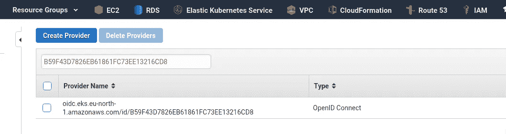
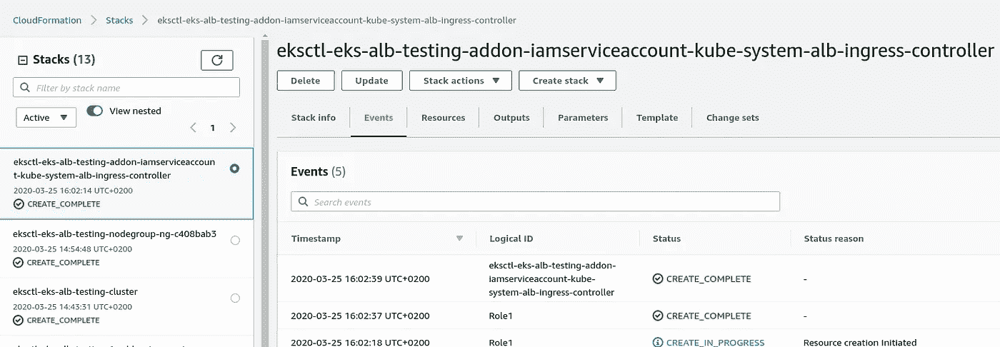
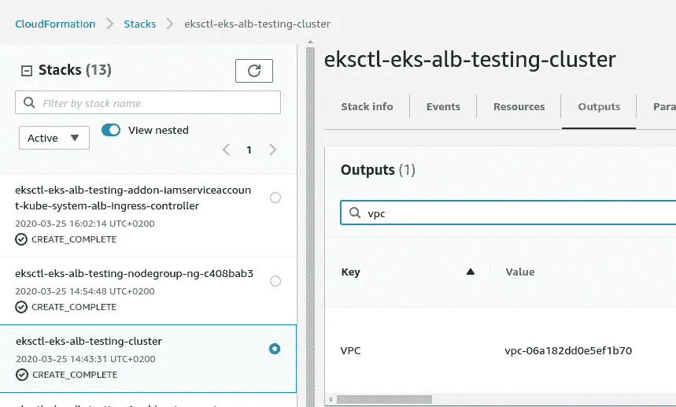
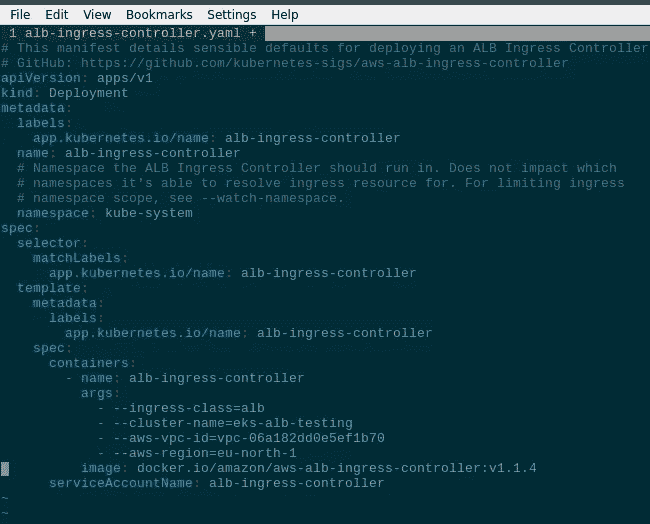

# AWS 弹性 Kubernetes 服务:运行 ALB 入口控制器

> 原文：<https://itnext.io/aws-elastic-kubernetes-service-running-alb-ingress-controller-8d0d457615fa?source=collection_archive---------1----------------------->


[用于 Kubernetes](https://github.com/kubernetes-sigs/aws-alb-ingress-controller) 的 AWS ALB 入口控制器——是一个 Kubernetes 控制器，当在 Kubernetes 集群中创建带有`kubernetes.io/ingress.class: alb`注释的`Ingress`资源时，它实际控制 AWS 帐户中的 AWS 应用程序负载平衡器(ALB)。

这个`Ingress`资源反过来描述了一个 ALB 监听器配置，带有 SSL 终端或者到集群工作节点的流量路由。

更多信息，请点击此处:

*   [https://kubernetes . io/docs/concepts/services-networking/ingress/](https://kubernetes.io/docs/concepts/services-networking/ingress/)
*   [https://github . com/kubernetes-sigs/AWS-ALB-ingress-controller](https://github.com/kubernetes-sigs/aws-alb-ingress-controller)
*   [https://AWS . Amazon . com/ru/blogs/open source/kubernetes-ingress-AWS-ALB-ingress-controller/](https://aws.amazon.com/ru/blogs/opensource/kubernetes-ingress-aws-alb-ingress-controller/)

## 入口控制器类型

AWS ALB 入口控制器支持两种流量路由策略类型，即**实例模式**和 **ip 模式**:

*   **实例模式**:流量将在 ALB 上被接受，然后被路由到节点端口服务，然后被路由到集群内部的 pod
*   **ip 模式**:流量将首先到达 ALB，然后直接路由到集群中的 pod。文档表明为 Kubernetes 安装 [AWS CNI 插件是必要的，但是在 AWS EKS 它开箱即用](https://github.com/aws/amazon-vpc-cni-k8s)

更多文档见[此处> > >](https://github.com/kubernetes-sigs/aws-alb-ingress-controller/blob/master/docs/guide/ingress/annotation.md) 。

## `eksctl` -创建一个集群

首先，让我们创建一个测试集群:

```
$ eksctl create cluster — profile arseniy — region eu-north-1 — name eks-alb-testing
[ℹ] eksctl version 0.15.0
[ℹ] using region eu-north-1
[ℹ] setting availability zones to [eu-north-1b eu-north-1c eu-north-1a]
[ℹ] subnets for eu-north-1b — public:192.168.0.0/19 private:192.168.96.0/19
[ℹ] subnets for eu-north-1c — public:192.168.32.0/19 private:192.168.128.0/19
[ℹ] subnets for eu-north-1a — public:192.168.64.0/19 private:192.168.160.0/19
[ℹ] nodegroup “ng-c408bab3” will use “ami-0d40170cbe0b51e62” [AmazonLinux2/1.14]
[ℹ] using Kubernetes version 1.14
[ℹ] creating EKS cluster “eks-alb-testing” in “eu-north-1” region with un-managed nodes
…
[ℹ] node “ip-192–168–11–166.eu-north-1.compute.internal” is ready
[ℹ] node “ip-192–168–35–128.eu-north-1.compute.internal” is ready
[ℹ] kubectl command should work with “/home/setevoy/.kube/config”, try ‘kubectl get nodes’
[✔] EKS cluster “eks-alb-testing” in “eu-north-1” region is ready
```

## IAM OIDC 提供商

文档—[https://docs . AWS . Amazon . com/eks/latest/user guide/enable-iam-roles-for-service-accounts . html](https://docs.aws.amazon.com/eks/latest/userguide/enable-iam-roles-for-service-accounts.html)。

控制器所用的服务账户需要 OIDC 集成，详见[https://eksctl.io/usage/iamserviceaccounts](https://eksctl.io/usage/iamserviceaccounts)。

创建它:

```
$ eksctl — profile arseniy — region=eu-north-1 utils associate-iam-oidc-provider — cluster eks-alb-testing — approve
[ℹ] eksctl version 0.15.0
[ℹ] using region eu-north-1
[ℹ] will create IAM Open ID Connect provider for cluster “eks-alb-testing” in “eu-north-1”
[✔] created IAM Open ID Connect provider for cluster “eks-alb-testing” in “eu-north-1”
```

检查:

```
$ aws — profile arseniy. — region=eu-north-1 eks describe-cluster — name eks-alb-testing — query “cluster.identity.oidc.issuer” — output text
[https://oidc.eks.eu-north-1.amazonaws.com/id/B59F43D7826EB61861FC73EE13216CD8](https://oidc.eks.eu-north-1.amazonaws.com/id/B59F43D7826EB61861FC73EE13216CD8)
```

或者通过 [AWS UI](https://console.aws.amazon.com/iam/home?region=eu-west-3#/providers) > *身份提供者*:



## ALB IAM 策略

下一步是添加一个 IAM 策略，该策略将为 AWS 帐户中带有 ALB 入口控制器的 pod 提供访问权限，以便对 AWS 核心进行 API 调用，从而创建和配置应用程序负载平衡器。

可以使用 AWS CLI 通过以下命令创建它:

```
$ aws — profile arseniy — region=eu-north-1 iam create-policy — policy-name ALBIngressControllerIAMPolicy — policy-document [https://raw.githubusercontent.com/kubernetes-sigs/aws-alb-ingress-controller/v1.1.4/docs/examples/iam-policy.json](https://raw.githubusercontent.com/kubernetes-sigs/aws-alb-ingress-controller/v1.1.4/docs/examples/iam-policy.json)
```

或者可以使用`[AWS::IAM::Role](https://docs.aws.amazon.com/AWSCloudFormation/latest/UserGuide/aws-resource-iam-role.html)`资源添加到 CloudFormation 模板中。

在命令的输出中，您将有一个 ARN—*" Arn ":" Arn:AWS:iam::534 * * * 385:policy/ALBIngressControllerIAMPolicy "*—保留它，我们将在下面的步骤中使用它。

## ALB 入口 IAM 角色

参见[https://kubernetes . io/docs/tasks/configure-pod-container/configure-service-account/](https://kubernetes.io/docs/tasks/configure-pod-container/configure-service-account/)

> 1 iamserviceaccount(kube-系统/ALB-入口-控制器)除外

在[官方文档](https://docs.aws.amazon.com/eks/latest/userguide/alb-ingress.html)中，顺序有点不同:首先，它建议创建一个 RBAC-角色和角色绑定，然后是 iamserviceaccount。

在我的例子中，这导致了在创建新的 service account "*kube-system/ALB-ingress-controller*"—`eksctl`被告知它已经存在并跳过它，尽管有`--override-existing-serviceaccounts`选项:

```
[ℹ] eksctl version 0.15.0
[ℹ] using region eu-north-1
[ℹ] 1 iamserviceaccount(s) that already exist (kube-system/alb-ingress-controller) will be excluded
[ℹ] combined exclude rules: kube-system/alb-ingress-controller
[ℹ] 1 iamserviceaccount (kube-system/alb-ingress-controller) was excluded (based on the include/exclude rules)
[!] serviceaccounts that exists in Kubernetes will be excluded, use — override-existing-serviceaccounts to override
[ℹ] no tasks
```

在包含 AWS 支持之后(我喜欢这些家伙——在我看来是所有云提供商中最好的支持者)，我们改变了顺序:首先，创建 IAM 角色，然后是 RBAC 角色和绑定。

但是——我们继续吧。

检查当前配置的群集—以防万一:

```
$ kubectl config current-context
arseniy@eks-alb-testing.eu-north-1.eksctl.io
```

好吧。

现在使用`eksctl`创建 IAM 角色，并使用上面创建的策略的 ARN——将其附加到该角色(将创建一个额外的 CloudFormation 堆栈):

```
$ eksctl — profile arseniy — region=eu-north-1 create iamserviceaccount — name alb-ingress-controller — namespace kube-system — override-existing-serviceaccounts — approve — cluster eks-alb-testing — attach-policy-arn arn:aws:iam::534***385:policy/ALBIngressControllerIAMPolicy
[ℹ] eksctl version 0.15.0
[ℹ] using region eu-north-1
[ℹ] 1 task: { 2 sequential sub-tasks: { create IAM role for serviceaccount “kube-system/alb-ingress-controller”, create serviceaccount “kube-system/alb-ingress-controller” } }
[ℹ] building iamserviceaccount stack “eksctl-eks-alb-testing-addon-iamserviceaccount-kube-system-alb-ingress-controller”
[ℹ] deploying stack “eksctl-eks-alb-testing-addon-iamserviceaccount-kube-system-alb-ingress-controller”
[ℹ] created serviceaccount “kube-system/alb-ingress-controller”
```

等待它的规定:



## ALB 入口服务帐户

在 *kube-system* 名称空间中创建一个名为 *alb-ingress-controller* 的 ServiceAccount，添加名为 *alb-ingress-controller* 的`ClusterRoleBinding`和`ClusterRole`，添加访问规则:

```
$ kubectl apply -f [https://raw.githubusercontent.com/kubernetes-sigs/aws-alb-ingress-controller/v1.1.4/docs/examples/rbac-role.yaml](https://raw.githubusercontent.com/kubernetes-sigs/aws-alb-ingress-controller/v1.1.4/docs/examples/rbac-role.yaml)
clusterrole.rbac.authorization.k8s.io/alb-ingress-controller created
clusterrolebinding.rbac.authorization.k8s.io/alb-ingress-controller created
serviceaccount/alb-ingress-controller created
```

检查:

```
$ kubectl -n kube-system get serviceaccounts | grep alb
alb-ingress-controller 1 32s
```

## 启动 ALB 入口控制器

我们可以从这里使用部署文件启动它—[https://raw . githubusercontent . com/kubernetes-sigs/AWS-ALB-ingress-controller/v 1 . 1 . 4/docs/examples/ALB-ingress-controller . YAML](https://raw.githubusercontent.com/kubernetes-sigs/aws-alb-ingress-controller/v1.1.4/docs/examples/alb-ingress-controller.yaml)，它将使用*docker.io/amazon/aws-alb-ingress-controller*Docker 映像启动一个 pod。

将其克隆到您的工作站:

```
$ wget [https://raw.githubusercontent.com/kubernetes-sigs/aws-alb-ingress-controller/v1.1.4/docs/examples/alb-ingress-controller.yaml](https://raw.githubusercontent.com/kubernetes-sigs/aws-alb-ingress-controller/v1.1.4/docs/examples/alb-ingress-controller.yaml)
```

在块中打开以供编辑:

```
...
    spec:
      containers:
        - name: alb-ingress-controller
          args:
...
```

添加以下参数:

*   `--cluster-name=eks-alb-testing`
*   `--aws-vpc-id=vpc-06a182dd0e5ef1b70`
*   `--aws-region=eu-north-1`

VPC ID 可以在根堆栈的*输出*中找到—*eks CTL-eks-ALB-testing-cluster*(查看 [AWS: CloudFormation —嵌套堆栈和堆栈参数导入/导出](https://rtfm.co.ua/en/aws-cloudformation-nested-stacks-and-stacks-parameters-import-export/)帖子，了解这些堆栈是如何创建的):



因此，该文件必须如下所示:



应用它运行 ALB 入口控制器:

```
$ kubectl apply -f alb-ingress-controller.yaml
deployment.apps/alb-ingress-controller created
```

检查它的吊舱:

```
$ kubectl -n kube-system get pod
NAME READY STATUS RESTARTS AGE
alb-ingress-controller-c47448d84–49tsc 1/1 Running 0 36s
```

以及控制器的日志:

```
$ kubectl logs -n kube-system deployment.apps/alb-ingress-controller -f
 — — — — — — — — — — — — — — — — — — — — — — — — — — — — — — — — — — — — — — — -
AWS ALB Ingress controller
Release: v1.1.4
…
I0325 14:18:03.203499 1 leaderelection.go:205] attempting to acquire leader lease kube-system/ingress-controller-leader-alb…
I0325 14:18:03.211928 1 leaderelection.go:214] successfully acquired lease kube-system/ingress-controller-leader-alb
I0325 14:18:03.312309 1 controller.go:134] kubebuilder/controller “level”=0 “msg”=”Starting Controller” “controller”=”alb-ingress-controller”
I0325 14:18:03.412486 1 controller.go:154] kubebuilder/controller “level”=0 “msg”=”Starting workers” “controller”=”alb-ingress-controller” “worker count”=1
```

嗯——已经开始了，看起来甚至可以用了——太好了！

但是真的有效吗？我们来测试一下。

## ALB 入口控制器测试

对于测试——让我们启动一个额外的部署，它将运行一个包含 NGINX 和 Kubernetes 入口服务的 pod。

所以，需要创造:

1.  Kubernetes 为吊舱部署
2.  一项`NodePort`服务，用于将流量路由到 pod
3.  和带有*面向互联网的 ALB* 注释的`Ingress`对象——这必须触发我们的 ALB 控制器来创建一个 AWS 应用程序负载平衡器

应用:

```
$ kubectl apply -f nginx-testing-app.yml
deployment.apps/eks-alb-testing-deployment created
service/eks-alb-testing-web-service created
ingress.extensions/eks-alb-testing-web-ingress created
```

检查控制器日志:

```
E0325 14:24:06.627453 1 controller.go:217] kubebuilder/controller “msg”=”Reconciler error” “error”=”no object matching key \”default/eks-alb-testing-web-ingress\” in local store” “controller”=”alb-ingress-controller” “request”={“Namespace”:”default”,”Name”:”eks-alb-testing-web-ingress”}
I0325 14:24:09.257834 1 security_group.go:36] default/eks-alb-testing-web-ingress: creating securityGroup dbd770cc-default-eksalbtes-09fa:managed LoadBalancer securityGroup by ALB Ingress Controller
…
I0325 14:24:09.665207 1 loadbalancer.go:191] default/eks-alb-testing-web-ingress: creating LoadBalancer dbd770cc-default-eksalbtes-09fa
…
I0325 14:24:10.636180 1 targets.go:80] default/eks-alb-testing-web-ingress: Adding targets to arn:aws:elasticloadbalancing:eu-north-1:534***385:targetgroup/dbd770cc-fe1e32fc96596dcf2c1/ef783b9fead58965: i-0622ff000570f32c7:31095, i-062329ba6419ba845:31095
I0325 14:24:10.821148 1 listener.go:110] default/eks-alb-testing-web-ingress: creating listener 80
…
I0325 14:24:13.171590 1 rules.go:82] default/eks-alb-testing-web-ingress: modifying rule 1 on arn:aws:elasticloadbalancing:eu-north-1:534***385:listener/app/dbd770cc-default-eksalbtes-09fa/979c262ea2e12983/455a07658116adcd
I0325 14:24:13.192456 1 rules.go:98] default/eks-alb-testing-web-ingress: rule 1 modified with conditions [{ Field: “path-pattern”, Values: [“/*”] }]
```

检查`Ingress`资源:

```
$ kubectl get ingress -o wide
NAME HOSTS ADDRESS PORTS AGE
eks-alb-testing-web-ingress * dbd770cc-default-eksalbtes-09fa-1532296804.eu-north-1.elb.amazonaws.com 80 114s
```

并尝试连接到它:

```
$ curl -I dbd770cc-default-eksalbtes-09fa-1532296804.eu-north-1.elb.amazonaws.com
HTTP/1.1 200 OK
Date: Wed, 25 Mar 2020 14:26:27 GMT
Content-Type: text/html
Content-Length: 612
Connection: keep-alive
Server: nginx/1.17.9
Last-Modified: Tue, 03 Mar 2020 14:32:47 GMT
ETag: “5e5e6a8f-264”
Accept-Ranges: bytes
```

完成了。

*最初发布于* [***RTFM: Linux、DevOps 和系统管理***](https://rtfm.co.ua/en/aws-elastic-kubernetes-service-running-alb-ingress-controller/) *。*