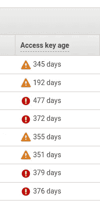
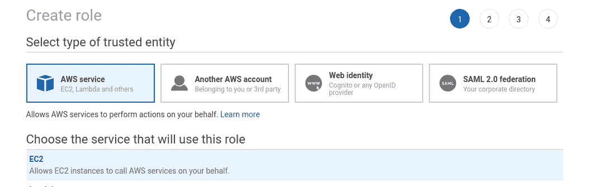
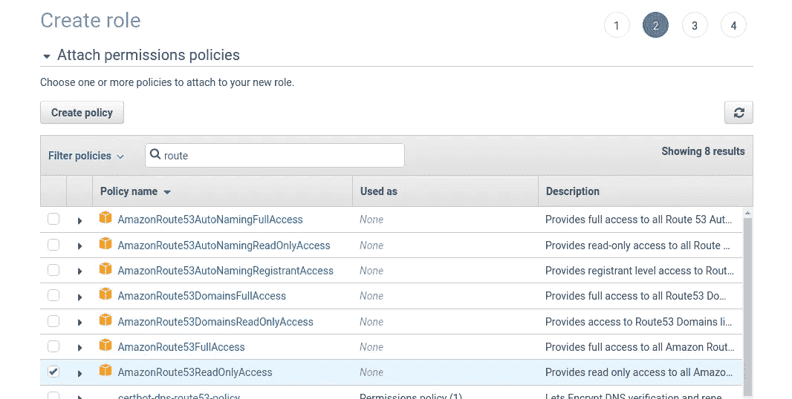
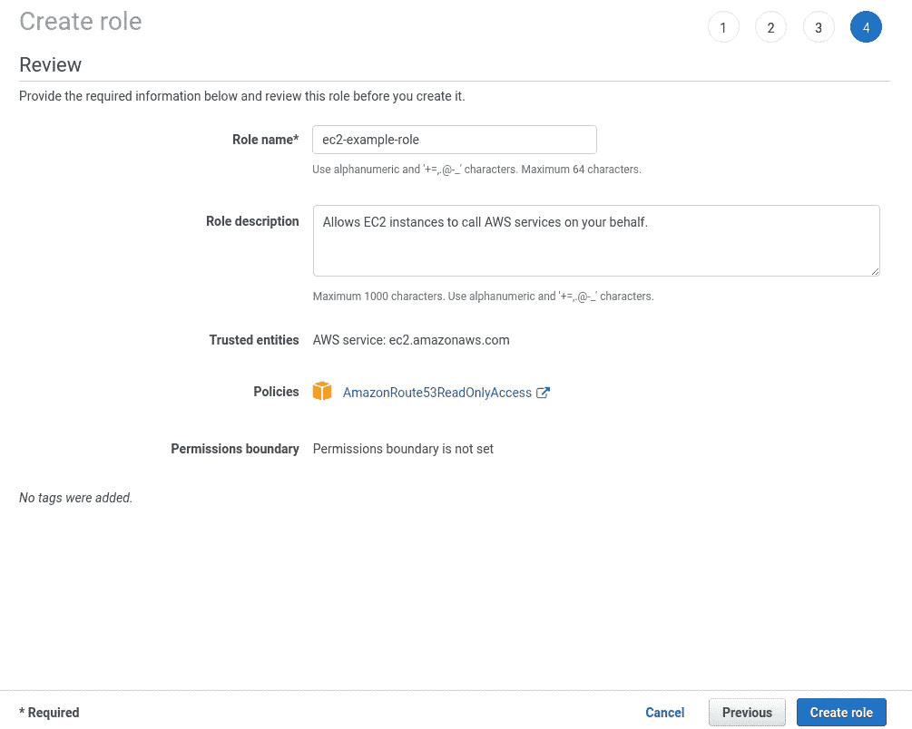
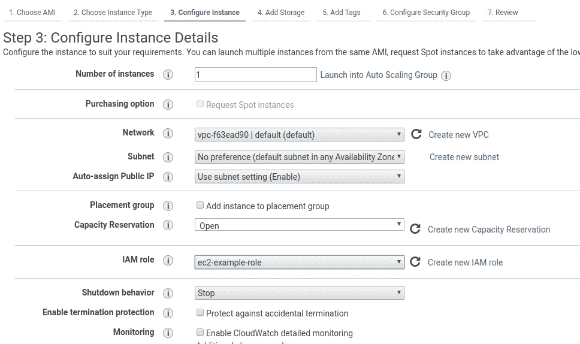
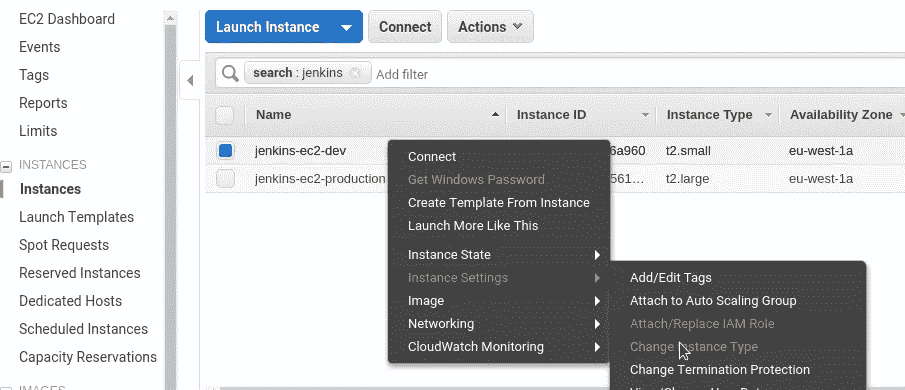
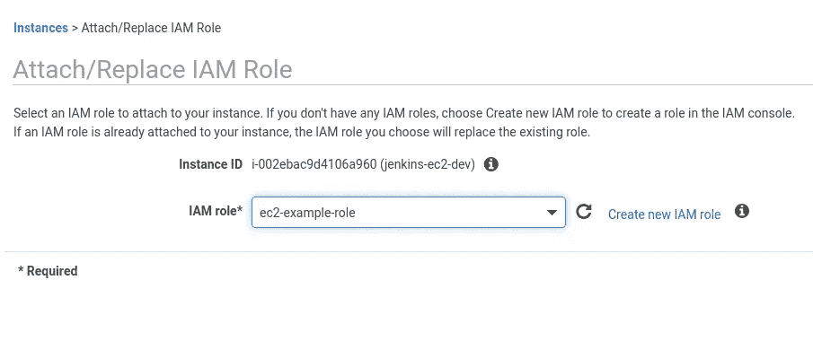
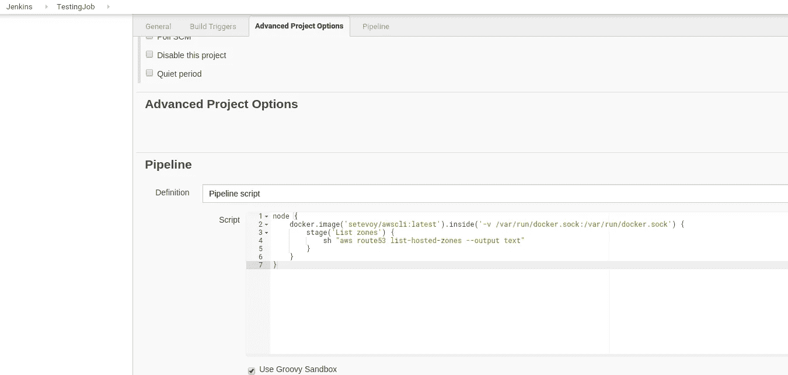
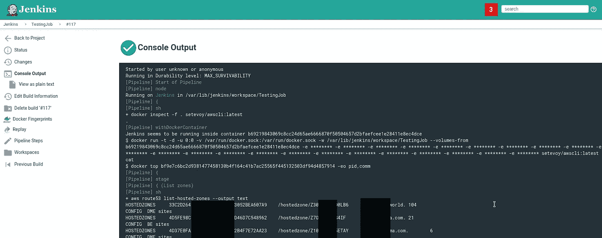
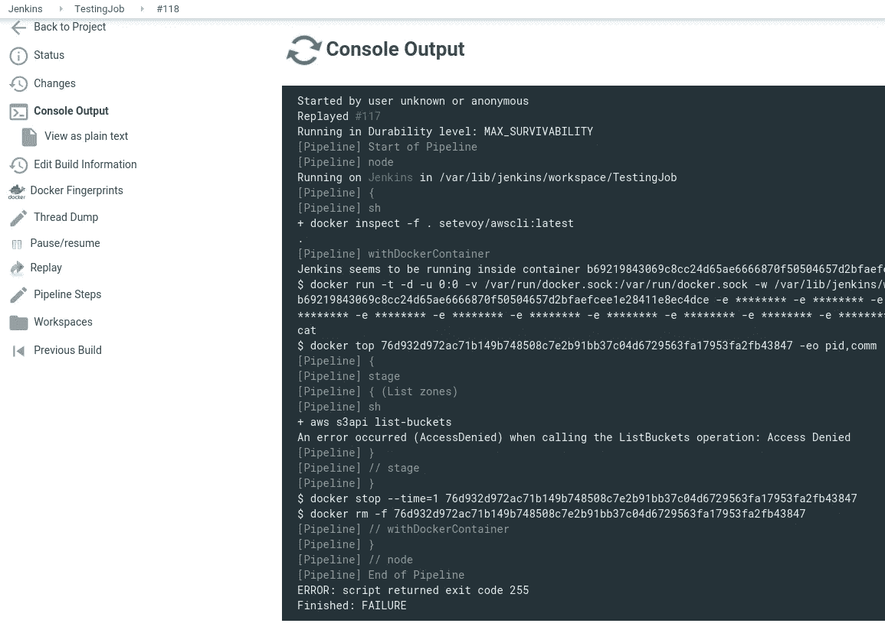

# AWS: IAM 用户密钥轮换、EC2 IAM 角色和 Jenkins

> 原文：<https://itnext.io/aws-iam-users-keys-rotation-ec2-iam-roles-and-jenkins-bfca5e012d18?source=collection_archive---------6----------------------->


今天，我查看了我们的 IAM 用户,“突然”想起有时更新他们的凭证是有好处的:



嗯，这样做很好，但这里有一个问题:在 IAM 中设置密钥过期很简单，但如何处理我们的 Jenkins 中使用的所有脚本以及使用这些 IAM 访问/秘密密钥的脚本呢？

例如，我们的后端配置是在 Jenkins 上使用 Ansible `[cloudformation](https://rtfm.co.ua/ansible-modul-cloudformation/)`模块完成的，该模块使用 IAM 用户和 IAM 策略以及 EC2/RDS/CloudFormation 等允许规则。

我们的数据分析有自己的作业，这些作业执行一些 ETL 作业，并使用 IAM 用户将结果存储在 AWS S3 存储桶中，IAM 用户的策略允许访问特定的 S3 存储桶。

现在，每次在 IAM 中轮换作业时，需要更新所有这些作业中的所有访问/密钥吗？

作为一个解决方案，可以使用 Hashicorp Vault ，它可以向这些脚本/作业授予访问令牌。但是首先，设置 Vault 本身、它的备份等是一些事情(和时间),其次，使用脚本/Jenkins 作业来更新它们以使用 Vault 而不是具有访问/秘密密钥的变量是一项工作。

一个更好的解决方案是为 EC2 使用 IAM 角色，因为任何 AWS SDK 都会在认证期间寻找它，例如， [boto3 文档说](https://boto3.amazonaws.com/v1/documentation/api/latest/guide/configuration.html):

1.  在 boto.client()方法中将凭据作为参数传递
2.  创建会话对象时将凭据作为参数传递
3.  环境变量
4.  共享凭据文件(`~/。AWS/凭据`)
5.  AWS 配置文件(`~/。aws/config `)
6.  承担角色提供者
7.  Boto2 配置文件(`/etc/boto.cfg 和~/.boto `)
8.  配置了 IAM 角色的 Amazon EC2 实例上的实例元数据服务。

所以，让我们试着:

1.  使用必要的策略创建 IAM 角色
2.  将其连接到 EC2
3.  使用未配置的 AWS CLI 测试访问

## 创建 IAM 角色

创建一个角色，选择了 EC2 类型:



附加任何策略，这里以*Amazon route 53 readonlyaccess*为例:



保存您的新角色:



## 运行 EC2

创建 EC2 实例并设置上面创建的 IAM 角色:



## 测试

登录到实例:

```
ssh admin@34.244.125.163 -i setevoy-testing-eu-west-1.pem
```

在[实例元数据](https://docs.aws.amazon.com/en_us/AWSEC2/latest/UserGuide/ec2-instance-metadata.html)中检查 IAM:

```
root@ip-172–31–42–77:/home/admin# curl [http://169.254.169.254/latest/meta-data/iam/info](http://169.254.169.254/latest/meta-data/iam/info)
{
“Code” : “Success”,
“LastUpdated” : “2019–05–30T10:54:26Z”,
“InstanceProfileArn” : “arn:aws:iam::534***385:instance-profile/ec2-example-role”
…
```

安装 AWS CLI:

```
root@ip-172–31–42–77:/home/admin# apt update && apt -y install awscli
```

并在没有任何访问/密钥配置的情况下获取 Route53 托管区域:

```
root@ip-172–31–42–77:/home/admin# aws route53 list-hosted-zones — output text
HOSTEDZONES 33C2D264-***-***-3052BEA607A9 /hostedzone/Z30***LB6 example.com. 104
CONFIG DME sites False
…
```

*“管用！”*。

## 詹金斯

让我们更进一步，看看这是否能在 Jenkins 上工作，首先——Jenkins 本身运行在 Docker 容器中，其次——它的任务(如 Ansible 任务)也是在 Jenkins“内部”使用 Docker 容器启动的。

更新现有 EC2 实例:



附加先前创建的角色:



使用 AWS CLI 创建自己的 Docker 映像—创建简单的`Dockerfile`:

```
FROM python:3.7-stretch
RUN apt-get update -y
RUN pip install awscli
```

构建图像:

```
root@jenkins-dev:/opt/jenkins# docker build -t setevoy/awscli .
```

检查一下:

```
root@jenkins-dev:/opt/jenkins# docker run -ti setevoy/awscli aws — version
aws-cli/1.16.168 Python/3.7.3 Linux/4.9.0–8-amd64 botocore/1.12.158
```

转到 Jenkins 并创建一个测试作业。

这里是[詹金斯管道](https://jenkins.io/doc/book/pipeline/docker/)用过的:

```
node {
    docker.image('setevoy/awscli:latest').inside('-v /var/run/docker.sock:/var/run/docker.sock') {
        stage('List zones') {
            sh "aws route53 list-hosted-zones --output text"
        }
    }
}
```



运行此作业:



太好了！

让我们检查一下未授权的 API 调用是否有效。

在我们的策略中，只允许*Amazon route 53 readonlyaccess*——让我们尝试执行 S3 列表桶:

```
node {
    docker.image('setevoy/awscli:latest').inside('-v /var/run/docker.sock:/var/run/docker.sock') {
        stage('List zones') {
            sh "aws s3api list-buckets"
        }
    }
}
```

运行:



> + aws s3api list-buckets
> 调用 ListBuckets 操作时出错(访问被拒绝):访问被拒绝

拒绝访问 —太好了！

但是使用 EC2 IAM 角色作为 jenkins jobs 授权机制有一个问题:实际上，它的 EC2 实例将访问 AWS 帐户下的所有资源。

也就是说，如果某人将获得对该主机的 SSH 访问权限，他将能够访问我们 AWS 中的任何其他资源。

一方面，这可以通过使用 EC2 spot-instance 作为 Jenkins workers 并附加专用的受限策略来消除。

另一方面，如果有人要访问你的 Jenkins，无论如何你都会有大问题，所以不要忘记升级它，并通过授权和 AWS 安全组限制对它的访问。

> 2019 年 4 月 9 日，安全研究员 Jaikey Sarraf 向 Matrix 警告了 Jenkins 中存在的漏洞，Matrix 称其用于持续集成。“我们使用的 Jenkins 版本存在漏洞(CVE-2019–1003000，CVE-2019–1003001，CVE-2019–1003002)，使得攻击者能够劫持凭据(转发的 ssh 密钥)，从而访问我们的生产基础架构。”

[https://www . info security-magazine . com/news/matrix-compromised-through-known-1/](https://www.infosecurity-magazine.com/news/matrix-compromised-through-known-1/)

*最初发布于* [*RTFM: Linux，devo PSисистемноеадммиитиииииованниое*](https://rtfm.co.ua/en/aws-iam-users-keys-rotation-ec2-iam-roles-and-jenkins/)*。*