# AWS IoT、LoRa 和 LoRaWAN

> 原文：<https://itnext.io/aws-iot-lora-and-lorawan-ec073d7bdfa5?source=collection_archive---------4----------------------->

## 使用 AWS 物联网、LoRa 和 LoRaWAN 近实时收集和分析物联网数据

帖子的音频版本

# 介绍

在 ITNEXT 最近发表的一篇文章中， [LoRa 和 LoRaWAN for IoT:LoRa 和 LoRaWAN 协议用于物联网的低功耗广域网](/lora-for-iot-1f91085c5917)入门，我们探索了如何使用[LoRa](https://en.wikipedia.org/wiki/LoRa)(**Lo**ng**Ra**nge)和 LoRa wan 协议在包含多个嵌入式传感器的物联网设备和物联网网关之间远距离传输和接收传感器数据。在这篇文章中，我们将使用 AWS IoT 将该架构扩展到云，AWS IoT 是一套广泛而深入的物联网服务，从边缘到云。我们将使用 AWS 云平台安全地收集、传输和分析物联网数据。

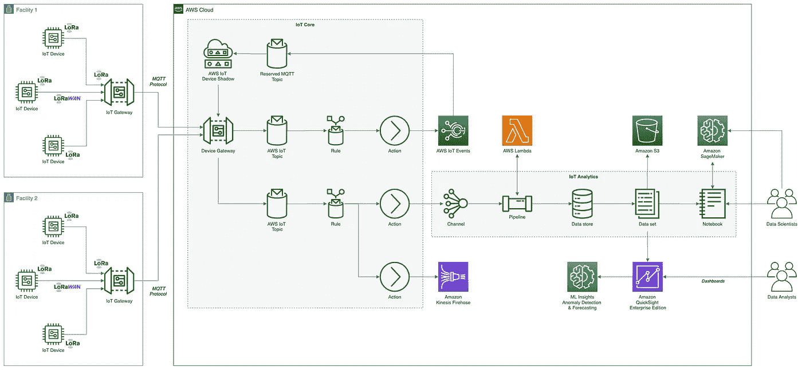

## 洛拉和洛拉万

根据 [LoRa 联盟](https://lora-alliance.org/resource-hub/what-lorawanr)的说法，低功耗广域网(LPWAN)预计将支持预计用于物联网(IoT)的数十亿设备中的大部分。LoRaWAN 的设计自下而上地优化了 LPWANs 的电池寿命、容量、范围和成本。LoRa 和 LoRaWAN 允许不同类型行业的物联网设备进行远程连接。根据[维基百科](https://en.wikipedia.org/wiki/LoRa)，LoRaWAN 为网络定义了通信协议和系统架构，而 LoRa 物理层则启用了远程通信链路。

## AWS 物联网

AWS 将 [AWS IoT](https://aws.amazon.com/iot/) 描述为一组托管服务，使*联网设备能够连接到 AWS 云，并让云中的应用程序与联网设备进行交互* AWS 物联网服务涵盖三个类别:设备软件、连接和控制以及分析。

在本帖中，我们将重点介绍三种 AWS IOT 服务，每个类别一种，包括 AWS 物联网设备 SDK、AWS 物联网核心和 AWS 物联网分析。根据 AWS 的说法， [AWS 物联网设备 SDK](https://docs.aws.amazon.com/iot/latest/developerguide/iot-sdks.html)包括开源库和开发人员以及带有示例的移植指南，以帮助您在您选择的硬件平台上构建创新的物联网产品或解决方案。 [AWS 物联网核心](https://aws.amazon.com/iot-core/)是一项托管云服务，可让互联设备轻松、安全地与云应用和其他设备进行交互。AWS 物联网核心可以可靠、安全地处理消息并将其路由到 AWS 端点和其他设备。最后， [AWS 物联网分析](https://aws.amazon.com/iot-analytics/)是一款完全托管的物联网分析服务，专为物联网设计，可收集、预处理、丰富、存储和分析大规模的物联网设备数据。

要了解更多关于 AWS 物联网的信息，特别是我们将在本文中探索的 AWS 物联网服务，我建议阅读我最近在《走向数据科学》上发表的文章[开始使用 AWS 物联网分析](https://towardsdatascience.com/getting-started-with-iot-analytics-on-aws-5f2093bcf704)。

# 硬件选择

在这篇文章中，我们将使用以下硬件。

## 具有嵌入式传感器的物联网设备

一个 Arduino 单板微控制器将作为我们的物联网设备。2019 年 8 月发布的 3.3V 支持人工智能的 [Arduino Nano 33 BLE 感应](https://store.arduino.cc/usa/nano-33-ble-sense-with-headers)板([亚马逊](https://www.amazon.com/Arduino-Nano-Sense-headers-Mounted/dp/B07WXKDVTL/):36.00 美元)，配备了来自 Nordic Semiconductors 的强大 [nRF52840](https://www.nordicsemi.com/Products/Low-power-short-range-wireless/nRF52840) 处理器，运行频率为 64 MHz 的 32 位 ARM Cortex-M4 CPU，1MB 的 CPU 闪存，256KB 的 SRAM，以及一个 [NINA-B306](https://www.u-blox.com/en/product/nina-b3-series-open-cpu) 独立蓝牙 5 低

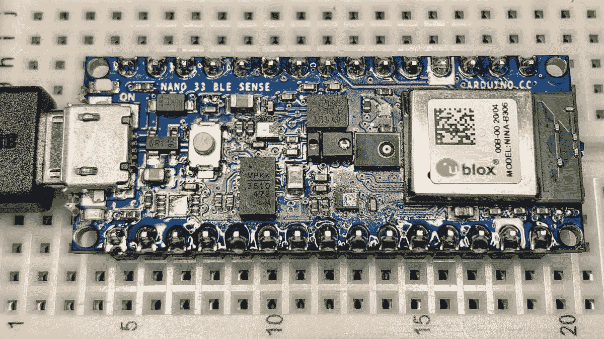

Sense 包含一系列令人印象深刻的嵌入式传感器:

*   9 轴惯性传感器( [LSM9DS1](https://content.arduino.cc/assets/Nano_BLE_Sense_lsm9ds1.pdf) ): 3D 数字线加速度传感器、3D 数字
    角速度传感器、3D 数字磁传感器
*   湿度和温度传感器( [HTS221](https://content.arduino.cc/assets/Nano_BLE_Sense_HTS221.pdf) ):电容式数字相对湿度和温度传感器
*   气压传感器( [LPS22HB](https://content.arduino.cc/assets/Nano_BLE_Sense_lps22hb.pdf) ): MEMS 纳米压力传感器:260–1260 百帕(hPa)绝对数字输出气压计
*   麦克风( [MP34DT05](https://content.arduino.cc/assets/Nano_BLE_Sense_mp34dt05-a.pdf) ): MEMS 音频传感器全向数字麦克风
*   手势、接近度、光色和光强传感器( [APDS9960](https://content.arduino.cc/assets/Nano_BLE_Sense_av02-4191en_ds_apds-9960.pdf) ):高级手势检测、接近度检测、数字环境光感测(ALS)和颜色感测(RGBC)。

Arduino Sense 是一款出色的[低成本](https://www.amazon.com/Arduino-Nano-Sense-headers-Mounted/dp/B07WXKDVTL)单板微控制器，用于学习物联网传感器数据的收集和传输。

## 物联网网关

根据 [TechTarget](https://whatis.techtarget.com/definition/IoT-gateway) 的说法，物联网网关是一种物理设备或软件程序，充当云与控制器、传感器和智能设备之间的连接点。所有移动到云的数据都要通过网关，网关可以是专用的硬件设备或软件程序，反之亦然。

借用物联网的话来说，LoRa 网关是设备和云之间的桥梁。设备使用 LoRaWAN 等低功耗网络连接到网关，而网关使用 WiFi、以太网或蜂窝等高带宽网络连接到云。

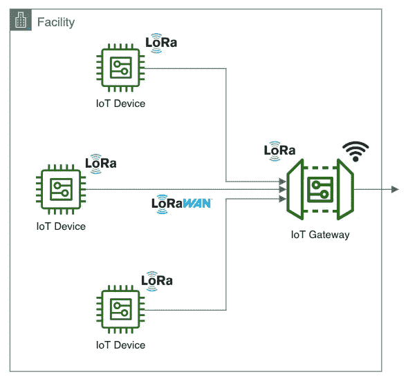

一台第三代 [Raspberry Pi 3 Model B+](https://www.raspberrypi.org/products/raspberry-pi-3-model-b-plus/) 单板计算机(SBC)将作为我们的 LoRa 物联网网关。这款 Raspberry Pi 型号具有 1.4GHz Cortex-A53 (ARMv8) 64 位四核处理器片上系统(SoC)、1GB LPDDR2 SDRAM、双频无线局域网、蓝牙 4.2 BLE 和千兆以太网([亚马逊](https://www.amazon.com/dp/B085DPFR3N):42.99 美元)。

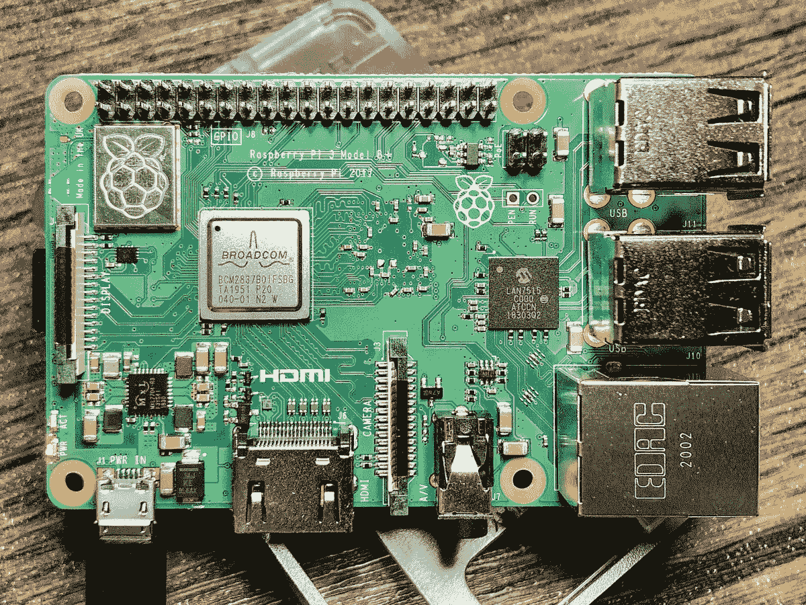

## LoRa 收发器模块

为了在包含嵌入式传感器的物联网设备和物联网网关之间传输物联网传感器数据，我使用了 REYAX [RYLR896](http://reyax.com/products/rylr896/) LoRa 收发器模块([亚马逊](https://www.amazon.com/gp/product/B07NB3BK5H/):19.50 美元 x 2)。收发器模块通常被称为[通用异步收发器](https://en.wikipedia.org/wiki/Universal_asynchronous_receiver-transmitter) (UART)。UART 是用于异步串行通信的计算机硬件设备，其中数据格式和传输速度是可配置的。

根据制造商 REYAX 的说法， [RYLR896](http://reyax.com/products/rylr896/) 包含 [Semtech SX1276](https://www.semtech.com/products/wireless-rf/lora-transceivers/sx1276) 远程低功耗收发器。RYLR896 模块提供超长距离扩频通信和高抗干扰性，同时最大限度地降低功耗。每个 RYLR896 模块包含一个小型 PCB 集成螺旋天线。该收发器工作在 868 和 915 MHz 频率范围。在本次演示中，我们将在北美以 915 MHz 进行传输。

Arduino Sense ( *物联网设备*)使用其中一个 RYLR896 模块(*显示在前*下方)传输数据。Raspberry Pi ( *物联网网关*)连接到另一个 RYLR896 模块(*显示在后*下方)，接收数据。


## 洛拉万保安公司

RYLR896 支持 AES 128 位数据加密。使用[高级加密标准](https://en.wikipedia.org/wiki/Advanced_Encryption_Standard) (AES)，我们将使用 32 位十六进制数字密码(128 位/ 4 位/十六进制数字)对从物联网设备发送到物联网网关的数据进行加密。

# 设置 AWS 资源

首先，我们将在 AWS 云平台上创建必要的 AWS 物联网和相关资源。一旦这些资源到位，我们就可以继续配置物联网设备和物联网网关，以安全地将传感器数据传输到云。

这篇文章的所有源代码都在 GitHub 上。使用以下命令 git 克隆项目的本地副本。

```
git clone --branch master --single-branch --depth 1 --no-tags \
    [https://github.com/garystafford/iot-aws-lora-demo.git](https://github.com/garystafford/iot-aws-lora-demo.git)
```

## 自动气象站云形成

CloudFormation 模板 [iot-analytics.yaml](https://github.com/garystafford/iot-aws-lora-demo/blob/master/cloudformation/iot-analytics.yaml) 将创建一个包含以下资源的 AWS IoT CloudFormation 堆栈。

*   AWS 物联网
*   AWS 物联网政策
*   AWS 物联网核心主题规则
*   AWS 物联网分析渠道、管道、数据存储和数据集
*   AWS 和λ权限
*   亚马逊 S3 桶
*   亚马逊 SageMaker 笔记本实例
*   AWS IAM 角色

继续之前，请注意 CloudFormation 模板中使用的 AWS 资源所涉及的成本。要从附带的 CloudFormation 模板创建 AWS CloudFormation 堆栈，请执行以下 AWS CLI 命令。

最终的 CloudFormation 堆栈应该包含 16 个 AWS 资源。

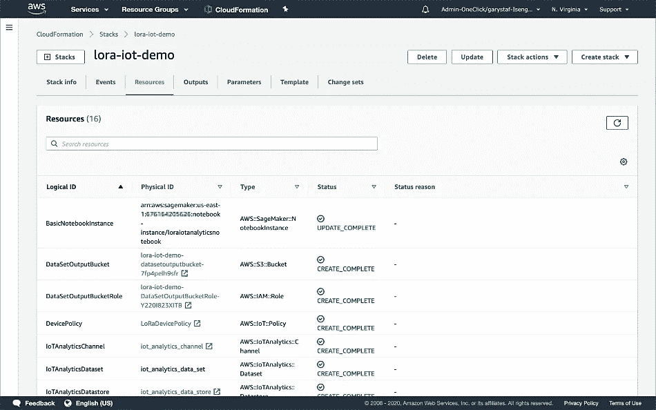

## 额外资源

不幸的是，AWS CloudFormation 无法创建本次演示所需的所有 AWS 物联网资源。要完成 AWS 配置过程，请执行以下一系列 AWS CLI 命令， [aws_cli_commands.md](https://github.com/garystafford/iot-aws-lora-demo/blob/master/cloudformation/aws_cli_commands.md) 。这些命令将创建剩余的资源，包括 AWS 物联网事物类型、事物组、事物计费组和 X.509 证书。

# 物联网设备配置

部署 AWS 资源后，我们可以配置物联网设备和物联网网关。

## Arduino 草图

对于那些不熟悉 Arduino 的人来说，一个[草图](https://www.arduino.cc/en/tutorial/sketch)就是一个程序的 Arduino 等价物。它是上传到非易失性闪存并在 Arduino 板上运行的代码单元。Arduino 语言是一组 C 和 C++函数。所有由 [avr-g++](https://linux.die.net/man/1/avr-g++) 编译器支持的标准 C 和 C++结构都应该在 Arduino 中工作。

对于本文，草图 [lora_iot_demo_aws.ino](https://github.com/garystafford/iot-aws-lora-demo/blob/master/lora_iot_demo_aws/lora_iot_demo_aws.ino) 包含使用 LoRaWAN 协议收集和安全传输环境传感器数据所需的代码，包括温度、相对湿度、气压、红、绿、蓝(RGB)颜色和环境光强度。

## AT 命令

与 RYLR896 远程调制解调器的通信是通过 AT 命令完成的。AT 命令是用于控制调制解调器的指令。AT 是**在**tension 的缩写。每个命令行都以 AT 开头。这就是为什么调制解调器命令被称为 at 命令，根据[开发者之家](https://www.developershome.com/sms/atCommandsIntro.asp)。AT 命令的完整列表可以从 RYLR896 产品页面以 [PDF](http://reyax.com/wp-content/uploads/2020/01/Lora-AT-Command-RYLR40x_RYLR89x_EN.pdf) 格式下载。

为了有效地将环境传感器数据从物联网传感器传输到物联网网关，草图将传感器 ID 和传感器值连接在一个字符串中。该字符串将被纳入 AT 命令，发送到 RYLR896 LoRa 收发器模块。为了更容易解析物联网网关上的传感器数据，我们将使用竖线(|)来分隔传感器值，而不是逗号。根据 REYAX 的说法，LoRa 有效载荷的最大长度约为 330 字节。

下面，我们将看到一个 AT 命令的示例，该命令用于发送来自物联网传感器的传感器数据以及物联网网关收到的相应未加密数据。两者都包含 LoRa 发射器地址 ID、有效载荷长度(在本例中为 *62 字节)和有效载荷。物联网网关接收的数据还有[接收信号强度指标](https://en.wikipedia.org/wiki/Received_signal_strength_indication) (RSSI)，和[信噪比](https://en.wikipedia.org/wiki/Signal-to-noise_ratio) (SNR)。*

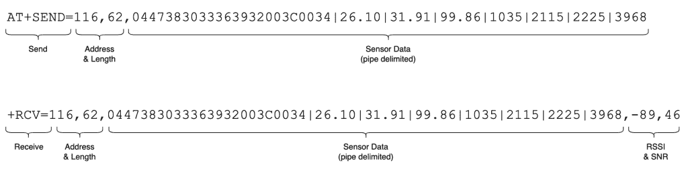

## 在物联网网关上接收数据

Raspberry Pi 将充当 LoRa 物联网网关，从物联网设备 Arduino 接收环境传感器数据，并将数据发送到 AWS。Raspberry Pi 运行一个 Python 脚本，[rasppi _ lora _ receiver _ aws . py](https://github.com/garystafford/iot-aws-lora-demo/blob/master/python_scripts/rasppi_lora_receiver_aws.py)，它将从 Arduino Sense 接收数据，解密数据，解析传感器值，并将数据序列化为 JSON 有效载荷，最后，将有效载荷以 MQTT 协议消息的形式传输到 AWS。该脚本使用 Python 串口扩展 [pyserial](https://pypi.org/project/pyserial/) ，它封装了与 RYLR896 模块通信的串口访问。该脚本使用 [AWS 物联网设备 SDK for Python v2](https://docs.aws.amazon.com/iot/latest/developerguide/iot-sdks.html#iot-python-sdk) 与 AWS 通信。

## 运行物联网网关 Python 脚本

为了在 Raspberry Pi 上运行 Python 脚本，我们将使用一个助手 shell 脚本，[rasppi _ lora _ receiver _ AWS . sh](https://github.com/garystafford/iot-aws-lora-demo/blob/master/python_scripts/rasppi_lora_receiver_aws.sh)。shell 脚本有助于构造执行 Python 脚本所需的参数。

为了运行 helper 脚本，我们执行以下命令，用您的端点替换输入参数 AWS IoT 端点。

```
sh ./rasppi_lora_receiver_aws.sh \
  a1b2c3d4e5678f-ats.iot.us-east-1.amazonaws.com
```

您应该会看到控制台输出，如下所示。

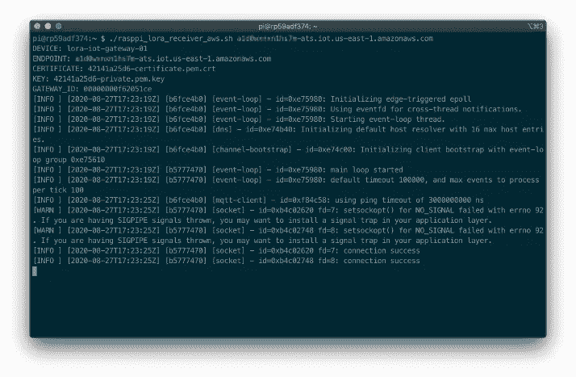

该脚本首先配置 RYLR896 模块，并将配置输出到日志文件`output.log`。如果成功，我们应该会看到以下记录的调试信息。

```
DEBUG:root:Connecting to a1b2c3d4e5f6-ats.iot.us-east-1.amazonaws.com with client ID 'lora-iot-gateway-01'…
DEBUG:root:Connecting to REYAX RYLR896 transceiver module…
DEBUG:root:Connected!
DEBUG:root:Address set? +OK
DEBUG:root:Network Id set? +OK
DEBUG:root:AES-128 password set? +OK
DEBUG:root:Module responding? +OK
DEBUG:root:Address: +ADDRESS=116
DEBUG:root:Network id: +NETWORKID=6
DEBUG:root:UART baud rate: +IPR=115200
DEBUG:root:RF frequency: +BAND=915000000
DEBUG:root:RF output power: +CRFOP=15
DEBUG:root:Work mode: +MODE=0
DEBUG:root:RF parameters: +PARAMETER=12,7,1,4
DEBUG:root:AES128 password of the network: +CPIN=92A0ECEC9000DA0DCF0CAAB0ABA2E0EF
```

出于调试目的，该传感器数据也被写入日志文件。日志中的第一行(*显示在*下方)是通过 LoRaWAN 从物联网设备接收的原始解密数据。第二行是 JSON 序列化的有效负载，使用 MQTT 协议安全地发送到 AWS。

```
DEBUG:root:b'+RCV=116,59,0447383033363932003C0034|23.46|41.89|99.38|230|692|833|1116,-48,39\r\n'DEBUG:root:{'ts': 1598305503.7041512, 'data': {'humidity': 41.89, 'temperature': 23.46, 'device_id': '0447383033363932003C0034', 'gateway_id': '00000000f62051ce', 'pressure': 99.38, 'color': {'red': 230.0, 'blue': 833.0, 'ambient': 1116.0, 'green': 692.0}}}DEBUG:root:b'+RCV=116,59,0447383033363932003C0034|23.46|41.63|99.38|236|696|837|1127,-49,35\r\n'DEBUG:root:{'ts': 1598305513.7918658, 'data': {'humidity': 41.63, 'temperature': 23.46, 'device_id': '0447383033363932003C0034', 'gateway_id': '00000000f62051ce', 'pressure': 99.38, 'color': {'red': 236.0, 'blue': 837.0, 'ambient': 1127.0, 'green': 696.0}}}DEBUG:root:b'+RCV=116,59,0447383033363932003C0034|23.44|41.57|99.38|232|686|830|1113,-48,32\r\n'DEBUG:root:{'ts': 1598305523.8556132, 'data': {'humidity': 41.57, 'temperature': 23.44, 'device_id': '0447383033363932003C0034', 'gateway_id': '00000000f62051ce', 'pressure': 99.38, 'color': {'red': 232.0, 'blue': 830.0, 'ambient': 1113.0, 'green': 686.0}}}DEBUG:root:b'+RCV=116,59,0447383033363932003C0034|23.51|41.44|99.38|205|658|802|1040,-48,36\r\n'DEBUG:root:{'ts': 1598305528.8890748, 'data': {'humidity': 41.44, 'temperature': 23.51, 'device_id': '0447383033363932003C0034', 'gateway_id': '00000000f62051ce', 'pressure': 99.38, 'color': {'red': 205.0, 'blue': 802.0, 'ambient': 1040.0, 'green': 658.0}}}
```

# AWS 物联网核心

基于 Raspberry Pi 的物联网网关将向 [AWS 物联网核心](https://aws.amazon.com/iot-core/)注册。物联网核心允许用户快速安全地将设备连接到 AWS。

## 东西

据 AWS 称，物联网核心可以可靠地扩展到数十亿台设备和数万亿条消息。注册设备在 AWS 物联网核心中被称为*物*。一个*事物*是一个特定设备或逻辑实体的表示。关于一个事物的信息作为 JSON 数据存储在[注册表](https://docs.aws.amazon.com/iot/latest/developerguide/iot-thing-management.html)中。

下面，我们看到一个由云形成创造的东西的例子。这个东西，`lora-iot-gateway-01`，代表物理物联网网关。我们给物联网网关分配了一个物类型`LoRaIoTGateway`，一个物组`LoRaIoTGateways`，一个物计费组`IoTGateways`。

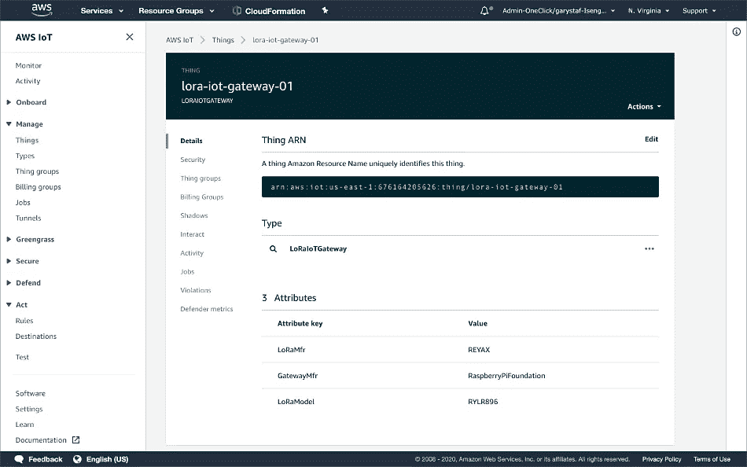

在一个真实的物联网环境中，包含数百、数千甚至数百万的物联网设备、网关和传感器，这些分类机制，即事物类型、事物组和事物计费组，将有助于组织物联网资产。

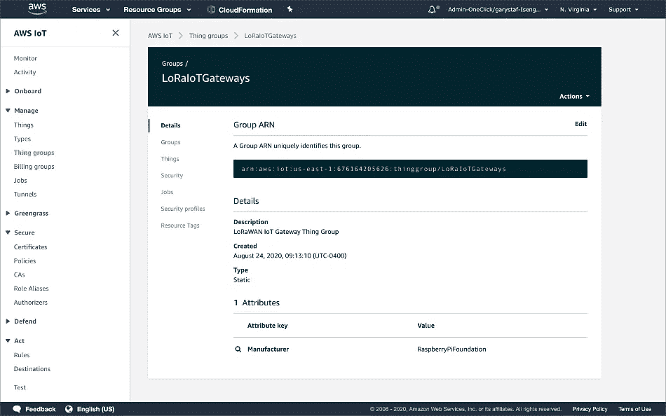

## 设备网关和消息代理

物联网核心提供了一个[设备网关](https://aws.amazon.com/iot-core/features)，管理所有活动设备连接。该网关目前支持 MQTT、WebSockets 和 HTTP 1.1 协议。在消息网关的背后是一个高吞吐量的发布/订阅[消息代理](https://aws.amazon.com/iot-core/features)，它以低延迟安全地向所有物联网设备和应用传输消息。下面，我们看到一个典型的 AWS 物联网核心架构，包含多个主题、规则和操作。

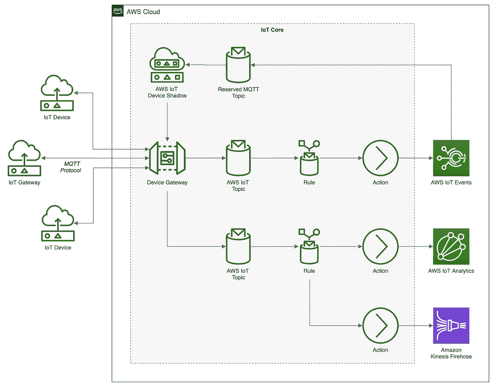

## AWS 物联网安全性

AWS 物联网核心提供相互认证和加密，确保 AWS 和设备之间交换的所有数据在默认情况下都是安全的。在演示中，使用端口 443 上带有 [X.509](https://en.wikipedia.org/wiki/X.509) 数字证书的[传输层安全](https://en.wikipedia.org/wiki/Transport_Layer_Security) (TLS) 1.2 安全地发送所有数据。下面，我们看到一个分配给这个东西的 X.509 证书的例子，`lora-iot-gateway-01`，它代表物理物联网网关。之前，使用 AWS CLI 生成的 X.509 证书和私钥安装在物联网网关上。

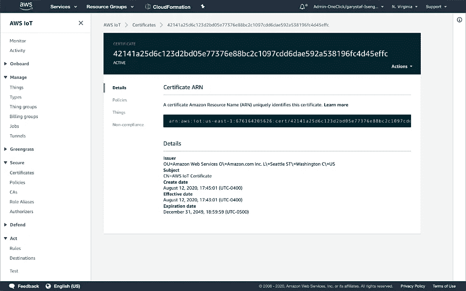

设备访问 AWS 上任何资源的授权由 [AWS 物联网核心政策](https://docs.aws.amazon.com/iot/latest/developerguide/iot-policies.html)控制。这些策略类似于 AWS IAM 策略。下面，我们看到一个分配给物联网网关的 AWS 物联网核心策略`LoRaDevicePolicy`的示例。

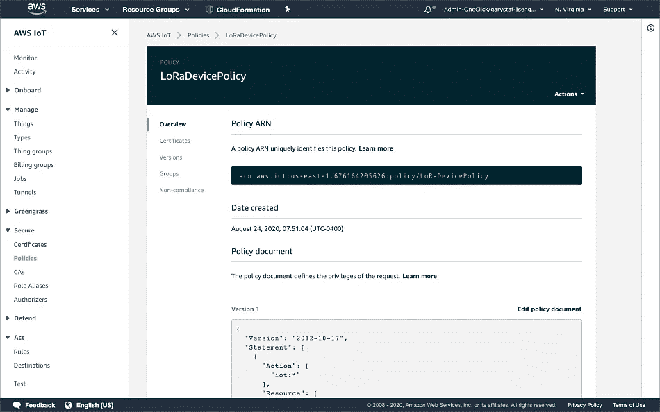

## AWS 物联网核心规则

一旦从物联网网关收到 MQTT 消息(一件*事情*，我们使用 [AWS 物联网规则](https://docs.aws.amazon.com/iot/latest/developerguide/iot-rules.html)将消息数据发送到 [AWS 物联网分析通道](https://docs.aws.amazon.com/iotanalytics/latest/APIReference/API_Channel.html)。规则使您的设备能够与 AWS 服务进行交互。分析规则，并基于 MQTT 主题流执行[动作](https://docs.aws.amazon.com/iot/latest/developerguide/iot-rule-actions.html)。下面，我们看到一个将我们的消息转发到物联网分析渠道的示例规则。

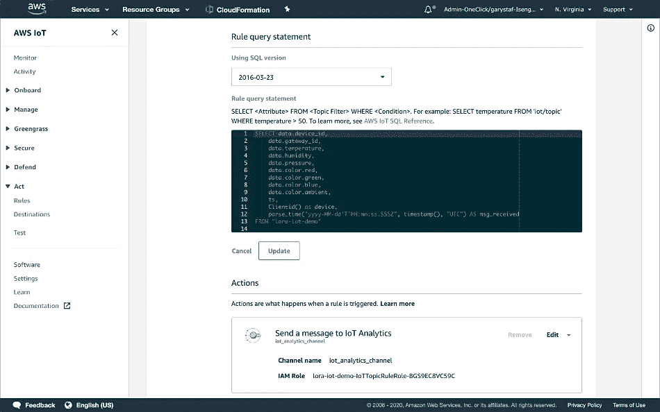

规则查询语句是用标准结构化查询语言(SQL)编写的。规则查询的数据源是一个物联网主题。

# AWS 物联网分析

AWS 物联网分析由五个主要组件组成:通道、管道、数据存储、数据集和笔记本。这些组件使您能够收集、准备、存储、分析和可视化您的物联网数据。


下面，我们看到一个典型的 AWS 物联网分析架构。通过规则操作从 AWS 物联网核心接收物联网消息。[亚马逊 QuickSight](https://aws.amazon.com/quicksight) 提供商业智能、可视化。[亚马逊 QuickSight ML Insights](https://aws.amazon.com/quicksight/features-ml) 增加了异常检测和预测功能。

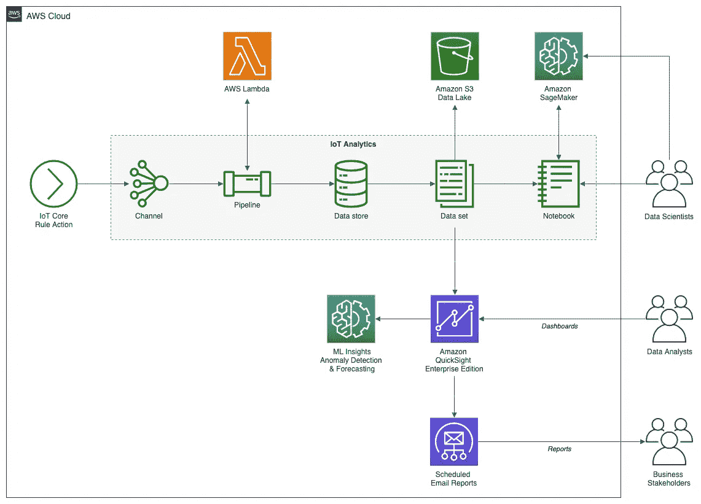

## 物联网分析渠道

AWS 物联网分析通道将来自亚马逊 S3、亚马逊 Kinesis 或亚马逊物联网核心等其他 AWS 来源的消息或数据纳入物联网分析。渠道为物联网分析管道存储数据。渠道和数据存储都支持将数据存储在您自己的亚马逊 S3 存储桶或物联网分析服务管理的 S3 存储桶中。在演示中，我们使用服务管理的 S3 存储桶。

创建频道时，您还可以决定保留数据的时间。在演示中，我们将数据保留期设置为 21 天。信道通常不用于数据的长期存储。通常，您只需在需要分析的时间段内将数据保留在通道中。对于物联网消息数据的长期存储，我建议使用 AWS 物联网核心规则向亚马逊 S3 发送原始物联网数据的副本，使用诸如[亚马逊 Kinesis Data Firehose](https://aws.amazon.com/kinesis/data-firehose/) 之类的服务。

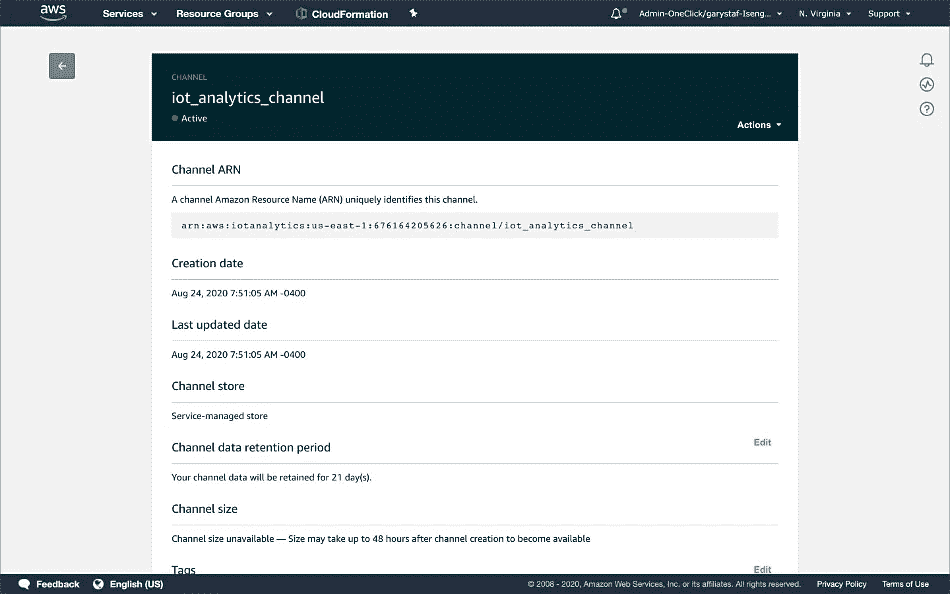

## 物联网分析渠道

AWS 物联网分析管道使用来自一个或多个渠道的消息。管道在将消息存储到物联网分析数据存储之前，对其进行转换、过滤和丰富。管道由有序的活动列表组成。从逻辑上讲，您必须指定一个`[Channel](https://docs.aws.amazon.com/AWSCloudFormation/latest/UserGuide/aws-properties-iotanalytics-pipeline-activity.html#cfn-iotanalytics-pipeline-activity-datastore)` ( *源*)和一个`[Datastore](https://docs.aws.amazon.com/AWSCloudFormation/latest/UserGuide/aws-properties-iotanalytics-pipeline-activity.html#cfn-iotanalytics-pipeline-activity-datastore)` ( *目的地*)活动。或者，您可以在`pipelineActivities`数组中选择多达 23 个附加活动。

在我们的演示管道`iot_analytics_pipeline`中，我们指定了三个额外的活动，包括`[DeviceRegistryEnrich](https://docs.aws.amazon.com/AWSCloudFormation/latest/UserGuide/aws-properties-iotanalytics-pipeline-activity.html#cfn-iotanalytics-pipeline-activity-deviceregistryenrich)`、`[Filter](https://docs.aws.amazon.com/AWSCloudFormation/latest/UserGuide/aws-properties-iotanalytics-pipeline-activity.html#cfn-iotanalytics-pipeline-activity-filter)`和`[Lambda](https://docs.aws.amazon.com/AWSCloudFormation/latest/UserGuide/aws-properties-iotanalytics-pipeline-activity.html#cfn-iotanalytics-pipeline-activity-lambda)`。其他活动类型包括`[Math](https://docs.aws.amazon.com/AWSCloudFormation/latest/UserGuide/aws-properties-iotanalytics-pipeline-activity.html#cfn-iotanalytics-pipeline-activity-math)`、`[SelectAttributes](https://docs.aws.amazon.com/AWSCloudFormation/latest/UserGuide/aws-properties-iotanalytics-pipeline-activity.html#cfn-iotanalytics-pipeline-activity-selectattributes)`、`[RemoveAttributes](https://docs.aws.amazon.com/AWSCloudFormation/latest/UserGuide/aws-properties-iotanalytics-pipeline-activity.html#cfn-iotanalytics-pipeline-activity-removeattributes),`和`[AddAttributes](https://docs.aws.amazon.com/AWSCloudFormation/latest/UserGuide/aws-properties-iotanalytics-pipeline-activity.html#cfn-iotanalytics-pipeline-activity-addattributes)`。

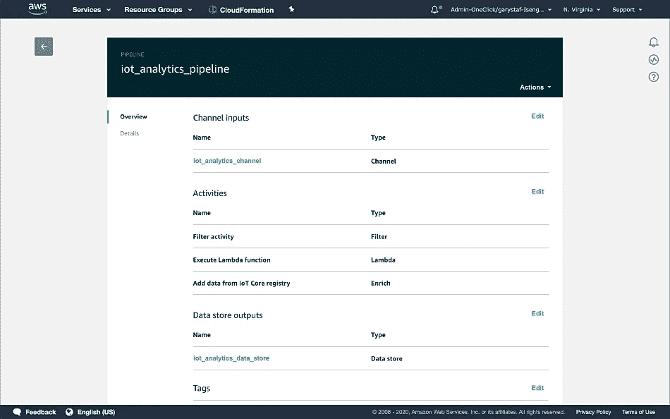

`[Filter](https://docs.aws.amazon.com/AWSCloudFormation/latest/UserGuide/aws-properties-iotanalytics-pipeline-activity.html#cfn-iotanalytics-pipeline-activity-filter)`活动确保传感器值不为空或有其他错误；如果为真，则消息被丢弃。`[Lambda](https://docs.aws.amazon.com/AWSCloudFormation/latest/UserGuide/aws-properties-iotanalytics-pipeline-activity.html#cfn-iotanalytics-pipeline-activity-lambda)`管道活动执行 [AWS Lambda](https://aws.amazon.com/lambda/) 函数来转换管道中的消息。消息在事件对象中被发送到 Lambda。消息被修改，事件对象被返回给活动。

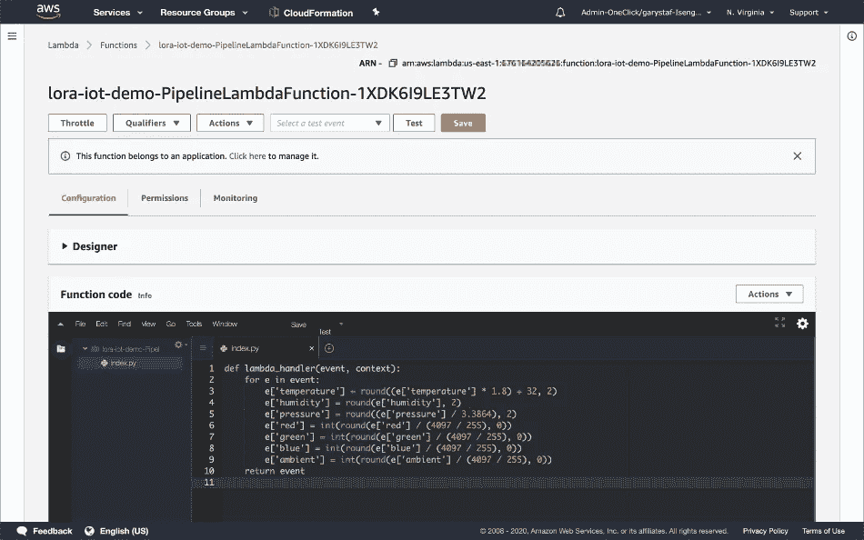

基于 Python 的 Lambda 函数可以轻松处理典型的物联网数据转换任务，包括将`temperature`从摄氏度转换为华氏度，`pressure`从千帕(kPa)转换为英寸汞柱(inHg)，以及将 12 位 RGBA 值转换为 8 位颜色值(0–255)。Lambda 函数还将所有值向下舍入到 0 到 2 个小数位之间的精度。

该演示的管道还通过来自物联网设备的 AWS 物联网核心[注册表](https://docs.aws.amazon.com/iot/latest/developerguide/iot-thing-management.html)的元数据丰富了物联网数据。元数据包括有关生成物联网数据的设备的附加信息，包括自定义属性，如 LoRa 收发器制造商和型号以及物联网网关制造商。


管道的一个显著特征是重新处理消息的能力。如果您对管道进行更改(这通常发生在数据准备阶段)，您可以重新处理相关通道中的任何或所有物联网数据，并覆盖数据集中的物联网数据。

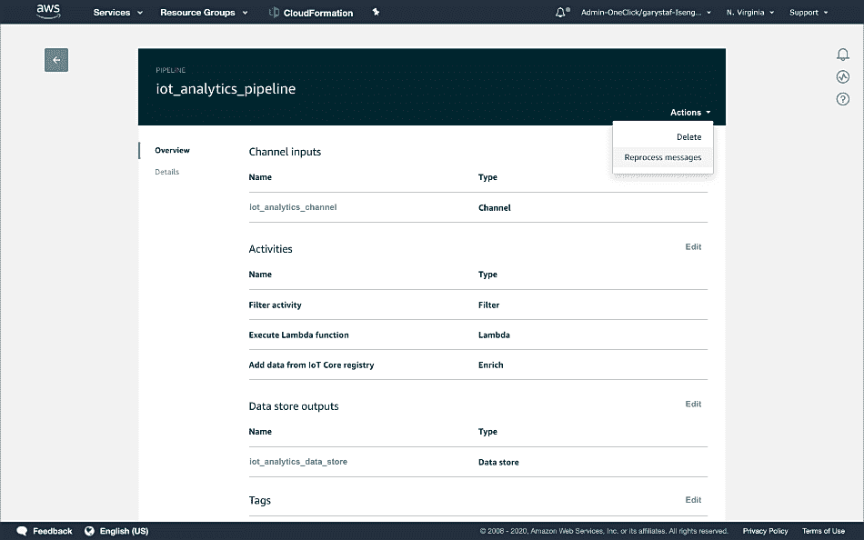

## 物联网分析数据存储

AWS 物联网分析数据存储将 AWS 物联网分析管道中准备好的数据存储在一个完全托管的数据库中。渠道和数据存储都支持将物联网数据存储在您自己的亚马逊 S3 存储桶或物联网分析管理的 S3 存储桶中。在演示中，我们使用服务管理的 S3 存储桶将物联网数据存储在我们的数据存储库`iot_analytics_data_store`。

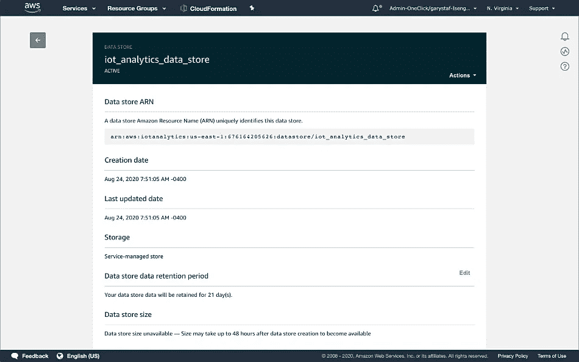

## 物联网分析数据集

AWS 物联网分析数据集通过使用标准 SQL 查询数据存储，自动为数据分析师提供定期的最新见解。使用 cron 表达式实现定期更新。在演示中，我们以 15 分钟的间隔更新我们的数据集`iot_analytics_data_set`。时间间隔可以增加或减少，这取决于正在分析的物联网数据所需的“近实时”特性。

下面，我们在数据集的结果预览窗格中看到消息。请注意用于获取消息的 SQL 查询，它查询数据存储。您会记得，数据存储包含来自管道的转换后的消息。


物联网分析数据集还支持将内容结果(物联网分析数据的物化视图)发送到亚马逊 S3 桶。


CloudFormation 堆栈创建了一个加密的亚马逊 S3 桶。每当`cron`表达式运行计划更新时，该存储桶都会收到来自物联网分析数据集的消息副本。

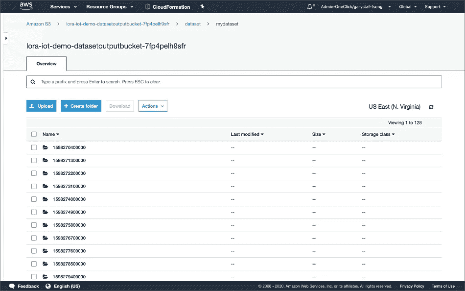

## 物联网分析笔记本

AWS 物联网分析笔记本允许用户使用 [Jupyter 笔记本](https://jupyter.org/)对物联网分析数据集进行统计分析和机器学习。物联网分析笔记本服务包括一组笔记本模板，其中包含 AWS 创作的机器学习模型和可视化。笔记本实例可以链接到 GitHub 或其他源代码库。使用物联网分析笔记本创建的笔记本也可以通过[亚马逊 SageMaker](https://aws.amazon.com/sagemaker/) 直接访问。为了进行演示，笔记本实例是从我们项目的 [GitHub 库](https://github.com/garystafford/iot-aws-lora-demo)中克隆出来的。

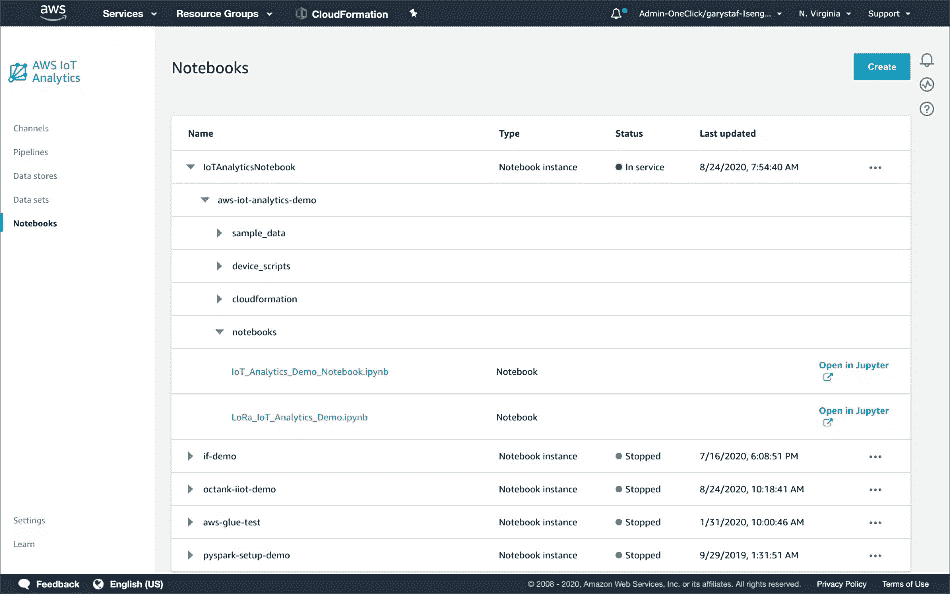

该存储库包含一个基于`conda_python3`内核的示例 Jupyter 笔记本，[LoRa _ IoT _ Analytics _ demo . ipynb](https://github.com/garystafford/aws-iot-analytics-demo/blob/master/notebooks/LoRa_IoT_Analytics_Demo.ipynb)。这个预装环境包括默认的 [Anaconda](https://www.anaconda.com/) 安装和 Python 3。

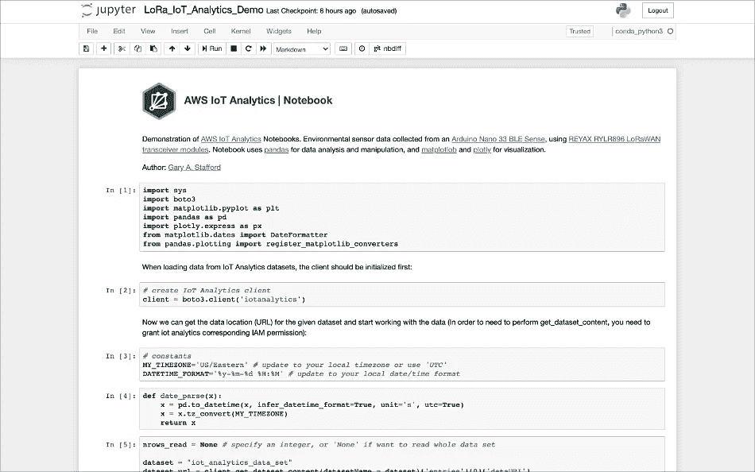

该笔记本使用 [pandas](https://pandas.pydata.org/) 、 [matplotlib](https://matplotlib.org/) 和 [plotly](https://plotly.com/python/) 来操作和可视化存储在物联网分析数据集中的样本物联网数据。

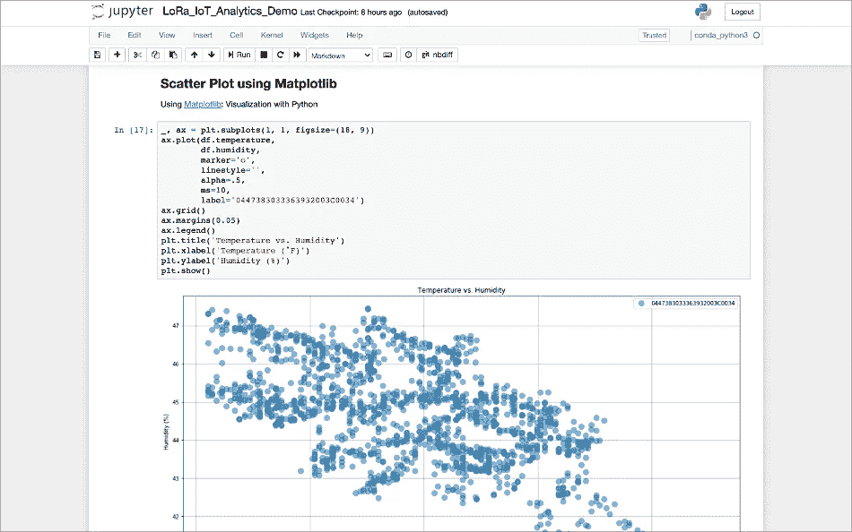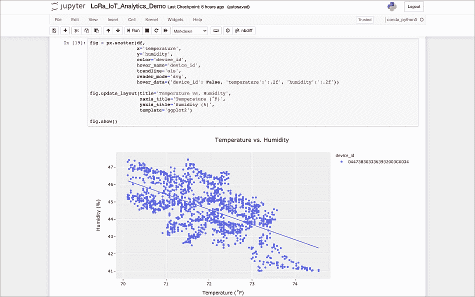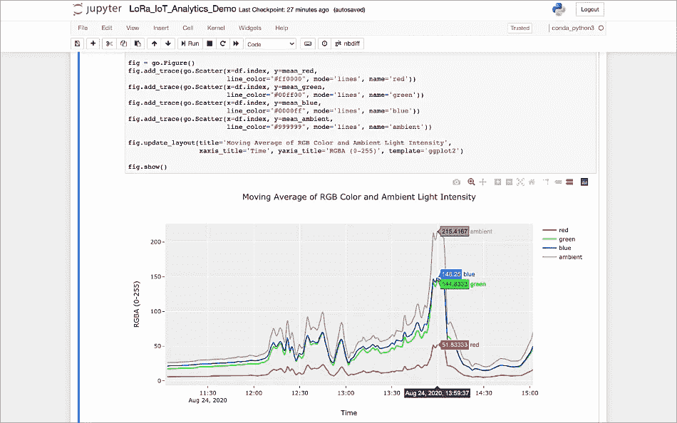

笔记本可以修改，修改的内容推回到 GitHub。您可以轻松地派生出演示的 GitHub 存储库，并修改 CloudFormation 模板以指向您的源代码存储库。


# 亚马逊 QuickSight

[亚马逊 QuickSight](https://aws.amazon.com/quicksight) 提供商业智能(BI)和可视化。[亚马逊 QuickSight ML Insights](https://aws.amazon.com/quicksight/features-ml) 增加了异常检测和预测功能。我们可以使用 Amazon QuickSight 来可视化存储在物联网分析数据集中的物联网消息数据。

亚马逊 QuickSight 有标准版和企业版。AWS 提供了每个版本详细的[产品对比](https://aws.amazon.com/quicksight/pricing/?nc=sn&loc=4)。对于帖子，我正在演示企业版，它包括额外的[功能](https://aws.amazon.com/quicksight/features)，如 ML Insights，每小时刷新 [SPICE](https://docs.aws.amazon.com/quicksight/latest/user/welcome.html#spice) (超快，并行，内存中，计算引擎)，以及主题定制。

如果您选择跟随演示的这一部分，请注意 Amazon QuickSight 的成本。虽然有一个 Amazon QuickSight API，但在本演示中，Amazon QuickSight 不会自动启用或配置 CloudFormation 或使用 AWS CLI。

## QuickSight 数据集

Amazon QuickSight 有各种各样的数据源选项来创建 Amazon QuickSight 数据集，包括下面显示的那些。不要混淆亚马逊 QuickSight 数据集和物联网分析数据集；它们是两种不同的服务功能。


为了进行演示，我们将创建一个 Amazon QuickSight 数据集，该数据集将使用我们的物联网分析数据集`iot_analytics_data_set`。


Amazon QuickSight 让您能够在可视化之前查看和修改 QuickSight 数据集。QuickSight 甚至提供了各种各样的功能，使我们能够对字段值执行动态计算。在本次演示中，我们将保持数据不变，因为所有转换都已在物联网分析管道中完成。

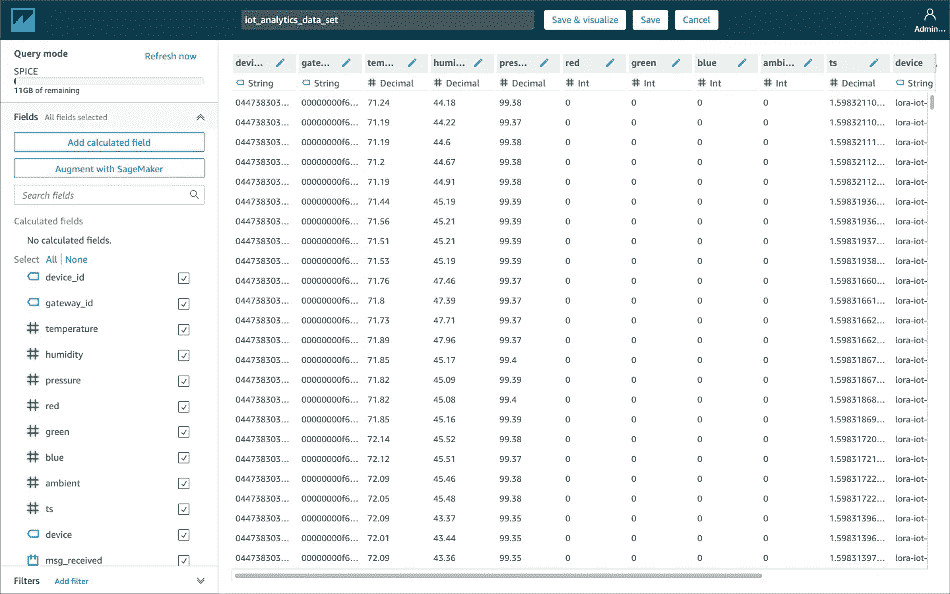

## 快速视力分析

使用从物联网分析数据集构建的 QuickSight 数据集作为数据源，我们创建了 [QuickSight 分析](https://docs.aws.amazon.com/quicksight/latest/user/working-with-analyses.html)。QuickSight 分析控制台如下所示。一个分析主要是视觉效果(也称为视觉类型)的集合。QuickSight 提供了几种[视觉类型](https://docs.aws.amazon.com/quicksight/latest/user/working-with-visual-types.html)。每个图像都与一个数据集相关联。可以过滤 QuickSight 分析或分析中每个视觉的数据。为了演示，我创建了一个简单的 QuickSight 分析，包括一些典型的 QuickSight 视觉效果。

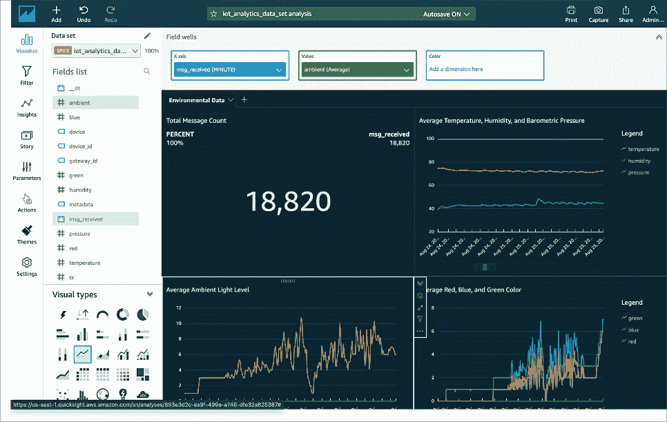

## QuickSight 仪表盘

为了分享 QuickSight 分析，我们可以创建一个 [QuickSight 仪表盘](https://docs.aws.amazon.com/quicksight/latest/user/working-with-dashboards.html)。下面，我们将上面显示的 QuickSight 分析的几个视图作为仪表板。虽然仪表板的查看者不能编辑视觉效果，但是他们可以应用[过滤](https://docs.aws.amazon.com/quicksight/latest/user/filtering-visual-data.html)和交互式[下钻](https://docs.aws.amazon.com/quicksight/latest/user/adding-drill-downs.html)到视觉效果中的数据。

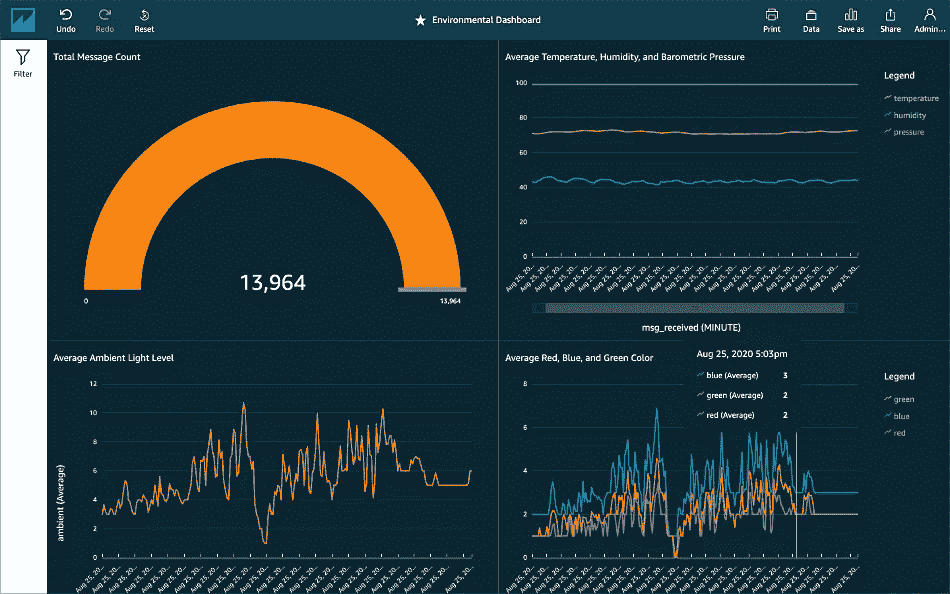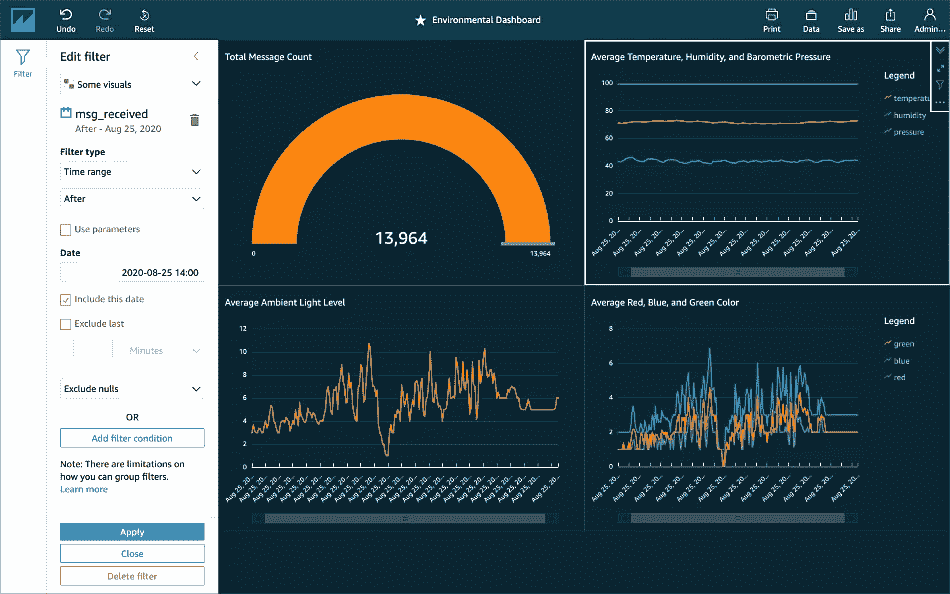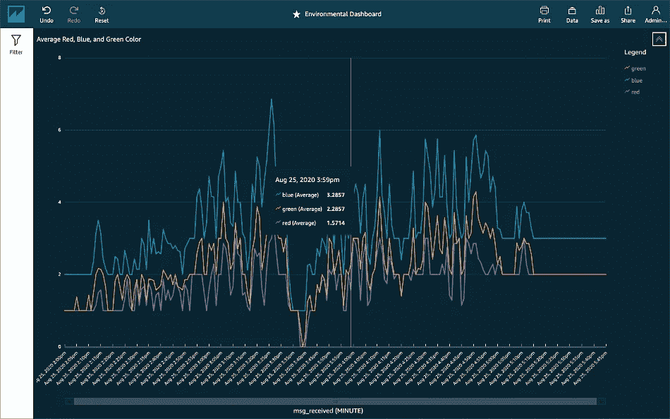

# 亚马逊 QuickSight ML 洞察

据[亚马逊](https://aws.amazon.com/quicksight/features-ml/)报道，ML Insights 利用 AWS 的机器学习(ML)和自然语言能力，从数据中获得更深入的见解。QuickSight 的 ML-powered 异常检测不断分析数据，以发现聚合内部的异常和变化，让您能够在业务发生变化时采取行动。QuickSight 的 ML-powered 预测可用于准确预测您的业务指标，并通过简单的点击操作执行交互式假设分析。QuickSight 的内置算法使任何人都可以轻松地使用从您的数据模式中学习的 ML，为您提供基于历史趋势的准确预测。

下面，我们在演示的 QuickSight 分析中看到 ML Insights 选项卡(*左*)。可将单独检测到的异常添加到 QuickSight 分析中，如视觉效果，并通过[配置](https://docs.aws.amazon.com/quicksight/latest/user/anomaly-detection-using.html)来调整检测参数。观察温度、湿度和大气压力异常，由 ML Insights 根据其异常分数识别，该分数较高或较低，给定 5%的最小差值。这些异常准确地反映了物联网设备的实际故障，该故障是由测试期间过热引起的，从而导致传感器读数异常。

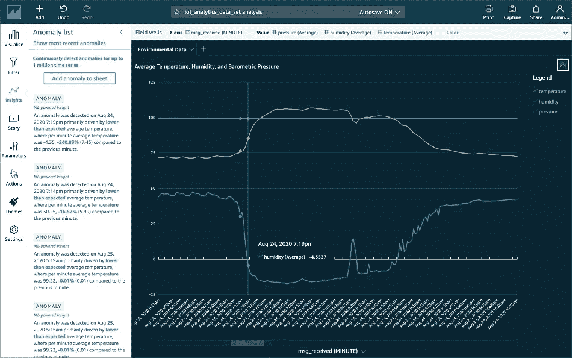

# 在 AWS 上接收消息

为了确认物联网网关正在发送消息，我们可以在物联网网关上使用数据包分析器，如`tcpdump`。在 IoT 网关上运行`tcpdump`,下面，我们看到出站加密 MQTT 消息在端口 443 上被发送到 AWS。

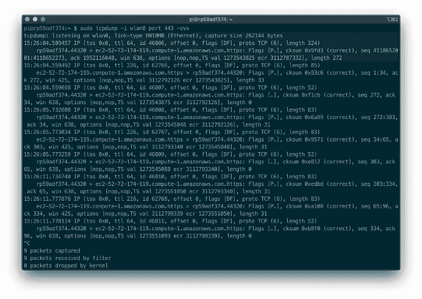

为了确认这些消息是从 AWS 上的物联网网关接收的，我们可以使用 AWS 物联网核心测试功能并订阅`lora-iot-demo`主题。我们应该会看到大约每隔 5 秒钟就有消息从物联网网关流入。

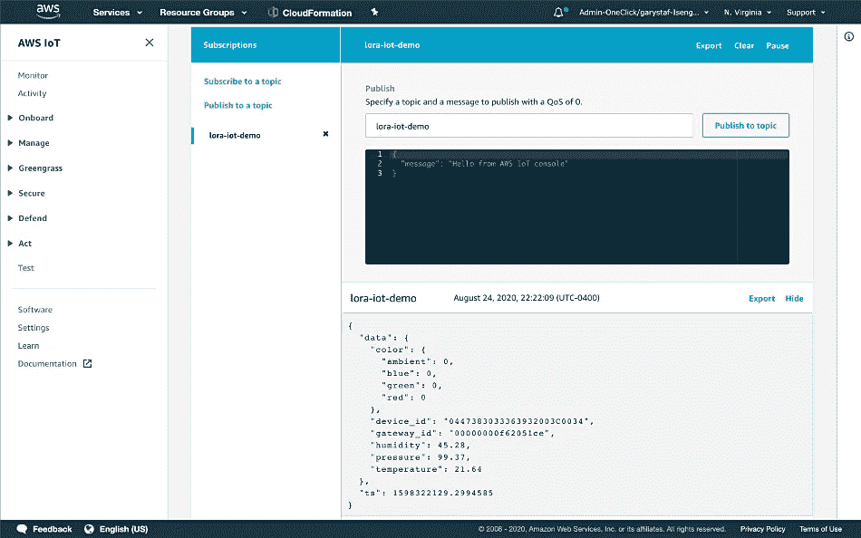

传入 MQTT 消息的 JSON 有效负载结构将类似于下面的示例。`device_id`是使用 LoRaWAN 传输消息的物联网设备的唯一 id。`gateway_id`是使用 LoRaWAN 接收消息并将其发送给 AWS 的物联网网关的唯一 id。单个物联网网关通常会管理来自多个物联网设备的消息，每个设备都有一个唯一的 id。

前面描述的 AWS IoT 规则使用的 SQL 查询在将嵌套的 JSON 有效负载结构传递到 AWS IoT 分析通道之前，会对其进行转换和展平，如下所示。

我们可以使用`ts`和`msg_received`数据字段来衡量物联网数据的近实时性。`ts`数据字段是物联网设备上出现传感器读数的日期和时间，而`msg_received`数据字段是 AWS 收到消息的日期和时间。这两个值之间的差值衡量了传感器读数传输到 AWS 物联网分析通道的接近实时程度。在下面的例子中，`ts`(2020–08–27t 11:45:31.986)和`msg_received`(2020–08–27t 11:45:32.074)之间的差值为 88 毫秒。

## 最终物联网数据消息结构

一旦消息有效负载通过 AWS 物联网分析管道并进入 AWS 物联网分析数据集中，其最终数据结构如下所示。请注意，设备的属性元数据已从 AWS IoT 核心设备注册表中添加。遗憾的是，元数据不是格式良好的 JSON，需要额外的转换才能使用。

GitHub 项目的 [sample_messages](https://github.com/garystafford/iot-aws-lora-demo/tree/master/sample_messages) 目录中包含一组示例消息。

# 结论

在本帖中，我们探讨了如何使用 LoRa 和 LoRaWAN 协议将环境传感器数据从物联网设备传输到物联网网关。鉴于其低能耗、长距离传输能力和完善的协议，LoRaWAN 是物联网设备的理想远程无线协议。然后，我们展示了如何使用 AWS 物联网设备 SDK、AWS 物联网核心和 AWS 物联网分析来近乎实时地安全收集、分析和可视化来自物联网设备的流消息。

*本博客代表我自己的观点，不代表我的雇主亚马逊网络服务公司的观点。*