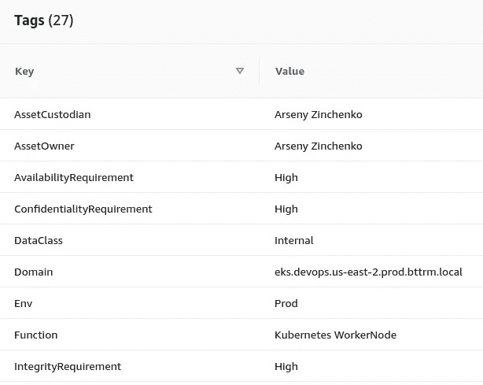
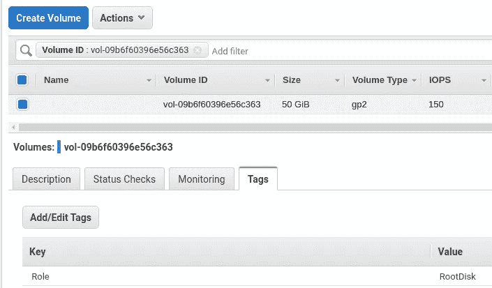
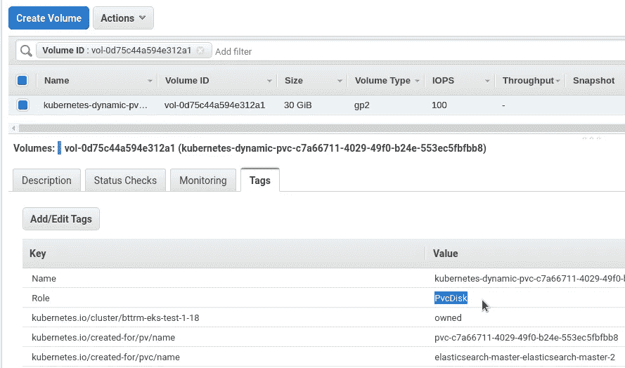
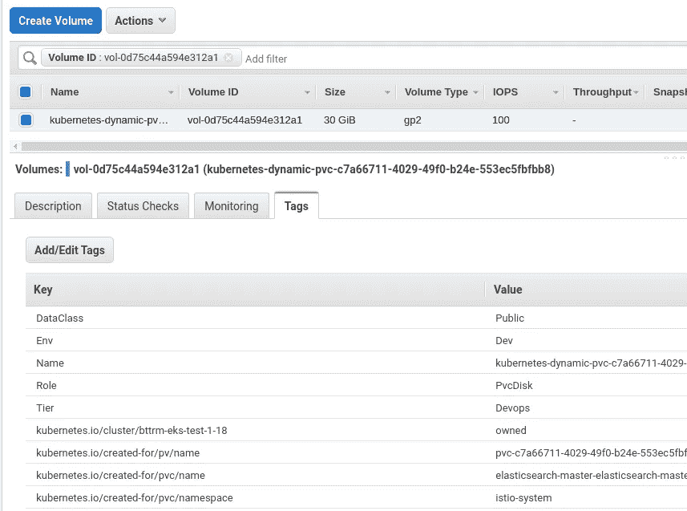

# AWS: Lambda —将 EC2 标签复制到它的 EBS，第 1 部分— Python 和 boto3

> 原文：<https://itnext.io/aws-lambda-copy-ec2-tags-to-its-ebs-part-1-python-and-boto3-73d7bf171aef?source=collection_archive---------4----------------------->


我们有一个 AWS 弹性 Kubernetes 服务集群，它有一些 WorkerNode 组，这些组是通过使用`eksctl`作为 AWS 自动伸缩组创建的，请参见 [AWS 弹性 Kubernetes 服务:集群创建自动化，第 2 部分–ansi ble，eksctl](/aws-lambda-copy-ec2-tags-to-its-ebs-part-2-create-a-lambda-function-7edf7945ab84?source=friends_link&sk=0831333cb4f6b3301c5945bb6ac3cdb5) 了解更多详细信息。

`eksctl`的 WorkerNode 组配置保留了一组标记，我们的团队使用这些标记来查看 AWS 清单:

```
---
apiVersion: eksctl.io/v1alpha5
kind: ClusterConfig

metadata:
  name: "{{ eks_cluster_name }}"
  region: "{{ region }}"
  version: "{{ k8s_version }}"

nodeGroups:

### Common ###

  - name: "{{ k8s_common_nodegroup_name }}-{{ item }}-v2021-09"
    instanceType: "{{ k8s_common_nodegroup_instance_type }}"
    privateNetworking: true
    labels:
      role: common-workers
    ...
    tags:
      Tier: "Devops"
      Domain: "eks.devops.{{ region }}.{{ env | lower }}.bttrm.local"
      ServiceType: "EC2"
      Env: {{ env }}
      Function: "Kubernetes WorkerNode"
      NetworkType: "Private"
      DataClass: "Public"
      AssetOwner: "{{ asset_owner }}"
      AssetCustodian: "{{ asset_custodian }}"
      OperatingSystem: "Amazon Linux"
      JiraTicket: "{{ jira_ticket }}"
      ConfidentialityRequirement: "Med"
      IntegrityRequirement: "Med"
      AvailabilityRequirement: "Med"
...
```

这些标签应用于自动缩放组:



然后应用于从该自动缩放组创建的 EC2 实例。

这里的问题是，这些标签没有被复制到附加到这个 EC2 的弹性块存储设备。

此外，除了 Kubernetes WorkerNodes 之外，在我们的 AWS 帐户中，我们有公共 EC2 实例，其中一些实例只能有一个根设备，而其他实例可以有一些额外的磁盘来备份数据。

此外，我们不仅需要从它的 EC2 中复制标签，而且我还想添加一个专用标签，描述磁盘的功能— *根卷*、*数据卷* или *Kubernetes PVC 卷*。

我们如何做到这一点？嗯，就像 AWS 控制台没有覆盖的 AWS 中的几乎任何东西一样，通过使用 AWS Lambda 服务:让我们创建一个函数，它将在新 EC2 启动时被触发，并将此 EC2 的标记复制到所有 EBS 卷，连接到此实例。

那么，在这个 AWS Lambda 函数的逻辑中，我们需要输出什么:

1.  创建新的 EC2 时—触发 Lambda 函数
2.  该函数将获取 EC2 ID，并将找到所有相关的 EBS 卷
3.  会将 AWS 标签从该 EC2 复制到其所有 EBS
4.  将添加一个名为*角色*的新标签:
5.  如果 EBS 是从 Kubernetes PVC 创建的，并且安装到 EC2，从 Kubernetes WorkerNode AWS 自动缩放组启动，那么我们将设置标签`Role: "PvcVolume"`
6.  如果 EBS 是在通用 EC2 创建期间创建的，那么将检查其挂载点，并决定使用哪个值— `Role: "RootVolume"`或`Role: "DataVolume"`

我们走吧。

# **内容**

*   [Python 脚本:复制 AWS 标签](https://rtfm.co.ua/en/aws-lambda-copy-ec2-tags-to-its-ebs-part-1-python-and-boto3/#Python_script_copy_AWS_Tags)
*   [boto3:获取 EC2 实例及其 EBS 卷的列表](https://rtfm.co.ua/en/aws-lambda-copy-ec2-tags-to-its-ebs-part-1-python-and-boto3/#boto3_getting_a_list_of_EC2_instances_and_their_EBS_volumes)
*   [boto3:向 EBS 添加 AWS 标签](https://rtfm.co.ua/en/aws-lambda-copy-ec2-tags-to-its-ebs-part-1-python-and-boto3/#boto3_adding_AWS_Tags_to_an_EBS)
*   [boto3:将 AWS 标签从 EC2 复制到其 EBS](https://rtfm.co.ua/en/aws-lambda-copy-ec2-tags-to-its-ebs-part-1-python-and-boto3/#boto3_copy_AWS_Tags_from_an_EC2_to_its_EBS)

# Python 脚本:复制 AWS 标签

首先，让我们写一个 Pythion 脚本，测试它，然后在这篇文章的第二部分进入 AWS Lambda。

当我们适应一个 Lambda 函数时，我们将对它进行快速更新，使它可以使用一个专用的 EC2 ID。

## `boto3`:获取 EC2 实例及其 EBS 卷的列表

第一件事是在 AWS 帐户中进行身份验证，获得特定区域中的所有 EC2 实例，然后获得附加到每个 EC2 的 EBS 卷的列表。

然后，有了这些信息，我们可以玩他们的标签。

剧本:

```
#!/usr/bin/env python

import os   
import boto3

ec2 = boto3.resource('ec2',
        region_name=os.getenv("AWS_DEFAULT_REGION"),
        aws_access_key_id=os.getenv("AWS_ACCESS_KEY_ID"),
        aws_secret_access_key=os.getenv("AWS_SECRET_ACCESS_KEY")
    )

def lambda_handler(event, context):

    base = ec2.instances.all()

    for instance in base:

        print("\n[DEBUG] EC2\n\t\tID: " + str(instance))
        print("\tEBS")

        for vol in instance.volumes.all():

            vol_id = str(vol)
            print("\t\tID: " + vol_id)

if __name__ == "__main__":
    lambda_handler(0, 0)
```

这里，在`ec2`变量中，我们创建了一个类型为 *ec2* 的`[boto3.resource](https://boto3.amazonaws.com/v1/documentation/api/latest/guide/resources.html)`对象，并将通过使用`$AWS_ACCESS_KEY_ID`和`$AWS_SECRET_ACCESS_KEY`变量在 AWS 帐户中进行身份验证。稍后，在我们的 Lambda 中，身份验证和授权将由 IAWS IAM 角色完成。

在脚本的最后，我们调用了`lambda_handler()`函数，如果脚本是作为专用程序执行的，参见 [Python:什么是 if __name__ == "__main__ "?](https://rtfm.co.ua/en/python-what-is-the-if-__name__-__main__/)了解详情。

在`lambda_handler()`中，我们调用`[ec2.instances.all()](https://boto3.amazonaws.com/v1/documentation/api/latest/reference/services/ec2.html#EC2.ServiceResource.instances)`方法来获取一个区域中的所有实例，然后在`for`循环中，通过调用`[instance.volumes.all()](https://boto3.amazonaws.com/v1/documentation/api/latest/reference/services/ec2.html#EC2.Instance.volumes)`来获取每个 EC2 的 EBS 卷列表。

现在，`lambda_handler()`的参数作为“ *0，0* ”传递，稍后，在 Lambda 中，我们将把`event`和`context`对象。

设置 AWS 验证变量:

```
$ export AWS_ACCESS_KEY_ID=AKI***D4Q
$ export AWS_SECRET_ACCESS_KEY=QUC***BTI
$ export AWS_DEFAULT_REGION=eu-west-3
```

运行脚本:

```
$ ./ec2_tags.py
[DEBUG] EC2
ID: ec2.Instance(id=’i-0df2fe9ec4b5e1855')
EBS
ID: ec2.Volume(id=’vol-0d11fd27f3702a0fc’)
[DEBUG] EC2
ID: ec2.Instance(id=’i-023529a843d02f680')
EBS
ID: ec2.Volume(id=’vol-0f3548ae321cd040c’)
[DEBUG] EC2
ID: ec2.Instance(id=’i-02ab1438a79a3e475')
EBS
ID: ec2.Volume(id=’vol-09b6f60396e56c363')
ID: ec2.Volume(id=’vol-0d75c44a594e312a1')
…
```

很好，起作用了！我们得到了 *eu-west-3* AWS 区域中的所有ес2，并为每个 EC2 附上了一个 EBS 列表。

下一步是什么？下一步是确定一个卷是如何装入 EC2 的，知道了它的装入点，我们就能够知道这个磁盘是根卷还是其他数据卷。

这可以通过获取为`Device`键保存一个值的`[attachments()](https://boto3.amazonaws.com/v1/documentation/api/latest/reference/services/ec2.html#EC2.Volume.attachments)`属性来实现。

在脚本中设置一个名为`device_id`的新变量:

```
...
        for vol in instance.volumes.all():

            vol_id = str(vol)
            device_id = "ec2.vol.Device('" + str(vol.attachments[0]['Device']) + "')"

            print("\t\tID:  " + vol_id + "\n\t\tDev: " + device_id + "\n")
...
```

再次运行脚本:

```
$ ./ec2_tags.py
[DEBUG] EC2
ID: ec2.Instance(id=’i-0df2fe9ec4b5e1855')
EBS
ID: ec2.Volume(id=’vol-0d11fd27f3702a0fc’)
Dev: ec2.vol.Device(‘/dev/xvda’)
[DEBUG] EC2
ID: ec2.Instance(id=’i-023529a843d02f680')
EBS
ID: ec2.Volume(id=’vol-0f3548ae321cd040c’)
Dev: ec2.vol.Device(‘/dev/xvda’)
[DEBUG] EC2
ID: ec2.Instance(id=’i-02ab1438a79a3e475')
EBS
ID: ec2.Volume(id=’vol-09b6f60396e56c363')
Dev: ec2.vol.Device(‘/dev/xvda’)
ID: ec2.Volume(id=’vol-0d75c44a594e312a1')
Dev: ec2.vol.Device(‘/dev/xvdbm’)
…
```

这里我们有一个 ID 为 *i-02ab1438a79a3e475* 的ес2，该 EC2 安装了两个 EBS 卷，即 *vol-09b6f60396e56c363* 作为`/dev/xvda`，以及 *vol-0d75c44a594e312a1* 作为`/dev/xvdbm`。

`/dev/xvda`显然是根卷，还有`/dev/xvdbm` -一些附加数据。

## `boto3`:向 EBS 添加 AWS 标签

现在，让我们创建一个`Role`标记，它将保留以下值中的一个:

1.  如果 EBS 有一个带`kubernetes.io/created-for/pvc/name`键的标签，那么将设置`Role: "PvcVolume"`
2.  如果不是 PVC 卷，那么需要检查它的挂载点，如果`device` == " */dev/xvda* ，那么设置`Role: "RootVolume"`
3.  最后，如果`device`变量有任何其他值，那么就用`Role: "DataDisk"`标记 EBS

为此，让我们添加另一个用于设置标签的函数，以及另一个名为`is_pvc()`的小函数，它将检查 EBS 是否有`kubernetes.io/created-for/pvc/name`标签:

```
...
def is_pvc(vol):

    try:
        for tag in vol.tags:
            if tag['Key'] == 'kubernetes.io/created-for/pvc/name':
                return True
                break
    except TypeError:
            return False

def set_role_tag(vol):

    device = vol.attachments[0]['Device']
    tags_list = []
    values = {}

    if is_pvc(vol):
        values['Key'] = "Role"
        values['Value'] = "PvcDisk"
        tags_list.append(values)
    elif device == "/dev/xvda":
        values['Key'] = "Role"
        values['Value'] = "RootDisk"
        tags_list.append(values)
    else:
        values['Key'] = "Role"
        values['Value'] = "DataDisk"
        tags_list.append(values)

    return tags_list
...
```

这里，在`set_role_tag()`函数中，我们首先将`vol`的值作为参数传递给`is_pvc()`函数，该函数检查*‘kubernetes . io/created-for/PVC/name’*键的标签。这里的`try/except`是用来知道一个 EBS 到底有没有标签。

如果找到了*' kubernetes . io/created-for/PVC/name '*标签，那么`is_pvc()`将返回`True`，如果没有找到，那么`False`。

然后，在`if/elif/else`条件中，我们检查 EBS 是否是 PVC 卷，如果是，那么它将被标记为`Role: "PvcVolume"`，如果不是，将检查它的挂载点，如果它被挂载为" */dev/xvda* ，那么设置`Role: "RootVolume"`，如果是，将使用`Role: "DataDisk".`

添加对`lambda_handler()`的`set_role_tag()`调用，作为`vol.create_tags()`函数的参数:

```
...
def lambda_handler(event, context):

    base = ec2.instances.all()

    for instance in base:

        print("\n[DEBUG] EC2\n\t\tID:  " + str(instance))
        print("\tEBS")

        for vol in instance.volumes.all():

            vol_id = str(vol)
            device_id = "ec2.vol.Device('" + str(vol.attachments[0]['Device']) + "')"
            print("\t\tID:  " + vol_id + "\n\t\tDev: " + device_id)

            role_tag = vol.create_tags(Tags=set_role_tag(vol))
            print("\t\tTags set:\n\t\t\t" + str(role_tag))
...
```

再次运行脚本:

```
$ ./ec2_tags.py
[DEBUG] EC2
ID: ec2.Instance(id=’i-0df2fe9ec4b5e1855')
EBS
ID: ec2.Volume(id=’vol-0d11fd27f3702a0fc’)
Dev: ec2.vol.Device(‘/dev/xvda’)
Tags set:
[ec2.Tag(resource_id=’vol-0d11fd27f3702a0fc’, key=’Role’, value=’RootDisk’)]
…
[DEBUG] EC2
ID: ec2.Instance(id=’i-02ab1438a79a3e475')
EBS
ID: ec2.Volume(id=’vol-09b6f60396e56c363')
Dev: ec2.vol.Device(‘/dev/xvda’)
Tags set:
[ec2.Tag(resource_id=’vol-09b6f60396e56c363', key=’Role’, value=’RootDisk’)]
ID: ec2.Volume(id=’vol-0d75c44a594e312a1')
Dev: ec2.vol.Device(‘/dev/xvdbm’)
Tags set:
[ec2.Tag(resource_id=’vol-0d75c44a594e312a1', key=’Role’, value=’PvcDisk’)]
```

让我们检查一下 *i-02ab1438a79a3e47* EC2 实例的容量。

其根卷 *vol-09b6f60396e56c363* :



以及一款 Kubernetes PVC—*vol-0 d75 c 44 a 594 e 312 a 1*:



很好，我们已经添加了`Role`标签创建，现在需要添加将 AWS 标签从 EC2 复制到 EBS 的功能。

## `boto3`:将 AWS 标签从 EC2 复制到其 EBS

标签副本也可以移动到一个专用的函数中，让我们把它命名为`copy_ec2_tags()`，它将接受一个参数，在这里我们将传递一个 EC2 ID:

```
...
def copy_ec2_tags(instance):

    tags_list = []
    values = {} 

    for instance_tag in instance.tags:

        if instance_tag['Key'] == 'Env':
            tags_list.append(instance_tag)
        elif instance_tag['Key'] == 'Tier':
            tags_list.append(instance_tag)
        elif instance_tag['Key'] == 'DataClass':
            tags_list.append(instance_tag)

    return tags_list
...
```

在函数中，在一个循环中，我们检查实例的所有标签，如果将找到在我们的函数中指定的三个标签中的任何一个，它们将被追加到列表`tags_list[]`，该列表稍后将被传递到`vol.create_tags()`。

在`lambda_handler()`中增加`copy_ec2_tags()`执行:

```
...
def lambda_handler(event, context):

    base = ec2.instances.all()

    for instance in base:

        print("\n[DEBUG] EC2\n\t\tID:  " + str(instance))
        print("\tEBS")

        for vol in instance.volumes.all():

            vol_id = str(vol)
            device_id = "ec2.vol.Device('" + str(vol.attachments[0]['Device']) + "')"
            print("\t\tID:  " + vol_id + "\n\t\tDev: " + device_id)

            role_tag = vol.create_tags(Tags=set_role_tag(vol))
            ec2_tags = vol.create_tags(Tags=copy_ec2_tags(instance))
            print("\t\tTags set:\n\t\t\t" + str(role_tag) + "\n\t\t\t" + str(ec2_tags))
...
```

运行:

```
$ ./ec2_tags.py
[DEBUG] EC2
ID: ec2.Instance(id=’i-0df2fe9ec4b5e1855')
EBS
ID: ec2.Volume(id=’vol-0d11fd27f3702a0fc’)
Dev: ec2.vol.Device(‘/dev/xvda’)
Tags set:
[ec2.Tag(resource_id=’vol-0d11fd27f3702a0fc’, key=’Role’, value=’RootDisk’)]
[ec2.Tag(resource_id=’vol-0d11fd27f3702a0fc’, key=’DataClass’, value=’Public’), ec2.Tag(resource_id=’vol-0d11fd27f3702a0fc’, key=’Env’, value=’Dev’), ec2.Tag(resource_id=’vol-0d11fd27f3702a0fc’, key=’Tier’, value=’Devops’)]
…
[DEBUG] EC2
ID: ec2.Instance(id=’i-02ab1438a79a3e475')
EBS
ID: ec2.Volume(id=’vol-09b6f60396e56c363')
Dev: ec2.vol.Device(‘/dev/xvda’)
Tags set:
[ec2.Tag(resource_id=’vol-09b6f60396e56c363', key=’Role’, value=’RootDisk’)]
[ec2.Tag(resource_id=’vol-09b6f60396e56c363', key=’Env’, value=’Dev’), ec2.Tag(resource_id=’vol-09b6f60396e56c363', key=’DataClass’, value=’Public’), ec2.Tag(resource_id=’vol-09b6f60396e56c363', key=’Tier’, value=’Devops’)]
ID: ec2.Volume(id=’vol-0d75c44a594e312a1')
Dev: ec2.vol.Device(‘/dev/xvdbm’)
Tags set:
[ec2.Tag(resource_id=’vol-0d75c44a594e312a1', key=’Role’, value=’PvcDisk’)]
[ec2.Tag(resource_id=’vol-0d75c44a594e312a1', key=’Env’, value=’Dev’), ec2.Tag(resource_id=’vol-0d75c44a594e312a1', key=’DataClass’, value=’Public’), ec2.Tag(resource_id=’vol-0d75c44a594e312a1', key=’Tier’, value=’Devops’)]
```

…

并检查:



整个脚本现在看起来如下所示:

```
#!/usr/bin/env python

import os
import boto3

ec2 = boto3.resource('ec2',
        region_name=os.getenv("AWS_DEFAULT_REGION"),
        aws_access_key_id=os.getenv("AWS_ACCESS_KEY_ID"),
        aws_secret_access_key=os.getenv("AWS_SECRET_ACCESS_KEY")
    )

def lambda_handler(event, context):

    base = ec2.instances.all()

    for instance in base:

        print("[DEBUG] EC2\n\t\tID:  " + str(instance))
        print("\tEBS")

        for vol in instance.volumes.all():

            vol_id = str(vol)
            device_id = "ec2.vol.Device('" + str(vol.attachments[0]['Device']) + "')"
            print("\t\tID:  " + vol_id + "\n\t\tDev: " + device_id)

            role_tag = vol.create_tags(Tags=set_role_tag(vol))
            ec2_tags = vol.create_tags(Tags=copy_ec2_tags(instance))
            print("\t\tTags set:\n\t\t\t" + str(role_tag) + "\n\t\t\t" + str(ec2_tags) + "\n")

def is_pvc(vol): 

    try:
        for tag in vol.tags:
            if tag['Key'] == 'kubernetes.io/created-for/pvc/name':
                return True
                break
    except TypeError:
            return False

def set_role_tag(vol):

    device = vol.attachments[0]['Device']
    tags_list = []
    values = {}

    if is_pvc(vol):
        values['Key'] = "Role"
        values['Value'] = "PvcDisk"
        tags_list.append(values)
    elif device == "/dev/xvda":
        values['Key'] = "Role"
        values['Value'] = "RootDisk"
        tags_list.append(values)
    else:   
        values['Key'] = "Role"
        values['Value'] = "DataDisk"
        tags_list.append(values)

    return tags_list

def copy_ec2_tags(instance):

    tags_list = []
    values = {} 

    for instance_tag in instance.tags:

        if instance_tag['Key'] == 'Env':
            tags_list.append(instance_tag)
        elif instance_tag['Key'] == 'Tier':
            tags_list.append(instance_tag)
        elif instance_tag['Key'] == 'DataClass':
            tags_list.append(instance_tag)
        elif instance_tag['Key'] == 'JiraTicket':
            tags_list.append(instance_tag)

    return tags_list

if __name__ == "__main__":
    lambda_handler(0, 0)
```

这里我们已经完成了，现在可以继续使用 AWS Lambda 函数。参见 [AWS 中的下一部分:Lambda —将 EC2 标签复制到其 EBS，第 2 部分—创建 Lambda 函数](https://rtfm.co.ua/en/?p=27163)帖子。

*最初发布于* [*RTFM: Linux、DevOps、系统管理*](https://rtfm.co.ua/en/aws-lambda-copy-ec2-tags-to-its-ebs-part-1-python-and-boto3/) *。*