# AWS: Lambda —将 EC2 标记复制到它的 EBS，第 2 部分—创建 Lambda 函数

> 原文：<https://itnext.io/aws-lambda-copy-ec2-tags-to-its-ebs-part-2-create-a-lambda-function-7edf7945ab84?source=collection_archive---------3----------------------->


让我们继续我们的 AWS Lambda 函数之旅，它将把 EC2 的 AWS 标记复制到所有 EBS 卷，并附加到它上面。

在第一部分中， [AWS: Lambda —将 EC2 标记复制到其 EBS，第一部分— Python 和 boto3](/aws-lambda-copy-ec2-tags-to-its-ebs-part-1-python-and-boto3-73d7bf171aef?source=friends_link&sk=eef97d0c9832a983409359e4ca4b1b8c) ，我们编写了一个 Python 脚本，它可以获取 AWS 区域中的所有 EC2 实例，然后对于每个 EC2，它获取其 EBS 卷，然后将所有 AWS 标记从 EC2 复制到其所有 EBS，此外还会添加一个。

在这一部分中，我们将创建一个由 AWS CloudWatch 事件触发的 [AWS Lambda](https://rtfm.co.ua/en/aws-lambda-functions-and-overview-and-integration-with-aws-api-gateway/) 函数。

# 内容

*   [创建 AWS Lambda 函数](https://rtfm.co.ua/en/aws-lambda-copy-ec2-tags-to-its-ebs-part-2-create-a-lambda-function/#Creating_an_AWS_Lambda_function)
*   [添加一个 Amazon EventBridge (CloudWatch 事件)触发器](https://rtfm.co.ua/en/aws-lambda-copy-ec2-tags-to-its-ebs-part-2-create-a-lambda-function/#Adding_an_Amazon_EventBridge_CloudWatch_Events_trigger)
*   [AWS Lambda:未授权操作](https://rtfm.co.ua/en/aws-lambda-copy-ec2-tags-to-its-ebs-part-2-create-a-lambda-function/#AWS_Lambda_UnauthorizedOperation)
*   [解析 Lambda 事件](https://rtfm.co.ua/en/aws-lambda-copy-ec2-tags-to-its-ebs-part-2-create-a-lambda-function/#Parsing_a_Lambda_event)

# 创建 AWS Lambda 函数

转到 AWS Lambda，从头开始从"*作者*创建一个新函数，运行时设置为 Python 3.8:

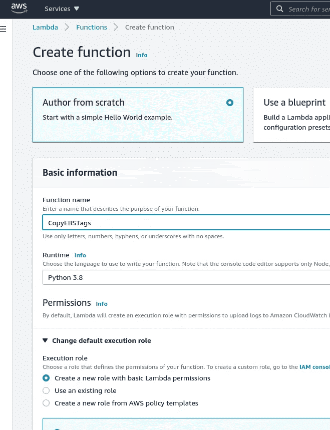

在*执行角色*中，保留“*创建新角色*”—稍后，我们将使用 IAM 策略为其添加额外的权限。

将脚本的代码粘贴到函数中，在代码结束时更新执行的`lambda_hanlder()`，并在它的参数中设置`event, context`而不是前面 post 中的 *0，0】*:

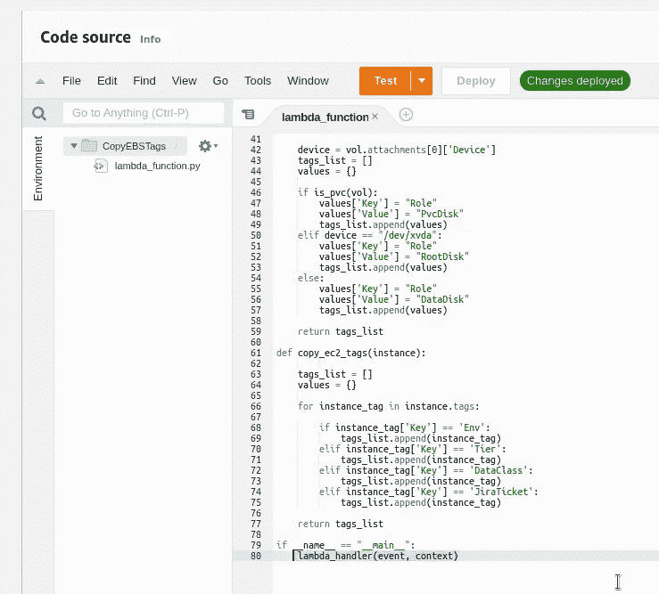

为了检查`event`对象的内容，我们稍后将使用它来获取 EC2 ID，将其输出添加到函数的日志中。

添加`import json`和`print("CONTEXT: " + json.dumps(event))`:

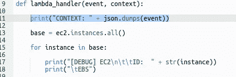

同样，对于`ec2 = boto3.resource()`调用，删除 AWS 键，并留下唯一的资源类型——“*ec2*”:

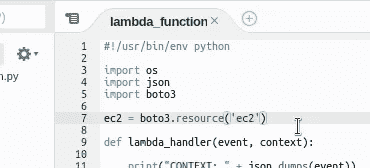

不要忘记按下*部署*按钮，将您的更改应用到 AWS Lambda。

## 添加 Amazon EventBridge (CloudWatch 事件)触发器

接下来，每次在一个地区推出新的 EC2 时，我们都需要运行这个函数。

在这里，我们可以使用 Amazon EventBridge(以前的 CloudWatch 事件)。转到 *CloudWatch 事件>规则*，点击*创建规则*:

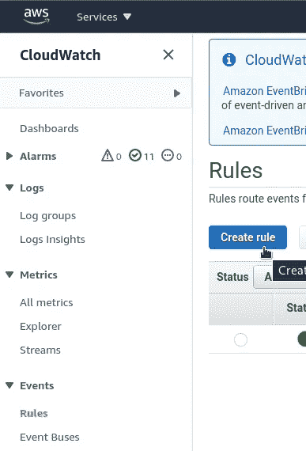

在*事件模式*中选择*服务名== EC2，在*事件类型*中选择 *EC2 实例状态变更通知*，在*特定状态*中选择*运行*:*

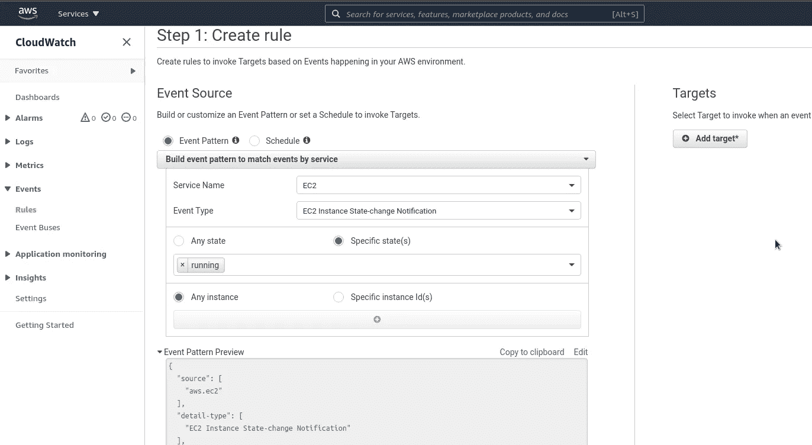

在*添加目标*的右侧，选择我们在上面创建的 AWS Lambda 函数:

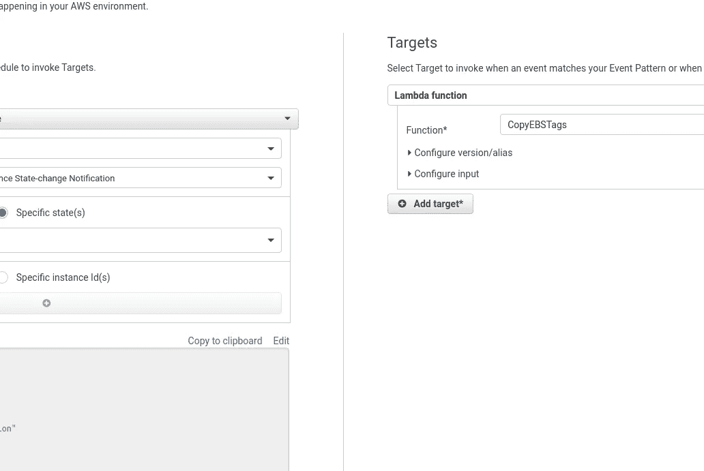

在页面的最后，在*显示示例事件中，*我们可以看到一个`event`对象的示例，它将被传递给函数以获取 EC2 ID:

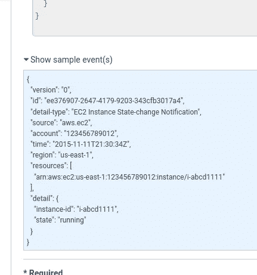

保存新规则:

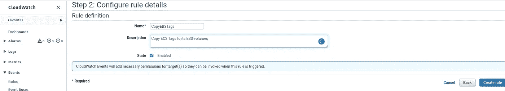

检查它是否作为触发器添加到 Lambda 函数中:

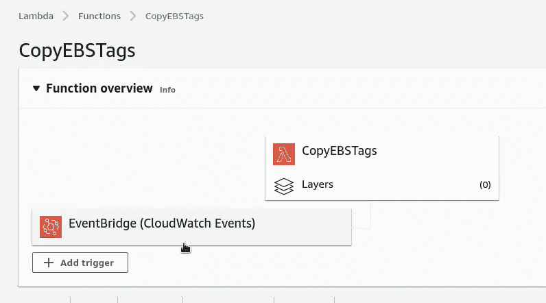

让我们看看这是如何工作的。

在 CloudWatch 规则中打开规则的监控:

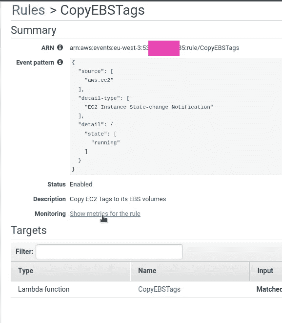

旋转新的 EC2，例如通过触发自动缩放组:

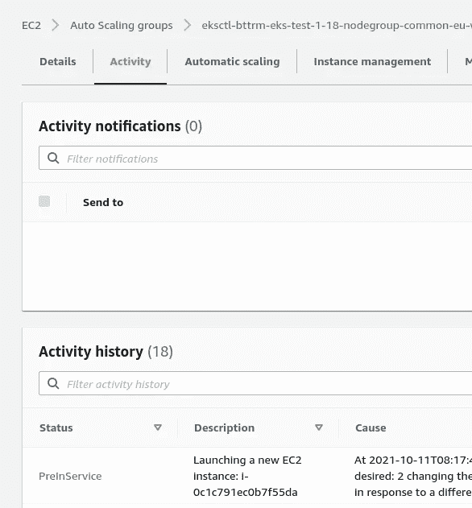

在 CloudWatch 图中，我们可以看到规则被触发:

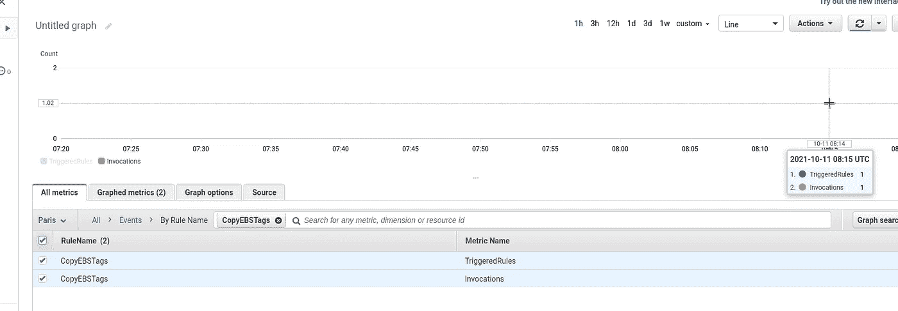

检查 Lambda 函数的日志:

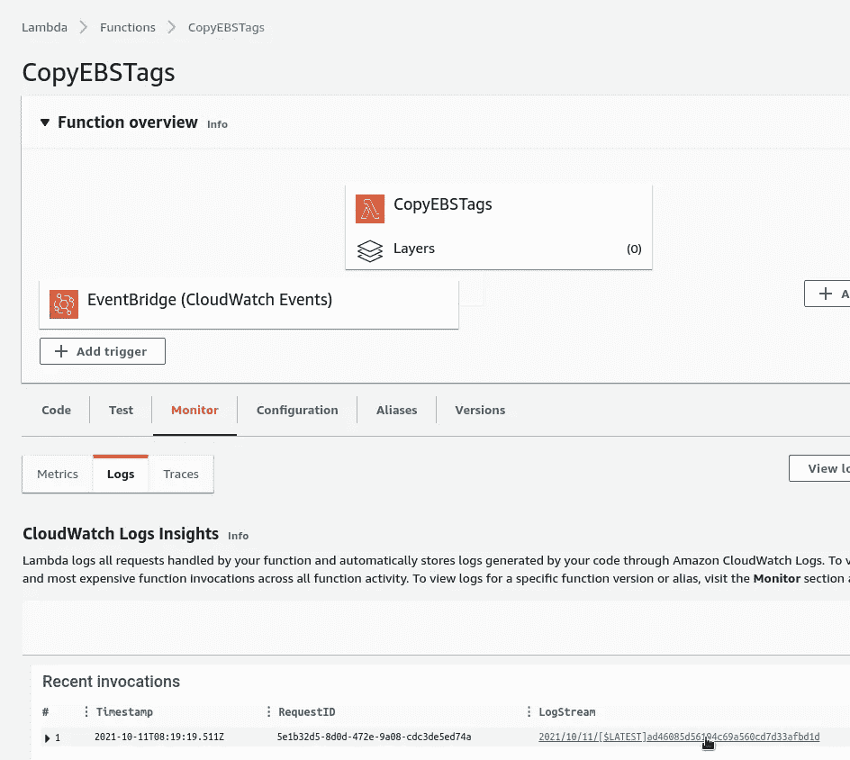

## AWS Lambda:未授权操作

在日志中，我们对两条记录感兴趣。

第一个是从`print("CONTEXT: " + json.dumps(event))`保存到日志中的`event`内容:

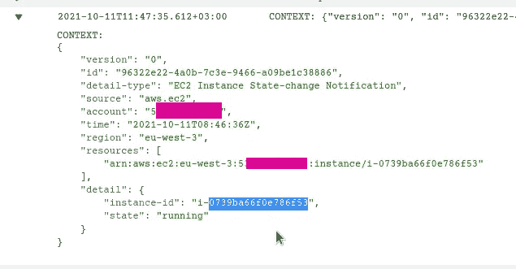

第二个是***“client error:调用 DescribeInstances 操作时出错(UnauthorizedOperation):您无权执行此操作”*** 错误:


这里的问题很明显:我们的 Lambda 函数现在使用的是 IAM 角色，它是在函数创建过程中创建的，它没有对 EC2 操作的 API 调用的权限:

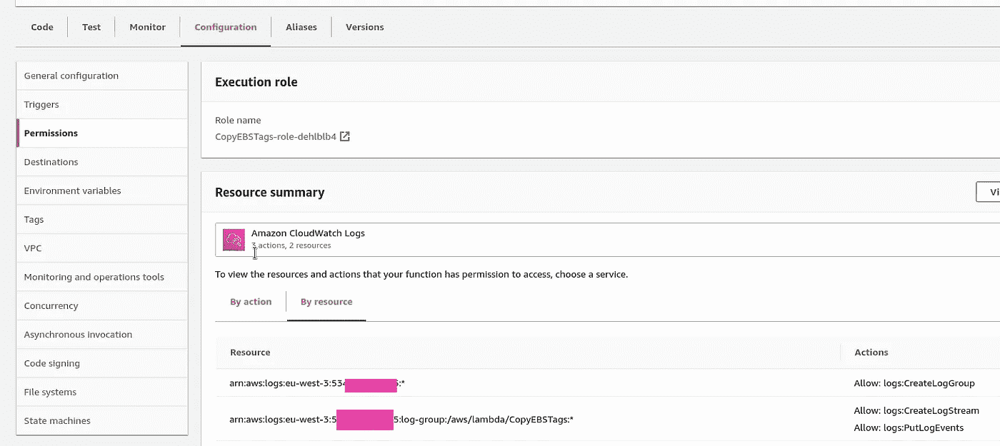

转到 AWS IAM，找到角色，点击*附加策略*:

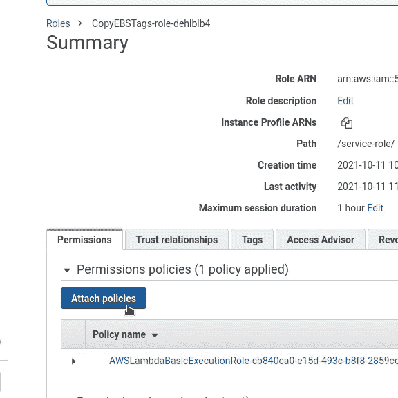

创建新策略:

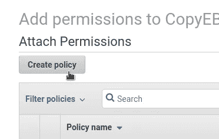

在此描述 EC2 权限:

```
{
    "Version": "2012-10-17",
    "Statement": [
        {
            "Sid": "VisualEditor0",
            "Effect": "Allow",
            "Action": [
                "ec2:DescribeInstances",
                "ec2:DeleteTags",
                "ec2:CreateTags",
                "ec2:DescribeVolumes"
            ],
            "Resource": "*"
        }
    ]
}
```

保存它:

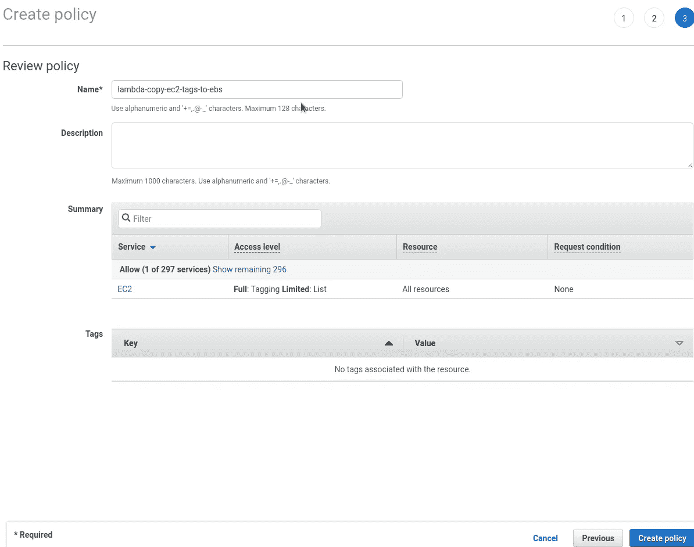

返回 Lambda 函数的 IAM 角色，并添加一个新策略:

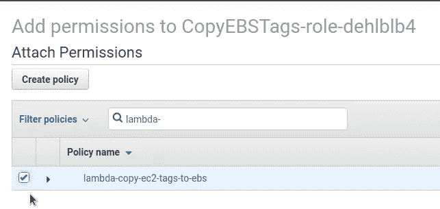

重复一次新的 EC2 启动，并再次检查函数日志:

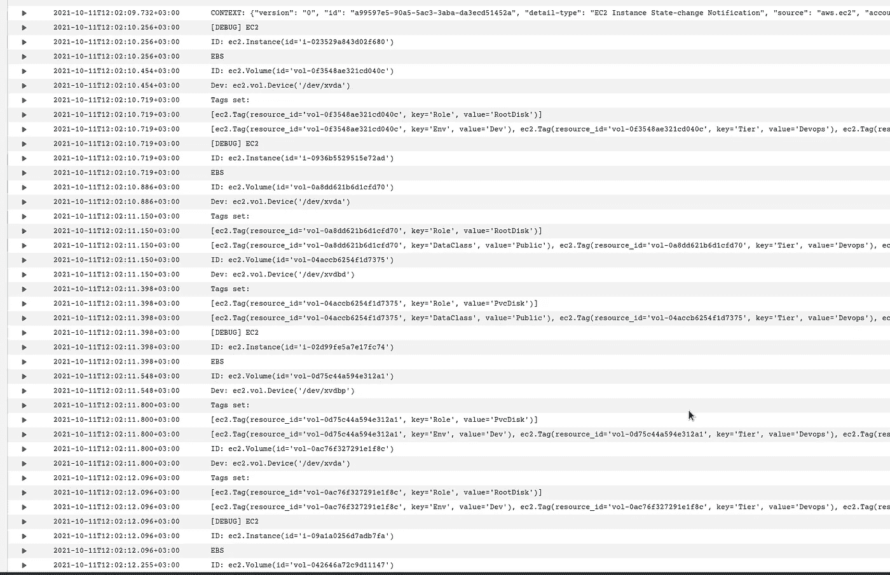

耶！ ***有用！*** ”

接下来，需要更新代码以从`event`对象中获取`instance-id`。

## 解析一个λ`event`

当我们创建 CloudWatch 规则时，我们已经看到了一个`event`的例子，我们知道它将作为一个带有一组键的 python 字典传递给`lambda_handler()`函数:

```
{
    "version": "0",
    "id": "a99597e5-90a5-5ac3-3aba-da3ecd51452a",
    "detail-type": "EC2 Instance State-change Notification",
    "source": "aws.ec2",
    "account": "534***385",
    "time": "2021-10-11T09:02:09Z",
    "region": "eu-west-3",
    "resources": [
        "arn:aws:ec2:eu-west-3:534***385:instance/i-0cc24729109ba61e5"
    ],
    "detail": {
        "instance-id": "i-0cc24729109ba61e5",
        "state": "running"
    }
}
```

从这里我们需要获取`detail.instance-id`元素的值。

向脚本中添加一个新变量，我们称之为`instance_id`，它将保存一个来自`event["detail"]["instance-id"]`的值，然后通过使用这个 ID，我们正在创建一个`ec2.Instance`类的新对象，即`ec2.Instance(instance_id)`:

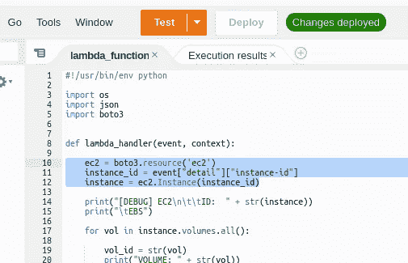

不用手动运行一个新的 EC2，我们可以通过传递一个`event`对象来对我们的 Lambda 使用*测试*。

创建新的测试事件:

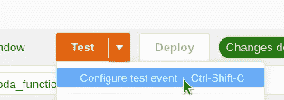

添加一个类似于我们将从 CloudWatch 获得的数据:

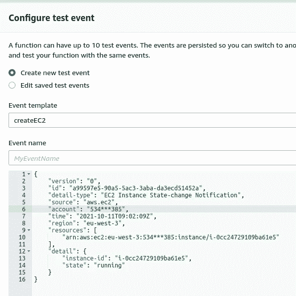

```
{
    "version": "0",
    "id": "a99597e5-90a5-5ac3-3aba-da3ecd51452a",
    "detail-type": "EC2 Instance State-change Notification",
    "source": "aws.ec2",
    "account": "534***385",
    "time": "2021-10-11T09:02:09Z",
    "region": "eu-west-3",
    "resources": [
        "arn:aws:ec2:eu-west-3:534***385:instance/i-0cc24729109ba61e5"
    ],
    "detail": {
        "instance-id": "i-0cc24729109ba61e5",
        "state": "running"
    }
}
```

运行测试:

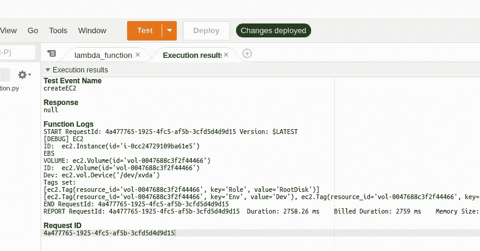

***“管用！”***

现在让我们构建一个通用的 EC2 来检查整个方案，包括 CloudWatch 事件、Lambda 的触发器及其执行结果。

触发自动缩放群组:

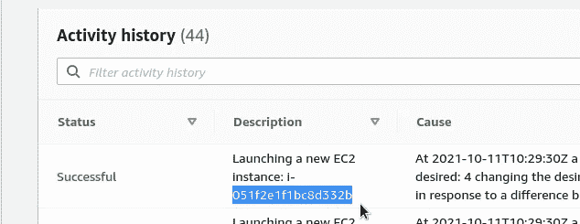

创建了一个新的 EC2*I-051 F2 E1 f1 BC 8d 332 b*，检查 Lambda 的日志:

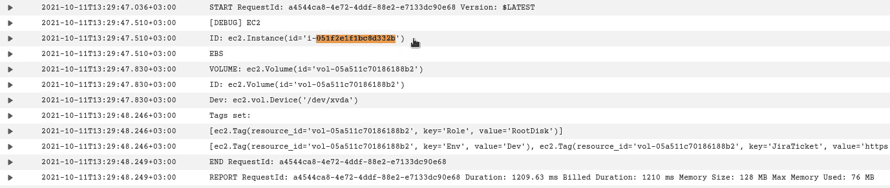

找到此 EC2 的 EBS:

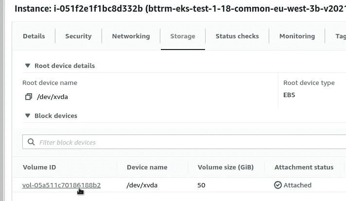

并检查它的标签:

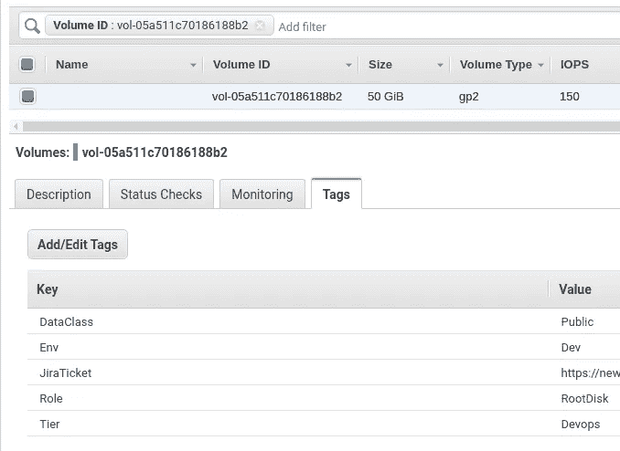

下面是这个函数的代码:

```
#!/usr/bin/env python

import os
import json
import boto3

def lambda_handler(event, context):

    ec2 = boto3.resource('ec2')
    instance_id = event["detail"]["instance-id"]
    instance = ec2.Instance(instance_id)

    print("[DEBUG] EC2\n\t\tID:  " + str(instance))
    print("\tEBS")

    for vol in instance.volumes.all():

        vol_id = str(vol)
        print("VOLUME: " + str(vol))

        device_id = "ec2.vol.Device('" + str(vol.attachments[0]['Device']) + "')"
        print("\t\tID:  " + vol_id + "\n\t\tDev: " + device_id)

        role_tag = vol.create_tags(Tags=set_role_tag(vol))
        ec2_tags = vol.create_tags(Tags=copy_ec2_tags(instance))
        print("\t\tTags set:\n\t\t\t" + str(role_tag) + "\n\t\t\t" + str(ec2_tags) + "\n")

def is_pvc(vol): 

    try:
        for tag in vol.tags:
            if tag['Key'] == 'kubernetes.io/created-for/pvc/name':
                return True
                break
    except TypeError:
            return False

def set_role_tag(vol):

    device = vol.attachments[0]['Device']
    tags_list = []
    values = {}

    if is_pvc(vol):
        values['Key'] = "Role"
        values['Value'] = "PvcDisk"
        tags_list.append(values)
    elif device == "/dev/xvda":
        values['Key'] = "Role"
        values['Value'] = "RootDisk"
        tags_list.append(values)
    else:   
        values['Key'] = "Role"
        values['Value'] = "DataDisk"
        tags_list.append(values)

    return tags_list

def copy_ec2_tags(instance):

    tags_list = []
    values = {} 

    for instance_tag in instance.tags:

        if instance_tag['Key'] == 'Env':
            tags_list.append(instance_tag)
        elif instance_tag['Key'] == 'Tier':
            tags_list.append(instance_tag)
        elif instance_tag['Key'] == 'DataClass':
            tags_list.append(instance_tag)
        elif instance_tag['Key'] == 'JiraTicket':
            tags_list.append(instance_tag)

    return tags_list

if __name__ == "__main__":
    lambda_handler(event, context)
```

完成了。

*最初发布于* [*RTFM: Linux，DevOps，和系统管理*](https://rtfm.co.ua/en/aws-lambda-copy-ec2-tags-to-its-ebs-part-2-create-a-lambda-function/) *。*