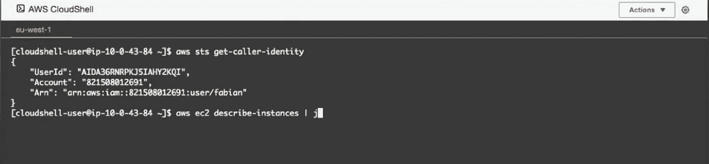

# AWS Re:Cap 2020 摘要—最新亚马逊网络服务功能

> 原文：<https://itnext.io/aws-re-cap-2020-summary-latest-amazon-web-services-features-290a9d5de718?source=collection_archive---------4----------------------->

## 最伟大的最新功能的总结

## 上周五，亚马逊举行了一场名为 **AWS Re:Cap** 的在线会议，总结了 2020 年底推出的所有亚马逊网络服务新功能。让我们来看看令人兴奋的新功能！

# EC2 计算机公告

## 新 EC2 P4d 实例

亚马逊从宣布**新 EC2 P4d 实例**开始，它可以在云上支持**高达 400Gbps 的网络速度**。这是第一次有如此快的网络速度！

但这还不是全部，亚马逊还宣布新的 P4d 实例具有高达 2.5 倍的**更好的**深度学习**性能**，这可能意味着**在使用这些快速而强大的实例时节省高达 60%的成本**。

对于 SAP 用例，亚马逊现在有一个更新的**最大的 24 TB** 高内存。

## 新 EC2 M5zn 实例

接着，**讨论了新的 EC2 M5zn 实例**，它们提供了**更高的处理能力**。这在**软件许可**的案例中尤其有趣。如果您只被允许在特定数量的服务器上运行该软件，这可以帮助您节省资金，因为您可以在每个 M5zn 服务上获得更多的处理能力。与之前的 EC2 M5 实例相比，这些实例提供了高达 45%的性价比。

## 新 EC2 R5b 实例

新的 EC2 R5B 实例提供了**增强的弹性块存储** —也称为 EBS — **性能**。在技术上，提供高达 7500 MB/S 的带宽和高达 260K IOPS 的 EBS 性能。据说这些实例的性价比比之前的 EC2 R5 实例高 3 倍。这些新实例非常适合大型数据库和分析工作负载。

## 新 EC2 G4d 实例

与以前的 G4dn 实例相比，新的 G4d 实例提供了高达 45%的性价比。这是目前 AWS 提供的云中图形工作负载的最佳性价比。

## 新 EC2 Mac1 实例

[micha Kubalczyk](https://unsplash.com/@rev3n?utm_source=medium&utm_medium=referral)在 [Unsplash](https://unsplash.com?utm_source=medium&utm_medium=referral) 上拍摄的照片

什么？**AWS 上的 Mac？**对，你没听错！AWS 现在有了 **EC2 Mac1** 实例。这有什么了不起的？不是每个开发者都有 Mac 机可用。当他们需要在 Mac 项目上工作一些时间时，这将使他们能够在云中的**专用 Mac** 上工作，而不必为此购买单独的硬件。

然而，这还不够完美。 **EC2 Mac1** 只能为**专用的** EC2 实例设置，这意味着价格也会更高。事实上，在欧盟-西方-1 爱尔兰地区的一个实例**每小时花费**大约 **1.2 美元(！)**。此外，亚马逊要求这些实例至少 24 小时使用，这意味着一天的费用略低于 30 美元。

> 请注意，按需 Mac1 专用主机的最低主机分配和计费持续时间为 24 小时。— [AWS](https://aws.amazon.com/ec2/dedicated-hosts/pricing/)

虽然高昂的成本有些令人失望，但这仍然是 Mac 进入 AWS 服务范围的一个非常好的介绍。我希望随着这些例子越来越受欢迎，价格会下降。

# 自动气象站列车

亚马逊宣布了一项名为 AWS Trainium 的新服务，被戏称为，第一个用于训练的机器学习芯片。云中最**划算**。

我不是机器学习专家，但总的来说，TFLOPS **计算能力将比云中的其他学习实例更高**。它将支持常见的机器学习框架，如 TensorFlow、MXNet 和 PyTorch。

AWS Trainium 将作为 EC2 实例提供，但也通过 SageMaker 提供。

> 非常适合图像识别、语音识别、自然语言处理、预测和欺诈检测。— AWS

# 新的 EBS GP3 卷

与以前的 GP2 卷相比，新的 GP3 卷现在每 GB 价格降低了 20%。此外，GP3 的**基线为 3000 IOPS** ，而 GP2 的突发模式只有 3000 IOPS。速度也快得多，**GP3 高达 1000 兆比特/秒**，而 GP2 高达 250 兆比特/秒。

# 集装箱:ECS/EKS 任何地方

亚马逊宣布 ECS/EKS 无处不在，这意味着你可以在本地运行 ECS/EKS 容器。Amazon 提供了容器编排，并减少了本地操作集群的工作量。这个计划在今年发布。

## 开源的 EKS 发行版

亚马逊正在努力使 EKS 发行版开源，为你提供一个维护良好的发行版。这个发行版将会有和常规 EKS 服务一样的**测试**和**安全** **补丁**周期，这使得它非常有吸引力。就许可而言，这将在 Apache 2.0 许可下提供。

## 用容器打包和部署 Lambdas

带容器的无服务器？是啊！代码和依赖项可以使用**容器映像**打包，现在还为**无服务器**应用程序提供所有**容器化优势**。这为无服务器应用带来了一致的工作方式。此外，lambdas 还可以部署在第三方基础映像之上。

# 无服务器应用程序和 Lambda

## 无服务器 1 毫秒计费粒度

这次更新更多的是在计费方面，AWS 现在允许无服务器应用程序按处理请求的每毫秒计费。这将给开发团队另一个动力和**理由来优化**他们的应用程序，使之**更快**，反过来也**降低成本**！这是 AWS 的一个非常好的举措。你最近检查过你的无服务器应用程序的处理时间了吗？

这一变化从 2020 年 12 月计费周期开始。

# 数据库

托比亚斯·菲舍尔在 [Unsplash](https://unsplash.com?utm_source=medium&utm_medium=referral) 上拍摄的照片

## Aurora 无服务器 v2 预览版

为应用程序更快地扩展和配置数据库。它是 Aurora 无服务器 v1 的改进版本。AWS 团队提到在峰值负载下**可节省高达 90%的成本**。

## 亚马逊 Aurora PostgreSQL 的 Babelfish

一个常见的问题是在 AWS 上运行 MS SQL 的高成本，这主要是由于微软的许可条款。亚马逊创造了一种叫做 Babelfish 的新服务来降低成本。Babelfish 是他们在 PostgreSQL 之上开发的**层**，可以**理解 T-SQL** 查询。****

这将使开发团队能够更快地完成**到 AWS 的迁移**,因为在 AWS 上托管 MS SQL 数据库将会有一个更经济、更可接受的选择。

## 所有的巴别鱼

亚马逊将在 2021 年开源 Babelfish。它将在 **Github** 上可用，并允许任何人运行和使用 PostgreSQL 数据库的 Babelfish T-SQL 转换层。它将在 Apache 2.0 许可下提供。

# 机器学习

照片由[阿曼达·达尔比约恩](https://unsplash.com/@amandadalbjorn?utm_source=medium&utm_medium=referral)在 [Unsplash](https://unsplash.com?utm_source=medium&utm_medium=referral) 拍摄

## 亚马逊寻找度量标准

Amazon Lookout 将使您能够**更快**检测指标中的异常**，以及找到潜在的根本原因。亚马逊正在通过机器学习他们 20 多年的经验来做到这一点。**

## 红移机器学习

Redshift 将使用户能够利用机器学习工作，而不需要学习新的技术或工具。

## 亚马逊海王星 ML

Neptune ML 是 Neptune 上的一项新功能，允许在完全管理的图形数据库上运行机器学习功能。

它可以与图形神经网络一起工作，后者在预测方面要精确得多。

# AWS CloudShell

最后但同样重要的是，亚马逊宣布了 AWS CloudShell，这是一个完整的 AWS CLI，可从浏览器中获得。CloudShell 会在 Shell 会话之间自动保存您的文件和设置。

# 结论

亚马逊发布了令人兴奋的改进和服务。Mac1 EC2 实例、普遍改进的性能、Babelfish、开源的 EKS 发行版、按毫秒计费的无服务器等等。

你最激动的是什么？2021 年你希望看到哪些更新？请在评论中告诉我们！

[订阅我的媒体](https://kevinvr.medium.com/membership)到**解锁** **所有** **文章**。通过使用我的链接订阅，你是支持我的工作，没有额外的费用。你会得到我永远的感激。