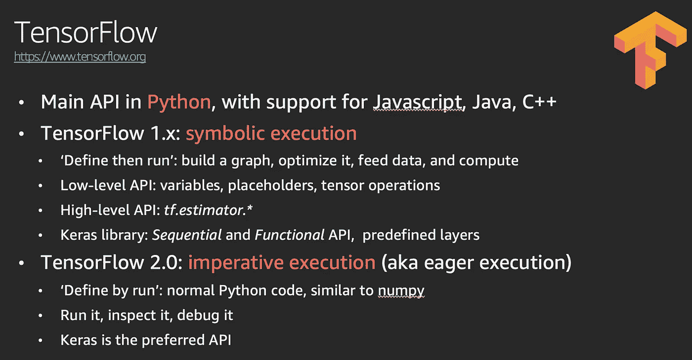
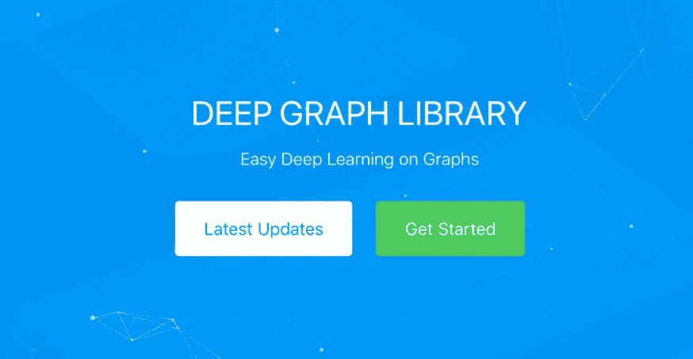
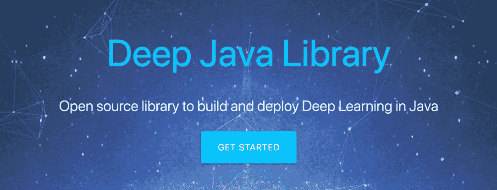

# AWS re:Invent 2019 — AI/ML 概述—第 3 部分:框架和基础设施

> 原文：<https://itnext.io/aws-re-invent-2019-ai-ml-recap-part-3-frameworks-infrastructure-6cbdd049a0a7?source=collection_archive---------2----------------------->

在前两篇帖子中，我向你介绍了我们新的[高级服务](https://medium.com/@julsimon/aws-re-invent-2019-ai-ml-recap-part-1-ai-services-9ca35bff2f07)，以及我们添加到[亚马逊 SageMaker](https://aws.amazon.com/sagemaker) 的新[功能](https://medium.com/@julsimon/aws-re-invent-2019-ai-ml-recap-part-2-amazon-sagemaker-fee83f05a1bc)。以为我完了，是吗？不，还有更多。总是有更多的。

在这最后一篇文章中，我们来谈谈框架和基础设施。

一如既往，乐意在这里或在 [Twitter](https://twitter.com/julsimon) 回答问题。

# 亚马逊 DeepComposer

不确定这个什么时候合适！ [AWS DeepComposer](https://aws.amazon.com/deepcomposer/) 是世界上第一个结合了生成式人工智能服务的音乐键盘。

博客:[https://AWS . Amazon . com/blogs/AWS/AWS-deep composer-compose-music-with-generative-machine-learning-models/](https://aws.amazon.com/blogs/aws/aws-deepcomposer-compose-music-with-generative-machine-learning-models/)

文档:[https://docs . AWS . Amazon . com/deep composer/latest/dev guide/what-it-is . html](https://docs.aws.amazon.com/deepcomposer/latest/devguide/what-it-is.html)

# 亚马逊 EC2 推理(Inf1)

Inf1 实例由 [AWS 推理芯片](https://aws.amazon.com/machine-learning/inferentia/)支持，旨在为您提供快速、低延迟的推理。

使用 [Neuron SDK](https://github.com/aws/aws-neuron-sdk) ，它预集成到 TensorFlow、MXNet 和 Pytorch 等流行的机器学习框架中，您可以在 Inf1 上编译和加载您的模型。

博客:[https://AWS . Amazon . com/blogs/AWS/Amazon-ec2-update-in f1-instances-with-AWS-inferentia-chips-for-high-performance-cost-effective-inferencing/](https://aws.amazon.com/blogs/aws/amazon-ec2-update-inf1-instances-with-aws-inferentia-chips-for-high-performance-cost-effective-inferencing/)

神经元 SDK:[https://github.com/aws/aws-neuron-sdk](https://github.com/aws/aws-neuron-sdk)

# 张量流支持

TensorFlow 1.15 现已在[深度学习 AMIs](https://docs.aws.amazon.com/dlami/latest/devguide/what-is-dlami.html) 、[深度学习容器](https://docs.aws.amazon.com/dlami/latest/devguide/deep-learning-containers-images.html)和 [SageMaker](https://sagemaker.readthedocs.io/en/stable/sagemaker.tensorflow.html) 中得到支持。

深度学习 AMIs 中也有 TensorFlow 2.0。我听说深度学习容器和 SageMaker 也即将推出，但是嘘。

顺便说一句，您知道云中 85%的 TensorFlow 工作负载运行在 AWS 上吗？查看报告了解更多细节。

# 深度图形库

[深度图形库](https://www.dgl.ai/)是一个开源库，为图形神经网络的简单实现而构建，现在可以在[亚马逊 SageMaker](https://aws.amazon.com/sagemaker/) 上获得。怪异而迷人的东西！

博客:[https://AWS . Amazon . com/blogs/AWS/now-available-on-Amazon-sagemaker-the-deep-graph-library](https://aws.amazon.com/fr/blogs/aws/now-available-on-amazon-sagemaker-the-deep-graph-library/)

文档和示例:[https://www.dgl.ai/](https://www.dgl.ai/)

# 深度 Java 库

[深度 Java 库](https://djl.ai)是一个开源库，用于开发 Java 深度学习模型。这是否意味着 Java 开发者再也不用学习 Python 了？；)

文件和实例:[https://www.djl.ai/](https://www.dgl.ai/)