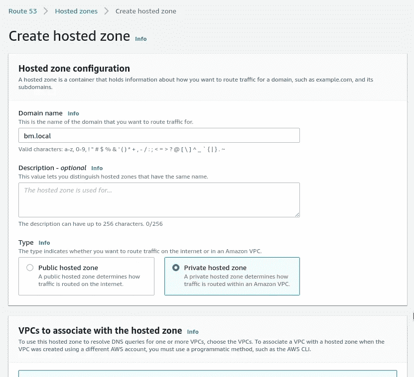
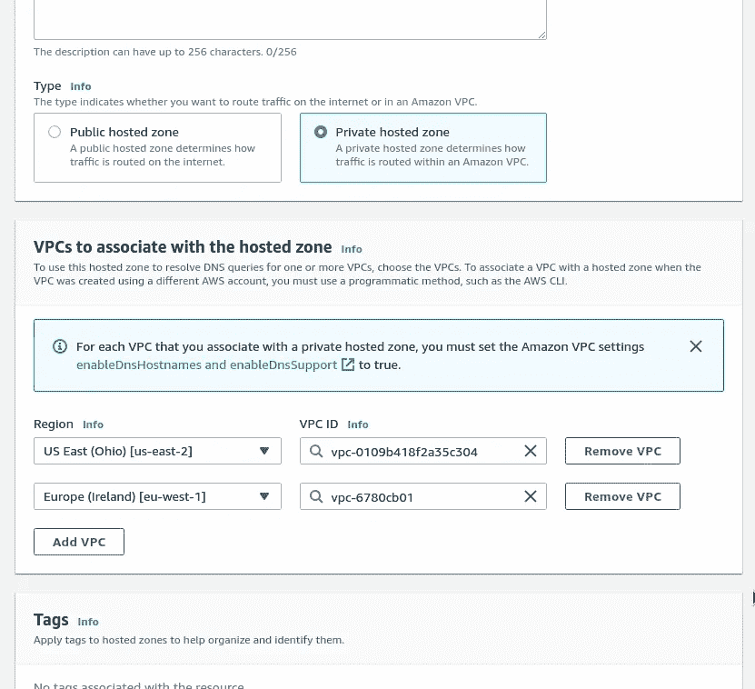
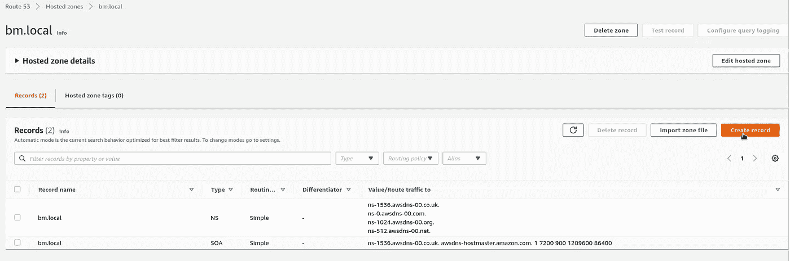
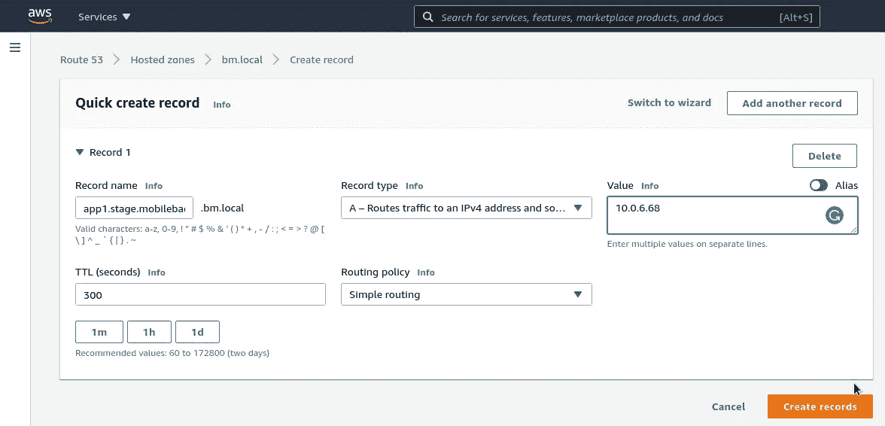

# AWS: Route53 私有托管区域—对互联网隐藏域

> 原文：<https://itnext.io/aws-route53-private-hosted-zones-hiding-domains-from-the-internet-2e4bcdb780d8?source=collection_archive---------7----------------------->


AWS Route53 中的[私有托管区域](https://docs.aws.amazon.com/Route53/latest/DeveloperGuide/hosted-zones-private.html)允许限制对域的 DNS 记录的访问，从而使 [DNS 枚举](https://resources.infosecinstitute.com/topic/dns-enumeration-techniques-in-linux/)(或 DNS 蛮力)无法访问，当攻击者检查域中的可用记录以了解端点列表来检查它们的漏洞时。

对于这样的攻击，有很多实用程序如 [DNSEnum](https://github.com/fwaeytens/dnsenum) 、 [DNSRecon](https://github.com/darkoperator/dnsrecon) 、[凶](http://ha.ckers.org/fierce/)，甚至还有一个众所周知的带有`[dns-brute](https://nmap.org/nsedoc/scripts/dns-brute.html)`脚本的 Nmap。

使用私有域区域的想法是，只能从 AWS 帐户中有限的一组 VPC 内部访问它们，但不能从 Internet 访问它们。

# AWS VPC DNS

首先，让我们检查一下 DNS 在 AWS VPC 是如何工作的:在每个 VPC 中，我们都有一个地址 **.0.1* —这是它的网关，另一个地址是 **.0.2* —这是 VPC 的默认 DNS。

例如，我们有一个 10.0.6.0/24 CIDR 的 VPC。因此，对于此 VPC，我们可以访问 10.0.6.2 以获取有关域的信息:

```
admin@bttrm-stage-console:~$ dig @10.0.6.2 ya.ru +short
87.250.250.242
```

这是 AWS VPC 中服务的默认 DNS，尽管您可以自己配置。

在我们的例子中，我们在一些旧服务器上运行`dnsmasq`,应用程序首先会尝试从中获取信息，然后才会转到 VPC 的 DNS:

```
admin@bttrm-stage-console:~$ cat /etc/resolv.conf
domain us-east-2.compute.internal
search us-east-2.compute.internal
nameserver 127.0.0.1
nameserver 10.0.6.2
nameserver 1.1.1.1
```

更多信息请参见 [DNS: установка BIND、DNS 负载平衡и基于网络的路由через视图](https://rtfm.co.ua/dns-ustanovka-bind-dns-load-balancing-i-network-based-routing-cherez-view/#DNS_AWS)和[DNS:DNS masqипорядокразрешениядомёнизresolv . conf](https://rtfm.co.ua/dns-dnsmasq-i-poryadok-razresheniya-domyon-iz-resolv-conf/)帖子(均为俄语)或文档— [解析 VPC 和您的网络之间的 DNS 查询](https://docs.aws.amazon.com/Route53/latest/DeveloperGuide/resolver.html)。

请记住，要使 VPC 中的 DNS 正常工作，该 VPC 必须启用选项`enableDnsHostnames`和`enableDnsSupport`。此外，Route 53 健康检查和路由策略也有一些限制。更多信息请参见[使用私有托管区域](https://docs.aws.amazon.com/Route53/latest/DeveloperGuide/hosted-zone-private-considerations.html)时的注意事项。

# AWS 路由 53 私有托管区域

现在，当我们知道了 AWS VPC 中的 DNS 是如何工作的，让我们创建一个专用 DNS 区域。

转到 Route53，创建一个新区域，将其类型设置为*私有托管区域*:



下面，您将看到可用于选择 AWS 区域和其中的 VPC 的新选项，从这里可以访问该 DNS 区域:



现在，当创建区域时，在其中添加一些记录:



例如，让我们添加一条记录，该记录将被指向我们的一个临时服务器—*app 1 . stage . mobilebackend . BM . local*:



并检查它是否可用于位于 VPC 的另一个临时服务器:

```
admin@bttrm-stage-console:~$ dig app1.stage.mobilebackend.bm.local +short
10.0.6.68
```

或者使用`[dnstracer](https://linux.die.net/man/8/dnstracer)`实用程序:

```
admin@bttrm-stage-console:~$ dnstracer app1.stage.mobilebackend.bm.localTracing to app1.stage.mobilebackend.bm.local[a] via 10.0.6.2, maximum of 3 retries
10.0.6.2 (10.0.6.2) Got answer
```

我们从 10 . 0 . 6 . 2——VPC DNS 服务器——那里得到了我们的响应，正如我们所料。

现在，试着从办公室到达这个区域:

```
15:06:02 [setevoy@setevoy-arch-work ~] $ dig app1.stage.mobilebackend.bm.local
; <<>> DiG 9.16.18 <<>> app1.stage.mobilebackend.bm.local
;; global options: +cmd
;; Got answer:
;; WARNING: .local is reserved for Multicast DNS
;; You are currently testing what happens when an mDNS query is leaked to DNS
;; ->>HEADER<<- opcode: QUERY, status: NXDOMAIN, id: 27027
;; flags: qr rd ra ad; QUERY: 1, ANSWER: 0, AUTHORITY: 1, ADDITIONAL: 1
;; OPT PSEUDOSECTION:
; EDNS: version: 0, flags:; udp: 512
;; QUESTION SECTION:
;app1.stage.mobilebackend.bm.local. IN A
```

全世界对这个 DNS 区域一无所知。

顺便说一句，可以将相同的 DNS 区域创建为公共和私有，即所谓的“拆分视图 DNS”。参见[如何使用 Route 53 访问我的网站的内部版本，该版本使用与我的公共网站相同的域名？](https://aws.amazon.com/ru/premiumsupport/knowledge-center/internal-version-website/) и [拆分视图 DNS](https://docs.aws.amazon.com/Route53/latest/DeveloperGuide/hosted-zone-private-considerations.html#hosted-zone-private-considerations-split-view-dns) 。

完成了。

*最初发布于* [*RTFM: Linux、DevOps、系统管理*](https://rtfm.co.ua/en/aws-route53-private-hosted-zones-hiding-domains-from-the-internet/) *。*