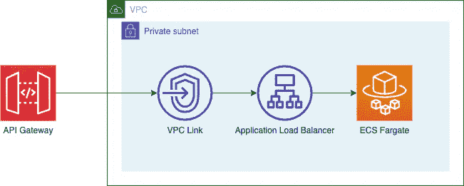

# AWS 无服务器模式:通过 VPC 链接的 ECS Fargate 集群安全访问

> 原文：<https://itnext.io/aws-serverless-pattern-ecs-fargate-cluster-secure-access-via-vpc-link-1d6c98a83ff?source=collection_archive---------2----------------------->

## AWS 无服务器

## 通过 VPC 链接到私有 HTTP 端点的 API 网关

照片由[戴恩·托普金](https://unsplash.com/@dtopkin1?utm_source=unsplash&utm_medium=referral&utm_content=creditCopyText)在 [Unsplash](https://unsplash.com/s/photos/security?utm_source=unsplash&utm_medium=referral&utm_content=creditCopyText) 上拍摄

在这篇博文中，我们将研究一种 AWS 无服务器模式，如何向公共用户公开私有 HTTP 端点，而不将内部资源公开给公共子网。

在我们深入讨论实现细节之前，我建议花点时间了解以下服务、功能和资源的基础知识，以防您还不熟悉。

*   [亚马逊 API 网关](https://docs.aws.amazon.com/apigateway/latest/developerguide/welcome.html)
*   [Fargate 上的亚马逊 ECS](https://docs.aws.amazon.com/AmazonECS/latest/developerguide/AWS_Fargate.html)
*   [VPC 链接](https://docs.aws.amazon.com/apigateway/latest/developerguide/http-api-vpc-links.html)
*   [应用负载平衡器](https://docs.aws.amazon.com/elasticloadbalancing/latest/application/application-load-balancer-getting-started.html)

## **该模式是如何工作的？**

该模式允许将公共 API 网关端点集成到私有 HTTP 端点。在这种情况下，私有端点是应用负载平衡器(ALB ),其背后是 ECS Fargate 集群。公共 API 端点和私有 ALB 之间的 API 网关集成是使用 VPC 链接实现的。它允许在不暴露私有子网资源的情况下构建安全模式，并且只能通过 VPC 链接进行访问。

API 网关和私有 HTTP 端点集成

## 实施细节

去年，我已经提交了这个模式和一个使用 AWS [SAM(无服务器应用程序模型)](https://aws.amazon.com/serverless/sam/)到 [ServerlessLand](https://serverlessland.com/) 的示例参考项目。

您可以参考下面的示例项目，了解使用 AWS [SAM(无服务器应用程序模型)](https://aws.amazon.com/serverless/sam/)和 [Terraform](https://www.terraform.io/) 的参考实现。

*   [山姆参考](https://serverlessland.com/patterns/apigw-vpclink-pvt-alb)。
*   [地形参考](https://serverlessland.com/patterns/apigw-vpclink-pvt-alb-terraform)。

这些项目提供以下资源。假设 VPC 和子网已经配置了所需的网络路由。此外，VPC 和子网 id 作为输入提供。

*   必需的安全组。
*   具有服务和任务定义的 ECS Fargate 集群。
*   具有适当监听器和目标组的专用应用程序负载平衡器。
*   VPC 林克。
*   API 端点和私有 ALB 之间通过 VPC 链接的 API 网关集成。

有关如何部署资源并进行测试的详细说明，请参考以下链接。

*   [https://github . com/AWS-samples/server less-patterns/tree/main/API GW-VP clink-PVT-ALB-terra form](https://github.com/aws-samples/serverless-patterns/tree/main/apigw-vpclink-pvt-alb-terraform)
*   [https://github . com/AWS-samples/server less-patterns/tree/main/API GW-VP clink-PVT-ALB](https://github.com/aws-samples/serverless-patterns/tree/main/apigw-vpclink-pvt-alb)

此外，完成后，通过删除创建的资源来节省成本！

## LocalStack —您的本地 AWS 云

那么，为什么我在这里提到了 [LocalStack](https://localstack.cloud/) ？

我将它用于 Terraform 示例项目的初始配置和测试。我们需要这个项目的 LocalStack Pro 版本，因为它使用了社区版本中不可用的某些服务。

LocalStack 允许您在本地模拟 AWS 云环境，而无需在 AWS 上提供任何东西。

社区版有很多服务，都是免费的！“专业”版会花你一些钱，但如果你经常使用 AWS 服务进行开发，并且使用社区版中没有的服务，这可能还是值得的。

如果您想运行 Terraform 项目，请遵循以下步骤。

*   [安装地形](https://learn.hashicorp.com/tutorials/terraform/install-cli)。
*   [安装并配置本地堆栈](https://docs.localstack.cloud/get-started/#get-localstack-up-and-running)。[选择最适合您的安装选项。]

将“aws”提供程序配置为使用假凭据和自定义 URL，指向本地运行的 LocalStack 环境。下面的文件与[https://github . com/AWS-samples/server less-patterns/blob/main/API GW-VP clink-PVT-ALB-terraform/main . TF](https://github.com/aws-samples/serverless-patterns/blob/main/apigw-vpclink-pvt-alb-terraform/main.tf)中的几乎相同，除了第 14 行中的提供者配置。我使用下面的配置来包含多个服务作为参考，但是您可以只配置您需要的服务。

去吧，试一试。

快乐大厦！

***注意:*** *安全组规则和一些与该示例项目中创建的资源相关的配置可能不是生产级的，仅用于参考目的。*

## 参考

进一步阅读了解更多关于这些类型的无服务器集成模式:

*   [https://serverlessland.com/](https://serverlessland.com/)
*   [https://docs . AWS . Amazon . com/API gateway/latest/developer guide/http-API-develop-integrations-private . html](https://docs.aws.amazon.com/apigateway/latest/developerguide/http-api-develop-integrations-private.html)
*   [https://AWS . Amazon . com/blogs/compute/configuring-private-integrations-with-Amazon-API-gateway-http-APIs/](https://aws.amazon.com/blogs/compute/configuring-private-integrations-with-amazon-api-gateway-http-apis/)
*   [https://localstack.cloud/](https://localstack.cloud/)

*本帖原载于*[*dev . to*](https://dev.to/aws-builders/aws-serverless-pattern-ecs-fargate-cluster-secure-access-via-vpc-link-ml7)*。*

*关注我上*[*LinkedIn*](https://www.linkedin.com/in/bideep/)*，*[*Twitter*](https://twitter.com/bbideep)*。*

[*在*](https://bbideep.medium.com/subscribe) *上订阅更多此类帖子。*