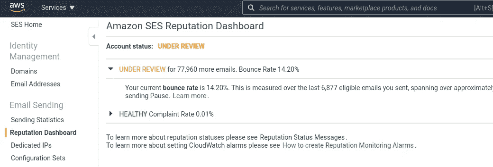
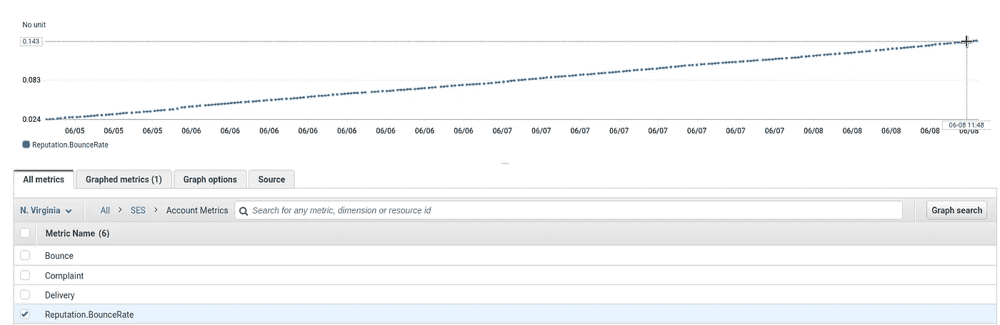
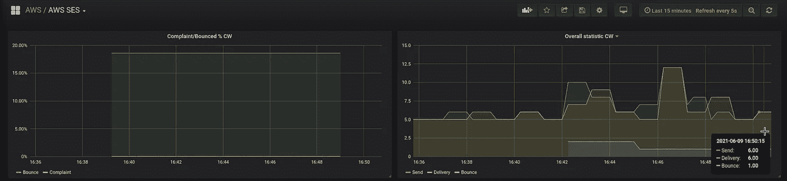
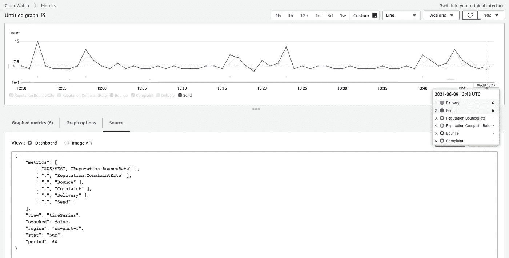
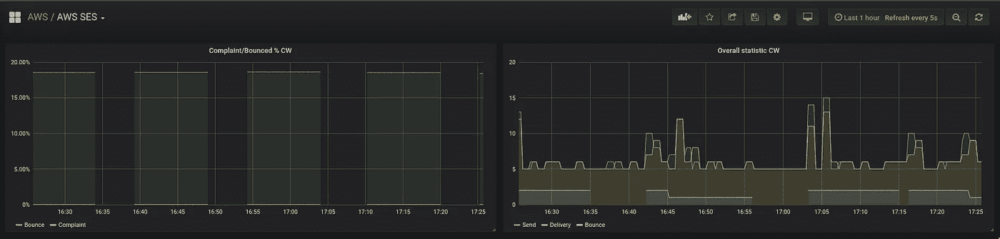
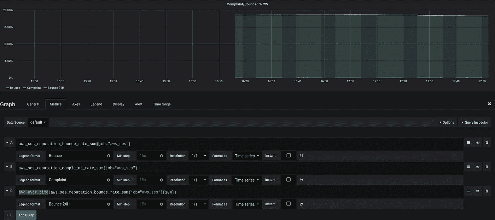
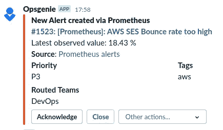

# AWS:简单的电子邮件服务跳出率和监测与普罗米修斯

> 原文：<https://itnext.io/aws-simple-email-service-bounce-rate-and-monitoring-with-and-prometheus-4d85e63633df?source=collection_archive---------5----------------------->


最近，由于跳出率低，AWS 屏蔽了我们的 AWS 简单电子邮件服务。

这可以在 [*AWS SES >信誉仪表盘*](https://console.aws.amazon.com/ses/home?region=us-east-1#reputation-dashboard:) 中查看，我们的账户目前有*在审*状态:



在我们联系了 AWS 技术支持后，他们重新启用了它，但我们必须尽快解决这个问题，并在未来监控 AWS SES 跳出率以避免此类情况。

在本帖中，我们将概括介绍电子邮件的退回率和投诉率，然后用 hAWS CloudWatch 和 Prometheus 配置 AWS SES 监控和警报。

*   [反弹和投诉率](https://rtfm.co.ua/en/aws-simple-email-service-bounce-rate-and-monitoring-with-and-prometheus/#Bounce_and_Complaint_rate)
*   [跳出率](https://rtfm.co.ua/en/aws-simple-email-service-bounce-rate-and-monitoring-with-and-prometheus/#Bounce_rate)
*   [软硬弹跳](https://rtfm.co.ua/en/aws-simple-email-service-bounce-rate-and-monitoring-with-and-prometheus/#Hard_and_Soft_Bounce)
*   [投诉率](https://rtfm.co.ua/en/aws-simple-email-service-bounce-rate-and-monitoring-with-and-prometheus/#Complaint_rate)
*   [AWS SES CloudWatch 指标](https://rtfm.co.ua/en/aws-simple-email-service-bounce-rate-and-monitoring-with-and-prometheus/#AWS_SES_CloudWatch_metrics)
*   [普罗米修斯 CloudWatch 导出器配置](https://rtfm.co.ua/en/aws-simple-email-service-bounce-rate-and-monitoring-with-and-prometheus/#Prometheus_CloudWatch_Exporter_configuration)
*   [普罗米修斯警报](https://rtfm.co.ua/en/aws-simple-email-service-bounce-rate-and-monitoring-with-and-prometheus/#Prometheus_alert)

# 退回和投诉率

AWS 可以因为高跳出率或投诉率而封锁 SES 帐户。在其高评级的情况下，远程电子邮件服务器可以通过将它们标记为“垃圾邮件”来停止接受来自 AWS 的 IP 的新邮件，因此 AWS 正在密切监控这些指标。

让我们看看什么是反弹和合规评级，然后将 Prometheus Alertmanager 配置为在反弹评级达到 5%和合规评级超过 1%时发送警报。

检查[我能做些什么来最大限度地减少反弹？](https://docs.aws.amazon.com/ses/latest/DeveloperGuide/faqs-enforcement.html#bn-q11)获取更多信息。

## 跳出率

跳出率定义了哪部分收件人没有收到邮件，参见[跳出率](https://www.webopedia.com/definitions/bounce-rate/)。

其值计算为(退回次数/发送总数)* 100，例如:

```
>>> (10.0/10000)*100
0.1
```

这里我们得到了 0.1% —如果它对我们来说是真实的，这是一个很好的结果:-)

## 软硬弹跳

此外，跳出率分为*硬*和*软*等级。

*   硬退回:收件人的邮件服务器根本拒绝接收邮件。这可能是由于一个错误的电子邮件地址，它在远程服务器上的域，或者如果服务器根本不能接受新的电子邮件
*   **软退回**:收件人的电子邮件服务器接受了一封电子邮件，但由于用户的磁盘配额或电子邮件的大小等原因，无法将电子邮件发送到用户的邮箱

## 投诉率

当收件人明确通知他不想收到发件人的电子邮件时，例如通过按下其邮件客户端中的“垃圾邮件”按钮或通过向 AWS SES 发送辱骂，投诉率将被计算在内。

# AWS SES 云观察指标

对于警报，我们可以使用针对 AWS SES 的 AWS CloudWatch 指标:

*   *发送*:发送邮件总数
*   *发送量*:发送到收件人邮箱的邮件总数
*   *退回*:收件人的邮件服务器拒绝接受邮件(算作硬退回)
*   *投诉*:一封邮件被发送到收件人的邮箱，但被标记为垃圾邮件

此外，我们还有两个额外的重新计算的指标，分别是退回和投诉— *声誉。反弹率*和*声望。抱怨*。

此时此刻，我们的声誉。反弹率== 0.1432，即 14%:



*(在这篇文章结束时，它将增长到 18% —我们每天都有 4%的额外增长)*

有两种方式发出警报:通过使用 AWS CloudWatch Alerts 和 SNS，参见[使用 CloudWatch 创建信誉监控警报](https://docs.aws.amazon.com/ses/latest/DeveloperGuide/reputationdashboard-cloudwatch-alarm.html)，或者通过将这些指标收集到外部监控系统。

在我们的例子中，我们将把它们收集到一个 Prometheus 实例中，该实例将使用它的 Alertmanager 向 Opsgenie 发送警报，Opsgenie 将把它们转发给我们的 Slack。

## 普罗米修斯 CloudWatch 导出程序配置

通常，我们使用的是[的另一个 cloudwatch-exporter](https://rtfm.co.ua/en/prometheus-yet-another-cloudwatch-exporter-collecting-aws-cloudwatch-metrics/) ，但对于 AWS SES 指标，它显示垃圾，在其 Github 问题上[的问题](https://github.com/ivx/yet-another-cloudwatch-exporter/issues/395)很少得到回答，总的来说，现在，它似乎是一个废弃的项目。

因此，对于 SES，我们将使用一个通用的导出器，请参见[Prometheus:cloud watch exporter—сборметиикиатикиивGrafana](https://rtfm.co.ua/prometheus-cloudwatch-exporter-sbor-metrik-iz-aws-i-grafiki-v-grafana/)(*RUS*)。

这是配置文件:

```
region: us-east-1
set_timestamp: false
delay_seconds: 60

metrics:

 - aws_namespace: AWS/SES
   aws_metric_name: Send

 - aws_namespace: AWS/SES
   aws_metric_name: Delivery

 - aws_namespace: AWS/SES
   aws_metric_name: Bounce

 - aws_namespace: AWS/SES
   aws_metric_name: Complaint

 - aws_namespace: AWS/SES
   aws_metric_name: Reputation.BounceRate

 - aws_namespace: AWS/SES
   aws_metric_name: Reputation.ComplaintRate
```

为了检查这些指标，我们可以使用来自[AWS:ses——简单电子邮件服务иwork mail:настрокаактанотаиотпиааапочты](https://rtfm.co.ua/aws-ses-simple-email-service-i-workmail-nastrojka-akkaunta-i-otpravka-pochty/#Python_%D1%81%D0%BA%D1%80%D0%B8%D0%BF%D1%82_%D0%BE%D1%82%D0%BF%D1%80%D0%B0%D0%B2%D0%BA%D0%B8)post(*RUS*)的 Python 脚本

```
$ watch -n 10 ./ses_email.py
```

给 Grafana 加点 grahs:

```
aws_ses_reputation_bounce_rate_sum{job="aws_ses"}

aws_ses_reputation_complaint_rate_sum{job="aws_ses"}

avg_over_time(aws_ses_reputation_bounce_rate_sum{job="aws_ses"}[1h])

aws_ses_send_sum{job="aws_ses"}

aws_ses_delivery_sum{job="aws_ses"}

aws_ses_bounce_sum{job="aws_ses"}

aws_ses_complaint_sum{job="aws_ses"}
```



将它们与 CloudWatch 仪表盘上的指标进行比较，以确保它们是正确的:



现在我们只需要创建一个警报。

## 普罗米修斯警报

但是这里有一个问题。

从图表中，我们可以看到跳出率显示有间隙(在左侧):



大约每隔 20 分钟，我们开始发送电子邮件(图中的 5-6 是我们的测试，由上面提到的脚本发送)，一旦我们发送电子邮件，我们就可以看到`aws_ses_reputation_bounce_rate_sum`。

因此，如果使用一个简单的警告，如:

```
- alert: AWSSESReputationBounceRate
  expr: aws_ses_reputation_bounce_rate_sum{job="aws_ses"} * 100 > 5
  for: 1s
  labels:
    severity: warning
  annotations:
    summary: 'AWS SES Bounce rate too high'
    description: 'Latest observed value: {{ $value | humanize }} %'
    tags: aws
```

它也会每 20 分钟自动开启和关闭一次。

我们在这里能做什么？

作为一个解决方案，这里可以使用`[avg_over_time()](https://prometheus.io/docs/prometheus/latest/querying/functions/#aggregation_over_time)`函数，周期为 10 或 20 分钟，然后我们将看到没有间隙的图形:



更新警报(此处使用 1 小时):

```
- alert: AWSSESReputationBounceRate
  expr: avg_over_time(aws_ses_reputation_bounce_rate_sum{job="aws_ses"}[1h]) * 100 > 5
  for: 1s
  labels:
    severity: warning
  annotations:
    summary: 'AWS SES Bounce rate too high'
    description: 'Latest observed value: {{ $value | humanize }} %'
    tags: aws
```

并且得到了一个懈怠的通知:



完成了。

*最初发布于* [*RTFM: Linux、DevOps、系统管理*](https://rtfm.co.ua/en/aws-simple-email-service-bounce-rate-and-monitoring-with-and-prometheus/) *。*