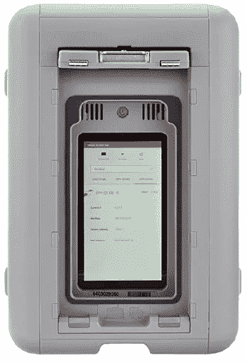
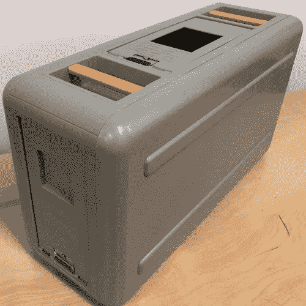
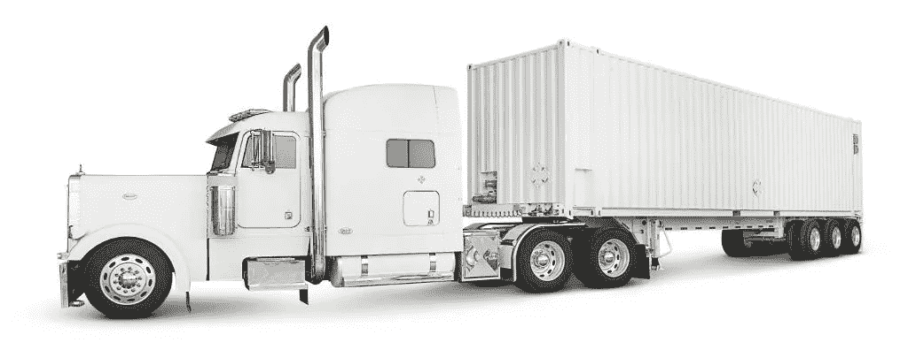
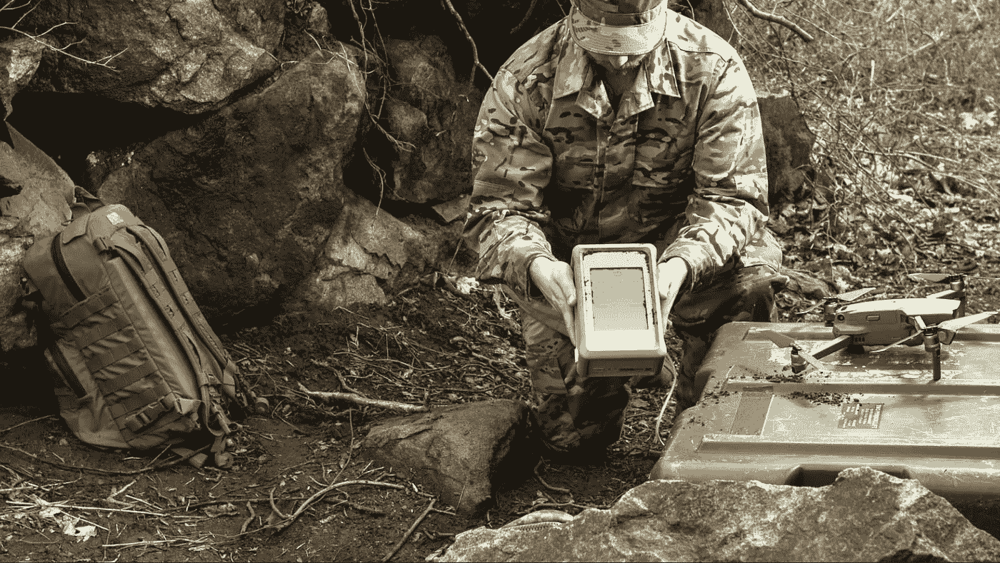

# AWS 雪地车？将数据物理传输到 AWS。

> 原文：<https://itnext.io/aws-snowmobile-physically-transfer-data-to-aws-8122767b7659?source=collection_archive---------5----------------------->

## 对自动气象站雪车和自动气象站雪球的研究

AWS 数据中心物理传输数据的服务？是的，它存在！它被称为 AWS 雪球和 AWS 雪地车，至少可以说，它令人印象深刻。

# AWS 雪球

第一项名为雪球的服务是一种物理设备，由 AWS 运送到你所在的地方，收取一定的费用。然后，您可以从雪球设备下载数据或向其上传数据。

如果您想要下载数据，您可以在请求前指定要在设备上提供的数据。至于上传，您将能够为您上传的数据配置目标位置。

AWS 雪球设备，来自 [AWS 文档](https://docs.aws.amazon.com/snowball/latest/developer-guide/using-device.html)

在撰写本文时，AWS 收取 300 至 400 美元的安装费用，并允许您保留设备长达 10 天。您还需要支付任何适用的数据传输费用。

雪球机要么是存储优化的，要么是计算优化的，这取决于你想用它们做什么。存储优化雪球有大约 80 TB 的可用存储。计算优化雪球大约有 52 个虚拟 CPU 和 208GB 内存。它能让你从像 S3 这样的存储器中下载或上传数据。

它还具有额外的功能，如 NFS 端点，加密和防篡改。使用后，AWS 会安全地擦除设备数据。

# AWS 雪地车

AWS 雪地车，来自 [AWS](https://aws.amazon.com/blogs/publicsector/category/government/page/9/)

AWS snowmobile 的工作原理是一样的，它允许你将大量的数据物理地传输到 AWS 或者从 AWS 传输出去。Snowmobile 的价格尚未公开，需要致电 AWS 销售团队。他们提到价格取决于每月使用的存储量。而 1GB 的价格是每月 0.005 美元。这意味着 100 TB 大约相当于每月 500 美元。

一辆雪地车可以传输大约 100 的数据。如果要用雪球装置来代替，那就需要 1250 个这样的装置！

# AWS 雪锥

来自 [AWS 网站](https://aws.amazon.com/snowcone/?whats-new-cards.sort-by=item.additionalFields.postDateTime&whats-new-cards.sort-order=desc)的 AWS Snowcone

AWS 有一个更小版本的 AWS 雪球可用，称为 [AWS Snowcone](https://aws.amazon.com/snowcone/) 。这款设备仅重 2.1 千克，配备 2 个 vCPUs、8TB 存储和 4GB 内存。这是一台便携式边缘计算机。它可以用作集线器，在将数据发送到 AWS 之前对其进行处理，或者用于数据传输。数据传输可以通过 AWS 数据同步在线进行，也可以离线进行。

Snowcone 的最低价格为 60 美元，包括 5 天的使用时间。每天 6 美元的额外天数是可能的。请注意，[额外的数据传输费用](https://aws.amazon.com/snowcone/pricing/)适用。

# 更多资源

如果你想了解更多关于 AWS 的雪家族，请看看下面的网页。该网页还比较了不同的雪产品，以及它们的规格。

 [## AWS Snow 系列|将数据移入和移出 AWS 的物理设备| Amazon Web Services

### 高度安全的便携式设备，用于在边缘收集和处理数据，并将数据移入和移出 AWS…

aws.amazon.com](https://aws.amazon.com/snow/?c=s&sec=srv) 

[订阅我的媒介](https://kevinvr.medium.com/membership)到**解锁** **所有** **文章**。通过使用我的链接订阅，你是支持我的工作，没有额外的费用。你会得到我永远的感激。