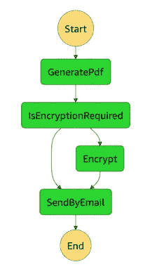
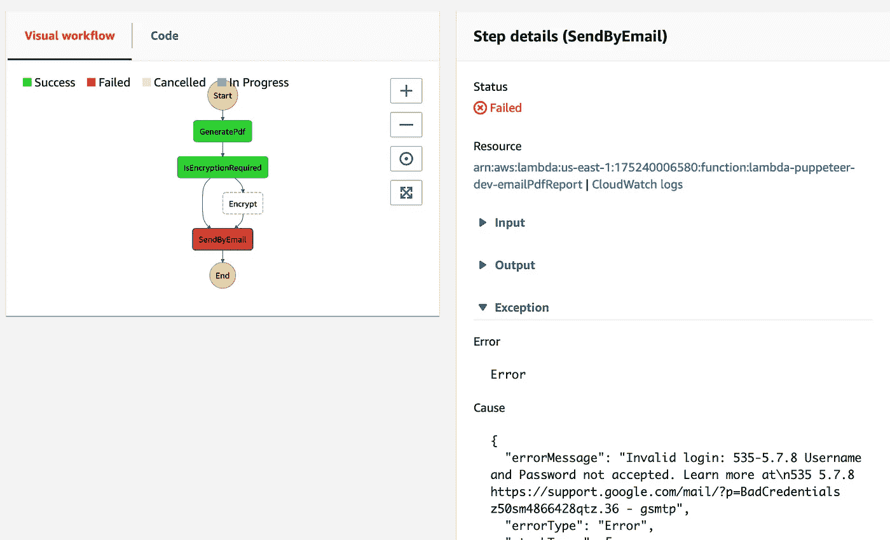

# AWS 阶跃函数——为什么应该使用它们。

> 原文：<https://itnext.io/aws-step-functions-why-you-should-use-them-eb40cc359f2a?source=collection_archive---------0----------------------->

在本系列的第一篇文章中，我们介绍了设置一个可以在 AWS 上运行的无头 chrome 浏览器的过程，使用 Puppeteer API，让 chrome 导航到一个 URL，等待页面完全加载，然后创建一个 PDF。

在第二篇文章的[中，我们使用命令行工具`qpdf`对 PDF 进行了加密，这是从源代码构建的。](/running-arbitrary-executables-in-aws-lambda-encrypting-a-pdf-afea47e3c345?source=friends_link&sk=22d11f9a7e4a759c51f09368a4974b30)

今天，我将介绍一个使用 AWS 阶跃函数的真实例子。我们将介绍构建一个 step functions 流程，该流程调用 PDF 服务，决定是否加密输出，然后通过电子邮件将 PDF 发送到指定的地址。


## 什么是阶跃函数？

> AWS 步骤功能允许您将多个 AWS 服务协调到无服务器工作流中，以便您可以快速构建和更新应用程序。使用 Step 函数，您可以设计和运行将 AWS Lambda 和 Amazon ECS 等服务缝合到功能丰富的应用程序中的工作流。

我们将要构建的流程如下所示:



我们将传入我们想要 pdf 的 url，以及可选的加密参数和要发送到的电子邮件地址。如果我们的参数请求，工作流只运行加密步骤。

## 为什么要使用阶跃函数？

我推荐使用阶跃函数有很多原因。其中包括:

*   这是处理长时间运行的工作流的简单方法。如果您使用过 Api Gateway，您可能会遇到 [30 秒超时限制](https://stackoverflow.com/questions/54299958/how-can-i-set-the-aws-api-gateway-timeout-higher-than-30-seconds)。使用 step 功能，您的整个业务流程最多可在一年内完成！此外，每个单独的 lambda 函数最多允许 15 分钟。
*   它鼓励您将代码分解成一堆可重用的微服务，然后可以针对不同的业务流程以不同的方式进行组合。
*   每个步骤都可以指定失败时是否应该重试。您可以指定重试间隔、最大尝试次数和退避率。这意味着您可以防止您的流程由于您的一个依赖项中的临时中断而失败。
*   您可以看到工作流的可视化显示，它会随着流程的进展而更新，允许您检查每个步骤的输入和输出、任何异常和完整的日志。您还可以添加警报，以便在出现问题时通知您。
*   您可以添加选择步骤，以便根据输入数据决定下一步运行哪个步骤。在上面的流程中，IsEncryptionRequired 是一个选择步骤。
*   您还可以添加一个用于创建并行执行分支的并行步骤。
*   最后，您可以直接触发 step 函数，或者使用类似 cron-job 的表达式来调度它们。

主要缺点是:

*   一旦步骤功能流已经开始，当前就没有 api 支持来检查其进度。
*   您被限制在两个步骤之间传递不超过 32K 的数据。在这篇文章的后面，我们将看看如何解决这个限制。
*   免费层并不是特别慷慨，虽然至少它不会在你的第一年结束时过期。您目前每月收到 4000 份免费状态转换。见[定价](https://aws.amazon.com/step-functions/pricing/)。注意每一次重试都将作为一次额外的状态转换。

## 发送电子邮件

我们的服务将通过电子邮件发送 PDF 文件。为了支持这一点，让我们定义一个适当的接口来支持电子邮件发送:

```
export interface EmailService { send(to: string, subject: string, body: string, base64Attachment?: string, attachmentName?: string): Promise<any>;}
```

有很多方法可以实现这个接口，例如使用 [SendGrid](https://sendgrid.com) ，但是最简单的方法可能是使用 [nodemailer](https://nodemailer.com/about/)

```
npm i nodemailer
```

下面是一个可能的实现，使用 gmail 作为发件人:

要允许 nodemailer 连接到您的邮件服务器，您需要提供凭据，这不应该包含在您的代码中。无服务器框架为[管理机密](https://serverless.com/blog/serverless-secrets-api-keys/)提供了一些选择。我最喜欢的选择是利用 AWS 参数存储(也称为 SSM，简单系统管理器)。

## 向你的 lambda 传递秘密

将环境部分添加到您的`serverless.yml`

```
environment:
  EMAIL_ADDRESS: ${ssm:emailAddress-${opt:stage, self:provider.stage}~true}
  EMAIL_PASSWORD: ${ssm:emailPassword-${opt:stage, self:provider.stage}~true}
```

请注意，在值被加密的地方需要使用`~true`后缀，如果您使用`SecureString`值类型，就会出现这种情况——见下文。此外，通过在这些值的名称中包含阶段，您可以轻松地为`dev`、`test`和`prod`阶段设置不同的值。

上面的实现使用以下代码行从环境中提取这些值:

```
const emailAddress = process.env.EMAIL_ADDRESS;
const emailPassword = process.env.EMAIL_PASSWORD;
```

最后，使用 AWS cli 设置这些值，例如

```
aws ssm put-parameter --name emailPassword-dev --type SecureString --region us-east-1 --value PLw-q6x-PdX-Ab1
```

请注意，您可以在不同的区域设置不同的值，因此请确保您指定了要部署到的区域。

## 在 S3 存储文件

正如上面的缺点列表中所提到的，您被限制在步骤之间传递不超过 32K 的数据。为了在步骤之间传递 pdf 文件，我们将把它们写入 S3，并将文件路径传递给下一个步骤，而不是传递文件的内容。

[](https://docs.aws.amazon.com/step-functions/latest/dg/concepts-service-integrations.html) [## AWS 服务集成- AWS 步骤功能

### 了解如何协调其他 AWS 服务和 AWS 步骤功能。

docs.aws.amazon.com](https://docs.aws.amazon.com/step-functions/latest/dg/concepts-service-integrations.html) 

Step functions 目前支持与各种 AWS 服务(如 DynamoDB)的直接集成，但在撰写本文时，还不支持将文件写入 S3。为了允许我们读写 S3 文件，让我们给我们的`FileSystemService`添加一个 S3 实现。

我们还需要通过向`serverless.yml`添加以下内容来配置对存储文件的 S3 存储桶的访问

```
environment:
  STEP_FUNCTIONS_DATA_BUCKET: ${self:service}-${opt:stage, self:provider.stage}-step-functions-data-bucket resources:
  Resources:
    StepFunctionsDataBucket:
      Type: AWS::S3::Bucket
      Properties:
        BucketName: ${self:provider.environment.STEP_FUNCTIONS_DATA_BUCKET}iamRoleStatements: # permissions for all functions are set here
  - Effect: Allow
    Action:
      - s3:PutObject
      - s3:GetObject
    Resource:
      Fn::Join:
        - ""
        - - "arn:aws:s3:::"
          - Ref: "StepFunctionsDataBucket"
          - "/*"
```

这里我们定义一个环境变量来保存 bucket 名称(包括 stage)，创建 bucket 资源并允许 PutObject 和 GetObject 调用它。

## 定义工作流

现在我们已经有了所有的构建模块，我们可以继续定义一个阶跃函数状态机。

您使用基于 JSON 的 [Amazon States 语言](https://docs.aws.amazon.com/step-functions/latest/dg/concepts-amazon-states-language.html)定义状态机。`[serverless-step-functions](https://serverless.com/plugins/serverless-step-functions/)`插件支持在我们的`serverless.yml`文件中包含这样的定义。 `serverless-pseudo-parameters`插件对于构建 ARNs 也很有用。

在终端运行中:

```
npm install --save-dev serverless-step-functions
npm install --save-dev serverless-pseudo-parameters
```

然后将以下部分添加到您的`serverless.yml`

```
plugins:
  - serverless-step-functions
  - serverless-pseudo-parameters
```

将以下状态机定义添加到您的`serverless.yml`

events 部分设置了一个 https 端点，一个`POST`将启动这个流，而`POST`的主体为第一步提供输入数据。

定义为`GeneratePdf`、`Encrypt`和`SendByEmail`定义了 3 个任务步骤。这些步骤各自定义了一个结果路径，例如`$.pdfFileName`。这将步骤的输出作为属性添加到输入对象中。这样，步骤之间传递的数据可以累积。

该定义还包括一个选择步骤，它查看输入的`encryptionRequired`属性。如果是，下一步是`encrypt`，否则是`sendByEmail`。

我们可以定义一个接口来描述可以传递给工作流的参数:

```
export interface CreatePdfRequest {
    url: string;
    reportName: string;
    toAddress: string;
    encryptionRequired: boolean;
    ownerPassword?: string;
    userPassword?: string;
    pdfFilePath?: string;
    encryptedFilePath?: string;
};
```

最后一项工作是修改 handler.ts 来定义每个任务步骤使用的 lambda 函数

并将映射添加到`serverless.yml`

```
functions:
  generatePdf:
    handler: lib/handler.generatePdf
  encrypt:
    handler: lib/handler.encrypt
  emailPdfReport:
    handler: lib/handler.emailPdfReport
```

每个函数都遵循相同的模式:

*   将传入事件转换到请求接口
*   如果需要，读取输入数据
*   调用支持该步骤功能的服务
*   构建步骤的输出
*   将输出传递给回调。

现在用`npm run deploy`部署您的代码，如果一切顺利，您将看到已经创建的端点:

```
Serverless StepFunctions OutPuts
endpoints:
  POST - [https://j80szm0d9i.execute-api.us-east-1.amazonaws.com/dev/pdf/create](https://j80szm0d9i.execute-api.us-east-1.amazonaws.com/dev/pdf/create)
```

使用 curl 测试服务:

```
curl "Content-Type: application/json" -d '{"url" : "[https://example.com](https://example.com)", "reportName" : "example report 1", "toAddress": "[[to email address](mailto:keith.coughtrey@gmail.com)]", "encryptionRequired": false }' [https://j80szm0d9i.execute-api.us-east-1.amazonaws.com/dev/pdf/create](https://j80szm0d9i.execute-api.us-east-1.amazonaws.com/dev/pdf/create)
```

`POST`应该返回类似这样的内容:

```
{"executionArn":"arn:aws:states:us-east-1:175240006580:execution:lambda-puppeteer-dev-pdf-workflow:eaacf7ac-9bc4-11e9-8a16-abe9d3e2566a","startDate":1.561960566573E9}
```

希望你会收到这封邮件，如果没有，请转到步骤功能控制台并单击执行。如果您尚未成功设置您的电子邮件服务器凭据，您可能会看到如下内容:



## 如果一开始你没有成功…

一旦我们获得了正确的邮件服务器凭据，如果我们试图发送电子邮件时邮件服务器关闭了，会发生什么情况。我们只需在步骤定义中添加一个`retry`部分，例如:

```
EmailPdfReport:
    Type: Task
    Resource: ...
    ResultPath: $.email
    Next: GetPaymentType
    Retry:
    - ErrorEquals:
      - States.ALL
      IntervalSeconds: 30
      MaxAttempts: 4
      BackoffRate: 4
```

此配置将在 30 秒、2 分钟、8 分钟和 32 分钟后重试。

step 函数的真正优点是，当我们需要支持一个新的需求，使用 Stripe 对一些报告进行收费，或者我们需要通过回调而不是电子邮件来交付一些报告时，会发生什么情况呢？显然，答案是我们添加更多的步骤和选择来支持这些不同的流程，随着时间的推移，我们建立了一个可重用的服务库，这些服务可以以不同的方式进行组合。

好了，这就结束了这一系列的职位。我希望你觉得它们有趣并且有用。该系列的所有代码都可以在[这里](https://github.com/keithcoughtrey/LambdaPuppeteer)找到。

当我开始使用阶跃函数时，我发现了许多人为的例子和教程，我在这里的目的是展示一些更真实的东西。注意，为了简洁起见，我省略了一些细节，比如确保存储在 S3 的文件名是惟一的(这样它们就不会被并发调用覆盖),以及在流程结束时从 S3 删除文件。

记得使用`sls remove`来释放你的资源，我建议在 CloudFormation 中检查栈实际上已经被删除了。