# AWS:值得信赖的顾问，第 1 部分—其功能概述

> 原文：<https://itnext.io/aws-trusted-advisor-part-1-its-features-overview-8e09c003ca7a?source=collection_archive---------3----------------------->

AWS Trusted Advisor 是另一项服务，它可以监控您的会计师使用的资源的成本效益、性能、安全性等。

请记住，您可以获得的可信顾问的检查取决于您帐户的 [AWS 支持计划](https://aws.amazon.com/premiumsupport/plans/)。вашего аккаунта.幸运的是，我们有 Premium，所以我能够了解所有值得信赖的顾问的功能。

在 [AWS 可信顾问检查参考页面](https://docs.aws.amazon.com/awssupport/latest/user/trusted-advisor-check-reference.html)上查看其一般文档，在此处查看关于其检查的文档— [AWS 可信顾问检查参考](https://docs.aws.amazon.com/awssupport/latest/user/trusted-advisor-check-reference.html#cost-optimization-checks)。

*   [成本优化](https://rtfm.co.ua/en/aws-trusted-advisor-part-1-its-features-overview/#Cost_optimization)
*   [性能](https://rtfm.co.ua/en/aws-trusted-advisor-part-1-its-features-overview/#Performance)
*   [安全](https://rtfm.co.ua/en/aws-trusted-advisor-part-1-its-features-overview/#Security)
*   [如何找到正在使用特定 AWS SecurityGroup 的资源？](https://rtfm.co.ua/en/aws-trusted-advisor-part-1-its-features-overview/#How_can_I_find_a_resource_that_is_using_a_specific_AWS_SecurityGroup)
*   [容错](https://rtfm.co.ua/en/aws-trusted-advisor-part-1-its-features-overview/#Fault_tolerance)
*   [服务限制](https://rtfm.co.ua/en/aws-trusted-advisor-part-1-its-features-overview/#Service_limits)
*   [偏好设置](https://rtfm.co.ua/en/aws-trusted-advisor-part-1-its-features-overview/#Preferences)

转到 *AWS 控制台>可信顾问*，启用它，你会看到一个带有建议的仪表板:

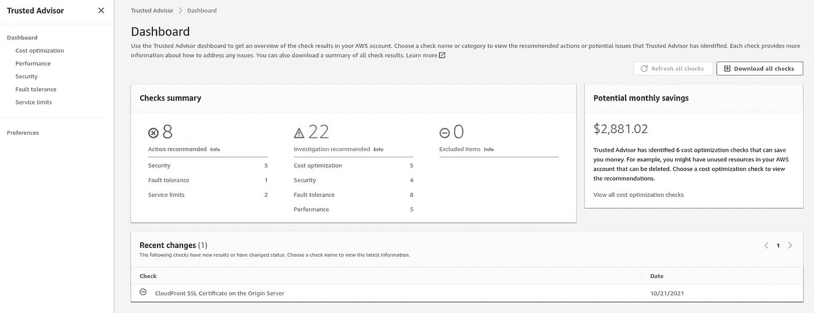

这里:

*   **建议的行动**:可信顾问认为您必须尽快注意，因为有严重的问题，例如 IAM 密钥泄露
*   **调查建议**:可信顾问认为，你必须注意检查一些服务，例如当你询问一些 AWS 服务的报价时
*   排除项目:嗯——只是排除项目

在左侧，您会看到它的类别—成本优化、性能等等，所有检查都在这里分组。

## 成本优化

让我们从*成本优化*类别开始，因为这是我现在最感兴趣的。

转到该类别，您将看到一个结果列表:

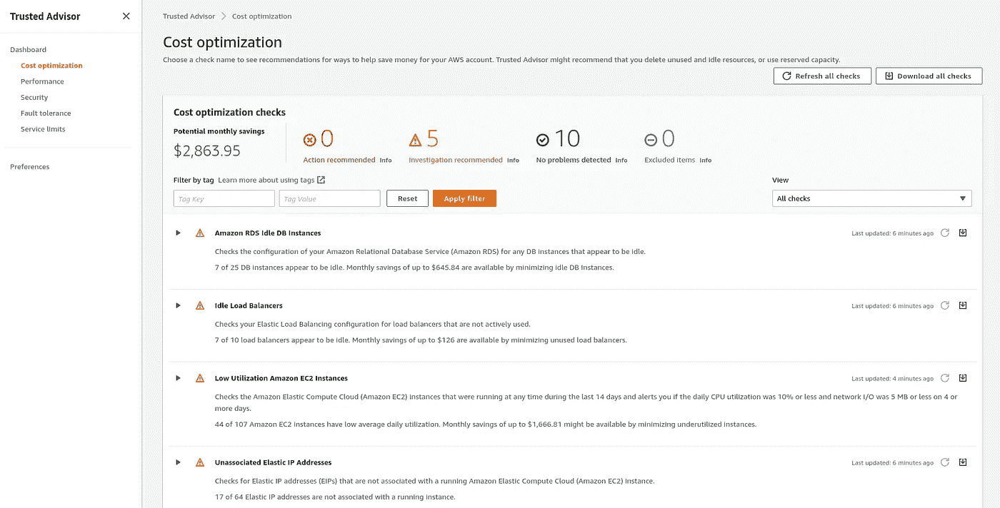

例如，让我们检查一下 [*Amazon RDS Idle DB 实例*](https://docs.aws.amazon.com/awssupport/latest/user/trusted-advisor-check-reference.html#amazon-rds-idle-dbs-instances) 检查 *:*

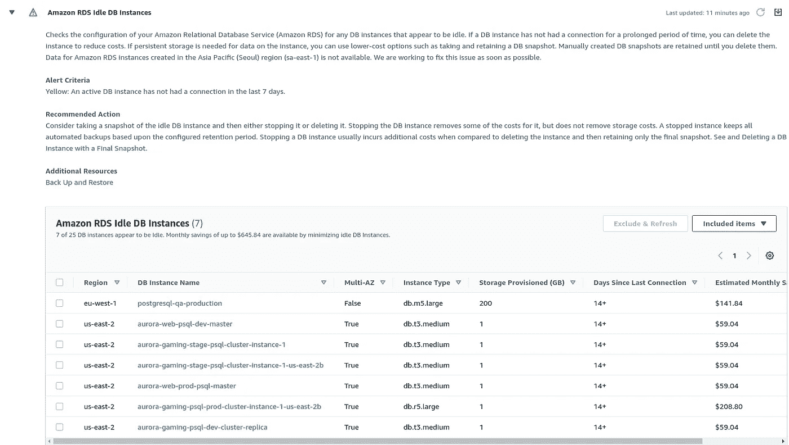

因此，在这里我们可以看到，Trusted Advisor 发现了一些未被使用的 RDS 服务器。

去检查他们:

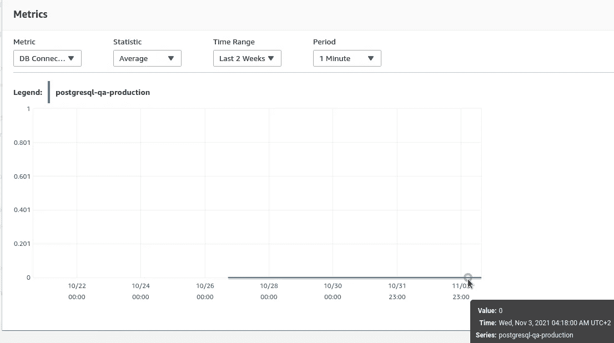

事实上，服务器没有 CPU 负载，甚至在上周没有连接，所以最好删除它或降级到更便宜的实例类型。

EC2 服务的类似发现:

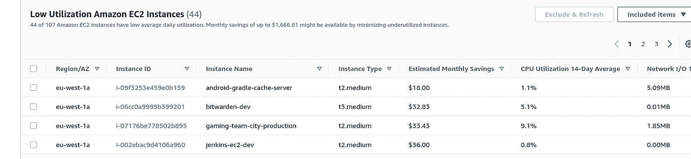

## 表演

就像它听起来的那样，这里找到了可能影响您所使用的 AWS 服务性能的所有因素:

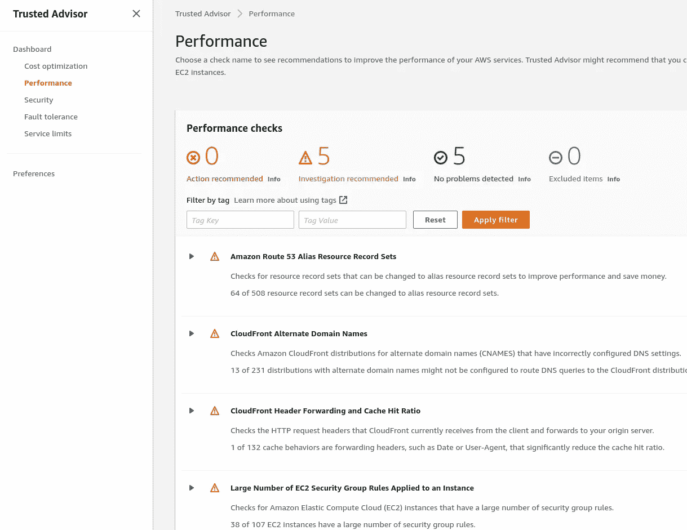

例如，让我们看一下*大量 EC2 安全组规则应用于实例*检查:

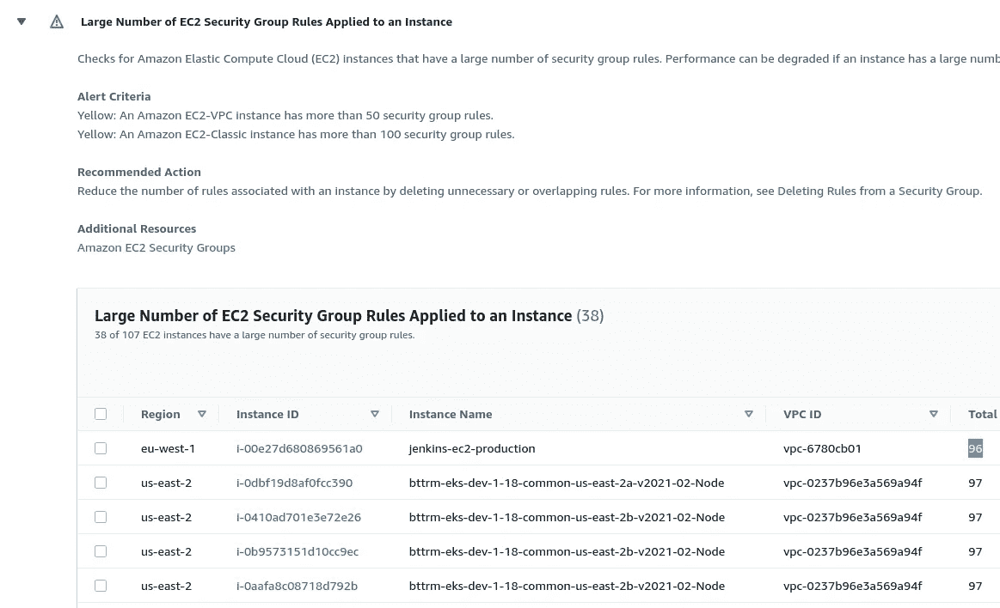

使用不同的安全组运行一些性能测试会很有趣。

## 安全性

非常有趣的部分是*安全性*:

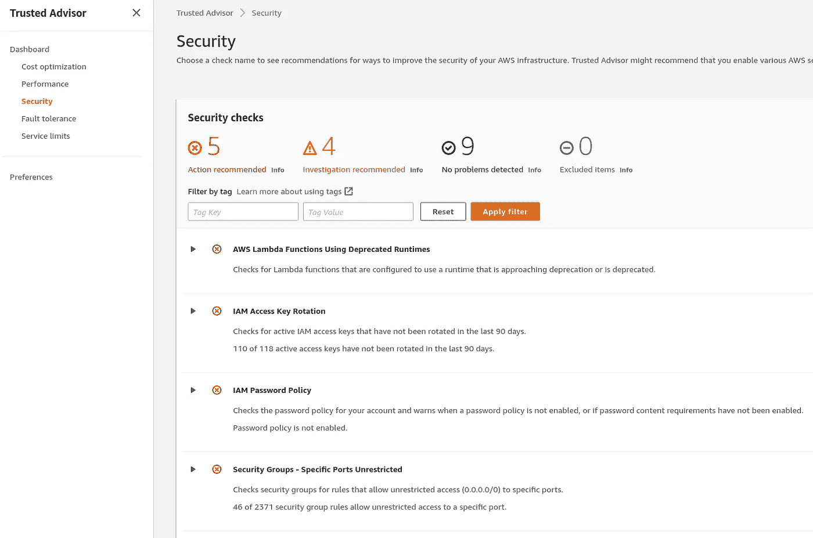

正如我所料，我们得到一个通知，我们的 IAM 键没有被旋转，这是一个很好的回顾点。

另外，一个有用的检查是*安全组—无限制访问*:

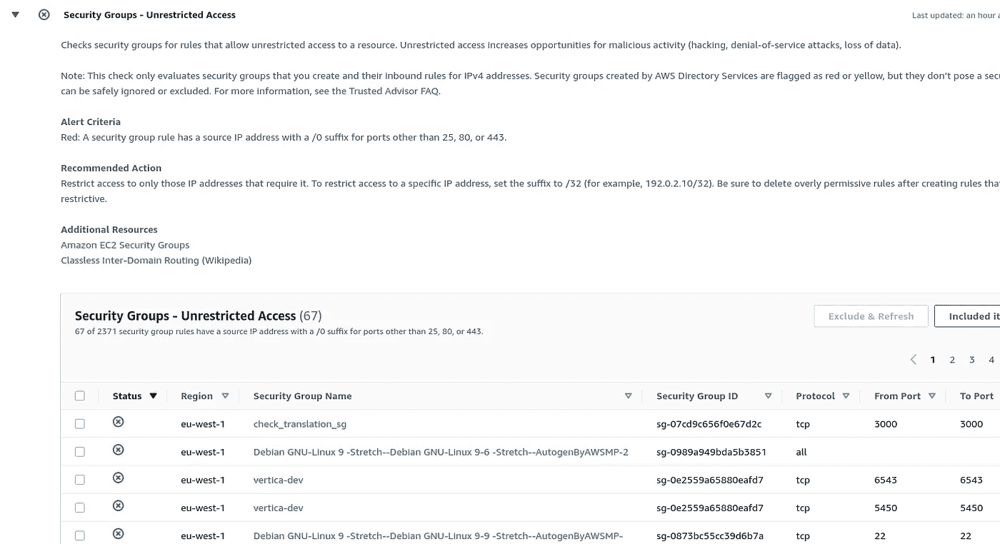

实际上，有一个安全组(SG)可以完全访问互联网:

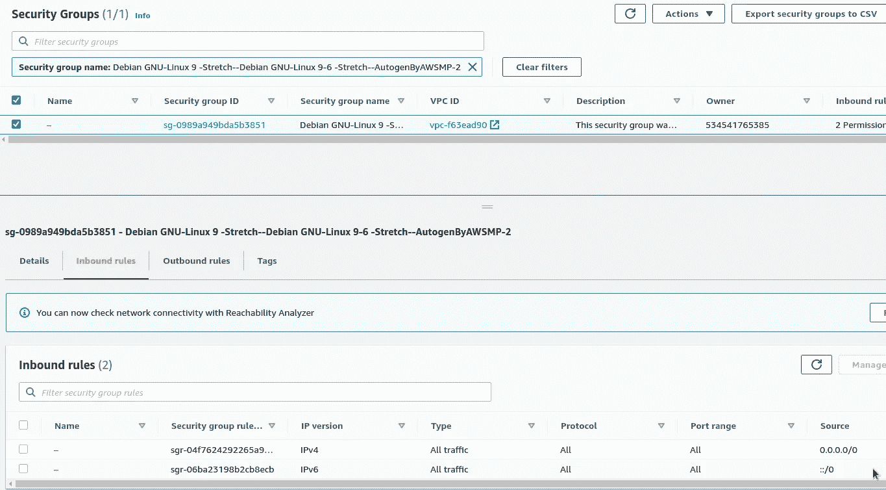

## 如何找到使用特定 AWS SecurityGroup 的资源？

复制一个组的 ID группы，到 *EC2 >* *网络接口*，用这个 ID 寻找接口:

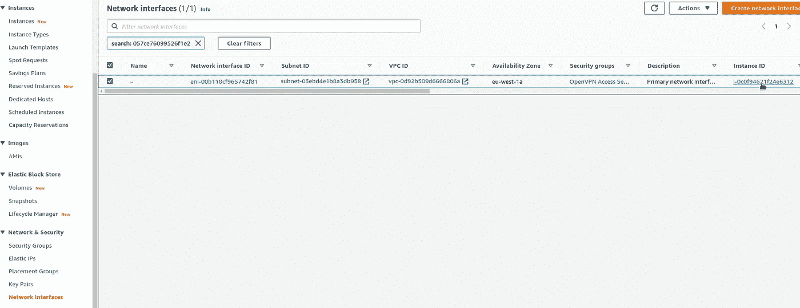

在右侧，您可以看到一个*实例 ID* ，它连接了这个 ENI (AWS 弹性网络接口),以及所使用的安全组。

如果出现“*找不到匹配的网络接口*”错误，则 SG 没有连接到任何资源，因此可以被移除。

此外，一个很好的检查是关于没有配置 SSL 的负载平衡器侦听器:

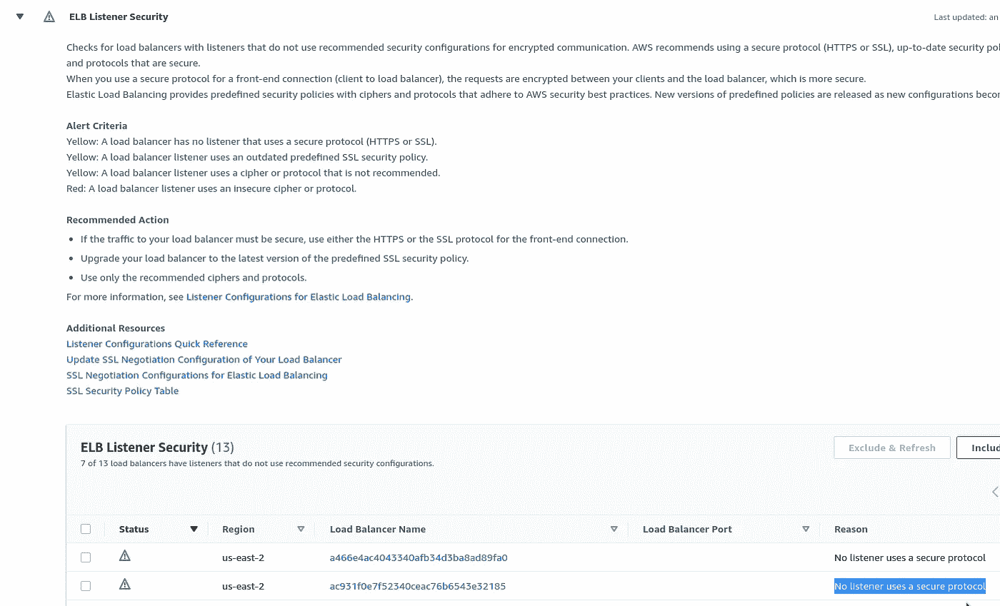

## 容错

这里我们有一些与您的资源稳定性相关的发现:

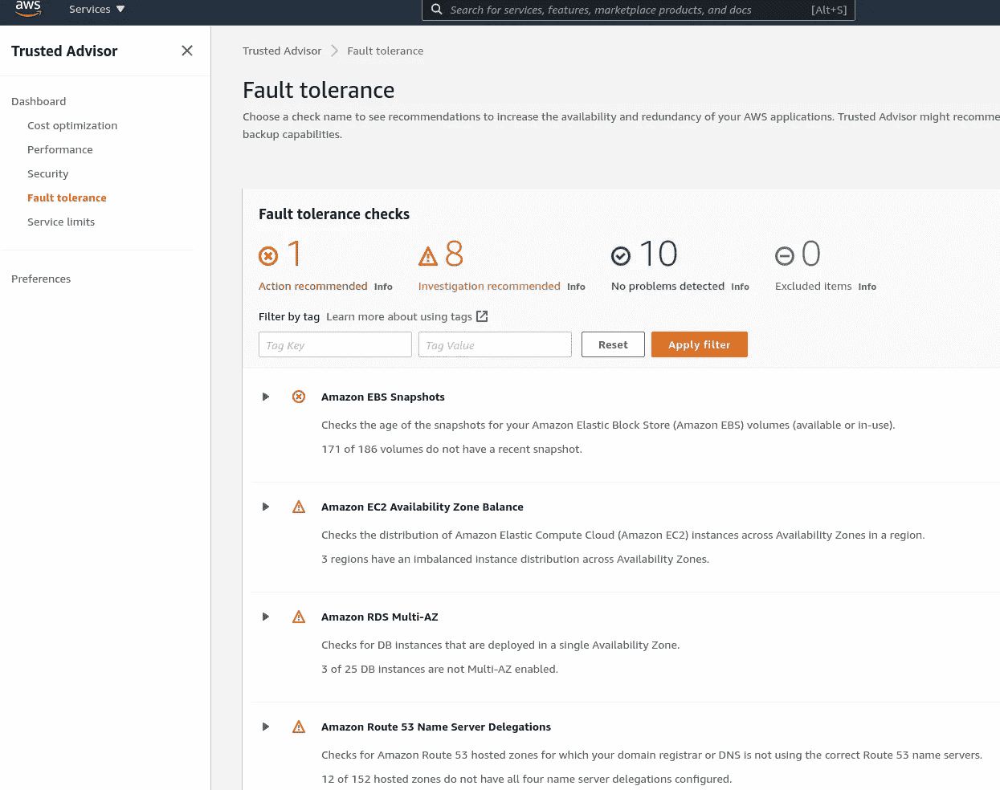

例如，我们将一些 RDS 服务器部署为单个 AZ，而不是部署到几个数据中心:

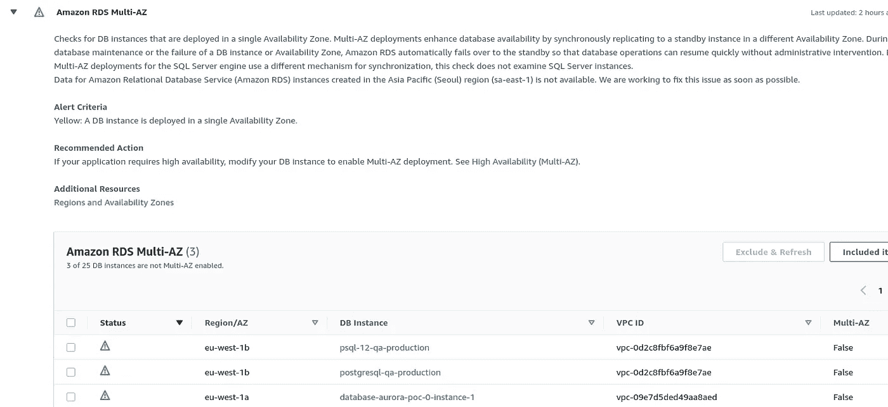

## 服务限制

最后一个类别是*服务限制*，在这里您可以找到关于即将达到或已经达到的 AWS 报价的通知:

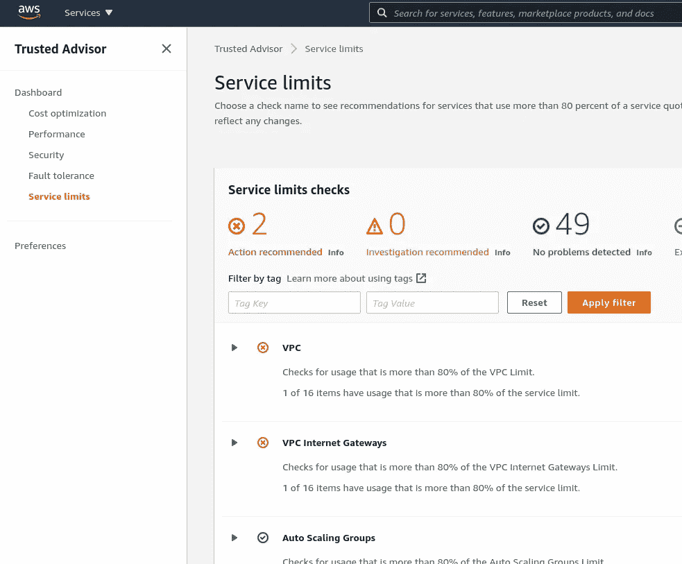

就 VPC 服务配额而言，现在我们被警告说，我们将无法在 *us-east-1* 地区创建新的 AWS VPC:

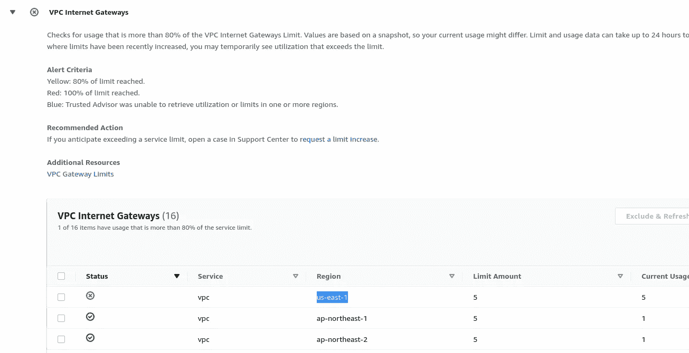

## 偏好；喜好；优先；参数选择

在首选项中，您可以配置要发送的带有最新发现的电子邮件:

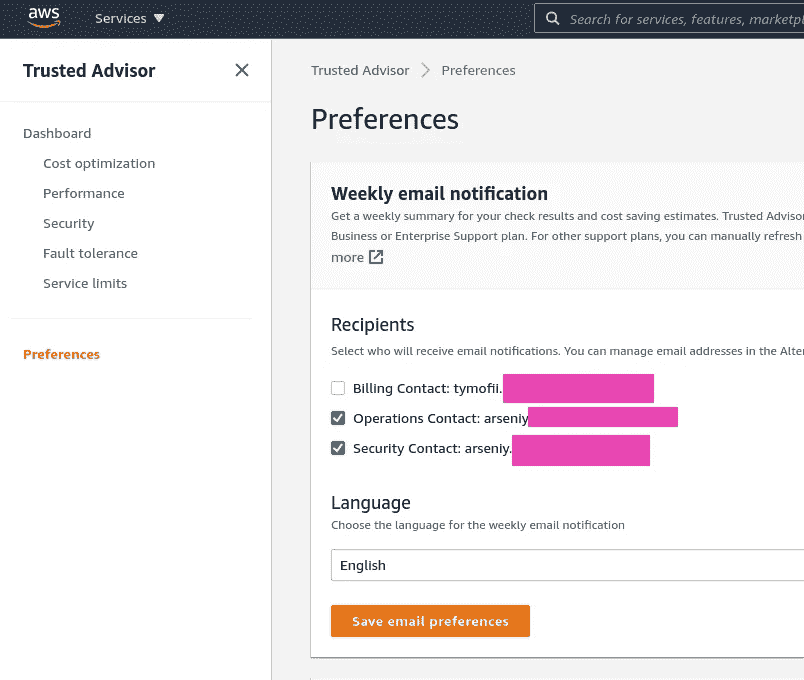

此外，出于监控目的，您可以配置 AWS CloudWatch 警报，并将其通知发送到 Slack 通道。

请在本文的第二部分阅读更多相关内容— [AWS:可信顾问，第 2 部分——cloud watch 警报和松弛通知](https://rtfm.co.ua/en/?p=27384)。

*最初发布于* [*RTFM: Linux、DevOps、系统管理*](https://rtfm.co.ua/en/aws-trusted-advisor-part-1-its-features-overview/) *。*