# AWS:可信顾问，第 2 部分—云监控警报和松弛通知

> 原文：<https://itnext.io/aws-trusted-advisor-part-2-cloudwatch-alarms-and-slack-notifications-95e3213fbadb?source=collection_archive---------2----------------------->


继续 AWS 可信顾问服务的主题，让我们看看如何配置关于新发现的通知。

第一部分: [AWS:值得信赖的顾问，第 1 部分—其功能概述](https://rtfm.co.ua/en/aws-trusted-advisor-part-1-its-features-overview/)。

要获得通知，我们可以使用来自 CloudWatch 的可信顾问指标，在[可信顾问指标和维度](https://docs.aws.amazon.com/awssupport/latest/user/cloudwatch-metrics-ta.html#trusted-advisor-metrics-dimensions)页面上查看它们的列表。

然后，CloudWatch 会发出警报，将它们发送到 AWS 简单通知服务(AWS SNS)。从那里，我们将在 Opsgenie 中获得警报，并从那里将它们转发到一个 Slack 通道。

这个想法是，一旦有人将创建一个向世界开放的 AWS 安全组，就可以迅速得到通知。

因此，在这篇文章中，我们将配置 CloudWatch 警报，并将它们发送到 Slack，并将查看可信顾问如何刷新其数据，以便我们可以每天(或每小时，尽管有一些限制，请参见[可信顾问刷新检查-更新频率](https://rtfm.co.ua/en/?p=27384#Trusted_Advisor_refresh_checks_-_frequency_of_updates)部分)收到通知。

*   [通用配置](https://rtfm.co.ua/en/aws-trusted-advisor-part-2-cloudwatch-alarms-and-slack-notifications/#Opsgenie_configuration)
*   [AWS 简单通知服务配置](https://rtfm.co.ua/en/aws-trusted-advisor-part-2-cloudwatch-alarms-and-slack-notifications/#AWS_Simple_Notification_Service_configuration)
*   [AWS 可信顾问:监控什么？](https://rtfm.co.ua/en/aws-trusted-advisor-part-2-cloudwatch-alarms-and-slack-notifications/#AWS_Trusted_Advisor_what_to_monitor)
*   [CloudWatch 警报配置](https://rtfm.co.ua/en/aws-trusted-advisor-part-2-cloudwatch-alarms-and-slack-notifications/#CloudWatch_Alarms_configuration)
*   [可信顾问刷新检查—更新频率](https://rtfm.co.ua/en/aws-trusted-advisor-part-2-cloudwatch-alarms-and-slack-notifications/#Trusted_Advisor_refresh_checks_-_frequency_of_updates)
*   [可信顾问—手动刷新](https://rtfm.co.ua/en/aws-trusted-advisor-part-2-cloudwatch-alarms-and-slack-notifications/#Trusted_Advisor_-_manual_refresh)
*   [松弛配置中的警报消息](https://rtfm.co.ua/en/aws-trusted-advisor-part-2-cloudwatch-alarms-and-slack-notifications/#Alert_message_in_Slack_configuration)

# Opsgenie 配置

在 Opsgenie 中，让我们创建一个新的 CloudWatch 集成，它将用于 Trusted Advisor 警报。

进入 Opsgenie *设置>集成、*并找到 CloudWatch:

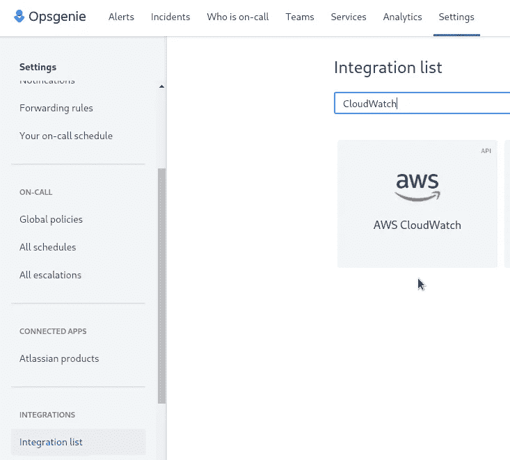

我们把它命名为“*可信安全顾问*”:

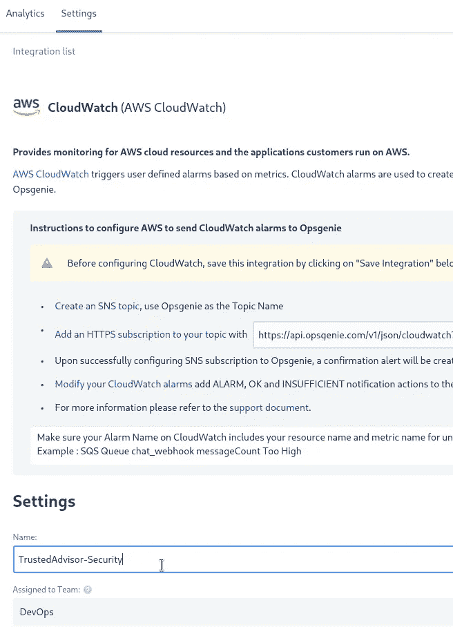

保存它，但我们稍后将回到这里配置宽限消息文本。

# AWS 简单通知服务配置

AWS SNS 需要在弗吉尼亚州的 *us-east-1* 进行配置，因为一些 CloudWatch 指标只能在这里获得，因为它是第一个(afaik)也是最老的 AWS 数据中心。таккакчастьметиикдостукпна此外，我们将在这里配置 CloudWatch 警报。

转到 sns，使用*standard*类型创建一个新主题，将其命名为*ops genie-trusted advisor-security-us-east-1-SNS*—在 SNS 主题的名称中包含一个地区和服务名称似乎是一个好主意:

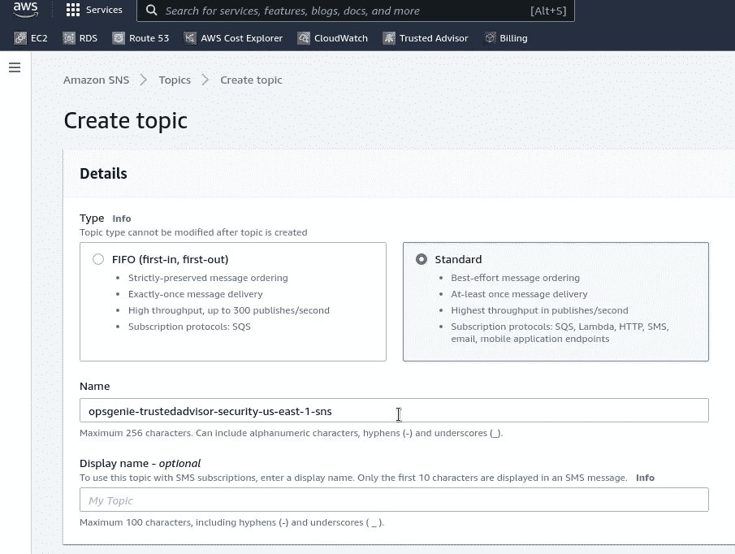

创建主题后，添加订阅:

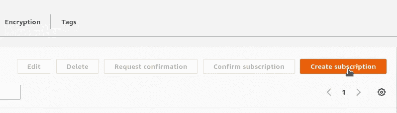

从 Opsgenie 集成中复制 URL:

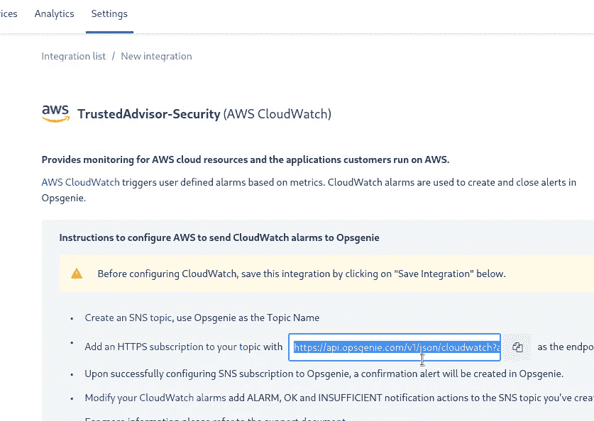

返回到 SNS 订阅，指定*协议* == HTTPS，并插入来自 Opsgenie 的 URL:

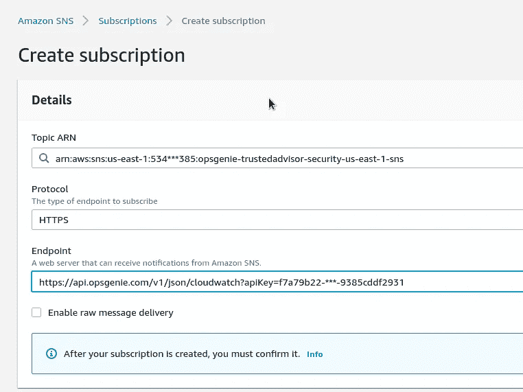

省省吧，我们去看云吧。

# AWS 可信顾问:监控什么？

在本例中，我们将使用*安全组——特定端口无限制*,但一般来说是什么呢？

转到 [AWS 可信顾问检查参考](https://docs.aws.amazon.com/awssupport/latest/user/trusted-advisor-check-reference.html)，检查列表，并选择最适合您的。

至于我，那些支票似乎是最有趣的:

**成本优化**:

*   *亚马逊 RDS 空闲数据库实例*
*   *空载平衡器*
*   *利用率低的亚马逊 EC2 实例*
*   *未关联的弹性 IP 地址*

**性能**:

*   *高利用率亚马逊 EC2 实例*
*   *亚马逊 EC2 到 EBS 的吞吐量优化*

**安全**:

*   *安全组—特定端口无限制*
*   *安全组—无限制访问*
*   *亚马逊 S3 桶权限*
*   *亚马逊 RDS 安全组访问风险*
*   *ELB 安全小组*
*   *暴露的访问键*

这样做时，请记住，所有可信顾问的调查结果都分为三个严重级别:*绿色*、*黄色*和*红色*。

对于*安全组-特定端口无限制*，级别由以下标准确定(仅在可信顾问仪表板中找到):

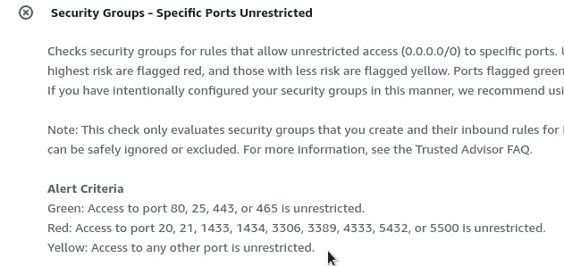

*   绿色:对端口 80、25、443 或 465 的访问不受限制。
*   红色:对端口 20、21、1433、1434、3306、3389、4333、5432 或 5500 的访问不受限制。
*   黄色:对任何其他端口的访问不受限制。

现在，让我们使用红色级别进行警告。

# CloudWatch 警报配置

转到 CloudWatch 警报，创建一个新警报:

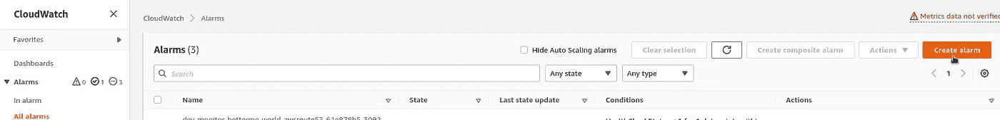

选择指标:

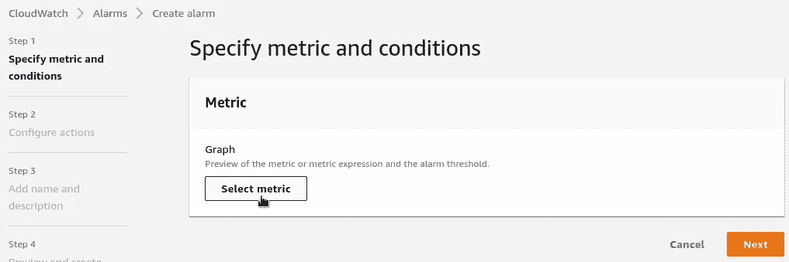

找到一个必要的可信顾问指标，在当前情况下，它将是*安全组—特定端口不受限制—重新分配资源*:

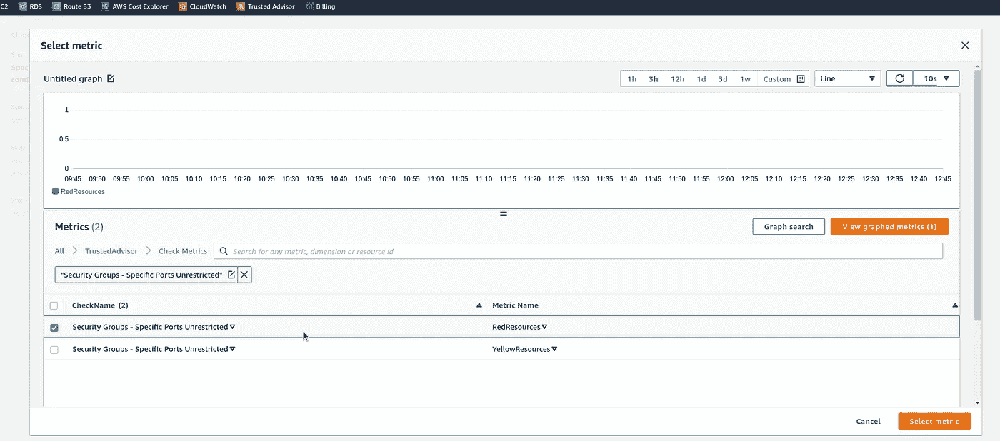

设置何时触发该警报:在统计中使用*简单计数*:

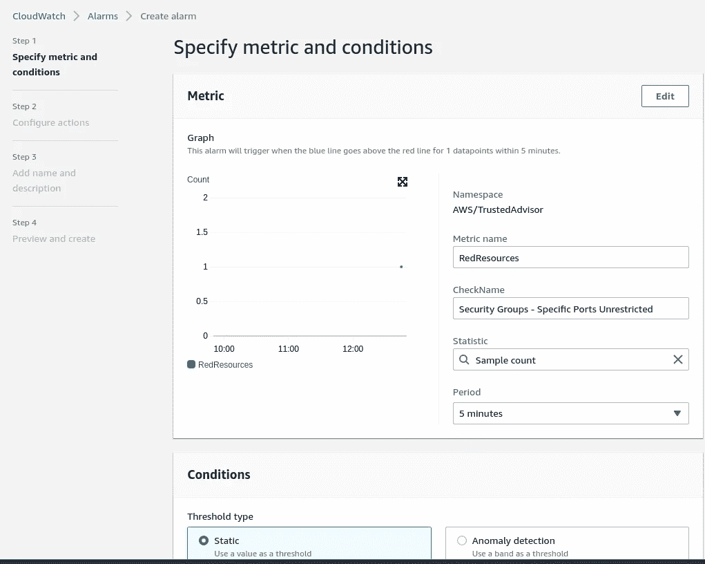

在*条件*中选择*大于/等于*且值为 1，在*附加配置*中设置*将缺失数据视为良好*:

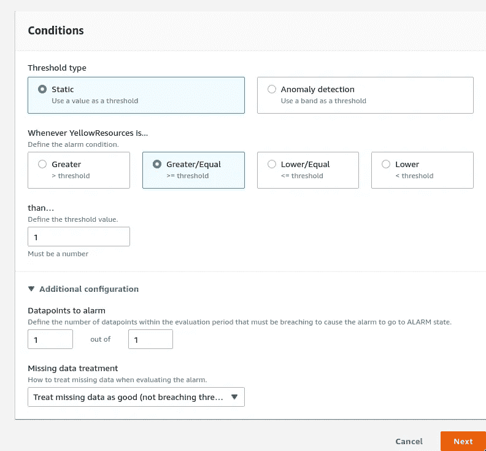

接下来，配置*动作:*向上面创建的 SNS 主题发送通知:

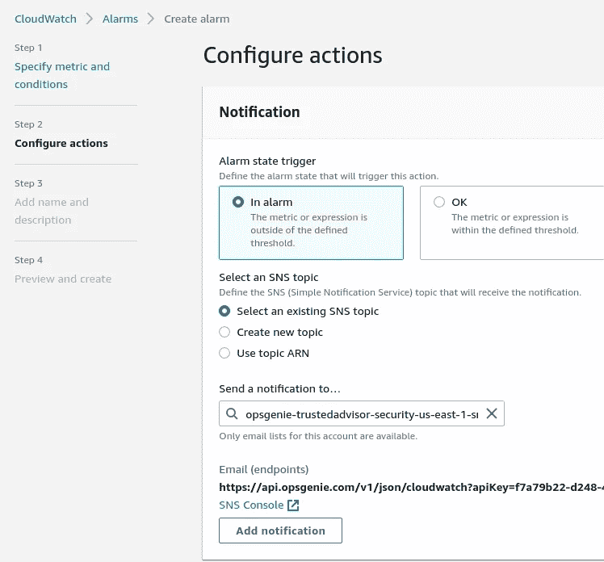

设置警报的名称，也可以选择描述:

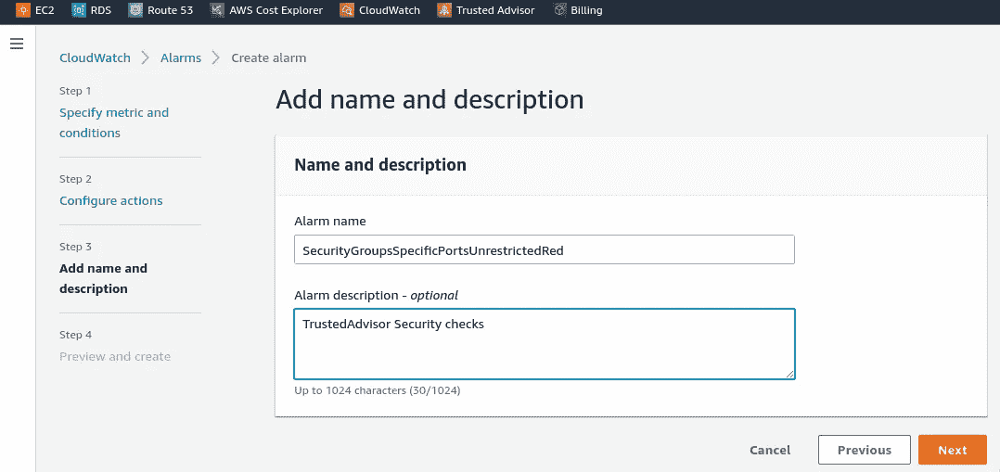

我们来测试一下:使用 Allow 规则从 *0.0.0.0/0* 到端口 3306 创建一个 SecurityGroup，因此它必须触发红色级别:

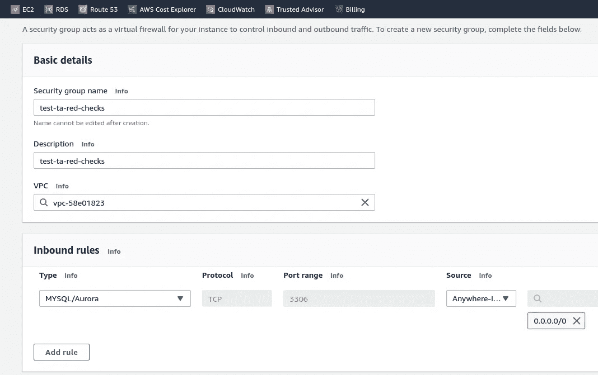

保存新的提醒，并等待提醒…等待…等待…

# 可信顾问刷新检查—更新频率

未触发警报的原因是 Trusted Advisor 刷新其数据的频率:有些检查是自动更新的，有些是在您访问其仪表板或通过 AWS API 或 AWS CLI 时更新的。

在我们当前的案例中，让我们检查一下[安全组的文档—特定端口无限制](https://docs.aws.amazon.com/awssupport/latest/user/trusted-advisor-check-reference.html#security-groups-specific-ports-unrestricted)检查:

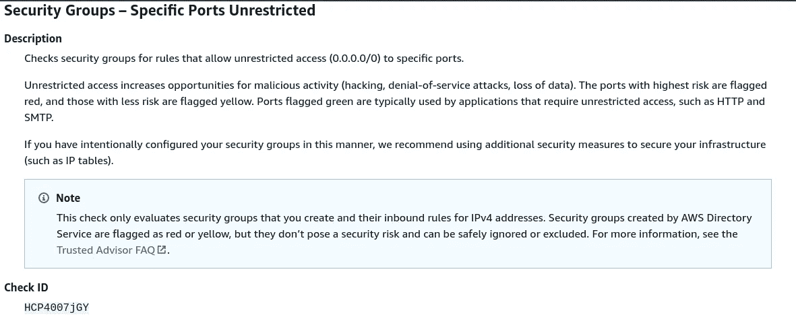

在这里我们看不到任何关于*的刷新。*但是——你可以看到**检查 ID**——我们很快就会用它来手动更新检查。

但是对于亚马逊 RDS 公开快照，你会发现它每天会自动刷新几次，你不能手动触发它的更新:

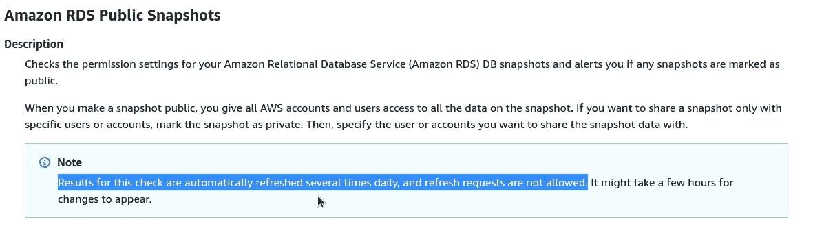

## 可信顾问—手动刷新

要运行手动刷新，我们可以:

1.  只需打开 TrustedAdvisor 仪表板并展开[安全组—特定端口无限制](https://docs.aws.amazon.com/awssupport/latest/user/trusted-advisor-check-reference.html#security-groups-specific-ports-unrestricted)
2.  可以使用`[RefreshTrustedAdvisorCheck](https://docs.aws.amazon.com/awssupport/latest/APIReference/API_RefreshTrustedAdvisorCheck.html)` API 调用
3.  或者使用 AWS CLI 和`[refresh-trusted-advisor-check](https://docs.aws.amazon.com/cli/latest/reference/support/refresh-trusted-advisor-check.html)`命令

让我们尝试使用 CLI —使用上面的命令，将 AWS 区域指定为 *us-east-1* (N. Virginia，我们发出警报的地方)，并在`--check-id`中设置上面提到的 id(同样，您可以使用`[aws support describe-trusted-advisor-checks](https://docs.aws.amazon.com/cli/latest/reference/support/describe-trusted-advisor-checks.html)`命令获得 ID):

```
$ aws --region us-east-1 support refresh-trusted-advisor-check --check-id HCP4007jGY
{
  “status”: {
    “checkId”: “HCP4007jGY”,
    “status”: “enqueued”,
    “millisUntilNextRefreshable”: 3599991
  }
}
```

*enqueued* 状态意味着刷新请求被接受，您将在几分钟后看到结果。

如果`status`字段有“*成功*”值——那么它是最近刷新的，你必须等待`millisUntilNextRefreshable` (3599990 ms == 60 分钟)。

最终，我们得到了警报:

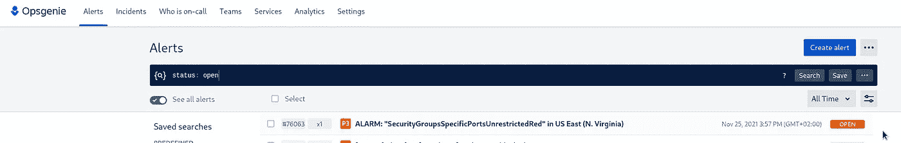

以及松弛信道中的消息:

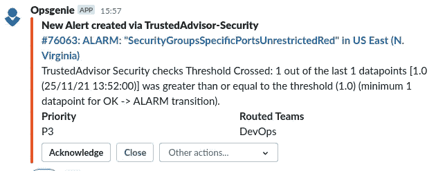

# 松弛配置中的预警消息

上面消息中的文本现在没有用了——我们只看到它被触发了。

让我们在这里添加一些信息—转到松弛时间集成设置，单击*高级*:

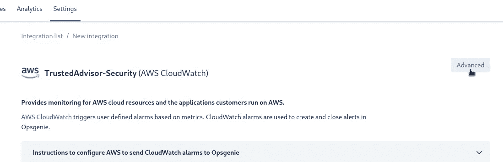

并设置您希望在那里看到的数据。例如，我添加了两个链接，分别指向文档和可信顾问的控制面板:

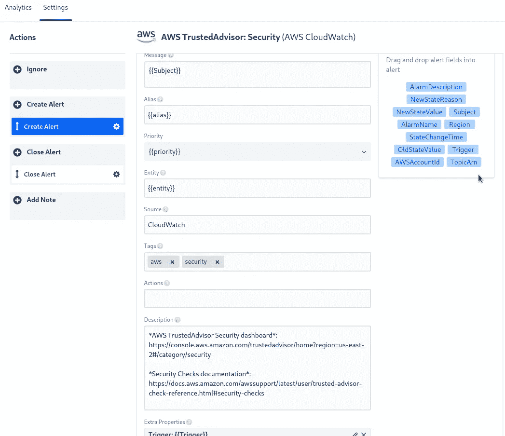

再次运行检查:

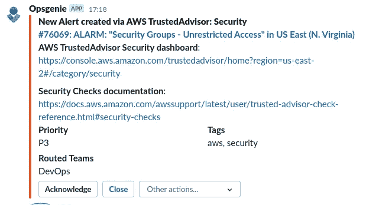

完成了。

*最初发布于* [*RTFM: Linux、DevOps、系统管理*](https://rtfm.co.ua/en/aws-trusted-advisor-part-2-cloudwatch-alarms-and-slack-notifications/) *。*