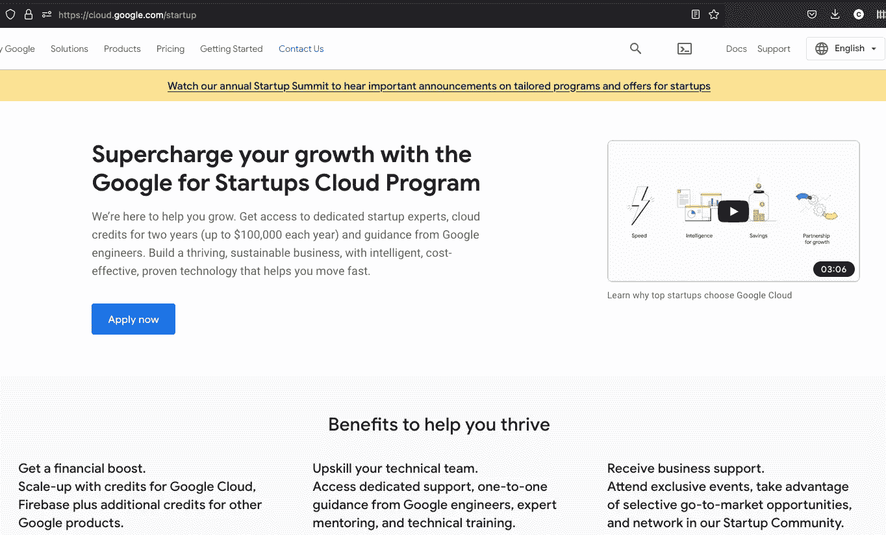
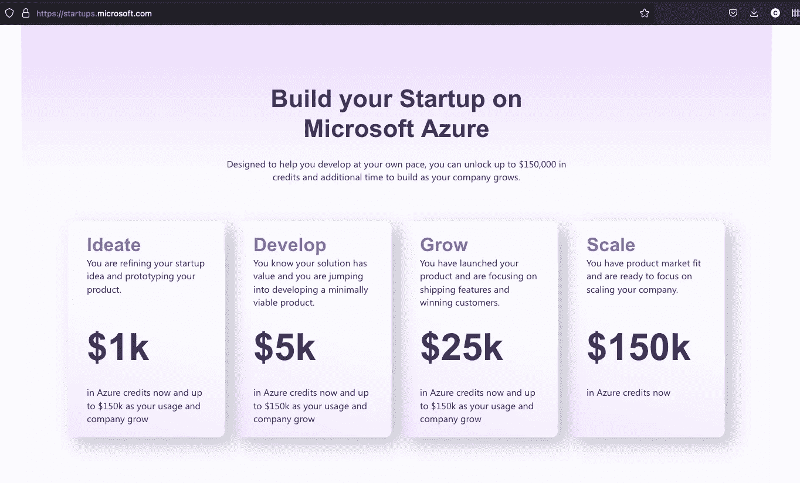
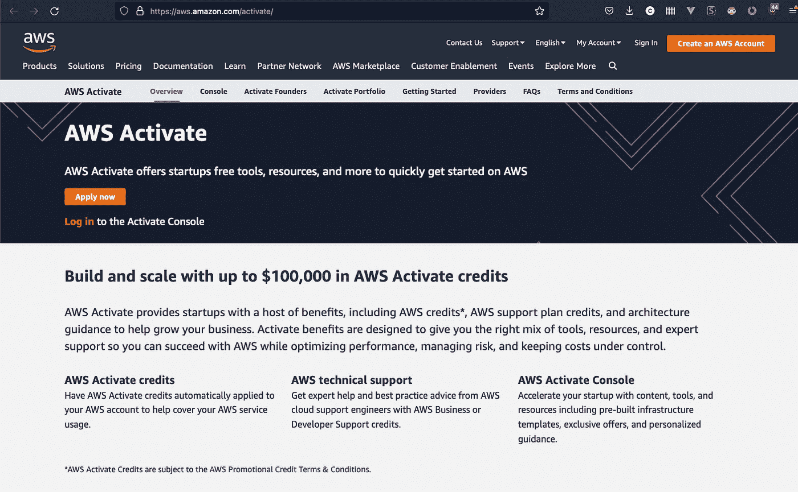
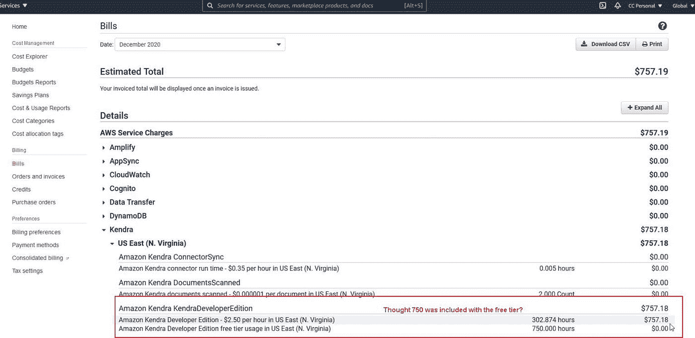
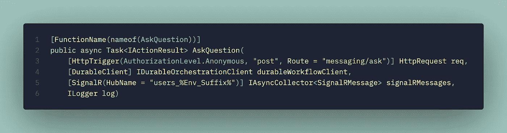
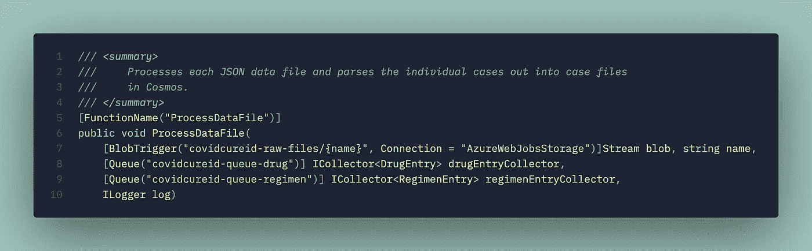
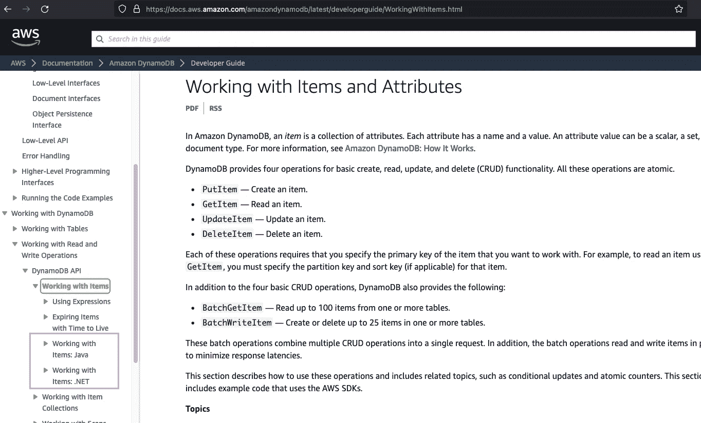
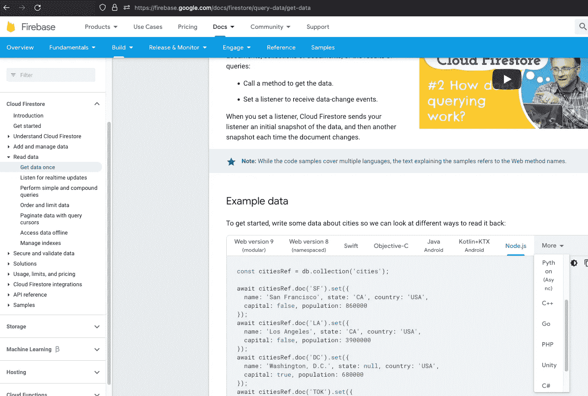
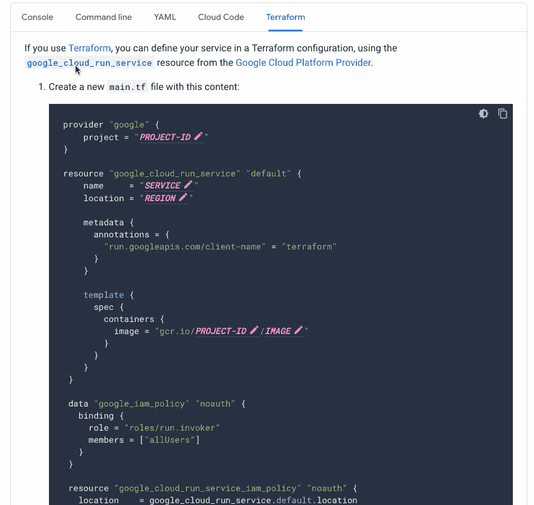
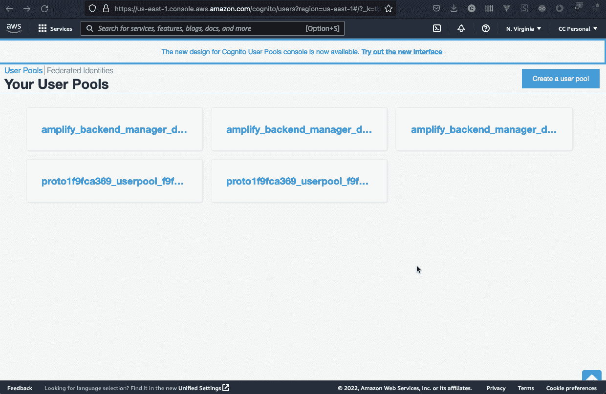

# SaaS 初创公司的 AWS vs Azure vs Google Cloud 第 1 部分

> 原文：<https://itnext.io/aws-vs-azure-vs-google-cloud-for-saas-startups-part-1-ce2f1b9aa78b?source=collection_archive---------0----------------------->

我花了一年时间与一家生命科学公司的初创公司合作，该公司向一家 YCombinator 初创公司提供了 1 亿美元的 C 轮融资，这家公司在一个月内为一家获得融资的初创公司增加了 100 万美元的 ARR。

通过这次旅程，我有机会探索和构建所有三个主要的云提供商，并在此过程中吸取了一些经验教训，并形成了自己对寻求正确平台的早期创业公司的偏好和建议。

每个公司和每个领域都是不同的，但三大云提供商的产品存在客观差异，选择正确的产品可以显著提高初创公司在寻找产品市场适应性方面的迭代能力。

# 我对 SaaS 创业公司的排名

当从 10，000 英尺的角度来看这些平台时，没有足够的粒度来发现差异，很容易认为平台之间存在对等性。有无数的图表和帖子讨论服务和产品如何在这些提供商之间映射，但这是 ***而不是*** 的帖子之一。

在亲身体验过这些平台后，现实是它们之间存在许多基础差异，这些差异可能会对初创公司的速度和轨迹产生长期影响。我现在也有机会与前亚马逊工程师一起工作，深入了解亚马逊作为一个技术组织以及它如何影响 AWS 产品。

考虑到这一点，以下是我对 SaaS 初创公司三大云平台的排名:

1.  谷歌云(GCP)
2.  微软 Azure
3.  亚马逊网络服务(AWS)

我们将从三个关键方面研究这些平台，以帮助决定哪种云适合给定的团队。

1.  财务收益
2.  易用性
3.  各平台核心实力( [**第二部分**](https://chrlschn.medium.com/aws-vs-azure-vs-google-cloud-for-saas-startups-part-2-342e8e183e08) )

让我们来探讨为什么以及何时创业公司应该考虑这些平台。

# 财务收益

谷歌云和微软 Azure 都为初创公司提供了丰厚的福利。

[**谷歌提供*两年高达 10 万美元的信用额度(总计 20 万美元)*作为其谷歌创业云计划**](https://cloud.google.com/startup) 的一部分。

从市场份额的角度来看，谷歌位居第三，为吸引 SaaS 初创公司提供了最慷慨的财务优惠。

[**微软提供高达 15 万美元的信贷，作为其微软创业计划的一部分**](https://startups.microsoft.com/) 。

微软在初创公司的整个生命周期中提供贷款，贷款额度随着公司的成熟和成长而增长。

[**AWS 也提供了启动程序**](https://aws.amazon.com/activate/) ，但以**【100k 美元**(感谢 [**u/seijulala**](https://www.reddit.com/r/programming/comments/vlw7m7/comment/ie1hr9t/?utm_source=share&utm_medium=web2x&context=3) )位列第三:

AWS Activate 为成立不到 10 年的初创公司提供 10 万美元的信贷。

这里明显的赢家是谷歌，它有 20 万美元的信用额度，紧随其后的是微软。对于早期创业公司来说，不必担心数千美元的花费可能是一个很大的提升，允许创业公司进行实验。

我还发现，微软和谷歌在许多服务上都有非常好的真正免费层，而对于 AWS，人们似乎必须对“免费”层服务的使用更加警惕

恰当的例子是 AWS Kendra，它有一个包含一个索引的自由层，但允许您创建多个索引，甚至在自由层中。想象一下，当我有一天醒来看到一张 750 美元的 AWS 账单时，我有多惊讶:

我发现自己对 AWS 的“免费”层产品比谷歌或 Azure 更加警惕。这是我在实验肯德拉时收到的一份惊喜账单

换句话说，AWS“免费”层中的许多产品更像是免费试用，而 Azure 中用于认知服务的免费层——例如——是完全免费的，只是在规模上有简单的限制。

公平地说，AWS 支持团队在我与他们联系后恢复了收费，但如果免费层产品在限制使用方面更加明确，似乎会更好。

# 易用性

对于寻求产品市场契合度的初创公司来说，保持简单、愚蠢(KISS)至关重要，原因如下:

1.  实验和尝试不同的方法会减少风险和摩擦。
2.  它允许团队在每次迭代中快速调整技术和架构。
3.  较少的选择使评估和选择正确的技术解决方案变得更加容易
4.  随着团队的发展，新工程师的加入变得更加容易。

出于这个原因，特别是对于没有工程经验的广度和深度的年轻团队来说，我认为谷歌再次领先，微软紧随其后，AWS 远远落后。

事实上，我实际上认为，由于平台的复杂性和缺乏“一致性”以及明显的默认，那些尚未拥有具有丰富 AWS 经验的工程师的初创公司选择 AWS 将自己置于不利地位。

## 资源容器

Google 和 Azure 与 AWS 最明显的区别之一是，Google 和 Azure 都提供了帐户下资源容器的概念。

在谷歌，这些是“项目”。在 Azure 中，这些是“资源组”。在 AWS 中，只有帐户。帐户级别下缺少资源容器实际上造成了管理权限和创建沙箱实验的摩擦。

虽然这似乎是一个微不足道的区别，但管理这些容器的访问和控制要比在 AWS 中管理帐户容易得多。当您尝试使用 Terraform 或 Pulumi IaC 部署时，可以更容易地删除整个资源容器，并且只需很少的时间和精力。

相比之下，AWS 中帐户下缺少资源容器意味着要么删除帐户，要么在试验时需要非常系统地清理。

诚然，CloudFormation 堆栈应该在理论上自我清理(在实践中并不总是如此)，但对于处于高度实验阶段的初创公司来说，通常情况下，实验一些新组件的最简单方法是在 web 控制台上手动设置它，而不是默认使用 CloudFormation 或 Terraform。

此外，我发现当使用任何 AWS 自动化(CloudFormation 或 CDK)部署时，AWS 在清理 CloudWatch 日志方面尤其糟糕，这让人有点担心可能错过了更昂贵的东西！

## **适应性和灵活性**

在这三者中，我认为 AWS 为任何比较平台行为提供了三个平台中最低层次的抽象。对于有经验的 AWS 工程师来说，这提供了更多的控制和微调系统交互。但是对于不熟悉 AWS 的创业公司来说，这就造成了复杂性。在许多情况下，可以在 Google 或 Azure 上“开箱即用”完成的工作需要编写和部署 Lambda 以及其他层(IAM、路由、网络)来获得所需的行为。

事实上，AWS 有如此多的*【连接复杂性】*，以至于有几层工具*只是为了通过包装通用抽象和模式*来使 AWS 可用*。*不包括 Terraform 和 Pulumi 等跨平台解决方案，我认为至少有:

1.  云的形成
2.  云开发套件(CDK)
3.  无服务器框架
4.  无服务器应用模型
5.  [副驾驶](https://aws.github.io/copilot-cli/)(不要与 GitHub 副驾驶混淆)
6.  增强

虽然人们可能不认为后两者是部署工具，但我认为它们是重新包装 AWS 基础设施复杂性的方法，使其更容易接近，因为否则，为 Copilot 和 Amplify 提供的抽象构建解决方案是 AWS 上一项极其复杂的工作。 *Copilot 和 Amplify 正在有效地生成 CloudFormation 堆栈，这些堆栈抽象了在 AWS* 中使用低级范例的连接复杂性。

另一个例子是在三个平台上使用托管的 Kubernetes。 [**在我的 Dapr**](https://charliedigital.com/2021/07/01/dapr-and-azure-functions-part-1-hello-world/) 系列实验中，我有机会在所有三个平台上使用 Kubernetes，很明显 AWS 感觉最脱节，需要使用第三方工具 [**ekstcl**](https://eksctl.io/) (在 AWS CLI 和`kubectl`之上)使其可用。相比之下，Google CLI 和 Azure CLI 在与平台的托管 Kubernetes 功能进行交互时，感觉更完整、更有凝聚力。

与 Google 的 TypeScript 和 Azure 的 C#相比，AWS 中的低级抽象就像是在 C++中工作。与 TypeScript 或 C#相比，C++提供了更多的功能、控制和范围，但另一方面，它也需要更深入的编程底层知识，如内存管理。

这种复杂性降低了团队的适应性和灵活性，因为即使是架构上的微小变化也需要大量的投资来改变通常错综复杂的部署模型，而缺乏资源容器的实验使这变得更加困难。

## 降低认知负荷

在三家云提供商中，谷歌在构建特定功能方面的选择最少，而 AWS 似乎有最多的选择。

这是 AWS 战略的一部分，为每个利基市场提供解决方案。但这也造成了很多认知负荷，当试图找出哪个平台解决方案用于特定的任务时。

这也意味着 AWS 上的每个解决方案都有限制和差距，这些限制和差距本应由其他解决方案来弥补，这就产生了远期风险，因为在更进一步之前，通常很难确定哪些限制是重要的。相比之下，谷歌云产品感觉更完整，考虑更周全(也许是后发优势)。

例如，webhooks 现在是构建异步系统集成的普遍方式。处理 webhooks 时，一个非常常见的用例是需要对传入的 webhook 消息进行排队，并迅速向源返回一个 HTTP 200，同时在稍后的时间带外消耗有效负载。

在 GCP，这是用谷歌云发布/订阅非常优雅地完成的。虽然 AWS SQS 和 SNS 也可以做到这一点，但不同的是 [**Pub/Sub 内置了 HTTP 推送订阅模式**](https://cloud.google.com/pubsub/docs/push) ，这看起来*很符合逻辑*。不需要像 SQS 那样编写后台工作器来提取消息或引入另一个基础设施，队列的使用可以作为另一个 HTTP API 端点来完成，由发布/订阅处理 HTTP 推送。

Azure 用 [**为 Azure 函数**](https://docs.microsoft.com/en-us/azure/azure-functions/functions-triggers-bindings?tabs=csharp) 提供的广泛绑定巧妙地解决了这个问题。这些绑定是 Azure 的真正明星，它们使云基础设施的连接像组装乐高积木一样简单。

这个例子展示了我们如何通过使用属性来连接三个独立的 I/O 端点。

在上面的例子中，我连接了:

1.  HTTP 触发输入
2.  长期运行的工作流程编排
3.  到调用者的实时 web 套接字信令通道

我这样做既不用担心 IaC，也不用学习连接这三个通道的特殊部署抽象。这是到目前为止团队考虑 Azure 的最好理由之一，因为它使移动和处理数据变得如此容易。

下面是我的 CovidCureID 项目 中的另一个例子，它展示了这一点:

Azure 函数如何“堆叠”I/O 和流畅地移动数据的另一个例子。

在这种情况下，我突然想到:

1.  存储 blob 更新时的入站触发器。
2.  两个出站队列对传入的 JSON 执行两种不同的转换。

相比之下，在 AWS 中做同样的事情需要使用 EventBridge(除了 SQS 和 SNS 之外),或者编写和部署 Lambdas 以转发到 HTTP 端点。当然，也可以使用 Lambdas 中的消息，但是接下来的决定是[**选择实现 Lambda 三部曲模式中的哪一个**](https://github.com/cdk-patterns/serverless/blob/main/the-lambda-trilogy/README.md) 。更不用说 SNS 和 SQS 是 AWS 中两个不同的服务，而 Google Pub/Sub 和 Azure Service Bus 逻辑上将这些功能打包成一个服务。教训是，当从一开始就寻找路径时，AWS 中的复杂性层并不总是显而易见的，这有一种倾向，我只能将它描述为 AWS 中的“蔓延”。

部署一个看似简单的解决方案来解决 webhook 消息排队和在 AWS 中用 HTTP API 端点处理它们的简单问题，将需要至少 4 个服务(Lambda、API 网关( [**在 Lambda 函数 URL 于 4 月**](https://aws.amazon.com/blogs/aws/announcing-aws-lambda-function-urls-built-in-https-endpoints-for-single-function-microservices/) )发布之前)、SQS 和 SNS)几十行 CDK 或无服务器框架 YAML(可能还有 ***几百行原始云信息🤣)!***

## 入职的便利性

能够让新工程师快速进入一个平台对一家初创公司来说至关重要，因为随着团队的增长，这可以减少在获得新资源时产生的阻力。鉴于一名工程师对特定平台没有经验，我自己的观察是，让新工程师加入谷歌和 Azure 比加入 AWS 容易得多。

这有三个原因:

1.  GCP 和 Azure 拥有比 AWS 更好、更有凝聚力的文档。
2.  GCP 和 Azure 的浏览器控制台界面比 AWS 更具凝聚力(尽管亚马逊团队一直在努力缩小这一差距)。
3.  GCP 和 Azure 有更好的自由层选项，可以让新工程师在沙盒环境中体验(如上所述)

关于第一点，我注意到的一件事是 AWS 和微软倾向于按语言划分他们的文档:

在这个使用 DynamoDB 的例子中，您可以看到文档是按照语言进行分离的。并不是所有的文档都是这样组织的，但是大部分都是这样。

相比之下，谷歌的文档一般是这样组织的:

所有语言并行的云 Firestore Google 文档

这种并行方法的一个主要好处是，开发人员可以通过并行查看示例，将概念与现有的语言知识联系起来。

另一个优势是，对于多语言团队，您可以并排查看 SDK，以确定哪个感觉更符合任务的人体工程学。

谷歌文档的另一个非常好的特点是*它对部署方法*做了同样的事情，因此也可以比较部署方法(摘自 [**谷歌云运行的文档**](https://cloud.google.com/run/docs/deploying#terraform) ):

请注意 Google 文档是如何允许将部署模板化为您的参数的。

谷歌提供的 Terraform 模板样本对于那些正在摸索产品市场适应性的初创公司来说是一个巨大的胜利。

关于第二点——内聚的控制台界面——谷歌和 Azure 在每个服务的 web 控制台之间都有一个共同的设计语言，这使得在学习了如何通过控制台的菜单导航之后，弄清楚如何与服务交互(无论你是否是 Azure 控制台的粉丝，至少它是一致的)是明智的。

另一方面，AWS 反映了其更加脱节的团队的性质。直到最近，Cognito 可能是这方面最恶劣的罪犯之一，其用户界面似乎是由一些实习生在 21 世纪中期设计的:

即将退役的 Cognito 界面。无可奉告…

如果没有亲身体验平台和服务，所有这些细节都不一定显而易见，但在经历了所有三个第一手构建现实世界的解决方案后，很明显，谷歌和 Azure 可能会更容易用于大多数 SaaS 初创公司构建 API 和 web 服务。

在第一部分中，我已经分享了一些客观的方法，在这些方法中，我认为 Google 和 Azure 是早期创业公司的更好选择，它们仍然通过提供更多免费积分和更容易使用的平台来寻求产品市场适应性。

我自己这边——hustle—**[**turas . app**](https://turas.app)—坐在 Google Cloud 里。**

**这些好处可以极大地改变一个小型创业公司的发展轨迹，当然是通过为团队提供更多的资金，但与在 AWS 上创业相比，也有更多的灵活性和速度。这并不是说初创公司*不能*在 AWS 上取得成功——很明显，历史表明情况并非如此——而是因为 GCP 和 Azure 现在提供了具有更好人体工程学的竞争平台，选择 GCP 或 Azure 可以减少 AWS 遇到的复杂性和蔓延，这可能会积累并阻碍初创公司的速度。**

**在 [**第二部分**](https://chrlschn.medium.com/aws-vs-azure-vs-google-cloud-for-saas-startups-part-2-342e8e183e08) 中，我将探讨我认为每个平台的核心优势，以及早期创业公司何时应该选择一个平台。**

**如果您想在它发布时得到通知，请订阅！**