# SaaS 初创公司的 AWS vs Azure vs Google Cloud 第二部分

> 原文：<https://itnext.io/aws-vs-azure-vs-google-cloud-for-saas-startups-part-2-342e8e183e08?source=collection_archive---------1----------------------->

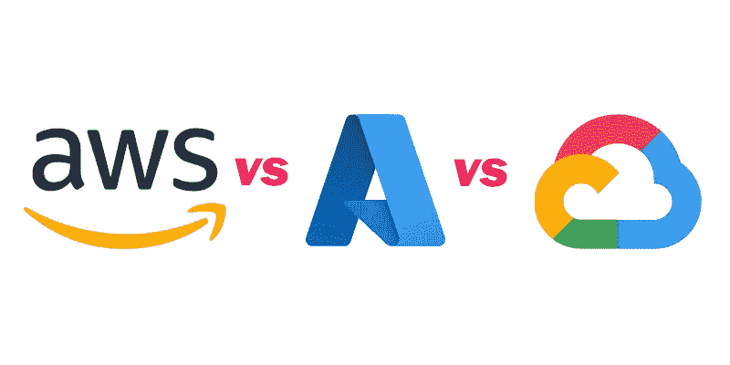

[**在本系列**](/aws-vs-azure-vs-google-cloud-for-saas-startups-part-1-ce2f1b9aa78b) 的第 1 部分，我谈到了为什么对于团队中还没有深厚的 AWS 专业知识的 SaaS 创业公司来说，AWS 可能不是最佳选择，以及为什么我个人认为 Google Cloud 和微软 Azure 更适合缺乏深厚技术经验、想要快速迭代的创业公司。

不要误解我的意思:对于团队已经精通 AWS 的创业公司来说，AWS 是必由之路。但我从自己的旅程中学到的是，初创公司面临的最大挑战之一是最大限度地降低复杂性，这可能会妨碍团队的敏捷性和速度，而在 AWS 中，复杂性往往更高。

在第二部分中，我将探讨我认为每个平台真正的亮点，以及为什么早期创业公司应该考虑一个平台而不是另一个:

1.  **AWS** —生态系统、与开发者的接触、更广泛的社区支持和杰出的技术
2.  Azure —功能、静态 Web 应用、工具集成和最佳自由层
3.  **GCP** —发布/订阅/云任务/云调度器、容器和 Kubernetes

不幸的是，尽管这些平台如今非常广泛，但我无法对我没有亲身体验过的服务发表评论。而在某些情况下，服务只是略有不同。例如，所有三个平台都有图像识别服务，在我的使用中，没有一个真正表现得特别好。如果我的见解显得异乎寻常地简单，那是因为它专注于构建 SaaS 应用程序和 API 的核心，这是我个人在所有三种云上工作过的地方，也是平台真正脱颖而出的地方。

如果您有跨这些云使用其他功能的经验(例如 ML、大数据)，请留下评论！

# 自动警报系统

从这个系列的第一部分开始，你可能会认为我*根本不会*推荐 AWS 然而，事实并非如此。

事实上，AWS 有几个方面是 GCP 和 Azure 无法比拟的。

## 生态系统

AWS 最强的一个案例是，它拥有最大的第三方生态系统，同时也拥有最大的市场份额。一个非常好的例子是[**local stack**](https://localstack.cloud/)**，它提供了一个几乎*全功能的*AWS 克隆，您可以在本地运行。这使得 CI/CD 和本地开发体验等活动在 GCP 或 Azure 上无法匹敌。**

**相比之下，Azure CosmosDB [**仍然缺乏一个可以在苹果 M1 硬件**](https://github.com/MicrosoftDocs/azure-docs/issues/77408) **上运行的本地仿真器。**虽然微软有类似于 [**Azurite**](https://docs.microsoft.com/en-us/azure/storage/common/storage-use-azurite?tabs=visual-studio) 的工具，模拟了部分堆栈，但它真的不是 LocalStack 的对手 LocalStack 只能存在于有足够大的客户群来支持这样一个工具的地方。**

**用于本地仿真的 AWS 第一方工具通常也更完整。能够在 CI/CD 中运行[**dynamo db 模拟器**](https://docs.aws.amazon.com/amazondynamodb/latest/developerguide/DynamoDBLocal.DownloadingAndRunning.html) 并运行完全集成测试是一个巨大的胜利。**

**在 GitHub 中搜索 AWS、Azure 和 GCP 会得到以下结果:**

**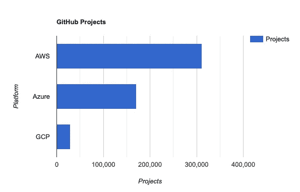**

**截至 2022 年 6 月底**

**AWS 项目的数量——尤其是第三方商业和开源项目——是其市场先发优势和主导地位的副产品。**

## **接触开发人员**

**由于 AWS 拥有如此大的市场份额，团队也更有可能找到拥有 AWS 经验而不是 Azure 或 GCP 经验的开发人员，这取决于 AWS 相对于后者的成熟度。**

**对于初创公司来说，这意味着当需要扩大团队规模时，选择 AWS 可能是一个很大的好处，因为可以从更大的经验丰富的工程师库中进行选择。**

**在 LinkedIn 上搜索 AWS、Azure 和 GCP 的职位会得到以下结果:**

**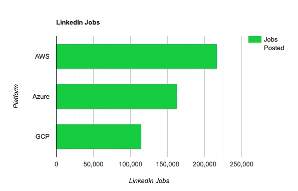**

**GCP 的结果包括搜索“GCP”和“谷歌云”**

**很明显，有更多的需求，直觉上有更多有 AWS 经验的工程师。**

## **更广泛的社区支持**

**因此，你也会找到更广泛的社区支持。在 StackOverflow 上，搜索标签`[aws]`、`[azure]`和`[gcp]`会产生以下结果:**

**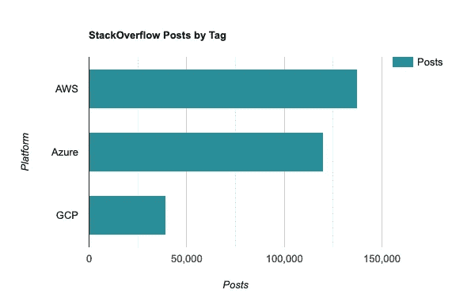**

**很明显，AWS 只是被更广泛地采用**

**这很难说是科学探索，但它清楚地反映了与 AWS 相比，GCP 开发者社区较小，即使 GCP 有一些帮助初创公司快速发展的真正伟大的功能。**

## **杰出技术**

**不仅仅是生态系统和市场份额，AWS 也有一些技术瑰宝，作为为每个利基市场提供解决方案的哲学的一部分。**

**例如，尽管 Lambda 缺乏像 Azure 函数这样的高级抽象，但在三个无服务器函数运行时 中， [**的冷启动时间最短。对于对冷启动敏感的用例，Lambda 是提供最高性能的最佳解决方案。如果你对 C#和。净，**](https://mikhail.io/serverless/coldstarts/big3/) **[**AWS。NET Annotation Lambda Framework**](https://aws.amazon.com/blogs/developer/introducing-net-annotations-lambda-framework-preview/)取 Azure 函数 DX 的一小部分，带到 Lambda。****

**[**AWS 是三大巨头中唯一一个拥有 AppSync**](https://docs.aws.amazon.com/appsync/latest/devguide/what-is-appsync.html) 托管 GraphQL 服务的，很难不被在其上构建*一些真正粗糙的东西*的潜力所吸引。AppSync 允许团队有效地创建无服务器、无 API 的 GraphQL 端点，该端点可以通过使用 HTTP 解析器将后端访问*抽象为任何内容*(尽管您必须熟悉笨拙的 Apache Velocity 模板语言才能充分利用它)。它甚至可以直接访问 DynamoDB、S3 和 Lambda，根本不用编写任何 API 层！AppSync 对于构建无服务器应用的团队来说是一块被低估的宝石，但它的复杂性悬崖相当高。这几乎就像是一个科学实验——某人疯狂的令人敬畏的想法实际上已经投入生产了！**

**对于用例映射到图形数据库的团队来说， [**AWS Neptune 对 openCypher**](https://docs.aws.amazon.com/neptune/latest/userguide/access-graph-opencypher.html) 的支持使得它比 Azure CosmosDB 的 Gremlin only 图形查询支持更加突出。如果你以前没有使用过 Cypher，它是我用过的最令人愉快和直观的查询语言之一。(查看 [**Neo4j Aura**](https://neo4j.com/cloud/platform/aura-graph-database/) 如果你想在 GCP 上运行图形数据库——我对图形数据库情有独钟！)**

# **蔚蓝的**

**如果你已经习惯了 C#或者愿意从 TypeScript 向 C#做一点小小的过渡，Azure 可能为初创公司提供了最好的环境之一，因为在使用 Azure 函数和静态 Web 应用时,*极低的*“连接复杂性”。**

**虽然 Azure 支持许多语言和运行时，但一些最好的功能只在 C#中得到完全支持；无论您使用 Java、JavaScript 还是 Python，都可以获得许多相同的好处；它不会像使用 C#和 Visual Studio 时那样简单。**

**是否值得采用 C#？ [**根据 devjobsscanner.com 的说法，C#是第四大需求编程语言**](https://www.devjobsscanner.com/blog/top-8-most-demanded-languages-in-2022/) 。 [**GitHub 的《2021 年十月之国》节目的 c#在过去几年里有所复苏**](https://octoverse.github.com/#top-languages-over-the-years) :**

**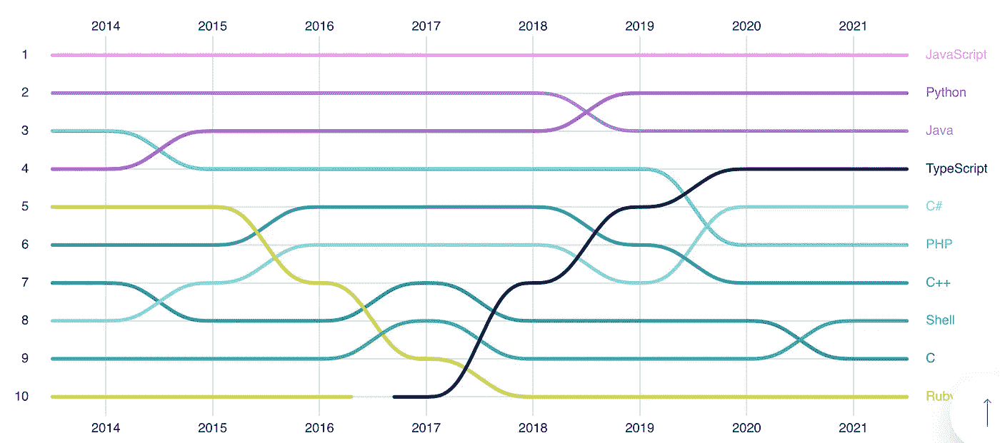**

**TypeScript 的发展突飞猛进，但随着 Azure 和 Unity 的发展，C#有所复苏。**

**出于好奇，我有一个小报告，它显示了 JavaScript、TypeScript 和 C#在这些年来的融合中变得多么相似，我认为这对已经熟悉 TypeScript 的团队来说是一个小小的提升:**

** [## GitHub-Charlie digital/js-ts-cs harp:一个展示 C# 10 函数技术的资源库…

### 这个库旨在突出 C#中可用的各种功能技术。点击此处阅读更多内容…

github.com](https://github.com/CharlieDigital/js-ts-csharp) 

## 功能

Azure Functions 是任何云平台中真正的明星之一，原因是它可以很容易地将云基础设施的各个部分连接在一起，只需要最少的胶水或 IaC 工作。

Azure 函数和 AWS Lambda 或 Google Cloud 函数之间最大的区别是它在更高的抽象层次上运行。Lambda 和 Google Cloud 函数的接口是*事件*，而 Azure Functions 使用*绑定*来抽象事件*输入*和输出。

[**内置绑定**](https://docs.microsoft.com/en-us/azure/azure-functions/functions-triggers-bindings?tabs=csharp) 让函数如此强大:

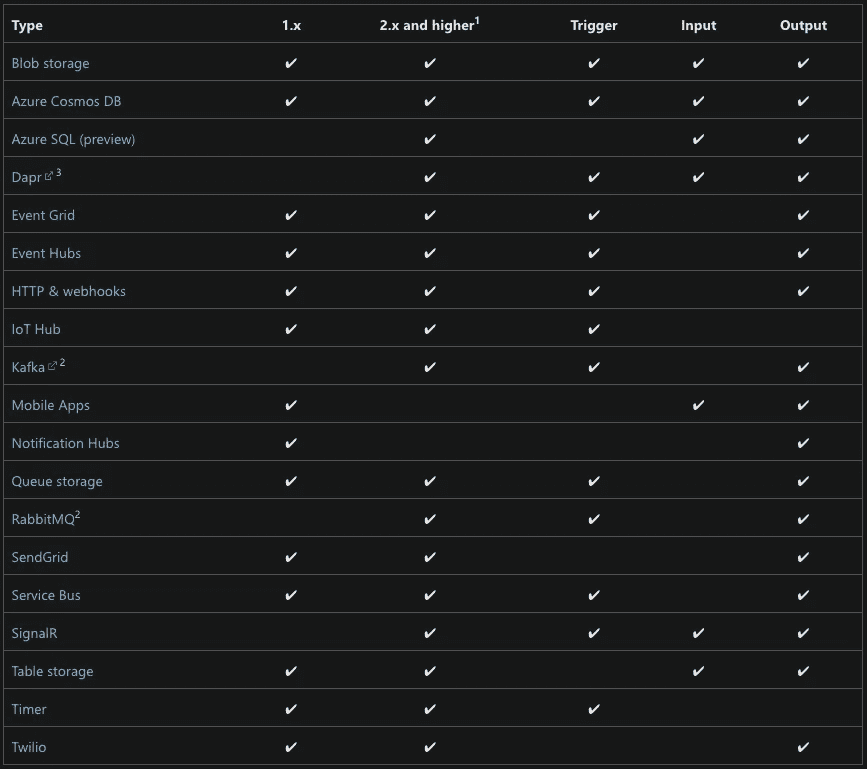

开箱即用的绑定为关键的基础设施部分提供，这些部分可以通过最少的 IaC 和客户端代码来访问。

这意味着，在函数中连接 I/O 的仪式和复杂性非常低，因为绑定取代了管理客户端连接和外部基础设施。只需使用属性将您想要连接的片段堆叠在一起，就大功告成了！

一个简单的例子就是 [**的定时器绑定**](https://docs.microsoft.com/en-us/azure/azure-functions/functions-bindings-timer?tabs=in-process&pivots=programming-language-csharp) 。在 GCP 上，相当于使用云调度器或云任务来调度任务。在 AWS 上，这需要用 Lambda 进行事件桥接。使用计时器绑定，只需用计时器触发器属性装饰一个无服务器函数就可以调度它。

作为另一个示例，下面的方法将 HTTP 输入触发器连接到 SendGrid 输出消息集合和实时 SignalR websocket 通道:

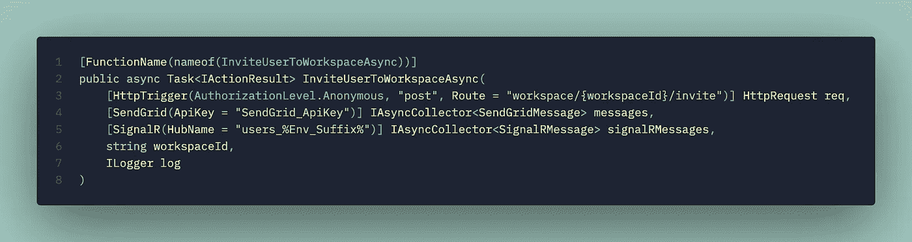

在 Azure 函数中堆叠 I/O

要将消息转发给 SendGrid，只需将其添加到上述绑定提供的`messages`集合中:

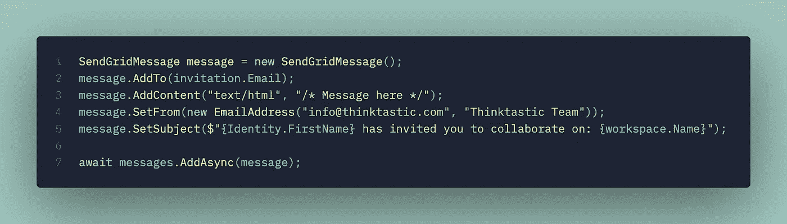

通过将消息添加到我们的收集器中，主机免费将消息传递给 SendGrid。

*注意我不需要做的事情*:实例化客户端或者理解如何使用 SendGrid API 我只是构造了一个消息，并把它交给绑定。

正因为如此，一个团队在 Azure Functions 中的生产力是绝对令人难以置信的。对于构建复杂的数据流和复杂的交互，没有第二个想法，因为它就像将端点连接在一起一样简单。这种方法还最大限度地降低了在 Azure 中部署 IaC 的复杂性，因为大部分工作都是通过函数绑定来处理的。

Azure 持久功能——长期运行的编排——也有 [**内置的 webhook 事件接收器**](https://docs.microsoft.com/en-us/azure/azure-functions/durable/durable-functions-http-api) 。这允许构建长时间运行的、复杂的无服务器编排，这些编排可以与外部系统进行交互，只需要设置最少的额外基础设施(例如， [**在 Lambda 今年春天获得函数 URL 之前，**](https://aws.amazon.com/blogs/aws/announcing-aws-lambda-function-urls-built-in-https-endpoints-for-single-function-microservices/) ，有必要建立 API 网关或应用程序负载平衡器来公开这些端点)。

相对于 Lambda 来说，冷启动可能会很残酷，这并不是没有错，但是如果你聪明地管理周围的热实例，或者选择一个具有热实例的层，它可以提供两个世界的最佳选择。

## 静态 Web 应用程序

现代水疗有一个相当常见的部署模式，Azure 的 [**静态 Web 应用**](https://docs.microsoft.com/en-us/azure/static-web-apps/overview) 通过在静态前端和 API 后端之间提供简单的连接来简化这一点。

虽然也可以部署您的静态 React、Vue 或 Svelte 资产，并从 S3 或谷歌云存储桶为它们提供服务，但 Azure Static Web Apps 通过在一个包中包含 SSL、自定义域、authz/authn、GitHub 集成等，减少了将 S3 或 GCS 桶映射到面向公众的应用程序所需的一些额外步骤。再一次，Azure 为构建和部署通用 web 应用程序部署模式所需的基础设施提供了更高层次的抽象。

[**想从 GitHub 部署一个 Next.js 应用到 Azure Static Web Apps——免费？微软得到了你**](https://docs.microsoft.com/en-us/azure/static-web-apps/deploy-nextjs) 。

这是迄今为止部署和运营现代水疗中心最简单的方法之一。

## 工具集成

微软是三家公司中唯一一家发布自己的 IDE 的，而且不是一个，而是*两个*优秀的 IDE:Visual Studio 和 Visual Studio 代码。

如果你对 C#和。NET，Visual Studio 的 ***与 Azure 的深度*** 集成提供了从初始化项目到将项目交付到云再到监控和调试的惊人的简化开发体验。

甚至带有微软第一方扩展的 VS 代码也使得从 IDE 使用 Azure 变得非常流畅。

微软对 Azure DevOps *和* GitHub 的所有权也意味着许多 CI/CD 集成——尤其是来自 DevOps 的集成——非常简化，复杂性也很低。例如，AWS CodeBuild 和 CodeDeploy 相形见绌，根本不值得使用。

## 最佳自由层

在这三种云中，我不得不称赞微软提供了遥遥领先的最佳免费层。

[**Azure Cognitive Q &举例来说，一个创客提供了一个永远免费的层级**](https://azure.microsoft.com/en-us/pricing/details/cognitive-services/qna-maker/) ，这个层级只受规模限制:

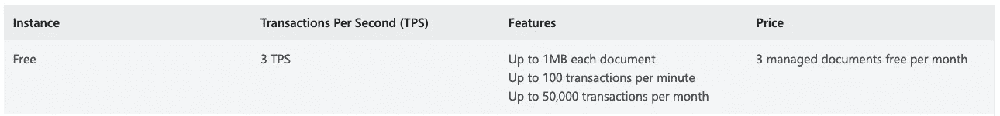

易于理解，功能齐全，只有规模上的限制；Azure 的免费层不会让你消耗超过分配的规模(与 AWS 相反)。

想尝试计算机视觉吗？**:**

**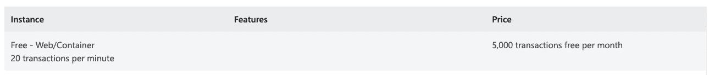**

**Azure 计算机视觉也是免费的，但有限制。**

**永远不要担心因为某些服务没有停止使用而被计费！**

**[**Azure CosmosDB 同样提供了一个免费层，它仅通过吞吐量和规模来限制您。**](https://docs.microsoft.com/en-us/azure/cosmos-db/free-tier)**

**[**Azure Functions 提供极其丰厚的每月免费赠送**](https://azure.microsoft.com/en-us/pricing/details/functions/) :**

**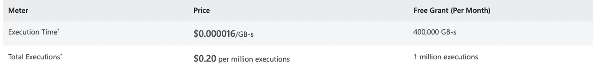**

**这个量对于创业公司和业余爱好者来说绰绰有余。**

**[**Azure 容器应用**](https://azure.microsoft.com/en-us/services/container-apps/#updates-announcements) 怎么样？**

****

**初创公司可以在 Azure 的早期有效地免费构建。因此，在 Azure 上进行实验也是极低摩擦和低风险的。**

**总的来说，我发现 Azure 提供了最慷慨的免费层，非常明确地免费，而且与 AWS 相比，它不太可能在使用免费服务时产生意外的账单。这对于初创公司来说是一大福音，因为团队可以在早期使用免费层轻松部署实时版本。**** 

# ******GCP******

****除了真正好的文档和财务利益，GCP 对初创公司的吸引力在于，通过少量真正易于使用的服务，团队可以简化架构和降低复杂性，同时可能比 Azure 功能更容易访问。****

****这些服务的组合简化了 API 的构建方式，并使经验较少的团队能够轻松构建复杂的计算和部署模型。****

## ****容器和 Kubernetes****

****虽然我建议每次启动都尽可能避免 Kubernetes**如果用例不适合无服务器容器，根据我的经验，GCP 的谷歌 Kubernetes 引擎(GKE)是最容易使用的。******

******[**GKE 的 Autopilot**](https://cloud.google.com/kubernetes-engine/docs/concepts/autopilot-overview) 是利用 Kubernetes 最简单的方法，但要注意的是，它不支持 [**变异动态准入 webhooks**](https://stackoverflow.com/questions/67422266/istio-on-gke-in-autopilot-mode/69236426#69236426) (例如不能安装 Dapr 这样的 sidecars)。******

******但除了 GKE，谷歌云运行(GCR)是运行无服务器工作负载的最容易实现的方式之一，我建议每个团队在考虑无服务器功能或 Kubernetes 之前都探索一下。******

******与 AWS 应用程序 Runner 相比，GCR 提供的真实规模为零。Azure Container 应用程序也扩展到零， [**但在 5 月底发布了全面可用的**](https://www.infoq.com/news/2022/05/azure-container-apps-ga/) 而 [**GCR 更成熟，自 2018 年末**](https://cloud.google.com/run/docs/release-notes) 以来一直在提供功能。******

******为什么一般使用 GCR 或无服务器容器？******

*   ******通过监听已知端口，使用任何语言、运行时或框架部署无服务器工作负载。******
*   ******使用任何框架或中间件，而不需要将其分解成无服务器功能运行时模型。******
*   ******无服务器功能的许多运行时约束被取消，包括限制适用于无服务器功能的无服务器工作负载类型的短超时******
*   ******因为 GCR 部署和扩展任何容器，并简单地将消息转发到一个可配置的已知端口，所以很容易将工作负载转移到任何云，并避免锁定；这真的不需要特殊的工具。******
*   ******GCR 只需要一个`Dockerfile`和应用程序来监听一个已知的端口。这意味着本地开发经验是……嗯，*只是本地开发*。不需要特殊工具！这是迄今为止使用无服务器容器的最好理由之一，因为与使用无服务器函数相比，开发体验要好得多，因为几乎没有运行时约束。******
*   ******GCR 甚至支持 gRPC 和 websockets(附带警告)。******

******Google Cloud Run 非常易于使用，并使无服务器、零扩展工作负载的部署变得无摩擦，相比之下，它只会使部署计算的每个模型都变得不必要的复杂。******

## ******发布/订阅、云任务和云调度程序******

******在 AWS 中，容器工作负载可以分为三类:******

*   ******[Web/后端服务](https://aws.github.io/copilot-cli/docs/concepts/services/#internet-facing-services) —这些服务响应 HTTP 请求******
*   ******[工人服务](https://aws.github.io/copilot-cli/docs/concepts/services/#worker-service) —这些是轮询输入的长期进程******
*   ******[作业](https://aws.github.io/copilot-cli/docs/concepts/jobs/)——这些都是计划好的******

******根据工作执行的时间和方式，团队需要决定使用哪个模型，从而决定部署哪个底层容器计算服务。虽然划分工作负载以及容器的计算/部署模型似乎有逻辑意义，但我认为这只是不必要的复杂性，因为这是对如何执行计算操作的三种抽象。******

******虽然 GCR 在测试阶段有工作，但它的核心能力是第一类工作负载，即服务对 HTTP、gRPC 或 web socket 消息的响应。那么，我们如何将长期服务类型的工作负载映射到 GCR 呢？通过使用发布/订阅、云任务和云调度程序。******

******与 AWS (SNS+SQS)和 Azure(服务总线)中的同类消息服务不同， [**Google Pub/Sub 实现了低仪式，内置 HTTP 推送订阅**](https://cloud.google.com/pubsub/docs/push) 。要在 AWS 或 Azure 中实现这一点，需要添加更多的基础设施和/或代码，仅仅是为了将消息移动到 HTTP 端点(在 AWS 中要多得多)。******

******表面上看起来可能没什么，但发布/订阅和云任务可能是帮助团队最大限度地减少蔓延和简化应用程序架构的最强大的工具，因为它允许将几乎所有应用程序逻辑构建为云中的简单 HTTP 端点，结合发布/订阅、云任务和云调度程序来管理代码的执行方式和时间。******

******对于不需要 Pub/Sub 的排序键的情况，云任务甚至更简单， [**提供了一个非常优雅的接口来通过队列**](https://cloud.google.com/tasks/docs/creating-http-target-tasks#creating_http_target_tasks) 调用 HTTP 端点。因为云任务甚至允许*调度 HTTP 推送*(临时 HTTP 推送)，所以只需调度未来的 HTTP 请求就可以构建简单的长时间运行的工作流。******

******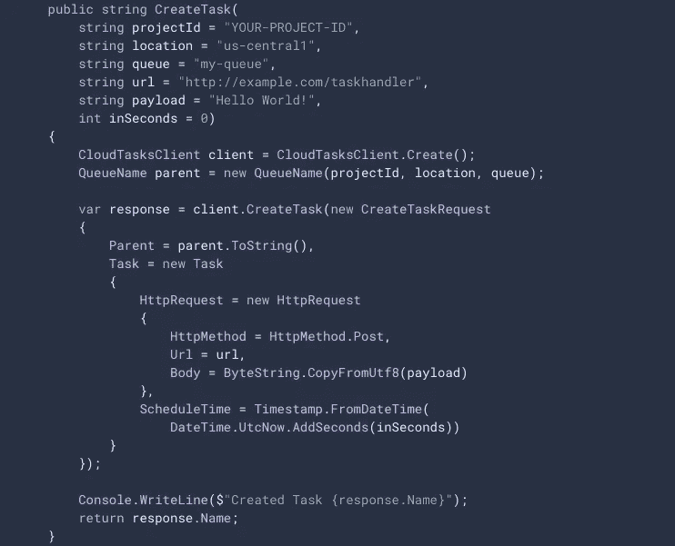******

******云任务使得构建时态系统交互变得轻而易举。一个用例可能是通过简单地调度几秒钟后的 API 调用来检查长时间运行的作业是否完成。******

******甚至支持 [**内置推侧**](https://cloud.google.com/tasks/docs/configuring-queues#rate) 限速。******

******重复的、计划的作业可以利用 Cloud Scheduler，使用简单的 HTTP 端点来启动它们。******

******奉承这样一个简单的功能似乎很奇怪，但这种优雅的范式允许团队使用熟悉的语言(JS/TS、Python)、框架(Express、Nest.js、Flask)和运行时(Node.js、Python)在 Google Cloud 上构建作为 HTTP 端点运行的整个系统，然后依靠一个真正易于使用的 HTTP 推送模型来管理代码如何以及何时执行。这简化了架构决策，并有效地将整个应用程序转变为 webhook 接收器。******

************

******甚至 EventArc 事件也内置了 HTTP 端点交付，这简化了您从 Google Cloud 处理系统级事件的方式。******

******在 GCR 容器中，一切都被实现为 HTTP 端点，这简化了部署、操作、监控、伸缩，并且还使得使用 Postman 或`curl`测试代码变得异常容易。它简化了身份验证，因为在使用发布/订阅时只需要一个服务到服务的身份验证模型。******

******我知道你在想什么:“有了这个、这个和这个，所有这些在 AWS 和 Azure 上都是可能的！“当然，在 AWS 和 Azure 中用更多的服务和更多的代码来做这些都是可行的，但是在 GCP 这是非常简单的，因为这些服务是如何优雅地互补，并且只需要很少的胶水就能让它工作。******

******对于以 API 为核心的 SaaS 初创公司，我发现 GCP 和 Azure 都提供了引人注目的高级抽象，允许团队以低复杂性快速前进。在 AWS 上构建类似的模式是可能的，但这样做的复杂性明显更高，因为 AWS 中的基本构建块是较低级的，导致开发了多个第一和第三方工具来解决这种复杂性。******

******对于一家早期创业公司来说，与这种摩擦抗争值得吗？******

******优秀的文档和慷慨的信用相结合，推动 GCP 成为一个高度可访问的云平台，而不牺牲增长空间，适用于不一定拥有深厚技术经验、正在努力适应市场的年轻初创公司。******

******Azure 的功能和微软在第一方工具领域的主导地位使其在愿意向微软生态系统飞跃的初创公司中紧随 GCP 之后。******

******AWS 提供了许多强大而独特的功能，但较低的抽象级别和较高的连接复杂性意味着它更适合更有经验的团队或已经拥有丰富 AWS 经验的团队。******

# ******裁决******

## ******在以下情况下使用 AWS******

1.  ******你需要用有经验的工程师迅速扩展你的团队******
2.  ******您将受益于一流的第三方生态系统和社区******
3.  ******您的团队已经有了 AWS 的经验，并且知道如何解决低层次、连接性的复杂性和蔓延的趋势******
4.  ******你需要获得 Azure 和 GCP 无法比拟的独特服务******

## ******使用 Azure，如果…******

1.  ******你熟悉 C#或 TypeScript******
2.  ******您的团队可以利用从第三方 IDE 深度集成中获得的效率******
3.  ******您希望以最简单的方式构建和部署静态网站/SPA+API******
4.  ******您的用例需要复杂的数据流，并且您希望用最简单的方法来管理这种复杂性******

## ******使用 GCP，如果…******

1.  ******您想要使用容器的最佳体验——无论是无服务器的还是通过 Kubernetes 编排的******
2.  ******你的产品的核心是一个 HTTP API******
3.  ******您的团队还没有丰富的云计算经验******
4.  ******快速迭代的能力是关键******

******如果你喜欢这个系列，订阅吧！你会发现我在写关于创业、云以及所有软件工程的东西！******