# AWS: Web 应用防火墙概述、配置及其监控

> 原文：<https://itnext.io/aws-web-application-firewall-overview-configuration-and-its-monitoring-1e1eea0604e5?source=collection_archive---------5----------------------->

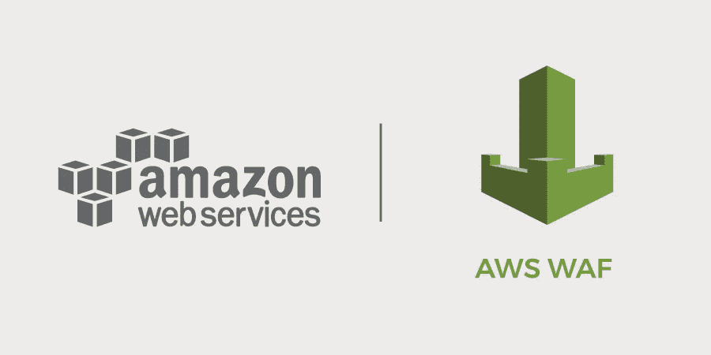

[AWS WAF](https://docs.aws.amazon.com/waf/latest/developerguide/waf-chapter.html) (Web 应用程序防火墙)是一种 AWS 服务，用于监控传入流量，以保护 Web 应用程序免受 SQL 注入等可疑活动的影响。可以附加到 AWS 应用程序负载平衡器、AWS CloudFront 发行版、Amazon API 网关和 AWS AppSync GraphQL API。

如果发现任何符合 WAF 规则的请求，它将被阻止，其发送者将得到 403 响应。

AWS 晶圆由四个主要组件组成:

*   **Web ACL** :访问控制列表，它保存了检查传入请求的规则列表
*   **IP 集合**:可以附加到 ACL 的 IP 范围列表
*   **规则**:规则本身，描述了哪些请求以及如何检查。这些规则可以是阻止 IP 设置、报头检查、请求正文内容检查等。
*   **规则组**:这样的规则也可以被分组以在 ACL 中使用，另外，AWS 提供了一组已经预定义的组— [AWS 管理的规则](https://rtfm.co.ua/en/?p=26525#Managed_Rule_groups)，以及来自其市场的组

AWS WAF 有其 ACL 容量:每个列表可以容纳多达 1500 WCU (WAF 容量单位)。我们将在 [AWS WAF 限制](https://rtfm.co.ua/en/aws-web-application-firewall-overview-configuration-and-its-monitoring/#AWS_WAF_limitations)中讨论 WAF 的限制。另外，检查 [AWS WAF Web ACL 容量单位(WCU)](https://docs.aws.amazon.com/waf/latest/developerguide/how-aws-waf-works.html#aws-waf-capacity-units) 。

最不方便的限制是一个应用负载平衡器只能连接一个 ACL。

此外，我询问了 AWS 团队关于性能的问题——将 WAF ACL 附加到 ALB/CloudFront 是否会影响其响应时间，但无论如何，ACL 或其中的规则数量都不会影响目标。

因此，在这篇文章中，我们将在 Kubernetes 中启动一个测试应用程序，介绍主要的 WAF 概念，了解如何为 ACL 配置规则，创建这样一个 ACL，并使用 CloudWatch 和с Prometheus 配置其监控。

# **内容**

*   [测试应用](https://rtfm.co.ua/en/aws-web-application-firewall-overview-configuration-and-its-monitoring/#A_testing_application)
*   [AWS 晶圆配置](https://rtfm.co.ua/en/aws-web-application-firewall-overview-configuration-and-its-monitoring/#AWS_WAF_configuration)
*   [创建 Web ACL](https://rtfm.co.ua/en/aws-web-application-firewall-overview-configuration-and-its-monitoring/#Create_a_Web_ACL)
*   [IP 设置](https://rtfm.co.ua/en/aws-web-application-firewall-overview-configuration-and-its-monitoring/#IP_set)
*   [创建 ACL 规则](https://rtfm.co.ua/en/aws-web-application-firewall-overview-configuration-and-its-monitoring/#Create_ACL_Rules)
*   [通过 URI 和规则优先级限制访问](https://rtfm.co.ua/en/aws-web-application-firewall-overview-configuration-and-its-monitoring/#Limiting_access_by_a_URI_and_rules_priority)
*   [SQL 注入街区](https://rtfm.co.ua/en/aws-web-application-firewall-overview-configuration-and-its-monitoring/#SQL_injection_block)
*   [托管规则组](https://rtfm.co.ua/en/aws-web-application-firewall-overview-configuration-and-its-monitoring/#Managed_Rule_groups)
*   [规则组和 ACL 删除](https://rtfm.co.ua/en/aws-web-application-firewall-overview-configuration-and-its-monitoring/#Rule_groups_and_an_ACL_deletion)
*   [AWS 晶圆限制](https://rtfm.co.ua/en/aws-web-application-firewall-overview-configuration-and-its-monitoring/#AWS_WAF_limitations)
*   [AWS 晶圆监控](https://rtfm.co.ua/en/aws-web-application-firewall-overview-configuration-and-its-monitoring/#AWS_WAF_monitoring)
*   [AWS CloudWatch metrics 和 Prometheus](https://rtfm.co.ua/en/aws-web-application-firewall-overview-configuration-and-its-monitoring/#AWS_CloudWatch_metrics_and_Prometheus)
*   [AWS 晶圆日志](https://rtfm.co.ua/en/aws-web-application-firewall-overview-configuration-and-its-monitoring/#AWS_WAF_logs)
*   [AWS Kinesis 数据消防水管输送流](https://rtfm.co.ua/en/aws-web-application-firewall-overview-configuration-and-its-monitoring/#AWS_Kinesis_Data_Firehose_delivery_stream)
*   [WAF ACL 记录](https://rtfm.co.ua/en/aws-web-application-firewall-overview-configuration-and-its-monitoring/#WAF_ACL_logging)
*   [AWS ALB、Kubernetes Ingress 和 AWS WAF](https://rtfm.co.ua/en/aws-web-application-firewall-overview-configuration-and-its-monitoring/#AWS_ALB_Kubernetes_Ingress_and_AWS_WAF)
*   [有用链接](https://rtfm.co.ua/en/aws-web-application-firewall-overview-configuration-and-its-monitoring/#Useful_links)

# 测试应用程序

让我们使用一个简单的 Kubernetes 部署，它将创建一个包含 Nginx、服务和入口资源的 Kubernetes Pod。这个带有 [AWS 负载平衡器控制器](https://rtfm.co.ua/aws-migraciya-aws-alb-ingress-controller-v1-na-aws-load-balancer-controller-v2/)的入口将创建一个 AWS 应用负载平衡器。

```
---
apiVersion: v1
kind: Namespace
metadata:
  name: test-namespace
---
apiVersion: apps/v1
kind: Deployment
metadata:
  name: test-deployment
  namespace: test-namespace
  labels:
    app: test
    version: v1
spec:
  replicas: 1
  selector:
    matchLabels:
      app: test
  template:
    metadata:
      labels:
        app: test
        version: v1
    spec:
      containers:
      - name: web
        image: nginxdemos/hello
        ports:
        - containerPort: 80
        resources:
          requests:
            cpu: 100m
            memory: 100Mi
        readinessProbe:
          httpGet:
            path: /
            port: 80
---
apiVersion: v1
kind: Service
metadata:
  name: test-svc
  namespace: test-namespace
spec:
  type: NodePort
  selector:
    app: test
  ports:
    - name: http
      protocol: TCP
      port: 80
      targetPort: 80
---
apiVersion: extensions/v1beta1
kind: Ingress
metadata:
  name: test-ingress
  namespace: test-namespace
  annotations:
    kubernetes.io/ingress.class: alb
    alb.ingress.kubernetes.io/scheme: internet-facing
    alb.ingress.kubernetes.io/listen-ports: '[{"HTTP": 80}]'
    alb.ingress.kubernetes.io/inbound-cidrs: 0.0.0.0/0
    external-dns.alpha.kubernetes.io/hostname: "testapp.dev.example.com"
spec:
  rules:
  - http:
      paths:
      - backend:
          serviceName: test-svc
          servicePort: 80
```

部署它，并检查入口及其 ALB:

```
$ kubectl -n test-namespace get ingress
NAME CLASS HOSTS ADDRESS PORTS AGE
test-ingress <none> * aadca942-***.us-east-2.elb.amazonaws.com 80 46s
```

检查 ALB 的响应:

```
$ curl -I testapp.dev.example.com
HTTP/1.1 200 OK
```

这里一切正常，我们去 AWS WAF 吧。

# AWS 晶片配置

## 创建 Web ACL

进入 AWS 控制台> WAF，点击*创建 web ACL* :

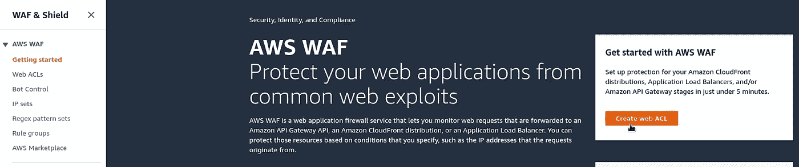

在这种情况下，我们会附加一个 AWS ALB，所以一开始(！)选择一个必要的 AWS 区域，然后设置一个 ACL 名称，该名称也将用于 CloudWatch 指标，它们将在下面的 [AWS CloudWatch 指标和 Prometheus](https://rtfm.co.ua/en/aws-web-application-firewall-overview-configuration-and-its-monitoring/#AWS_CloudWatch_metrics_and_Prometheus) 主题中讨论:

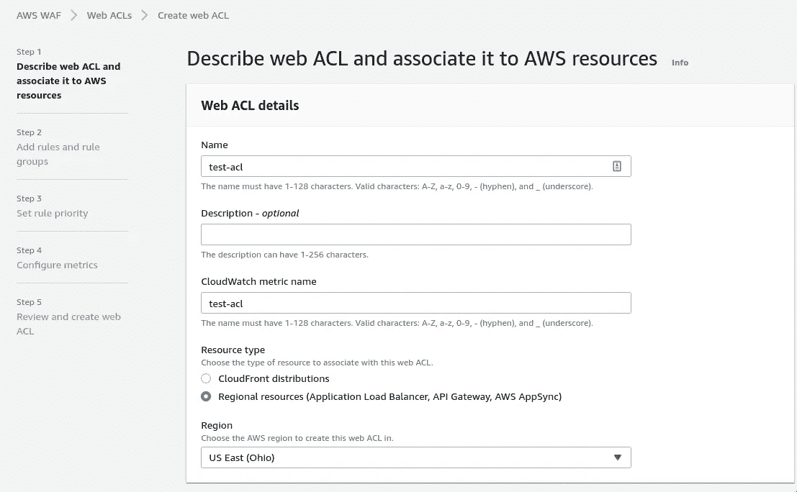

接下来，找到要保护的 ALB:

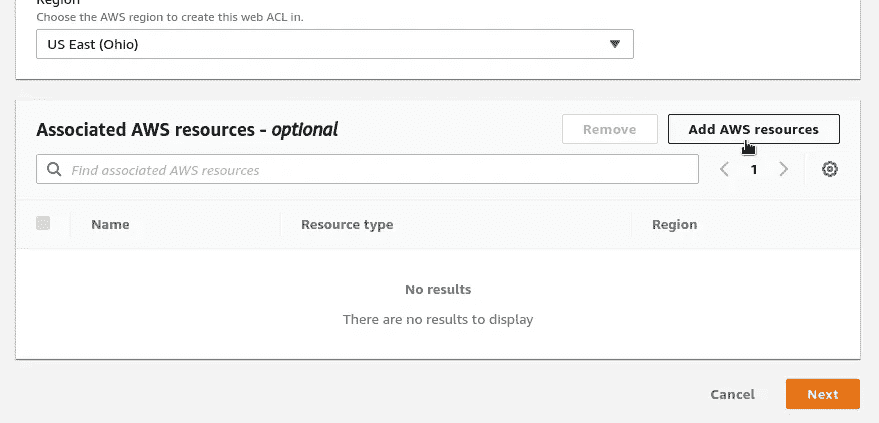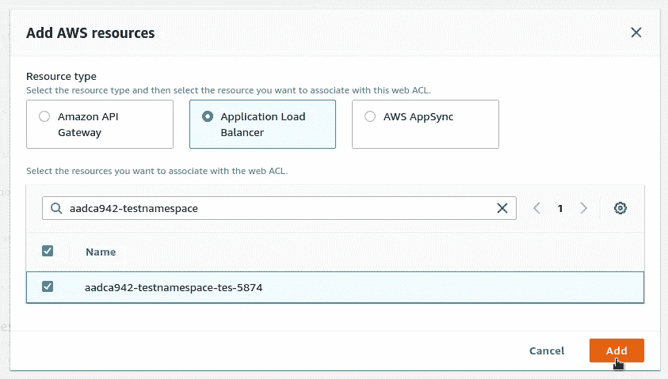

从现在开始，发送到这个 AWS ALB 的每个请求将首先通过 ACL 的规则链发送，然后它将被 403 错误拒绝，或者将被传递到这个负载平衡器后面的应用程序。

我们稍后将添加规则，现在只保留默认操作设置为*允许*:

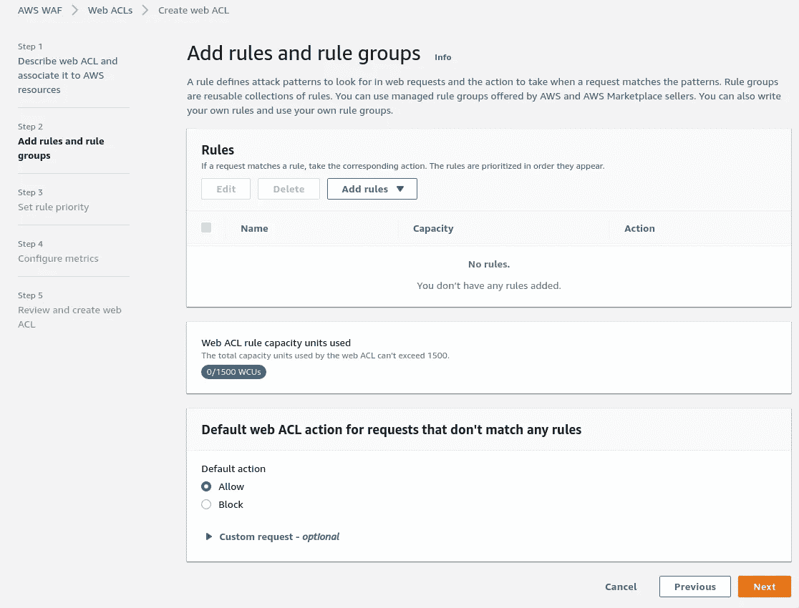

在这里，您还可以配置其他操作:

*   对于 *Allow* :添加一个自定义头，它将被附加到通过所有检查并被发送到应用程序的所有请求上
*   对于*块*:在这里，我们可以设置一个自定义响应代码，该代码将返回给所有被阻止的客户端，或者可以指定一个自定义头和/或响应体:

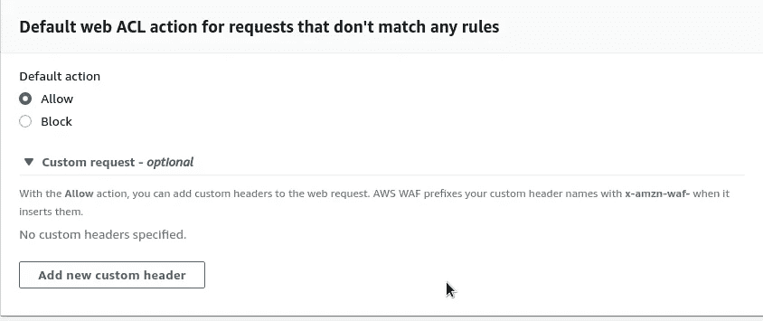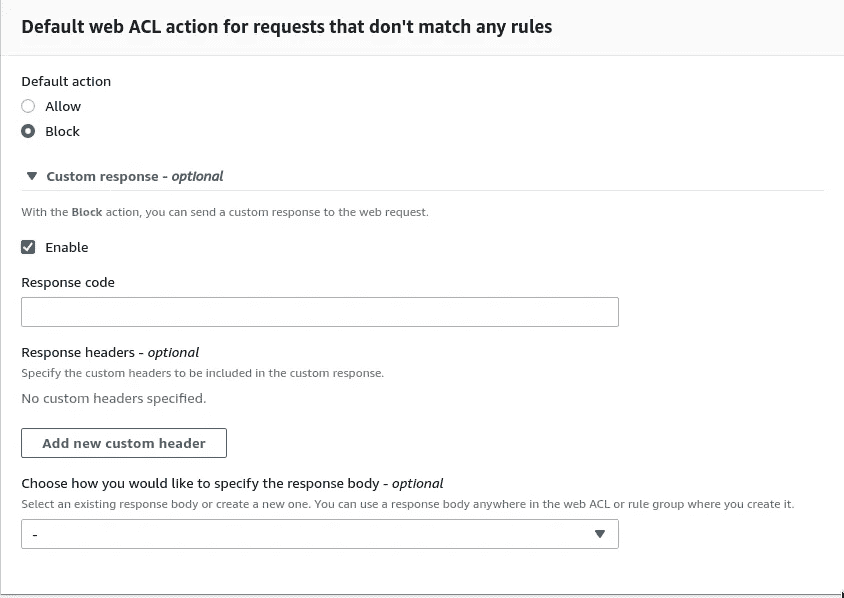

再说一遍，现在只保留这里的默认设置，因为这可以在以后进行配置。

与常见的防火墙类似，您可以在 ACL 中配置规则优先级:将应用第一个匹配请求的规则:

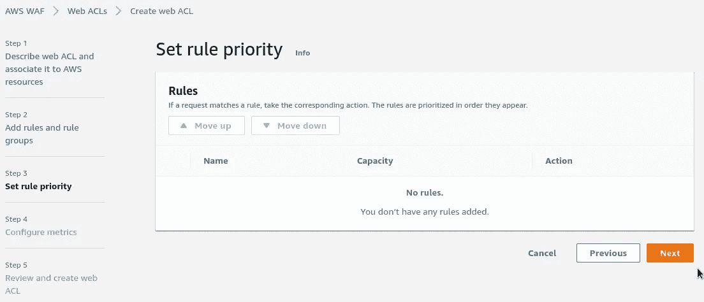

现在也跳过。

CloudWatch 将稍后配置，所以也跳过它:

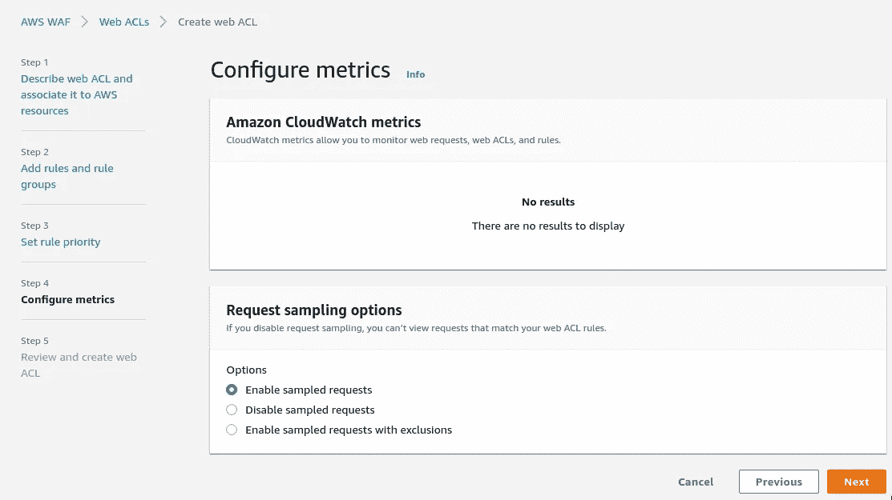

运行`curl`到测试 ALB 以获得一些流量和图表:

```
$ watch -n 1 curl -I testapp.dev.example.com
```

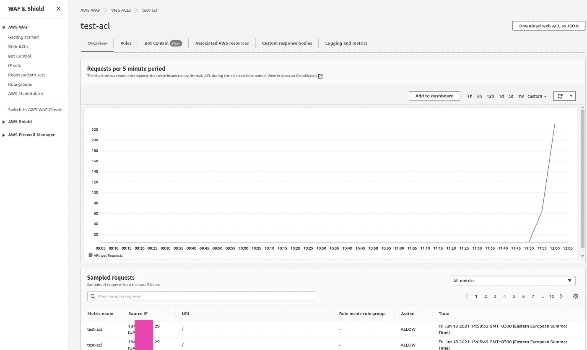

## IP 集

*IP 集合*允许创建一组 IP 或 IP 范围，可在以后的规则中使用。

例如，我们可以创建一组 office IPs 来制定允许规则。参见[创建 IP 集](https://docs.aws.amazon.com/waf/latest/developerguide/waf-ip-set-creating.html):

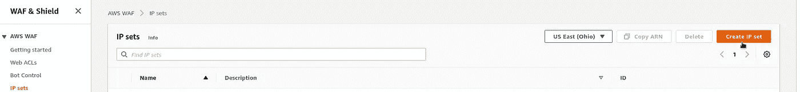

请注意这里的 AWS 区域:对于 CloudFront，您必须选择 *CloudFront (Global)* ，对于所有其他区域—一个安全资源所在的区域。

获取您当前的 IP(我的办公室):

```
$ curl ifconfig.me
194.***.***.29
```

创建一个 IP 集，使用`/29`掩码包含我们所有的 office IPs:

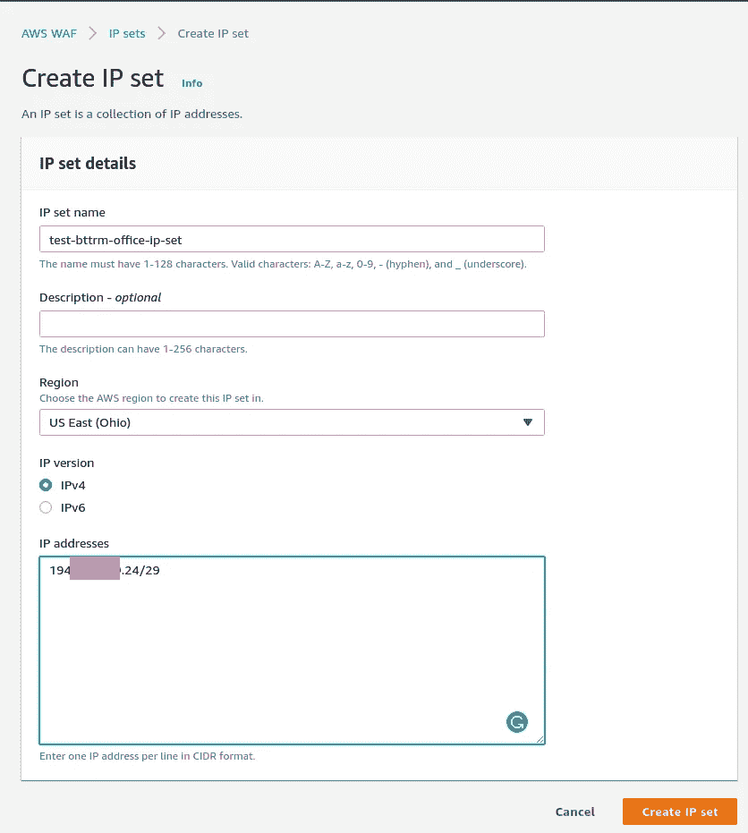

现在，让我们来看看规则。

## 创建 ACL 规则

选择上面创建的 ACL，点击*添加规则*，选择*添加我自己的规则*:

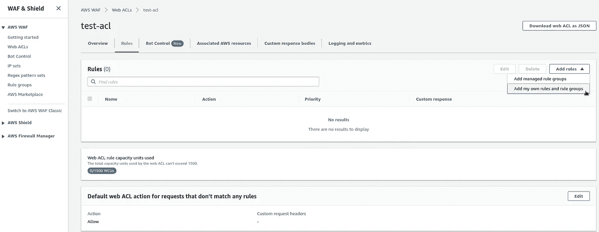

让我们添加一个简单的规则:阻止所有来自我们办公室的请求。

选择*规则类型* == IP 集，因为我们将使用之前创建的 IP 集，设置规则的名称，选择您的 IP 集，使用*源 IP 地址*，以及默认操作— *阻止*:

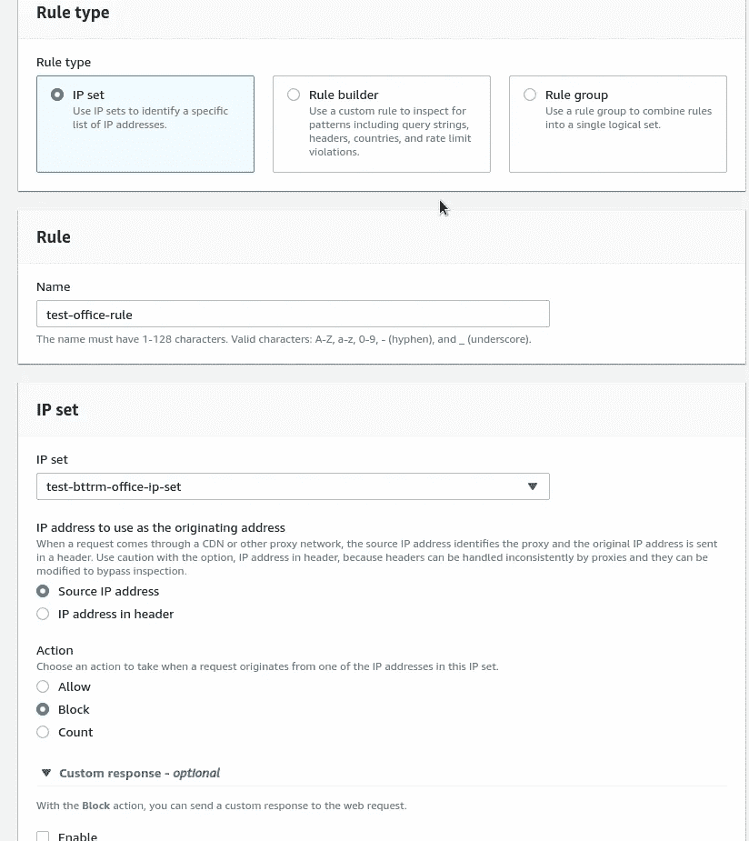

如果将动作设置为*计数，* WAF 将只对符合规则的请求进行计数，而不进行阻塞活动。可用于在应用规则之前进行测试:

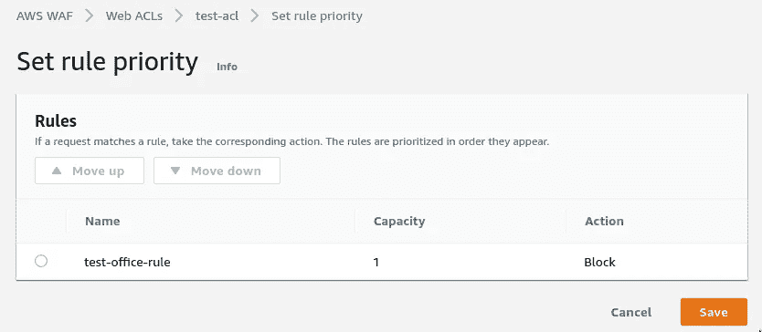

几秒钟后，我们会收到 403 条回复:

```
$ curl -I testapp.dev.example.com
HTTP/1.1 403 Forbidden
```

现在，让我们尝试做一些更有趣的事情:只允许来自办公室的流量，但阻止来自世界的所有其他请求。

由于没有办法用 0.0.0.0/0 CIDR 创建 IP 集，所以让我们用不同的方法来创建:将 ACL 的默认动作更改为 *Block* ，并将 office 的 IP 集使用为 Allowed 规则。

编辑*默认 web ACL 操作*:

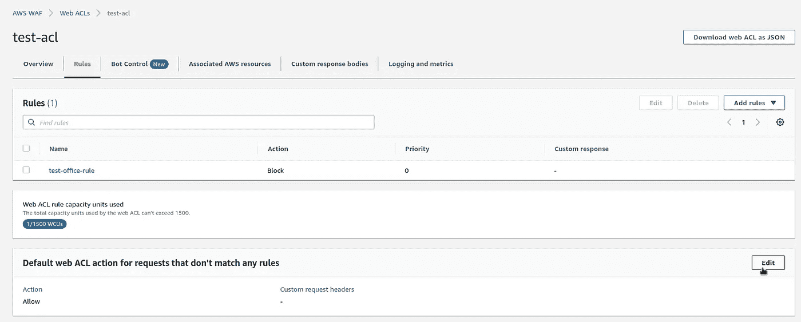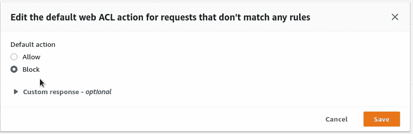

从不同于办公室的地方检查访问，例如从 rtfm.co.ua 所在的[服务器。在 15–20 中，将应用新设置:](https://rtfm.co.ua/)

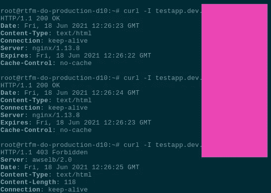

回到 ACL *测试-办公室-规则*，从办公室将*阻塞*改为*允许*:

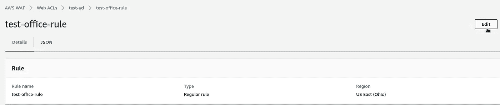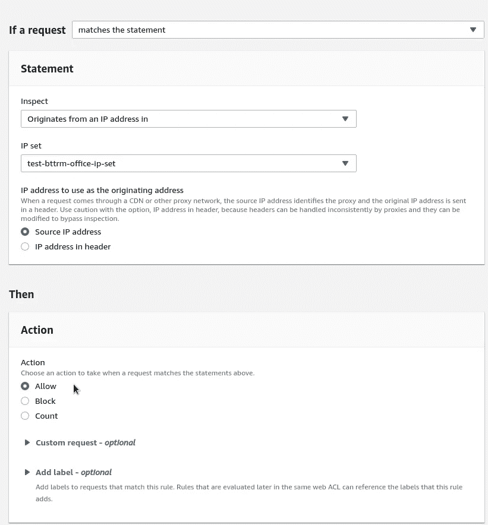

从办公室检查它现在是否工作:

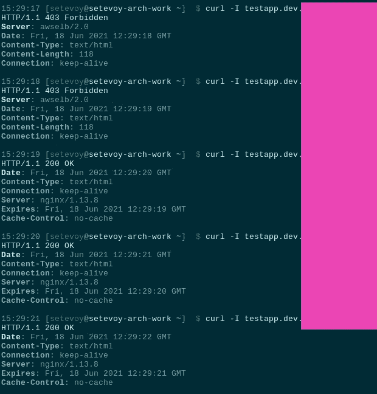

## 通过 URI 和规则优先级限制访问

好吧，但是如果我们只想阻止公众访问某个特定的 URI，比如说 */status* ，但是允许它从办公室访问，该怎么办呢？

为此，我们需要:

1.  将默认动作设置回*允许*
2.  添加一条规则允许*/状态*的 URI 离开办公室
3.  添加一条规则来阻止*/状态* URI 进入这个世界

回到 ACL 的默认操作，将其改回 *Allow，*从而允许从任何地方访问 ALB:

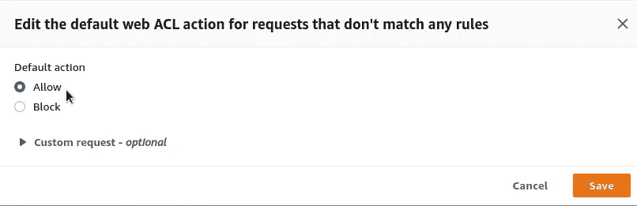

现在，我们需要两个额外的规则:一个从办公室允许，一个从世界上阻止。让我们从阻塞规则开始。

此时，使用*规则生成器*，调用规则为 *block-status-uri-world* ，在*语句*中选择 *URI 路径*，设置一个值为 */status* ，在*动作*中设置 *Block* :

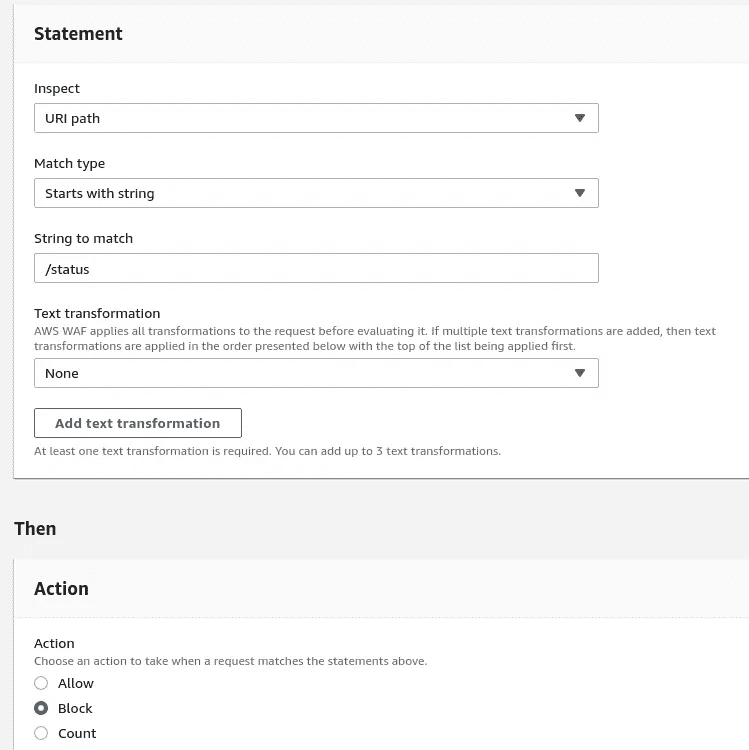

现在检查入口。

从办公室到/:

```
15:33:29 [setevoy@setevoy-arch-work ~] $ curl -I testapp.dev.example.com
HTTP/1.1 200 OK
```

以及从另一个 IP 到/:

```
root@rtfm-do-production-d10:~# curl -I testapp.dev.example.com
HTTP/1.1 200 OK
```

从办公室到*/状态*:

```
16:08:42 [setevoy@setevoy-arch-work ~] $ curl -I testapp.dev.example.com/status
HTTP/1.1 403 Forbidden
```

从世界上来说:

```
root@rtfm-do-production-d10:~# curl -I testapp.dev.example.com/status
HTTP/1.1 403 Forbidden
```

好:现在我们已经授予了从任何地方访问网站根目录的权限，并且从任何地方都阻止了 */status* 。现在，让我们允许从办公室进行 */status* 访问。

回到规则，添加另一个规则，姑且称之为*allow-status-uri-office*:

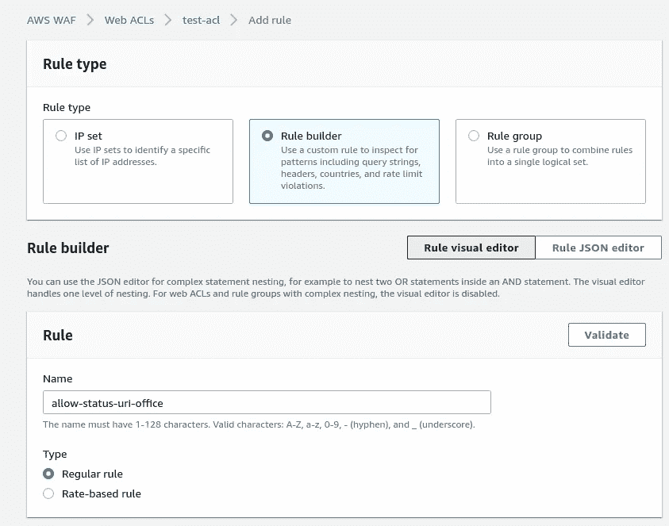

构建规则的条件:

1.  如果 URI = =*/状态*
2.  如果 IP = =*test-Bt trm-office-IP-set*
3.  然后*允许*

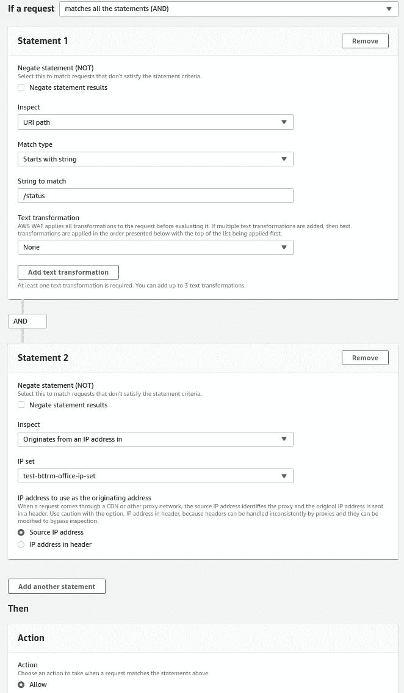

顺便说一下，请注意 *Capacity* 字段:这里我们可以看到 ACL 中总共 1500 个可用的 wcu 中有多少个将被规则消耗。

因此，我们添加了一个允许规则，但现在它将不起作用，因为我们有了第一个规则 *block-status-uri-world* ，它将阻止对 */status，*的所有请求，甚至来自办公室的请求:

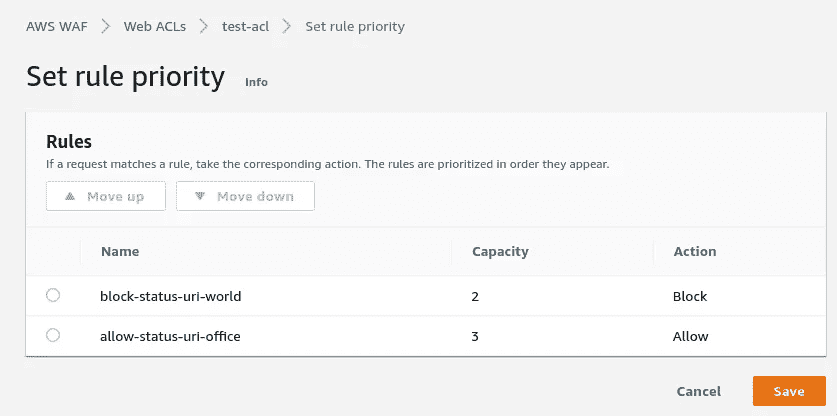

要解决这个问题，请将*allow-status-uri-office*移到列表的开头:

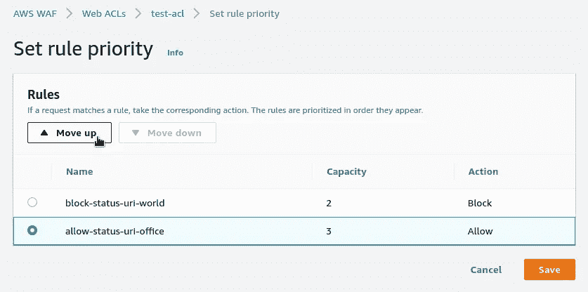

所以接下来的重点是:

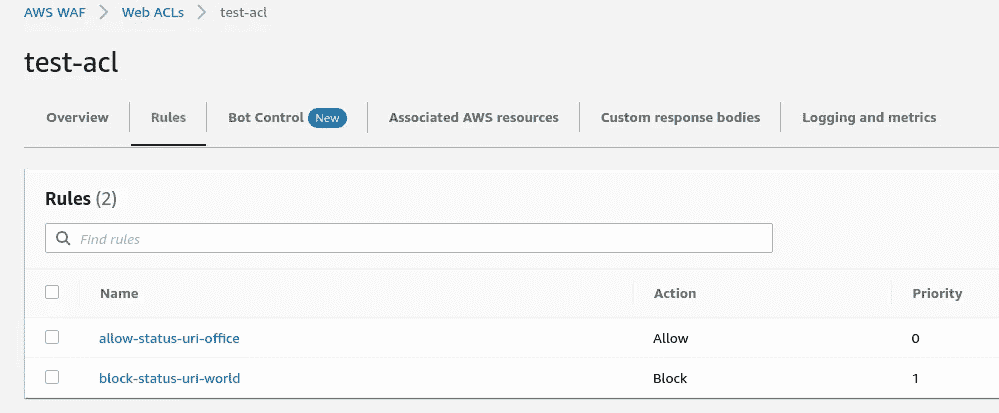

检查办公室外的访问:

```
root@rtfm-do-production-d10:~# curl -I testapp.dev.example.com/status
HTTP/1.1 403 Forbidden
```

很好，被屏蔽了。现在，在办公室里:

```
16:18:00 [setevoy@setevoy-arch-work ~] $ curl -I testapp.dev.example.com/status
HTTP/1.1 200 OK
```

这是可行的。

## SQL 注入街区

其中一个最讨厌的攻击类型是 SQL 注入，这绝对值得被禁止。

在 AWS WAF 管理的规则中，我们有一个来自 AWS 本身及其合作伙伴的预定义规则列表，您也可以自己创建这样的块。

创建一个名为 *sqli-test* 的新规则:

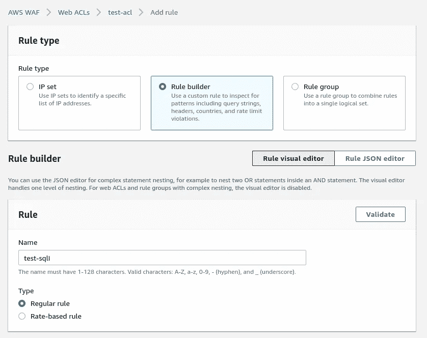

定义其条件:

*   检查*查询*
*   在*匹配类型中，*选择*包含 SQL 注入攻击*

在动作中，保留默认的*块*，在*自定义响应*中，让我们设置 *405 —不允许的方法*，以迷惑攻击者(尽管在这里设置 200 可能更有趣:-):

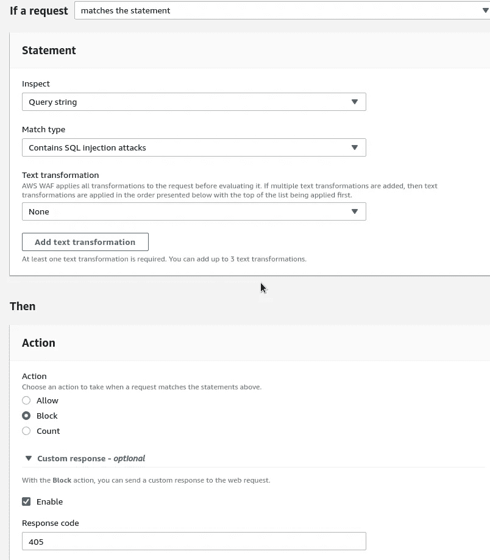

保存该规则，并使用在[中搜索的请求`products?category=Gifts'--`查看此处的](https://portswigger.net/web-security/sql-injection):

```
$ curl -I “http://testapp.dev.example.com/products?category=Gifts'--"
HTTP/1.1 405 Not Allowed
```

耶！我们已经阻止了 SQL 注入对我们应用程序的尝试！

## 托管规则组

让我们看看 AWS 及其合作伙伴建议在他们现有的规则中使用什么。

选择了*添加托管规则组*:

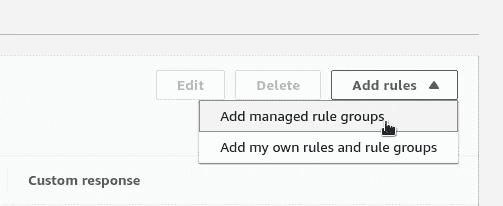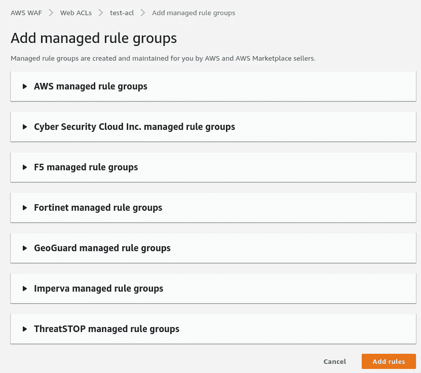

在 AWS 管理的规则组中，您可以找到来自 AWS 的规则列表，其余的是可以在 AWS 市场上购买的付费规则。

查看文档了解规则描述— [AWS 托管规则规则组列表](https://docs.aws.amazon.com/waf/latest/developerguide/aws-managed-rule-groups-list.html)。

例如，*已知错误输入*规则将检查请求的`Host`报头，如果它包含 *localhost、*，那么来自互联网的此类请求将被阻止，因为有效请求不能包含它。

将其添加到 ACL 中:

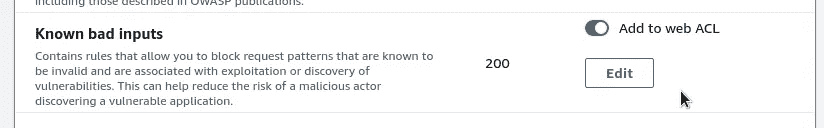

此外，您可以在这里为该组配置默认操作，或者添加一个过滤器以仅选择部分请求:

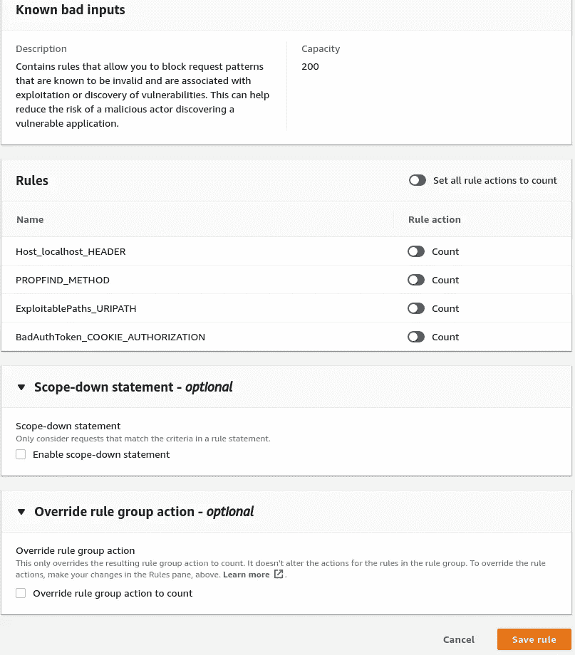

同样，请注意*容量*，因为该组将使用 ACL 的 1500 个限制中的全部 200 个 wcu。

保存，检查优先级:

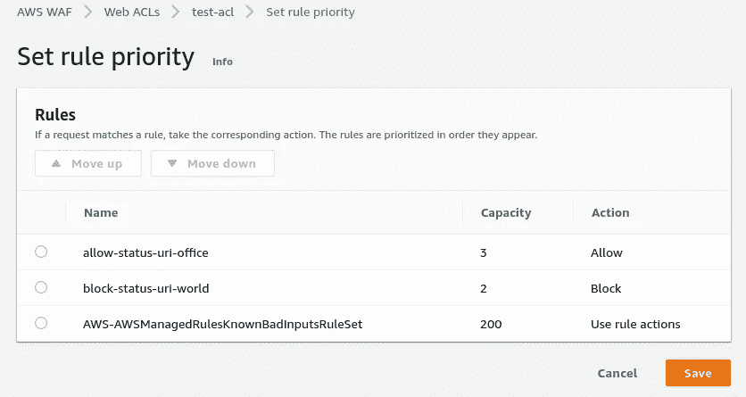

检查访问:

```
$ curl -I testapp.dev.example.com
HTTP/1.1 200 OK
```

并为`Host`头- *本地主机*添加无效值:

```
$ curl -H “Host: localhost” -I testapp.dev.example.com
HTTP/1.1 403 Forbidden
```

现在被封了。

## 规则组和 ACL 删除

有一点需要注意:如果一个规则是直接从一个 ACL 创建的，当这个 ACL 将被删除时，该规则也将被删除。

要永久保存您自己的规则，请使用*规则组*:

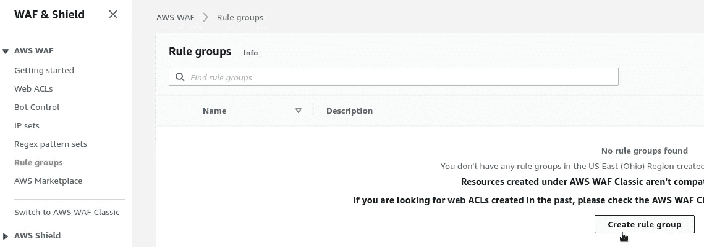

然后，在组中创建您的规则，并将该组附加到您的 ACL。

# AWS 晶圆限制

查看所有限制— [AWS 晶圆配额](https://docs.aws.amazon.com/waf/latest/developerguide/limits.html)。

对我来说，主要是:

*   每个负载平衡器一个 ACL:在规划 ACL 时要记住这一点。
*   WCU 每个 ACL 的限制:1500，但可以通过技术支持请求增加，但这将影响其成本:
*   如果您有一个使用 0 到 1，500 WCU 的 web ACL，那么您的所有请求将按每百万次请求 0.60 美元收费(正常费率)
*   如果您有一个使用 1，501 到 2，000 WCU 的 web ACL，那么您的所有请求将被收取每百万请求 0.80 美元的费用
*   如果您有一个使用 2，001 到 2，500 WCU 的 web ACL，那么您的所有请求将按每百万请求 1.00 美元收费。
*   每个帐户的最大 IP 集:100
*   每秒可通过 WAF ACL 传递的最大请求数(对于 ALB): 25.000
*   可以检查的最大正文大小:8 kb
*   针对(`AssociateWebACL`和`DisassociateWebACL`)对 AWS 的最大 API 调用:每秒 2 次

# AWS 晶圆监控

好了，我们已经了解了如何阻止请求，创建了 ACL，并进行了测试。所有作品。

但是监视它的活动是很好的，甚至当事情变得奇怪时发出警报。

## AWS CloudWatch metrics 和 Prometheus

我们可以去的第一个地方是 CloudWatch 和 WAFV2 指标:

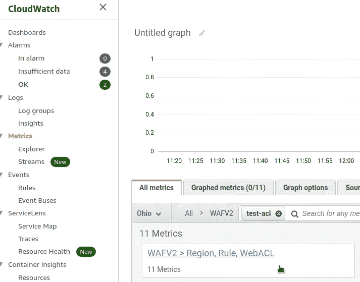

在此选择我们的 ACL 或特定规则:

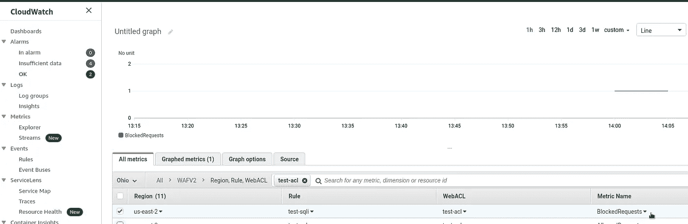

这是我们被阻止的请求。

接下来，我们可以用 [cloudwatch-exporter](https://rtfm.co.ua/prometheus-cloudwatch-exporter-sbor-metrik-iz-aws-i-grafiki-v-grafana/) 将它们收集到 Prometheus 实例中:

```
region: us-east-2

metrics:

 - aws_namespace: AWS/WAFV2
   aws_metric_name: BlockedRequests
   aws_dimensions: [Region,Rule,WebACL]
```

用 SQL 注入运行我们的测试请求，或者甚至在循环中运行它:

```
$ while true; do curl -I “http://testapp.dev.example.com/products?category=Gifts'--"; sleep 1; done
```

检查普罗米修斯中的图表:

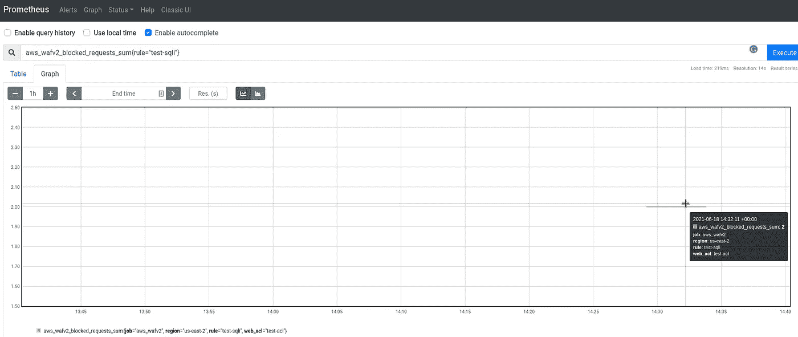

现在我们也可以在这里看到被阻塞的请求。

让我们添加一个测试警报:检查过去 5 分钟内`aws_wafv2_blocked_requests_sum`指标的平均每秒增加量:

```
- alert: "WAFBlockedRequestsAlert"
  expr: rate(aws_wafv2_blocked_requests_sum{rule!="ALL"}[5m]) > 0
  for: 1s
  labels:
    severity: warning
  annotations:
    summary: "AWS WAF blocked requests detected"
    description: "ACL name: `{{ $labels.web_acl }}`\nRule name: `{{ $labels.rule }}"
    tags: test, aws, security, databases
```

如果它的值将大于零，那么 WAF 阻止了某人，并且我们将被通知它:

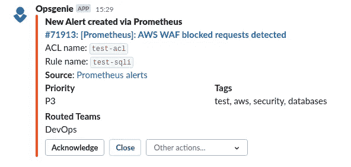

## AWS 晶圆日志

参见[管理 web ACL 的日志](https://docs.aws.amazon.com/waf/latest/developerguide/logging.html)。

为了记录 WAF 活动，我们需要一个 AWS S3 桶，和一个 AWS Kinesis 数据消防水管输送流。

## 自动气象站 Kinesis 数据消防软管传输流

转到 Kinesis，创建一个新的数据消防站流:

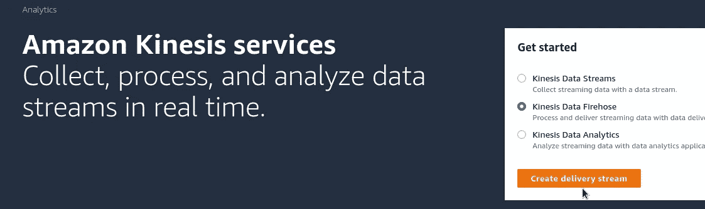

其名称必须以 *aws-waf-logs-* 前缀开头，还要设置*直放或其他来源*，点击*下一个*:

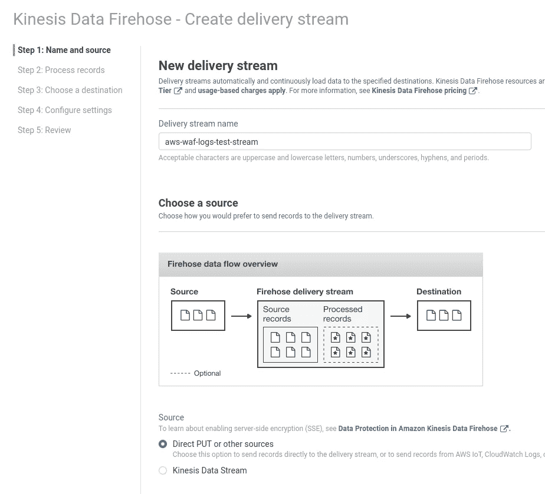

跳过下一页上的所有内容，在下一页上为*目的地*选择 S3，选择现有的，或者创建一个新的 S3 桶:

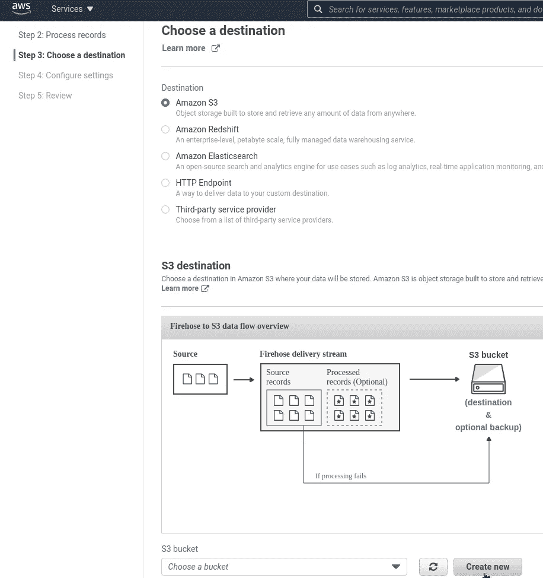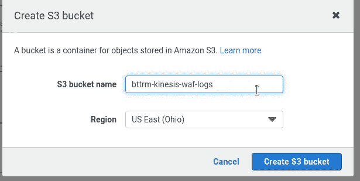

在这里，您还可以设置一个前缀，将来自不同 ACL 的日志保存在同一个 S3 存储桶中:

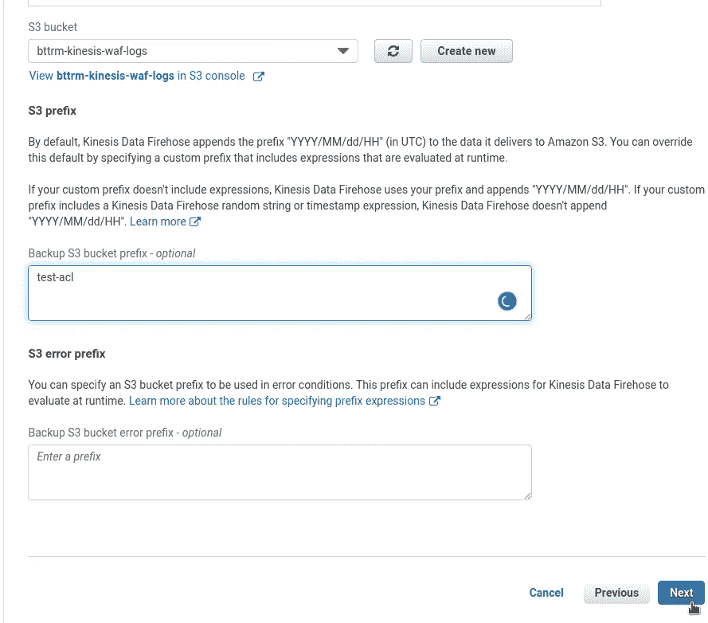

在下一页上，目前可以保留默认值:

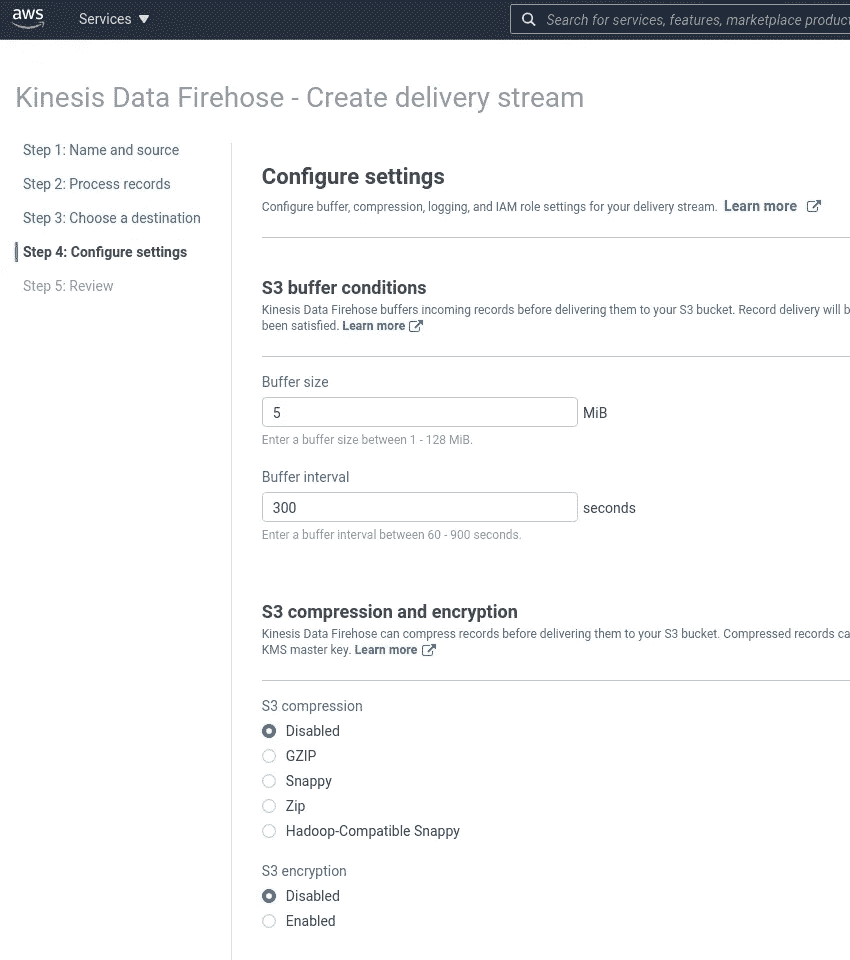

检查设置并点击*创建交付流*:

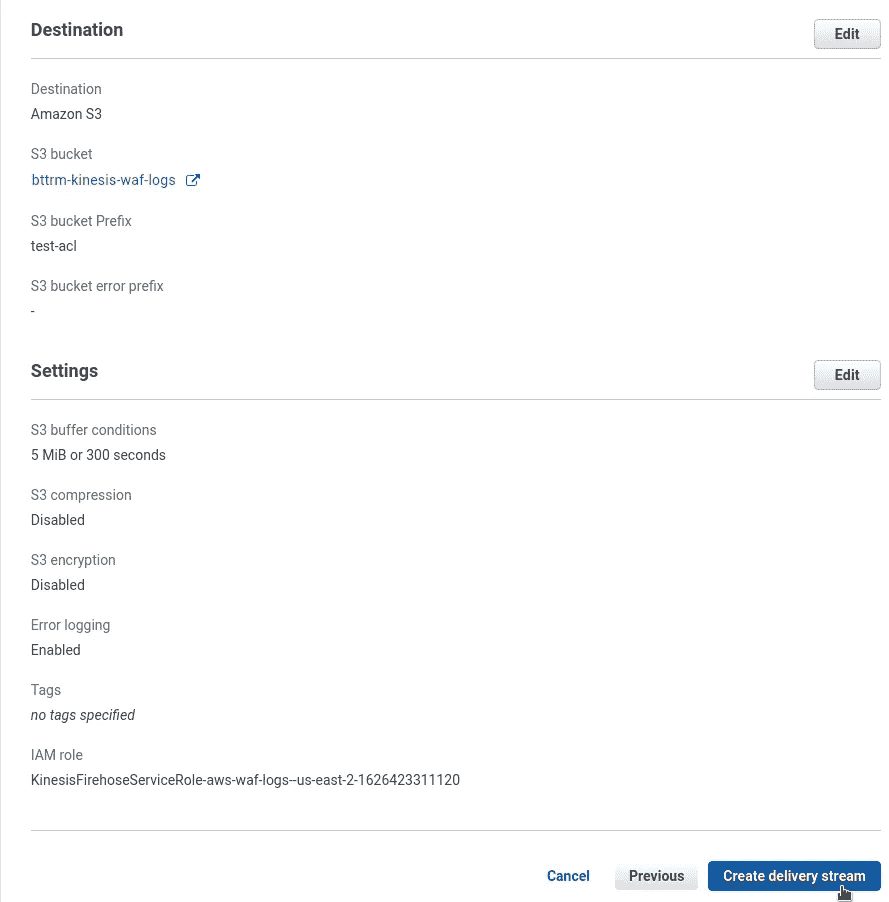

## WAF ACL 记录

回到 WAF ACL 的*记录和指标*选项卡，点击*启用记录*:

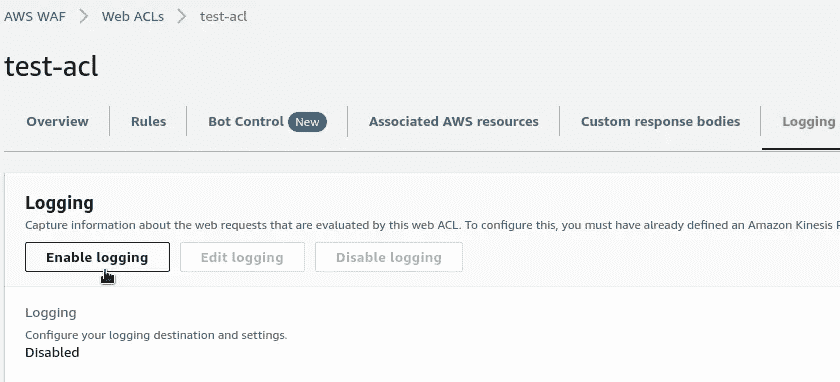

选择您在上面创建的流，可以选择为字段配置过滤器:

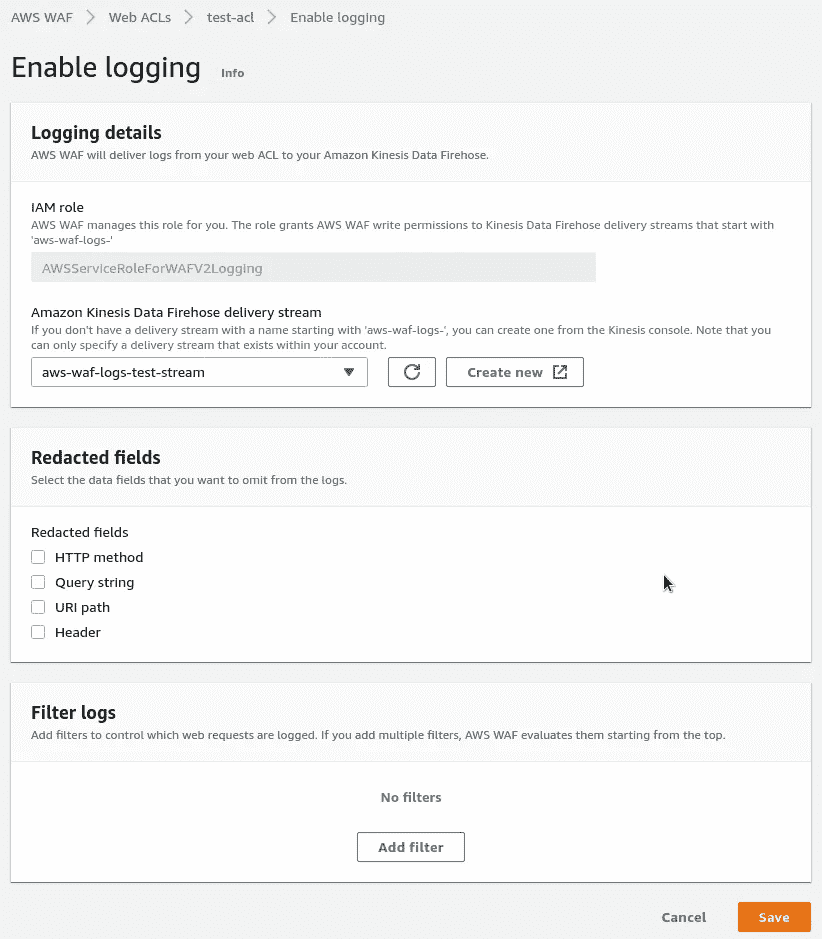

等待 5-10 分钟，您的日志将被发送到存储桶:

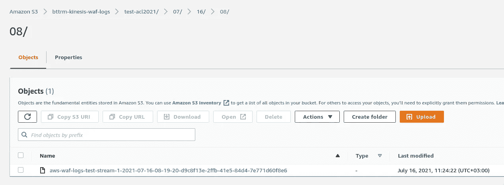

及其内容:

```
$ tail -5 aws-waf-logs-test-stream-1–2021–07–16–08–19–20-d9c8f13e-2ffb-41e5–84d4–7e771d60f8e6
{“timestamp”:1626423836381,”formatVersion”:1,”webaclId”:”arn:aws:wafv2:us-east-2:534***385:regional/webacl/test-acl/36d796cd-4767–45b3–9f03–711f6ac4ca08",”terminatingRuleId”:”test-sqli”,”terminatingRuleType”:”REGULAR”,”action”:”BLOCK”,”terminatingRuleMatchDetails”:[{“conditionType”:”SQL_INJECTION”,”location”:”QUERY_STRING”,”matchedData”:[“category=Gifts”,” — “]}],”httpSourceName”:”ALB”,”httpSourceId”:”534***385-app/k8s-testname-testingr-ce71203b0d/ca9edcc886933ca9",”ruleGroupList”:[{“ruleGroupId”:”AWS#AWSManagedRulesKnownBadInputsRuleSet”,”terminatingRule”:null,”nonTerminatingMatchingRules”:[],”excludedRules”:null}],”rateBasedRuleList”:[],”nonTerminatingMatchingRules”:[],”requestHeadersInserted”:null,”responseCodeSent”:405,”httpRequest”:{“clientIp”:”194.***.***.29",”country”:”UA”,”headers”:[{“name”:”Host”,”value”:”testapp.dev.example.com”},{“name”:”User-Agent”,”value”:”curl/7.77.0"},{“name”:”Accept”,”value”:”*/*”}],”uri”:”/products”,”args”:”category=Gifts’ — “,”httpVersion”:”HTTP/1.1",”httpMethod”:”HEAD”,”requestId”:”1–60f1421c-1ab92f9f5bc7be7f39a70c08"}}
```

现在，您可以将它们收集到 Logz.io 之类的服务中，参见[配置 Logz.io 以从 S3 桶中获取日志](https://app.logz.io/#/dashboard/send-your-data/log-sources/s3-bucket)。

尚不支持 CloudWatch Logs，但计划会添加。

# AWS ALB、Kubernetes Ingress 和 AWS WAF

因此，我们有一个 ACL:

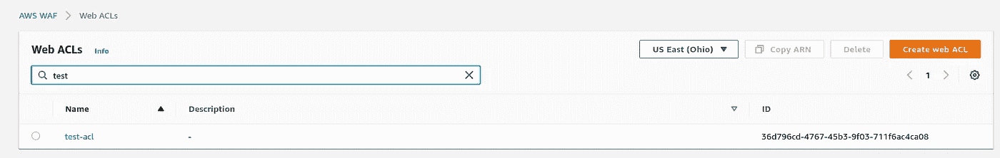

我们需要将这个 ACL 附加到一个 ALB，它是用 [AWS 负载平衡器控制器](https://rtfm.co.ua/aws-migraciya-aws-alb-ingress-controller-v1-na-aws-load-balancer-controller-v2/)从 Kubernetes 入口创建的。

为此，我们可以使用它的`[alb.ingress.kubernetes.io/wafv2-acl-arn](https://kubernetes-sigs.github.io/aws-load-balancer-controller/v2.1/guide/ingress/annotations/#wafv2-acl-arn)`。

为您的 ACL 启用 ARNs 显示:

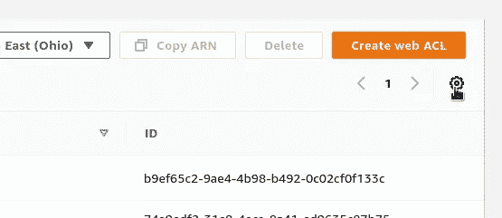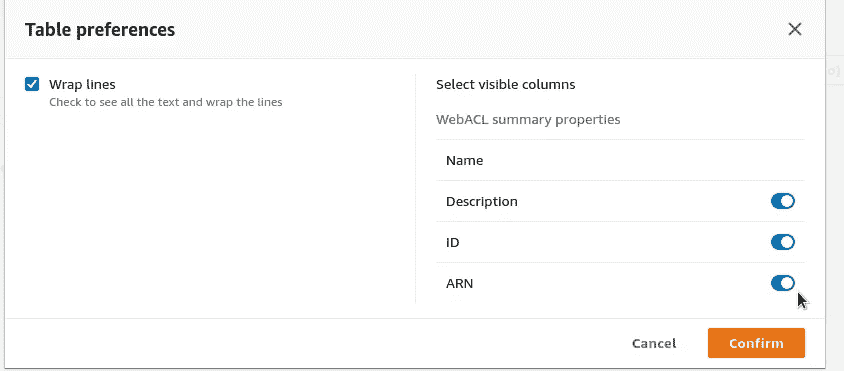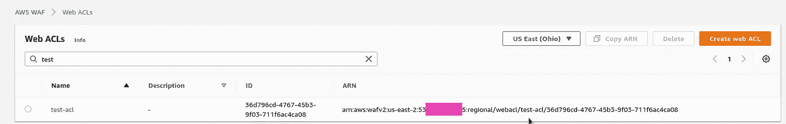

更新您的入口:

```
apiVersion: extensions/v1beta1
kind: Ingress
metadata:
  name: test-ingress
  namespace: test-namespace
  annotations:
    kubernetes.io/ingress.class: alb
    alb.ingress.kubernetes.io/scheme: internet-facing
    alb.ingress.kubernetes.io/listen-ports: '[{"HTTP": 80}]'
    alb.ingress.kubernetes.io/inbound-cidrs: 0.0.0.0/0
    alb.ingress.kubernetes.io/wafv2-acl-arn: "arn:aws:wafv2:us-east-2:534***385:regional/webacl/test-acl/36d796cd-4767-45b3-9f03-711f6ac4ca08"
...
```

应用:

```
$ kubectl apply -f test-deployment.yaml
```

检查 ACL — *关联的 AWS 资源*:

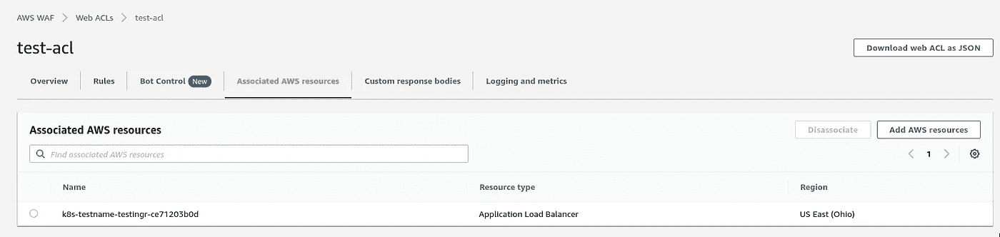

完成了。

# 有用的链接

*   [AWS 晶圆安全自动化](https://aws.amazon.com/ru/solutions/implementations/aws-waf-security-automations/)
*   [使用 AWS WAF 防止 SQL 注入攻击](https://repository.stcloudstate.edu/cgi/viewcontent.cgi?referer=&httpsredir=1&article=1094&context=msia_etds)
*   [深入研究 AWS 网络应用防火墙(WAF)](https://medium.com/@comp87/deep-dive-into-the-aws-web-application-firewall-waf-14148ea0d3d)
*   [AWS WAF 规则集示例](https://github.com/amazon-archives/aws-waf-sample)
*   [使用 Amazon ES、Amazon Athena 和 Amazon QuickSight 分析 AWS WAF 日志](https://aws.amazon.com/ru/blogs/big-data/analyzing-aws-waf-logs-with-amazon-es-amazon-athena-and-amazon-quicksight/)

*最初发布于* [*RTFM: Linux、DevOps、系统管理*](https://rtfm.co.ua/en/aws-web-application-firewall-overview-configuration-and-its-monitoring/) *。*