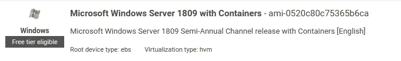

# AWS Windows Kubernetes 带 kop 的节点

> 原文：<https://itnext.io/aws-windows-kubernetes-nodes-with-kops-a2accb9ea483?source=collection_archive---------4----------------------->

如何为 Kubernetes 集群创建 kops 管理的 Windows 节点。


我们回来是为了让这变得稍微容易一点！

我首先声明，这或多或少是我几周前写的一篇文章的后续文章。本文的目的是分享我是如何创建一个完全可管理和可操作的 kops Windows 实例组的。本文还将强调上一篇文章中提到的一些错误/失误，主要是纠正使用`l2bridge`法兰绒网络解决方案而不是`overlay`法兰绒解决方案。

本文将对您的设置做一些假设和/或限制:
1)您正在使用，或将需要在`overlay`(也称为`vxlan`)模式下使用法兰绒，我无法让`host-gw`模式正常工作。你的 kops 管理的 AWS 集群使用 S3 作为后端。你正在使用至少是`1.14.0`的 Kubernetes 版本。
4)你需要使用 Windows 1809，因为`overlay`无法在任何更低版本的 Windows 上运行。

所有这些问题都解决了，让我们开始吧。

# 集群设置

如果您还没有 kops 管理的 AWS Kubernetes 集群，请创建一个。此时唯一重要的集群创建参数是您的 Kubernetes 版本`1.14.0+`和您的网络插件`flannel`。继续运行您的集群，确保一切正常。

如果您的集群没有在`1.14`上出现，那么您很可能需要在`kubeAPIServer`下设置您的`admissionControl`。这是因为 kops 还不支持`1.14`，所以我们需要手动设置。

```
kubeAPIServer:
  admissionControl:
  - NamespaceLifecycle
  - LimitRanger
  - ServiceAccount
  - PersistentVolumeLabel
  - DefaultStorageClass
  - ResourceQuota
  - DefaultTolerationSeconds
```

一旦您的集群启动，我们将需要对我们的法兰绒 DaemonSet 和配置进行一些小的修改。编辑您的法兰绒 DaemonSet，`kubectl edit ds -n kube-system kube-flannel-ds`如果您使用所有默认设置，并在 DaemonSet 的`nodeSelector`下添加`kubernetes.io/os: linux`。这将防止法兰绒容器被调度到我们的 Windows 节点上。

```
...
nodeSelector:
  beta.kubernetes.io/arch: amd64
  kubernetes.io/os: linux
...
```

我们不希望在 Windows 节点上使用法兰绒容器的原因很简单，因为它们无法工作，我们需要在 Windows 节点上运行法兰绒，同时运行 kubelet 和 kube-proxy 服务。

一旦您的 DaemonSet 被修改，我们需要对法兰绒的配置做一些细微的更改，它由两个文件`cni-conf.json`和`net-conf.json`组成。这两者都在`kube-system`名称空间下的`kube-flannel-cfg`配置图中定义。这些文件应该类似于下面的文件，除了`net-conf.json`的`Network`字段，对于您的集群可能有所不同:

```
apiVersion: v1
data:
  cni-conf.json: |
    {
      "name": "vxlan0",
      "type": "flannel",
      "delegate": {
        "forceAddress": true,
        "isDefaultGateway": true,
        "hairpinMode": true
      }
    }
  net-conf.json: |-
    {
      "Network": "100.64.0.0/10",
      "Backend": {
        "Name": "vxlan0",
        "Type": "vxlan",
        "VNI": 4096,
        "Port": 4789
    }
  }
kind: ConfigMap
...
```

您对法兰绒设置的更改现已完成，但我们还需要完成一项任务，以便法兰绒在 Windows 上正常工作。法兰绒使用分配给 DaemonSet 中每个法兰绒 Pod 的法兰绒服务帐户向 Kubernetes 进行认证。但是，法兰绒不会在我们的 Windows 节点上作为 Pod 运行，所以我们需要为 Windows 节点生成一个 kubeconfig 文件，以便从 kops S3 州存储中提取，供法兰绒使用。

我不会在这里深入讨论如何为 ServiceAccount 生成 kubeconfig 文件，但是如果您需要一些指导，我会参考[这个脚本](https://github.com/zlabjp/kubernetes-scripts/blob/master/create-kubeconfig)。或者，如果你懒的话，你也可以把你的管理库配置文件复制到 S3 州立存储中，供 Windows 调用。这显然是一个安全风险，但是如果您只是为了一个概念验证项目而遵循这一点，那就没问题了。

法兰绒的 kubeconfig 需要放在您的集群的基本 S3 前缀下的`serviceaccount/flannel.kcfg`下。默认 kops 状态存储设置下的完整路径应该类似于`s3://$BUCKET/clusterconfigs/$CLUSTER/serviceaccount/flannel.kcfg`。

最后，我们需要为节点添加一些额外的角色策略，以便 Windows 节点的启动脚本可以正常工作。我们的 Windows 节点需要能够读取 AWS EC2 标签，以及能够读取我们刚刚上传的法兰绒服务帐户文件:

```
additionalPolicies:
  node: |
    [
      {
        "Effect": "Allow",
        "Action": ["ec2:DescribeTags"],
        "Resource": ["*"]
      },
      {
        "Effect": "Allow",
        "Action": ["s3:*"],
        "Resource": [
          "arn:aws:s3:::$BUCKET/clusterconfigs/$CLUSTER/serviceaccount/flannel.kcfg"
        ]
      }
    ]
```

kops 管理的 Kubernetes 集群的设置到此结束，现在是实际创建 Windows InstanceGroup 的时候了。如果您还没有这样做，请继续将更改应用到集群，并执行滚动更新，以确保一切正常进行。

# Windows 节点安装程序

这是容易的部分，因为 Windows 节点的配置相当简单。第一步是确定您需要使用的 AMI 的 id。显然，它需要是一个 Windows 映像，但更重要的是，它需要是版本 1809。理论上，启动脚本可以在任何 Windows 1809 版本上运行，但是我只在带有容器映像的基本 1809 上测试过。



服务器 1809 与容器，您的 AMI id 可能会有所不同，由于不同的地区。

然后我们需要添加一些自定义用户数据。Kops 实际上会为这个实例组生成用户数据，但是 Windows 将不能使用这些数据。我们已经在 PowerShell 中编写了我们自己的“nodeup”脚本，它将安装所有需要的服务并正确启动 Windows 节点，所以在`additionalUserData`下，我们只需要添加:

```
additionalUserData:
- content: |
    <powershell>
      wget [https://raw.githubusercontent.com/ccpgames/platform-kube-windows-nodeup/master/powershell/Kubernetes/nodeup.ps1](https://raw.githubusercontent.com/ccpgames/platform-kube-windows-nodeup/master/powershell/Kubernetes/nodeup.ps1) -OutFile c:/nodeup.ps1
      c:/nodeup.ps1
    </powershell>
name: nodeup
type: text/cloud-config
```

一旦设置了用户数据，您就可以开始部署 Windows 节点了！保存更改并更新集群。我们发现，使用这个脚本，一个 Windows 节点加入集群只需要不到四分钟的时间。

这些节点将填充有几个节点标签和两个节点污点，一个用于操作系统，另一个用于操作系统的版本。这些污点的自动分配可以通过给 nodeup.ps1 脚本的`AutoGenerateWindowsTaints`一个假标志来禁用。如果你想这样做，你的`additionalUserData`将类似于下面的方块。

```
additionalUserData:
- content: |
  <powershell>
    wget [https://raw.githubusercontent.com/ccpgames/platform-kube-windows-nodeup/master/powershell/Kubernetes/nodeup.ps1](https://raw.githubusercontent.com/ccpgames/platform-kube-windows-nodeup/master/powershell/Kubernetes/nodeup.ps1) -OutFile c:/nodeup.ps1
    c:/nodeup.ps1 -AutoGenerateWindowsTaints:$false
  </powershell>
name: nodeup
type: text/cloud-config
```

**注意**:nodeup . PS1 脚本中可能还有一些漏洞，所以如果你发现有些地方不适合你，请在这里[创建一个问题或请求项目。](https://github.com/ccpgames/platform-kube-windows-nodeup)