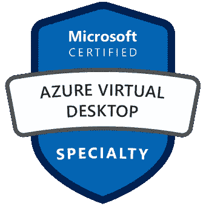

# AZ-140 Azure 虚拟桌面专业考试提示

> 原文：<https://itnext.io/az-140-azure-virtual-desktop-specialty-exam-tips-3809faf6093?source=collection_archive---------2----------------------->

我最近通过了 AZ-140 考试，并想分享一些笔记和提示，以帮助任何想获得认证的人。

您可以在此找到所涵盖主题的所有信息和 Microsoft learn 培训课程:

 [## 微软认证:Azure 虚拟桌面专业-学习

### 该考试衡量您完成以下技术任务的能力:规划 Azure 虚拟桌面架构…

docs.microsoft.com](https://docs.microsoft.com/en-us/learn/certifications/azure-virtual-desktop-specialty/) 

总的来说，我觉得这个考试比大多数 MS Azure 证书都要容易。如果你已经有了 Azure 管理员、Azure 网络或 Azure 架构师认证，这将对你很有帮助。有很多重叠，特别是在 IAM、网络(VPN /防火墙/ VNET 配置)和一般 Azure 知识方面。为了做好准备，我实际上参加了为期 4 天的 ESI 训练营，其中包括一系列演示和动手实验。实验材料可以从 Github 免费下载，我推荐您使用它来更深入地了解 AVD 是如何配置的，以及各种组件是如何配合的:

 [## GitHub-Microsoft learning/AZ-140-配置-操作-微软-Azure-虚拟桌面

### 为了支持这门课程，我们需要经常更新课程内容，使其与 Azure 保持同步…

github.com](https://github.com/MicrosoftLearning/AZ-140-Configuring-and-Operating-Microsoft-Azure-Virtual-Desktop) 

考试中重点突出的科目:

*   配置 FSLogix 配置文件。
*   Azure 网络
*   组策略
*   AVD 的 Azure 内置角色 FSLogix 所需的权限
*   AVD 许可

具体须知:

*   只有固定大小的 vhd 可用于创建映像，然后可用于创建 AVD 会话主机。
*   Depth-first =在转到下一台主机之前，加载所有用户达到会话主机最大限制的主机。Breath-first =在所有主机上平均添加用户。
*   要在存储帐户的 FSLogix 配置文件容器中成功存储配置文件，用户必须拥有存储文件数据 SMB 共享参与者角色，并修改共享上的 NTFS 权限。
*   要限制主机的出站互联网访问，请使用 NSG 规则。
*   修改 AADDC 计算机 GPO 设置，为用户配置空闲会话超时设置。
*   提要网址始终是:[https://rdweb.wvd.microsoft.com/api/arm/feeddiscovery](https://rdweb.wvd.microsoft.com/api/arm/feeddiscovery)
*   若要启用团队呼叫和会议功能，请安装远程桌面 WebRTC 重定向器服务。
*   您可以使用 msrdcw 命令来解决远程桌面客户端的问题。
*   将用户和组分配给应用程序池，以允许会话进入主机池。
*   Azure 虚拟桌面体验评估器可用于确定 Azure 中特定区域的用户延迟。
*   FSLogix 配置文件容器的最佳实践:

> 为获得最佳性能，存储解决方案和 FSLogix 配置文件容器应位于同一数据中心位置。从防病毒扫描中排除配置文件容器的 VHD(X)文件，以避免性能瓶颈。我们建议每个主机池使用一个单独的配置文件容器，同时有两个活动会话。Azure 存储的专用链接可用于实现更安全的数据访问，并改善从您的会话主机到您的存储帐户的网络延迟。这在具有快速路由连接的混合场景中也是有益的。

*   您不能使用 Azure Backup 备份映像。
*   为了获得更好的配置文件存储性能，请选择 Azure NetApp 文件而不是 Azure 文件。
*   Azure NetApp 文件快照可用于备份用户配置文件。
*   使用排出模式防止新用户连接到主机池。
*   Windows 8 不支持远程桌面客户端。
*   web 客户端不支持移动操作系统。
*   安装在 Windows server OS 上的应用程序需要 RDS CAL，安装在 windows 10 上的应用程序属于 Windows 10 企业 E3 的范围。
*   将 B 系列虚拟机用于可变工作负载，将 N 系列虚拟机用于图形密集型工作负载。d 系列支持高级存储，A 系列不支持。
*   FSLogix 预装在所有 Windows 10 企业多会话映像中。
*   可以在会话主机上的 C:\ Program Files \ FSLogix \ Apps \ Rules 中配置 FSLogix 应用程序屏蔽规则。
*   要为特定用户禁用 FSLogix 配置文件容器，请修改每个会话主机上的本地组。
*   使用 FSLogix 云缓存可以实现同步复制，从而最大限度地减少数据丢失。Azure Files 支持跨区域异步复制。
*   MSIX app attach 是一种无需在会话主机上安装应用程序即可运行容器化应用程序的解决方案。
*   在 Intune 中配置配置文件，或使用组策略来控制 Edge 中的设置。
*   使用 recovery services vault 使主机池能够故障切换到另一个区域。
*   如果使用自定义映像，请不要在虚拟机上安装 Azure 虚拟桌面代理。

希望这些提示有帮助，祝考试好运！

干杯🍻

 [## Jack Roper 正在 Azure、Azure DevOps、Terraform、Kubernetes 和 Cloud tech 上写博客！

### 希望我的博客能帮到你，你会喜欢它的内容！我真的很喜欢写技术内容和分享…

www.buymeacoffee.com](https://www.buymeacoffee.com/jackwesleyroper)