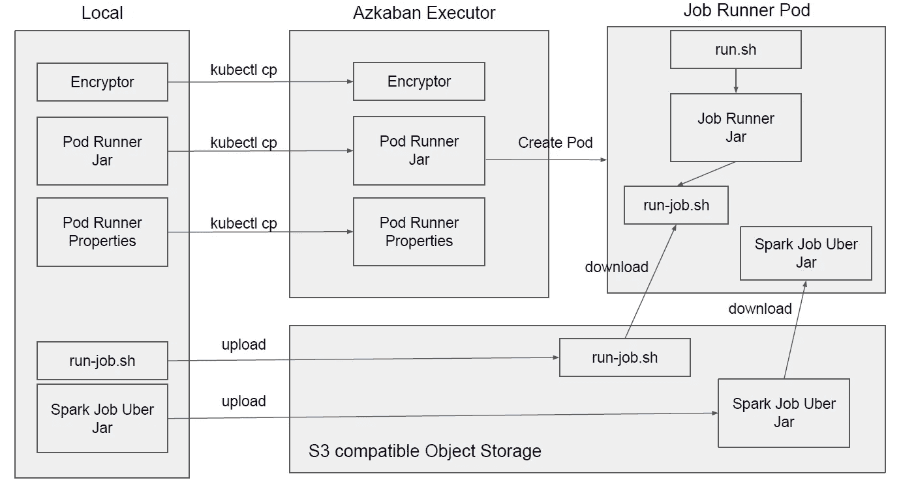

# 库贝内特斯岛上的阿兹卡班

> 原文：<https://itnext.io/azkaban-on-kubernetes-149fde21aa50?source=collection_archive---------4----------------------->


由[莎拉·多维勒](https://unsplash.com/@sarahdorweiler?utm_source=medium&utm_medium=referral)在 [Unsplash](https://unsplash.com?utm_source=medium&utm_medium=referral) 上拍摄的照片

Azkaban 是一个流行的工作流引擎，我曾多次使用它来运行作业，尤其是在数据湖中。还有类似的工作流调度程序，如 Oozie、Airflow，它们比 Azkaban 提供了更多的功能，但我更喜欢 Azkaban，因为 Azkaban 的 UI 比其他的更有吸引力。

尽管 Azkaban 提供了几种作业类型，如 hadoop、java、command、pig、hive 等，但我在大多数情况下只使用了 command 作业类型。使用命令作业类型，您可以只键入一些 shell 命令来运行作业。这很简单，而且我认为它适用于大多数情况。在本文中，将只使用命令作业类型来运行作业。

阿兹卡班由充当协调者的阿兹卡班 Web 服务器、充当工作者的阿兹卡班执行器和处理所有作业元数据的 MySQL 组成。我将在这里向你展示如何在 kubernetes 上运行阿兹卡班网络服务器、执行器和 mysql。这里使用的所有代码都可以在我的 git repo 中找到:[https://github.com/mykidong/azkaban-on-kubernetes](https://github.com/mykidong/azkaban-on-kubernetes)

# 用源代码构建阿兹卡班(可选)

因为我还没有找到预构建的 azkaban 3.x，所以我打算用 azkaban 源代码来构建。

```
cd ~;

git clone https://github.com/azkaban/azkaban.git
cd azkaban;

git checkout tags/3.90.0;

# Build and install distributions
./gradlew installDist

# package azkaban as tar files.
## db.
cd ~/azkaban/azkaban-db/build/install;
tar -zcf azkaban-db-3.90.0.tar.gz azkaban-db;

## executor.
cd ~/azkaban/azkaban-exec-server/build/install;
tar -zcf azkaban-exec-server-3.90.0.tar.gz azkaban-exec-server;

## web.
d ~/azkaban/azkaban-web-server/build/install;
tar -zcf azkaban-web-server-3.90.0.tar.gz azkaban-web-server;
```

我们需要三个包，分别是 azkaban db 其中有 sql 脚本创建 azkaban 数据库和 mysql 中的表，azkaban executor 和 web 服务器。把阿兹卡班打包成 gz 后，我已经把这些包上传到 google drive 了。

# 创建阿兹卡班码头形象

在这里，我将为 azkaban 数据库、执行器和 web 服务器构建 azkaban docker 映像。

首先，让我们看看 azkaban db 的 Dockerfile，它用于创建 azkaban 数据库和 mysql db 的表。

```
FROM java:8-jre

ENV *APP_HOME* /opt/azkaban-db

RUN echo "Asia/Seoul" > /etc/timezone
RUN dpkg-reconfigure -f noninteractive tzdata

RUN useradd -ms /bin/bash -d ${*APP_HOME*} db

RUN set -ex \
    && AZKABAN_DB_NAME=azkaban-db-3.90.0 \
    && fileId=1_oYPbDg3MKAu4RjL0P-_ZIl5ixlPgq04 \
    && fileName=${*AZKABAN_DB_NAME*}.tar.gz \
    && curl -sc /tmp/cookie "https://drive.google.com/uc?export=download&id=${*fileId*}" > /dev/null \
    && code="$(awk '/_warning_/ {print $*NF*}' /tmp/cookie)" \
    && curl -Lb /tmp/cookie "https://drive.google.com/uc?export=download&confirm=${*code*}&id=${*fileId*}" -o ${*fileName*} \
    && tar -zxf ${*fileName*} -C ${*APP_HOME*} \
    && cp -R ${*APP_HOME*}/azkaban-db/* ${*APP_HOME*}/ \
    && rm -rf ${*APP_HOME*}/azkaban-db \
    && rm -rf ${*fileName*}

RUN chown db: -R ${*APP_HOME*}

RUN echo "deb [check-valid-until=no] http://cdn-fastly.deb.debian.org/debian jessie main" > /etc/apt/sources.list.d/jessie.list
RUN echo "deb [check-valid-until=no] http://archive.debian.org/debian jessie-backports main" > /etc/apt/sources.list.d/jessie-backports.list
RUN sed -i '/deb http:\/\/deb.debian.org\/debian jessie-updates main/d' /etc/apt/sources.list
RUN apt-get -o Acquire::Check-Valid-Until=false update

RUN apt-get -y -f install mysql-client

USER db
```

如上图所示，阿兹卡班 db 包是从 google drive 下载的，它是由 tar 提取的。注意`mysql-client`安装在文件的末尾。

接下来，我们来看看阿兹卡班的执行者 Dockerfile。

```
FROM java:8-jre

ENV *APP_HOME* /opt/azkaban-executor

RUN echo "Asia/Seoul" > /etc/timezone
RUN dpkg-reconfigure -f noninteractive tzdata

RUN useradd -ms /bin/bash -d ${*APP_HOME*} executor

RUN set -ex \
    && AZKABAN_EXEC_NAME=azkaban-exec-server-3.90.0 \
    && fileId=15jllIx3eAmAb9d-GZ_KISWxnZuAJiP5r \
    && fileName=${*AZKABAN_EXEC_NAME*}.tar.gz \
    && curl -sc /tmp/cookie "https://drive.google.com/uc?export=download&id=${*fileId*}" > /dev/null \
    && code="$(awk '/_warning_/ {print $*NF*}' /tmp/cookie)" \
    && curl -Lb /tmp/cookie "https://drive.google.com/uc?export=download&confirm=${*code*}&id=${*fileId*}" -o ${*fileName*} \
    && tar -zxf ${*fileName*} -C ${*APP_HOME*} \
    && cp -R ${*APP_HOME*}/azkaban-exec-server/* ${*APP_HOME*}/ \
    && rm -rf ${*APP_HOME*}/azkaban-exec-server \
    && rm -rf ${*APP_HOME*}/conf/azkaban.properties \
    && rm -rf ${*fileName*}

COPY activate-executor.sh ${*APP_HOME*}/bin/activate-executor.sh
COPY start-exec.sh ${*APP_HOME*}/bin/start-exec.sh
COPY start-and-activate-exec.sh ${*APP_HOME*}/bin/start-and-activate-exec.sh

RUN chmod a+x -R ${*APP_HOME*}/bin
RUN chown executor: -R ${*APP_HOME*}

RUN echo "deb [check-valid-until=no] http://cdn-fastly.deb.debian.org/debian jessie main" > /etc/apt/sources.list.d/jessie.list
RUN echo "deb [check-valid-until=no] http://archive.debian.org/debian jessie-backports main" > /etc/apt/sources.list.d/jessie-backports.list
RUN sed -i '/deb http:\/\/deb.debian.org\/debian jessie-updates main/d' /etc/apt/sources.list
RUN apt-get -o Acquire::Check-Valid-Until=false update
RUN apt-get install -y openssh-client

USER executor
RUN ssh-keygen -t rsa -N "" -f ~/.ssh/id_rsa
WORKDIR ${*APP_HOME*}
```

类似于 azkaban db dockerfile，下载并解压 azkaban executor 包。复制一些 shell 文件，最后生成 ssh 密钥，用于通过 ssh 连接远程机器。

阿兹卡班网络服务器:

```
FROM java:8-jre

ENV *APP_HOME* /opt/azkaban-web

RUN echo "Asia/Seoul" > /etc/timezone
RUN dpkg-reconfigure -f noninteractive tzdata

RUN useradd -ms /bin/bash -d ${*APP_HOME*} web

RUN set -ex \
    && AZKABAN_WEB_NAME=azkaban-web-server-3.90.0 \
    && fileId=1GzVG5_aKlG8Mb38M3a10jF8X-VYpSxJx \
    && fileName=${*AZKABAN_WEB_NAME*}.tar.gz \
    && curl -sc /tmp/cookie "https://drive.google.com/uc?export=download&id=${*fileId*}" > /dev/null \
    && code="$(awk '/_warning_/ {print $*NF*}' /tmp/cookie)" \
    && curl -Lb /tmp/cookie "https://drive.google.com/uc?export=download&confirm=${*code*}&id=${*fileId*}" -o ${*fileName*} \
    && tar -zxf ${*fileName*} -C ${*APP_HOME*} \
    && cp -R ${*APP_HOME*}/azkaban-web-server/* ${*APP_HOME*}/ \
    && rm -rf ${*APP_HOME*}/azkaban-web-server \
    && rm -rf ${*APP_HOME*}/conf/azkaban.properties \
    && rm -rf ${*fileName*}

COPY start-web.sh ${*APP_HOME*}/bin/start-web.sh

RUN chmod a+x -R ${*APP_HOME*}/bin
RUN chown web: -R ${*APP_HOME*}

EXPOSE 8081
USER web
WORKDIR ${*APP_HOME*}
```

Azkaban web 服务器将暴露端口 8081。

你可以像这样构建阿兹卡班的所有组件。

```
# remove azkaban docker images.
docker rmi -f $(docker images -a | grep azkaban | awk '{print $3}')

# azkaban db docker image.
cd <src>/docker/db;
docker build . -t yourrepo/azkaban-db:3.90.0;

## push.
docker push yourrepo/azkaban-db:3.90.0;

# azkaban executor image.
cd <src>/docker/executor;
docker build . -t yourrepo/azkaban-exec-server:3.90.0;

## push.
docker push yourrepo/azkaban-exec-server:3.90.0;

# azkaban web image.
cd <src>/docker/web;
docker build . -t yourrepo/azkaban-web-server:3.90.0;

## push.
docker push yourrepo/azkaban-web-server:3.90.0;
```

现在，你的知识库中有阿兹卡班的 docker 图像。

# 在 Kubernetes 上运行阿兹卡班

在源代码中找到了几个 kubernetes yaml 文件。

在`mysql.yaml`中，你必须改变存储等级。

```
storageClassName: direct.csi.min.io
```

在所有 yaml 文件中找到的 azkaban 映像的所有 docker repo 名称都应该更改为您的 docker repo 名称，例如在`azkaban-executor.yaml`:

```
image: yourrepo/azkaban-exec-server:3.90.0
```

现在，您已经准备好在 kubernetes 上运行 azkaban 了，让我们键入以下内容:

```
## ---- init.
# create mysql server.
kubectl apply -f mysql.yaml;

# wait for mysql pod being ready.
while [[ $(kubectl get pods -n azkaban -l app=mysql -o 'jsonpath={..status.conditions[?(@.type=="Ready")].status}') != "True" ]]; do echo "waiting for mysql pod being ready" && sleep 1; done

# configmaps
kubectl create configmap azkaban-cfg --dry-run --from-file=azkaban-executor.properties --from-file=azkaban-web.properties -o yaml -n azkaban | kubectl apply -f -

# create db and tables.
kubectl apply -f init-schema.yaml;

# wait for job being completed.
while [[ $(kubectl get pods -n azkaban -l job-name=azakban-initschema -o jsonpath={..status.phase}) != *"Succeeded"* ]]; do echo "waiting for finishing init schema job" && sleep 2; done

## ---- azkaban.
# create azkaban executor.
kubectl apply -f azkaban-executor.yaml;

# wait for azkaban executor being run
while [[ $(kubectl get pods -n azkaban -l app=azkaban-executor -o jsonpath={..status.phase}) != *"Running"* ]]; do echo "waiting for executor being run" && sleep 2; done

# create azkaban web.
kubectl apply -f azkaban-web.yaml;
```

让我们看看阿兹卡班命名空间中的豆荚。看起来是这样的:

```
kubectl get po -n azkaban;
NAME                           READY   STATUS       RESTARTS   AGE
azakban-initschema-hr4bn       0/1     Init:Error   0          4h3m
azakban-initschema-kg75t       0/1     Completed    0          4h3m
azakban-initschema-ppngd       0/1     Init:Error   0          4h3m
azkaban-executor-0             1/1     Running      0          3h19m
azkaban-executor-1             1/1     Running      0          3h18m
azkaban-executor-2             1/1     Running      0          3h18m
azkaban-web-664967cb99-xhmrf   1/1     Running      0          3h9m
mysql-statefulset-0            1/1     Running      0          4h3m
```

正如这里看到的，一个 mysql 服务器，三个 executor 服务器，一个 web 服务器运行在 kubernetes 上。

# 访问用户界面

要访问 UI，让我们看看阿兹卡班名称空间中的服务。

```
kubectl get svc -n azkaban;
NAME               TYPE           CLUSTER-IP      EXTERNAL-IP     PORT(S)          AGE
azkaban-executor   ClusterIP      None            <none>          <none>           3h20m
azkaban-web        LoadBalancer   10.233.49.152   52.231.165.73   8081:31538/TCP   3h9m
mysql-service      ClusterIP      10.233.53.51    <none>          3306/TCP         4h4m
```

使用`azkaban-web`服务的外部 ip，您可以在浏览器中访问 UI:

```
http://52.231.165.73:8081/
```

# 阿兹卡班烟雾试验

您可以通过运行示例项目来测试 azkaban。

```
# install azkaban cli.
sudo pip install --upgrade "urllib3==1.22" azkaban;

# download sample projects and create project with azkaban cli.
wget https://github.com/azkaban/azkaban/raw/master/az-examples/flow20-projects/basicFlow20Project.zip;
wget https://github.com/azkaban/azkaban/raw/master/az-examples/flow20-projects/embeddedFlow20Project.zip;

azkaban upload -c -p basicFlow20Project -u azkaban@http://52.231.165.73:8081 ./basicFlow20Project.zip;
azkaban upload -c -p embeddedFlow20Project -u azkaban@http://52.231.165.73:8081 ./embeddedFlow20Project.zip;
```

# 从阿兹卡班执行程序在远程机器上运行 shell

根据我的大多数经验，我使用位于远程机器上的 shell，它将通过 ssh 在 azkaban executors 中远程调用。

这是 azkaban executor 调用远程 shell 来运行 spark job 的另一个例子。比方说，因为 spark 和 kubectl 安装在远程机器上，所以它准备向那里的 kubernetes 提交 spark 作业。为此，必须启用从 azkaban executor 到远程机器的 ssh 访问。

让我们把阿兹卡班执行者的公钥复制到远程机器上。

```
# list pods.
kubectl get po -n azkaban
NAME                           READY   STATUS       RESTARTS   AGE
azakban-initschema-9bgbh       0/1     Completed    0          16h
azakban-initschema-dtgg7       0/1     Init:Error   0          16h
azakban-initschema-fw7gt       0/1     Init:Error   0          16h
azkaban-executor-0             1/1     Running      0          16h
azkaban-executor-1             1/1     Running      0          16h
azkaban-executor-2             1/1     Running      0          16h
azkaban-web-664967cb99-z8dzn   1/1     Running      0          16h
mysql-statefulset-0            1/1     Running      0          16h

# access executor pod to get public key.
kubectl exec -it azkaban-executor-0 -n azkaban -- cat .ssh/id_rsa.pub;
ssh-rsa AAAAB3NzaC1yc2EAAAADAQABAAABAQC0vuKKMz4dD0aBrJKtlVU8fDmYgqkwpkDXTzoUTqm57CqEmzHa5EDS90xGch1rAN4HucOR6dzUGvb2VlATBGIi5VZ6w0OuRR+r50KHqiC0TLdEXzX1/TRO/uHftI/xdUMFDHOWTuZnsYS5V7DCrw1yJnPzHTHktgXDyycM/iEspdfslzgZuIV4zT3HNVAYIplQPyy8TKRy7gojm7OYw5W2S14hqiY5/HL/CZ9CQpKV37qJvd3E4u/pOZCHH7r1Tm5E3bnUX9U8z7Nj0Fb+TZSkxiEbwoKB/Ib07Urc0il2f4mug2bKazZRsU+/bb1+VjoMW0ek+9Rvk1JTkaXIu8k/ executor@33842653d6db# copy this executor public key and paste it to authorized_keys file in remote machine.
## in remote machine.
vi ~/.ssh/authorized_keys;
... paste public key.

# chmod 600.
chmod 600 ~/.ssh/authorized_keys;
```

然后，在单独的阿兹卡班执行器中通过 ssh 登录到远程机器:

```
kubectl exec -it azkaban-executor-0 -n azkaban -- sh;
ssh pcp@x.x.x.x;
...
exit;
```

让我们创建 shell 来在远程机器上运行一个示例 spark 作业:

```
cat > run-spark-example.sh <<'EOF'
############## spark job: create delta table

# submit spark job onto kubernetes.
export MASTER=k8s://https://xxxx:6443;
export NAMESPACE=ai-developer;
export ENDPOINT=http://$(kubectl get svc s3g-service -n ai-developer -o jsonpath={.status.loadBalancer.ingress[0].ip}):9898;
export HIVE_METASTORE=metastore.ai-developer:9083;

spark-submit \
--master ${MASTER} \
--deploy-mode cluster \
--name spark-delta-example \
--class io.spongebob.spark.examples.DeltaLakeExample \
--packages com.amazonaws:aws-java-sdk-s3:1.11.375,org.apache.hadoop:hadoop-aws:3.2.0 \
--conf spark.kubernetes.driver.volumes.persistentVolumeClaim.checkpointpvc.mount.path=/checkpoint \
--conf spark.kubernetes.driver.volumes.persistentVolumeClaim.checkpointpvc.mount.subPath=checkpoint \
--conf spark.kubernetes.driver.volumes.persistentVolumeClaim.checkpointpvc.mount.readOnly=false \
--conf spark.kubernetes.driver.volumes.persistentVolumeClaim.checkpointpvc.options.claimName=spark-driver-pvc \
--conf spark.kubernetes.executor.volumes.persistentVolumeClaim.checkpointpvc.mount.path=/checkpoint \
--conf spark.kubernetes.executor.volumes.persistentVolumeClaim.checkpointpvc.mount.subPath=checkpoint \
--conf spark.kubernetes.executor.volumes.persistentVolumeClaim.checkpointpvc.mount.readOnly=false \
--conf spark.kubernetes.executor.volumes.persistentVolumeClaim.checkpointpvc.options.claimName=spark-exec-pvc \
--conf spark.kubernetes.driver.volumes.persistentVolumeClaim.spark-local-dir-localdirpvc.mount.path=/localdir \
--conf spark.kubernetes.driver.volumes.persistentVolumeClaim.spark-local-dir-localdirpvc.mount.readOnly=false \
--conf spark.kubernetes.driver.volumes.persistentVolumeClaim.spark-local-dir-localdirpvc.options.claimName=spark-driver-localdir-pvc \
--conf spark.kubernetes.executor.volumes.persistentVolumeClaim.spark-local-dir-localdirpvc.mount.path=/localdir \
--conf spark.kubernetes.executor.volumes.persistentVolumeClaim.spark-local-dir-localdirpvc.mount.readOnly=false \
--conf spark.kubernetes.executor.volumes.persistentVolumeClaim.spark-local-dir-localdirpvc.options.claimName=spark-exec-localdir-pvc \
--conf spark.kubernetes.file.upload.path=s3a://mykidong/spark-examples \
--conf spark.kubernetes.container.image.pullPolicy=Always \
--conf spark.kubernetes.namespace=$NAMESPACE \
--conf spark.kubernetes.container.image=xxx/spark:v3.0.0 \
--conf spark.kubernetes.authenticate.driver.serviceAccountName=spark \
--conf spark.hadoop.hive.metastore.client.connect.retry.delay=5 \
--conf spark.hadoop.hive.metastore.client.socket.timeout=1800 \
--conf spark.hadoop.hive.metastore.uris=thrift://$HIVE_METASTORE \
--conf spark.hadoop.hive.server2.enable.doAs=false \
--conf spark.hadoop.hive.server2.thrift.http.port=10002 \
--conf spark.hadoop.hive.server2.thrift.port=10016 \
--conf spark.hadoop.hive.server2.transport.mode=binary \
--conf spark.hadoop.metastore.catalog.default=spark \
--conf spark.hadoop.hive.execution.engine=spark \
--conf spark.hadoop.hive.input.format=io.delta.hive.HiveInputFormat \
--conf spark.hadoop.hive.tez.input.format=io.delta.hive.HiveInputFormat \
--conf spark.sql.warehouse.dir=s3a:/mykidong/apps/spark/warehouse \
--conf spark.hadoop.fs.defaultFS=s3a://mykidong \
--conf spark.hadoop.fs.s3a.access.key=any-access-key \
--conf spark.hadoop.fs.s3a.secret.key=any-secret-key \
--conf spark.hadoop.fs.s3a.connection.ssl.enabled=true \
--conf spark.hadoop.fs.s3a.endpoint=$ENDPOINT \
--conf spark.hadoop.fs.s3a.impl=org.apache.hadoop.fs.s3a.S3AFileSystem \
--conf spark.hadoop.fs.s3a.fast.upload=true \
--conf spark.hadoop.fs.s3a.path.style.access=true \
--conf spark.driver.extraJavaOptions="-Divy.cache.dir=/tmp -Divy.home=/tmp" \
--conf spark.executor.instances=3 \
--conf spark.executor.memory=2G \
--conf spark.executor.cores=1 \
--conf spark.driver.memory=1G \
file:///home/pcp/xxx/examples/spark/target/spark-example-1.0.0-SNAPSHOT-spark-job.jar \
--master ${MASTER};
EOF# make it executable
chmod a+x run-spark-example.sh;
```

让我们创造阿兹卡班的流动脚本，`spark.flow`

```
---
config:
  failure.emails: mykidong@gmail.com

nodes:
- name: Start
  type: noop

- name: RunSparkJob
  type: command
  config:
    command: ssh pcp@x.x.x.x "/home/pcp/run-spark-example.sh"
  dependsOn:
  - Start

- name: End
  type: noop
  dependsOn:
  - RunSparkJob
```

看一下上面流程中的命令。`run-spark-example.sh`位于远程的机器将通过 ssh 被调用。

让我们创建流元文件，命名为`flow20.project`:

```
azkaban-flow-version: 2.0
```

最后，让我们将 azkaban 项目压缩并上传到 azkaban web 服务器。

```
# build azkaban project. 
zip spark-job-example.zip azkaban/*; # create azkaban project. 
azkaban upload -c -p spark-job-example -u azkaban@http://52.231.165.73:8081 ./spark-job-example.zip;
```

# 在阿兹卡班执行程序中运行 Pod Runner 来创建作业 Pod

这是从阿兹卡班执行者那里运行作业的另一个场景。阿兹卡班执行者中的嵌入式 pod runner 将创建 pod，该 pod 向 kubernetes 提交 spark 作业。

下面显示了在由 azkaban executor 的 pod runner 创建的 pod 中运行 spark 作业的示例场景。



阿兹卡班执行程序中的嵌入式 Pod Runner 将创建一个 Spark 作业提交 Pod，其中所有必需的 deps spark uber jar 和 run-job.sh 脚本都是从 S3 下载的。请注意，在阿兹卡班运行 job 之前，您必须将所有必需的运行 shell 脚本和 jar 上传到 S3。

为了理解如何创建作业单元，让我们来看看`ResourceController`类中的细节:

```
package io.mykidong.kubernetes;

import io.fabric8.kubernetes.api.model.HasMetadata;
import io.fabric8.kubernetes.api.model.Pod;
import io.fabric8.kubernetes.client.KubernetesClient;
import io.fabric8.kubernetes.client.KubernetesClientException;
import io.fabric8.kubernetes.client.dsl.LogWatch;
import io.mykidong.domain.Kubeconfig;
import io.mykidong.kubernetes.client.KubernetesClientUtils;
import org.slf4j.Logger;
import org.slf4j.LoggerFactory;

import java.io.InputStream;
import java.util.List;
import java.util.concurrent.TimeUnit;

public class ResourceController {

    private static Logger *LOG* = LoggerFactory.*getLogger*(ResourceController.class);

    public static void runPod(Kubeconfig kubeconfig, String namespace, InputStream jobResourceInputStream) {
        try  {
            KubernetesClient adminClient = KubernetesClientUtils.*newClient*(kubeconfig);

            List<HasMetadata> resources = adminClient.load(jobResourceInputStream).get();
            HasMetadata resource = resources.get(0);
            if (resource instanceof Pod){
                Pod pod = (Pod) resource;
                Pod result = adminClient.pods().inNamespace(namespace).create(pod);
                String podName = result.getMetadata().getName();
                *LOG*.info("podName: {}", podName);

                LogWatch watch = adminClient.pods().inNamespace(namespace).withName(podName).tailingLines(10).watchLog(System.*out*);

                long start = System.*currentTimeMillis*();
                while(true) {
                    String phase = adminClient.pods().inNamespace(namespace).withName(podName).get().getStatus().getPhase();
                    *LOG*.info("phase: {}", phase);
                    if(phase.equals("Failed")) {
                        throw new RuntimeException(podName + " job failed!");
                    } else if(phase.equals("Succeeded")) {
                        break;
                    }

                    Thread.*sleep*(5 * 1000);
                    long elapsed = (System.*currentTimeMillis*() - start) / 1000;
                    // more than 3 hours.
                    if(elapsed > (3 * 60 * 60)) {
                        throw new RuntimeException(podName + " job takes too long time!");
                    }
                }

            } else {
                System.*err*.println("Loaded resource is not a Pod! " + resource);
            }
        } catch (KubernetesClientException e) {
            *LOG*.error(e.getMessage(), e);
            throw new RuntimeException(e);
        } catch (Exception e) {
            *LOG*.error(e.getMessage(), e);
            throw new RuntimeException(e);
        }
    }
}
```

该类创建一个作业窗格，并等待作业窗格完成。如果 pod 状态阶段是`Failed`，那么将抛出一个异常，如果作业需要超过 3 个小时，那么将抛出一个异常。阿兹卡班会将此类异常情况解释为作业失败状态，并在阿兹卡班 UI 中显示作业失败消息。

让我们按照下面的步骤在 pod 中运行 spark 提交作业。

## 将本地文件，如加密器、pod runner jar 和 pod runner 属性复制到阿兹卡班执行器

首先，您必须通过 kubectl cp 将 encryptor 等文件复制到 azkaban executor，以加密密钥，将 pod runner jar 复制到 job pod，并将 pod runner 属性复制到 azkaban executor。pod runner 属性中的值都是加密的，使用 encryptor，加密密钥将被解密，所有其他属性都将使用加密密钥解密。

```
# list azkaban pods.
kubectl get po -n azkaban
NAME                           READY   STATUS    RESTARTS   AGE
azkaban-executor-0             1/1     Running   0          2d10h
azkaban-executor-1             1/1     Running   0          5d22h
azkaban-executor-2             1/1     Running   0          5d22h
azkaban-web-664967cb99-z8dzn   1/1     Running   0          5d22h
mysql-statefulset-0            1/1     Running   0          5d22h# cp encryptor to executor.
kubectl cp <src>/encryptor/enc azkaban-executor-0:/opt/azkaban-executor -n azkaban;
kubectl cp <src>/encryptor/enc azkaban-executor-1:/opt/azkaban-executor -n azkaban;
kubectl cp <src>/encryptor/enc azkaban-executor-2:/opt/azkaban-executor -n azkaban;## enc executable.
kubectl exec -it azkaban-executor-0 -n azkaban -- chmod a+x enc;
kubectl exec -it azkaban-executor-1 -n azkaban -- chmod a+x enc;
kubectl exec -it azkaban-executor-2 -n azkaban -- chmod a+x enc;# cp pod runner jar to executor.
kubectl cp <src>/pod-runner/target/pod-runner-1.0.0-SNAPSHOT-fat.jar azkaban-executor-0:/opt/azkaban-executor -n azkaban;
kubectl cp <src>/pod-runner/target/pod-runner-1.0.0-SNAPSHOT-fat.jar azkaban-executor-1:/opt/azkaban-executor -n azkaban;
kubectl cp <src>/pod-runner/target/pod-runner-1.0.0-SNAPSHOT-fat.jar azkaban-executor-2:/opt/azkaban-executor -n azkaban;# cp pod runner properties to executor.
kubectl cp <src>/pod-runner/src/main/resources/pod-runner.properties azkaban-executor-0:/opt/azkaban-executor -n azkaban;
kubectl cp <src>/pod-runner/src/main/resources/pod-runner.properties azkaban-executor-1:/opt/azkaban-executor -n azkaban;
kubectl cp <src>/pod-runner/src/main/resources/pod-runner.properties azkaban-executor-2:/opt/azkaban-executor -n azkaban;
```

## 构建 Spark Job Runner Docker

因为我要在 pod 中提交 spark 作业，所以我们必须构建一个 spark 作业运行器 docker 映像，其中安装了 spark 和 kubectl。这张图片是基于我之前已经构建好的 spark 3.x。

让我们看看档案。

```
FROM mykidong/spark:v3.0.0

ENV *APP_HOME* /opt/spark

RUN echo "Asia/Seoul" > /etc/timezone
RUN dpkg-reconfigure -f noninteractive tzdata

RUN useradd -ms /bin/bash -d ${*APP_HOME*} spark

COPY enc ${*APP_HOME*}/
COPY pod-runner-1.0.0-*-fat.jar ${*APP_HOME*}/
COPY run.sh ${*APP_HOME*}/
RUN chmod a+x ${*APP_HOME*}/*.sh

RUN chmod a+x -R ${*APP_HOME*}/bin
RUN chown spark: -R ${*APP_HOME*}

RUN echo "deb [check-valid-until=no] http://cdn-fastly.deb.debian.org/debian jessie main" > /etc/apt/sources.list.d/jessie.list
RUN echo "deb [check-valid-until=no] http://archive.debian.org/debian jessie-backports main" > /etc/apt/sources.list.d/jessie-backports.list
RUN sed -i '/deb http:\/\/deb.debian.org\/debian jessie-updates main/d' /etc/apt/sources.list
RUN apt-get -o Acquire::Check-Valid-Until=false update
RUN apt-get install -y openssh-client
RUN apt-get install -y curl
RUN apt-get install -y unzip
RUN curl "https://awscli.amazonaws.com/awscli-exe-linux-x86_64.zip" -o "awscliv2.zip" && unzip awscliv2.zip && ./aws/install

RUN apt-get install -y apt-transport-https gnupg2
RUN curl -s https://packages.cloud.google.com/apt/doc/apt-key.gpg | apt-key add -
RUN echo "deb https://apt.kubernetes.io/ kubernetes-xenial main" | tee -a /etc/apt/sources.list.d/kubernetes.list
RUN apt-get -o Acquire::Check-Valid-Until=false update
RUN apt-get install -y kubectl

USER spark
RUN export SPARK_HOME=${*APP_HOME*} && export PATH=$*PATH*:${*SPARK_HOME*}/bin
WORKDIR ${*APP_HOME*}
```

请注意，将安装 aws cli 和 kubectl，因为这个映像基于 spark 3.x，所以已经安装了 spark。

让我们为 spark 作业提交构建 docker 映像:

```
# remove spark job runner docker.
docker rmi -f $(docker images -a | grep spark-job-runner | awk '{print $3}')# build docker of spark job runner.
cd <src>/pod-runner/docker/spark;## copy some files.
cp <src>/encryptor/enc .;
cp <src>/pod-runner/src/main/resources/shell/run.sh .;
cp <src>/pod-runner/target/pod-runner-*-fat.jar .;## build docker.
docker build . -t mykidong/spark-job-runner:v3.0.0;# push docker of spark job runner.
docker push mykidong/spark-job-runner:v3.0.0;
```

## 创建运行 spark 作业外壳

现在，创建一个 run-job.sh 来提交 pod 中的 spark 作业。

```
cat > run-spark.sh <<'EOF'# export spark home and path.
export SPARK_HOME=.;
export PATH=$PATH:${SPARK_HOME}/bin;# export kubeconfig.
export KUBECONFIG=kubeconfig;# export spark job jar.
export SPARK_JOB_JAR=spark-example-1.0.0-SNAPSHOT-spark-job.jar;# download spark job jar from s3.
aws s3api --profile=minio --endpoint=$S3_ENDPOINT get-object --bucket mykidong --key test/${SPARK_JOB_JAR} ./${SPARK_JOB_JAR};############## spark job: create delta table# submit spark job onto kubernetes.
export MASTER=k8s://[https://xxx:6443](https://xxx:6443);
export NAMESPACE=ai-developer;
export ENDPOINT=[https://any-s3-endpoint](https://any-s3-endpoint);
export HIVE_METASTORE=metastore.ai-developer:9083;spark-submit \
--master ${MASTER} \
--deploy-mode cluster \
--name spark-delta-example \
--class io.mykidong.spark.examples.DeltaLakeExample \
--packages com.amazonaws:aws-java-sdk-s3:1.11.375,org.apache.hadoop:hadoop-aws:3.2.0 \
--conf spark.kubernetes.driver.volumes.persistentVolumeClaim.checkpointpvc.mount.path=/checkpoint \
--conf spark.kubernetes.driver.volumes.persistentVolumeClaim.checkpointpvc.mount.subPath=checkpoint \
--conf spark.kubernetes.driver.volumes.persistentVolumeClaim.checkpointpvc.mount.readOnly=false \
--conf spark.kubernetes.driver.volumes.persistentVolumeClaim.checkpointpvc.options.claimName=spark-driver-pvc \
--conf spark.kubernetes.executor.volumes.persistentVolumeClaim.checkpointpvc.mount.path=/checkpoint \
--conf spark.kubernetes.executor.volumes.persistentVolumeClaim.checkpointpvc.mount.subPath=checkpoint \
--conf spark.kubernetes.executor.volumes.persistentVolumeClaim.checkpointpvc.mount.readOnly=false \
--conf spark.kubernetes.executor.volumes.persistentVolumeClaim.checkpointpvc.options.claimName=spark-exec-pvc \
--conf spark.kubernetes.driver.volumes.persistentVolumeClaim.spark-local-dir-localdirpvc.mount.path=/localdir \
--conf spark.kubernetes.driver.volumes.persistentVolumeClaim.spark-local-dir-localdirpvc.mount.readOnly=false \
--conf spark.kubernetes.driver.volumes.persistentVolumeClaim.spark-local-dir-localdirpvc.options.claimName=spark-driver-localdir-pvc \
--conf spark.kubernetes.executor.volumes.persistentVolumeClaim.spark-local-dir-localdirpvc.mount.path=/localdir \
--conf spark.kubernetes.executor.volumes.persistentVolumeClaim.spark-local-dir-localdirpvc.mount.readOnly=false \
--conf spark.kubernetes.executor.volumes.persistentVolumeClaim.spark-local-dir-localdirpvc.options.claimName=spark-exec-localdir-pvc \
--conf spark.kubernetes.file.upload.path=s3a://mykidong/spark-examples \
--conf spark.kubernetes.container.image.pullPolicy=Always \
--conf spark.kubernetes.namespace=$NAMESPACE \
--conf spark.kubernetes.container.image=mykidong/spark:v3.0.0 \
--conf spark.kubernetes.authenticate.driver.serviceAccountName=spark \
--conf spark.hadoop.hive.metastore.client.connect.retry.delay=5 \
--conf spark.hadoop.hive.metastore.client.socket.timeout=1800 \
--conf spark.hadoop.hive.metastore.uris=thrift://$HIVE_METASTORE \
--conf spark.hadoop.hive.server2.enable.doAs=false \
--conf spark.hadoop.hive.server2.thrift.http.port=10002 \
--conf spark.hadoop.hive.server2.thrift.port=10016 \
--conf spark.hadoop.hive.server2.transport.mode=binary \
--conf spark.hadoop.metastore.catalog.default=spark \
--conf spark.hadoop.hive.execution.engine=spark \
--conf spark.hadoop.hive.input.format=io.delta.hive.HiveInputFormat \
--conf spark.hadoop.hive.tez.input.format=io.delta.hive.HiveInputFormat \
--conf spark.sql.warehouse.dir=s3a:/mykidong/apps/spark/warehouse \
--conf spark.hadoop.fs.defaultFS=s3a://mykidong \
--conf spark.hadoop.fs.s3a.access.key=xxx \
--conf spark.hadoop.fs.s3a.secret.key=xxx \
--conf spark.hadoop.fs.s3a.connection.ssl.enabled=true \
--conf spark.hadoop.fs.s3a.endpoint=$ENDPOINT \
--conf spark.hadoop.fs.s3a.impl=org.apache.hadoop.fs.s3a.S3AFileSystem \
--conf spark.hadoop.fs.s3a.fast.upload=true \
--conf spark.hadoop.fs.s3a.path.style.access=true \
--conf spark.driver.extraJavaOptions="-Divy.cache.dir=/tmp -Divy.home=/tmp" \
--conf spark.executor.instances=3 \
--conf spark.executor.memory=2G \
--conf spark.executor.cores=1 \
--conf spark.driver.memory=1G \
file://$(pwd)/${SPARK_JOB_JAR} \
--master ${MASTER};# check pod job status.
pod_name=$(kubectl get po -n ${NAMESPACE} | grep spark-delta-example | awk '{print $1}');
echo "pod name: $pod_name";
status_phase=$(kubectl get po $pod_name -n ${NAMESPACE} -o jsonpath={..status.phase});
echo "status phase: $status_phase";if [[ $status_phase=="Failed" ]]
then
   echo "job $pod_name failed...";
   exit 1;
fi
EOF
```

## 将运行作业 shell 和 spark 作业 jar 上传到 S3

让我们将所有必要的文件上传到 S3，以便在 pod 中运行 spark 作业。

```
# export s3 endpoint.
export S3_ENDPOINT=[https://any-s3-endpoint](https://any-s3-endpoint);# upload run-job.sh to s3.
aws s3api --profile=minio --endpoint=$S3_ENDPOINT put-object --bucket mykidong --key test/run-job.sh --body ./run-spark.sh;# upload spark job jar to s3.
aws s3api --profile=minio --endpoint=$S3_ENDPOINT put-object --bucket mykidong --key test/spark-example-1.0.0-SNAPSHOT-spark-job.jar \
--body <spark-job-path>/spark-example-1.0.0-SNAPSHOT-spark-job.jar;
```

## 创建阿兹卡班流程

```
---
config:
  failure.emails: [mykidong@gmail.com](mailto:mykidong@gmail.com)nodes:
- name: Start
  type: noop- name: RunSparkJob
  type: command
  config:
    command: /bin/sh -c 'cd /opt/azkaban-executor && java -cp ./pod-runner-1.0.0-SNAPSHOT-fat.jar io.mykidong.kubernetes.PodRunner --conf ./pod-runner.properties --image mykidong/spark-job-runner:v3.0.0 --cmd ./run.sh --args "--job.type=spark" --namespace azkaban --run.job.url mykidong/test/run-job.sh --encryptor.path ./enc'
  dependsOn:
  - Start- name: End
  type: noop
  dependsOn:
  - RunSparkJob
```

如上面的命令作业类型所示，将调用阿兹卡班执行程序中嵌入的`PodRunner`来创建一个带有几个参数的 spark 提交作业 pod。为了更清楚理解，我们来看看`PodRunner.`的类

```
package io.mykidong.kubernetes;

import io.mykidong.domain.Kubeconfig;
import io.mykidong.encrypt.KeyEncryptorProcessExecutor;
import io.mykidong.util.*;
import joptsimple.OptionParser;
import joptsimple.OptionSet;
import org.slf4j.Logger;
import org.slf4j.LoggerFactory;

import java.io.ByteArrayInputStream;
import java.io.InputStream;
import java.util.HashMap;
import java.util.Map;
import java.util.Properties;
import java.util.UUID;

public class PodRunner {

    private static Logger LOG = LoggerFactory.getLogger(PodRunner.class);

    public static void main(String[] args) {

        // load log4j.
        Log4jConfigurer.loadLog4j(null);

        // parse arguments.
        OptionParser parser = new OptionParser();
        parser.accepts("conf").withRequiredArg().ofType(String.class);
        parser.accepts("image").withRequiredArg().ofType(String.class);
        parser.accepts("cmd").withRequiredArg().ofType(String.class);
        parser.accepts("args").withRequiredArg().ofType(String.class);
        parser.accepts("namespace").withRequiredArg().ofType(String.class);
        parser.accepts("run.job.url").withRequiredArg().ofType(String.class);
        parser.accepts("encryptor.path").withRequiredArg().ofType(String.class);

        OptionSet options = parser.parse(args);

        String conf = (String) options.valueOf("conf");
        String image = (String) options.valueOf("image");
        String cmd = (String) options.valueOf("cmd");
        String argsList = (String) options.valueOf("args");
        String namespace = (String) options.valueOf("namespace");
        String runJobUrl = (String) options.valueOf("run.job.url");
        String encryptorPath = (String) options.valueOf("encryptor.path");

        // read properties.
        Properties prop = PropertiesUtils.readPropertiesFromFileSystem(conf);
        String encryptedKey = prop.getProperty("encryption.key");
        String encryptedKubeconfig = prop.getProperty("admin.kubeconfig");
        String encryptedS3AccessKey = prop.getProperty("s3.access.key");
        String encryptedS3SecretKey = prop.getProperty("s3.secret.key");
        String encryptedS3Endpoint = prop.getProperty("s3.endpoint");

        // decrypt encrypted encryption key.
        String encryptionKey = KeyEncryptorProcessExecutor.doExec(encryptorPath, encryptedKey, "false");

        // read kubeconfig yaml from encrypted property.
        String adminKubeconfig = EncryptionUtils.decodeBase64AndDecrypt(encryptionKey, encryptedKubeconfig);

        // convert kubeconfig yaml to object.
        Kubeconfig kubeconfig = YamlUtils.readKubeconfigYaml(new ByteArrayInputStream(adminKubeconfig.getBytes()));

        // replace job with params.
        Map<String, String> kv = new HashMap<>();
        String suffix = RandomUtils.getRandomNumber(10000, 4);
        kv.put("suffix", suffix);
        kv.put("namespace", namespace);
        kv.put("image", image);

        cmd = "\"" + cmd + "\"";
        kv.put("cmd", cmd);

        String argsString = "";
        for(String arg : argsList.split("\\s+")) {
            argsString += ((argsString.equals("")) ? "" : ",") + "\"" + arg + "\"";
        }

        // encryption key param.
        argsString += "," + "\"--encryption.key=" + encryptedKey + "\"";

        // s3 access key param.
        argsString += "," + "\"--s3.access.key=" + encryptedS3AccessKey + "\"";

        // s3 secret key param.
        argsString += "," + "\"--s3.secret.key=" + encryptedS3SecretKey + "\"";

        // s3 endpoint param.
        argsString += "," + "\"--s3.endpoint=" + encryptedS3Endpoint + "\"";

        // run job url param.
        argsString += "," + "\"--run.job.url=" + runJobUrl + "\"";

        // encryptor path param.
        argsString += "," + "\"--encryptor.path=" + encryptorPath + "\"";

        // kubeconfig.
        argsString += "," + "\"--admin.kubeconfig=" + encryptedKubeconfig + "\"";

        kv.put("args", argsString);

        String resourceTemplate = FileUtils.fileToString("kubernetes/template/job.yaml", true);
        String jobResource = TemplateUtils.replace(resourceTemplate, kv);
        InputStream jobResourceInputStream = new ByteArrayInputStream(jobResource.getBytes());

        // create pod and watch.
        ResourceController.runPod(kubeconfig, namespace, jobResourceInputStream);
    }
}
```

`pod-runner.properties`中的属性值被读取并传递给`PodRunner`将创建的作业框的参数。加密的 Kubeconfig Yaml 被解密，用于访问 kubernetes，由`PodRunner.`使用的 fabric8 kubernetes 客户端创建 pod

您可以扩展 azkaban executor 中的嵌入式 pod runner，不仅可以运行 Spark 提交作业，还可以运行 Python ML 作业等。