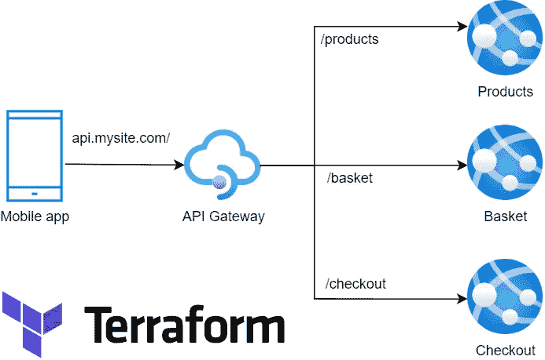
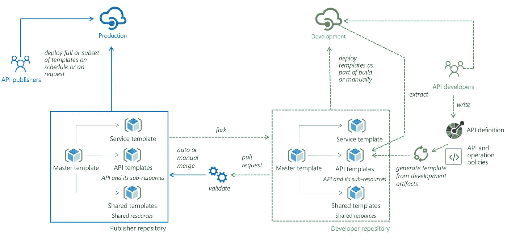

# Azure API 管理— Terraform CI/CD

> 原文：<https://itnext.io/azure-api-management-terraform-ci-cd-2d73ebe13f?source=collection_archive---------0----------------------->

当开始一个新的开发项目时，你需要考虑连续交付，你必须有自动化的部署，手动部署可以让你快速开始，但从长远来看会让你付出代价。即使这个项目不是我们正常的 Web API 部署。

我最近不得不构建一个 Azure API 管理，这是 API 网关的 Azure 版本，而不是让一个客户端知道许多后端服务，您可以添加一个 API 网关层，如下所示:

蔚蓝 APIM 的例子

它简化了移动应用程序的生命周期，但也因为它是一个间接层，以实现:

*   日志集中化。
*   限速。
*   SSL 终止。
*   Web 应用防火墙。
*   认证/授权。

## Azure API 管理的 CI/CD？

就 CI/CD 而言，起初并不清楚如何实现，但后来我发现了这个微软[使用 ARM 模板的例子](http://aka.ms/apimdevops)。我已经测试过了，它工作正常，但我要求 Terraform 优先于 ARM。

另一个关键需求是，我们希望保留 OpenAPI 或 **swagger.json 文件作为真实的来源**，这样团队就可以提供一个新的 swagger.json 并更新他们的 API 定义。

正如标题所示，我设法完全使用 Terraform 来达到要求，下面是方法。

# 天蓝色 APIM 地形

我设法为 APIM 配置了 Terraform，它正在创建资源并进行配置。但我仍在考虑将 Terraform 用于供应，将微软 ARM 用于“部署”。

然后偶然在 Terraform 上发现了资源`[azurerm_api_management_api](https://registry.terraform.io/providers/hashicorp/azurerm/latest/docs/resources/api_management_api)` ，试了一下。它从一个 JSON 文件创建和更新 API 定义。

因此，现在我们只需编辑 swagger.json 或更好的版本，重新生成 swagger.json，然后简单地执行“terraform apply ”,它作为供应/部署的混合，允许我们创建一个简化的 terraform 管道来更改 APIM/API 定义。

[全 Git hub 示例](https://github.com/RaphaelYoshiga/TerraformBasics)

# Azure API 管理 CI/CD 的选项

来自微软[的例子](http://aka.ms/apimdevops):

使用 ARM 模板的 APIM 部署模型

*   **提取器(extract)** —团队更新 APIM 的一个已部署实例，然后提取代码作为 ARM 模板重用。
*   **Generator(generate template)…**—您从一个 API 获得 API 定义 swagger.json，并生成 ARM 模板以供重用。
*   微软的部署方式在这里得到了很好的解释。

**Terraform 选项—** 它是生成器样式的变体，但使用了 Terraform，没有外部 CLI 来生成配置代码。

## 最后的想法

一条通往山里的管道——照片由[迈克·本纳](https://unsplash.com/@mbenna?utm_source=unsplash&utm_medium=referral&utm_content=creditCopyText)在 [Unsplash](https://unsplash.com/s/photos/pipeline?utm_source=unsplash&utm_medium=referral&utm_content=creditCopyText) 上拍摄

API 网关将集中来自多个团队的多个服务，为了有效地工作，您需要一种平稳的方式来部署变更，因此您可以:

*   确保跨环境的一致性。
*   快速传播变更。
*   能够在发生灾难时重建所有基础架构。

永远把 CI/CD 加入到你的项目中，让生活更快乐。