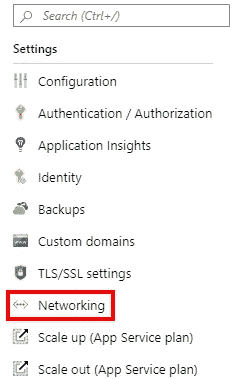
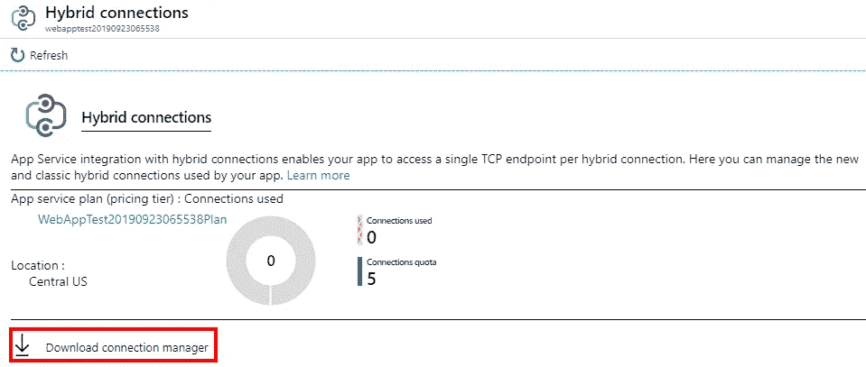
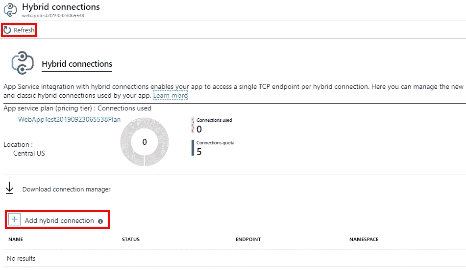
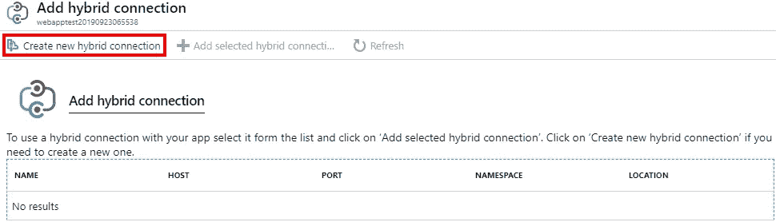
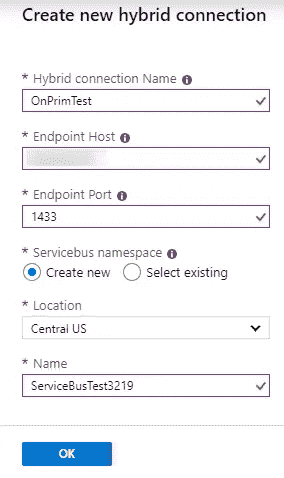
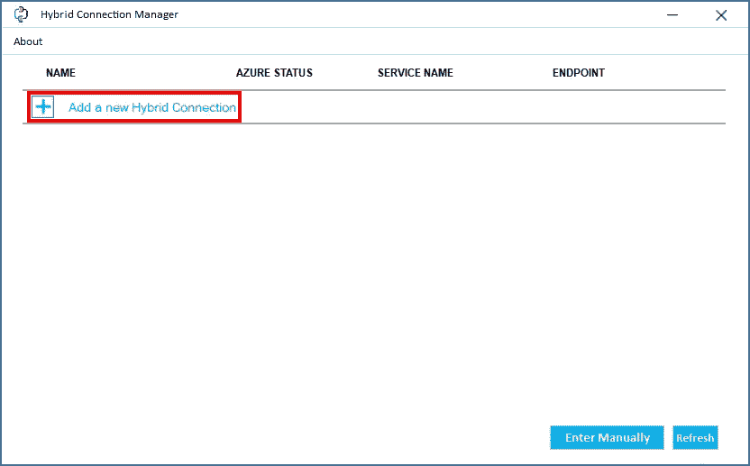

# 具有内部连接的 Azure 应用服务

> 原文：<https://itnext.io/azure-app-service-with-on-premises-connection-61ad773b0d8c?source=collection_archive---------2----------------------->

想象一下，你得到了一个新项目，它能够使用你想要的任何云服务。你欣然接受了这一变化，并使用 [Azure](https://azure.microsoft.com/) 设计了一个令人惊叹的架构。接下来，您向团队的其他成员展示您的计划，并发现必须使用现有内部数据库的新需求。

这是不是意味着你的宏伟计划泡汤了？幸好没有，因为 Azure 有多种解决方案，允许您连接到现有的内部资源，以实现混合云策略。

在本文中，我们将使用其中一个选项[混合连接](https://docs.microsoft.com/en-us/azure/app-service/app-service-hybrid-connections)，从应用服务中托管的网站连接到本地数据库。

## 示例应用程序

我们将在这篇文章中使用的基本示例应用程序是一个新的 Razor Pages 应用程序。网芯 3。在这篇文章的后面，我们将实际连接到数据库。要开始，你需要在 Azure 应用服务中创建和运行新应用。

我已经多次演练了如何创建一个新的应用程序并将它们发布到 Azure，所以我不打算在这里重复。如果你需要帮助来创建你的应用并将其发布到 Azure，你可以查看我的[将 ASP.NET 核心应用部署到微软 Azure](https://elanderson.net/2018/07/deploying-an-asp-net-core-application-to-microsoft-azure/) 的帖子，不要使用 Razor 模板，而是使用如下的 Web 应用模板。

```
dotnet new webapp
```

此外，请注意，混合连接在免费或共享主机计划中不可用，因此当您设置发布配置文件时，请避免这些选项。

## 向应用服务添加混合连接

从 [Azure 门户](https://portal.azure.com/)打开上面创建的应用服务，在菜单的**设置**部分点击**联网**。



在网络详细信息中，我们希望单击**配置您的混合连接端点**。


我要再次指出，混合连接在免费和共享规模级别上不可用。如果您的应用服务是免费或共享的，使用**向上扩展**菜单选项切换到支持混合连接的规模级别。

从混合连接详细页面点击**下载连接管理器**。完成后，需要将它安装在运行要连接的本地数据库的计算机上。



接下来，点击**刷新**，然后点击**添加混合连接**。



现在，在添加混合连接页面上，单击**创建新的混合连接**。



为了创建新的混合连接，Azure 将需要一些信息。这里的关键部分是**端点主机**，它是托管您希望与之通信的数据库的机器的名称，以及**端点端口**，它需要是您的数据库被配置为通过其进行通信的端口。



## 主机上的混合连接管理器

既然 Azure 端已经配置好了，我们需要使用我们在上面的目标机器上安装的**混合连接管理器**应用程序来允许与我们的应用服务对话。

在目标机器上打开混合连接管理器后，点击**添加新的混合连接**。



现在选择应用服务所属的**订阅**。列出可用连接后，加载**选择上面创建的**，最后点击**保存**。


在做了上面的更改后，我的混合连接在 Azure 中继续显示离线。经过一番搜索，我发现一篇博文建议[重述 Azure 混合连接管理器服务](https://community.dynamics.com/crm/b/nishantranaweblog/posts/using-azure-hybrid-connections-to-connect-to-sql-on-prem-database-from-azure-webjob)，这为我解决了问题。

## 连接到内部数据库的示例应用程序更改

这是一个非常原始的测试，但它表达了要点。首先，添加对**系统的引用。data . SqlClient**n 获取包。接下来在 **Index.cshtml.cs** 中删除 **OnGet** 函数，并替换为以下内容。

```
public async Task OnGetAsync()
{
    Tables.Clear();
    var connectionString = "data source=Server;initial catalog=master; User Id=User;Password=Password"";
    await using var connection = new SqlConnection(connectionString);
    await connection.OpenAsync();
    await using var command = 
                    new SqlCommand("SELECT name FROM sys.tables", connection);
    await using var reader = command.ExecuteReader();

    while (await reader.ReadAsync())
    {
        Tables.Add(reader["name"].ToString());
    }
}
```

上面的代码连接到指定服务器上的 master 数据库，并提取一个表列表。请注意，您需要将连接字符串修改为对您的系统有效的字符串。同样重要的是要知道，您不能在此设置中使用集成安全性，因此您需要指定一个存在于您的 SQL Server 上的用户名和密码。在同一文件中添加以下属性。

```
public List<string> Tables { get; set; } = new List<string>();
```

将下面的内容添加到 Index.cshtml 的底部，这将输出我们在上面拉到页面上的表格列表。

```
@foreach (var table in Model.Tables)
{
    @table <br/>
}
```

完成更改后，将应用程序重新发布到 Azure 应用服务。发布完成后，您的站点应该显示 SQL Server 的 master 数据库中存在的表的列表。

## 包扎

混合连接是一种将工作负载转移到云的好方法，而无需实际移动所有数据。这也是一周前我还不知道的 Azure 的特性之一。

如果您需要大量混合连接，请密切关注价格，因为您可以使用的数量与您使用的应用服务规模相关。可用的数量从 5 个开始，随着更昂贵的应用服务规模的增加，可以增加到 200 个。

*原载于*[](https://elanderson.net/2019/10/azure-app-service-with-on-premises-connection/)**。**