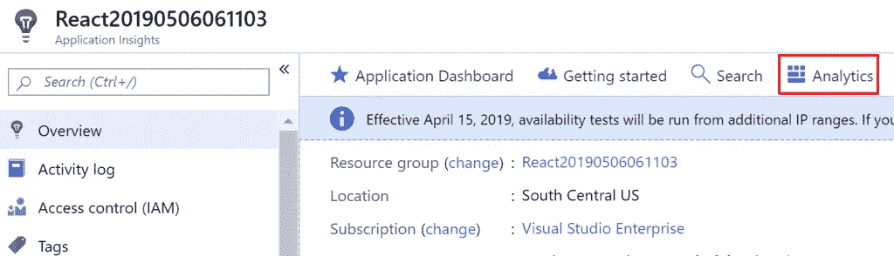
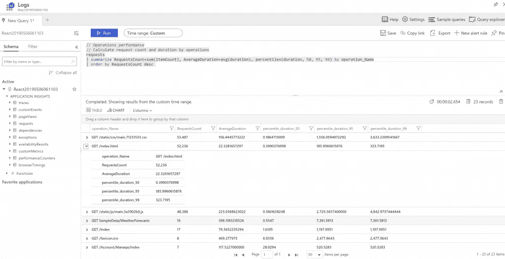
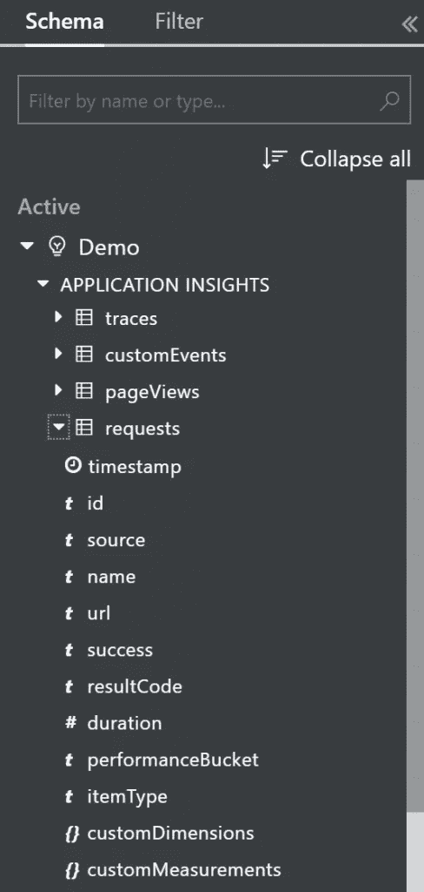
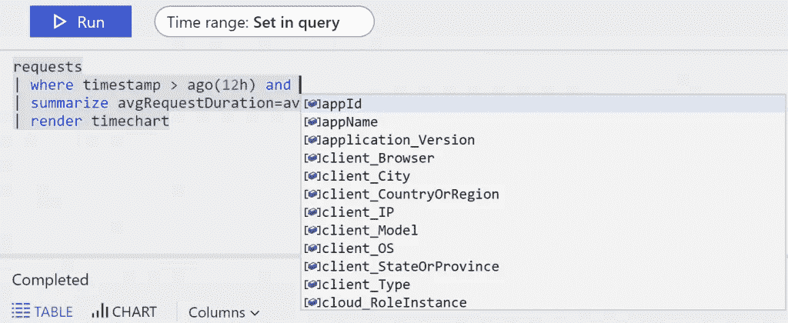
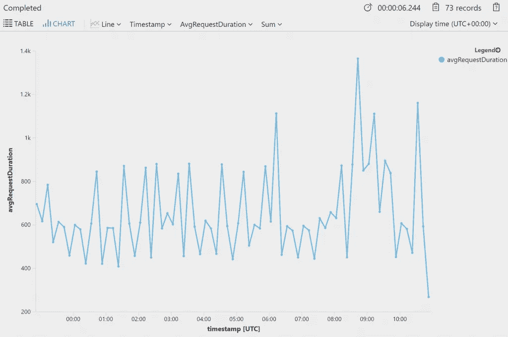

# Azure 应用洞察:分析

> 原文：<https://itnext.io/azure-application-insights-analytics-33a54444e183?source=collection_archive---------6----------------------->

我发现 Azure Application Insights 还有一个我想在转换话题之前指出的特性。如果你刚刚加入，可能值得看看这个系列以前的条目。

[将应用洞察添加到现有的 ASP.NET 核心应用](https://elanderson.net/2019/06/add-application-insights-to-an-existing-asp-net-core-application/)
[Azure 应用洞察概述](https://elanderson.net/2019/06/application-insights-overview/)

## 分析学

在您的应用洞察资源概览上，点击**分析**按钮。

这将把您带到一个页面，让您查询您的应用洞察数据。下面是您将看到的页面，其中包含一个示例查询及其提供的结果。

用于分析的官方文档提供了很多很好的资源，我推荐去看看。我们将在这篇文章中做一些探索，但这篇文章不足以完全探索你可以用分析完成的所有事情。

如果你想探索分析，但你还没有一个网站，或者你的网站没有太多的数据，比如我的示例应用程序，请查看微软提供的[分析平台](https://go.microsoft.com/fwlink/?linkid=859557)。

## (计划或理论的)纲要

分析提供了一种非常强大的方法来查询关于您的应用程序的信息。我建议您做的第一件事是探索可用数据的模式。页面左侧提供了可用模式的详细信息。正如您在下面的截图中看到的，您可以从跟踪、页面查看、请求、性能计数中查询详细信息。每种类型都有自己的一组可用字段。

## 查询条目

查询输入区域位于页面的顶部中间。你可以在这里阅读查询语言的细节。谢天谢地，查询编辑器提供了智能感知，正如你在下面的截图中看到的。

虽然语法一点也不像 SQL，但数据的组织方式让 SQL 经验帮助我思考如何探索和关联数据。

## 结果

点击**运行**按钮将执行您的查询，您将在页面底部看到结果。正如您所看到的，结果默认为基于上面查询中的 render 语句的时间图表。

可以在结果区域中更改图表类型。还有一个在表视图中查看结果的选项(如果查询中没有 render 语句，这是默认视图)。

## 包扎

Application Insights 提供的功能之多令人惊叹。我很高兴我碰巧注意到了分析。如果您正在使用 Application Insights，请花时间真正探索它提供的所有功能。你永远不知道什么时候你会发现一个对你的应用程序有重要影响的特性。

*原载于***。**