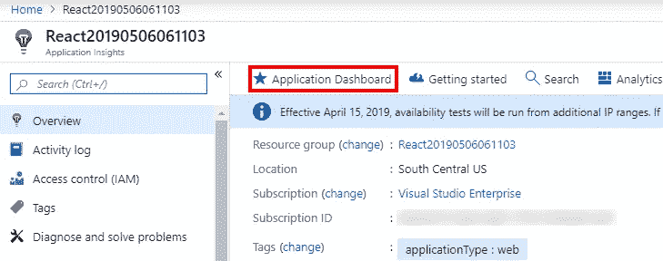
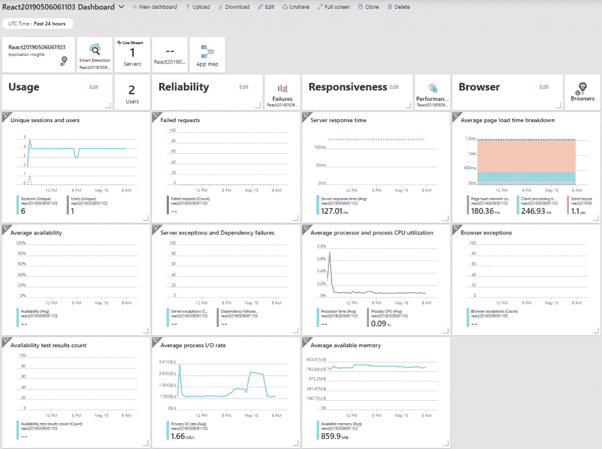
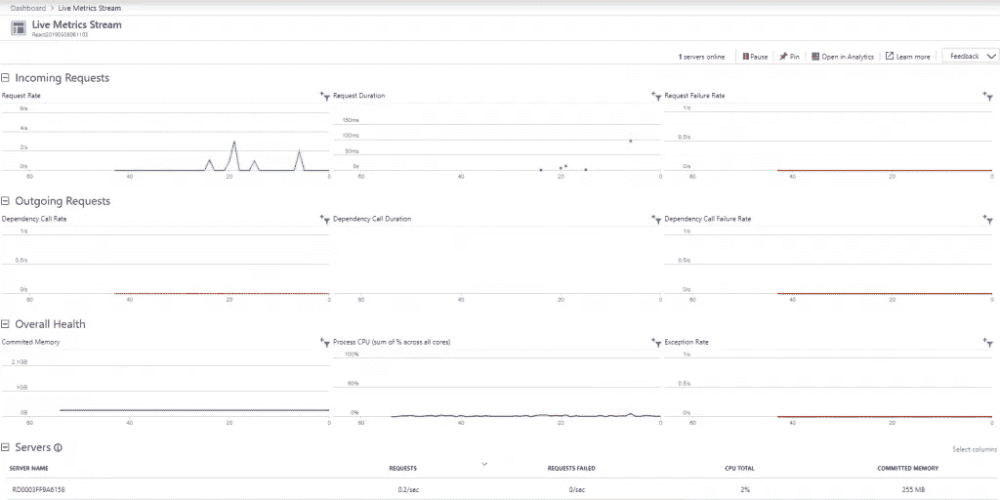
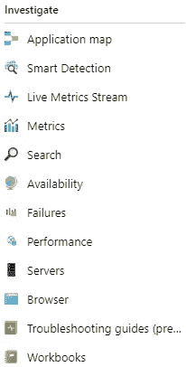
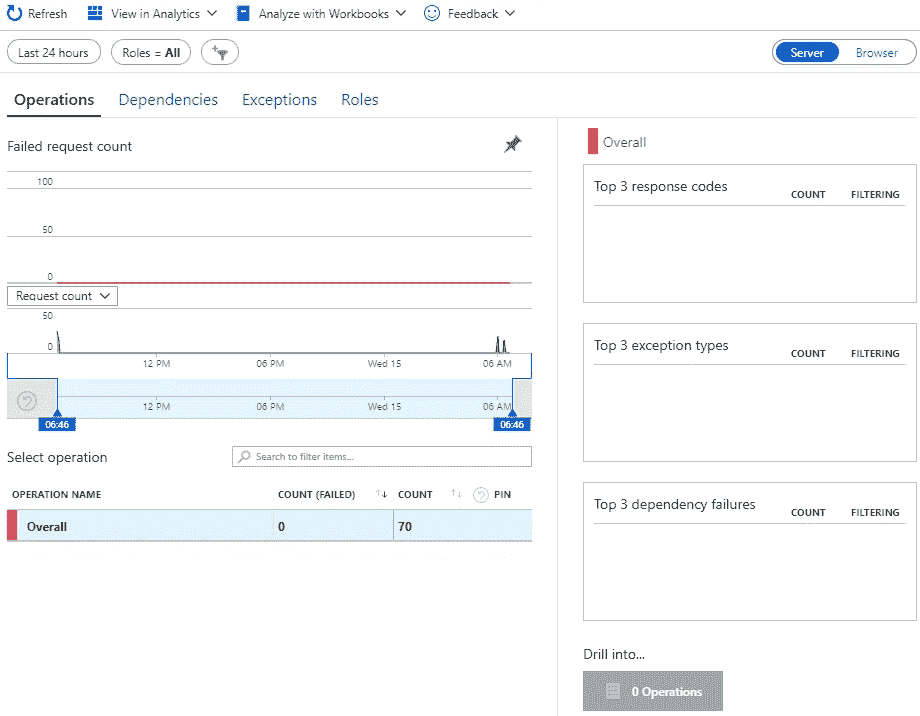

# Azure 应用洞察概述

> 原文：<https://itnext.io/azure-application-insights-overview-ab4073796d0?source=collection_archive---------8----------------------->

在上周的[将应用洞察添加到现有 ASP.NET 核心应用](https://elanderson.net/2019/06/add-application-insights-to-an-existing-asp-net-core-application/)帖子中，我们启动并运行了应用洞察。本周我的计划是展示 Application Insights 的一些特性。事实证明，当您的应用程序没有得到任何使用时，很难以有意义的方式做到这一点。虽然我几乎没有大多数截图的数据，但我仍然想指出一些应用洞察力的领域，它们似乎非常有用。

## 示例应用程序

在很大程度上，上面链接的帖子是一个很好的起点，只是我没有使用 React 应用程序，而是改用了 Razor Pages 应用程序。下面是使用 auth 创建 Razor 页面应用程序的命令。NET CLI。

```
dotnet new webapp --auth Individual
```

这种变化的原因是为了在 App Insights 中获得更多的项目，因为 Razor Pages 每页都会向服务器发出请求。

## 应用仪表板

我建议您查看的第一个项目是应用程序仪表板。在 [Azure 门户](https://portal.azure.com)上选择你的应用洞察资源，并在顶部点击**应用仪表板**。



这个链接会把你带到一个页面，让你一目了然地看到你的应用程序在做什么。这包括从唯一会话和失败请求到平均 I/O 速率和平均可用内存的所有内容。



## 实时指标流

从您的应用控制面板或 App Insights 菜单中，如果您选择[实时指标流](https://docs.microsoft.com/en-us/azure/azure-monitor/app/live-stream)，您将看到有关传入请求、传出请求、整体运行状况的实时信息，以及您的应用正在运行的服务器列表和这些服务器上您的使用情况的一些统计信息。



## 研究

作为一名开发人员，调查菜单中的许多项目对我来说非常有用。



例如， **Failures** 将为您提供所选时间段内的失败图表，其中包含失败操作的列表以及前 3 名失败响应代码、异常类型和依赖性失败的摘要。下面的截图就是它看起来的样子，但是我的示例应用程序没有任何失败，所以它可能不是超级有帮助的。



我想指出的另一个选项是**性能**，它将为您提供一个很好的摘要，说明您的应用程序在按操作细分的情况下是如何执行的。这个操作级视图是发现应用程序中可能需要一些性能工作的区域的好地方。


## 包扎

这篇文章介绍了 Application Insights 提供的一小部分价值。我鼓励您尝试一下这项服务，尤其是如果您运行的是. NET 应用程序，并且无需修改任何代码就可以提供大部分价值。

*原载于*[](https://elanderson.net/2019/06/application-insights-overview/)**。**