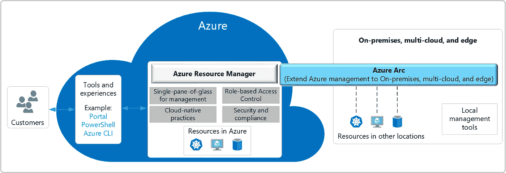
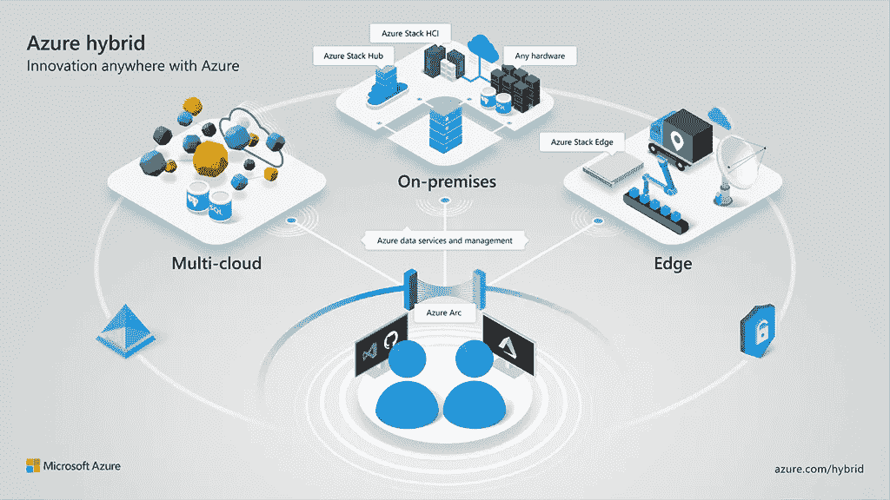
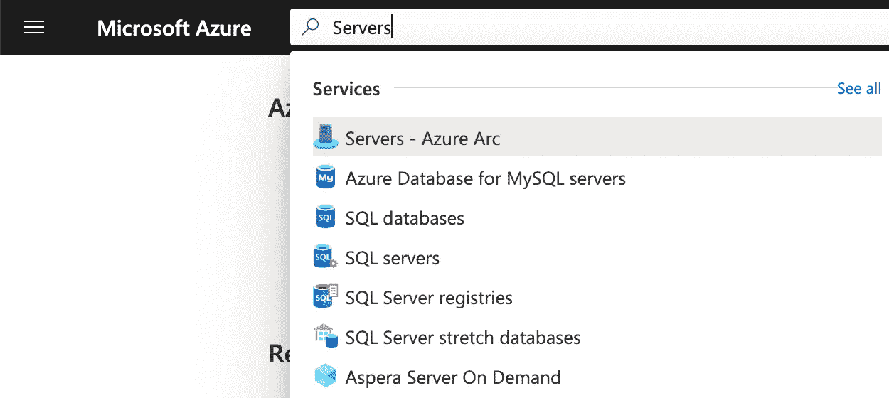

# 蔚蓝弧:一切为了蔚蓝，蔚蓝为了一切！

> 原文：<https://itnext.io/azure-arc-all-for-azure-and-azure-for-all-6caab88a6085?source=collection_archive---------6----------------------->

多云战略允许组织使用不同提供商提供的不同云服务**。**一些云平台专注于某些服务，或者有可能比其他平台更好的集成解决方案。此外，如今组织仍然受到遗留应用程序的困扰。这些应用程序需要传统的基础架构，并且通常仍在专有的本地硬件上运行。或者，有些组织仍处于云之旅的最前沿，不能或不希望一次性完成迁移。
所有这些都是可以理解的和不可避免的，但是一个组织如何保持对所有这些不同基础设施的控制，同时又不损害 Azure 云的潜力呢？Azure Arc 可能是您的答案。

在这篇博客中，我将大致解释什么是 Azure Arc，为什么你想使用它，并提供一个快速入门。

# 什么是 Azure Arc？

> Azure Arc 通过提供一致的多云和内部管理平台来简化治理和管理。Azure Arc 通过将现有资源投影到 Azure Resource Manager，使您能够使用单一控制台管理整个环境。您现在可以管理虚拟机、Kubernetes 集群和数据库，就像它们在 Azure 中运行一样。不管他们住在哪里，你都可以使用熟悉的 Azure 服务和管理功能。Azure Arc 使您能够继续使用传统的 ITOps，同时引入 DevOps 实践来支持您的环境中新的云原生模式。— [Azure Arc 概述— Azure Arc |微软文档](https://docs.microsoft.com/en-us/azure/azure-arc/overview)

Azure Arc 将微软在 Azure 上的部署和管理服务 Azure Resource Manager 扩展到内部、边缘和多云环境。使用 Azure Arc，可以从一个门户管理多个云(例如 Azure 和 AWS)和内部环境，例如 Azure 门户、Azure Lighthouse 和/或各种脚本工具。此外，你可以将 Azure 服务部署到任何基础设施上，并将 Azure 管理扩展到这些基础设施上。



图片由[微软](https://www.microsoft.com/en-us/)在[微软文档](https://docs.microsoft.com/en-us/azure/azure-arc/overview)上提供

如果你是服务提供商，你会很高兴听到 Azure Arc 也集成到 Azure Lighthouse 中。如果你不熟悉 Azure Lighthouse，可以看看[我关于 Azure Lighthouse](https://rolfschutten.medium.com/azure-lighthouse-msps-let-there-be-light-3da060717b09) 的博客。

# 为什么要用 Azure Arc？

正如在这篇博客的介绍中所说，许多组织在内部、云中和边缘运行混合的应用程序。这些应用程序和(云)平台都有自己的门户、管理工具等。这使得 IT 环境变得复杂，因此更难管理、更难扩展且效率低下。Azure Arc 通过使用本文前面提到的单一平台消除了这种复杂性。因此，Azure Arc 直接有助于降低复杂性、提高可伸缩性、可见性和可管理性，间接有助于提高安全性、效率和合规性。


由 [SpaceX](https://unsplash.com/@spacex?utm_source=medium&utm_medium=referral) 在 [Unsplash](https://unsplash.com?utm_source=medium&utm_medium=referral) 上拍摄的照片

除了前面提到的好处，Azure Arc 的主要好处之一是能够在 Azure 之外使用 Azure 服务。这使得本机 Azure 工具，如 [Azure Policy](https://docs.microsoft.com/en-us/azure/governance/policy/overview) 和 [Azure Resource Graph](https://docs.microsoft.com/en-us/azure/governance/resource-graph/overview) 可以用于传统和云工作负载。有了 Azure Arc，您可以从最新的云创新和自动化中受益，无论您在混合基础架构中的位置如何，都可以进行统一管理。在最初的版本中，Azure Arc 包括 AI 服务、自动化服务、可用性服务、成本管理、数据服务、DevOps 服务、Kubernetes 管理、安全服务和合规服务。随着时间的推移，更多的 Azure 服务将通过 Azure Arc 提供。



图片由[微软](https://www.microsoft.com/en-us/)在[Azure.Microsoft.com](https://azure.microsoft.com/en-us/solutions/hybrid-cloud-app/)上拍摄

最重要的是。在管理支持 Azure Arc 的服务器时，Azure Arc 是免费提供的。附加 Azure 管理服务(Azure Monitor 等)。)对 Azure 虚拟机或启用 Azure Arc 的服务器的收费可能不同。服务定价可在 [Azure Arc 定价页面](https://azure.microsoft.com/en-us/pricing/details/azure-arc/)上获得。

# 如何开始使用 Azure Arc？

Azure Arc 有许多不同的部署场景。在这个快速入门中，我们将了解如何在 Azure 之外托管的 Windows 或 Linux 机器上部署和配置 Connected Machine agent，用于教育目的，并感受一下 Arc 的潜力。对于其他场景，有一个很棒的网站 [Azure Arc Jumpstart](https://azurearcjumpstart.io/overview/) ，它提供了详细的指南、自动化、代码示例、屏幕截图以及使用 Azure Arc 所需的一切。

## 开始之前，这里有一些要求:

*   您需要 Azure 订阅。如果你没有，你可以[免费创建一个](https://azure.microsoft.com/en-us/free)。您还需要是“Azure Connected Machine on boarding”和“Azure Connected Machine Resource Administrator”角色的成员。
*   你的目标机器需要运行一个[支持的操作系统](https://docs.microsoft.com/en-us/azure/azure-arc/servers/agent-overview#supported-operating-systems)。您还需要目标计算机上的管理员权限。
*   Linux 和 Windows 的连接机器代理通过 TCP 端口 443 安全地与 Azure Arc 进行出站通信。如果机器通过防火墙或代理服务器连接以通过互联网进行通信，请[阅读本文](https://docs.microsoft.com/en-us/azure/azure-arc/servers/agent-overview#networking-configuration)以了解网络配置要求。

## 步骤 1:生成安装脚本。

首先，我们将开放 [Azure 云外壳](https://shell.azure.com/)，并注册微软。HybridCompute 和微软。使用下面的命令猜测我们的 Azure Arc 订阅中的配置资源提供者:

```
az account set --subscription "<Your Subscription Name>"
az provider register --namespace 'Microsoft.HybridCompute'
az provider register --namespace 'Microsoft.GuestConfiguration'
```

接下来，我们将生成一个安装脚本来自动下载、安装和建立与 Azure Arc 的连接。

通过使用搜索栏进行搜索，转到 Azure 门户中的“服务器 Azure Arc”部分。



在这里，我们可以生成一个脚本来装载目标服务器。选择“**添加**，并选择选项“**使用交互式脚本添加服务器**”。然后，您将被要求填写您希望在 Azure 中管理机器的订阅和资源组，并选择将存储机器元数据的 Azure 区域。该位置不必与资源组的位置在同一区域。

现在你可以下载或复制你的脚本。

## 步骤 2:运行脚本，安装代理。

对于 Windows 服务器来说，这就像执行*一样简单。目标服务器上的/OnboardingScript.ps1* ，在提升的 64 位 PowerShell 命令提示符下。请确保切换到脚本复制到的文件夹或共享。

对于可以直接与 Azure 通信的 Linux 服务器，运行以下命令:

```
bash ~/Install_linux_azcmagent.sh
```

如果目标计算机通过代理服务器进行通信，请运行以下命令:

```
bash ~/Install_linux_azcmagent.sh --proxy "<proxy-url>:<port>"
```

## 第三步:验证和管理！

我们应该验证服务器是否已成功连接到 Arc 服务。我们可以在 Azure 门户的“服务器— Azure Arc”部分使用搜索栏进行搜索。在这里，您可以看到连接的服务器资源。

现在，您已经启用了 Linux 或 Windows 混合机器，并成功连接到 Arc 服务。