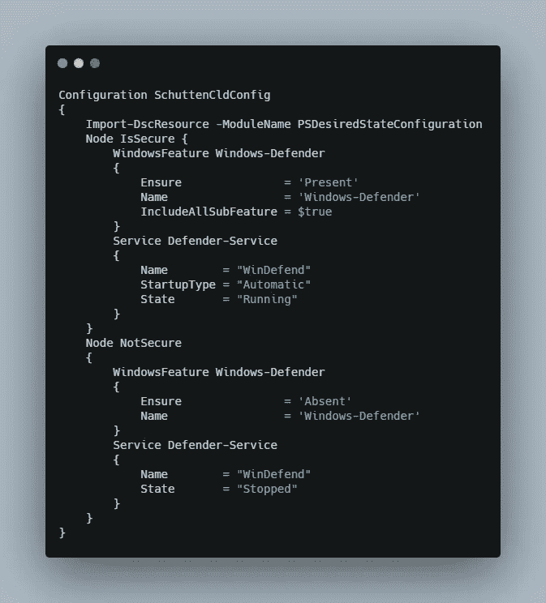
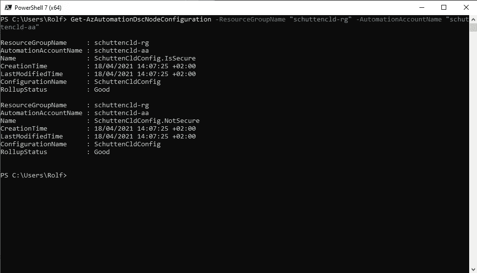
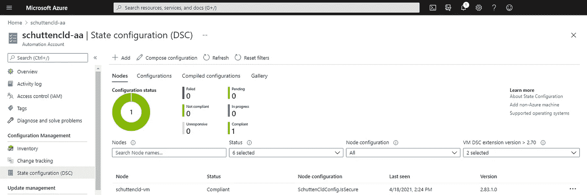

# Azure Automation 配置所需的状态配置

> 原文：<https://itnext.io/azure-automation-configuring-desired-state-configuration-4091d94e85d9?source=collection_archive---------2----------------------->


在你深入了解 Azure 自动化状态配置(AASC)的细节之前，你应该知道什么是期望状态配置(DSC)和 AASC。Desired State Configuration 是一个 PowerShell 管理平台，用于管理您的 IT 基础架构的配置，将配置作为代码。DSC 为系统配置提供了一个声明性模型，允许您指定如何配置端点(工作站或服务器),并将实际配置留给 PowerShell DSC。通过这种方式，我们只需指定“所需状态”，DSC 确定如何以及以何种顺序。AASC 类似于 DSC，允许您编写、管理和编译配置，以及将配置导入和分配到目标服务器。此外，AASC 是一项完全在(Azure)云中运行的服务。

在本指南中，您将设置一个 Azure Automation 帐户，并配置您的第一个所需状态配置。当你完成后，你将拥有必要的技能来开始在你的 Azure 租户中配置期望的状态。

# 先决条件

开始之前，您需要以下内容:

*   Azure 订阅可以访问对订阅具有足够权限的管理员帐户，例如所有者或包含 Microsoft 的角色。自动化资源授权。如果您没有类似的权限或套餐，[您可以在这里创建一个免费帐户](https://azure.microsoft.com/free/)。
*   Visual Studio 代码，或者您个人喜欢的任何其他代码编辑器。[你可以在这里免费下载 Visual Studio 代码](https://code.visualstudio.com/download/)。
*   [蔚蓝海岸](https://docs.microsoft.com/cli/azure/install-azure-cli)。对于 Windows 10 用户，我另外强烈推荐微软的 [Windows 终端。](https://www.microsoft.com/en-us/p/windows-terminal/9n0dx20hk701)
*   [安装了](https://github.com/PowerShell/PowerShell/releases/) [Azure PowerShell 模块](https://docs.microsoft.com/powershell/azure/get-started-azureps)的 PowerShell 7.x 。

# 步骤 1 —创建资源

您将首先创建必要的资源来管理和部署状态配置，创建一个虚拟机，并通过部署所需的状态配置来配置虚拟机。

## 登录 Azure

从您的 Windows 终端、 [Azure Portal](https://portal.azure.com/#cloudshell/) 或个人偏好的命令行界面，使用 Azure 云 Shell 中的`az login`命令登录您的 Azure 环境。

## 创建资源组

Azure 中的所有资源都由一个容器保存；资源组。最佳实践是为您希望作为一个组来管理的每个解决方案创建一个资源组，并让它保存与此相关的所有资源。这是应有的生命周期管理。出于同样的目的，您将创建一个资源组，该资源组包含您将为本指南创建的所有资源。这使得在您完成本指南后，可以很容易地删除所有资源(如果您愿意的话)。

通过执行以下命令创建资源组。您可以根据个人喜好编辑参数。下面的命令创建一个资源组，名称为“schuttencld-rg ”,位置为西欧地区。

```
az group create \
    --name "schuttencld-rg" \
    --location "westeurope"
```

## 创建虚拟机

您将需要一个虚拟机来部署您想要的状态配置。如果您已经有一个运行 Windows server 作为其操作系统的虚拟机，并且您愿意将它用于测试目的，则可以跳过这一部分。如果你还没有虚拟机，你必须创建一个。下面的命令在先前创建的资源组中，在同一区域(westeurope)创建一个名为“schuttencld-vm”的虚拟机，其操作系统为 Windows Server 2019 Datacenter，虚拟机大小为 DS1v2。根据您的个人偏好更改任何参数，并执行命令来创建您的虚拟机。

```
az vm create \
    --name "schuttencld-vm" \
    --resource-group "schuttencld-rg" \
    --location "westeurope" \
    --image "Win2019Datacenter" \
    --size "Standard_DS1_v2"
```

执行完命令后，你会被要求输入两次管理员密码。

## 创建自动化帐户

Azure Automation(所需)状态配置是 Azure Automation 服务中的一项功能。为此，您将使用下面的命令创建一个 Azure Automation 帐户。同样，您可以根据个人喜好编辑参数。

```
az automation account create \
    --automation-account-name "schuttencld-aa" \
    --resource-group "schuttencld-rg"
    --location "westeurope" \
    --sku "Free"
```

# 步骤 2 —创建状态配置

现在您将创建包含所需状态配置的配置文件，并对其进行编译。在这一步中，您将使用 PowerShell 来执行您的命令。首先在 PowerShell 中执行`Connect-AzAccount`命令来连接到 Azure 环境。

## 创建配置文件

现在，您将在配置文件中编写所需的配置。启动 Visual Studio 代码(或您喜欢的任何其他代码编辑器)并创建一个新的 PowerShell 文件。在这个例子中，我将这个文件命名为“SchuttenCldConfig.ps1”，并将它保存在我的桌面上。

出于教育目的，我们编写了一个所需的配置，其中安装了 Windows Defender 功能并运行 Windows Defender 服务。我们称这种配置状态为“IsSecure”。如果 Windows Defender 功能不存在，或者如果 Windows Defender 服务已停止，则为“NotSecure”。转录的配置文件如下所示:



*图片由 Rolf Schutten 上传*[*Schutten . cloud*](https://www.schutten.cloud/)

## 导入配置文件

现在，您已经创建了所需状态的配置文件，您需要将其导入到您的 Azure Automation 帐户中。您可以通过使用"[Import-AzAutomationDscConfiguration](https://docs.microsoft.com/en-us/powershell/module/az.automation/import-azautomationdscconfiguration?view=azps-5.8.0)" PowerShell 命令来实现这一点。您可以使用下面的示例，但是要确保根据您的个人偏好来更改参数。

```
Import-AzAutomationDscConfiguration
    -SourcePath "C:\Users\Rolf\Desktop\SchuttenCldConfig.ps1"
    -ResourceGroupName schuttencld-rg
    -AutomationAccountName schuttencld-aa
    -Published
```

## 编译配置文件

一旦导入了配置文件，就需要编译它。同样，您将使用 PowerShell 命令来完成此操作，因为这是最简单的方法。使用下面的示例命令，但是请确保根据您的个人偏好更改参数，其中“-configurationName”应该是指您在配置文件中为您的配置指定的名称(该名称显示在文件中第一行代码的单词“Configuration”之后)。

```
Start-AzAutomationDscCompilationJob
    -ConfigurationName SchuttenCldConfig
    -ResourceGroupName schuttencld-rg
    -AutomationAccountName schuttencld-aa
```

编译配置文件可能需要几分钟才能完成。在根据您的个人偏好进行更改之后，您可以使用下面的命令来验证编译是否成功。

```
Get-AzAutomationDscNodeConfiguration
    -ResourceGroupName schuttencld-rg
    -AutomationAccountName schuttencld-aa
```

如果运行上述命令没有显示任何信息，则没有编译(成功的)配置。如果成功完成，运行该命令后，您应该会看到类似下面的屏幕截图:



*图片由 Rolf Schutten 上传*[*Schutten . cloud*](https://www.schutten.cloud/)

# 步骤 3 —注册虚拟机

在最后一步中，您将使用配置注册虚拟机。在这一步中，您将再次使用 PowerShell。

## 注册虚拟机

使用"[Register-AzAutomationDscNode](https://docs.microsoft.com/en-us/powershell/module/az.automation/register-azautomationdscnode?view=azps-5.8.0)" PowerShell 命令，将您的虚拟机注册到之前配置的状态配置。显然，在您根据个人喜好更改了参数之后，您可以使用下面的示例。

```
Register-AzAutomationDscNode
    -AzureVMName schuttencld-vm
    -ResourceGroupName schuttencld-rg
    -AutomationAccountName schuttencld-aa
    -NodeConfigurationName SchuttenCldConfig.IsSecure
    -ConfigurationMode ApplyAndAutocorrect
    -RebootNodeIfNeeded $True
```

对于“-NodeConfigurationName”，我可以将其参数更改为“SchuttenCldConfig”。NotSecure”，如果我希望系统在没有安装 Windows Defender 功能和/或运行 Windows Defender 服务的情况下处于“投诉”状态。此外，对于“ConfigurationMode ”,您还可以选择“ApplyOnly”和“apply and monitor”*apply only*将应用配置，但不执行任何操作，除非新配置被推送到目标节点，或者当新配置从服务中拉出时。*apply 和 Monitor* ，如果没有为这个特定参数指定值，这是默认的配置模式，将与“ApplyOnly”做相同的事情，如果节点偏离了期望的状态，将报告任何差异。最后，还有“ApplyAndAutocorrect”选项，我们在上面的示例命令中使用了它。 *ApplyAndAutocorrect* 会做与“ApplyAndMonitor”相同的事情，并在报告差异时重新应用所需的配置。

成功运行 PowerShell 命令后，您就将虚拟机注册到了所需的状态配置。为了监控节点的结果和合规状态，微软在 Azure 门户中开发了一个漂亮的仪表板。你可以在你的 Azure Automation 帐户中的“状态配置(DSC)”链接下找到该仪表板。



*图片由 Rolf Schutten 上传*[*Schutten . cloud*](https://www.schutten.cloud/)

在这里，您可以单击显示的数据，以获得有关配置、合规状态等的详细信息。

# 结论

本文通过创建、导入、编译和注册一个配置文件到虚拟机，向您介绍了状态配置(在 Azure 中)的基础知识。本指南中的配置强制提供 Windows Defender 功能和 Windows Defender 服务的运行状态。现在，您可以开始编写所需的配置，并使用 Azure 中的状态配置来实施或监控它们。

如果您想了解更多关于状态配置的信息，[这个微软文档页面](https://docs.microsoft.com/powershell/scripting/dsc/overview/overview?view=powershell-7.1)是一个很好的起点。