# Azure B2C:自定义布局

> 原文：<https://itnext.io/azure-b2c-customize-layouts-8559688237f5?source=collection_archive---------4----------------------->

在帖子[ASP.NET 核心与 Azure B2C 认证](https://elanderson.net/2019/04/asp-net-core-with-azure-b2c-auth/)中，我们做了一个设置 Azure B2C 基础的演练，并创建了一个使用我们新的 B2C 认证设置的新应用程序。这篇文章将使用相同的设置来展示如何用你自己的自定义页面替换微软提供的注册/登录页面。

## 自定义页面托管

我们的自定义页面需要与 [CORS](https://developer.mozilla.org/en-US/docs/Web/HTTP/CORS) 启用公共场所托管。如果测试应用程序托管在某个公共的地方，我们可以直接使用它，但是因为它运行在 localhost 上，所以这不是当前的选项。在这个例子中，我们将使用 Azure Blob 存储进行托管。

创建存储帐户

从 [Azure 门户](https://portal.azure.com)选择**存储账户**。

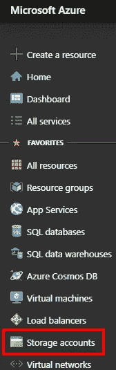

点击**添加**按钮。

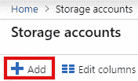

接下来，在**创建存储帐户**页面上，我使用了一个新的**资源组**并尝试了**存储帐户名称**，直到我找到一个未使用的。对于其余的字段，我采用默认值，然后单击 **Review + create** 。

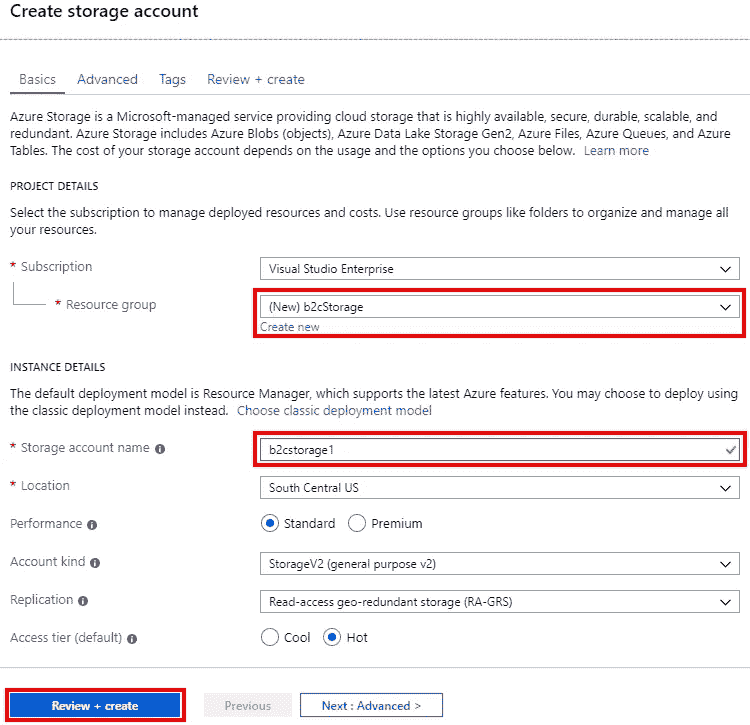

在“查看+创建”页面上，需要几秒钟来验证帐户。确认后，点击**创建**按钮。

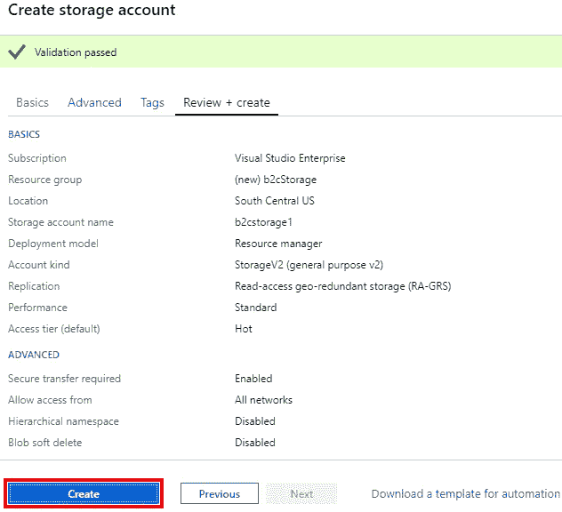

存储部署完成后，单击**转到资源**按钮。

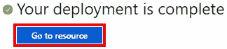

设置 Blob 存储

以上将带您进入新存储客户的概述页面。从菜单中选择 **CORS** 。

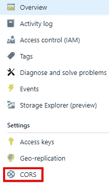

因为这只是一个测试，所以我允许 **Blob 服务**下的所有内容，对于真正的部署，我建议只允许您期望请求的值。设置好数值后，点击**保存**按钮。

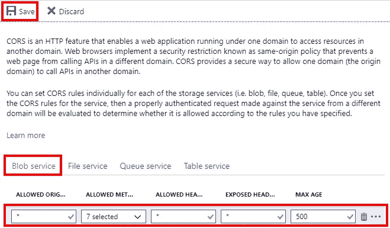

回到屏幕右侧的存储菜单，选择**斑点**。

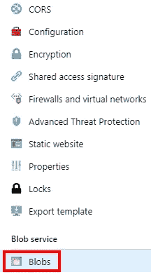

点击 **+容器**按钮创建一个新的 blob 存储容器。

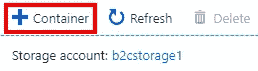

在新容器中，page 输入一个**名**并选择你的**公共访问级别**。我选择最宽松的访问级别，对于生产系统，您需要评估适合您的用例的访问级别。完成后点击**确定**。

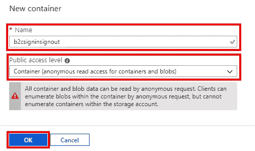

完成后，您将返回到您的容器列表。单击刚刚创建的容器以查看详细信息。

创建自定义页面

现在我们有了 blob 存储，我们需要创建一个 HTML 页面来代替默认页面。下面是我将要使用的页面的代码。这将是超级丑陋的，因为我不会使用任何造型。

```
<!DOCTYPE html>
<html>
  <head>
    <title>Custom Page!</title>
  </head>
  <body>
    <h1>Custom Page!</h1>
    <div id="api"></div> 
  </body>
</html>
```

你可以让这个页面看起来像你想要的那样，但是它总是需要带有 API ID 的 div，因为 Azure 将在这里注入实际处理注册/登录的元素。保存您的页面。

将自定义页面上载到 blob 存储

回到 Azure 点击**上传**按钮，然后选择你的文件，点击**上传**按钮。


上传后，您将返回到当前容器中的项目列表。单击您刚刚创建的项目。在细节复制的网址，因为我们将需要它给 B2C 的位置，我们的自定义页面。

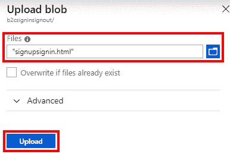

B2C 使用自定义页面

在你的门户中，返回 Azure 广告 B2C 页面，选择**用户流**。


选择要使用自定义页面的流程。在我们的例子中，我们将使用**注册和登录**的流程。

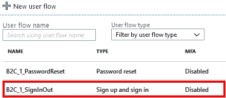

在**自定义**部分选择**页面布局**。

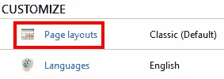

在页面底部选择**Yes**for**Use custom page content**并将上面指向您的 blob 的链接粘贴到**custom page URI**字段，然后单击 **Save** 。

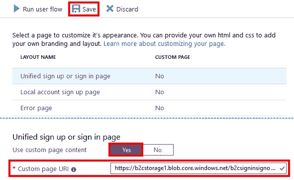

尝试一下

完成上述所有设置后，您现在可以使用 B2C 返回应用程序，点击您的登录链接，您将看到您的自定义页面。这是样本中的一个的样子。


显然，这个例子很难看，你不会对你的用户这样做，但是它给了你如何使用定制页面的基本概念。

## 包扎

希望以上能帮助你开始定制你的 B2C 相关页面，给你的用户一个更一致的外观和感觉。上面只上传了一个 HTML 页面到 blob 存储器，但是你也可以上传一个 CSS 文件或者你需要的任何其他资源。此外，不要忘记，如果你的网站是公开访问的资产可以与你的应用程序的其余部分存储在适当的，只是记得配置 CORS 允许来自 Azure 的请求。

如果你想了解更多关于这个话题的信息，请查阅微软关于这个话题的官方文件。

*原载于* [*埃里克·l·安德森*](https://elanderson.net/2019/04/azure-b2c-customize-layouts/) *。*