# Azure B2C:社交登录

> 原文：<https://itnext.io/azure-b2c-social-logins-3a1b12ed3e62?source=collection_archive---------9----------------------->

这篇文章将介绍如何为一个使用 [Azure B2C](https://azure.microsoft.com/en-us/services/active-directory-b2c/) 进行身份验证的站点启用社交登录。如果你是这组帖子的新手，你可以在 ASP.NET 的[帖子中找到示例应用程序的初始设置。我还建议查看一下](https://elanderson.net/2019/04/asp-net-core-with-azure-b2c-auth/)[Azure B2C:Customize Layouts](https://elanderson.net/2019/04/azure-b2c-customize-layouts/),了解如何更改所提供的 UI，为用户提供与应用程序其余部分相匹配的一致外观。

## 社交登录提供商设置

Azure B2C 支持你所期望的大多数登录服务，比如谷歌、脸书、Twitter、微软等。以及任何支持 [OpendID 连接](https://en.wikipedia.org/wiki/OpenID_Connect)的提供者。无论你选择哪个选项，你都必须向提供商注册/注册你的应用程序。不幸的是，Azure B2C 不提供它所支持的服务的注册页面的链接，所以这要靠你自己去寻找。

对于这个例子，我将使用 Google 来完成这个过程。你可以在他们的文档中获得谷歌 OpenID Connect 的所有细节。为了开始，我们需要在[开发者控制台](https://console.developers.google.com/)中设置我们的应用程序。该链接会将您带到仪表板，在那里您会看到一条关于选择或创建新项目的消息。点击**创建**链接。在下一页中输入**项目名称**并点击**创建**。

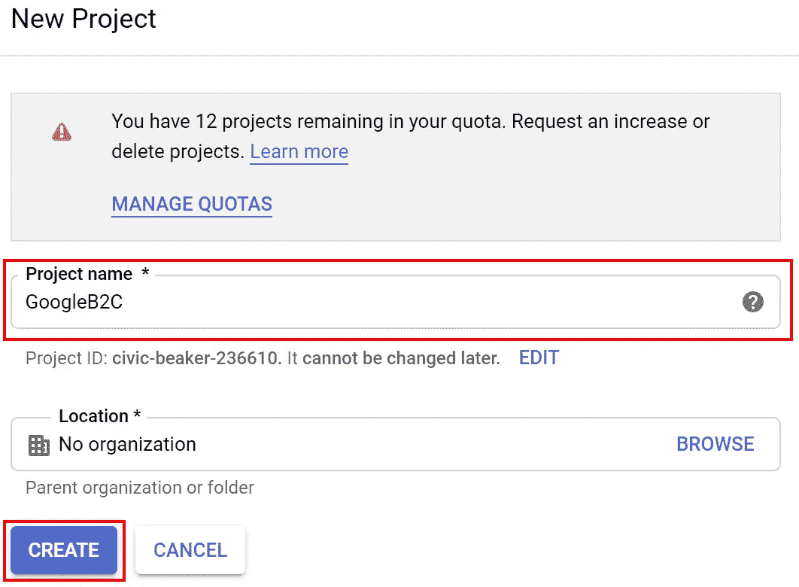

创建过程完成后，从左侧导航菜单中单击**凭证**。

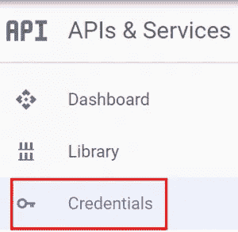

在屏幕顶部选择 **OAuth 同意屏幕**。在该页面中，您至少需要输入一个**应用名称**和一个**b2clogin.com**的**授权域**(截图中未显示，但仍需输入)，然后点击页面底部的**保存**按钮。

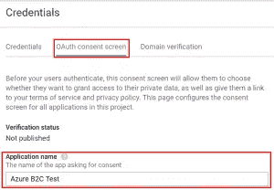

接下来，选择**凭证**选项卡，点击**创建凭证**按钮，选择 **OAuth 客户端 ID** 选项。

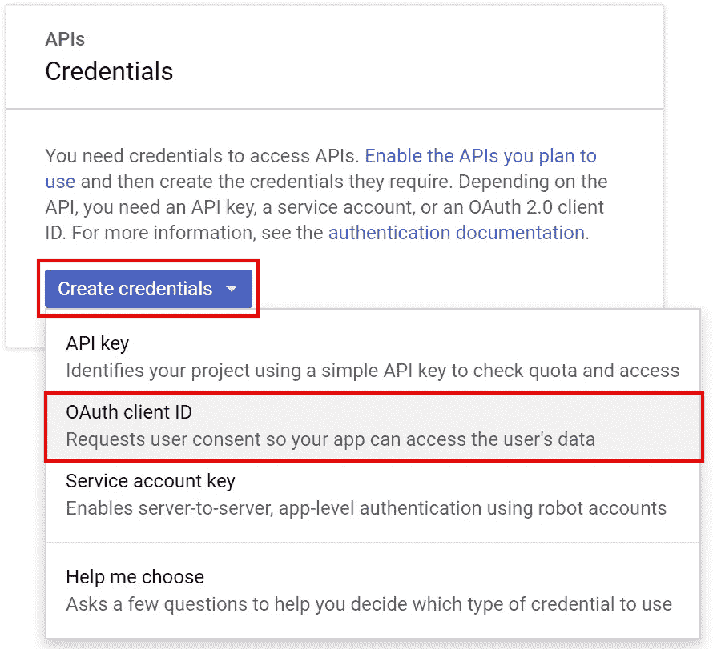

在下一页，选择 **Web 应用**作为应用类型。输入一个**名字**。对于接下来的两个字段，您将需要来自 Azure B2C 的租户 ID。在截图中，你可以看到我的租户 id 为 **testingorg3** 的地方。此外，确保输入所有小写的网址，我有使用混合大小写重定向问题。对于**授权的 JavaScript 源**使用 URL[**https://yourtenantid.b2clogin.com**](https://yourtenantid.b2clogin.com)对于**授权的重定向 URIs** 使用[**https://yourtenantid . B2C login . com/testing org 3 . on Microsoft . com/oauth 2/authresp**](https://yourtenantid.b2clogin.com/testingorg3.onmicrosoft.com/oauth2/authresp)

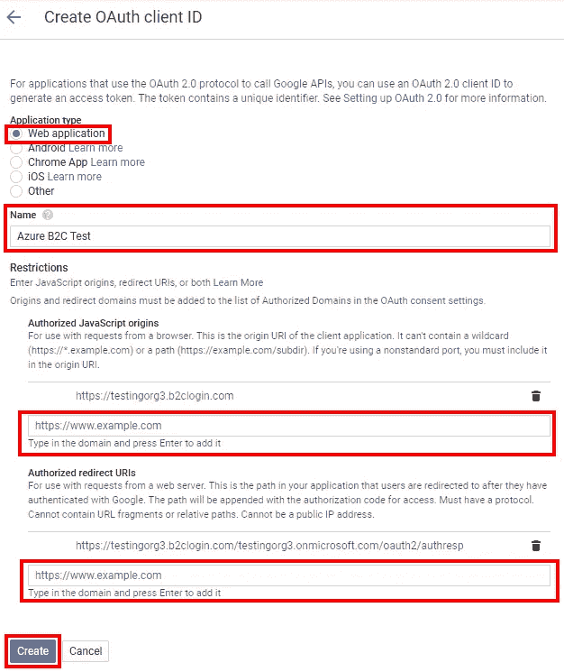

点击“创建”后，你会看到一个对话框，显示你的**客户端 ID** 和**客户端密码**，请记下这些，因为我们在 Azure B2C 中添加登录提供商时会用到它们。

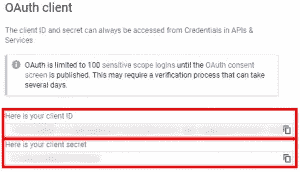

## Azure B2C 变化

现在我们有了谷歌端的设置，前往 Azure 并找到你的 Azure B2C 资源。从导航菜单中选择**身份提供**，点击**添加**按钮。

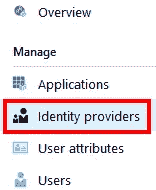

输入一个**名称**，我只是使用提供者的名称。然后，点击**身份提供者类型**，这将触发**选择社会身份提供者**选项显示。点击**谷歌**然后点击**确定**。

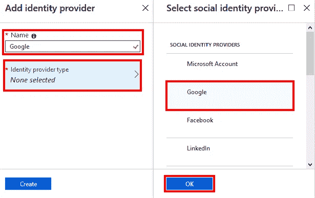

接下来，单击**设置该身份提供者**，将显示一个弹出窗口，您需要在其中输入您的**客户端 ID** 和谷歌提供的**客户端密码**。输入数值后，点击**确定**。

接下来，单击**添加身份提供者**屏幕底部的**创建**按钮。当这个过程完成后，我们将有两个 B2C 资源电子邮件和谷歌的身份提供者。接下来，我们需要为我们的注册/登录用户流启用新的 Google 提供商。从菜单中选择**用户流程**，然后点击您为**注册设置的流程并登录**。

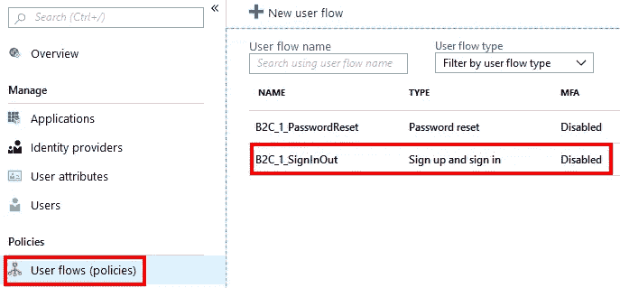

接下来，选择**身份提供者**，这将显示可用于所选流的提供者列表。检查流应该使用的任何其他提供者，在我们的例子中是 **Google** 。最后点击**保存**。

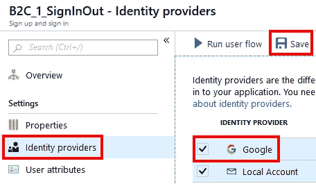

## 尝试一下

通过以上所有的改变，尝试用你的应用程序登录，你会看到 Google 作为一个登录选项。

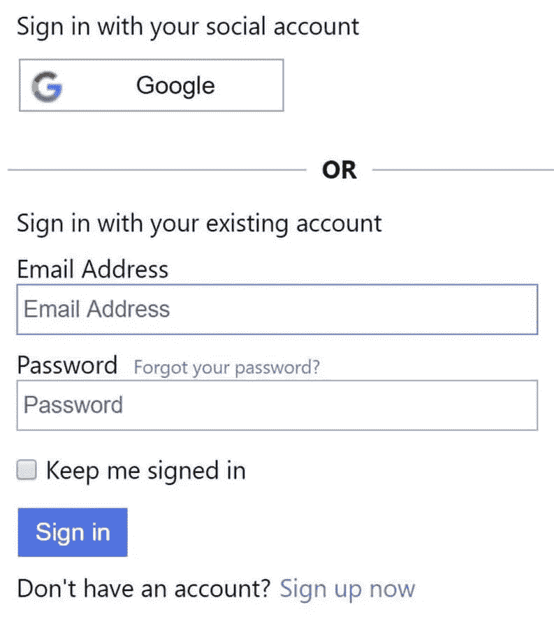

## 包扎

希望上面的内容可以帮助你在应用程序中增加对社交登录的支持。从 Azure B2C 的角度来看，添加其他提供商将非常接近我们为谷歌所做的，当然注册过程将因提供商而异。

*原载于***。**