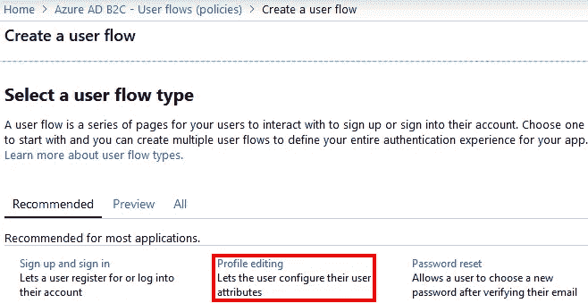
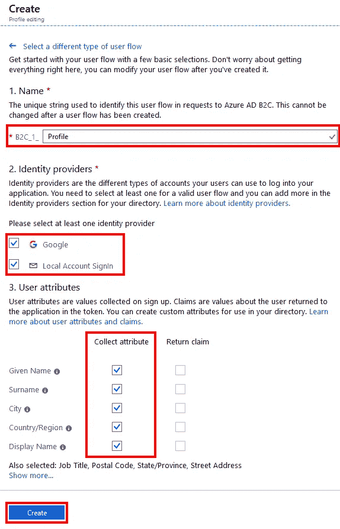
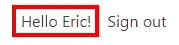
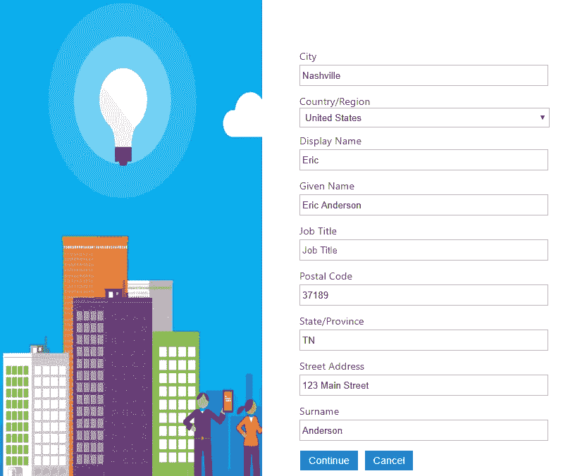
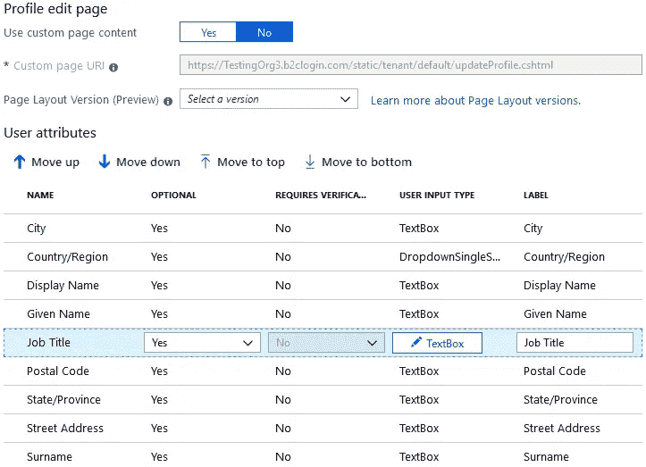

# Azure B2C:用户配置文件

> 原文：<https://itnext.io/azure-b2c-user-profiles-3d5c59bbc12b?source=collection_archive---------8----------------------->

在这篇文章中，我们将使用 Azure B2C 添加对用户档案的访问。我们将建立在[ASP.NET 核心与 Azure B2C 认证](https://elanderson.net/2019/04/asp-net-core-with-azure-b2c-auth/)帖子中使用的设置上，所以如果这篇帖子中有什么不清楚的地方，请务必检查一下。以下是 Azure B2C 上一系列帖子的完整列表。

【ASP.NET】核心与 Azure B2C 认证
Azure B2C:自定义布局
[Azure B2C:社交登录](https://elanderson.net/2019/05/azure-b2c-social-logins/)

## 用户配置文件流程

启用概要文件访问的第一步是添加概要文件编辑用户流。从 Azure B2C 资源的菜单中选择**用户流**。


在用户流列表的顶部，点击**新用户流**按钮。这将显示要添加的推荐流列表。从列表中点击**轮廓编辑**。



在**创建**页面为您的流程输入一个**名称**，选择哪些**身份提供者**可以使用该流程，选择要收集/显示的**用户属性**，然后创建**创建**按钮。您选择的用户属性将控制用户编辑其简档时显示哪些字段。此外，请注意**显示更多**链接，它将为您提供您的帐户上可用的用户属性的完整列表。



## 示例应用程序

返回到示例应用程序的 **appsettings.json** 文件中，输入上面 **EditProfilePolicyId** 的配置文件编辑用户流的名称。

```
"EditProfilePolicyId": "B2C_1_Profile"
```

运行该应用程序，登录后，用户名将是一个链接，该链接将带他们到一个页面，在那里他们可以编辑自己的个人资料信息。



以下是个人资料页面外观的示例。



## 调整布局

从截图中，您会注意到字段的顺序对用户来说没有多大意义。令人欣慰的是，B2C 提供了一种定制文件、标签、控件类型等顺序的方式。如果您需要匹配现有应用程序的外观和感觉，这也是一个选项。

从 B2C 菜单中，选择**用户流**并点击您的个人资料流。在您的个人资料流程中选择**页面布局**，然后在详细信息中选择**个人资料编辑页面**。


你会看到类似下面的截图。正如你所看到的，它允许重新排序字段，改变标签等。



## 用户属性

如果内置的用户属性不能满足你的所有需求，B2C 允许你添加自己的属性。从 B2C 的主菜单中点击**用户属性**，你会看到你当前属性的列表，如果你需要自定义属性，还有一个**添加**按钮。

## 包扎

启用概要文件访问是一个非常简单的过程，内置定制提供的灵活性非常好。我敢打赌，大多数人最终会使用自定义布局来给用户提供一致的体验。如果你需要帮助开始定制布局，看看我的 [Azure B2C:定制布局](https://elanderson.net/2019/04/azure-b2c-customize-layouts/)帖子。

*原载于* [*埃里克·安德森*](https://elanderson.net/2019/05/azure-b2c-user-profiles/) *。*