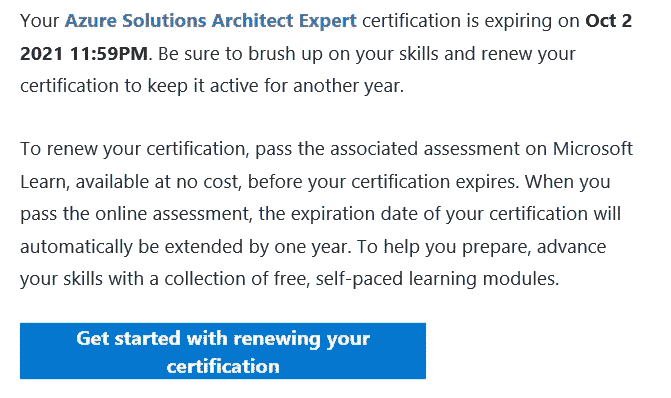
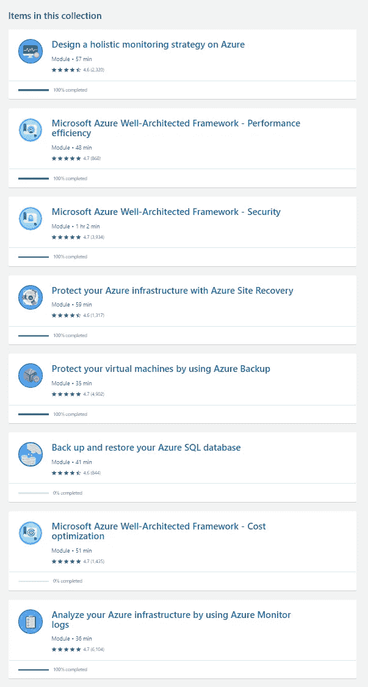

# Azure 认证续约季开启！

> 原文：<https://itnext.io/azure-certification-renewal-season-is-open-d6232045c66?source=collection_archive---------1----------------------->

Azure peeps，你可能已经听说了，微软终于建立了它的考试更新计划。如果您的认证在不到 6 个月的时间内到期，您可能已经收到了一封电子邮件…或者即将收到。那么，重新认证你的 Azure 证书意味着什么呢？

**TL；博士:还不算太糟，别担心。2020 年我有 5 个要续约，已经打倒了 2 个。**

# 合格

Azure 认证有效期为 2 年。到期前 6 个月，您将有资格在线续订。要明确的是，你是在更新一个认证头衔，而不是具体的考试。因此，如果您是 Azure Solutions Architect Expect Certified，您需要完成 1 次续订，而不是 2 次。此外，续订基于特定的标题，可以独立于其先决条件进行。这意味着在重新认证解决方案架构师之前，您不需要重新认证 Azure Admin。虽然，从逻辑上讲，你可能在架构师之前完成了 Azure Admin 因此有资格先续展。

# 重新认证流程

整个过程始于微软的电子邮件，告知您有资格续订认证。该电子邮件将会以“**需要采取行动”引起您的注意—您的微软认证将在 180 天后到期！**”。这发生在到期前 6 个月。Microsoft 给你整整 6 个月的续订时间。如果你错过了截止日期，我的理解是，你将不再持有该证书，并将不得不重新参加规定的考试。以解决方案架构师为例，您需要重写两次 AZ-3xx 考试。所以，更新它，不要拖延，这对你最有利。

既然您已经确定要升级考试，请单击电子邮件中的链接开始升级。然后，您需要登录您通常用来注册考试的帐户。此时，您可能需要链接您的 Microsoft Learn 帐户。如果你没有，你应该并且可能需要创建一个。这是因为重新认证是使用 Microsoft Learn 平台在线完成的，无需监督。

Microsoft 将推荐一系列 Microsoft Learn 模块来提高您的技能，为续订考试做准备。不要忘记点击页面底部的*显示更多*，否则你可能会错过一些内容。

百万美元的问题:你是准备好续约，还是花些时间准备。

我的建议是回顾一下微软建议采用的模块描述(接受提示！).我的经验是听从这个建议，因为我喜欢在艰苦的磨练中成长。在解决方案架构师续约问题上，我在 Azure Backup 和 Azure Site Recovery 上受到了打击；我重复一遍，喝醉了。我所说的“敲定”，是指您可以在何时何地进行特定类型的备份和恢复的矩阵的微小细节。在那次殴打之后，我不得不去上一些补习班。

总而言之，预计要花大约 3 个小时来浏览建议的材料。浏览你知道的东西；在你觉得不足的地方深入挖掘。

# 考试形式

现在来说说考试形式。与实际的认证考试类似，问题是多项选择。有些问题的答案是是/否。没有案例研究，没有“把这些步骤按正确的顺序排列”，没有多项选择。

考试大约有 25 个以上的问题，这将因认证而异。考试通过微软在线平台在线进行。

与直播考试不同，本次考试的题目不能复习，考试是线性的；您不能返回上一个问题来更改您的答案。

如果续费失败，你可以马上再来一次。第二次失败后，每次尝试之间有 24 小时的超时时间。

最棒的是续费和啤酒一样是免费的！

# 我迄今为止的经验

在完成 5 次续约中的 2 次后，我对结果感到非常满意。解决方案架构师肯定很难。他们就恢复 IaaS 系统和 Azure SQL 的能力向你提出了很多问题。撒一些安全中心的问题，这就是考试。所有好的科目都要跟上进度；所以好好读吧。

Azure DevOps one 很有趣，但从产品的角度来看。内容主要面向 GitHub 生态系统(回复、动作、脚本)。这告诉我，随着时间的推移，Azure DevOps 作为一个平台将转向与 GitHub 的合并。在某些方面，我欣赏这种整合。Azure DevOps 从来没有像 AWS 等价物那样被 SaaS 化，在使用组件(回购、管道、板、工件)之前，你必须建立一个组织和许多脚手架。在 AWS 上，每个服务都是独立的，可以根据需要耦合(codebuild、codecommit 等)。

我希望这有助于你规划你的更新之旅。我的一部分希望微软也能采用 AWS 方法。当你写一个较高的考试时，它会自动更新较低的考试。但是，花 3 个小时更新证书并不是世界末日，而且是免费的。