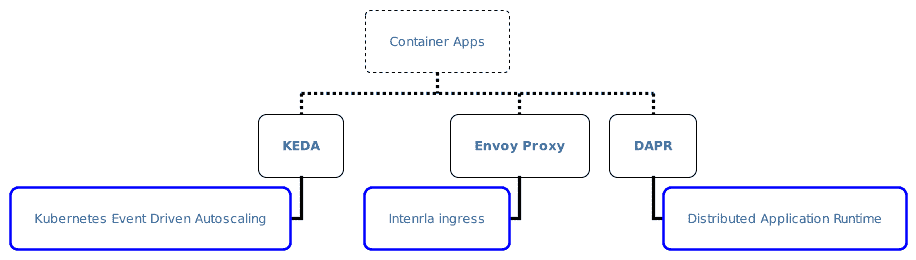
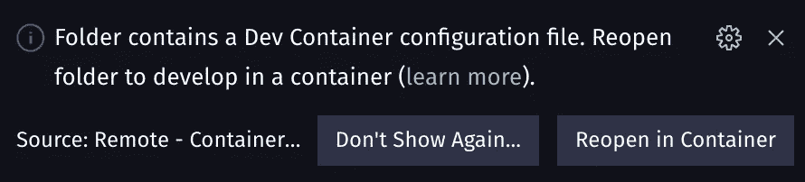
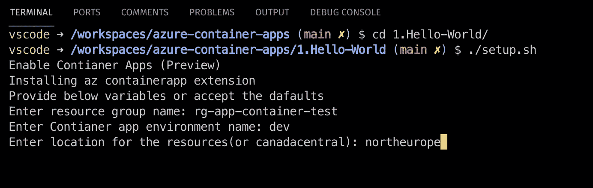
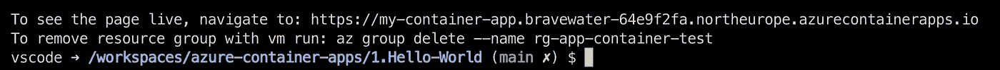
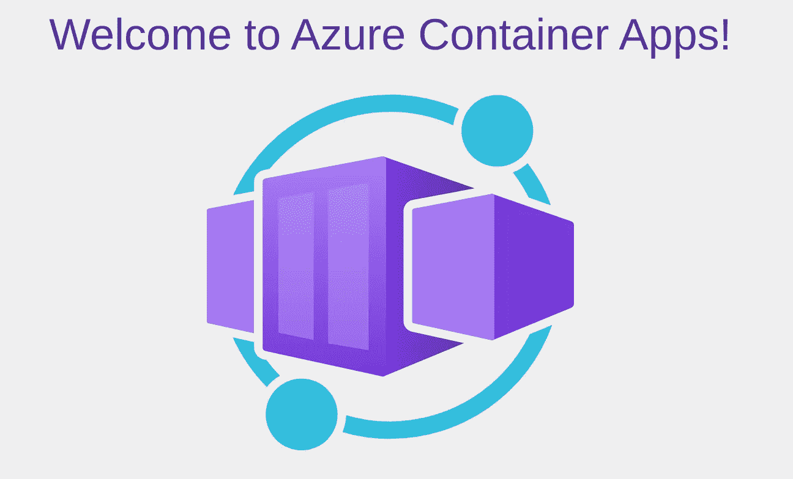
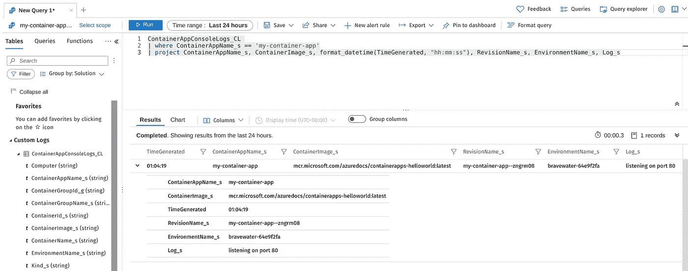
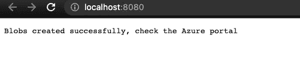
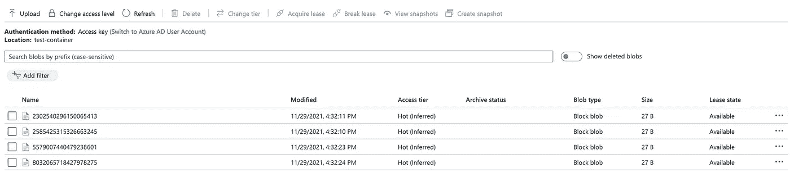
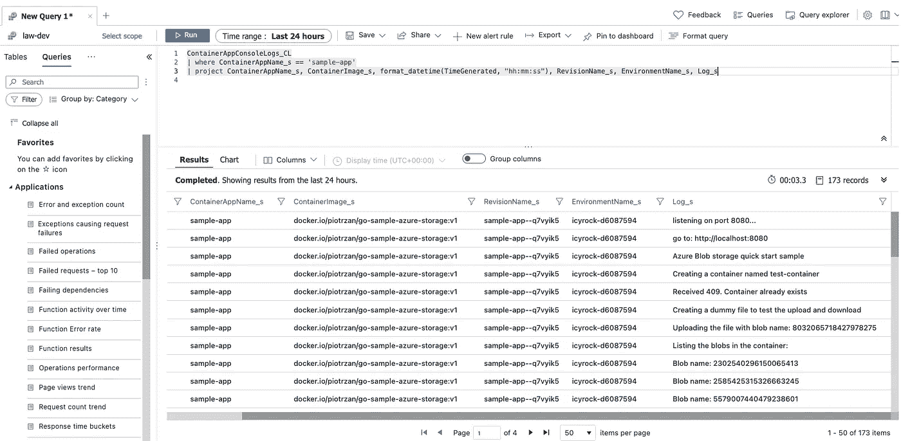
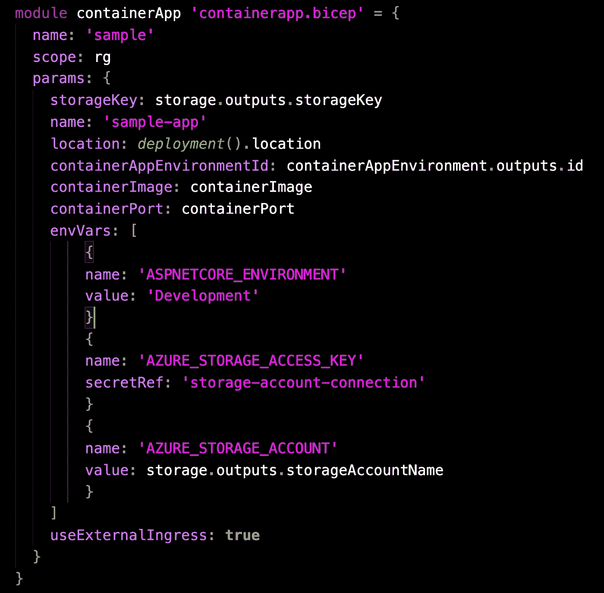

# Azure 容器应用:回顾和实例

> 原文：<https://itnext.io/azure-container-apps-review-and-practical-examples-cd58757bac34?source=collection_archive---------0----------------------->


[伊恩·泰勒](https://unsplash.com/@carrier_lost?utm_source=unsplash&utm_medium=referral&utm_content=creditCopyText)在 [Unsplash](https://unsplash.com/?utm_source=unsplash&utm_medium=referral&utm_content=creditCopyText) 上拍照

无服务器微服务

## 介绍

Container Apps 是 Azure 新推出的无服务器产品。截至本文发表时，它仍在预览中。

这个产品之所以有趣，是因为它填补了无服务器和成熟的 Kubernetes 设置之间的空白。传统上，对于微服务类型的工作负载，可以使用无服务器或 Kubernetes。

这并不理想，因为无服务器更适合事件驱动的架构，而 Kubernetes 很复杂，需要专业知识来运行生产级工作负载。

微服务架构将复杂性从程序内部转移到周围的基础设施。

另一个解决方案是使用 [Azure 容器实例](https://azure.microsoft.com/en-us/services/container-instances/)。这是一个很好的服务，但是它的级别相对较低，在使用多个容器组的情况下不能很好地工作，尤其是当它们需要相互通信的时候。

> *你可以阅读更多关于 Azure 容器实例我的其他博客，* [*轻松从你的桌面直接部署容器到 Azure*](/easily-deploy-containers-to-azure-directly-from-your-desktop-16efebc87b21)*【Azure 解释够深:容器】(Azure 解释够深:容器)。*

在本文中，我们将探索 Azure Container Apps 如何帮助基于微服务的架构。如果你是在 Azure 上设计软件的开发人员或软件架构师，这应该是一篇有趣的文章。

## 有什么好处？

对于基于微服务的架构，容器应用是无服务器和 AKS 之间缺少的环节。

这是通过利用开源项目来提供微服务中常见的标准化功能来实现的，例如:

*   自动缩放
*   机密和配置管理
*   版本控制
*   高级部署功能，例如蓝绿色部署或 A/B 测试
*   修订版之间的流量分割
*   背景，长期运行的服务

以下是支持容器应用的开源项目:



容器应用程序开源组件

在引擎盖下，容器应用程序运行在 AKS 集群上，具有自以为是的设置。该产品遵循利用 Kubernetes 的最佳实践之一:

> *Kubernetes 是一个搭建平台的平台*

[DAPR](https://dapr.io/) 为基于微服务的架构提供平台和语言无关的构建模块。

[KEDA](https://keda.sh/) 提供无缝的事件驱动自动缩放功能。

最后，[特使](https://www.envoyproxy.io/)负责隐藏 Kubernetes 复杂性的入口和路由。

## 何时使用容器应用程序

这种服务最适合已经装箱的微型服务。一个不太复杂的系统，不需要直接访问 Kubernetes 原语，也不需要纯粹由事件驱动的业务逻辑。

# 演示场景

如果你想一起练习，我已经用 devcontainer 创建了一个 repo，涵盖了两个不同的场景。位于文件夹`1.Hello-World`中的第一个场景将部署一个示例“hello world”web 应用程序，并将端点公开为内部入口。第二个场景使用 [bicep](https://docs.microsoft.com/EN-US/azure/azure-resource-manager/bicep/) 来部署额外的配置，并展示容器应用程序中秘密的使用。

## 先决条件

有几个先决条件:

*   VS 代码
*   Azure 订阅
*   在您的机器上运行的 Docker 主机

1.  克隆存储库:[https://github.com/Piotr1215/azure-container-apps](https://github.com/Piotr1215/azure-container-apps)
2.  VS 代码应该提示您在 devcontainer 中重新打开 repo



如果提示没有出现，您可以使用 F1 或 Ctrl+Shift+P 并选择*在容器中重新打开*。

您需要执行 [az 登录](https://docs.microsoft.com/en-us/cli/azure/authenticate-azure-cli)。默认情况下，az 登录命令将打开一个浏览器，通过 Azure 订阅进行安全认证。

# 你好世界

从这个例子开始，导航到`1.Hello-World`目录并运行`setup.sh`。

系统将提示您为脚本提供一些变量。默认值是预先填充的。如果你想使用默认值，只需点击回车。

> *目前，Container Apps 服务仅在*北欧*和*加拿大中部*地区可用。*



该脚本将执行以下操作:

*   安装容器应用 az 扩展
*   创建资源组
*   创建容器应用程序环境
*   创建容器应用程序
*   将 hello world 容器部署到容器应用程序
*   显示您可以实时查看 web 应用程序的 URL
*   提供清理资源的说明

脚本完成后，将显示一个运行 web 应用程序的 URL，以及一个删除环境的命令。



脚本输出

URL 应该显示一个正在运行的 hello world 应用程序:



容器应用与 Azure Monitor observability 完全集成。导航到 Azure 门户并找到资源组

> *如果您接受默认值，将会是* rg-app-container-test

在这里，我们可以执行一个简单的查询，从示例应用程序中读取 stdin 日志:



```
ContainerAppConsoleLogs_CL
| where ContainerAppName_s == 'my-container-app'
| project ContainerAppName_s, ContainerImage_s, format_datetime(TimeGenerated, "hh:mm:ss"), RevisionName_s, EnvironmentName_s, Log_s
```

# 带二头肌的国营商店

从这个例子开始，导航到`2.Bicep-Deploy`目录并运行`setup.sh`。

> *Bicep 超出了本文的范围，但是如果您感兴趣，值得指出的是，它与 az CLI 一起创建了 IaC 的*命令式*和*声明式*风格的良好组合。*

该脚本将把以下基础设施部署到 Azure:

*   创建资源组
*   创建容器应用程序环境
*   创建容器应用程序
*   使用名为“测试容器”的默认容器创建一个存储帐户
*   部署一个简单的 Go API 容器( [Github](https://github.com/Piotr1215/go-sample-azure-storage) ， [Docker](https://hub.docker.com/repository/docker/piotrzan/go-sample-azure-storage) )来与存储帐户进行交互

输出容器应用程序的 URL 的脚本。您可以使用 Ctrl +单击导航到它。过一会儿，您应该会看到一条消息，提示示例 blob 文件已创建。



API 消息

转到 Azure 资源组(默认为 rg-test-containerapps)并检查测试容器中的 blobs。您应该看到至少两个文件。刷新 URL 将生成额外的文件。



API 创建的 Blobs

测试 API 使用 Go fmt 库将日志写入 stdout，您可以在 Azure Monitor 工作区中看到自定义日志。



API 自定义日志

```
ContainerAppConsoleLogs_CL
| where ContainerAppName_s == 'sample-app'
| project ContainerAppName_s, ContainerImage_s, format_datetime(TimeGenerated, "hh:mm:ss"), RevisionName_s, EnvironmentName_s, Log_s
```

## 那么它是如何工作的呢？

如果仔细观察 bicep 模板，可以看到它定义了一个带有配置和秘密引用的 envVar 数组。如果你熟悉 Kubernetes，这就是在 pod 规范中引用秘密的方式。记住 bicep 只是 ARM JSON 的超集，所以它拥有容器 App API 公开的所有字段。



这个秘密在运行时向容器公开，所以只要您在 API 中使用相同的环境变量，您就应该能够以相同的方式与存储帐户进行交互。

这种方法的好处是，存储帐户密钥永远不会被共享、存储在源代码存储库中或嵌入到映像中。

## 清除

要销毁资源组和其中的所有服务，运行`destroy.sh`

# 摘要

容器应用程序提供了更多的功能，但是我想把重点放在一个相对简单的用例上，希望有助于演示一个非常常见的开发任务，比如在运行时注入连接字符串。

就我个人而言，这是我一直在等待的一项服务。对我来说，它对于中等复杂的微服务设置来说足够强大，并提供足够的旋钮和开关来配置甚至要求非常高的工作流。

我还没有谈到 DAPR、KEDA 或其他更高级的用例。如果你有兴趣查看文档。