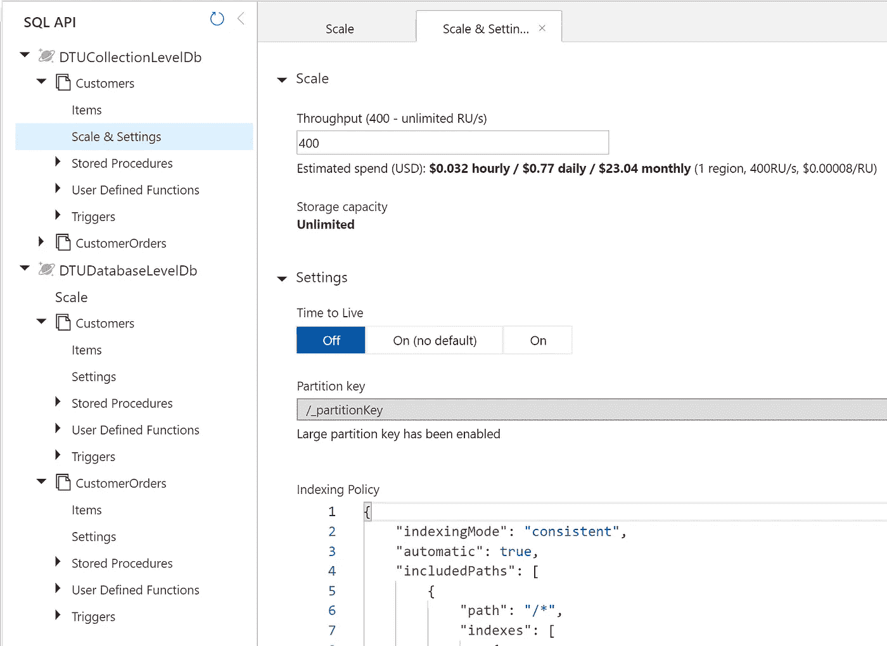
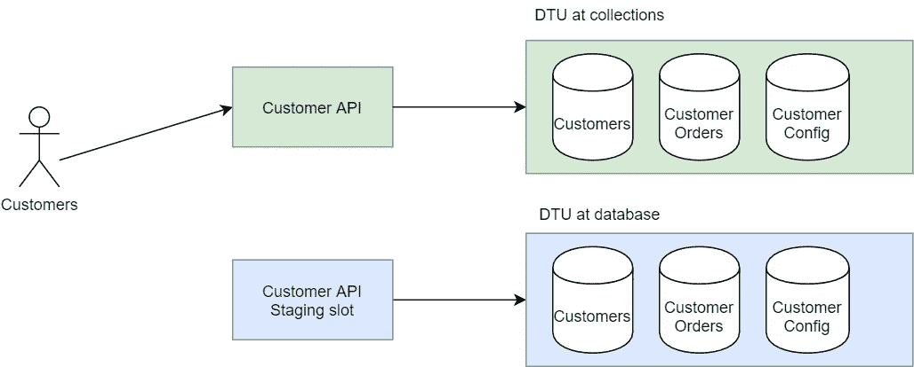
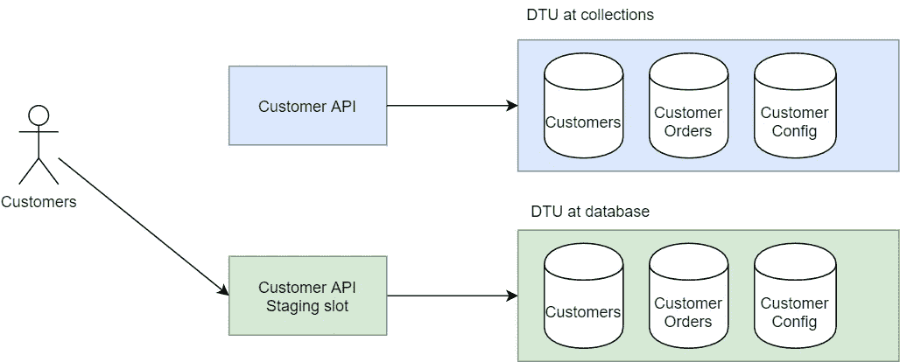
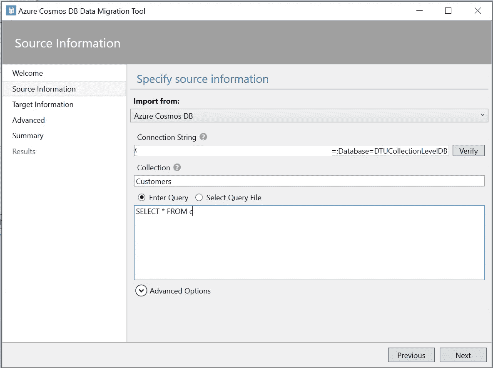
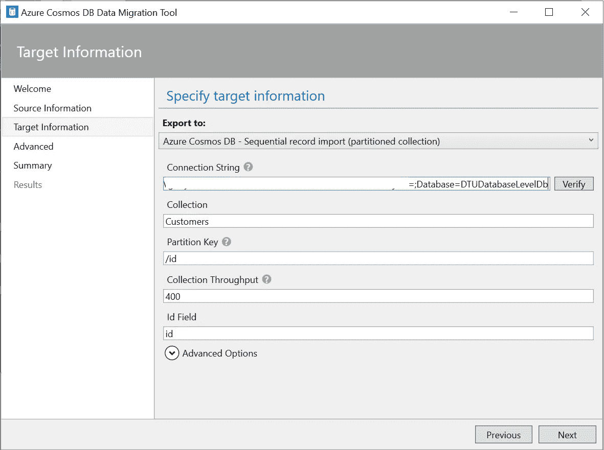
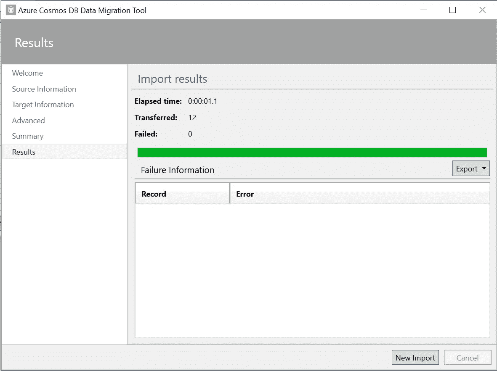
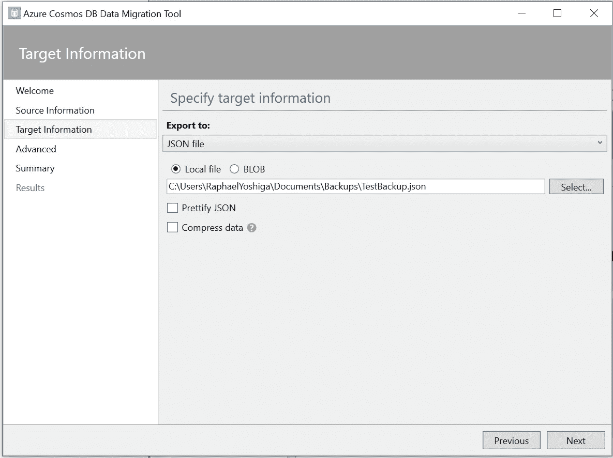

# 使用 Azure Cosmos DB 节省高达 80%的费用

> 原文：<https://itnext.io/azure-cosmos-db-costs-down-by-up-to-80-da9e0028049?source=collection_archive---------2----------------------->

Azure Cosmos DB 徽标

如果你一直在使用 Azure Cosmos DB，有可能你支付的比你需要支付的要多。

## Azure Cosmos DB 是什么？

它是 Azure 中的 NoSQL 数据库即服务。它非常适合存储 JSON 文档并通过一个键检索它。主要区别在于，在这种情况下，您不需要像 SQL 那样维护显式模式，并且您的查询/更新是针对整个文档的。

## 这种省钱的标准

你有多个收藏吗？如果是，您是在集合级别还是在数据库级别使用 DTU(数据传输单位)？如果您使用 DTU 每集合，您可能能够为您的公司节省一些钱。

Azure Cosmos DB 最小 DTU 大小为 400，每月花费 23.36 美元。例如，假设您有 3 个集合:

*   客户——23.36 美元
*   客户配置—23.36 美元
*   客户订单—23.36 美元

这意味着这种数据库配置的成本约为每月 70 美元。假设这些集合的使用率非常低，那么您可以在数据库级别配置 400 个 DTU，而不是每个集合一个处理单元(DTU)。

这样每月可以节省 46.72 美元。

您不太可能运行单个生产环境，您最有可能有一个转移环境和一个活动环境，如果不是更多的话，那么您可以将这些节省乘以环境的数量。**每次申请每月 93.44 美元或以上。**

即使不是所有的集合使用率都很低，您仍然可以从跨集合共享资源中受益。

# 如何从 DTU 每集合迁移到 DTU 每数据库

首先，您需要创建新的数据库和集合。您可以使用此代码创建包含 400 个 DTU 的数据库:

宇宙数据库和集合初始化，DTU 的数据库级

Azure 门户的最终结果是:

你可以看到*“DTUCollectionLevelDB”*中的收藏都有它们的“比例&设置”。而在数据库*“DTUDatabaseLevelDb”*中，只有一个“Scale”，是数据库级别的。

第二步是你需要考虑两件事，如何迁移数据和如何进行这种改变。这是交换数据库的挑战:

*   如果有读取，它们的读取会有多陈旧？
*   我们可以让应用程序离线还是在一个安静的时间进行？
*   如何在不丢失任何记录的情况下将数据迁移到新的数据库中？

## 让我们首先解决部署问题:

多个数据库的蓝/绿部署—在 [draw.io](https://draw.io) 创建

如果你在 Azure 中，你很可能会做一些蓝/绿部署，所以用户会点击绿色区域，同时有一个准备好的 API 等待上线。

一旦数据被迁移，您可以通过将您的用户发送到使用新数据库的 Staging API 来简单地交换它们。

多个数据库的蓝/绿部署，交换—在 [draw.io](https://draw.io) 创建

## 迁移数据

微软提供了这个[工具](https://docs.microsoft.com/en-us/azure/cosmos-db/import-data)来轻松迁移数据。

下载并安装后，我们可以从选择要迁移的源数据开始，例如:

Azure Cosmos DB 迁移工具—选择源数据库

您可以从 Azure 门户的 keys 区域获取连接字符串。
唯一的技巧是你需要在最后添加 **Database={DatabaseName}** 来选择数据库。

然后我们需要选择目标，例如:

Azure Cosmos DB 迁移工具—选择目标数据库

在您触发迁移之前，最好捕获当前的 [Unix 时间戳](https://www.unixtimestamp.com/)，因为这将是您迁移数据的时间点，我们稍后将使用它。

> 例如:1588103482

迁移结果:

Azure Cosmos DB 迁移工具—结果

> 提示:如果您正在迁移大量数据，您最好使用更多的 DTU 来扩展数据库，这样迁移可以平稳快速地进行。

在删除旧数据库之前，为了安全起见，您可以通过将目标更改为以下形式，轻松地在 JSON 文件中创建备份:

Azure Cosmos DB 迁移工具—以 JSON 文件为目标

作为健全性检查，如果您想要验证您获得了先前数据库中的所有数据，您可以在您的 Cosmos DB 上运行查询，以找出在我们触发迁移后是否有任何记录被修改，为此我们可以:

Cosmos DB 查询，以便在我们开始迁移后修改记录

如果您看到任何记录被修改，您可以手动移动这些记录，或者在应用程序写入新的 DB 时，使用前面的查询再次触发同步。

# 包装它

每当进行这样的数据迁移时，您最好在测试环境中预演一下，这样您就会熟悉这个过程。相信我，如果您需要让应用程序重新上线，而迁移过程又出了问题，那就一点也不好玩了。

如果在正确的情况下使用，Cosmos DB 可以大大加快开发速度，但是您还需要关注它的成本，如果您使用多个集合，可以考虑在它们之间共享 DTU 资源，从而为企业节省一些资金。