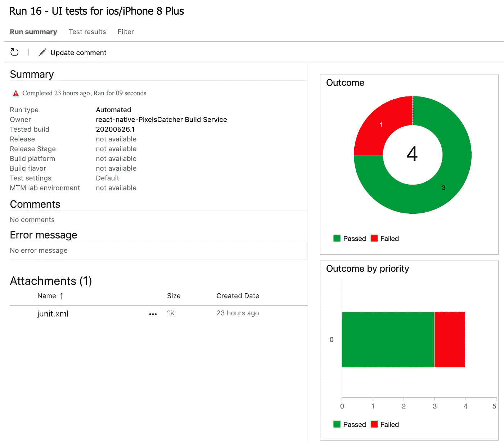

# Azure DevOps 和 React 原生 UI 测试

> 原文：<https://itnext.io/azure-devops-and-react-native-ui-testing-8144ba1a9eb?source=collection_archive---------2----------------------->


当今任何发展的一个关键组成部分是[持续交付](https://docs.microsoft.com/en-us/azure/devops/learn/what-is-continuous-delivery):

> 连续交付(CD)是从构建到生产环境的构建、测试、配置和部署过程

本文描述了如何将 UI 测试作为 CD 过程的一部分与 [Azure DevOps](https://azure.microsoft.com/en-us/services/devops/) 结合使用。Azure 的好处是它可以用于任何项目。此外，在开源项目的情况下，微软在 2018 年宣布的免费计划看起来更有吸引力- [*Azure Pipelines 无限 CI/CD 分钟用于开源*](https://azure.microsoft.com/en-us/blog/announcing-azure-pipelines-with-unlimited-ci-cd-minutes-for-open-source/) 。

如果您的 React Native 项目中还没有使用 UI 测试，最好查看 React Native 文章中的 [Pixels matter 或 easy UI screenshot testing，该文章介绍了 UI 快照的重要性以及如何开始使用它。](/pixels-matter-or-easy-ui-screenshot-testing-in-react-native-36c774cee3d1)

# 入门指南

将 [PixelsCatcher](https://github.com/rumax/react-native-PixelsCatcher) 集成到 [Azure DevOps](https://azure.microsoft.com/en-us/services/devops/) 中并自动化 UI 测试只需要几个步骤。要开始，您需要:

*   集成了[像素捕捉器](https://github.com/rumax/react-native-PixelsCatcher)的工作项目
*   [Azure 账户](https://azure.com)
*   azure 如何工作以及什么是 [YAML 模式](https://docs.microsoft.com/en-us/azure/devops/pipelines/yaml-schema?view=azure-devops&tabs=schema%2Cparameter-schema)的基本知识

现在是时候创建 YAML 模式并将其用于 iOS UI 快照了。

# 使用 NodeJS 并安装 NPM 依赖项

Azure 有一个预定义的任务，允许指定 NodeJS 版本:

```
- task: NodeTool@0
  displayName: 'Use Node 12.x'
  inputs:
    versionSpec: '12.x'
```

以及运行脚本的可能性，这使得安装 NPM 依赖项成为可能:

```
- script: npm install
  displayName: 'NPM Install'
```

# 使用 xCode

要编译项目并运行 iOS 模拟器，最好指定 xCode 版本，这可以在`xcode-select`工具的帮助下完成:

```
- script: sudo xcode-select --switch /Applications/Xcode_11.3.1.app/Contents/Developer displayName: 'Select xcode 11.3'
```

或者使用 runner 提供的默认 xCode。在这种情况下，在运行器升级后，您可能会得到一些错误，您将需要调整项目以使用 xCode 的新版本。

# 编译并运行

Azure DevOps 预定义了带有不同操作的任务，以便与 xCode 配合使用。另一种方法可能是使用命令行`xcrun xcodebuild`工具。我更喜欢第二种情况，因为它可以作为编译项目和运行测试的 bash 脚本来实现。这对于本地开发或者移植到另一个构建系统或者从另一个构建系统移植过来也很有用。实现是:

```
- script: ./run_ios_debug.sh
  displayName: 'Build and run UI tests'
  workingDirectory: '$(Build.SourcesDirectory)'
```

其中`run_ios_debug.sh`是 bash 脚本可以是:

```
export FORCE_BUNDLING=1
export RCT_NO_LAUNCH_PACKAGER=1cd iosxcrun xcodebuild \
  -scheme demo \
  -workspace demo.xcworkspace \
  -configuration Debug \
  -destination 'platform=iOS Simulator,name=iPhone 8 Plus,OS=13.3' \
  -derivedDataPath $BUILD_PATH \
  ENTRY_FILE="indexSnapshot.js" \
  buildcd .../node_modules/.bin/pixels-catcher ios debug
```

仅此而已。在这一步之后，UI 快照与 Azure DevOps 集成，这就是运行 UI 测试所需的全部内容。

# 发布测试结果

Pixels Catcher 生成 JUnit 测试报告，Azure Devops 可以使用该报告来更好地概述测试。通过添加发布测试结果的任务:

```
- task: PublishTestResults@2
  condition: succeededOrFailed()
  inputs:
    testRunner: JUnit
    testResultsFiles: '$(Build.SourcesDirectory)/junit.xml'
```

您可以很容易地获得测试执行的细节:



# 发布工件

可以完成的最后一步是将结果发布到工件。如果一些测试失败，这是很方便的，可以准确地知道什么是错误的，以及组件/屏幕是如何呈现的。当然，检查日志并找到解释测试失败原因的错误消息是可能的:

```
'WebViewTest' │ 'FAILED' │ 'Files mismatch with 87 pixels'
```

但是要确切知道发生了什么，需要一个实际的结果。幸运的是，在一个任务中上传实际结果、差异和参考图像很容易:

```
- publish: $(Build.SourcesDirectory)/snapshots/ios
  condition: failed()
  artifact: screenshots_ios
  displayName: 'Test results'
```

# 结论

YAML 模式总共有 30 行代码，集成了 [PixelsCatcher](https://github.com/rumax/react-native-PixelsCatcher) 和 [Azure DevOps](https://azure.microsoft.com/en-us/services/devops/) 。但是从这一刻起，UI 测试成为持续交付的一部分，使项目更加稳定，可预测，并允许在源代码发生任何变化后交付像素级完美的应用程序。

也可以用它 Azure DevOps 和 Pixels Catcher 搭配 GitHub — [构建 GitHub 库](https://docs.microsoft.com/en-us/azure/devops/pipelines/repos/github?view=azure-devops&tabs=yaml)，这是 [PixelsCatcher](https://github.com/rumax/react-native-PixelsCatcher) 本身的情况。你可以在一个 [Pixels Catcher 演示项目](https://github.com/rumax/react-native-PixelsCatcher/tree/master/demo)中找到 UI 测试示例和 Azure 集成。

感谢您的阅读，享受 UI 测试，为您的用户提供高质量的服务！