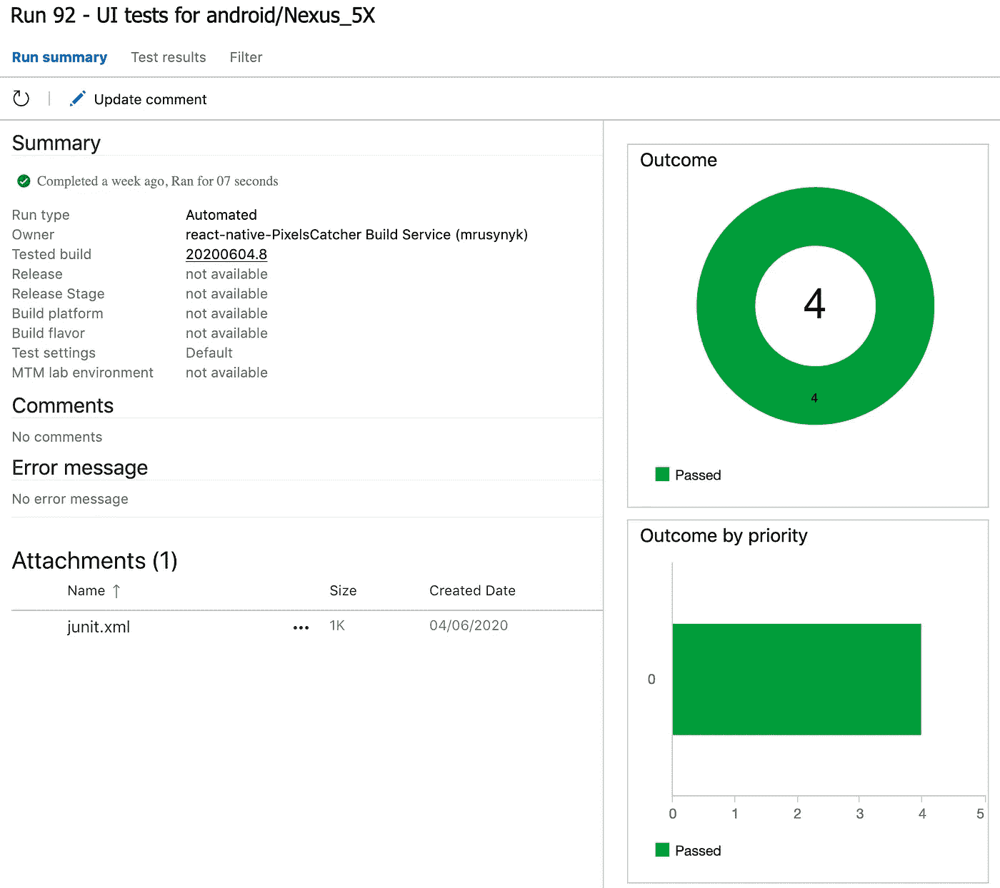

# Azure DevOps 和 React 原生 UI 测试第 2 部分- Android

> 原文：<https://itnext.io/azure-devops-and-react-native-ui-testing-part-2-android-580c44d8c7ec?source=collection_archive---------2----------------------->


在 [Azure DevOps 和 React Native UI 测试中](/azure-devops-and-react-native-ui-testing-8144ba1a9eb)描述了如何使用 Azure DevOps 实现 iOS 应用的 UI 测试。但 Azure DevOps 并不仅限于 iOS，它还可以对 android 应用程序进行 UI 测试。

# 入门指南

类似于 iOS 实现，只需要做几个步骤就可以实现 android 应用的 UI 测试。要开始，您需要:

*   集成了[像素捕捉器](https://github.com/rumax/react-native-PixelsCatcher)的工作项目
*   [Azure 账户](https://azure.com)
*   azure 如何工作以及什么是 [YAML 模式](https://docs.microsoft.com/en-us/azure/devops/pipelines/yaml-schema?view=azure-devops&tabs=schema%2Cparameter-schema)的基本知识

# 使用 NodeJS 并安装 NPM 依赖项

如果项目需要特定版本的 NodeJS，请使用 NodeTool@0 任务定义它:

```
- task: NodeTool@0
  displayName: 'Use Node 12.x'
  inputs:
    versionSpec: '12.x'
```

并安装 NPM 依赖项:

```
- script: npm install
  displayName: 'NPM Install'
```

# 创建 Android 模拟器

要运行 UI 测试，有必要准备 android 模拟器，这可以很容易地通过 Azure DevOps 和 Android 模拟器手册上的[测试来完成，方法是将脚本添加到项目中，比如说添加到`scripts/create_android_emulator.sh` 并定义步骤:](https://docs.microsoft.com/en-us/azure/devops/pipelines/ecosystems/android?view=azure-devops#test-on-the-android-emulator)

```
- script: ./scripts/create_android_emulator.sh
  displayName: 'Create and start Android Emulator'
```

这将创建并启动一个 android 模拟器。这意味着环境已经准备好进行测试了。

# 编译和运行 UI 测试

对此几乎没有选择:

*   使用预定义的`Gradle`任务编译和构建应用程序
*   使用命令行和 [bash 脚本](https://github.com/rumax/react-native-PixelsCatcher/blob/master/demo/run_android_debug.sh)，在一个步骤中编译和运行测试:

```
- script: ./run_android_debug.sh
  displayName: 'Run tests'
  workingDirectory: '$(Build.SourcesDirectory)/demo'
```

# 发布测试结果

执行完所有测试并生成 JUnit 测试报告后，就该上传结果了。这可以通过 PublishTestResults@2 任务来完成:

```
- task: PublishTestResults@2
  condition: succeededOrFailed()
  inputs:
    testRunner: JUnit
    testResultsFiles: '$(Build.SourcesDirectory)/junit.xml'
```

结果可以在 Azure 测试概述中查看:



# 发布工件

可以完成的最后一步是将结果发布到管道工件。如果一些测试失败，这是很方便的，并且可以准确地知道什么是错误的以及组件/屏幕是如何呈现的:

```
- publish: $(Build.SourcesDirectory)/snapshots/android
  condition: failed()
  artifact: screenshots_android
  displayName: 'Test results'
```

# 摘要

仅此而已！另外 30 行代码的 YAML 模式和 Android UI 测试是完全自动化的，并成为持续交付的一部分，使项目更加稳定，可预测，并使其有可能在源代码发生任何变化后向您的用户交付像素级完美的应用程序。