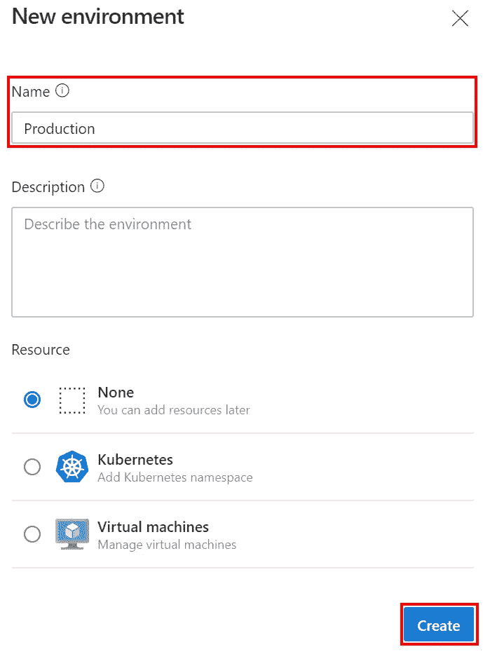
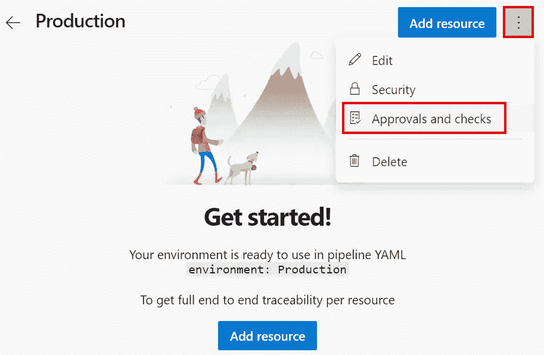
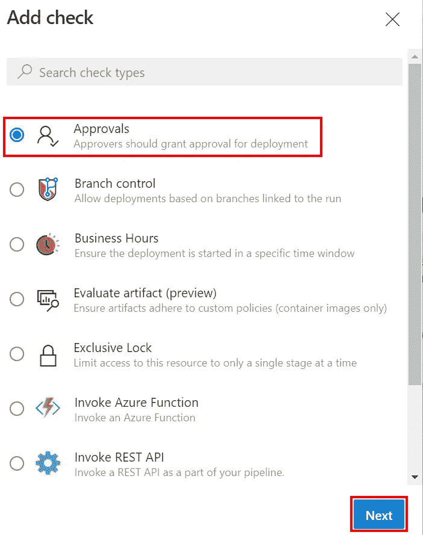
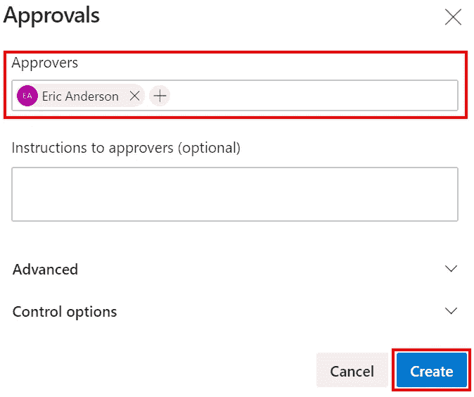
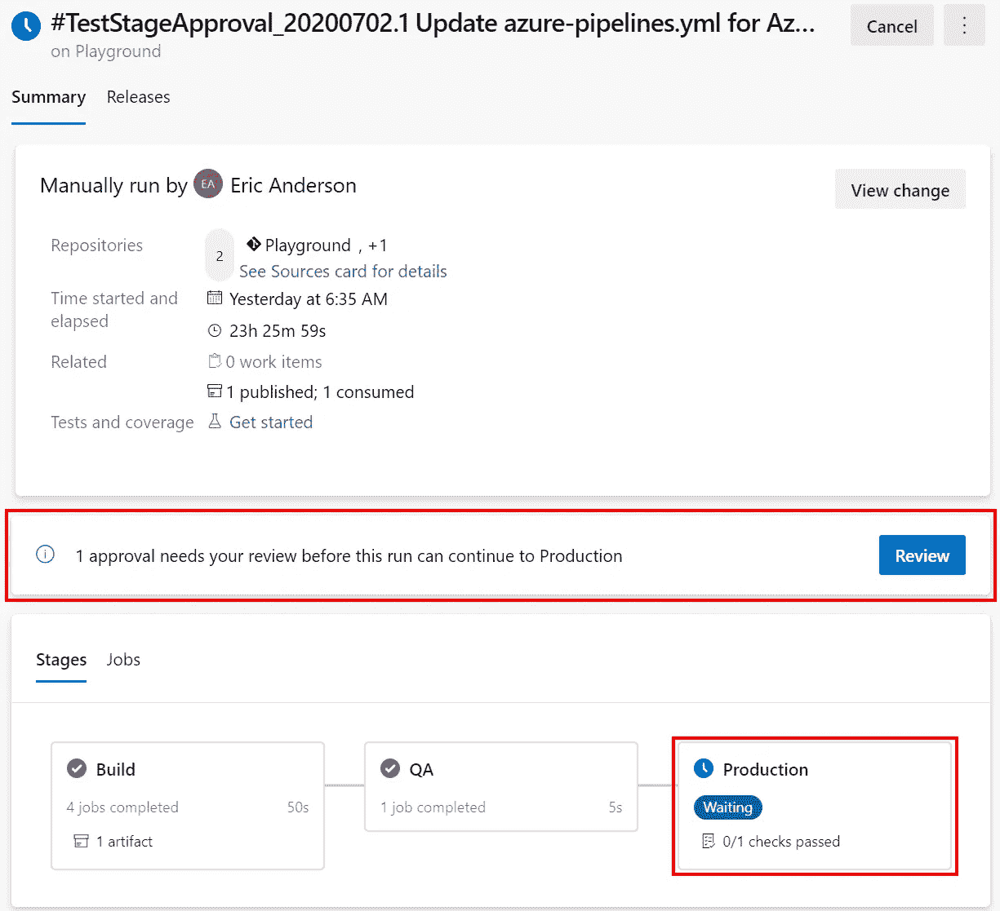
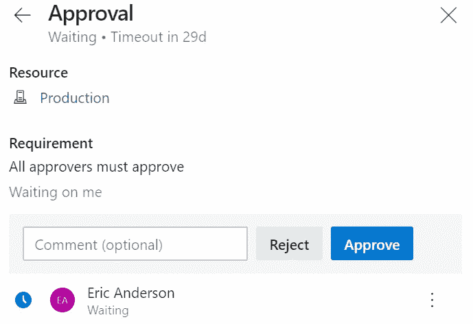

# Azure DevOps 多阶段管道:需要阶段批准

> 原文：<https://itnext.io/azure-devops-multi-stage-pipelines-require-stage-approval-f7109ec8f877?source=collection_archive---------2----------------------->

在上周的帖子中，我们介绍了如何利用现有的构建管道，并使其成为一个包含构建阶段和部署阶段的多阶段管道。本周，我们将在生产流程中增加一个阶段。由于我们不希望生产阶段在通过 QA 之前部署，所以我们需要保留该阶段，直到它被验证准备就绪，这就是这篇文章将要讲述的内容。如果你还没有阅读上周的文章，Azure DevOps Pipelines:多级管道，如果你是多级管道的新手，你可能想在阅读这篇文章的其余部分之前开始阅读。


## 添加环境

为了在阶段上要求批准，需要将其与环境相关联，并将批准要求添加到环境中。在 Azure DevOps 中的**管道**下，选择**环境**，然后点击**创建环境**按钮。


在新环境对话框中填入一个**名**。如果您有与环境相关联的实际资源，可以添加它们来提供可追溯性，但是在本例中，我们将坚持使用 None 选项。



## 要求批准环境

既然已经在其详细信息页面上创建了资源，我们可以使用**三个点**来打开菜单，并单击**批准和检查**。



在下一个屏幕上，点击右上角的 **+** 按钮，然后从检查列表中选择**批准**，然后点击**下一步**。从截图中的部分列表可以看出，可用于审批的检查范围非常广泛。



下一个对话框用于选择应该能够执行环境审批的用户或组。当你的批准被设置后，点击**创建**完成。



## 使用管道中的环境

如果你是从以前的帖子开始的，那么**部署**阶段已经被重命名为 **QA** 以使管道结果更加清晰。

```
Before:
- stage: Deploy
  jobs:
  - job: Deploy
    steps:
      - script: echo Fake deploying code

After:
- stage: QA
  jobs:
  - job: DeployQa
    steps:
      - script: echo Deploying to QA
```

现在，我们将为我们的生产环境添加一个新阶段。请注意，我们使用的是[部署作业](https://docs.microsoft.com/en-us/azure/devops/pipelines/process/deployment-jobs?view=azure-devops)，而不是普通作业，这使我们能够指定我们想要的环境。部署工作比我们正在使用的功能多得多，所以请确保查看文档，看看还有什么其他选项可用。

```
- stage: Production
  jobs:
  - deployment: DeployProduction
    environment: 'Production'
    strategy:
     runOnce:
       deploy:
         steps:
          - script: echo Deploying to Production
```

保存并运行管道，我们将看看这个新的状态与构建和 QA 阶段有什么不同。

## 管道结果

正如您在下面的屏幕截图中看到的，管道运行的结果有一个部分，通知生产阶段在经过审查之前不能运行。另外，请注意在 Stages 部分，生产阶段显示等待状态。



点击**审查**按钮将显示一个对话框，允许您批准或拒绝正在等待的阶段。



## 包扎

环境提供的额外选项层支持我第一次开始使用多级管道时错过的大多数场景。将应用程序的构建和发布步骤放在源代码控制中，并增加了根据分支改变它们的能力，即使我不得不处理更多的 YAML，这也是值得的。

*原载于* [*安德森*](https://elanderson.net/2020/07/azure-devops-multi-stage-pipelines-require-stage-approval/) *。*