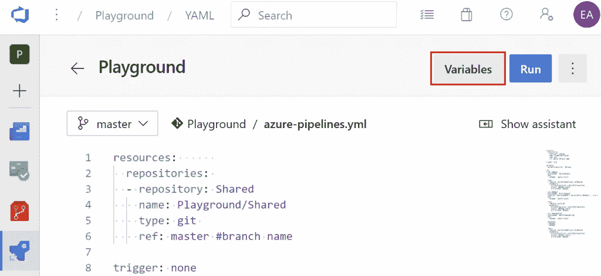
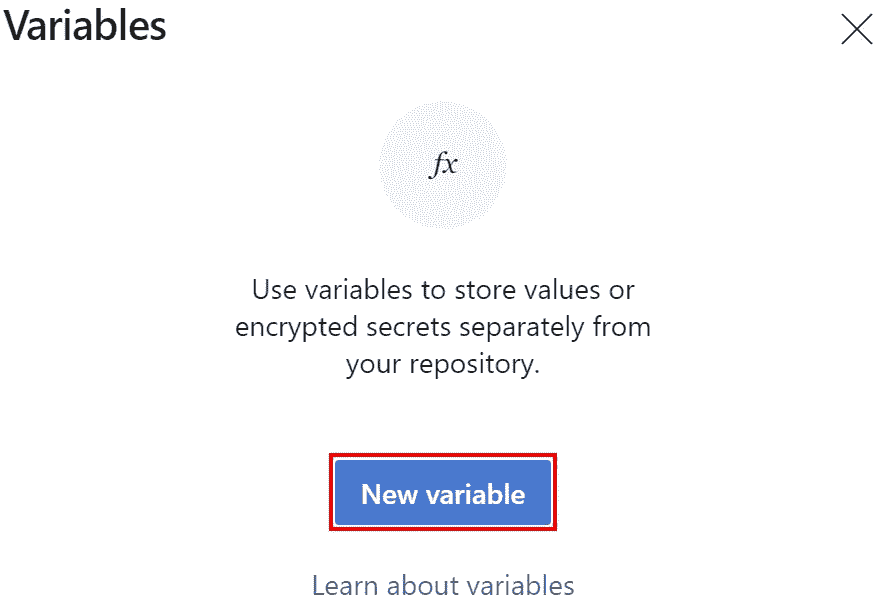
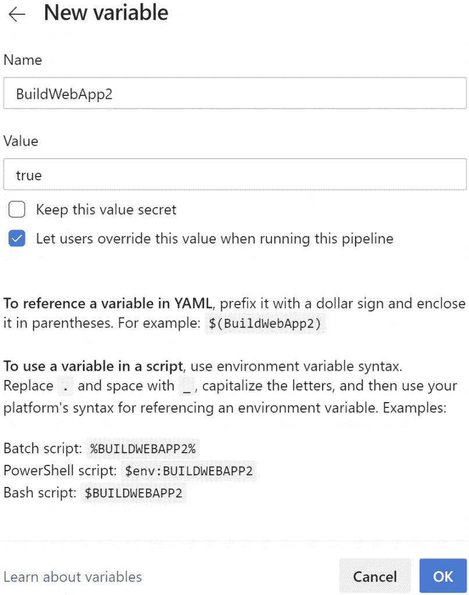
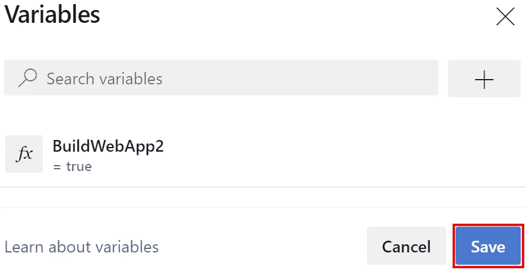
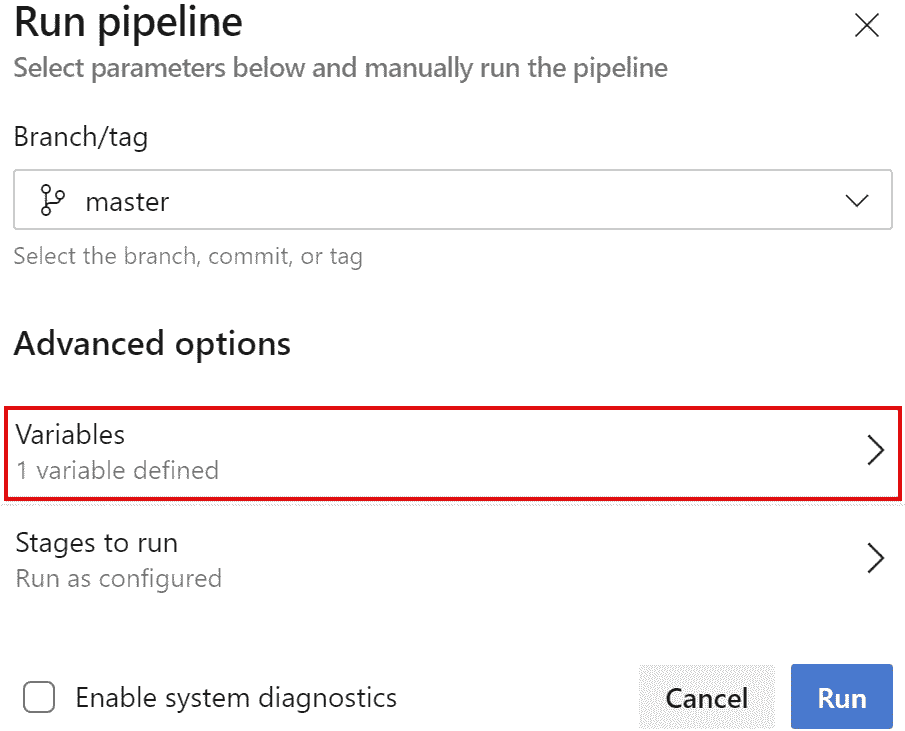
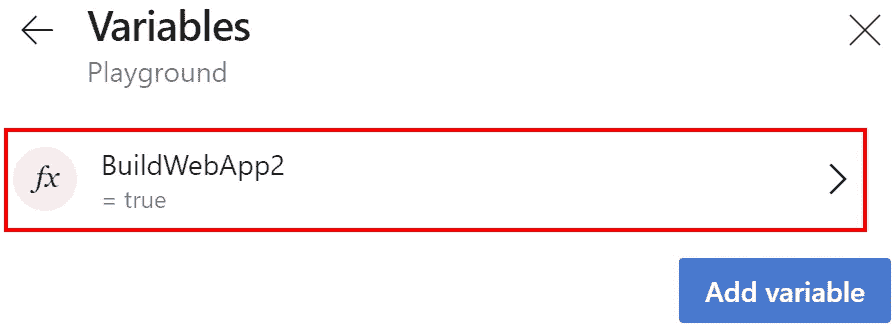
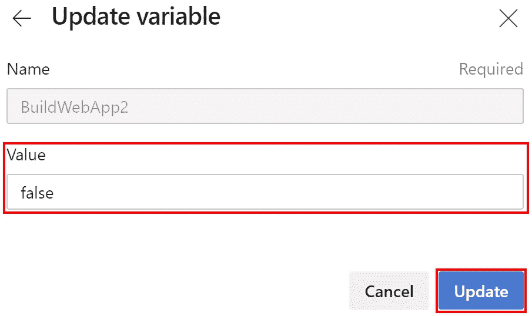
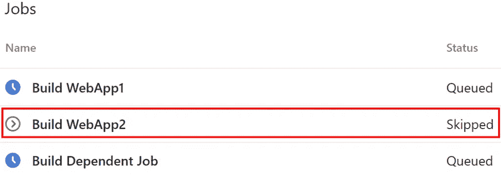
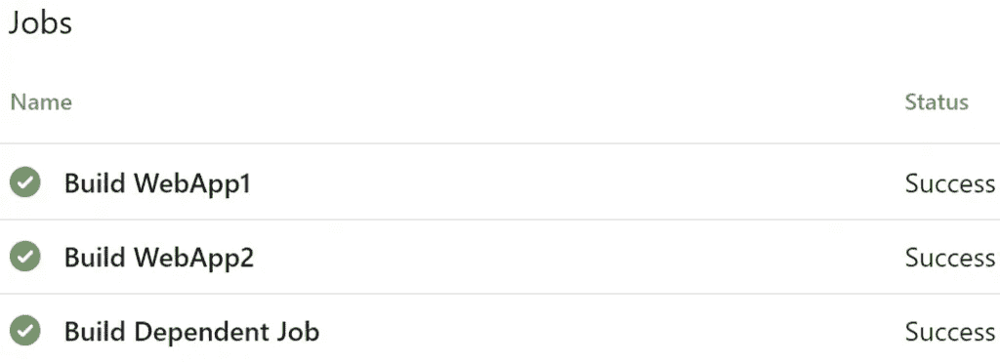

# Azure DevOps 管道:YAML 的条件

> 原文：<https://itnext.io/azure-devops-pipelines-conditionals-in-yaml-735cc7d4c226?source=collection_archive---------5----------------------->

在本周的帖子中，我们将介绍一些让任务和作业有条件运行的方法。这将包括诸如依赖于其他作业的作业的管道变量等选项。这篇文章将使用一个在过去几周的文章中构建的示例 Azure DevOps 项目。如果你想看这个集结，看看下面的帖子。

[Azure devo PS 入门](https://elanderson.net/2020/02/getting-started-with-azure-devops/)
[Azure devo PS 中的管道创建](https://elanderson.net/2020/03/pipeline-creation-in-azure-devops/)
[Azure DevOps 为 ASP.NET 核心发布工件](https://elanderson.net/2020/03/azure-devops-publish-asp-net-core/)
[Azure DevOps 管道:YAML 的多个作业](https://elanderson.net/2020/03/azure-devops-pipelines-multiple-jobs-in-yaml/)
[Azure DevOps 管道:可重用 YAML](https://elanderson.net/2020/03/azure-devops-pipelines-reuseable-yaml/)
[Azure DevOps 管道:跨 Repos 使用 YAML](https://elanderson.net/2020/04/azure-devops-pipelines-use-yaml-across-repos/)


## YAML 样本

下面的 YAML 是基于以前帖子中的 YAML，通过使用一些有条件地运行一些任务或作业的方法的例子进行了扩展。这是完整的参考文件，文章的其余部分将根据需要调出文件的特定部分。

```
resources:      
  repositories: 
  - repository: Shared
    name: Playground/Shared
    type: git 
    ref: master #branch name

trigger: none

variables:
  buildConfiguration: 'Release'

jobs:
- job: WebApp1
  displayName: 'Build WebApp1'
  pool:
    vmImage: 'ubuntu-latest'

  steps:
  - template: buildCoreWebProject.yml@Shared
    parameters:
      buildConFiguration: $(buildConfiguration)
      project: WebApp1.csproj
      artifactName: WebApp1

- job: WebApp2
  displayName: 'Build WebApp2'
  condition: and(succeeded(), eq(variables['BuildWebApp2'], 'true'))
  pool:
    vmImage: 'ubuntu-latest'

  steps:
  - template: build.yml
    parameters:
      buildConFiguration: $(buildConfiguration)
      project: WebApp2.csproj
      artifactName: WebApp2

- job: DependentJob
  displayName: 'Build Dependent Job'
  pool:
    vmImage: 'ubuntu-latest'

  dependsOn:
  - WebApp1
  - WebApp2

  steps:
  - template: buildCoreWebProject.yml@Shared
    parameters:
      buildConFiguration: $(buildConfiguration)
      project: WebApp1.csproj
      artifactName: WebApp1Again
```

## 作业相关性

管道越复杂，管道越有可能在其他作业完成之前无法运行某个作业。上面的 YAML 定义了三个不同的作业，WebApp1、WebApp2 和 DependentJob。我相信您现在已经猜到第三份工作是有依赖关系的工作。为了使一个作业依赖于其他作业，我们使用 **dependsOn** 元素，并列出在相关作业运行之前必须完成的作业。以下是示例 DependentJob 的 YAML，其中突出显示了**依赖于**部分。

```
- job: DependentJob
  displayName: 'Build Dependent Job'
  pool:
    vmImage: 'ubuntu-latest'

  dependsOn:
  - WebApp1
  - WebApp2

  steps:
  - template: buildCoreWebProject.yml@Shared
    parameters:
      buildConFiguration: $(buildConfiguration)
      project: WebApp1.csproj
      artifactName: WebApp1Again
```

通过上述设置，只有在 WebApp1 和 WebApp2 作业都成功完成的情况下，DependentJob 才会运行。

## 情况

条件是控制作业或任务是否运行的一种方式。以下示例是在作业级别，但同样的概念也适用于任务级别。注意突出显示的**状态**。

```
- job: WebApp2
  displayName: 'Build WebApp2'
  condition: and(succeeded(), eq(variables['BuildWebApp2'], 'true'))
  pool:
    vmImage: 'ubuntu-latest'

  steps:
  - template: build.yml
    parameters:
      buildConFiguration: $(buildConfiguration)
      project: WebApp2.csproj
      artifactName: WebApp2
```

如果 **BuildWebApp2** 变量不为真，上述条件将导致 WebApp2 作业被跳过。有关如何使用条件的更多详细信息，请参见[条件文档](https://docs.microsoft.com/en-us/azure/devops/pipelines/process/conditions?view=azure-devops&tabs=yaml)。

## 创建管道变量

本文的其余部分将介绍如何创建一个管道变量，然后运行一些示例构建，以展示以上 YAML 中定义的依赖和条件如何影响管道结果。

我们从已经在编辑的现有管道开始。要添加(或编辑)变量，点击屏幕右上角的**变量**按钮。



将显示弹出的变量。如果我们有现有的变量，它们显示在这里。点击**新变量**按钮添加一个新变量。



我们正在添加一个变量，它将控制名为 **BuildWebApp2** 的 WebApp2 的构建，该变量默认为 **true** 的值。此外，确保选中**让用户在运行此管道时覆盖此值**复选框，以便我们在运行管道时编辑此变量。然后点击**确定**按钮。



回到变量对话框，点击**保存**按钮。



## 启动管道时编辑变量

现在我们的管道有了一个变量，当在**高级选项**下运行管道时，你会看到**变量**部分显示我们的管道定义了 1 个变量。点击**变量**查看/编辑将用于本次管道运行的变量。



在 Variables 部分，您将看到一个已定义变量的列表，以及一个添加新变量的选项，这些变量只存在于管道的这一段中。单击 **BuildWebApp2** 变量，编辑将用于管道运行的值。



在“更新变量”对话框中，您可以更改变量的值。完成后点击**更新**按钮。



## 来自 YAML 样本的管道结果

下面是我们的示例管道在将 **BuildWebApp2** 变量设置为 false 时的样子。如您所见，该作业将被跳过。



接下来是管道运行的完整结果。您可以看到依赖于构建的作业也被跳过，因为构建 WebApp1 和构建 WebApp2 必须成功完成才能运行。


将 BuildWebApp2 变量改回 true 并再次运行管道会导致所有作业成功运行。



## 包扎

希望这有助于向您介绍一些控制管道的方法。与其他所有东西一样，Azure DevOps 相关的东西正在发生很大的变化，新的选项一直在涌现。例如，在写这篇文章的时候，团队刚刚宣布了运行时参数,这看起来比在管道运行之间频繁变化的值的变量更好。

*原载于* [*安德森*](https://elanderson.net/2020/04/azure-devops-pipelines-conditionals-in-yaml/) *。*