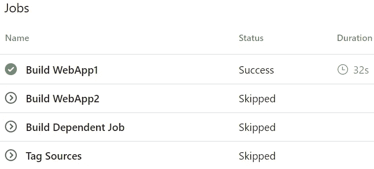
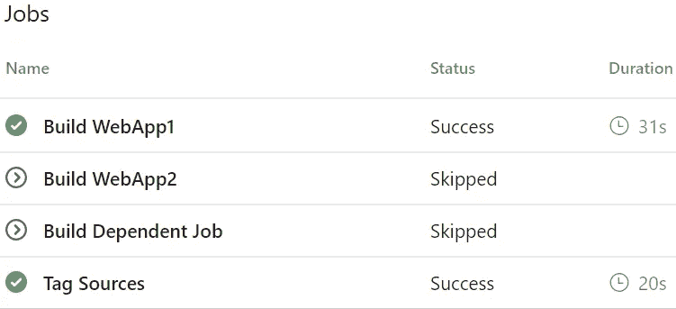

# Azure DevOps 管道:依赖于 YAML 的 with 条件

> 原文：<https://itnext.io/azure-devops-pipelines-depends-on-with-conditionals-in-yaml-96f0f26fe090?source=collection_archive---------3----------------------->

几周前，我们在 YAML 中讨论了[条件，展示了如何有条件地运行任务和作业，以及如何使一个作业依赖于另一个作业。这篇文章将讨论条件依赖和作业依赖的结合。如果你是这个系列的新手，你可以使用下面的文章来跟上。](https://elanderson.net/2020/04/azure-devops-pipelines-conditionals-in-yaml/)

[Azure devo PS 入门](https://elanderson.net/2020/02/getting-started-with-azure-devops/)
[Azure devo PS 中的管道创建](https://elanderson.net/2020/03/pipeline-creation-in-azure-devops/)
[Azure DevOps 为 ASP.NET 核心发布工件](https://elanderson.net/2020/03/azure-devops-publish-asp-net-core/)
[Azure DevOps 管道:YAML 的多个作业](https://elanderson.net/2020/03/azure-devops-pipelines-multiple-jobs-in-yaml/)
[Azure DevOps 管道:可重用的 YAML](https://elanderson.net/2020/03/azure-devops-pipelines-reuseable-yaml/)
[Azure DevOps 管道:跨 Repos 使用 YAML](https://elanderson.net/2020/04/azure-devops-pipelines-use-yaml-across-repos/)
[Azure devo PS 管道:YAML 的条件](https://elanderson.net/2020/04/azure-devops-pipelines-conditionals-in-yaml/)


## 现有作业

提醒一下，我们的示例管道有 4 个作业。WebApp1 作业始终运行，WebApp2 作业根据管道变量运行或跳过，DependentJob 依赖于 WebApp1 和 WebApp2，最后，TagSources 作业依赖于所有以前的作业。在这篇文章中，我们将调整 TagSources 的工作。以下是设置不带任务的 TagSources 作业的 YAML。

```
- job: TagSources
  displayName: 'Tag Sources'
  pool:
    vmImage: 'ubuntu-latest'

  dependsOn:
  - WebApp1
  - WebApp2
  - DependentJob
```

使用此设置，WebApp1、WebApp2 和 DependentJob 都必须报告成功，否则将跳过 TagSources 作业。以下屏幕截图显示了将变量 to build WebApp2 设置为 false 的管道运行。



如您所见，TagSources 作业被跳过，因为它的一个依赖作业被跳过。

## 有条件的依赖关系

假设对于我们的管道，我们希望只要所有作业都成功，或者如果 WebApp1 成功并且跳过了 WebApp2 和 DependentJob 作业，就运行 TagSources 作业。为此，我们将添加一个**条件**元素，并手动检查依赖关系的结果，如下所示。

```
- job: TagSources
  displayName: 'Tag Sources'
  pool:
    vmImage: 'ubuntu-latest'

  dependsOn:
  - WebApp1
  - WebApp2
  - DependentJob
  condition: |
    and
    (
      eq(dependencies.WebApp1.result, 'Succeeded'),
      in(dependencies.WebApp2.result, 'Succeeded', 'Skipped'),
      in(dependencies.DependentJob.result, 'Succeeded', 'Skipped')
    )
```

您可以在结果中看到，TagSources 作业甚至在两个被跳过的作业中运行。



## 包扎

如果有一个更简单的方法来完成我们上面所做的，我很乐意听到它。如果我没记错的话，我是在 GitHub 的一期杂志上看到上述内容的，但是我没有链接。我不确定你们中有多少人会有需要这个的管道，但希望这能节省一些研究时间。

*原载于* [*安德森*](https://elanderson.net/2020/05/azure-devops-pipelines-depends-on-with-conditionals-in-yaml/) *。*