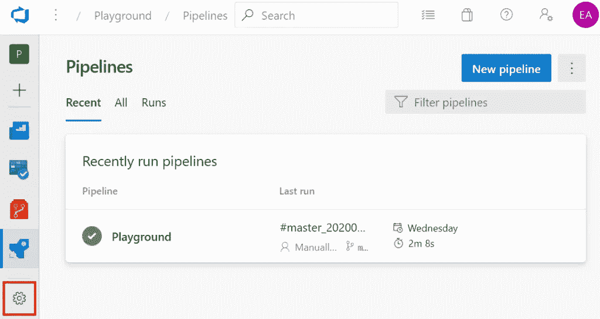
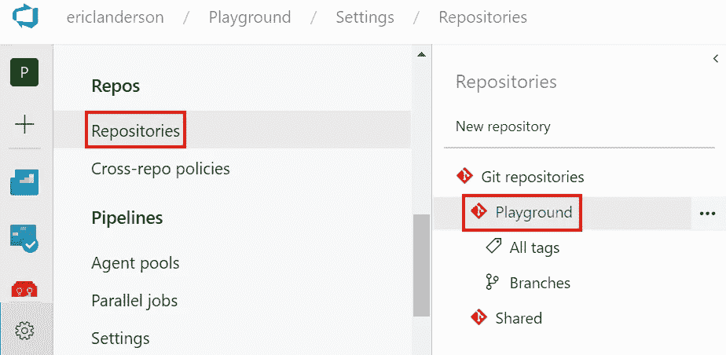
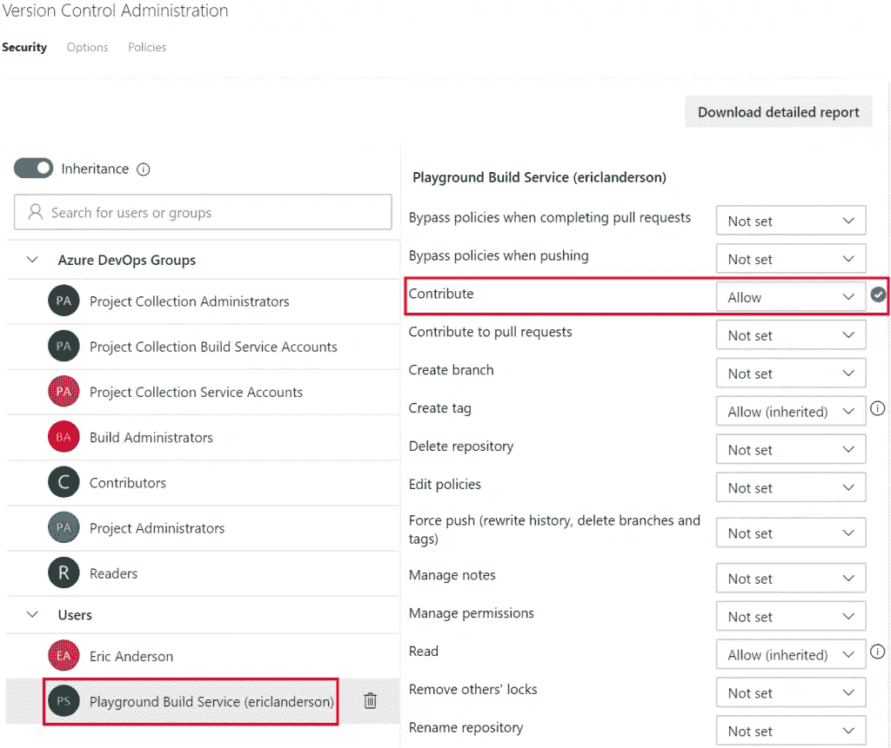

# Azure DevOps 管道:手动标记

> 原文：<https://itnext.io/azure-devops-pipelines-manual-tagging-244721c16c38?source=collection_archive---------3----------------------->

在本周的帖子中，我们将讨论手动标记，而不是使用 Azure DevOps 内置的标记功能。这篇文章将使用一个在过去几周的文章中构建的示例 Azure DevOps 项目。如果你想知道这个项目是如何进行到这一步的，请看下面的帖子。

[Azure devo PS 入门](https://elanderson.net/2020/02/getting-started-with-azure-devops/)
[Azure devo PS 中的管道创建](https://elanderson.net/2020/03/pipeline-creation-in-azure-devops/)
[Azure DevOps 为 ASP.NET 核心发布工件](https://elanderson.net/2020/03/azure-devops-publish-asp-net-core/)
[Azure DevOps 管道:YAML 的多个作业](https://elanderson.net/2020/03/azure-devops-pipelines-multiple-jobs-in-yaml/)
[Azure DevOps 管道:可重用的 YAML](https://elanderson.net/2020/03/azure-devops-pipelines-reuseable-yaml/)
[Azure DevOps 管道:跨 Repos 使用 YAML](https://elanderson.net/2020/04/azure-devops-pipelines-use-yaml-across-repos/)
[Azure devo PS 管道:YAML 的条件](https://elanderson.net/2020/04/azure-devops-pipelines-conditionals-in-yaml/)


## 为什么？

当事件发生时，标签为您提供关于您的回购状态的信息，这是我们案例的一个构建。这非常有用，特别是当你需要一个地方来安装补丁的时候。我的[Azure devo PS Pipelines:Naming and Tagging](https://elanderson.net/2020/04/azure-devops-pipelines-naming-and-tagging/)帖子中提到的自动标记是一种可行的方法，它已经在我 95%的项目中使用。我有几个项目，自动标记由于某种原因无法工作。因为我不知道为什么 Azure DevOps 不标记，所以我不得不在管道中添加一个作业来执行标记。

## 许可

要执行此手动标记，我们管道中使用的帐户将需要为我们的回购提供 contribute 权限，以便它能够推送标记。使用左下方的齿轮打开项目设置页面。



选择**存储库**选项，然后单击您想要更改其设置的特定回购协议，**游乐场**是我们在示例中使用的回购协议。请注意，如果您想要更改所有回购的权限，也可以使用顶级的 **Git repositories** 选项来更改该设置。



在 **Users** 下的 **Security** 选项卡上，查找名称中包含 **Build Service** 的用户并选择它。当用户被选中时，它会在用户的右边显示他们的权限。找到**贡献**选项，将其值改为**允许**。



## YAML 的变化

快速提醒一下，这个项目的 YAML 目前有 3 个职位。两个 web 应用程序构建(WebApp1、WebApp2)，第三个作业展示了如何使用作业依赖关系(DependentJob)。我将跳过显示这些现有工作的 YAML，但如果你需要完整的现有 YAML，可以在顶部链接的帖子中找到。

由于我们已经有多个作业在我们的管道中，我们将添加标记代码作为一个新的作业。这将很容易让我们只在所有其他作业成功运行时进行标记。以下是这份新工作的完整 YAML。

```
- job: TagSources
  displayName: 'Tag Sources'
  pool:
    vmImage: 'ubuntu-latest'

  dependsOn:
  - WebApp1
  - WebApp2
  - DependentJob

  steps:
  - checkout: self
    persistCredentials: true
    clean: true
    fetchDepth: 1

  - task: PowerShell@2
    inputs:
      targetType: 'inline'
      script: |
        $env:GIT_REDIRECT_STDERR` = '2>&1'
        $tag = "manual_$(Build.BuildNumber)".replace(' ', '_')
        git tag $tag
        Write-Host "Successfully created tag $tag" 

        git push --tags
         Write-Host "Successfully pushed tag $tag"     

      failOnStderr: false
```

首先，您会看到，在这个新作业运行之前，这个作业依赖于我们现有的三个作业来成功完成。

```
dependsOn: 
- WebApp1 
- WebApp2 
- DependentJob
```

从**步骤**部分开始，您会看到一个**检查**步骤，通常由作业自动处理，但在这种情况下，我们需要使用 **persistCredential** 选项，这样作业仍将被授权，并允许我们推送到 git repo。**自身**选项用于表示当前回购/分支。更多信息见官方[结账文件](https://docs.microsoft.com/en-us/azure/devops/pipelines/yaml-schema?view=azure-devops&tabs=schema%2Cparameter-schema#checkout)。

```
- checkout: self
  persistCredentials: true
  clean: true
  fetchDepth: 1
```

这项工作的最后一部分是执行实际标记和推送的 PowerShell 任务。我在 stackoverflow 和/或 GitHub 上找到了大部分内容，但是已经有一段时间了，所以我手头没有相关链接。StdErr 的内容是解决一些 git 输出，这些输出不会影响标记，但会导致作业被标记为失败。除此之外，它使用标准的 git 命令来标记和推送。

```
- task: PowerShell@2
  inputs:
    targetType: 'inline'
    script: |
      $env:GIT_REDIRECT_STDERR` = '2>&1'
      $tag = "manual_$(Build.BuildNumber)".replace(' ', '_')
      git tag $tag
      Write-Host "Successfully created tag $tag" 

      git push --tags
       Write-Host "Successfully pushed tag $tag"     

    failOnStderr: false
```

## 包扎

我真心希望你们都不用这个。锻炼是一件非常痛苦的事情。这也是为了解决 Azure DevOps 内置标签支持的一些问题。公平地说，我可以看到在更复杂的管道中，您可能需要某种程度的灵活性，而内置标记无法提供这种灵活性，这将是您唯一的选择。

*原载于*[](https://elanderson.net/2020/04/azure-devops-pipelines-manual-tagging/)**。**