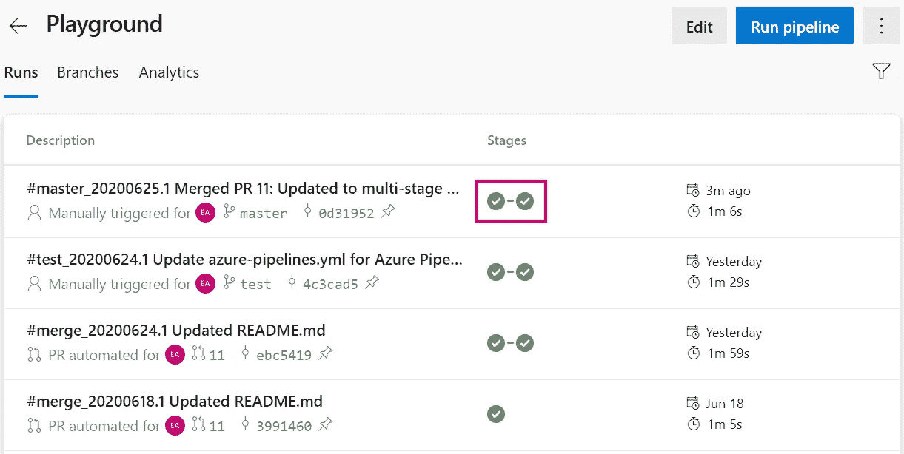
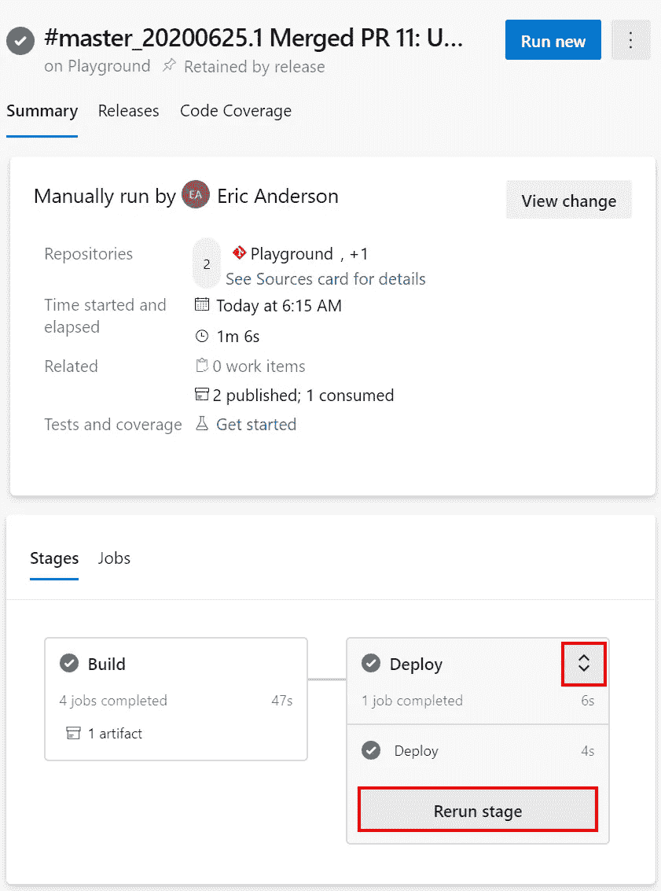

# Azure DevOps 管道:多级管道

> 原文：<https://itnext.io/azure-devops-pipelines-multi-stage-pipelines-555dad72047c?source=collection_archive---------8----------------------->

前几篇文章一直在讨论 Azure Pipelines 下的 Releases 区域管理的发布。本周，我们将把我们在 Azure DevOps 的独立领域中所做的事情变成目前构建我们应用程序的 YAML 的一部分。如果你需要一些关于这个项目如何发展到这一步的背景知识，可以看看下面的帖子。

[Azure devo PS 入门](https://elanderson.net/2020/02/getting-started-with-azure-devops/)
[Azure devo PS 中的管道创建](https://elanderson.net/2020/03/pipeline-creation-in-azure-devops/)
[Azure DevOps 为 ASP.NET 核心发布工件](https://elanderson.net/2020/03/azure-devops-publish-asp-net-core/)
[Azure DevOps 管道:YAML 的多个作业](https://elanderson.net/2020/03/azure-devops-pipelines-multiple-jobs-in-yaml/)
[Azure DevOps 管道:可重用的 YAML](https://elanderson.net/2020/03/azure-devops-pipelines-reuseable-yaml/)
[Azure DevOps 管道:跨 Repos 使用 YAML](https://elanderson.net/2020/04/azure-devops-pipelines-use-yaml-across-repos/)
[Azure devo PS 管道:YAML 的条件](https://elanderson.net/2020/04/azure-devops-pipelines-conditionals-in-yaml/)
[Azure DevOps 管道:依赖于 YAML 的 with 条件](https://elanderson.net/2020/04/azure-devops-pipelines-naming-and-tagging/)
[Azure DevOps 管道:PowerShell 任务](https://elanderson.net/2020/05/azure-devops-pipelines-powershell-task/)
[Azure DevOps 版本:在管道构建后自动创建新版本](https://elanderson.net/2020/07/azure-devops-releases-auto-create-new-release-after-pipeline-build/)
[Azure DevOps 版本:自动创建带有拉请求的版本](https://elanderson.net/2020/07/azure-devops-releases-auto-create-release-with-pull-requests/)


## 概述

我们目前的设置使用基于 YAML 的 Azure 管道来构建几个 ASP.NET 核心 web 应用程序。然后在发布方面，我们基本上有一个虚拟发布，它实际上不做任何事情，只是作为如何配置持续部署类型发布的演示。以下是目前 YAML 的管道供我们参考。

```
name: $(SourceBranchName)_$(date:yyyyMMdd)$(rev:.r)

resources:      
  repositories: 
  - repository: Shared
    name: Playground/Shared
    type: git 
    ref: master #branch name

trigger: none

variables:
  buildConfiguration: 'Release'

jobs:
- job: WebApp1
  displayName: 'Build WebApp1'
  pool:
    vmImage: 'ubuntu-latest'

  steps:
  - task: PowerShell@2
    inputs:
      targetType: 'inline'
      script: 'Get-ChildItem -Path Env:\'

  - template: buildCoreWebProject.yml@Shared
    parameters:
      buildConFiguration: $(buildConfiguration)
      project: WebApp1.csproj
      artifactName: WebApp1

- job: WebApp2
  displayName: 'Build WebApp2'
  condition: and(succeeded(), eq(variables['BuildWebApp2'], 'true'))
  pool:
    vmImage: 'ubuntu-latest'

  steps:
  - template: build.yml
    parameters:
      buildConFiguration: $(buildConfiguration)
      project: WebApp2.csproj
      artifactName: WebApp2

- job: DependentJob
  displayName: 'Build Dependent Job'
  pool:
    vmImage: 'ubuntu-latest'

  dependsOn:
  - WebApp1
  - WebApp2

  steps:
  - template: buildCoreWebProject.yml@Shared
    parameters:
      buildConFiguration: $(buildConfiguration)
      project: WebApp1.csproj
      artifactName: WebApp1Again

- job: TagSources
  displayName: 'Tag Sources'
  pool:
    vmImage: 'ubuntu-latest'

  dependsOn:
  - WebApp1
  - WebApp2
  - DependentJob
  condition: |
    and
    (
      eq(dependencies.WebApp1.result, 'Succeeded'),
      in(dependencies.WebApp2.result, 'Succeeded', 'Skipped'),
      in(dependencies.DependentJob.result, 'Succeeded', 'Skipped')
    )

  steps:
  - checkout: self
    persistCredentials: true
    clean: true
    fetchDepth: 1

  - task: PowerShell@2
    inputs:
      targetType: 'inline'
      script: |
        $env:GIT_REDIRECT_STDERR` = '2>&1'
        $tag = "manual_$(Build.BuildNumber)".replace(' ', '_')
        git tag $tag
        Write-Host "Successfully created tag $tag" 

        git push --tags
         Write-Host "Successfully pushed tag $tag"     

      failOnStderr: false
```

上面的设置工作得很好，但在今年 4 月，Azure Pipelines 有了[多级管道](https://devblogs.microsoft.com/premier-developer/azure-devops-pipelines-multi-stage-pipelines-and-yaml-for-continuous-delivery/)的概念，这使我们能够在与我们的构建相同的 YAML 中管理发布方面的事情，并允许发布受源代码控制，并且每个分支都不同，就像在 YAML 的构建一样。

## 简化版 YAML

以上是我们的示例构建的完整 YAML，其中包含大量代码。下面是一个配对的版本，我们将在这篇文章的剩余部分使用，它只构建 WebApp1，应该有助于突出这些变化。

```
name: $(SourceBranchName)_$(date:yyyyMMdd)$(rev:.r)

resources:      
  repositories: 
  - repository: Shared
    name: Playground/Shared
    type: git 
    ref: master #branch name

trigger: none

variables:
  buildConfiguration: 'Release'

jobs:
- job: WebApp1
  displayName: 'Build WebApp1'
  pool:
    vmImage: 'ubuntu-latest'

  steps:
  - task: PowerShell@2
    inputs:
      targetType: 'inline'
      script: 'Get-ChildItem -Path Env:\'

  - template: buildCoreWebProject.yml@Shared
    parameters:
      buildConFiguration: $(buildConfiguration)
      project: WebApp1.csproj
      artifactName: WebApp1
```

## 添加阶段

阶段是分组的额外一层，有助于划分管道，类似于作业的工作方式，只是级别更高。作业是一组步骤，但阶段是一组作业。在下面的 YAML 中，您可以看到我们现有的作业已经被分组到一个构建阶段下，并且添加了一个新的发布阶段。

```
name: $(SourceBranchName)_$(date:yyyyMMdd)$(rev:.r)

resources:      
  repositories: 
  - repository: Shared
    name: Playground/Shared
    type: git 
    ref: master #branch name

trigger: none

variables:
  buildConfiguration: 'Release'

stages:
- stage: Build
  jobs:
  - job: WebApp1
    displayName: 'Build WebApp1'
    pool:
      vmImage: 'ubuntu-latest'

    steps:
    - task: PowerShell@2
      inputs:
        targetType: 'inline'
        script: 'Get-ChildItem -Path Env:\'

    - template: buildCoreWebProject.yml@Shared
      parameters:
        buildConFiguration: $(buildConfiguration)
        project: WebApp1.csproj
        artifactName: WebApp1

- stage: Deploy
  jobs:
  - job: Deploy
    steps:
      - script: echo Fake deploying code
```

当添加阶段时，注意你的空格，当你在阶段中包装它们时，很容易遗漏你现有代码中的空格。

## 结果

经过上述更改运行管道后，您将在管道的摘要页面上看到，它将显示每个阶段的结果。



在特定管道运行的详细视图中，现在将有一个 Stages 选项卡，按阶段显示结果。如果您在某个阶段点击了扩展器，它还会为您提供一个重新运行某个阶段的选项(如果您需要的话)。



## 包扎

希望这将帮助您快速建立自己的多级管道。虽然我仍然不喜欢 YAML，但是当你需要的时候，让构建和发布在源代码控制中能够随分支的不同而变化是很好的。如果您希望每次都运行所有的阶段，这个设置非常有用。后续的帖子会看看如何制作一个需要审批的舞台。

*原载于* [*安德森*](https://elanderson.net/2020/07/azure-devops-pipelines-multi-stage-pipelines/) *。*