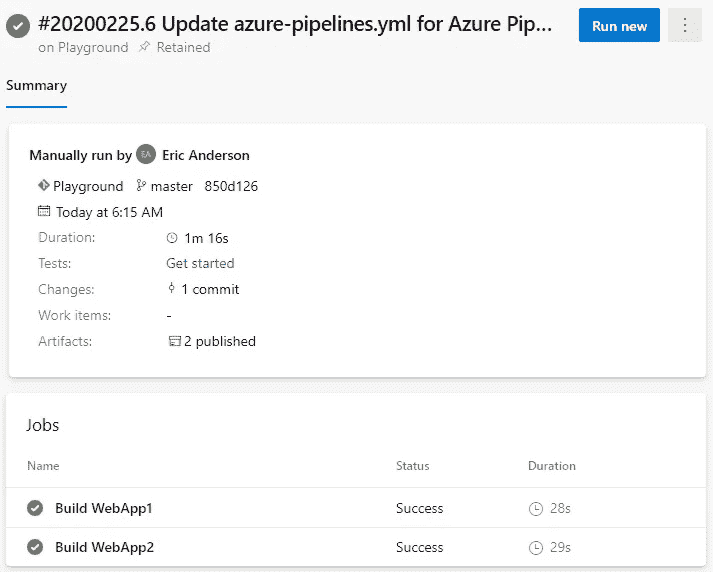

# Azure DevOps 管道:YAML 的多项工作

> 原文：<https://itnext.io/azure-devops-pipelines-multiple-jobs-in-yaml-de21b06e3cbc?source=collection_archive---------5----------------------->

这篇文章将展示如何通过 Azure DevOps 管道从一个 YAML 文件中运行多个作业。这篇文章将建立在前几篇文章中创建的 Azure DevOps 项目之上。如果您刚刚加入这个系列，请查看以前的帖子，了解项目的进展情况。

[Azure devo PS 入门](https://elanderson.net/2020/02/getting-started-with-azure-devops/)
[Azure devo PS 中的管道创建](https://elanderson.net/2020/03/pipeline-creation-in-azure-devops/)
[Azure DevOps 为 ASP.NET 核心发布工件](https://elanderson.net/2020/03/azure-devops-publish-asp-net-core/)


## 起点和计划

就目前的示例而言，我们有一个单独的管道，它使用以下 YAML 在一个作业中构建了两个不同的 ASP.NET 核心 web 应用程序。

```
trigger:
- master

pool:
  vmImage: 'ubuntu-latest'

variables:
  buildConfiguration: 'Release'

steps:
- task: UseDotNet@2
  inputs:
    packageType: 'sdk'
    version: '3.1.x'

- script: dotnet build --configuration $(buildConfiguration)
  displayName: 'dotnet build $(buildConfiguration)'

- task: DotNetCoreCLI@2
  inputs:
    command: 'publish'
    publishWebProjects: true
    arguments: '--configuration $(buildConfiguration) --output $(Build.ArtifactStagingDirectory)'

- task: PublishPipelineArtifact@1
  inputs:
    targetPath: '$(Build.ArtifactStagingDirectory)'
    publishLocation: 'pipeline'
```

这篇文章将利用这条管道，将两个 web 应用程序的构建和发布分开，并使每个应用程序成为自己的工作。在管道中，作业是单个代理接受并运行的东西。如果有足够的构建代理可用，通过拆分成多个作业，管道可以同时运行多个作业。这样做的一个原因是，如果您的构建有独立的部分，那么可以加速整个管道的运行。为什么需要作业的另一个例子是不同的作业需要不同的代理，例如一个需要 Windows 代理，另一个需要 Linux 代理。

## 创造就业机会

拥有不同的作业意味着我们必须将诸如使用什么代理池和作业的步骤之类的事情移到一个**作业**元素下，然后声明一个特定的**作业**和该作业需要运行的细节。正如您在下面的示例中看到的，最终目标与上面的 YAML 相同(除了它正在处理一个特定的项目)，但是细节嵌套在**作业**下，并在**作业**下定义。

```
trigger:
- master

variables:
  buildConfiguration: 'Release'

jobs:
- job: WebApp1
  displayName: 'Build WebApp1'
  pool:
    vmImage: 'ubuntu-latest'

  steps:
  - task: UseDotNet@2
    displayName: 'Use .NET 3.1.x'
    inputs:
      packageType: 'sdk'
      version: '3.1.x'

  - task: DotNetCoreCLI@2
    displayName: 'Build'
    inputs:
      command: 'build'
      projects: '**/WebApp1.csproj'
      arguments: '--configuration $(buildConfiguration)' 

  - task: DotNetCoreCLI@2
    displayName: 'Publish Application'
    inputs:
      command: 'publish'
      publishWebProjects: false
      projects: '**/WebApp1.csproj'
      arguments: '--configuration $(buildConfiguration) --output $(Build.ArtifactStagingDirectory)'

  - task: PublishPipelineArtifact@1
    displayName: 'Publish Artifacts'
    inputs:
      targetPath: '$(Build.ArtifactStagingDirectory)'
      artifact: 'WebApp1'
      publishLocation: 'pipeline'
```

还要注意，你仍然可以定义可以跨任务使用的变量，就像上面用 **buildConfiguration** 变量所做的那样。下面是完整的 YAML 文件，它为这两个 web 应用程序构建和发布工件。

```
trigger:
- master

variables:
  buildConfiguration: 'Release'

jobs:
- job: WebApp1
  displayName: 'Build WebApp1'
  pool:
    vmImage: 'ubuntu-latest'

  steps:
  - task: UseDotNet@2
    displayName: 'Use .NET 3.1.x'
    inputs:
      packageType: 'sdk'
      version: '3.1.x'

  - task: DotNetCoreCLI@2
    displayName: 'Build'
    inputs:
      command: 'build'
      projects: '**/WebApp1.csproj'
      arguments: '--configuration $(buildConfiguration)' 

  - task: DotNetCoreCLI@2
    displayName: 'Publish Application'
    inputs:
      command: 'publish'
      publishWebProjects: false
      projects: '**/WebApp1.csproj'
      arguments: '--configuration $(buildConfiguration) --output $(Build.ArtifactStagingDirectory)'

  - task: PublishPipelineArtifact@1
    displayName: 'Publish Artifacts'
    inputs:
      targetPath: '$(Build.ArtifactStagingDirectory)'
      artifact: 'WebApp1'
      publishLocation: 'pipeline'

- job: WebApp2
  displayName: 'Build WebApp2'
  pool:
    vmImage: 'ubuntu-latest'

  steps:
  - task: UseDotNet@2
    displayName: 'Use .NET 3.1.x'
    inputs:
      packageType: 'sdk'
      version: '3.1.x'

  - task: DotNetCoreCLI@2
    displayName: 'Build'
    inputs:
      command: 'build'
      projects: '**/WebApp2.csproj'
      arguments: '--configuration $(buildConfiguration)' 

  - task: DotNetCoreCLI@2
    displayName: 'Publish Application'
    inputs:
      command: 'publish'
      publishWebProjects: false
      projects: '**/WebApp2.csproj'
      arguments: '--configuration $(buildConfiguration) --output $(Build.ArtifactStagingDirectory)'

  - task: PublishPipelineArtifact@1
    displayName: 'Publish Artifacts'
    inputs:
      targetPath: '$(Build.ArtifactStagingDirectory)'
      artifact: 'WebApp2'
      publishLocation: 'pipeline'
```

完成所有编辑后，提交对 YAML 文件的更改，然后运行管道。正如您从下面我的示例管道运行的屏幕截图中看到的，管道有两个作业，而不是最初的 YAML 产生的一个作业。另外，请注意，管道会产生两个已发布的工件(在我们的例子中，每个作业一个)，而不是包含原始工件的工件。



## 包扎

如上所述，您可能有很多原因想要将您的管道拆分为多个作业，并且希望您现在对如何完成有一个好的想法。确保并在未来查看一篇关于如何重复任务并使其可重用的帖子。

*原载于*[](https://elanderson.net/2020/03/azure-devops-pipelines-multiple-jobs-in-yaml/)**。**