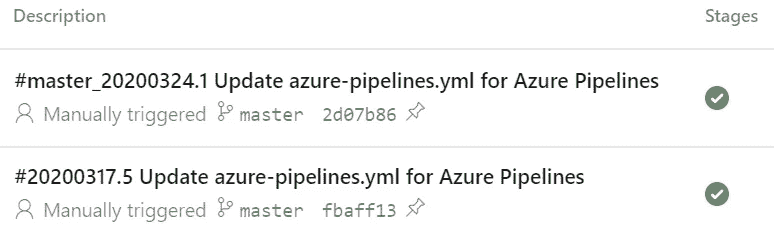
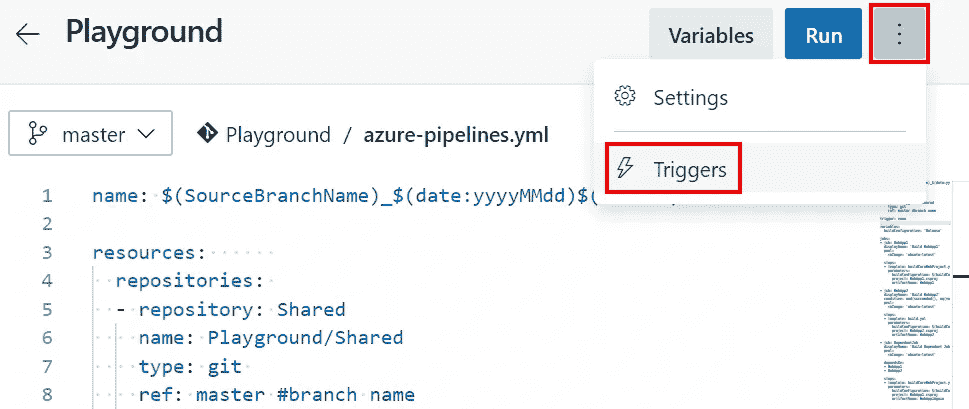
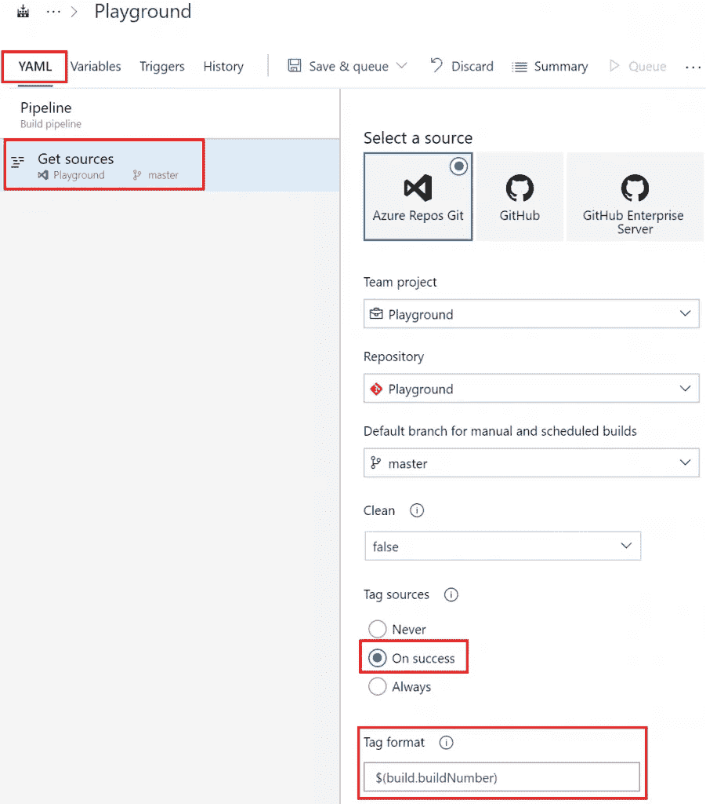
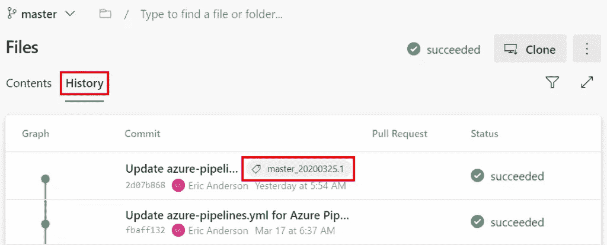

# Azure DevOps 管道:命名和标记

> 原文：<https://itnext.io/azure-devops-pipelines-naming-and-tagging-edea78b20478?source=collection_archive---------0----------------------->

在本周的帖子中，我们将讨论更改管道运行的命名，以提供更多信息，以及在管道运行时标记我们的来源。这篇文章将使用一个在过去几周的文章中构建的示例 Azure DevOps 项目。如果你想知道这个项目进展如何，可以看看下面的帖子。

[Azure devo PS 入门](https://elanderson.net/2020/02/getting-started-with-azure-devops/)
[Azure devo PS 中的管道创建](https://elanderson.net/2020/03/pipeline-creation-in-azure-devops/)
[Azure DevOps 为 ASP.NET 核心发布工件](https://elanderson.net/2020/03/azure-devops-publish-asp-net-core/)
[Azure DevOps 管道:YAML 的多个作业](https://elanderson.net/2020/03/azure-devops-pipelines-multiple-jobs-in-yaml/)
[Azure DevOps 管道:可重用的 YAML](https://elanderson.net/2020/03/azure-devops-pipelines-reuseable-yaml/)
[Azure DevOps 管道:跨 Repos 使用 YAML](https://elanderson.net/2020/04/azure-devops-pipelines-use-yaml-across-repos/)
[Azure devo PS 管道:YAML 的条件](https://elanderson.net/2020/04/azure-devops-pipelines-conditionals-in-yaml/)


## 命名

默认情况下，管道运行使用当前日期命名，并带有一个数字来表示管道在一天中运行的次数。例如，2020 年 3 月 17 日的第四次构建将以名称 **20200317.4** 加上最后一次提交的描述开始。如果您需要，您可以通过在您的 YAML 中使用一个 **name** 元素来更改这个命名方案。和其他与 YAML 相关的东西一样，你拥有和管道中的其他东西一样的信息，可以用来构建任何可能对你的情况有帮助的名字。对于我们的例子，我们将通过在我们的 YAML 文件的顶部添加下面的 **name** 元素，将分支名称添加到运行日期和计数的前面。

```
name: $(SourceBranchName)_$(date:yyyyMMdd)$(rev:.r)

resources:      
  repositories: 
  - repository: Shared
    name: Playground/Shared
    type: git 
    ref: master #branch name

trigger: none
```

以上将导致 **master_20200317.4** 使用与上述相同的示例。下面的屏幕截图显示了示例管道中这一变化的实际结果。



## 磨尖

在运行管道时标记源代码有助于准确了解管道运行时包含的内容。在这里，我们将使用 Azure DevOps 来自动标记成功的构建。在管道中，您想要标记单击**编辑**按钮，就像您要编辑管道的 YAML 一样。然后点击**三个点**，选择**触发**。



现在点击 **YAML** 选项卡，然后**获取源代码**，在标记源代码下，我们将选择成功时的**，这样标记将仅在构建成功完成时发生。另外，请注意**标签** **格式**，它允许您更改标签的命名方式。完成后，确保**保存**您的更改。**

****

**在运行了包含上述变更的构建之后，转到项目的 **Repos** 区域。从**文件**中点击**历史**，从那里你可以看到包含在构建中的最后一次提交的标签，这里显示为 **master_20200325.1** 。**

****

## **包扎**

**为你的构建使用清晰的命名可以让你一目了然的得到很多信息，但是要确保你包含的信息是有用的确实需要一些思考。当查看历史以了解什么发布了什么版本时，标记也是非常有用的，当然，它们也可以用于分支。下周回来看看当 Azure DevOps 自动标记由于任何原因无法工作时如何手动标记。**

***原载于* [*埃里克·安德森*](https://elanderson.net/2020/04/azure-devops-pipelines-naming-and-tagging/) *。***