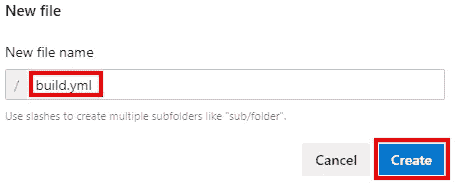

# Azure DevOps 管道:可重复使用的 YAML

> 原文：<https://itnext.io/azure-devops-pipelines-reusable-yaml-3cdf61e393aa?source=collection_archive---------2----------------------->

在这篇文章中，我们将重构我们的示例 Azure DevOps 管道，将一些冗余的 YAML 移到一个新文件中，并替换主 YAML 文件中的冗余部分。这篇文章将建立在前几篇文章中创建的 Azure DevOps 项目之上。如果您刚刚加入这个系列，请查看以前的帖子，了解项目的进展情况。

[Azure devo PS 入门](https://elanderson.net/2020/02/getting-started-with-azure-devops/)
[Azure devo PS 中的管道创建](https://elanderson.net/2020/03/pipeline-creation-in-azure-devops/)
[Azure DevOps 为 ASP.NET 核心发布工件](https://elanderson.net/2020/03/azure-devops-publish-asp-net-core/)
[Azure DevOps 管道:YAML 的多个作业](https://elanderson.net/2020/03/azure-devops-pipelines-multiple-jobs-in-yaml/)


## 从 YAML 开始

下面是我们当前管道的 YAML，它使用两个不同的作业构建两个不同的 web 应用程序。查看这两个作业，您会注意到它们都有相同的步骤。步骤上唯一的区别是构建哪个项目(WebApp1.csproj 或 WebApp2.csproj)以及用什么来调用发布的工件(WebApp1 或 WebApp2)。在开发应用程序时，我们绝不会容忍这种程度的重复，这同样适用于我们的管道。

```
trigger: none

variables:
  buildConfiguration: 'Release'

jobs:
- job: WebApp1
  displayName: 'Build WebApp1'
  pool:
    vmImage: 'ubuntu-latest'

  steps:
  - task: UseDotNet@2
    displayName: 'Use .NET 3.1.x'
    inputs:
      packageType: 'sdk'
      version: '3.1.x'

  - task: DotNetCoreCLI@2
    displayName: 'Build'
    inputs:
      command: 'build'
      projects: '**/WebApp1.csproj'
      arguments: '--configuration $(buildConfiguration)' 

  - task: DotNetCoreCLI@2
    displayName: 'Publish Application'
    inputs:
      command: 'publish'
      publishWebProjects: false
      projects: '**/WebApp1.csproj'
      arguments: '--configuration $(buildConfiguration) --output $(Build.ArtifactStagingDirectory)'

  - task: PublishPipelineArtifact@1
    displayName: 'Publish Artifacts'
    inputs:
      targetPath: '$(Build.ArtifactStagingDirectory)'
      artifact: 'WebApp1'
      publishLocation: 'pipeline'

- job: WebApp2
  displayName: 'Build WebApp2'
  pool:
    vmImage: 'ubuntu-latest'

  steps:
  - task: UseDotNet@2
    displayName: 'Use .NET 3.1.x'
    inputs:
      packageType: 'sdk'
      version: '3.1.x'

  - task: DotNetCoreCLI@2
    displayName: 'Build'
    inputs:
      command: 'build'
      projects: '**/WebApp2.csproj'
      arguments: '--configuration $(buildConfiguration)' 

  - task: DotNetCoreCLI@2
    displayName: 'Publish Application'
    inputs:
      command: 'publish'
      publishWebProjects: false
      projects: '**/WebApp2.csproj'
      arguments: '--configuration $(buildConfiguration) --output $(Build.ArtifactStagingDirectory)'

  - task: PublishPipelineArtifact@1
    displayName: 'Publish Artifacts'
    inputs:
      targetPath: '$(Build.ArtifactStagingDirectory)'
      artifact: 'WebApp2'
      publishLocation: 'pipeline'
```

## 添加新文件

为了解决上面的重复问题，我们需要从上面获取共享的步骤，并将它们移动到可以重用的地方。我们将使用 Azure DevOps 网站逐步完成这些步骤，并直接提交到主分支，但是这些相同的步骤可以在本地执行，也可以在任何分支的 web 上执行。首先，从网站的 Repos 部分，我们需要添加一个新文件，方法是在我们希望添加文件的级别单击三个点。在这种情况下，我们将添加到回购的根目录，但相同的选项在任何文件夹上都可用。


一个对话框将显示您可以输入新文件名**的位置，在这种情况下，我们将使用 build.yml。接下来，点击**创建**继续。**



## 共享 YAML

现在我们有了一个新文件，我们可以开始构建新的 YAML，它将处理原始作业中的重复步骤。我们要做的第一件事是定义一组可以调用这组步骤的**参数**。我们将使用它来传递构建什么项目，使用哪个构建配置，以及发布的工件的名称。下面是我们参数的定义。

```
parameters:
- name: buildConfiguration
  type: string
  default: 'Release'
- name: project
  type: string
  default: ''
- name: artifactName
  type: string
  default: ''
```

然后，我们可以使用 **${{ parameterName }}** 语法在文件的其余部分使用这些参数。注意，使用 **$(variableName)** 语法也可以使用任何管道变量。下面的 YAML 代码在参数行中显示了这两种类型。

```
- task: DotNetCoreCLI@2
  displayName: 'Publish Application'
  inputs:
    command: 'publish'
    publishWebProjects: false
    projects: '**/${{ parameters.project }}'
    arguments: '--configuration ${{ parameters.buildConfiguration }} --output $(Build.ArtifactStagingDirectory)'
```

虽然您可以使用管道变量，但我建议通过参数传递您需要的所有值，原因与我们在进行一般编程时尽量避免使用全局变量相同。我在这里使用两者来显示每一个的用法。以下是我们新档案中的完整 YAML。

```
parameters:
- name: buildConfiguration
  type: string
  default: 'Release'
- name: project
  type: string
  default: ''
- name: artifactName
  type: string
  default: ''

steps:
  - task: UseDotNet@2
    displayName: 'Use .NET 3.1.x'
    inputs:
      packageType: 'sdk'
      version: '3.1.x'

  - task: DotNetCoreCLI@2
    displayName: 'Build'
    inputs:
      command: 'build'
      projects: '**/${{ parameters.project }}'
      arguments: '--configuration ${{ parameters.buildConfiguration }}' 

  - task: DotNetCoreCLI@2
    displayName: 'Publish Application'
    inputs:
      command: 'publish'
      publishWebProjects: false
      projects: '**/${{ parameters.project }}'
      arguments: '--configuration ${{ parameters.buildConfiguration }} --output $(Build.ArtifactStagingDirectory)'

  - task: PublishPipelineArtifact@1
    displayName: 'Publish Artifacts'
    inputs:
      targetPath: '$(Build.ArtifactStagingDirectory)'
      artifact: ${{ parameters.artifactName }}
      publishLocation: 'pipeline'
```

最后，提交对新文件的更改。

## 使用共享 YAML

并不是说我们在两个构建作业之间有相同的 YAML，我们可以切换回我们的主 YAML 文件，在示例中的 **azure-pipelines.yml** ，并删除我们想要替换的步骤。虽然这两个作业都有一个 steps 部分，但是我们在其中留下的惟一东西是对我们的另一个 YAML 文件的模板调用，对于这个示例来说是 **build.yml** ，它传递参数来运行另一个文件。下面是生成的 YAML 文件，突出显示了对两个作业中共享文件的调用。

```
trigger: none

variables:
  buildConfiguration: 'Release'

jobs:
- job: WebApp1
  displayName: 'Build WebApp1'
  pool:
    vmImage: 'ubuntu-latest'

  steps:
  - template: build.yml
    parameters:
      buildConFiguration: $(buildConfiguration)
      project: WebApp1.csproj
      artifactName: WebApp1

- job: WebApp2
  displayName: 'Build WebApp2'
  pool:
    vmImage: 'ubuntu-latest'

  steps:
  - template: build.yml
    parameters:
      buildConFiguration: $(buildConfiguration)
      project: WebApp2.csproj
      artifactName: WebApp2
```

## 包扎

能够从您的 YAML 文件中删除重复应该有助于提高您的管道的可维护性。我知道示例没有显示出来，但是模板只是一个步骤，您可以在它之前或之后有其他步骤，就像您处理正常任务一样。

*最初发表于* [*埃里克·安德森*](https://elanderson.net/2020/03/azure-devops-pipelines-reuseable-yaml/) *。*