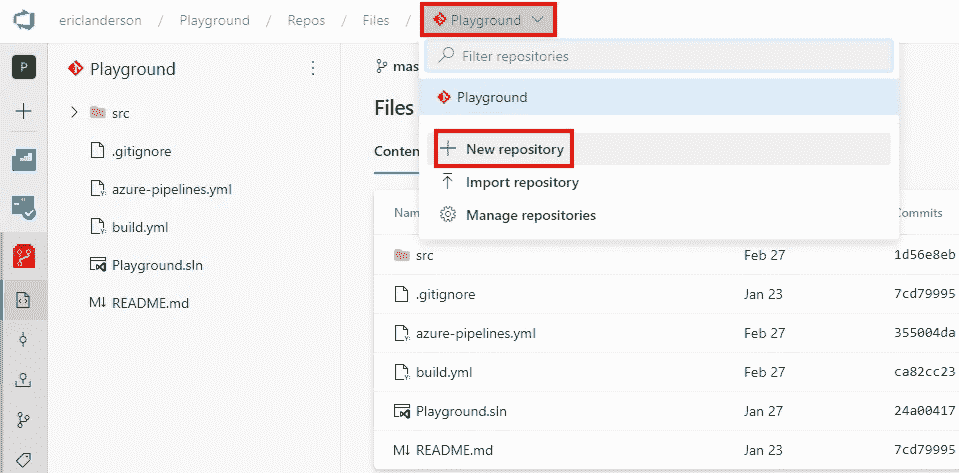
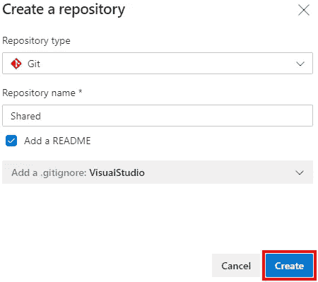
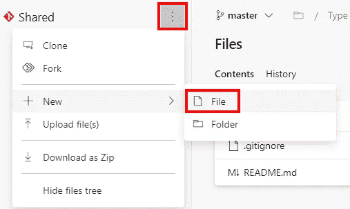
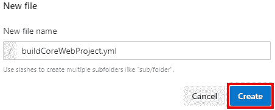

# Azure DevOps 管道:跨回购使用 YAML

> 原文：<https://itnext.io/azure-devops-pipelines-use-yaml-across-repos-1faa8d2409b?source=collection_archive---------6----------------------->

在上周的帖子中，我们将一些可重用的 YAML 重构为一个新文件。这篇文章将介绍如何将相同的可重用 YAML 迁移到一个新的回购中，然后在我们现有的示例回购中使用它。这篇文章将建立在以前文章中创建的 Azure DevOps 项目的基础上，如果你刚刚加入这个系列，请查看以前的文章，了解该项目的进展情况。

[Azure devo PS 入门](https://elanderson.net/2020/02/getting-started-with-azure-devops/)
[Azure devo PS 中的管道创建](https://elanderson.net/2020/03/pipeline-creation-in-azure-devops/)
[Azure DevOps 为 ASP.NET 核心发布工件](https://elanderson.net/2020/03/azure-devops-publish-asp-net-core/)
[Azure DevOps 管道:YAML 的多个作业](https://elanderson.net/2020/03/azure-devops-pipelines-multiple-jobs-in-yaml/)
[Azure DevOps 管道:可重用的 YAML](https://elanderson.net/2020/03/azure-devops-pipelines-reuseable-yaml/)


## 创建新的存储库

首先，我们需要创建一个新的存储库，用于共享正在讨论的 YAML。使用 Azure DevOps 的 **Repos** 部分作为起点，单击带有当前选择的 repo 名称的下拉菜单，在本例中为 **Playground** ，然后单击 **New repository** 。



您将会看到一个对话框，在这里您需要输入**库名**和任何其他您想要配置的选项。在本例中，我们将 repo 命名为 Shared，并为 Visual Studio 添加了一个 Git ignore 文件。完成后点击**创建**按钮。



应对新的共享回购采取以下步骤。此时，您可以克隆回购并在本地执行其余步骤，然后将更改推送到回购，或者您可以使用 web 界面进行所有更改，这是本文将要展示的路线。无论哪种方式，你去不应该太难适应的步骤。对于在回购根目录中添加新文件的 web 界面，单击回购名称右侧的三点菜单，然后选择**新建**，然后选择**文件**。



下一个提示会要求输入文件名，我用的是**buildcorewebproject . yml**。点击**创建**继续。



您将进入文件编辑器。将前一篇文章中使用的 build.yml 中的代码复制并粘贴到新文件中。以下是来自 build.yml 的完整 YAML，供参考。

```
parameters:
- name: buildConfiguration
  type: string
  default: 'Release'
- name: project
  type: string
  default: ''
- name: artifactName
  type: string
  default: ''

steps:
  - task: UseDotNet@2
    displayName: 'Use .NET 3.1.x'
    inputs:
      packageType: 'sdk'
      version: '3.1.x'

  - task: DotNetCoreCLI@2
    displayName: 'Build'
    inputs:
      command: 'build'
      projects: '**/${{ parameters.project }}'
      arguments: '--configuration ${{ parameters.buildConfiguration }}' 

  - task: DotNetCoreCLI@2
    displayName: 'Publish Application'
    inputs:
      command: 'publish'
      publishWebProjects: false
      projects: '**/${{ parameters.project }}'
      arguments: '--configuration ${{ parameters.buildConfiguration }} --output $(Build.ArtifactStagingDirectory)'

  - task: PublishPipelineArtifact@1
    displayName: 'Publish Artifacts'
    inputs:
      targetPath: '$(Build.ArtifactStagingDirectory)'
      artifact: ${{ parameters.artifactName }}
      publishLocation: 'pipeline'
```

一旦代码被复制，点击 **Commit** 按钮保存对主分支的修改。


切换回我们最初的回购，**游乐场**在这个例子中，我们需要在我们的 **azure-pipelines.yml** 文件中添加**共享**回购作为资源。下面是使用另一个 Azure DevOps repo 的资源交付。[签出多个存储库](https://docs.microsoft.com/en-us/azure/devops/pipelines/repos/multi-repo-checkout?view=azure-devops)的官方文档也展示了 GitHub 和 Bitbucket 的例子。我还发现他的 stackoverflow 问题很有帮助。

```
resources: 
  repositories: 
  - repository: Shared 
    name: Playground/Shared 
    type: git 
    ref: master #branch name
```

存储库行上的 **Shared** 是我们在共享存储库中引用文件时将使用的名称。**名称**是 Azure DevOps 项目和回购名称。**类型**是回购类型，在我们的例子中是 Git。最后， **ref** 是我们想要使用的共享回购的分支名称。既然我们可以从共享存储库中访问文件，我们可以使用它的 buildCoreWebProject.yml 而不是本地的 build.yml 作为模板。

```
Before:
  - template: build.yml
    parameters:
      buildConFiguration: $(buildConfiguration)
      project: WebApp1.csproj
      artifactName: WebApp1

After:
  - template: buildCoreWebProject.yml@Shared
    parameters:
      buildConFiguration: $(buildConfiguration)
      project: WebApp1.csproj
      artifactName: WebApp1
```

注意，唯一的变化是在**模板**行上，从 **build.yml** 变成了**buildcorewebproject . yml @ Shared**。文件名末尾的@Shared 告诉管道文件的来源是共享的 repo。以下是完整的 azure-pipeline.yml 供参考。第一项工作是使用共享回购的模板，第二项工作是使用本地模板。

```
resources:      
  repositories: 
  - repository: Shared
    name: Playground/Shared
    type: git 
    ref: master #branch name

trigger: none

variables:
  buildConfiguration: 'Release'

jobs:
- job: WebApp1
  displayName: 'Build WebApp1'
  pool:
    vmImage: 'ubuntu-latest'

  steps:
  - template: buildCoreWebProject.yml@Shared
    parameters:
      buildConFiguration: $(buildConfiguration)
      project: WebApp1.csproj
      artifactName: WebApp1

- job: WebApp2
  displayName: 'Build WebApp2'
  pool:
    vmImage: 'ubuntu-latest'

  steps:
  - template: build.yml
    parameters:
      buildConFiguration: $(buildConfiguration)
      project: WebApp2.csproj
      artifactName: WebApp2
```

## 包扎

能够从不同的回购中利用 YAML 可以帮助减少重复的 YAML，并有助于保持您的回购渠道更加清洁。与其他任何东西一样，如果应用得当，这是一个有用的工具。

*原载于* [*埃里克·安德森*](https://elanderson.net/2020/04/azure-devops-pipelines-use-yaml-across-repos/) *。*