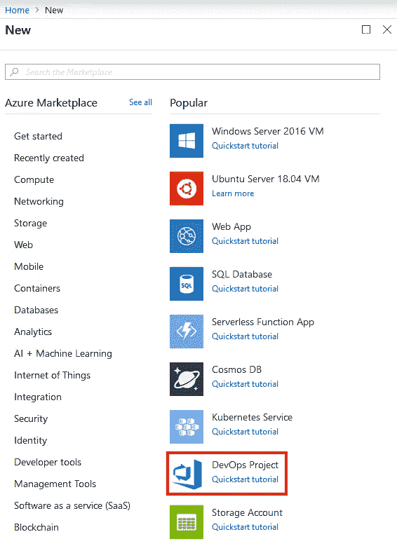
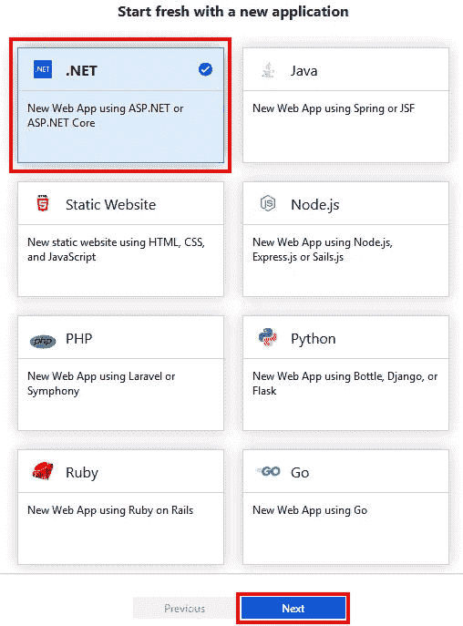
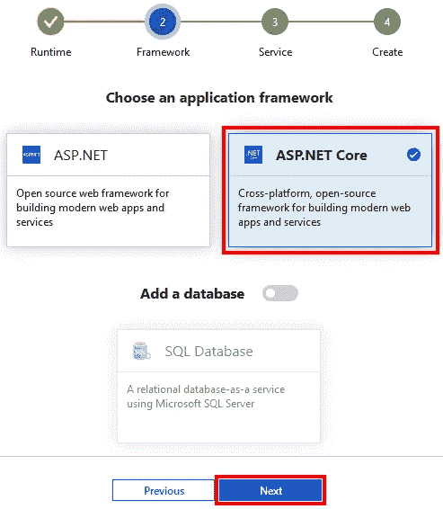
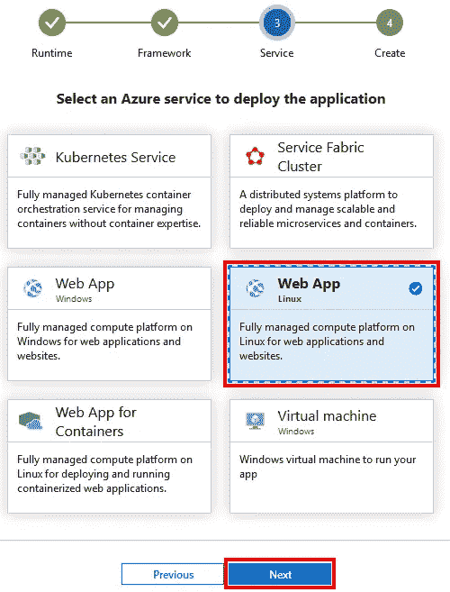
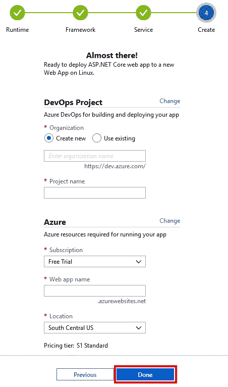
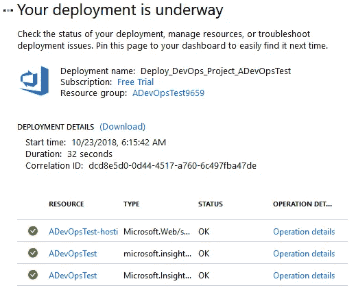
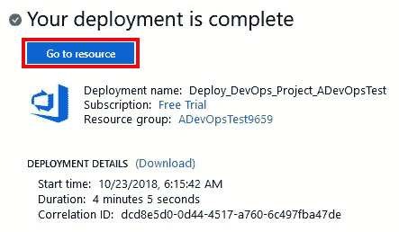
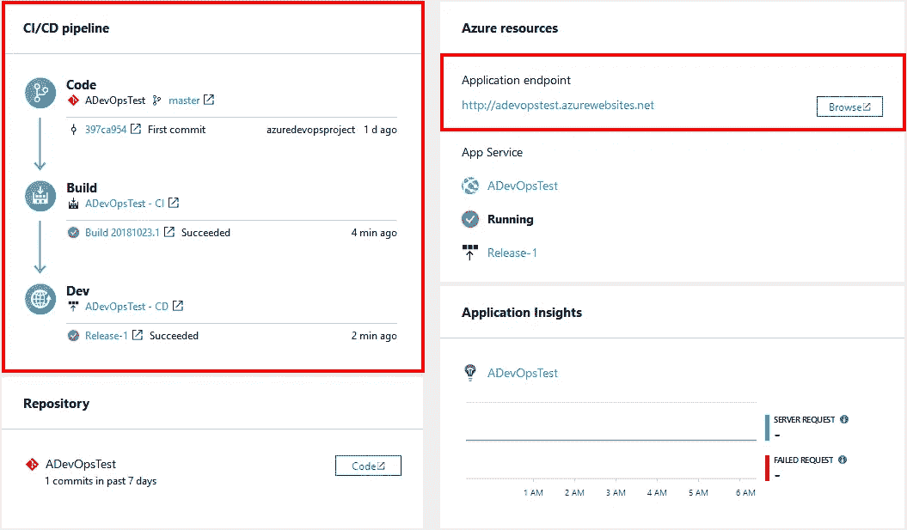
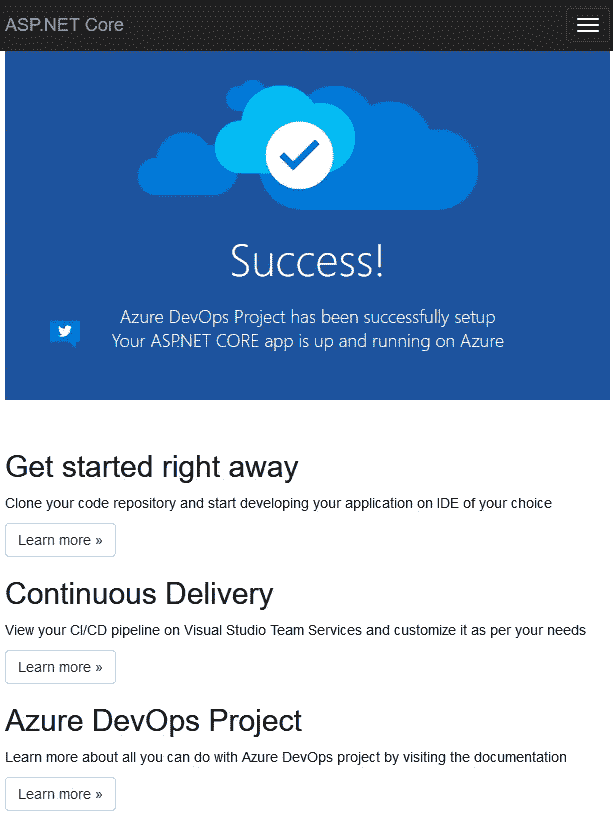

# Azure DevOps 项目

> 原文：<https://itnext.io/azure-devops-project-d80337bed67e?source=collection_archive---------0----------------------->

在上周关于 Azure Pipelines:发布到 Azure 应用服务的帖子之后，我发现了一种更简单的方法来开始使用 Azure DevOps 和 Azure 应用服务。这篇文章将介绍这个从 Azure 门户端而不是 Azure DevOps 开始的过程。

这里的名字会有点混乱。当我说 Azure DevOps 时，我指的是 Visual Studio Team Services 的品牌重塑，其中包括针对董事会、回购、管道等的服务。当我说 Azure DevOps 项目，或只是 DevOps 项目时，我指的是这篇文章将从 Azure 门户端使用的项目类型。

## 创建 DevOps 项目

从 [Azure 门户](https://portal.azure.com)点击**创建资源**按钮。

对我来说， **DevOps 项目**是最受欢迎的项目之一。如果您没有看到它的列表，您可以使用顶部的搜索来找到它。单击 DevOps 项目开始该过程。

在下一页上，您可以选择使用许多不同的语言启动一个新的应用程序，或者部署一个现有的应用程序。在本例中，我们将选择。NET 并点击**下一个**按钮。这个屏幕是一个很好的例子，说明微软是如何努力支持不仅仅是. NET。

因为。NET 的下一个选择是 ASP.NET 或 ASP.NET 核心。毫无疑问，我确定我们会选择 ASP.NET 核心。还有一个添加数据库的选项，但是我们不会在这个例子中使用它。点击**下一步**继续。

下一步是选择新应用应该在哪个 Azure 服务上运行。我们将使用一个 **Linux Web 应用程序**来匹配上周运行的示例。点击**下一步**继续。

下一个屏幕上有相当多的设置，但它们都非常清楚。第一组设置是针对 Azure DevOps 项目的，你可以使用一个现有的帐户，或者这个过程会为你创建一个。需要一个**项目名称**。

下一组设置是为将要创建的 **Azure 应用服务**设置的。如果您只有一个订阅，则应该默认订阅。Web app name 将控制 Azure 提供的 URL 以及创建的资源的命名。点击**完成**开始创建过程。

## 部署

点击上面的按钮后，将开始部署所有需要的资源。这个过程需要一段时间。在部署过程中，门户会将您重定向到如下所示的状态页面。我花了 4 分多钟才完成。

当部署完成时，点击**转到资源**按钮。

## 结果

该项目的**概述**页面对整个 CI/CD 管道进行了很好的总结，该管道通过链接到相关的 Azure DevOps 页面来管理每个步骤。Azure resources 部分将提供您可以用来访问正在运行的应用程序的 URL。

生成的应用程序应该类似于下图。

## 包扎

如果你打算使用 Azure，这个过程是一个更容易的开始。如果你读了上周的帖子，你就会知道有很多东西需要手动创建，即使这样，它也没有这个设置提供的好的概述。

*原载于***。**