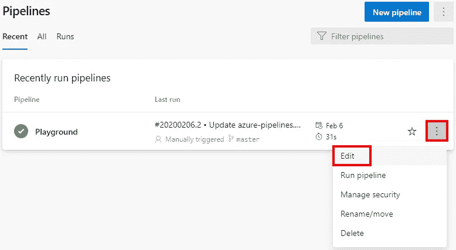
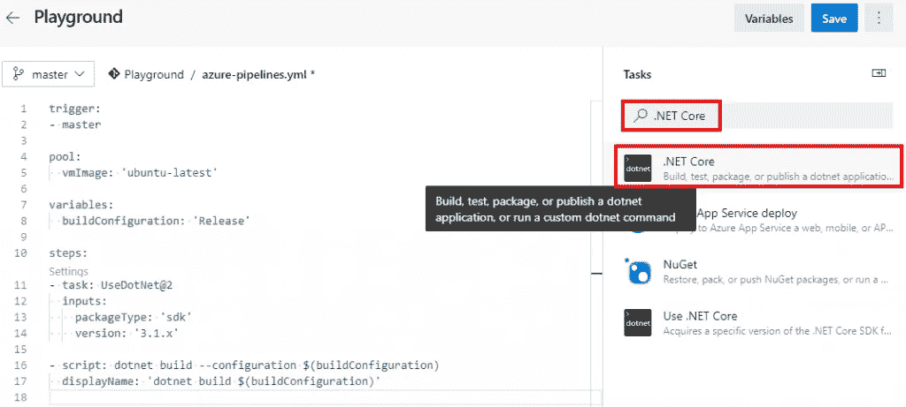
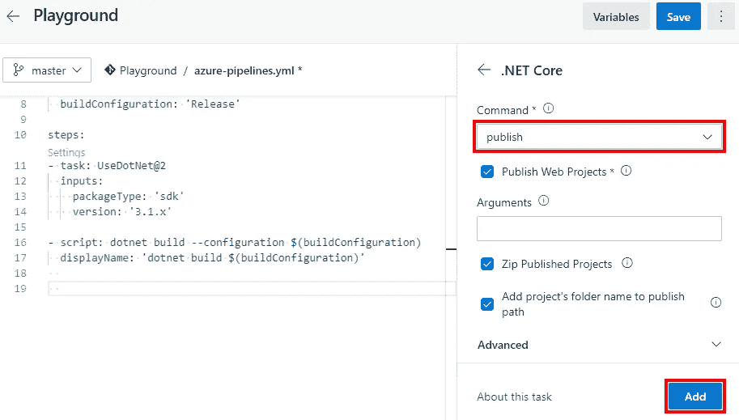
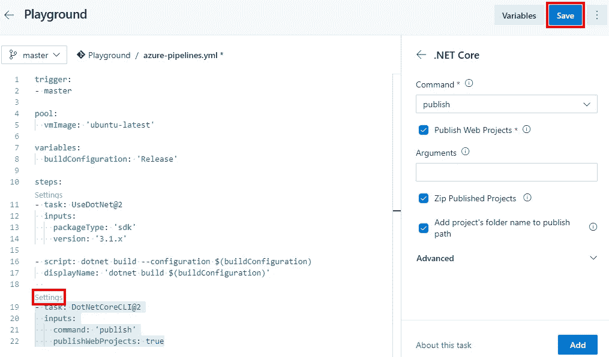
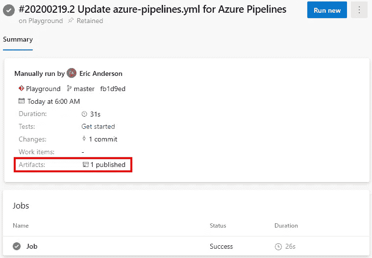
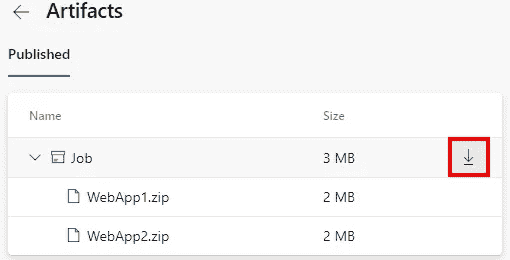

# Azure DevOps 为 ASP.NET 核心发布工件

> 原文：<https://itnext.io/azure-devops-publish-artifacts-for-asp-net-core-ee85169deb35?source=collection_archive---------2----------------------->

这篇文章将建立在我们在前几篇文章中创建的 Azure DevOps 项目的基础上，并让构建管道到达你拥有应用程序二进制文件的地方。如果你刚刚加入这个系列，看看之前的文章。

[Azure DevOps 入门](https://elanderson.net/2020/02/getting-started-with-azure-devops/)
[在 Azure devo PS 中创建管道](https://elanderson.net/2020/03/pipeline-creation-in-azure-devops/)


## 编辑管道

首先，我们需要回到我们正在处理的管道。从项目菜单中选择**管道**。


这将使您进入一个页面，其中列出了您最近运行的管道。如果您没有看到您的管道列表，您可能需要单击页面顶部附近的“全部”选项。由于我们在这个项目中只有一个管道，我们可以使用省略号打开一个上下文菜单，然后单击 **Edit** 。



## 发布应用程序

此时，我们管道的 YAML 如下所示。

```
trigger:
- master

pool:
  vmImage: 'ubuntu-latest'

variables:
  buildConfiguration: 'Release'

steps:
- task: UseDotNet@2
  inputs:
    packageType: 'sdk'
    version: '3.1.x'

- script: dotnet build --configuration $(buildConfiguration)
  displayName: 'dotnet build $(buildConfiguration)'
```

管道目前会告诉我们所包含的项目是否构建，但不会向我们提供构建的结果。使用右侧的任务面板搜索**。NET Core** 任务然后点击产生的任务。这是您希望用来调用任何。NET CLI 命令。



使用**命令**的下拉菜单，选择**发布**。对于这个示例，其余设置的默认值就可以了。最后，点击**添加**将任务添加到 YAML 文件中。



以下是由此产生的 YAML。

```
trigger:
- master

pool:
  vmImage: 'ubuntu-latest'

variables:
  buildConfiguration: 'Release'

steps:
- task: UseDotNet@2
  inputs:
    packageType: 'sdk'
    version: '3.1.x'

- script: dotnet build --configuration $(buildConfiguration)
  displayName: 'dotnet build $(buildConfiguration)'

- task: DotNetCoreCLI@2
  inputs:
    command: 'publish'
    publishWebProjects: true
```

在我们继续之前，我想指出 YAML 编辑器中任务上方的**设置**链接。单击**设置**会将该任务加载到屏幕右侧的任务面板中，您可以在其中进行更改，然后如果您点击“添加”按钮，它会用一个新任务替换您现有的任务，并选择新选项。注意不要改变 YAML 编辑器中的选择，因为添加按钮只是替换选定的文本，而不是记住你点击设置的任务。完成后，点击**保存**按钮，完成提交过程。完成后，点击**运行**按钮执行流水线。



## 发布构建工件

管道运行应该会成功，但是我们仍然没有任何可以使用的文件。了解管道中可用的变量以及如何使用它们是 Azure 管道入门最难的部分之一。对于我们的例子，我们试图获得由上面的发布步骤创建的两个 zip 文件，这意味着我们的管道将需要发布工件以使文件可用。我们将使用 builtin **Build 调整上面的 publish 命令和一个输出目录。ArtifactStagingDirectory** 变量。以下是修改后的完整任务。

```
- task: DotNetCoreCLI@2
  inputs:
    command: 'publish'
    publishWebProjects: true
    arguments: '--configuration $(buildConfiguration) --output $(Build.ArtifactStagingDirectory)'
```

对于工件暂存目录中的文件，我们需要使用发布管道工件任务来发布这些文件。下面是将工件暂存目录发布到管道的完整任务。

```
- task: PublishPipelineArtifact@1
  inputs:
    targetPath: '$(Build.ArtifactStagingDirectory)'
    publishLocation: 'pipeline'
```

作为参考，以下是包含上述所有变更的管道的完整 YAML。

```
trigger:
- master

pool:
  vmImage: 'ubuntu-latest'

variables:
  buildConfiguration: 'Release'

steps:
- task: UseDotNet@2
  inputs:
    packageType: 'sdk'
    version: '3.1.x'

- script: dotnet build --configuration $(buildConfiguration)
  displayName: 'dotnet build $(buildConfiguration)'

- task: DotNetCoreCLI@2
  inputs:
    command: 'publish'
    publishWebProjects: true
    arguments: '--configuration $(buildConfiguration) --output $(Build.ArtifactStagingDirectory)'

- task: PublishPipelineArtifact@1
  inputs:
    targetPath: '$(Build.ArtifactStagingDirectory)'
    publishLocation: 'pipeline'
```

保存并运行管道。当管道完成时，在结果页面上，您将看到 1 个发布的工件。



点击 **1 出版**，它会带你到一个列出文物的页面。如果您将鼠标悬停在任一行上，您将看到下载相关文件的选项。



## 快速提示

正如我在上面所说的，要弄清楚什么目录在哪里是一件痛苦的事情。如果您需要查看哪些文件在哪里，您可以使用下面的发布任务，通过发布管道的整个工作区来输出管道正在使用的全套文件。这在过去帮助我确定了自己的方向。

```
- task: PublishPipelineArtifact@1
  inputs:
    targetPath: '$(Pipeline.Workspace)'
    publishLocation: 'pipeline'
```

## 包扎

我们的管道现在已经有了可以部署的文件。希望这给你自己的构建管道一个良好的开端。Azure Pipelines 是一个巨大的主题，这是一个非常基础的构建，所以请关注未来关于这个主题的更多帖子。

*原载于*[](https://elanderson.net/2020/03/azure-devops-publish-asp-net-core/)**。**